# 格局篇2：我们所做的一切都是为了更大概率的让有钱的单子和自己有关 - P1 - 赏味不足 - BV1yz4y1L7fx

嗯好大家好呃，为什么是格局偏一是吧，因为我今天才发现，其实昨天是那个格局篇一里面有个六啊。

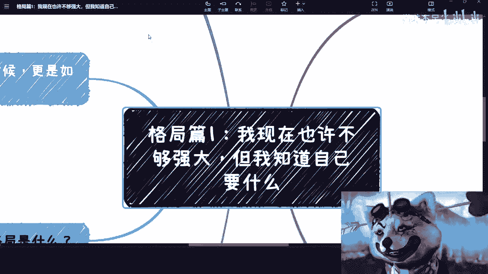

有个六我竟然没讲，我今天看到时候我就在想哎呀我昨天有没有讲，我感觉好像我没讲啊，我来补一下啊，呃所以说呢就是说你要什么啊。

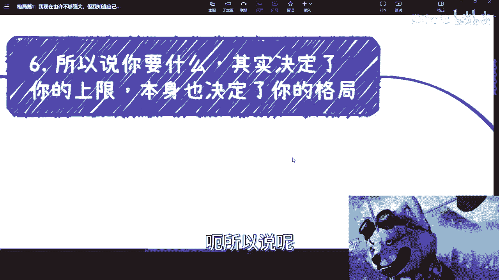

其实决定了你的上限啊，本身也决定了你的格局对吧。

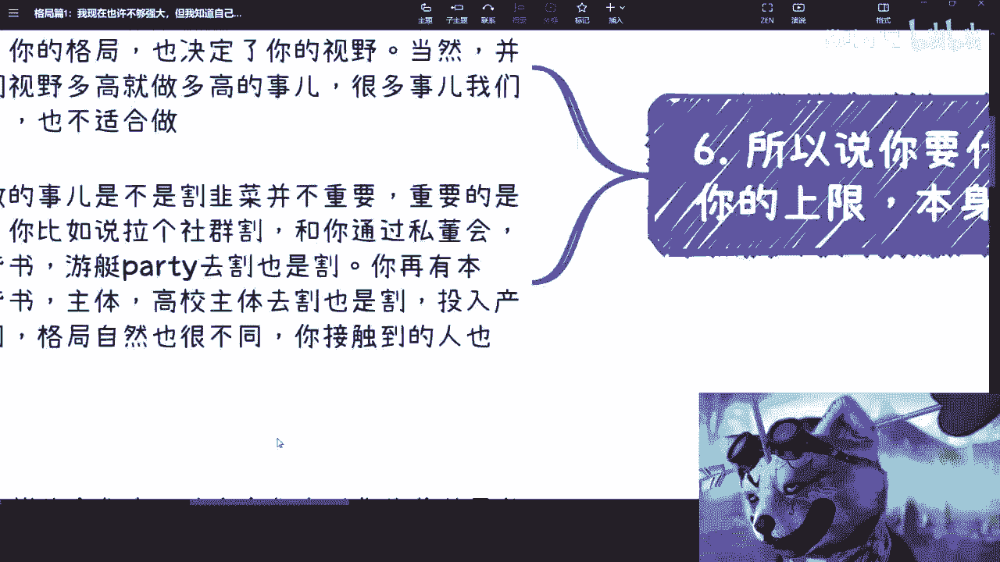

那么你比如说啊，你说啊你你就这么想啊，你告诉别人你的目标是什么对吧，你一般比如说你跟别人初次见面或者聊着聊着，人家一定会问你吗，你想做什么对吧，那么你跟别人说做什么的时候，或者你想做什么的时候。

其实已经决定了你的格局和你的视野，为什么呢，因为你就这么想嘛，你讲出来的一个解决方案，或者你讲出来的一个东西对吧，那么对方从这件事情当中就能够去判断得出来，你的视野是有多大，好多广，你的格局有多高对吧。

其实是这样子的啊，当然并不是说我们的视野多高，或者就是就是说呃多广，然后格局多高，就一定要做多高的事情对吧，很多时候呢这个很多事情我们知道，但是的确我们做不了对吧，我们也不适合做啊。

但是呢我觉得在这种就是说沟通当中，我其实昨天也说的很清楚嘛，就是说在沟通当中我们要让别人明白，就是很多东西我们是知道的啊，不是说我们这个这个人你讲出来一个东西，别人就会感觉我靠太low了对吧，你对吧。

这就是当然人家也不会当面说你low对吧，但是嗯你懂吧啊，那么当然啊你做的事呢是不是割韭菜，其实本不是很重要，因为嗯就我在这个地方也说这句话吧，就是说大家也懂啊，就真的你要说割韭菜，你从整个社会角度来讲。

从上到下哪个东西他不割韭菜，对不对啊，就是说我觉得不用这么嗯就纠结于这三个字啊，没有太大必要，那重要的是你的布局啊，你比如说你拉了一个社群去割对吧，呃和你对吧，去做了一个四总会对吧，通过各种背书吧。

游艇party呀对吧，然后通过这种比如说闭门会议啊去隔，那也是格对吧，你再有本事对吧，你说你找了一些官方评书对吧，找了一些主体，找了一些高校对吧，能够跟你联合去隔，那也是格对吧，那投入产出比也不同对吧。

格局当然也不同，你接触到的人也不同，你知道吗，就是说其实很多时候呢，嗯这些东西都是相辅相成的啊，所以说就是说我们不用太就是不要太自己，就是说YY在那边意淫说啊，我要做什么，我要做什么没有用。

你先去看看这世界上大家在做什么，你再去决定你做什么对吧，你你说我连地图都没探过，你说我就开始干了，那你能干出来得啥来，你说是不是啊，好那这个就就不去管它了啊，我们这个进入今天的这个核心啊，哎呀等一下啊。

我切个切个屏幕啊，因为它这个共享不太一样。

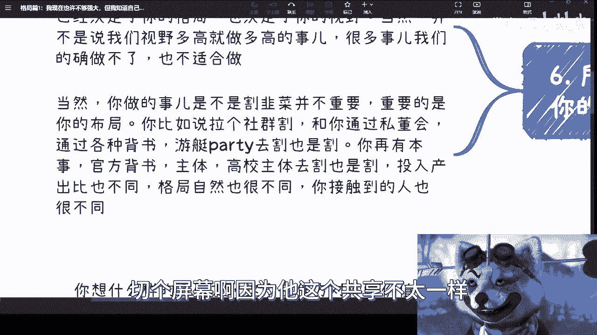

好啊，格局偏二啊，格局片二比就格局篇二呢说的什么呢。

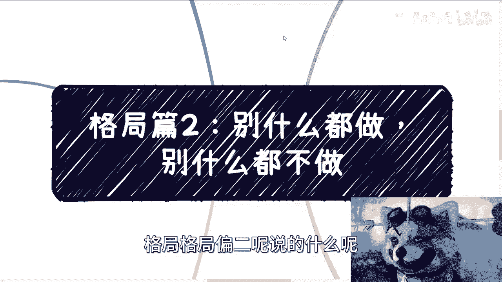

说的是你别什么都做，也别什么都不做啊，什么意思啊。

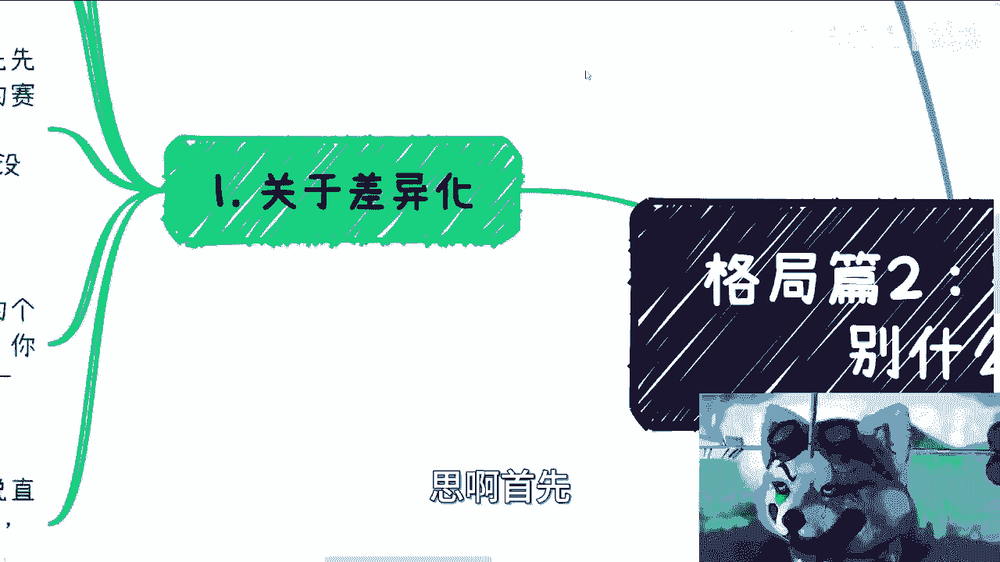

首先我们做很多事情的时候对吧，我们都在说一件事情是什么叫做差异化啊。

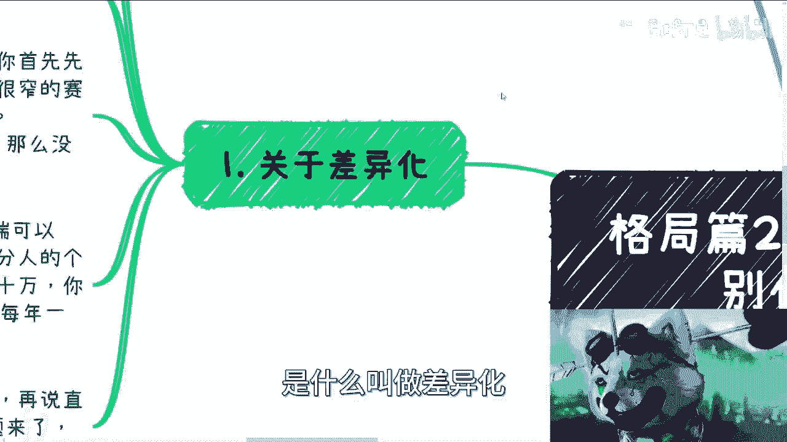

那么我们需要时刻记住的是什么呢，就是你无论做什么，你一定要记住，我们不是最聪明啊，啊哪怕就是我们是最聪明的，我们也不是唯一的最聪明的，对吧啊，没有什么东西是我们想的出来，别人想不出来的。

你一定要时刻记住这句话啊，包括就是不包括就是买彩票也是一样的，你要时刻记住，就是你种得到别人也中得到，那你中不到也就是正常的对吧，就一个道理啊，那么时刻记住就说我们做什么呢，我们的竞争对手很多啊。

呃不要就是说用自己的认知去感觉，哎你说我感觉这个市场上好像做的人很少，没有用的，五一竞争对手一定是多的，因为你要明白在全球整个地球上面对吧，就是最思维活络对吧，最这个这个使小聪明的就是中国人啊。

你要明白就是我们的竞争对手很多，只不过我们不认识，我们不知道，但是不代表没有啊，那么关于是不是差异化这个问题啊，其实我觉得其实并不重要，因为什么，因为你要这么想，你首先先要评估你要的蛋糕有多大对吧。

你比如说啊你跟我说，你说你呃要的目标是一年赚100个亿对吧，好啊，那没问题，那那你去差异化等等，我我当我当我放屁对吧，当我没说过啊，但是比如说啊，你说你今天在一个很窄的赛道，当然啊一般来讲很窄的赛道。

C端是参与不了的啊，但是呢whatever啊，就是说假设整体的蛋糕它就很小，然而呢你非要去切哦，你说你非要去学，因为一般来讲啊，蛋糕整体很小的时候，其实已经切得7788了啊，再加上就是说如果蛋糕很小。

那么很有可能它的门槛很高啊，但凡它的蛋糕很小，同时门槛又不高的情况，下面或者不是那么高的情况下，也轮不到你去切，对不对，那么你非要去切的时候，那么我就告诉你，你必须差异化对吧。

但是啊大部分的时候我们我相信你们也好，我也好，我们作为一个普通老百姓，我们能切的蛋糕，但凡C端可以切，门槛又不是特别高的话，无论这个蛋糕多小啊，到了大部分身上其实也就够了，你知道吗。

就像我刚我这边举的例子，我说一般一单啊，我们就说商业啊，比如说一般一单十几万或者小几10万对吧，我觉得其实差大差不差嘛，这属于一个起步嘛对吧，你一年做个啊，当然我说的是利润啊，我说的是利润啊。

你比如说你一年做的两三单差不多呀，哥哥们是不是啊，你你咋地啊，你想怎么滴啊，你想一年一个小目标呀对吧，那也不可能啊，是吧啊，所以说啊本身你需要去积累的是自己的竞争力，就再说直白一点。

我跟所有人咨询的时候，我都说过这句话，叫什么叫做你要让case落到你的头上，你知道吗，就你会发现所有的问题，归根结底就是到这句话上面来讲哦，那么这个问题来了，怎么落到你头上好。

这个就是我们今天隔绝二啊，要来讲的这个核心点啊，那么第一点啊。

你给别人的印象是什么，首先啊你要明白一点耶，啊这个我关掉啊，首先你给别人的印象是什么，就等于你在什么赛道上卷，你知道吗，就是还是那句话，因为你活在世界上，你的钱不是自己来印的，你的钱也不是别人硬给你的。

是别人认为你有价值，或者来说你让别人认为你有价值，别人付给你的对吧，所以说啊我们虽然是不在乎别人的眼光，但是别人你在别人脑子里面，在别人的眼光里面到底长什么样子，就会取决于你到底在什么赛道卷。

而你真正在什么的是什么赛道卷，一点都不重要啊，比如说你是某某某公司的，对不对，好你们就这么想啊，大概率啊，你们是某某公司的，他只会记住你的公司，为什么，因为你这个人并不重要啊，因为你相对公司。

我相对公司，每个人相对它的主体都是渺小的，无论你多么牛逼，那除非你是创始人对吧，那那另外一件事情对吧，那你说我们作为一个老百姓，我们作为一个打工的对吧，你作为公司，你相对公司你都是渺小的。

那对方一定会记住你的公司，因为你公司是有价值的，而你对他没有这么大的价值啊，这是第一点，那么你会发现就如果是这么个情况，那么你就是在打工这条赛道上去卷的啊，我不管你跟对方到底怎么说啊。

那么你但凡让对方是这么个印象，那么你就是在打工赛道上取决对吧，这是第一点啊，那比如说你是拉皮条的对吧，也就是我们所说的撮合业务，那么这个问题来了对吧，对方要看的第一啊，比如说你以前合作过的case对吧。

你说拉皮条，你说跟谁关系好，那他妈我还说我上面有人呢，你说是吧，那那那那说谁不会说啊对吧，那一是你的合作过的case，有没有你历史经验有哪些对吧，这是第一点，第二点你的资源如何对吧。

你的你的就是我说上面有人对吧，那你这个人到底是谁，它能够提供哪些服务对吧，你不要你比如说有很多人跟我说，我跟卫健委，卫健委合作对吧，我跟卫健委有关系，那你要明确告诉我的卫建委谁哪个部门，怎么个关系对吧。

我以前咨询的时候，有一次就有一个人跟我咨询那个创业，我当时就问他，我说你别跟我讲，卫建委什么合作什么东西，我不关心的，我说我只关心一点，你告诉我你跟卫健委是哪个部门，谁有没有合同对吧。

然后比如说未经我这个牌子的logo，能不能给你们用，我只关心这点别的，他妈的这些我不关心他吃的呀，有什么好说的了，对不对，好，第三点就是你撮合的业务是不是很专一对吧，就是说你别比如说哎呀去年撮合区块链。

今年撮合METAVERSE啊，明年撮撮合AIGC，后年撮合数字人对吧，你一年你别说一年了，你半年半年变个方向，我跟你讲啊，就就那样吧就那样，第四也就是最后一点，就是你的自己的专业性如何啊，你们也看到了。

就是说我在这个地方写的啊，其实1234也是我是根据优先级写的，也是大家关心的这个优先级，你要明白你的专业性其实是排在最后一位的啊，这个没有办法的，为什么，因为你的专业性的价值。

体现出来的价值永远是最小的啊，除非是你是一个非常专业的，那那那我就说嘛，就是不在我们讨论范围吗对吧，你说你是一个非常专业的人，我的顶会上paper满天飞，那我无话可说是吧啊，还有一点啊。

你有你自己的专业性啊，还有一种啊，你有你自己的专业性，你其实是既可以拉皮条啊，你也其实是交付方或者来说服务方的一部分，那么对方的安心程度会更高啊，因为对方会知道你其实不单是给别人拉皮条。

其实你给自己拉的皮条，那么他会知道你上新的啊，否则你拉一个皮条，他就会觉得哎呀跟你没什么关系，你会不会坑我，你知道吧啊，那么还有关心什么呢，关心就说你有没有团队啊，那么这里又分成两部分。

一个是你自己有没有团队啊，包括全职兼职的，另外一方面是你有没有交付团队，包括全职和兼职的，还有合作方的，对吧好，那我这个事情呢，我其实前两天跟一个人线下聊的时候，我也跟他说，我说我说你就这么想嘛对吧。

你比如说啊，你说你去见一个人对吧，你觉得这个人不错啊，这个你去建一个叫什么就是协会啊，或者合作方对吧，你一次两次三次没关系，你别什么什么永远对吧，你说大家都要合作了啊，大家都要谈细节了。

大家都要怎么样呢，你让对方感觉啊，每次都是你啊，怎么都是你呢，How old are you，对吧，那本质上就是你别让别人感觉只有你一个人，只有你一个人，我跟你讲，无论你多靠谱都没有用，你知道吗。

因为你多靠谱，在商业上你都是渺小的，没有办法的，你整个商业，很多商业的case是需要大家合力来做的，你如果只是一个人，那么你你还是拥有可替代性，嗯没有办法的这个事情啊，那么我们就来说啊。

个人印象其实很重要，就是说也许呢你有很多业务啊，前两天有人跟我合同沟通的时候，他也提到，比如说自己有非常多业务，比如说有跨境电商啊对吧，有有有有什么呃咨询培训啊对吧，然后有什么什么可能跟这种鸿蒙啊对吧。

都有关系的啊，他说但我跟你讲呢，这个其实并不重要，你有什么业务呢，其实并不重要，重要的是别人只关心你能做什么，你的专业性是什么，你有什么资源，你知道吗，也就是说你有多少个业务，那是你的事情。

但是你要给到大家的感觉，一定要有根主线对吧，就比如说你这个人是一个专家型的人，还是是一个资源型的人，还是一个是一个是一个，比如说呃，比如说这个能够能够呃，自己产出一些解决方案的人对吧。

就是说你在别人的这边，一定要有个明确的一个一个定位对吧。

否则你怎么搞没法搞啊啊所以我跟你们讲。

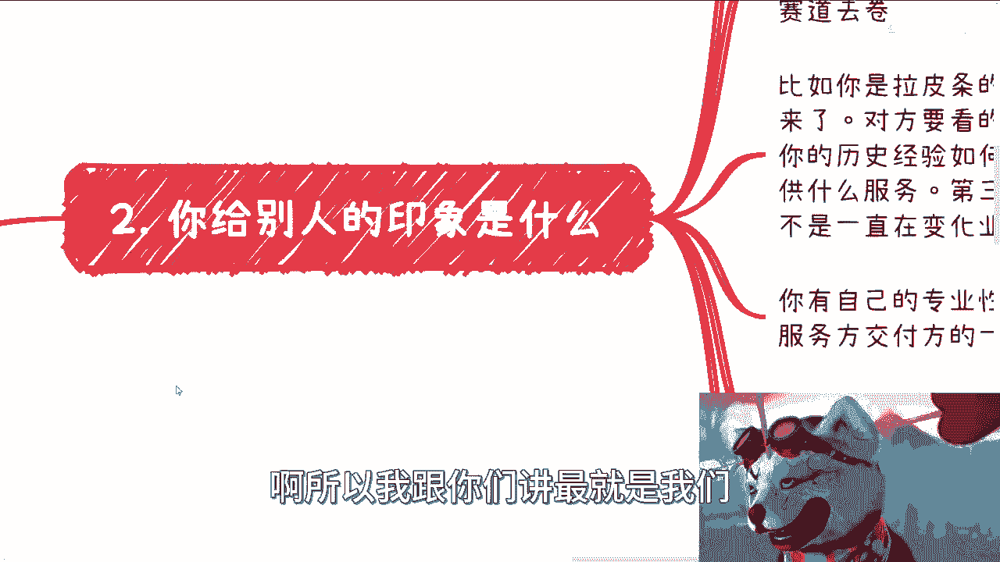

这就是我们刚刚说啊，就是说这个呃最终case要落到你的头上嘛对吧。

因为你不落到你头上，你是赚不到钱的嘛对吧，我不管你是真正的乙方，还是说你在整个产业链里面只是一个小外，小外包还是怎么样子，我不管你在整个链路当中的你是什么位置，但至少你得有一席之地，对不对，好。

那么我们就说你为了有这个一席之地，你首先第一个要做好的是什么，就是你给别人的印象一定要精准啊。

这是第一点啊，第二点关于跳单啊，关于跳单好，关于跳单这个事情呢，我觉得我得在这个地方补充一点，什么意思啊，就是从人性角度来讲，跳单是避免不了的，但你们别着急啊，你听我说下去啊。

你从法律角度来讲，我们必须签合同，我们必须在合同上面有违约条款，而且不单有合同，你还需要提前的大大方方的跟大家说，就说我是哪呀，我是拿多少的，就是你不要两头瞒对吧，你说我既满甲方也满乙方。

我跟你讲这个最好别做啊，你别两头瞒啊，就是你作为一个渠道方，你作为一个撮合方，你拿钱天经地义，你知道吧啊，那么大家都是做商业的对吧，同时你说我希望大家不要跳单对吧，因为我觉得就是中国有句老话说的好嘛。

就是你丑话说在前面嘛对吧，就是我给你们做服务，我要拿钱，这不是天经地义吗，难道我做慈善吗对吧，而且我对你们也不熟悉，我不是觉得你们一定会跳单，但是我先把丑话所说在前面，你们别跳单，对不对。

那我觉得这个也是有一定威慑性的啊，然而啊我觉得从博弈论角度来讲，跳单其实是完全可以避免的，怎么避免啊，你要这么想，避免跳单最大的方式就是让对方感觉，跳单给自己带来的损失是更大的，你明白这个道理吧。

就是说并不是让他这个强制性不跳单，而是让他自己真正的明白，我跳单对我是不利的对吧，简单来讲就是说你要让他感觉，你给他未来带来的价值空间会更大，他没必要跳过你，他跳过你可能就是一笔买卖，但他会觉得不划算。

你明白我意思吧，啊那么当然你说怎么让对方感觉更大，那这个事儿绝绝对他就需要一个综合能力对吧，你比如说需要你控场啊，需要你画饼啊，需要你的话术啊，需要你的思维逻辑性缜密啊等等等对吧。

一顿操作猛如虎才有可能好，那么这个时候又有小伙伴要说了，他说我觉得我不行对吧，我觉得我没这个能力没问题啊，你有没有不重要呀，我不是一直跟你们讲吗，我们做所有东西，一个好汉三个帮对吧。

你但凡都是以你个人为主的，你我跟你讲，你就是我不是说你赚不到钱，你永远就小打小闹，你做不起来的，你懂吗啊，好那么第三点啊，我们怎么让case落到你头上。

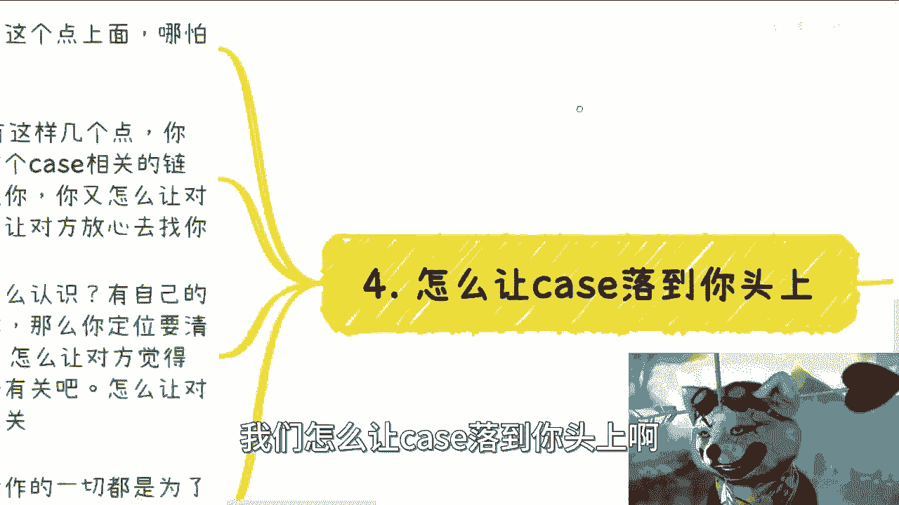

其实所有的赚钱逻辑啊，到最后都是归根结归根于这句话上面，哪怕投资也是一样的，怎么让case落到你头上，翻译一下，有这么几点，第一你怎么获得一手信息，第二你怎么认识这个case相关的链路，整个链路上的人。

第三你怎么让这个对方能够拿到case的时候，想到你，第四你又怎么能够让对方觉得你能做这件事情，第五你又如何让对方感觉能够放心的找你，去做这件事情，这就是核心点，这些条件只要满足了。

那么这个case就有一定概率落到你头上对吧，那么怎么获得呢，有你自己的关系圈吧对吧，怎么认识呢，有你自己的关系圈吧对吧，怎么让对方能够想起你呢，你必须就像我们刚刚第二点，第一点说的，你必须定位清楚吧。

你必须让别人知道你是什么角色吧对吧，你日常要时不时的去做pr，做宣传，做运营，怎么让对方觉得你能做这件事情呢，那又跟上面的这些我们说的综合有关，怎么让对方安心的说给你呃，这个把事情交给你呢。

又跟上面的有关对吧，所以说啊我们说综合来讲，从逻辑上来讲，我们所做的一切，并不是说为了让这个case落到自己头上，而是说增加case落到自己头上的概率哦，或者说自己去能够抓住机会的概率，对吧好。

那么说到这里啊，说到这里我们不得不去反思一点。

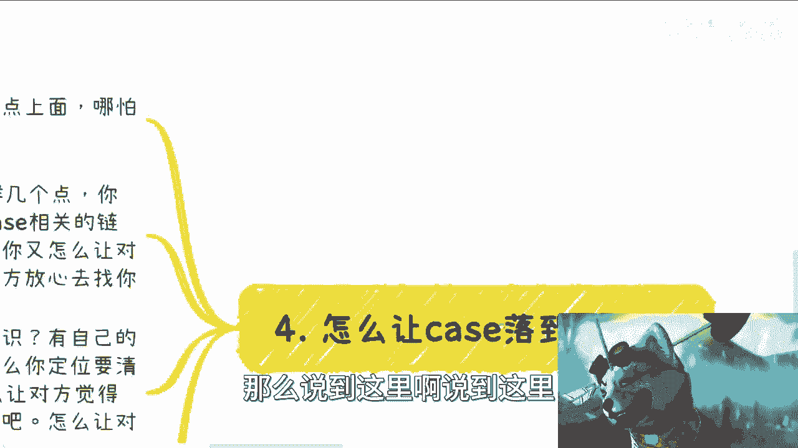

就是那么我们来我我我这里就不写了，我就说一下啊，我们来反思或者说去审视一下啊，我们20多年甚至30多年我们所受到的教育，你所关注的学历跟学校的问题，就是你的学历跟学校，因为我们就这么想。

我们出来得到的是什么，我们得到的是学校灌输给我们的东西，我们得到的是知识啊，我们得到的是我们某些看问题角度的逻辑，思维啊，但是我们得到更多的逻辑。

其实是应试教育的逻辑，对吧好，那么我们就说这些东西。

我们就来说一个最大的问题，就是我们的学历跟我们的学校，能否给我们增加啊。

就是我们说能否让我们增加，让这个case落到自己头上的概率，这么说吧啊就说你会发现本身学校跟学历，他完全不能让case落到你头上，为什么，因为你今天什么学校毕业，你什么学历，跟我们刚刚说的这些case。

其实是八竿子打打不到边的，这就好像我今天拿到一个case，我，中国有14亿人，我怎么知道你是谁啊，关我屁事啊，对不对啊，但是你说有没有关系，可以有怎么有呢，就像我以前说的，A跟B同样进清华是吧。

A在4年后拿到的是张纸，B在4年后，他不但利用清华这个牌子，他也还利用学生会，他可能还利用导师，他懂得利用各种资源给自己赚钱，给自己套关系，给自己去去，甚至跳单拿到关系对吧，因为他知道他未来会闭眼。

他不可能一直拿着这个，这个这个一直借用学校的资源对吧，他必须积累自己的资源，那么他就增加了自己，把这个case落到自己头上的概率，但是你会发现这两者啊。

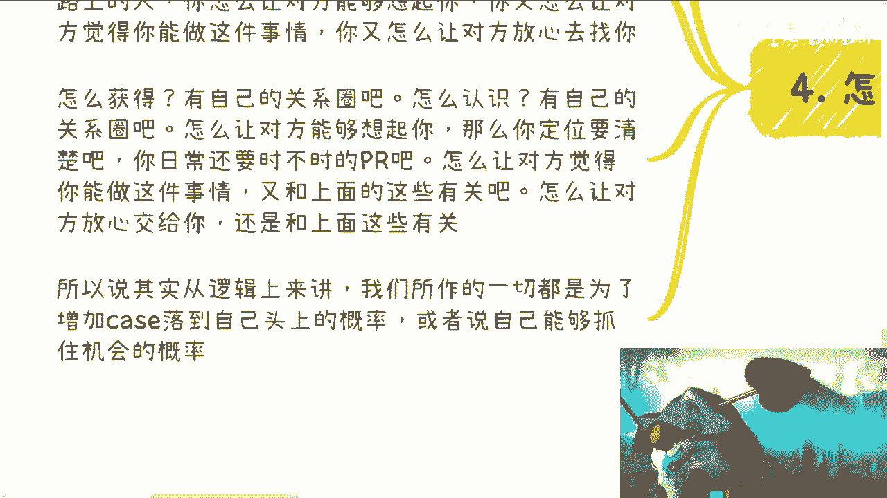

这两者之间还是有一个很大的问题是什么，就是我们就算明白。

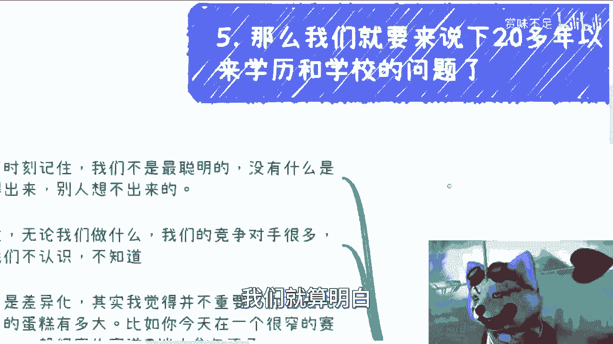

我们说哎我们都要做B对不对，好，那请问我们说是怎么说，有多少人知道B据说当中利用学学学历也好，因为利用学校也好，利用学生会也好，利用导师也好，请问有多少人知道怎么利用，不知道啊，为什么。

因为大部分人对里面的逻辑，这到底比如说从哪个地方去赚钱，应该在怎么去积累关系，积累的到底是谁的关系对吧，积累的到底是哪个层面关系，一无所知对吧，所以说你会发现这个问题就非常的尖锐。

就是说你说他有没有关系，有你懂得利用的人就会就有，但是很可惜的是，我们从9年制义务教育到高等教育，再到整个的你出来，这段时间你并没有受到任何的教育，是关于教你怎么去利用这些东西呢。

或者说教你去懂得在商业上面应该怎么去社交，或者应该怎么去积累自己的东西，没有，而你就进入社会的，而你进入社会之后，更没有人跟你们这么讲，对吧所以对吧啊。

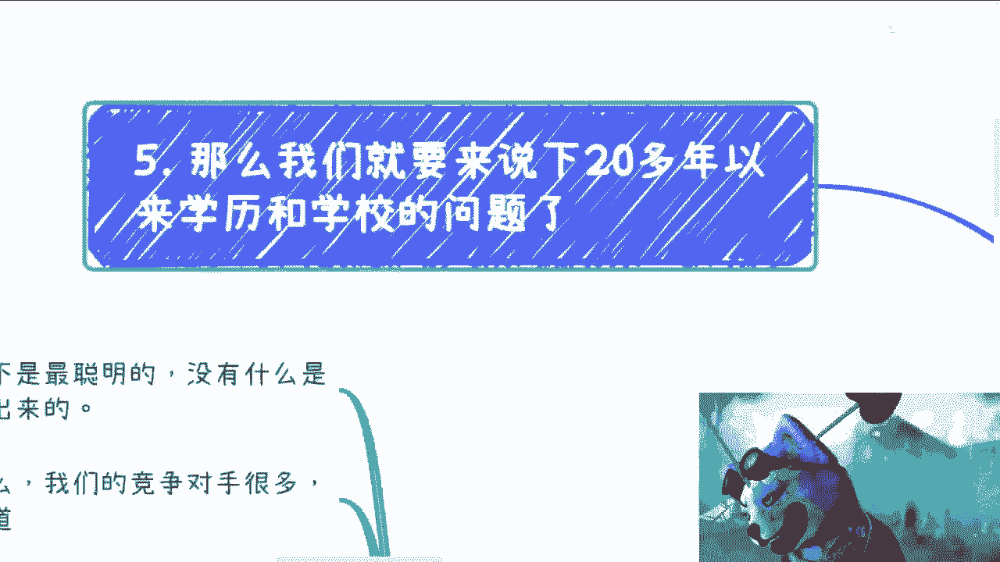

后面的话就不说了啊，好那么格局二啊。

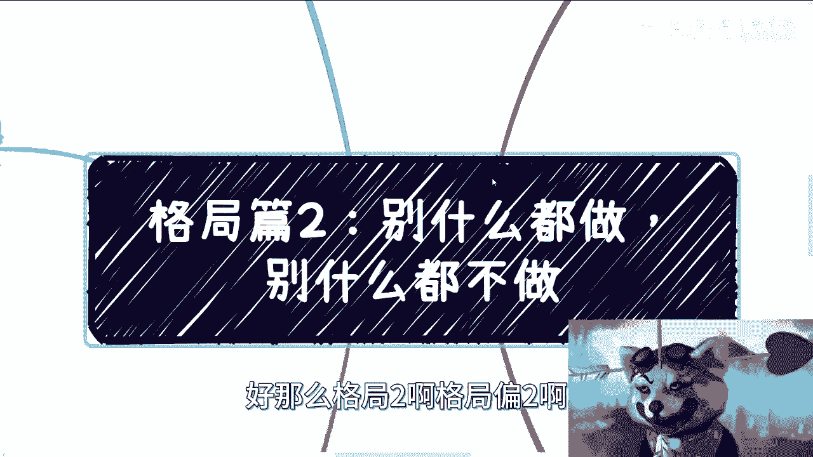

格局片二啊，我们就说到这边就是说总结一下啊，总结一下就是说自己定位呢一定要清楚，格局一定要高啊，然后呢一定要坚持，当然你换行业换什么都无所谓，但是你一定要自己要明白，就是说你所营造出来别人对你的定位。

你到底是做什么的，否则你想想看啊，你对别人来讲只不过是微信里面的一个人，你凭什么能说他今天如果真的有单子，不管这单子多少钱，他能想到你吗，凭什么他能想到你啊，啊是凭你头像哈哈凭你头像跟id牛逼吗。

那肯定不是啊，你知道吧啊，行吧啊啊这个我相信我应该讲的也蛮透的，蛮透的嗯行，那就这么着吧啊，然后，好吧我也我我竟然在充电篇吧，我就说一下，就是我也希望，就是说能够在B站上有小伙伴能合作啊。

能够有一些商业合作或者怎么样，但是我希望大家如果要来找我的话，得要把逻辑把所有东西都要理清楚啊，不要让我觉得就是说这是一个啊，这八字还没一撇的东西，那就别合作，那不可能合作的啊。

然后另外一方面就是反正一样的，就是你们要有什么，你们整理好问题啊，整理好排，整理好自己的一些背书啊，背景啊，然后我们做咨询啊也可以。

