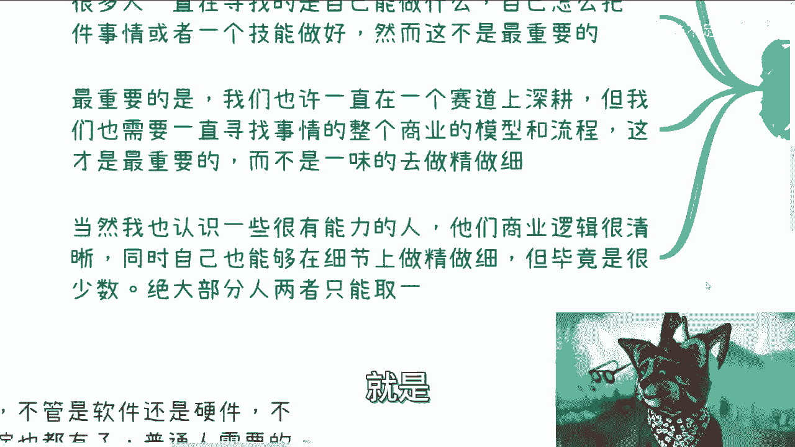
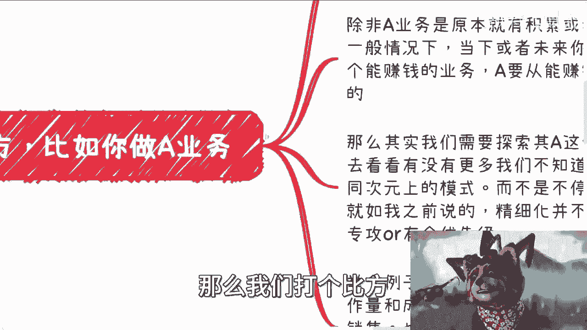
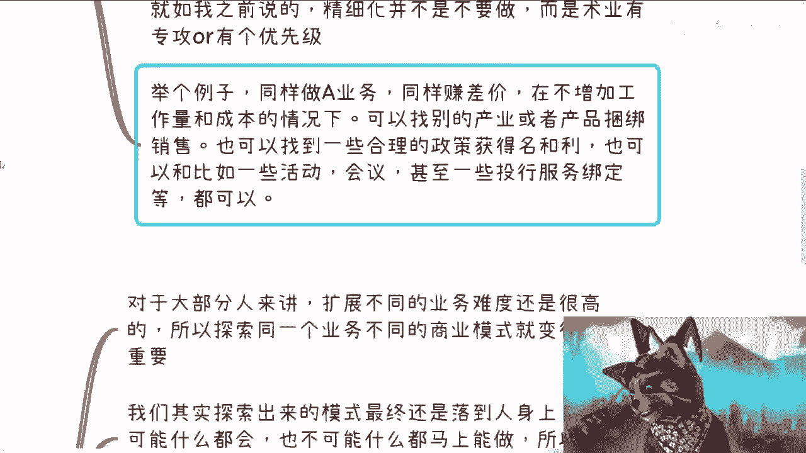
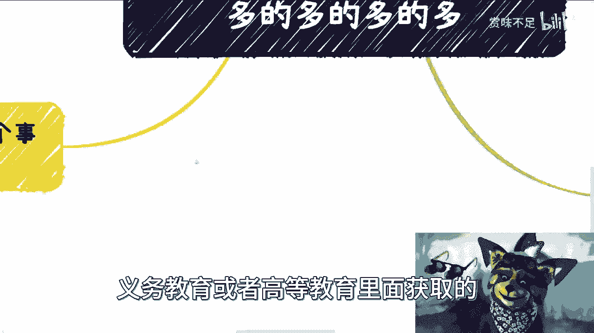
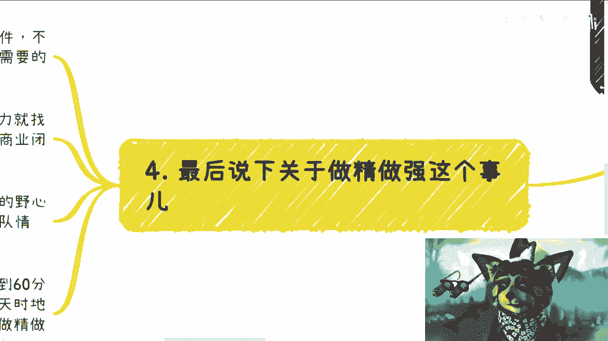
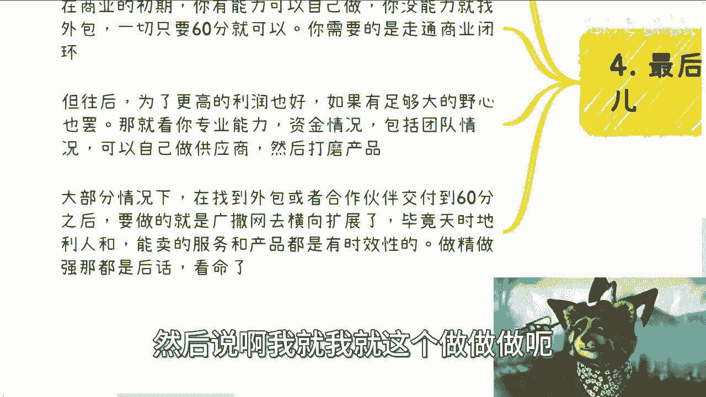
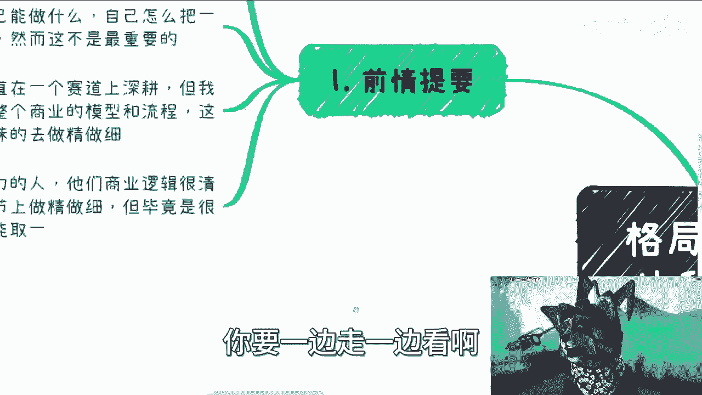
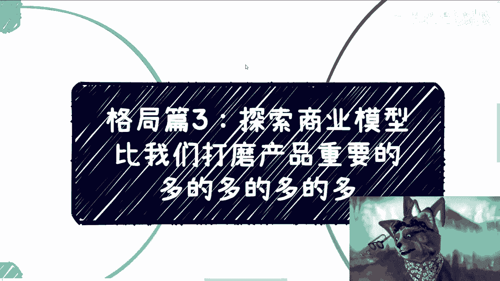

# 格局篇3-探索更多的商业模型比我们打磨产品重要的多的多的多的多---P1---赏味不足---BV13

在本节课中，我们将探讨一个核心商业观点：对于大多数创业者或从业者而言，**探索和发现更多可行的商业模型，其重要性远超过在单一产品或技能上“打磨”和“做精做细”**。我们将分析其原因，并提供具体的行动思路。

---

## 核心问题：教育与商业实践的脱节

上一节我们讨论了商业格局的基本概念，本节中我们来看看一个普遍存在的现象。

大多数大学毕业生，无论学历高低，一旦进入需要自己动手做事的商业环境（无论是主业、副业还是创业），往往会发现所学知识与实际商业运作严重脱节，行动缺乏逻辑。这并非个人能力问题，而是教育体系与真实商业世界的要求存在本质不同。



应试教育培养了我们“做好一件事”的思维，但商业成功的关键往往不在于“把事情做得多好”，而在于“找到对的事情去做”，即**发现高性价比的盈利模型**。

---



## 核心原则：探索模型优先于打磨产品

对于绝大多数普通人而言，在商业上，“探索模型”和“打磨产品”这两件事往往难以兼顾，通常需要做出选择。

*   **选择A：打磨产品**。在特定技能或产品上深度钻研，追求极致。
*   **选择B：探索模型**。广泛寻找和测试不同的商业模式，以求用同样的投入获得更高的回报。

**公式：商业成功概率 ≈ 发现的可行模型数量 × 模型效率**

两者兼得需要极高的天赋和资源，属于少数情况。对于大多数人，将主要精力放在**选项B**上是更优策略。

---

## 如何探索商业模型：三个关键思路

以下是探索更多商业模型的具体方法，核心是跳出原有行业和思维的局限。

### 1. 横向类比相似盈利模式的业务

不要局限于自己的行业。你需要关注的是**盈利模式的本质**，而非产品本身。

*   **你的业务A**：可能是卖包子，盈利模式是`赚差价`。
*   **可类比的业务B**：可能是卖软件，盈利模式同样是`赚差价`。

即使行业不同，只要核心盈利模式（如赚差价、抽佣、订阅费）相似，其运营技巧、渠道策略和扩展方法就具有极高的参考价值。拒绝与其他行业的人交流，等于自我设限，抹杀了大量可能性。

### 2. 在现有模型上叠加价值

在尚未实现高性价比盈利之前，不应过度投入资源去“精细化”现有业务。相反，应思考如何在现有业务模型上叠加新的价值环节。



例如，同样是做业务A并赚差价，你可以尝试：
*   **捆绑销售**：将A与其他产品或服务打包，提升客单价。
*   **名利双收**：利用业务参与政策项目、行业活动，同时获取经济收益和声誉背书。
*   **资源整合**：将业务与投融资服务、大型会议等活动绑定，成为资源整合者。

**代码示例（商业模式叠加的逻辑）：**
```python
# 基础盈利模式：赚差价
base_profit = sell_price - cost_price

# 叠加模式1：捆绑销售
bundled_profit = (sell_price_A + sell_price_B) - (cost_price_A + cost_price_B)

# 叠加模式2：政策补贴
subsidized_profit = base_profit + government_subsidy

# 目标：寻找 Max(bundled_profit, subsidized_profit, other_model_profit...)
```
目标是找到`profit`（利润）最大化的组合模型。

### 3. 通过探索模型触发“蝴蝶效应”

探索不同商业模型的终极目的之一，是**结识掌握不同资源的关键人物**。

你不可能擅长所有事情。不同的商业模式通常对应不同的合作方：
*   **To C 模型**：可能链接社群运营者、私董会组织者。
*   **To B 模型**：可能链接行业协会、研究院、国企资源方。
*   **To G 模型**：可能链接与政府长期合作的中介或企业。





通过业务合作结识这些人，未来可能为你带来全新的业务机会。对于缺乏人脉的普通人而言，**社交与合作是扩展关系网最现实的路径**，而教育体系并未教会我们这些。

---

## 重要例外与执行策略

上一节我们介绍了探索模型的优先性，本节中我们来看看其例外情况和具体执行步骤。

### 例外情况：服务高净值人群

如果你的商业模式从一开始就针对**高净值人群**（客单价极高，如2万 vs 常规200元），那么本条原则不适用。服务这类客户，对产品和服务的“精细化”、“包装”和细节体验要求极高，**打磨产品A**本身就是核心策略。

### 执行策略：60分产品，快速验证与横向扩展

在商业起步阶段，应遵循以下步骤：

1.  **60分产品原则**：你的产品或服务只需达到“可用”的60分标准即可。核心目标是**跑通商业闭环**（验证有人愿意付钱），而非追求完美。
2.  **善用合作**：如果自身能力不足，不要强迫自己成为所有领域的专家。就像企业会外聘CEO一样，你可以通过寻找外包或合作伙伴来补足能力短板。**公式：商业初期成功率 = 自身核心优势 × 合作伙伴矩阵**。
3.  **横向扩展**：一旦某个模型被验证能赚钱，首要任务不是埋头优化它，而是**快速横向复制**。因为商机常有“窗口期”，你需要广撒网，将已验证的模型（`Ctrl+C`, `Ctrl+V`）应用到更多场景或渠道中。
4.  **后期做强**：“做精做强”是后话。当你的业务规模扩大，拥有足够的资本、专业团队和明确需求后，再考虑反向整合供应链，打磨产品，提升利润。这取决于你的客观条件，而非初始执念。



许多人的误区在于，第一个订单还未稳定，就想着如何“闭门造车，做精做强”，这反而浪费了探索更大机会的黄金时间。



---

## 总结与回顾



本节课中我们一起学习了商业思维中的一个关键转向：从“如何把事情做好”转向“如何找到更赚钱的事情来做”。

我们总结了以下核心要点：
1.  **优先级重置**：对于大多数人，**探索多元商业模型**比**打磨单一产品**更重要。
2.  **方法核心**：跳出行业局限，类比盈利模式；在现有模型上叠加价值；通过探索模型结识人脉。
3.  **执行路径**：用60分产品快速验证闭环；优先通过合作补足能力；验证成功后快速横向复制，而非急于纵深优化。
4.  **牢记例外**：针对高净值客户的业务，精细化本身就是核心模型。

赚钱的关键，往往不在于产品本身的变化，而在于**商业变现逻辑的多样化**。保持开放，积极与不同的人交流、合作，是发现这些隐藏模型的最有效方式。努力很重要，但确保努力的方向正确，是第一步，也是最重要的一步。