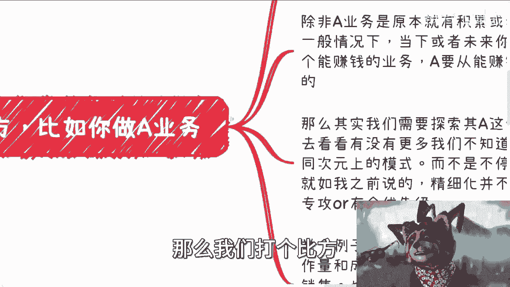
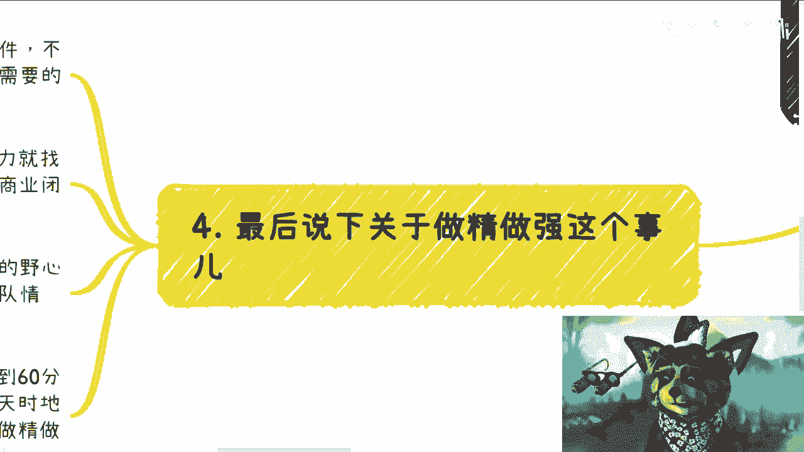
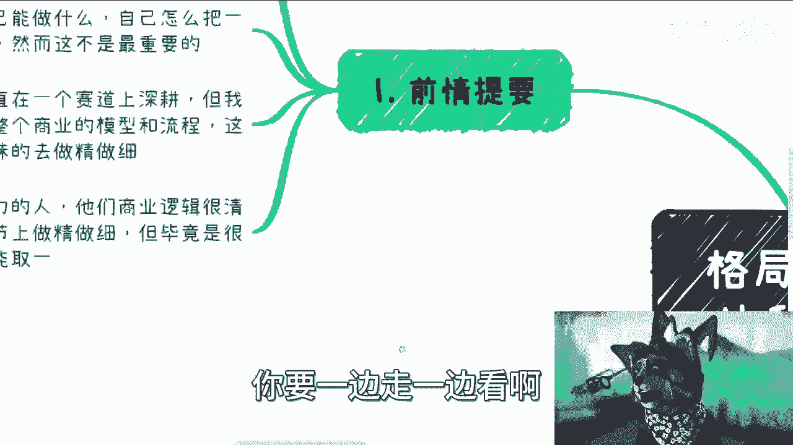
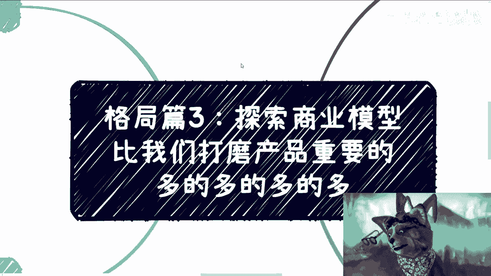

# 格局篇3：探索更多的商业模型比我们打磨产品重要的多的多的多的多 - P1 - 赏味不足 - BV13u411c7cC

好大家好啊，这个，继续我们的格局篇啊，格局篇三叫做探索商业赛道啊，比我们打磨这个产品啊，重要的多的多的，多的多的多的多的多的多的多啊，啊其实不是商业赛道，我写错了，应该是说商业的这个这个模型。

哦这个说这个主题呢，在歌剧片里面也有一定的道理，因为最近最近这个咨询下来啊，就是哎呀整体啊就是真的只能说能做商业的，还是要靠一定天赋啊，就就感觉算了，先说吧啊前情提要啊。

这个大多数大多数大多数的这个小伙伴啊，大学毕业啊，我无论他学历多高，他到了商业上，什么叫商业上，就到了他自己要做点事情啊，我不管他是要做副业，还是要做一些别的东西啊，这不重要。

你会发现就几乎毫无逻辑性啊，就这书是白读了，真的白读了啊，那这第一个第二个呢就是说很多人呃，他们做事情呢，因为从小到大嘛就是应试教育嘛，应试教育教给大家很多一些怎么说呢，就是说嗯不能叫做错误的观点。

而是说要灵活变通啊，很多人一直在寻找自己能做什么啊，自己怎么把一件事情或者一个技能去做好，或者把一个方向做好，唉但这个并不重要啊，就是最重要的是什么呢，就是说我们啊，也许比如说大部分的这个呃老百姓啊。

也许一直在一个赛道上生根对吧，比如说你是做呃这个化学的对吧，你是做数学的对吧，你是做计算机的对吧，都是有可能的啊，那么我们需要呢，其实我们要做的其实一直是去寻找呃，这个业务或者这个赛道上面的。

一个商业的模型跟流程，或者说不同的商业模型和流程啊，这个是最重要的，而不是说我们一味的去做精做细，嗯嗯当然啊这个地方我也说一嘴啊，呃我也的确认识一些人，就是他两者能兼顾对吧，就比如说他技能逻辑。

商业逻辑很清晰，他也知道就是说啊有很多不同的商业模式，同时呢它也能够在技术层面，在细节上面做精做细啊，但是我跟你讲这个东西毕竟是少数啊，就我现在沟通下来，我所看到的绝大部分的人啊，我就这么说。

这不是你们的能力问题，就是就是大部分的人他两者只能取一啊。

也就是说你要么就做精做细对吧，你有能力去卷对吧，做精做细，你要么就是去探索更多的商业模型，商业逻辑去赚，更，或者说去啊，以同样的投入去产出更多的这个钱对吧，但是你说两者都要基本不可能啊，基本不可能。

那么我们打个比方。

比如说你做A业务对吧，我们来看啊，首先你做A业务也许是可以从中赚到差价的，我们比如说啊，你的A的业务的盈利模式就是赚差价对吧，或者来说啊你也许不是赚差价，是就是有正常的。

比如说啊BB端客户或C端客户去购买对吧，甲打个比方啊，我们是这么一个业务模型啊，那么除非啊你说啊A这个业务原本啊，就比如说你现在不是刚开始做，除非这个A这个业务啊原本就有积累。

或者他有很大的固定固定的这个合作伙伴，或者在它的整个供应链的上下游，它是不可或缺的一部分，如果不是，或者如果没有这个积累，一般情况下面当下或者未来对吧，你去做了一个业务，你寻找到一个你可以去加入。

或者你可以去叫做什么呢，就是赚快钱我也好，或者去合作的这么一个业务，那么你要从他能赚钱变化成走量，本质上还是很有难度的哦，也就是说你也许能赚到钱，但是你想通过走量，把这个赚钱的投入产出也变得很高。

那这件事情可能没有这么容易，啊那么我们来看啊，那么其实我们需要的是去探索，跟你同样的做这个A的业务，或者说他做的不是A的业务，但他的商业逻辑也是做差价啊对吧，你比如说你今天卖包子对吧，你赚差价。

那个人卖软件也是做差价，你别管那个人跟你是不是一个行业的，因为万一有很多人很多人他做事情嘛，他就一上来就抹灭了自己太多的可能性啊，比如说他说他说我是做制造业的对吧，我是做什么东西的，他就拒绝对吧。

跟那些啊别的行业人沟通，但没有意义啊，你明白吧，就是我们要去了解的是，要去看看有没有更多的我们不知道的，就是纵向，横向或者不同次元上面的这种商业模型啊，我们不要太去关注在我们一个赛道上面。

或者同一个这种业务模这种模型上面，这没有意义的哦，我们类比的那种只要跟我们的这个模式，商业模式相似的，我们都可以去了解好，但是有一点就是在我们真正的叫什么，能够高性价比赚钱的前提。

就在我们真正能做到高性价比赚钱之前，我们不应该去精细化A，你知道吗，就是你去精细化A对你来讲意义不大，当然就如我就如我之前提到过的，就是说精细化这件事情，比如说你打磨你的产品啊，对吧。

你你要你要把你的产品做的更好啊，你要把你的服务做得更好啊，这没毛病啊，精细化并不是不能做，而是说要么术业有专攻，要么就是有个优先级对吧，当然在所有的商业模型里面啊，OK那在所有的商业模型里面。

有一点可能跟我现在讲的东西是有冲突的，是什么，就是如果你的商业模型，一开始针对的就是高净值人群，你知道吧，就比如说你现在做的东西啊，也许是赚钱的，也许是怎么样的，但是呢你的客单价很高啊，正常的。

比如说客单价是200，你现在客单价是2万，那么同样的你还能赚到钱，那就说明你可以获取到一部分的高净值人群，那如果是这样的话，OK那么此条就我现在讲的这些对你是不适用的，你知道吧，因为你针对高净值人群。

他就是一个非常垂直的，非常窄的这么一个商业逻辑，而这个商业逻辑你要做的其实就是精细化A啊，当然你可以理解为既精细化A又要包装A，因为高净值人群他要的是什么，他要的是一你同样需要包装去吸引他。

二就是说他会对服务要求很高，那虽然他对你的东西可能不一定很懂啊，但是你的细节，你的服务也好，你的产品也好，你的各方面也好，他会要求很高，这个是高净值人群的特点好，那么你就要你就需要去精细化A。

那么除此以外，剩下的基本上都是我说的这个逻辑啊，那么举个例子啊，同样是做A这个业务，同样是赚差价，在不增加工作量或者同样成本的情况下面，我们可以找到别的产业，甚至别的产品去做捆绑销售对吧。

我们也可以找到一些合理的政策，获得明获得利益，就是说在你做就是同样的做这些事情上面，你可以额外的去获得名和获得利，而这些名和利可能能够让你明滚利或利滚利啊，也可以去。

比如说把这些东西直接整合到一些活动啊，会议啊，甚至一些投行服务绑定啊等等等，你知道吗，就是说我们要去寻找的是，在我们同样是去赚差价啊，同样就可能很多人说你拉皮条，那你拉皮条也得也有拉的好。

也有拉的不好啊对吧，那同样人家拉皮条有的对吧，既吃了政府的扶持，又吃了企业的钱，又吃了差价，人家是这个一一皮条三吃对吧，那也是本事啊。

那么第三啊，我们需要触发更多的蝴蝶效应，呃对于大部分人来讲呢，我觉得扩展不同的业务难度还是很高的哦，就是因为呃唉就客观的说吧，就是我觉得聊下来吧，就也许大家这个书读了很长时间了，但是我觉得大部分人呢。

他就真的就是一窍都不同，你知道吗，就什么都不知道啊，你别说让他探索不同的业务了，你让他探索自己的专业业务，他都探索不来哦，所以你说探索同一个业务，不同的业务模型其实就会变得很重要。

因为我们其实探索出来的模型，最终是要落到人身上的，你想啊，你大概率不可能什么都会，也不可能马上什么都会做啊，所以不同的商业模式，一般都是会有不同的合作方，也就是说所谓术业有专攻对吧。

也就是说你没有必要把他们踩过的坑都踩一遍，而只需要通过合作把你的目的达到，亦或者来说未来你熟悉之后，你也可以自己做嘛对吧，无所谓嘛，啊我们探索商业模式的本质啊，其实是为了认识更多的人，比如说打个比方。

有的是专门to c的，那么很有可能他是做社群运营，或者说做一些club或者做私董会的对吧，或者做什么也比，就这高端酒会的都是有可能的啊，邮轮对吧啊，那么比如to b的，那么很有可能是什么叉叉联盟啊。

叉叉研究院啊对吧，央企国企啊对吧，或者党媒啊对吧，央媒啊都有可能那么QG啊，可能就是一些中间商，或者是一些比如说啊长期啊，或者跟政府合作的企业或者人等等，那这些也是有可能的。

那么这些呢都是未来可能给我们带来更多，别的业务的可能性的一些人对吧，因为对于大部分人来讲，我们要的就是关系，那关系怎么来呢，关系只能只能通过就是说业务去扩展嘛，对吧好，那么咨询下来呢。

我觉得最大的这个痛点呢，还是在于大家没有关系啊，没有人脉，一窍不通，但是我为什么一直强调社交呢，是因为除了合作，除了社交，你作为那个普通人来讲，他没有别的路啊对吧，你也许对于很多人来讲。

比如说20多年对吧，你书读下来或者30多年，甚至读下来已经时间很长了啊，也不愿意去社交，也不愿意去怎么样，但很可惜的是，你要知道这个教育体制给予大家带来的东西，是给你们赚不到任何钱的。

就你们只能赚辛苦钱啊，就剩下赚钱的手段，没有一个东西哪怕怎么入门，你们都不可能在9年制义务教育，或者高等教育里面获取的。

这个就是最大的问题，那只能靠你们自己来怎么办呢，对吧啊，那么最后我来说一下，就是关于做精做强的这个问题。

好那么我们来看一般来讲大部分的工艺啊，不管是软件还是硬件啊，只要不是卡脖子的技术，其实该有沉淀也都有了，毕竟是2023年了对吧，那大部分小伙伴做的业务，他不是一个什么很高精尖的东西，你知道吗。

所以说他要的就是合作方，而不是说自己去刚啊，你说你说我今天要去做一个软件啊，非要我今天从代码开始学起，这他妈不是有病嘛，对不对啊，你不说自己是刚你刚不懂的，大概率啊，在商业初期，你有能力，你可以自己做。

你没能力就找外包，你知道吗，这就像很多企业家去创业，他可能是懂得商业，或者他有一定的敏锐度，但是他不适合做CEO怎么办呢，他是强迫自己变成个CEO吗，不是我以前说过这个视频对吧，我我我以前讲过这个主题。

就是说你要不行，没关系，你去找人，就像很多企业为什么会空降CEO，是因为他们不行，没必要自己强上啊对吧，你找一个CEO来不香吗，对不对，各司其职啊，那么大部分在商业初期，你的产品只要有60分就可以了。

你需要走通的是商业闭环啊，但是往后你比如说你为了追求更高的利润，或者说你有足够大的野心，这就要看你的商业啊，这就要看你的专业能力，资金情况，包括团队情况，你可以自己变成供应商，然后去打磨产品。

也就是我们说的做精做强，没毛病的，可以的，但是你得看你有没有这个成本，你有没有这个资本，不是承包就有有没有这个资本对吧，那么大部分情况下面啊，我们都可我就是大部分情况下面。

因为中国现在的人团队太多太多了，满地都是团队，你知道吗，你在国内在找到外包或者合作伙伴，交付到60分的情况下面，就这种概率是很高很高的哦，你找到这种合作伙伴，当然不能找一个，因为风险性太高。

你需要找若干个，你找到之后，你要做的是什么，就是广撒网去横向扩展，因为你要明白，当你摸到一个东西，你能赚到钱的时候，也就意味着这个东西在别的地方，一定是可以CTRLCCTRB的，你知道吧。

或者说你可能就是会有一定的这个这个时效性，或者有一定的天时地利人和，而且很多时候不一定是你感觉到，是你就是碰运气嘛对吧，你自己都可能不知道，但是你会发现诶诶这个东西有人买单的对吧，这个东西哎哎不错的。

那么你接下来就要横向扩展哦，毕竟你会发现赚钱这个东西，很多时候天时地利人和也好，或者说有一个窗口期也好，它就是有一定的这个时效性，在这个地方呢，你不能在那边说，哎我今天卖掉一个东西了。

我接下来就是就是大家开始在那边闷头对吧，闭门造车，然后说啊我就我就这个做做做啊，做大做强。

而不是做大做强，做精做强，那你就在浪费时间啊，至于我们说的做精做强，这个就是后话，你看命你知道吧，你要一边走一边看哦。

而不是说而不是说我们现在就说我聊下来，说你说我聊下来大部分的人啊，就是可能我不夸张说，100个人里面98个人或99个人，他上来的思路就是我怎么把这个东西做好，我怎么把这个技能磨练好。

我怎么把这东西做好呃，把我的产品做好，没有用的，真没有用，对吧啊，所以就说呃我们一定要明白啊，就是任何一个东西赚钱。

也许你的产品是不变的啊，就是今天你什么东西都不变，都但是你的商业变现逻辑可能有很多种，只是我们不知道，所以说我们在很多时候我们得要去探索啊，找不同的人聊啊，找不同的人，不同的人去认识啊。

或者不同的case去合作，就是为了探索更多的商业模型啊，那么这样的话你才有可能有更高的投入，产出比啊，我不知道这个上面大家能不能理解啊，这件事情上，因为嗯我觉得很多人努力是努力的，但他努力的方向不对啊。

嗯差不多好吧，差不多行吧，那反正大家反正有什么你们呃整理好问题，然后整理好背景，有什么反正可以走走咨询啊，或者说你们有什么需要跟商业，数字经济这边合作的，你们也可以找我好吧，当然把逻辑理清楚啊。

你不要上来问我怎么合作，我问我怎么合作，你就不合作了啊。