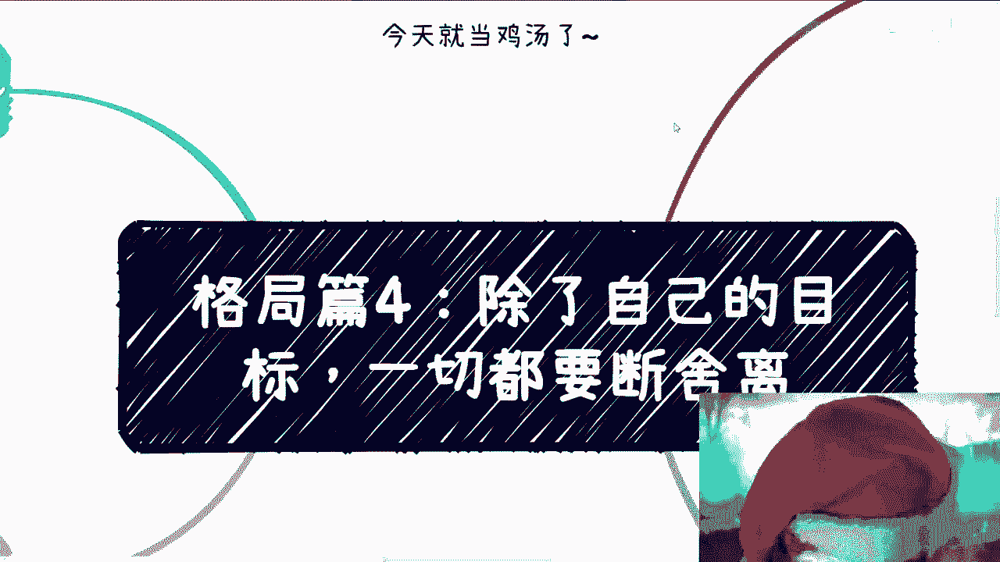
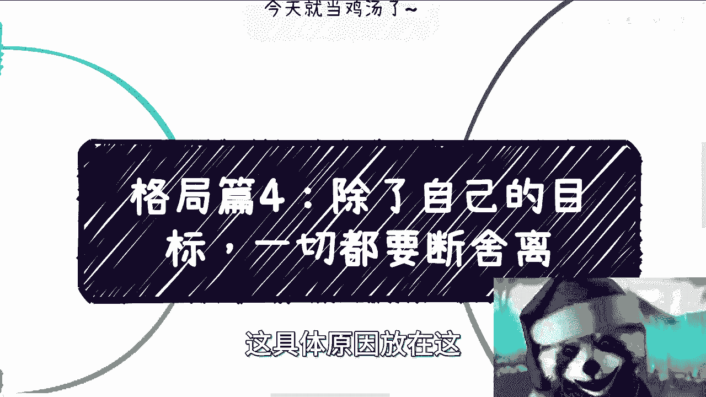
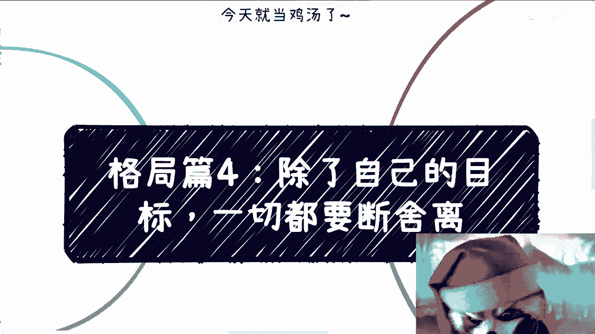
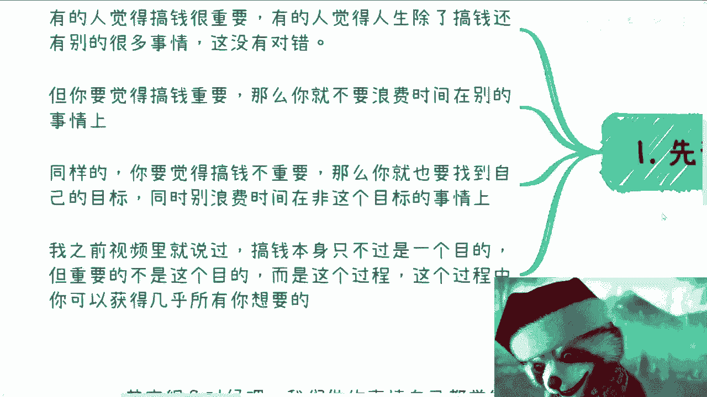
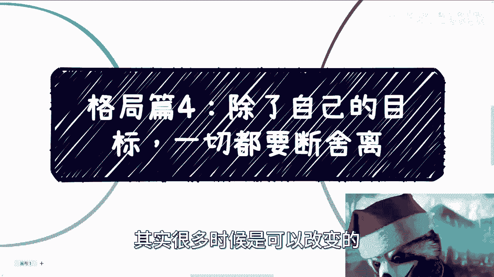

# 格局篇4-除了自己的目标-一切都要断舍离ASAP---P1---赏味不足---BV1vp4y1w7k

在本节课中，我们将要学习如何通过“断舍离”来提升个人格局。核心在于明确自己的核心目标，并果断舍弃一切与之无关、消耗精力的人与事。我们将探讨内耗的根源、如何区分事务的轻重缓急，以及如何通过思想上的转变来获得行动上的果断。

---

## 概述：内耗的根源与格局的关系

上一节我们探讨了格局的基本概念。本节中我们来看看，为什么许多人会陷入“想改变却无力改变”的内耗循环。

许多人感到现状不佳，希望改变。但他们同时感到非常内耗，并且这种内耗源于各种具体或模糊的原因，例如业务发展不顺或项目不知如何推进。关键在于，他们往往不清楚问题的根本原因，也不明确自己的目标，只知道内耗不好却无力改变。

这与格局大小有关。格局大意味着能分清**什么重要，什么不重要**，包括金钱的多少、利益的分成，以及什么事情值得投入、什么事情只会带来内耗。这本质上是对事务**轻重缓急**的判断。

---

## 第一点：明确核心目标，停止浪费

首先需要确立一个大前提：你必须明确对自己而言，什么是最重要的。

有些人认为搞钱很重要，有些人则认为人生有比搞钱更重要的事。如果你认为后者成立，那么你应该去追求你认为重要的事情。但说这种话的人，往往自己也不知道在追求什么。

以下是基于目标选择的行动准则：

*   **准则一**：如果你认为搞钱重要，那么就不要在与此无关的事情上浪费一秒钟。
*   **准则二**：如果你认为搞钱不重要，那么就去找寻你自己的目标，同时不要浪费时间在偏离该目标的事情上。

搞钱本身只是一个目的，重要的并非这个目的，而是**追求目的的过程**。在这个过程中，你几乎可以获得所有你想要的东西：金钱、伴侣、朋友等。因为这些是通过自身能力获得的，才是可靠和真正想要的。很多人问题在于，他们并不知道自己真正想要什么。

---

## 第二点：切断关系带来的内耗

上一节我们明确了目标的重要性。本节中我们来看看，如何应对感情、亲情等关系带来的情绪消耗。

感情、家庭、他人眼光常常是内耗的主要来源。处理这些问题的关键在于建立正确的认知。

以下是应对关系内耗的三个关键认知：

1.  **关于感情**：你遇到的人的层次与你的层次、你的圈子成正比。你认为的“好”可能仅限于你当前的认知。提升自己是根本。
2.  **关于家庭与他人眼光**：如果你清楚自己想要什么，并且知道自己不能浪费时间，那么谁的眼光都不重要。他们离开你并不会活不下去，你离开他们地球也照样转。
3.  **关于内耗的反思**：请静心想一想，这些内耗除了**影响你拔刀的速度**（即影响你赚钱、成长的速度），还有什么帮助？答案是：没有任何帮助。

对于父母的不理解、亲戚的攀比，无需过分在意。普通家庭中，亲戚不来找你借钱或坑你已经不错。核心心态应是：你好与不好都与我无关，我不会要你一分钱，你也别想从我这里拿走一分钱。

---

## 第三点：破除“别人都优秀，只有我失败”的错觉

许多人陷入内耗的另一个原因是错误的比较，产生“别人都很优秀，只有自己很失败”的认知。这需要被纠正。

首先，这是一个错误的认知。网络展示的生活往往是经过放大和美化的，现实中很多人也在伪装。逻辑上，“别人都优秀，只有我失败”的情况也不可能普遍存在。

其次，关于原生家庭。从广大老百姓的角度看，家家都有本难念的经，其实大同小异。父母辈有差异：有的是高知，有的是普通工人，有的经商。羡慕别人的家庭没有意义，因为细想这些无法改变的事情只会让人钻牛角尖，产生不公感，却于事无补。

钻牛角尖的后果是影响判断，使人急于求成。急于求成的人可能会在合作中无意地坑害伙伴（例如通过造假或欺骗），因为他们太想快速成功。

核心在于：别人的优秀是别人的，自己的失败是经验。只要不重复踩坑，失败就不能定义你的一生。只要自己不给自己“盖棺定论”，没人能定义你。旁人的阴阳怪气无足轻重。

---

## 第四点：践行及时止损

思想转变后，需要在行动上落实“断舍离”，核心是**及时止损**。

以下是三个需要果断行动的方面：

1.  **对无成长的事**：如果你发现自己做的事情没有成长、提升或发展，就应该改变。拖延就是在浪费自己的时间。
2.  **对自我制造的恐惧**：不要自己制造恐惧、敌人或困难。改变的第一步往往并不难，阻碍你的是对失败、拒绝的害怕。这种害怕通常是自己PUA自己，需要勇敢地“冲”。
3.  **对不靠谱的人与事**：对于不靠谱的合作方、合伙人或任何关系，应尽快止损。不要碍于朋友关系或面子而继续合作。面子不值钱。感觉不靠谱就停止合作，各走各路。越拖问题越大。

有过一两次教训后，就要吸取经验，尽量避免再次陷入被动状态——即明知某事或某人不靠谱，却因各种原因无法拒绝。这种状态只会消耗你的时间和可能出现的赚钱机会。

---

## 总结：格局就是目标明确的断舍离

本节课中我们一起学习了如何通过“断舍离”来提升格局，聚焦目标。

核心点在于，断舍离本质上是格局的一部分。你需要知道**哪些钱该赚，哪些钱不该赚**；**哪些事该花时间，哪些事不该花时间**。判断要非常直接，不要犹豫。

当你真正“开窍”时，你会发现一切与目标无关的事情都是在浪费时间，而浪费时间会让你感到厌恶。人应该往高处走，没有道理在低处纠缠。

大众是可以改变的，关键在于**先从思想上进行改变**。思想改变后，行动会变得果断，目标会非常明确，不再被无关紧要的事物分散注意力。因为你时刻都清楚：**我要的是什么**。

希望本课能帮助你理清思路，果断前行。如有具体问题，可以整理好后进行咨询。