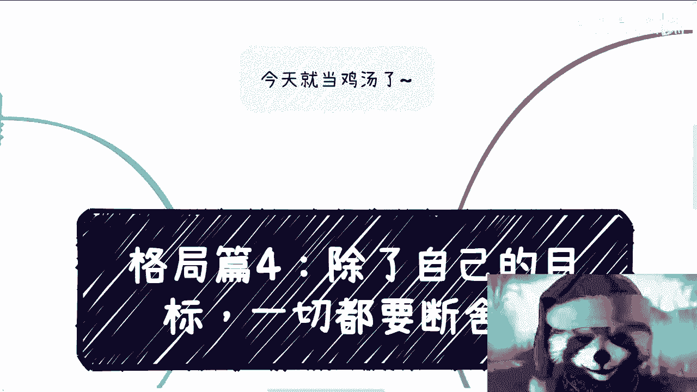
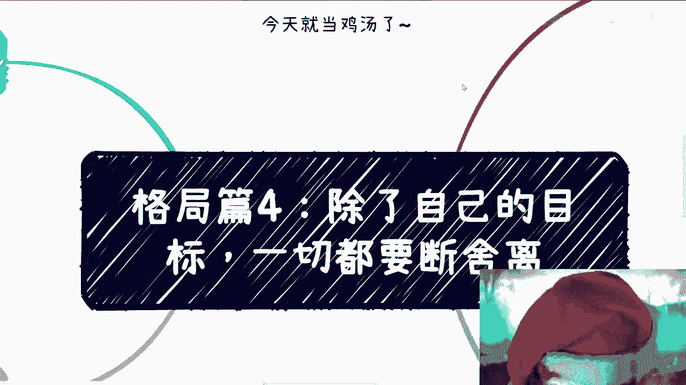
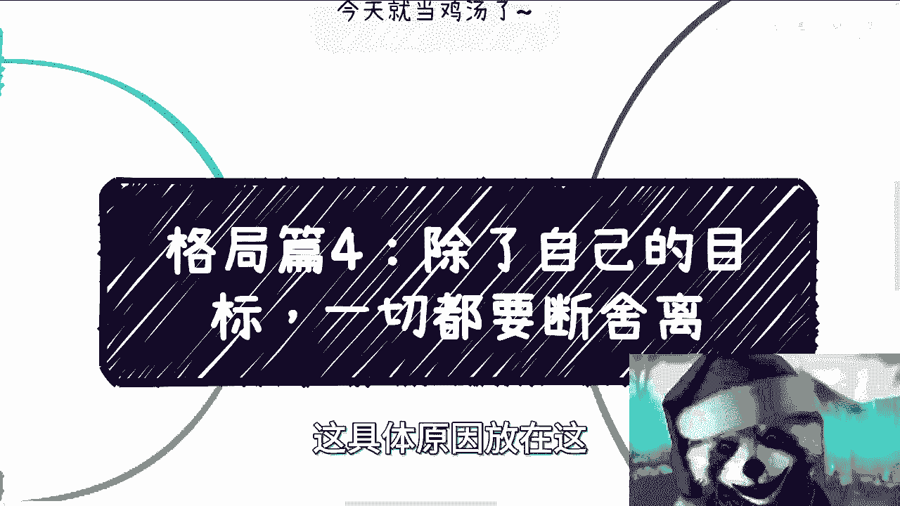
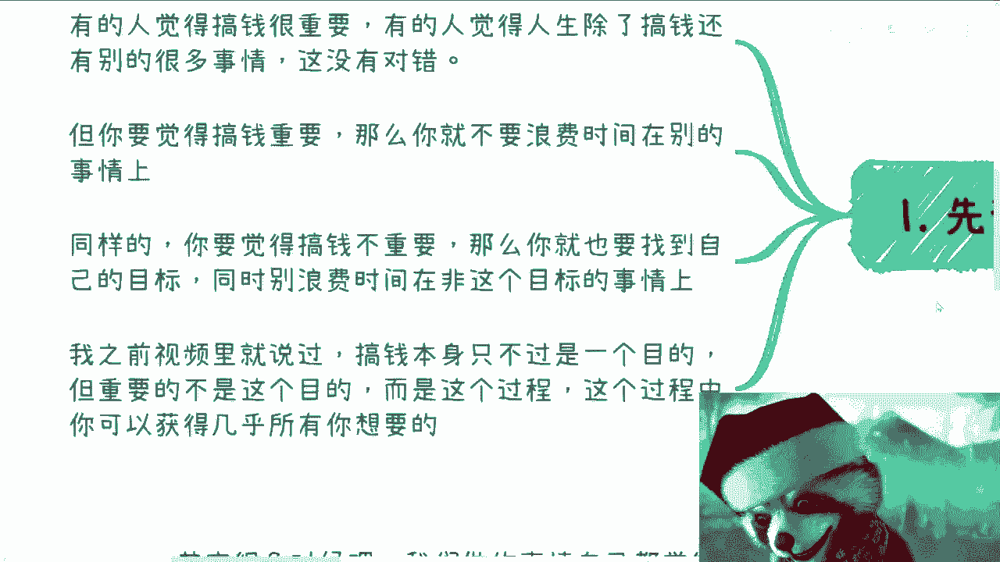
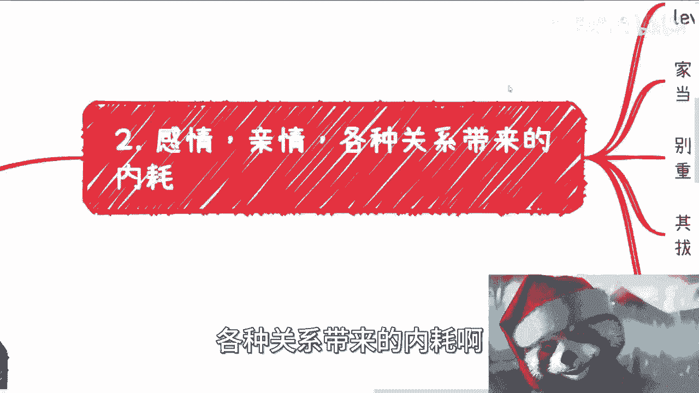
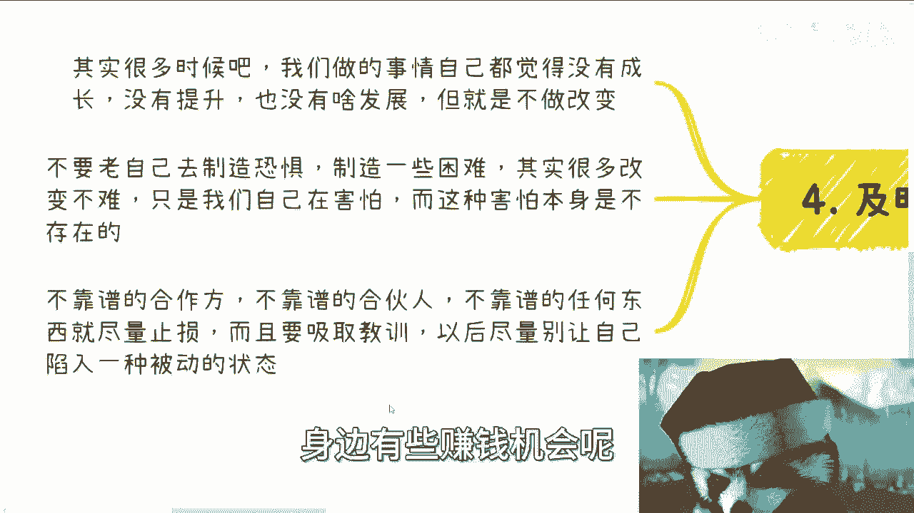
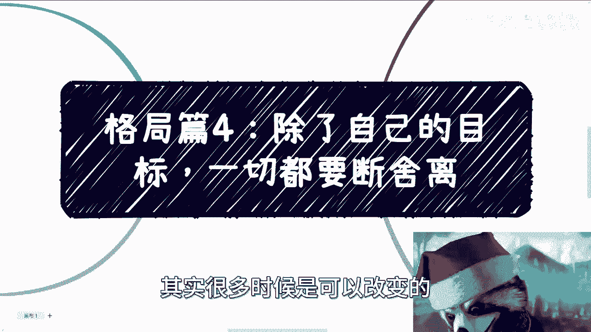
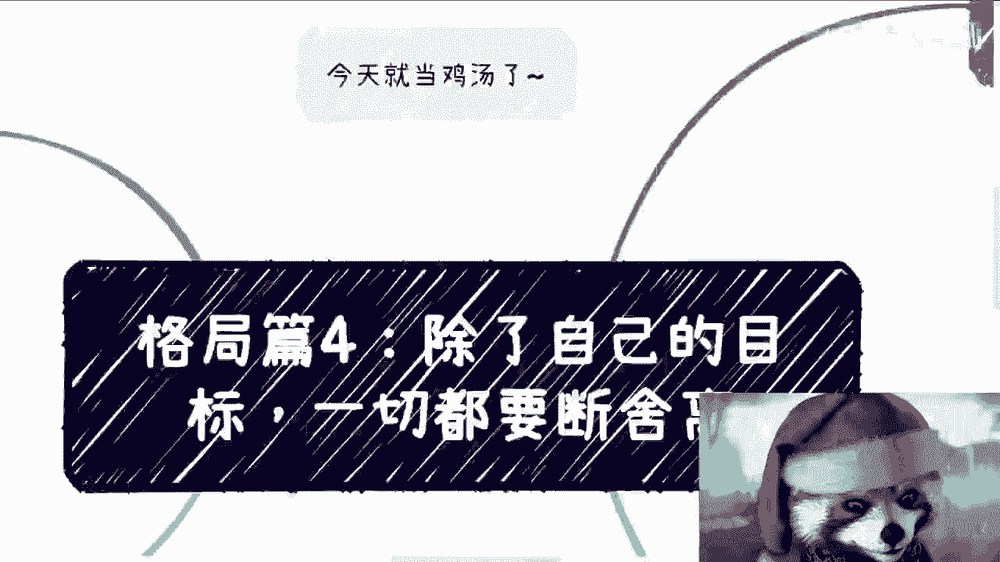

# 格局篇4：除了自己的目标，一切都要断舍离ASAP - P1 - 赏味不足 - BV1vp4y1w7kK

啊大家好啊，今天礼拜五是吧，哎呀今天这个真的就当鸡汤了。

为什么，因为我发现哎真的这个聊下来吧，最近这个资讯也比较多，聊下来吧，就这感觉吧就不行，就是什么呢，就是说，他就好像是个死是个死循环，你知道吗，就是说大家觉得啊我这个现状不行，我要改变我要改变吧。

我又好像很内耗啊，我很内耗吧，然后也是一些也是因为一些有的没的对吧，就是说你要说我赚不到钱对吧，我比如说现在苦于我的这个业务对吧，不知道怎么发展对吧，我不知道这个这个这个叫什么。

就是就是这个这个项目该应该怎么做对吧，就是说他要是很多原因，这具体原因放在这。

我觉得也就算了对吧，大家比如说因为你从我咨询来讲，我说实话，我其实是蛮希望是那种就是具体业务对吧，你比如说有什么东西让大家讨论讨论啊，那这蛮好的呀，对不对，教学相长，你说是吧，哎我发现不是的。

我发现大众啊是什么呢，就是他不知道原因呃，他他也不知道目标，他也不知道东西，他什么都不知道啊，但是呢他知道的是我因为什么事情内耗，但是他也知道这个是内耗呢不好啊，但但他就觉得改不了哦。

那那我觉得真的这个事情就我跟他们聊的时候，也在说，我说这个东西就是跟格局也是有关系的对吧，因为你格局大，格局大什么意思，就是你得知道什么重要，什么不重要对吧，就你包括钱多钱少，包括你分润分多分少对吧。

包括你现在什么事情内耗，什么事情不内耗，这个就跟格局有多有关了对吧，轻重缓急。

对吧，那首先先说个大前提啊，我觉得有有的人呢觉得搞钱很重要啊，有的人觉得人生除了搞钱，还有很多别的事情啊，这个之前其实我讲这个搞那期，有一期讲搞钱的那个视频的时候，就有人在下面跟我说。

那人生不能只有搞钱是没毛病，那我想知道是你要觉得不重要，那OK啊，那你去追求你重要的事情呗对吧，那大概率说这种话的人，他也不知道他追求啥玩意儿对吧，那我说第二点啊，你说你觉得搞钱重要呢。

那么你就不要浪费时间在别的事情上面，我跟你讲一秒钟都别浪费对吧，没有意义的呀，哦那同样的你要是觉得搞钱不重要，那么你就去找自己的目标对吧，同时别别浪费时间在飞这个目标的事情上面，也不就结了吗，对不对啊。

包括我之前视频里面说，我说搞钱呢只不过是一个目的啊，我从来也不认为搞钱很重要，我觉得重要的并不是这个目的，而是这个过程对吧，因为我跟很多人，我跟很多人说过，我说他们啊，就是说他说我对钱没什么很大的追求。

但是呢他说我可能追求全，我可能追求的是我的圈子，我可能追求的是我的这个这个社交，面对吧，那我就会告诉他，那你不得不去把你搞钱的能力提上去，为什么，因为这是一个有直接关联性的一件事情，没有办法的。

你不搞上去，你怎么把那圈子提上去啊，这对吧，你没没有别别的办法的呀对吧，所以说我觉得重要的确不是不是这个目的，而是这个过程，因为你在这个过程当中，你几乎哦我说我不能说打死啊。

但是你几乎可以收获你所有想要的东西对吧，钱对吧，你的对象啊，你的你的各各方面朋友对吧，为什么，因为这些才是可靠的，这些才是你想要的，当然很多人想要是啥也。

他也不知道对吧，那第二点呢，我觉得感情亲情各种关系带来的内耗啊。

你看啊，你说这么多人啊跟我说这个恋爱的问题对吧，他说谈恋爱重要吗重要，但是我要告诉你的是，你遇到的人的level跟你的level，跟你的圈子是成正比的对吧，你说你喜欢一个人，你知道你喜欢啥吗。

你不知道对吧，你说现在这个人好，那你觉得怎么样算好呢，好的人多了去了，你不知道啊对吧，你知道的好是仅限于你的认知啊，啊对吧，这是我觉得这是第一点，第二点，你说家庭亲亲戚，很多人呢其实他不理解。

现在年轻人很正常对吧，因为时代变化太快了，而且而且啊就另外一方面，你说别人的眼光重不重要，我就说啊，就说你但凡知道你想要什么，你但凡知道自己不能浪费时间，那谁的眼光都不重要，无所谓啊。

你活在这世界怎么了呢，你你是离开你爸妈，离开任何人，离开别人，别人明天活不下去了吗，又不是对对对，我甚至可以说，比如说我们合作了很多年的合作方，你明天不合作，那不合作就不合作好了，我还跪着你合作。

爱咋地咋地呗，就说了，这又不是缺了你，地球不转无所谓嘛，是不是还有呢，就我觉得这些造成内耗吧，造成压力对吧，你要这么想啊，我跟也很多人说过，我说你要这么想，这些东西除了影响我们拔刀的速度对吧。

影响你们赚钱的速度，影响你们成长的速度，还有什么帮助，你们就静下心来想想看，有什么帮助，没有了，nothing有什么帮助啊，怨天尤人没有来，对不对，现在正常的老百姓家庭，我跟你讲，父母不理解的。

很多亲戚呢这种角色都是来攀比的啊，他能不来借钱，不来坑你已经不错了啊，而且我跟你讲，反正都是别人家的孩子比自己好，哎呀公司也是外来的和尚，好念好念经，一个道理呀，对不对，哎呦我做咨询我真不知道对不对。

我去别的企业，我跟你讲，他们领导啊，领导啊，政府的官员对我毕恭毕敬啊，你知道不啦，就为什么就是因为我是外来的和尚，好念经呀，对不啦，呃但是我跟你讲这种事情，你你你比如说呃你说父母不理解也好。

亲戚来攀比也好，无所谓啊，我我我跟你讲，我我可能十多年前心态是这样子，你好就好不好就不好跟我有什么关系，你好我也不要你一分钱，你不好，哎，你不好意思，你也别来问我，要我一分钱就这么简单，哎这有什么关系。

爱咋地咋地呗，然后第三点，我觉得这里有个观点就很有，有很多人会觉得他说别人都很优秀，自己很失败，哎我跟你讲啊，首先首先这就是个错误认知，说白了啊，我以前说过，就网络都是虚假的，都是放大的，你别说网络了。

现实中很多人都是骗子好不好，我跟你讲，真的只有自己知道，不存在网络上的好，大概率是不存在的，而且更何况什么怎么可能存在，别人都很优秀，只有你很失败，这个道理你想想看，就这个逻辑本身就不成立啊，你怎么闹。

你首先怎么评价优秀，怎么评价失败，钱多钱少嘛，那肯定不是对吧，那那你说地球上人类社会啊，怎么可能出现啊，别人都怎么样怎么样啊，只有我怎么样怎么样，这个道理那真的没有的呀，对不对，第二啊就如同家庭对吧。

很多人觉得他什么，他说我就觉得原生家庭很差啊，但其实广大老百姓，从老百姓角度来讲大差不差的，你知道吗，就家家都有本难念的经，我可以告诉你们，你们99%的人比我好，你知道吗，真的真的比我好对吧。

当然父母辈是有差别的，有的呢是告知对吧，昨天明天我们群里面有朋友对吧，他父母就告知这种，我就很羡慕对吧，我就很羡慕那种家父母就很有学问的对吧，有的呢自己有的呢是自己失业的对吧，你就跟我父母一样。

下岗工人啥都不会，这不很正常吗，有的还有自己家，就是父母还经商的这种，我也很羡慕的对吧，你耳濡目染啊，你不像我全自学是吧啊，那这事呢其实我跟你讲不能去细想，为什么呢，因为普通人啊，一个人你越细想呢。

你越容易钻牛角尖，你越容易进入一种，就是说哎呀为什么好像好像很不公对吧，或者很怎么样的，但其实没有卵用啊，你想这些东西改变改变不了任何事情，你知道吗，这就这就像什么，就是这就像什么，很多咨询我的人。

他是这样子的，就问我，他说哎未来这个大发展，就是他问我，就说哎这未来大发展怎么样怎么样啊，大发展好还是不好，我我说大方向好还是不好，我们能决定的，我们不能决定你去想这事干嘛，这不吃饱了撑的嘛，对不对。

还有问我这行业怎么样怎么样，我说这行业怎么样，你能不能赚钱吗，你能赚钱，我们讨论一下，你不能赚钱，你讨论个啥呢，都是什么卖着白菜，我也不知道为什么，何必呢，对不对啊，你越容易钻进牛角尖。

从而越影响自己的判断，急于求成对吧，我身边这样的人很多很多，他结果是什么，结果就是他要么坑自己人，就比如说你跟他合作，他坑你，他也不是有意坑你啊，那没办法，因为他急于求成，你知道吗。

他会在很多地方就是就是就是什么叫坑你，比如说很多地方造假对吧，很多地方就是骗你，他不是故意的，那怎么办呢，哎哟我跟你讲，这这种案例多了去了，我都不想说对吧，核心呢我觉得就是一点。

就是别人优秀呢都是别人的，自己失败呢也都是经验啊，只要你不重不重复的踩坑，卧槽谁没有失败失败过呀，不要老去钻着说哎呀，感觉好像自己失败，自己怎么样子对吧，你无论什么时候失败，都不能代表一辈子失败对吧。

你只要自己不给你盖棺定论，谁能给你盖棺定论呢，对不对，就别人都不了，都不了解你，你父母也不了解你怎么盖棺定论的，他最我跟你讲，身边人最多什么阴阳怪气，你两句能怎么滴呢，对不对，怎么回事。

群里面又开始说了，然后第四啊，及时止损对吧，这东西我以前也说过，就是很多时候吧我觉得我们做事情难嗯，自己可能都会觉得没有成长，没有提升，没有发展，你就可以改变啊，不要拖啊，拖没有意思的，就是拖。

就像我们之前说的，你拖就是在浪费自己时间，没有区别的，第二点呢就是不要老是自己去制造恐惧，制造敌人对吧，制造一些困难，就很多时候你要说改变或者怎么样子，其实并不难，然后很多人恐惧。

他说我就不知道怎么迈出第一步，其实不是不知道有什么不能卖的呢，冲啊，人类社会，你对方也是一个人，你也是一个人，怎么了，那不能沟通啊对吧，只是害怕害怕什么，害怕失败，害怕拒绝，害怕怎么样，无所谓啊，冲啊。

对吧，而这种害怕本身其实是不存在的，其实都是自己PUA自己，对吧，然后第三点呢，不靠谱的合作方，不靠谱的合伙人啊，包括不靠谱的任何东西，你就尽量止损啊，别不靠谱了，还在那边。

就是说可能比如说可能你们是朋友关系对吧，可能你们是什么关系，就是在那边碍于一些有的没的面子，没什么面子，面子面子不值钱啊，你要觉得不靠谱对吧，停止合作，爱咋滴咋滴啊，这个各找各妈，各各回各家。

结束了对吧，你越往后拖问题越大，而且我觉得有过一两次之后，你就要吸取教训，就是尽量不要再让自己陷入一种这种，很被动的状态，什么叫很被动的状态，就是你可能已经知道这件事情不靠谱了。

你也可能知道这个人不靠谱了，但是碍于很多的原因，你又就是没办法拒绝对吧，或者怎么样子，那怎么办呢，你不就在耗吗，又又又耗又浪费时间，又浪费机会，说不定这个时候就身边有些赚钱机会呢。

好了你被你耗掉了，谁知道呢，对不对，所以我觉得呢就是核心点就在于啊，核心点就在于就是说这个断舍离啊，我觉得这个本质上也是格局的一部分啊，你得知道哪些钱该赚，哪些钱不该赚啊。

你也得知道就是哪些事情你该放时间，哪些事情不放时间就非常的直接，不要有任何的犹豫，因为当你一旦明白了，就是哪天比如说你开悟了对吧，你哪天比如说开窍了，当你明白的时候。

你就会发现一切那些有的没的都在浪费时间，而浪费时间会让你觉得非常的厌恶，你知道吗，就你才拿我来讲，我情愿每天打游戏，我情愿每天睡觉对吧，每天怎么样，我也不会愿意去跟一个商业思维不靠谱，或者不成熟。

或者说一个一个一个完全没有合作，合作能力的人对吧，你说我要去浪费时间跟他聊，没什么好聊的，这不是因为没有前途点，没有前景点，人往高处走，哪里有往低处走的道理啊，对吧。

所以其实一样的道理就是说我我觉得大众啊，他去改变，其实很多时候是可以改变的啊。

就是首先要从思想上进行改变啊，然后思想上改变之后，你会慢慢果断，你果断之后，你自然而然就会有非常多的东西，就是目标会很明确，而不会被那些有的没的东西，那个那个吸引，就是分散你的注意力，没有必要的。

因为你自己时刻都会明白，就是我要的是什么啊，行啊，我觉得这个真的就当鸡汤了，好吧行吧，那就这么着吧，那个好吧，反正大家有什么问题或者有别的东西，反正整理好你们可以私信咨询我。

