# 梳理下主业和副业的平衡的问题，大家可以借鉴 - P1 - 赏味不足 - BV1hT411h7nb

好啊大家好啊，这个假期最后一天了是吧，那当然了，我也知道有些小伙伴一直在加班了，这个问题呢是这个很多人都在问啊。

我今天正好总结一下，然后说一下这两天的事啊。

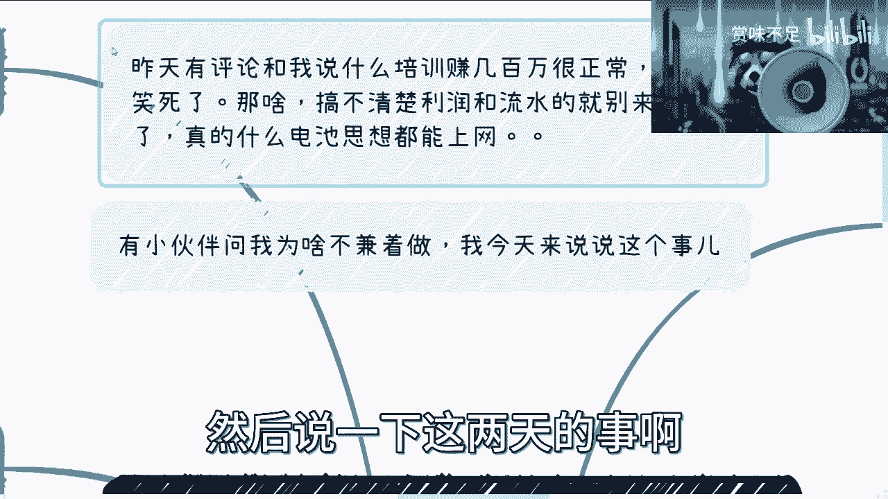

第一就是昨天评论有和我说，什么培训赚了几百万，很正常啊，我跟你说，我真的笑死人啊，捶地笑，为什么呢，因为你搞不清楚利润跟流水就别来秀智商了，你知道吗，你知道利润你赚几百万是什么概念吗。

啊啊这个专辑版本很正常，这他妈到底谁不接地气，我真的是服了对吧，然后这第一个。

第二个呢就是说有小伙伴问我对吧，为啥不兼职做，就是主业也来做副业来做啊。

我今天正好来讲一下这个事情嗯，首先是这样子的啊。

我先来说一下我在我在未来三到5年里面，最最推荐的方式啊，第一啊就是你有一份主业对吧，你有一个你拥有核心竞争力的副业啊，什么叫核心竞争力，我后面会讲的，你看到没有，今天这个喇叭比我头还要大是吧。

这是第一个啊，然后呢并且这个副业是可持续性收入的，第二呢就是你有一份主业，但是呢你有多份你可以去做副业，但是呢副业并不能带来比较稳定的收入啊，这两个都行啊，这两个都行，第三呢就是说你有多个副业。

其中按照投入产出比来讲有不同，有多条不同的路线，就我说的多条不同的plan，一般比如说3731731啊，后面我也会再来说，这种呢也行啊，这种也行，但这种其实就跟我现在一样，就是你们但凡掌控不好的话。

风险性可能会比较高啊，那么还有一个呢就这件事情我是最最不赞同的，我再强调一下，就是创业这个事情呢，我是的确不赞同，而且非常不赞同啊，详细呢，你们可以见我出的那期轻资产的那个。

那个视频啊，你们搜这个关键字就能搜得到好吧，反正你们可以再去看一下啊。

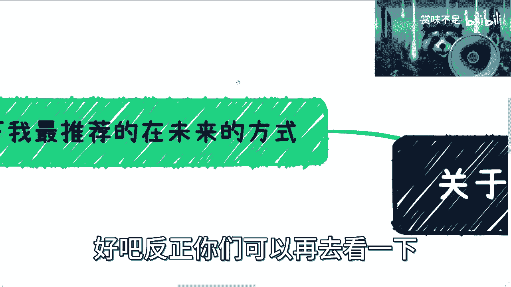

那么接下来说呢就关于这个主业啊，主业呢一般是这样子的，一般呢大部分的主业跟商业本身。

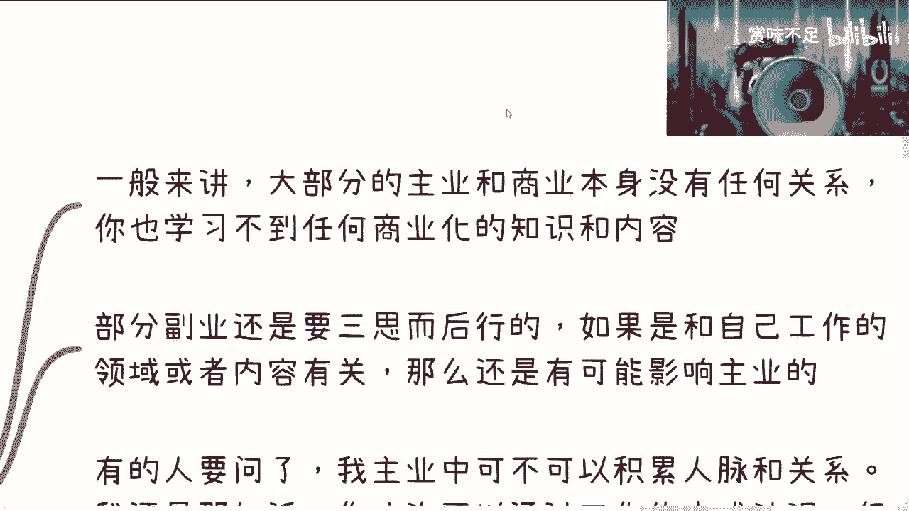

没有任何关系啊，就是我发现很多小伙伴会说啊，就说啊我现在区分去上个班对吧，我在这个里面能学到什么什么东西啊。

怎么样怎么样，我跟你们讲啊，就90%到95%，甚至98%啊。

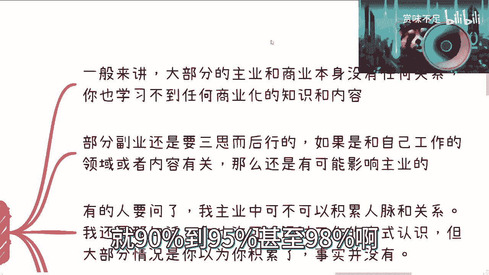

你在公司里面，你是学不到任何的商业化的知识和内容的。

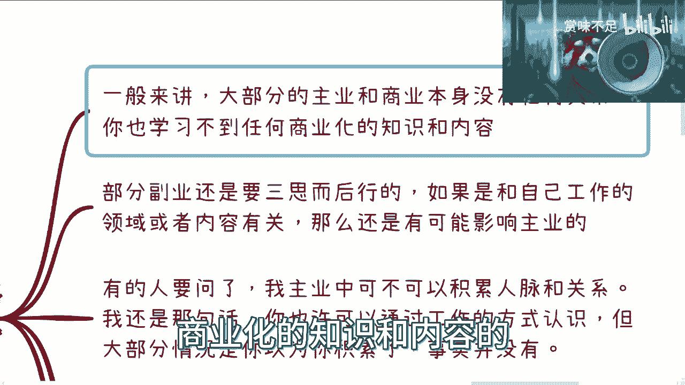

这是肯定学不到的，我这个地方给你打保票，对吧，那这是第一个。

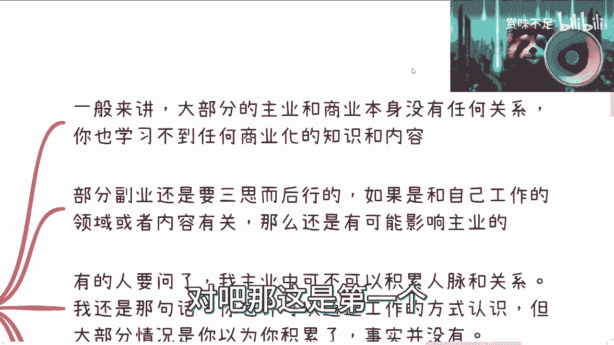

第二个呢就是说呃部分副业。

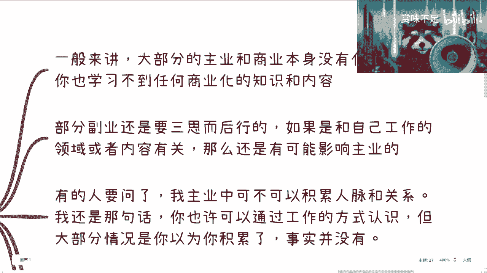

好部分副业你要342后行，为什么呢，因为一般来讲比较好的方式呢。

就是你的啊副业里面的一些东西呢，可能跟你主业会有些关系啊，那当然最好是没有关系嘛对吧，最好是没有关系，但是这个就看你的这个知识储备，还有你的这个关系链了嘛对吧，那一般如果没有这么大的。

知识储备和关系链的话，可能你的副业跟你的主业还是有一定关系的，是不是，那如果有一定关系呢，你需要三思而后行，因为圈子其实不大嘛，就每个领域圈子都不大嘛。

你总有可能会影响到你的主业，那如果影响到你主业，这就不太好嘛对吧。

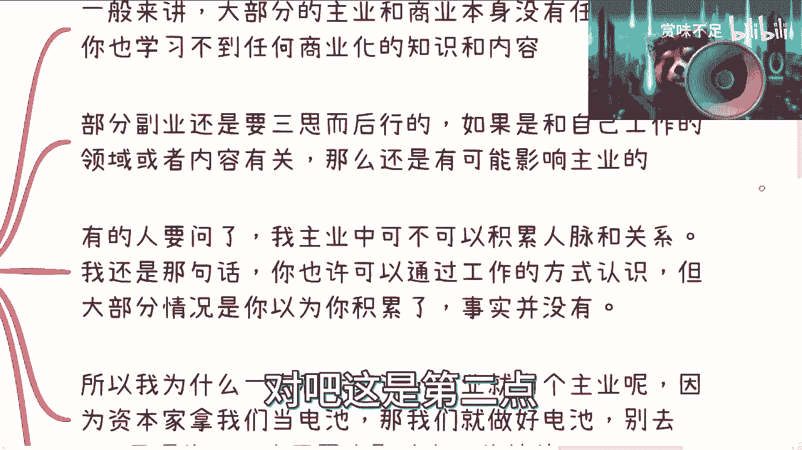

这是第二点，第三点呢就有人要问了，他说我主业当中可不可以积累人脉和关系对吧。

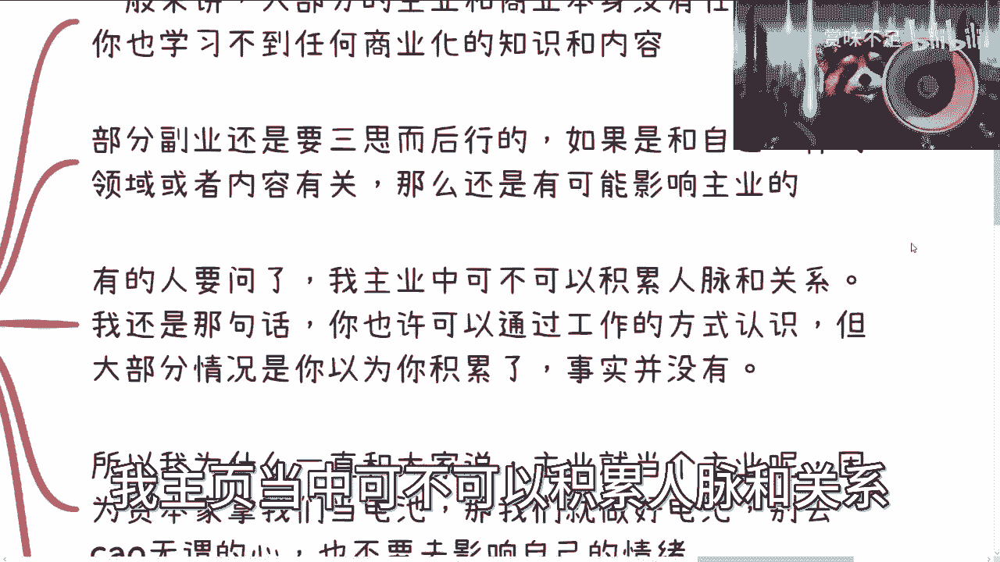

因为有些小伙伴也说嘛，他说我在公司里面，可能这个这个对接是一些政府项目啊，或者对接一些这个协会啊，或者这种这个500强企业啊。

对吧，我跟你说啊，我说本质上是什么呢，就是说你在公司里面。

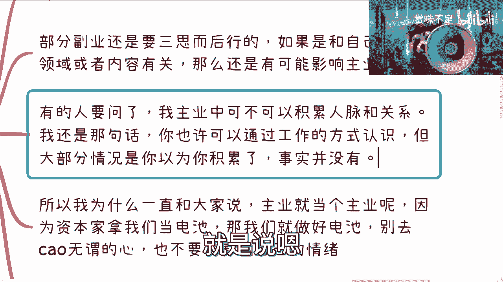

你通过工作方这种方式认识的呢，大部分情况是你以为你积累了这个关系，但是别人跟你其实没有这个关系，什么意思呢，就是说等你未来想要用它，或者让他来帮你一起赚钱啊，我不管是一起赚钱爱好，一起赚名也好。

你会发现对方其实不太愿意帮你，或者他可能就是婉拒对吧，你就说面上面大家你好，我好大家好对吧，但是其实也不太可能就是就是真正合作，为什么呢，是因为你要知道商业上的合作呢，都是人际关系啊，就是你就这么想。

他之所以跟你们公司合作，是因为他跟你们的老板有关系，我不管是因为大家一起赚钱也好，还是是亲戚关系好，还是大家以前同学关系也好，但是不管是哪层关系，都不代表他跟你有这关系对吧。

所以说你千万不要觉得你在工作当中啊，某个某个某个什么书记怎么样子啊，这个这个就是大家你好我好，大家好啊，或者怎么样，这就没意义了啊，那么这是一点，所以呢我跟你们说呢，就是说在未来这几年里面呢。

我觉得最好的方式就是说你们这个主业呢，就去做一个主业啊，因为既然资本家拿我们当电池，那我们就做好电池对吧，别去就是操这种无谓的心，你们明白吧，就是别去为你们的就是企业里面的一些东西，就是哎呀又又加班。

又影响自己情绪，好像又怎么样，就是卖着白菜，卖着白菜的钱，怎么样怎么样，就这个没有意义，你知道吗，就是因为本身啊，我觉得所有的人都是得要为自己去活嘛，得要从自己出发嘛对吧，你主业就当个主业对吧。

你说偶尔加加班无所谓的，但是你给我多少钱，我干多少事对吧，你别指望说啊，给我个什么5000块钱，你说我什么给你几个月996。

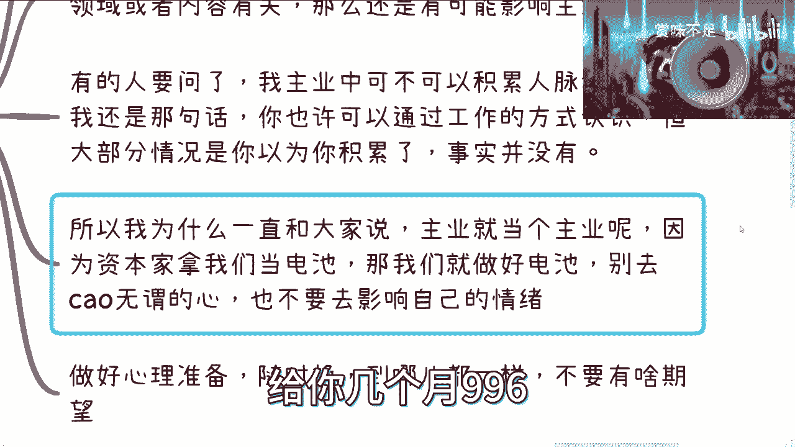

那这不可能的，哪来这种事情，你说是吧，嗯然后这是一个，那最后最后呢就是说我觉得在未来几年里面呢，得要做好准备，就是你随时要换，就主业，你可能随时都会换，不管是你主动换还是被动换。

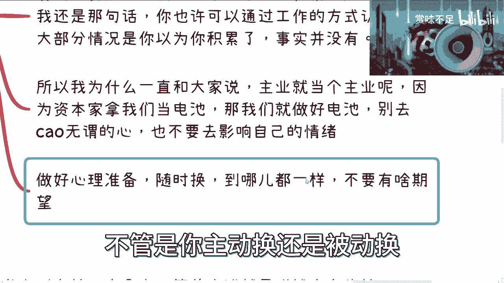

而且呢其实到哪都一样啊，你别有太大的这种期望值，本质上不会有什么很大的区别啊。

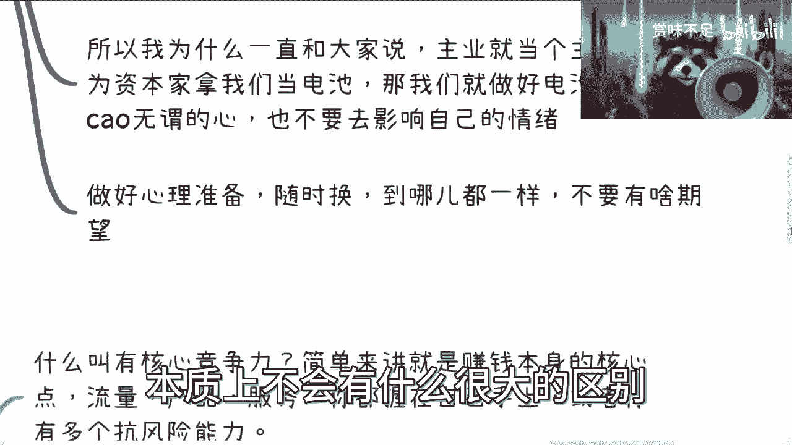

这个是主业对吧好，然后副业啊，副业是这样子的。

我们来看啊，就是我们刚刚提到什么叫有核心竞争力呢，简单来讲就是说赚钱本身的核心点，比如说流量啊，或者产品上或者服务上，你都是握在你自己手上的，就是这些资源都是你自己的，而不是依赖别人的哦。

或者说你有多个抗风险能力，什么叫多个抗风险能力呢，就比如说这三个东西，也许你不是都有对吧，你说我只有其中的一两个啊，或者这个一个对吧，好，那么这个时候呢你一定要知道一点，就是如果今天你这个流量不行了。

或者你这产品不行了，或者你这服务不行了，你还有没有对应的就是这个back up的，就这个候选方案对吧，那所谓核心核心竞争力，就是说你能知道对吧，不管这个市场好还是不好，不管这个行业好还是不好。

不管今天到底发生了什么事情，你都有足够的备选方案能够来稳住你的现金流，这个就叫你赚钱的核心竞争力，但凡你都是依赖别人的，那么就叫做没有核心竞争力啊。

就是你虽然能赚钱，但是别人说不跟你合作，你可能现金流就断了。

对不对，那好那这是第一个，第二个呢就是拉皮条，其实那么我觉得这个呢就是得要多个plan，就是你如果都是那种就是说拉皮条难，并且左手抖右手的呢，你必须是制定多个方案，你才是可以稳定往下走的。

你单纯一个方案是不够的。

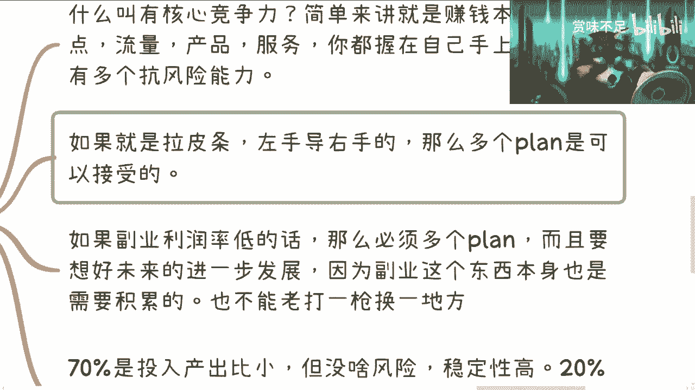

抗风险性太低，你知道吗，啊，那么还有呢就是如果你的副业利润率低的话啊，什么叫利润低呢，就是因为之前蛮多咨询小伙伴也都说了嘛，就是差不多他们会做一些比如说电商啊，或者二手买卖啊对吧。

或者这个这个互联网就什么直播带货啊，对吧等等等啊，就他们的利润率，基本就在10%到15%，那我觉得就是说这个利润率还是很低的啊，这个甚至不叫利润率啊，就是他们能赚钱，他们能分到的钱是10%到15%。

但是最终利润率有多少，可能比这还要低是吧，那么我觉得呢这种情况下面呢，就是你必须要有多个plan啊，必须要有多个盘点，这是毫无疑问的，而且呢要未来更进一步发展呢，就是呃你要去想好更进一步发展。

因为副业这个东西呢本来就是需要积累的，你总不能老打一枪换一个地方，因为你老打一枪换一个地方，那就是我给你们举个例子，这就像什么，这就像你说你今天对吧，嗯这个一个月是赚5万块钱的。

那你过个5年你总归得要就想着往上走嘛对吧，所谓不进则退嘛对吧，所以说你总会想着说啊，我是不是到时候一年能赚个10万对吧，一年能赚个20万，但是呢你一年能赚个10万跟十跟20万，并不是通过你去增加人手。

把你现在这个事情CTRLCCTRLV来做的，你明白吗，就是说这就好像我们一直说嘛，你生个孩子要十个月，并不代表你用十个人一个月就能生出来对吧，所以说既然不能，那么你又要提升你的利润率，那怎么办呢。

就得增加你做事情的效率对吧，增加你做事情的方式对吧。

所以说你以前比如说是拉皮条的对吧，或者是一些二手买卖啊。

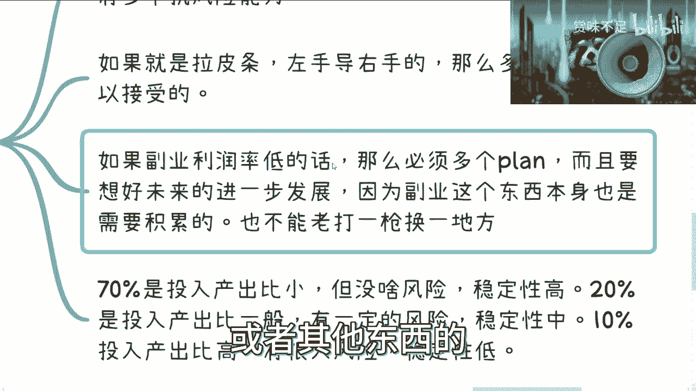

或者其他东西的，那么你为了赚取更大的利润，那么你可能得要就是虽然还在这个领域里面，但是你得换一种做事方式对吧，所以说我们在这个地方说，你得要谋取谋求更进一步的发展对吧。

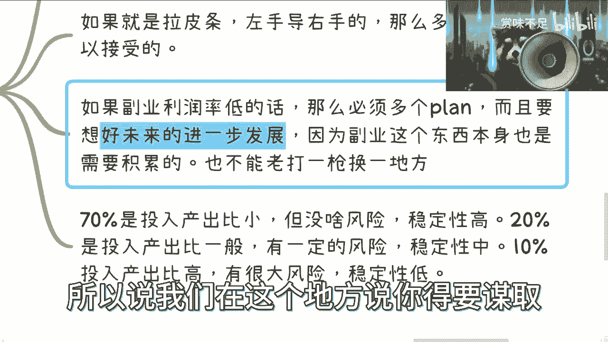

那么关于731呢，啊不是731了。

721我怎么写成731了呢，啊啊我错了，我错了好吧。

然后呢是这样子的，就70%投入呢是比较小的啊，是比较小的，但没什么风险啊，其中稳并且它稳定性高，你知道吗，就这副业当中做什么不重要啊，就是你得看投入产出比投入低啊，然后产出低啊，但没风险，稳定性高啊。

20%呢是投入产出比一般啊，但是有一定的风险，这个风险就是我们刚刚说的嘛，就是说可能就是说这个单子会黄对吧，或者这个单子根本就赚不到钱，或者你倒贴对吧，那稳定性中等对吧，这个是20%。

10%或者5%呢是什么呢，是投入产出比高，但是风险性很大，这风险性很大，就是说你可能会投入一些资金，或者你会投入额外的成本，就额外的时间成本呃，但是他的这个这个产出很高。

就是可能你比如说呃如果在70%里面，你投入，你投入同样的时间，你可能产出就是5万块钱，但是在这5%里面，你可能投入同样的时间，你产出是50万，但是它的风险很高，他风险可能会会有各种各样的不稳定因素对吧。

它稳定性极低对吧，但是你要做的并不是只在里面选一个，而是说你都得用啊，我跟你讲最最稳好稳定的方式就都得有。

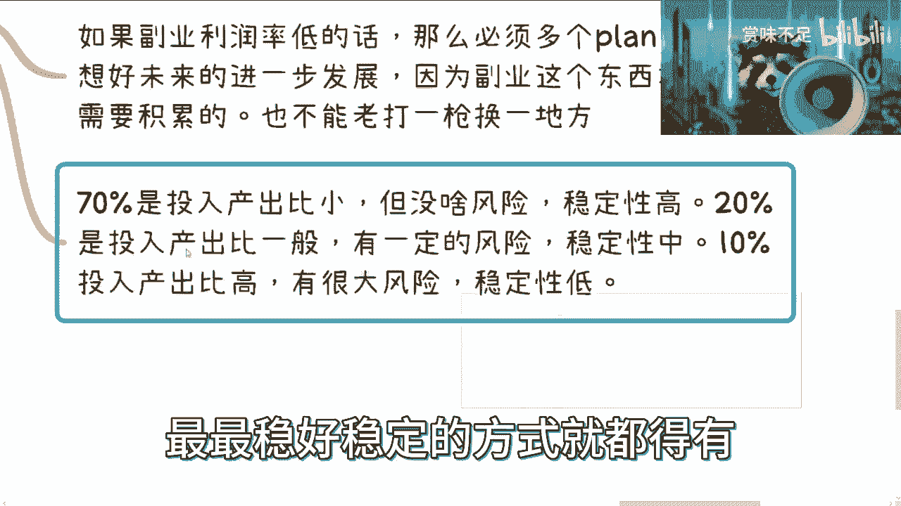

这个就跟你投资这个这个这个这个这个这个。

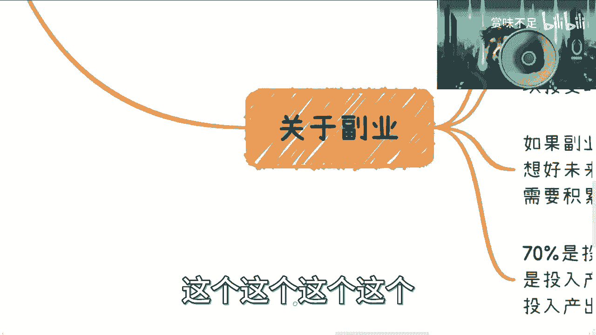

这个风险把控是一样，然后诶这个地方没写虚化四是吧呀。

然后你比较关于平衡这个渲染。

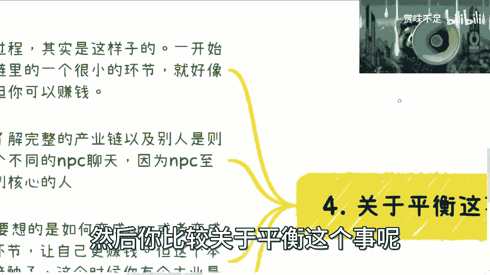

我跟你们说是这样子的，但简单来讲呢，就是说你副业做的过程当中啊。

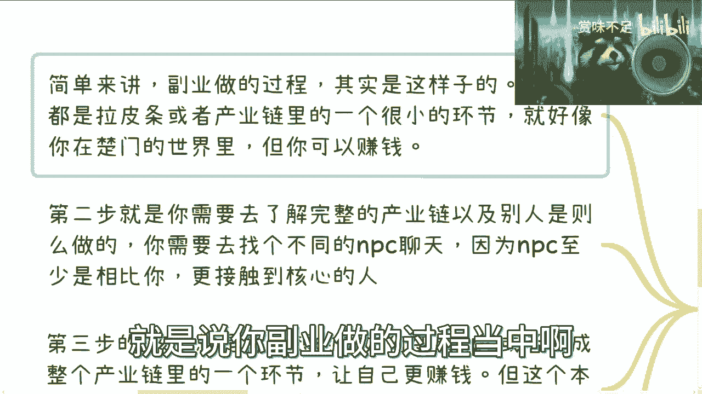

其实是这样子，一开始呢你是拉皮条，或者是一个产业链里面很小的一个环节，你是可以赚到钱的，这就好像呢你是在楚门的世界里面对吧，你是一个楚门，但是呢你是可以赚钱的，赚多赚少，咱先不去说它对吧。

但是你的效率是比较低的，这是一开始啊，第二步呢就是你可能需要去了解完整的产业链，就是我们说的你得去了解这个产业的规则，你得了解别人是怎么赚钱的，因为你不了解规则，不了解别人怎么赚钱，你单靠你的YY。

单靠你的冥想，你是不可能想出来你不知道的东西，是不是，那么你就需要去找不同的NPC对吧，聊天就我们说的这个楚门的世界，里面的工作人员，对不对，那为什么呢，因为至少这些工作人员是相对你来讲。

更接触到核心的人，因为毕竟人家是工作人员，是不是啊，那么我们就说就这当然啊，这个就真的打个比喻啊，你们别这个听不懂啊，这第二个第三个就是说第三点呢，就是核心就是你得想要去想，你要么就变成工作人员。

要么直接就变成整个产业链里面一个一个环节，就比如说当时这个直播楚门生活的，这种电视台对吧，或者或者来说给他们送外卖的，送吃的对吧，在里面开店的对吧，你就要么就变成一个环节，让自己更赚钱，你明白吧。

但是本质上是什么呢，你需要自己多去接触这个世界，得要去多去接触这个行业，那么这个时候你你但凡有一个我不说996吧，就朝九晚五很稳定的主业都是不现实的，因为你要去打的关系，你要去跑的业务。

你要去接触的东西很多很多，不是说你有一份主业，就靠双休日就能完成的，不不现实的，我可以明确告诉你们哦，就是你的投入和你的产出永远是成正比的，你不要想着说我既要又要我告诉你们，1。1点可能性都没有的啊。

就我也不是天才，你们也不是天才对吧，就大家作为一个普通人，不要去想这么不切实际的事情对吧，然后呢呃最终就是说呃为什么会有这一点呢，是因为最终就是说你要明白，所有靠着别人都是没有戏的对吧。

你就我就随便给你举个例子，你比如说驴老师，他说你比如说你跟我合作啊，然后你说要不这样吧，驴老师，我这边每个月给你开5000块钱薪资对吧，你帮我去跑跑业务，我就跟你说，你但凡就算这样子，我也是靠不住的。

为什么，因为你要明白所有东西赚钱的人是最伤心的，我赚钱吗，在这件事情里面，我不赚我赚钱的，但是我赚的就是你5000块钱的薪资，那么我做事情的态度就是打工态度对吧，那你指望我能给你拉来多好的。

这个叫什么资源吗，不见得对吧，或者说根本就不可能对吧，所以说其实最核心的是你们你自己去跑啊，然后你有了一两个东西，你之后你你跟我说，哎驴老师啊，这个我们合作一下对吧，比如说我们五五开对吧。

或者四六开我都可以的啊，然后就是就是往下做，那么一旦有了第一次的合作之后，那么其实我觉得后面大家就明白了哦，怎么去找资源啊，怎么去做，这个才是个正向发展，你知道吗，所以说你千万别想着说所有东西靠别人。

别人只能给你打工，别人是不可能为你去找到你想的东西呢。

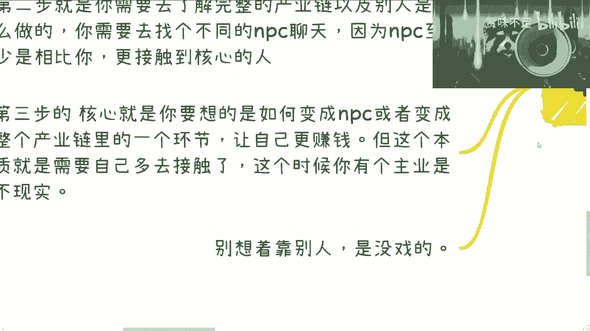

啊不现实的，这个就是人性就是这个样子的啊。

所以说呢你说平衡这个事儿吧，我是这么想的，主要是看你想怎么做，因为并不是每一个人都想做成我这个样子的，对吧，也不是并不是每一个人都都都具有，这么也不不想，就是说生命线这么波动嘛，或者这么折腾嘛对吧。

所以说我觉得主要是看你你想怎么做，你有多少的核心竞争力对吧，你的资源有多棒对吧，然后还有一个呢，就是说呃就说就说我为什么不做呢，是因为我有无数个plan，但这些判断都不是主业啊，因所以我不想去做。

为什么呢，因为主业往往是我不喜欢做的，就是你说我能不能做，我能做，但是我不愿意做，不喜欢做，我做的我不开心对吧，同时花时间呢我是帮别人呀，就是同时呢花时间呢是帮别人去干活的，而不是自己去干活。

同时也不是自己的成长和积累，那我为什么何必呢，对吧，我为什么要去做呢对吧。

那你们如果觉得啊，是因为就是说副业的收入不够。

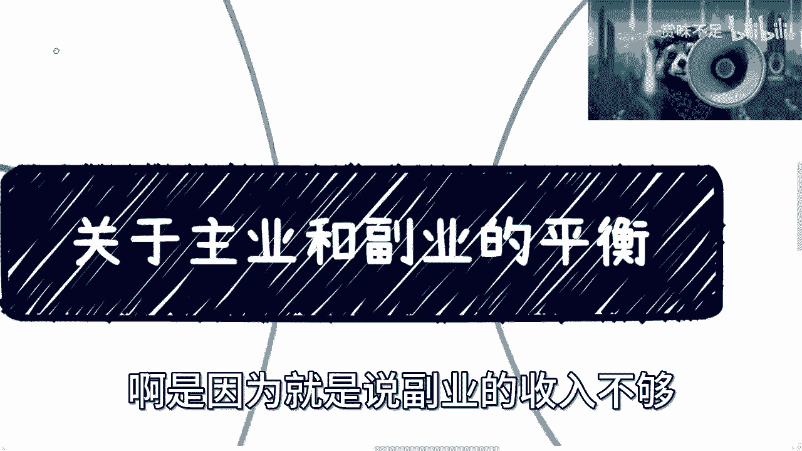

那我觉得是因为你们的副业做的不够的踏实，不够强大，那你们如果觉得不够稳定。

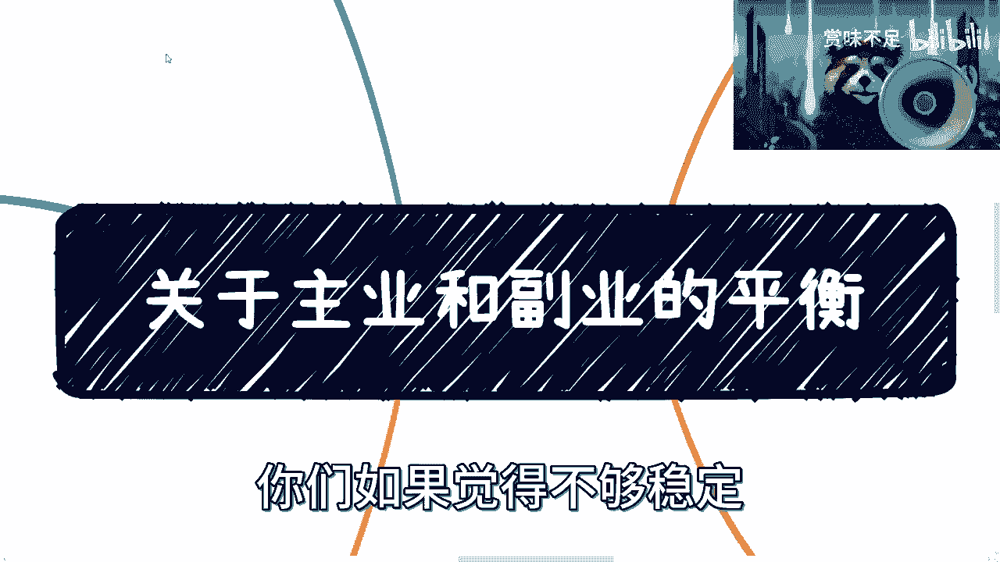

那我觉得就是因为你们副业不够多对吧，你像我现在排列ABCDEFG，我不说16个字母吧，13个字母我肯定是数数得到的对吧，那么对我来讲我就完全不关心，就是这当中有一些跑不通就跑不通呗。

赚不到钱赚不到钱嘛对吧，但当中但凡有一些人赚钱就可以了，但这不重要对吧，而且这些政府的官员，企业的高管，企业的创始人，能够给我带来的单子都是可持续性的，那我觉得就很nice是吧好吧。

那么这个问题我就基本上是这个样子，我觉得你们可以顺着这个思路往下想，就自己定义一些计划好吧，别就是说嗯怎么说呢，就在一开始定计划的时候就就就就歪掉好吗，这样子的话就不太好好吧，OK那最后我提一嘴吧。

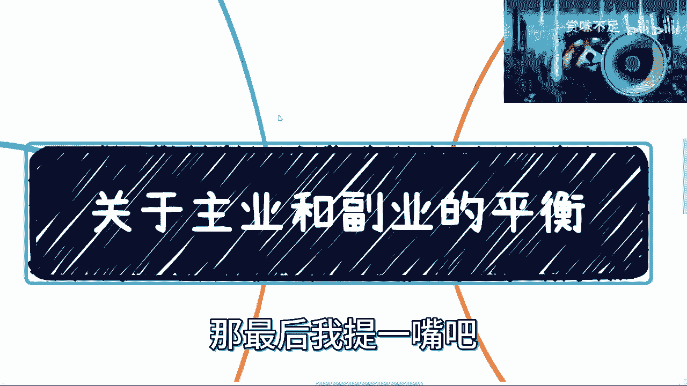

反正你们但凡有任何呃职业啊，或者说创业啊，或者发展上面的问题，反正你们可以私信好吧。

