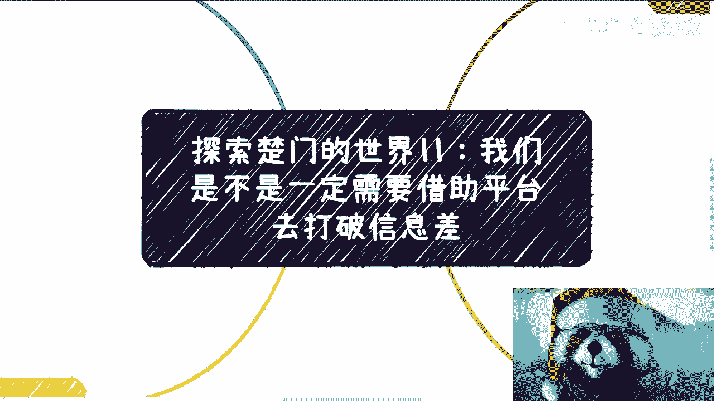

# 楚门的世界 11：打破信息差必须依赖平台吗？🚪

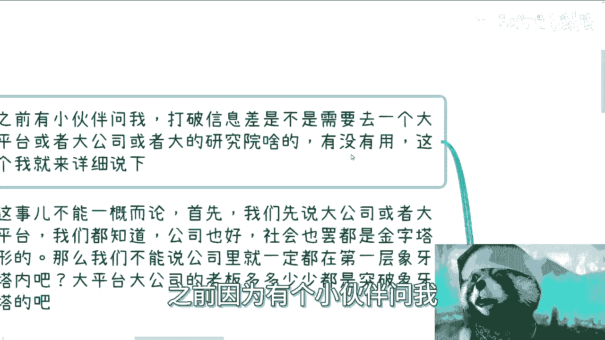

在本节课中，我们将探讨一个核心问题：打破信息差是否必须依赖大平台、大公司或大型研究机构。我们将从多个角度分析平台的作用、获取信息的有效途径，以及个人成长的本质。

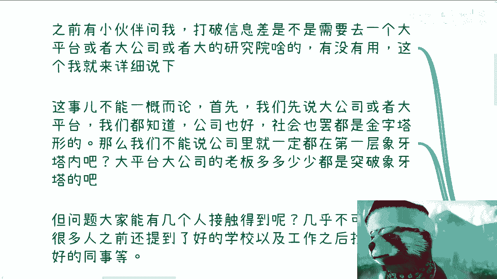

---

## 1. 平台内部的信息壁垒 🏢

上一节我们讨论了信息差的概念，本节中我们来看看平台是否能有效帮助我们打破它。

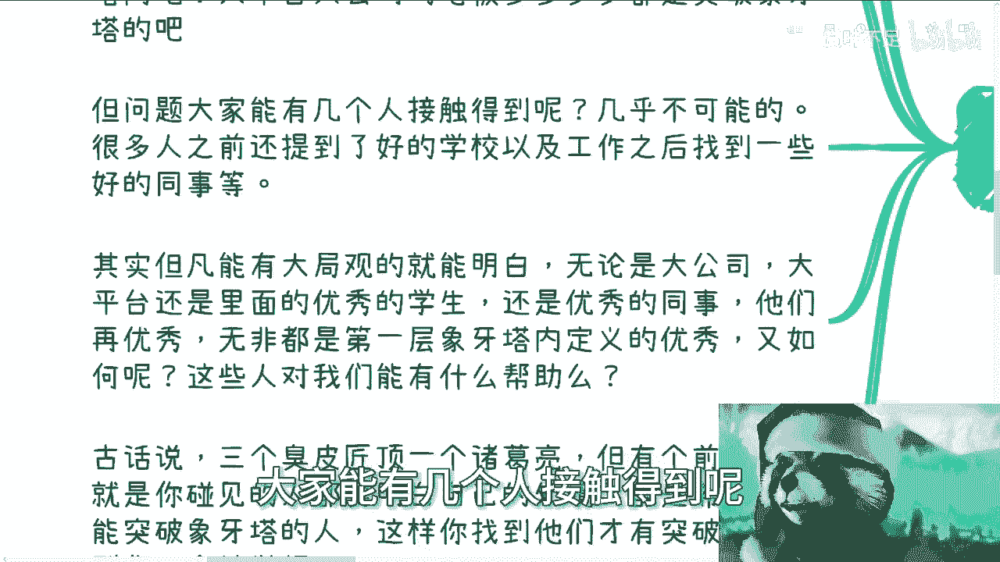

首先，公司或社会结构通常是金字塔型的。我们不能断言公司内部所有人都处于信息闭塞的“第一层象牙塔”中，创始人或高层管理者很可能已经突破了这一层。然而，对于普通员工而言，关键问题在于能否接触到这些掌握关键信息的人。

以下是接触平台内部核心信息的难点：

*   **接触概率极低**：在拥有数万人的大公司里，普通员工几乎不可能接触到真正掌握核心信息与资源的决策层。
*   **定义的“优秀”局限**：即便接触到优秀的同事、导师或教授，他们所代表的“优秀”也往往是第一层象牙塔内所定义的标准。他们本质上是该体系内的“工具人”，其认知存在边界。
*   **协作前提缺失**：古语“三个臭皮匠顶个诸葛亮”成立的前提，是协作各方都**明白自身处境**且**拥有共同突破的意愿**。若认知层次不同，沟通便是“鸡同鸭讲”，不仅无法突破，甚至可能因理念不合而引发冲突。

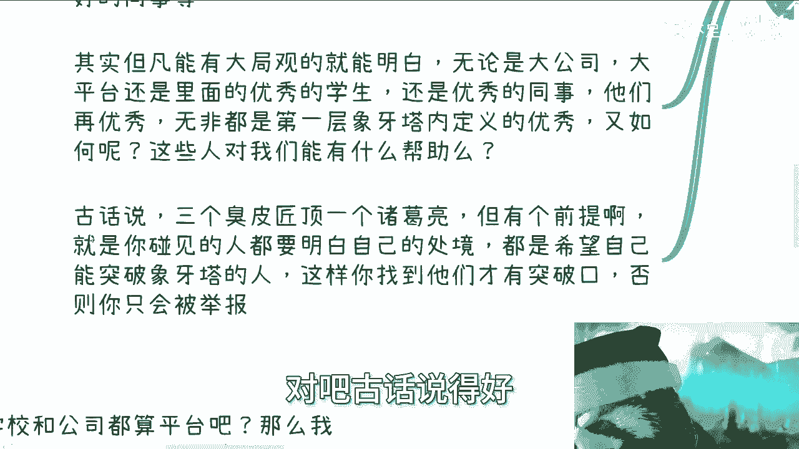

因此，单纯依赖进入大平台，并不能保证你能接触到打破信息差所需的关键有效信息。

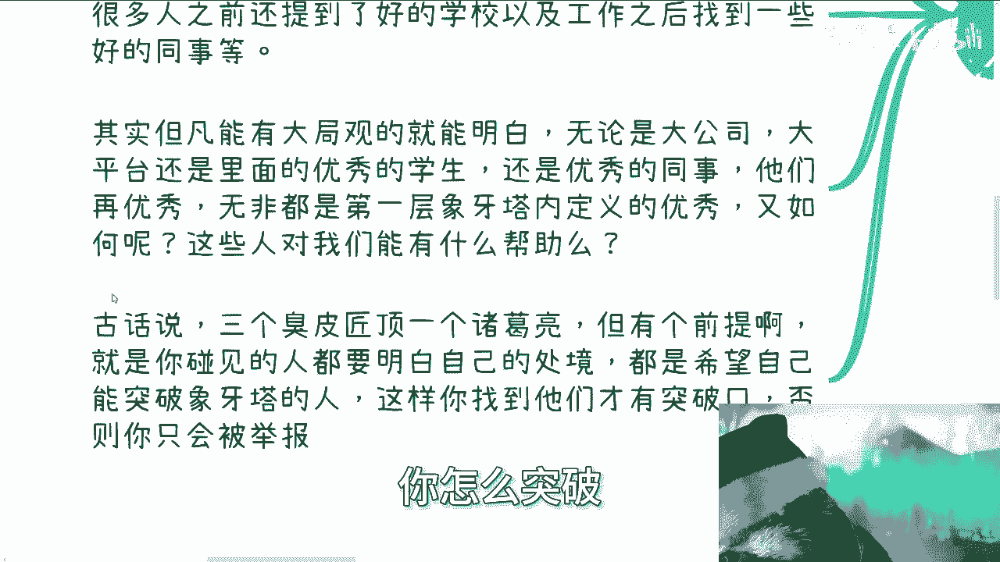

---

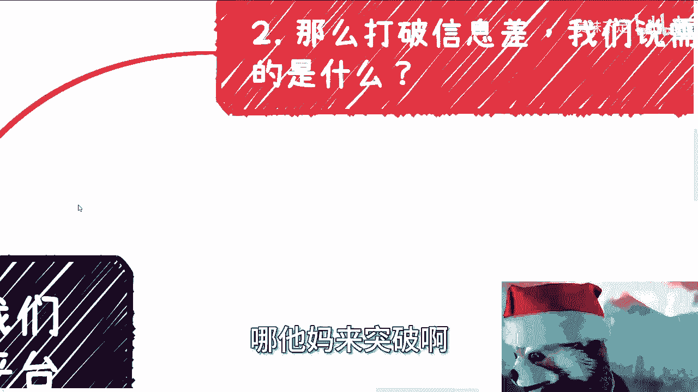

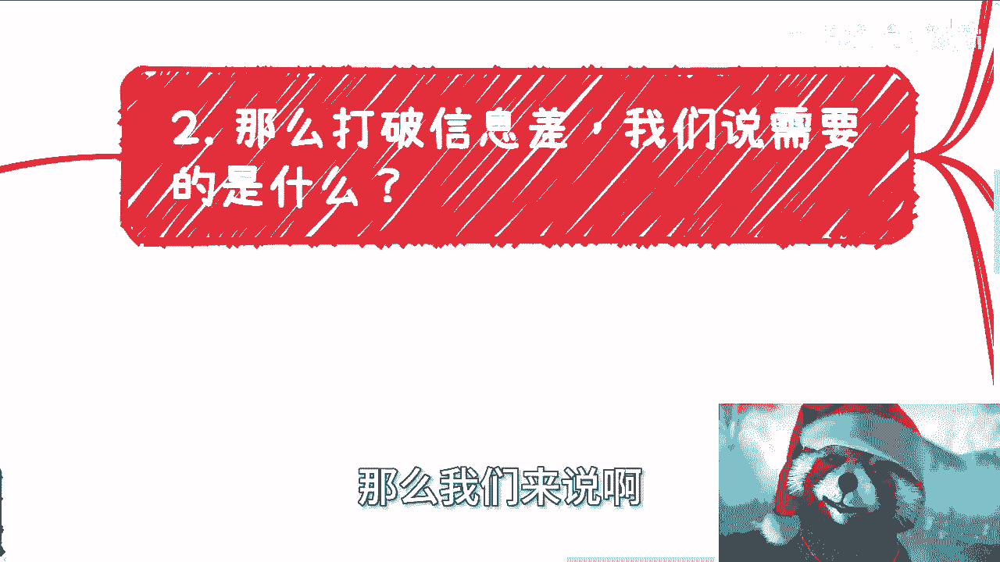

## 2. 打破信息差的核心路径 🔍

既然平台内部接触核心信息困难，那么打破信息差的有效方法是什么？

对于普通人而言，**唯一有效的渠道是持续进行商业项目实践**。这里的关键在于以**商业合作伙伴**的身份参与，而非签订劳务合同的雇员身份。

以下是两种方式的本质区别：

*   **商业合作（平等关系）**：
    *   关系公式：**个人  ↔  公司/个人** （平等主体）
    *   合作基于项目，双方地位相对平等。可以自由选择加入或退出（受合同条款约束），专注于价值交换与信息获取。
*   **劳务合同（从属关系）**：
    *   关系公式：**雇员  →  雇主** （从属关系）
    *   一旦签订劳动合同，双方便确立了管理与被管理的不平等关系。在此框架下谈论平等获取信息或资源极为困难。

打破信息差的本质是**获取更多有效信息**。直接询问他人通常无法获得真实答案。而以外部商业合作者的身份切入，配合良好的沟通话术和信息搜索能力，就像与游戏中的不同NPC对话，能从多方获取碎片化信息，最终拼凑出完整图景。

我们需要平台吗？需要。但这里的“平台”是指能为我们**背书**（提供Title、背景、案例）的合作关系，而非一份雇佣工作。获取一个合作背书远比获得一份入职offer要容易，因为合作意味着你为对方**创造价值**，而入职意味着你向对方**索取薪酬**。

---

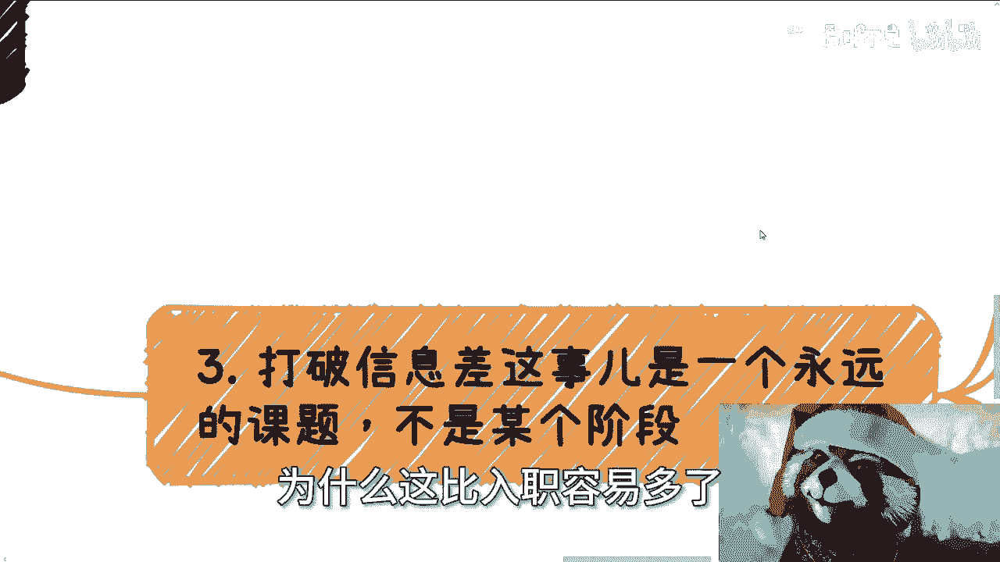

## 3. 成长是非线性的终身课题 📈

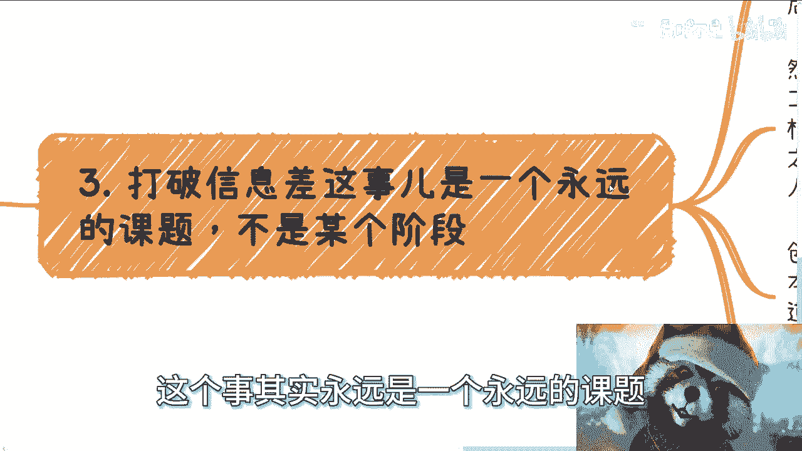

许多人对于成长存在一个根本性误区，认为它是线性的、分阶段的。

一个典型的线性成长幻觉是：**读书 → 打工积累经验 → 创业 → 融资 → 做大项目赚钱**。然而，现实并非如此：

*   **读书与打工**：学校所学知识与公司实际所需技能往往脱节，进入公司后通常仍需从零开始学习。
*   **打工与创业**：打工是执行层思维，创业是所有者思维。十年打工经验并不等同于掌握了创业所需的资源整合、风险承担和商业规则运用能力。
*   **创业与赚大钱**：创业成功与赚大钱没有必然联系。赚大钱更深层地依赖于对社会运行规则、财富分配规律和政府政策的理解与运用。

这种线性思维模式大多来自父母或培训机构的灌输，它让很多人认为“时候未到”而选择等待。打破信息差、积累商业经验、掌握赚钱手段，是与生命同步的**终身课题**，并非某个特定年龄或阶段才能开始或结束的事情。意识到这一点并立即开始行动，至关重要。

---

## 4. 平台与教育的“不教之秘” 🎓

既然平台和学校（公司）是主要的知识传授机构，那么一个关键问题是：为什么它们教授各种学科知识、管理知识或技术知识，却唯独不系统性地教授“如何赚钱”？

从全局视角看，赚钱本身并无神秘的高门槛。那么原因可能是什么？虽然没有明确答案，但一个合理的推论是：**体系有意不教**。

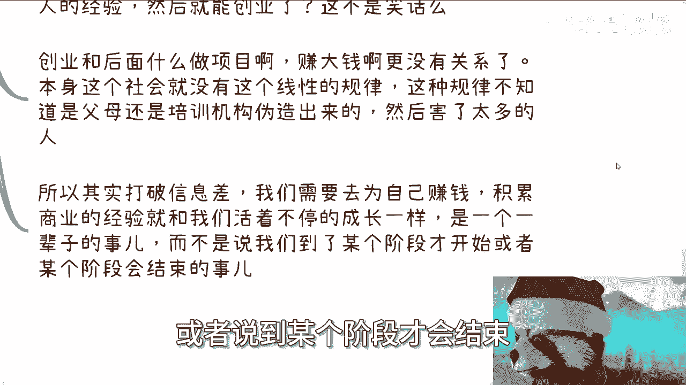

这正如《穷爸爸富爸爸》中暗示的：维持现有体系的稳定，避免过多竞争者涌入上层赛道，符合既得利益者的需求。社会大部分人的智商差距并不大，核心差距在于**思维模式**和**信息获取的广度**。一旦思维模式改变，洞见增多，很多人就会“开窍”并异军突起，而这并非现有体系的掌控者所乐见。

---

## 5. 重新定义“借助平台” 🛠️

回到最初的问题：我们是否一定需要借助平台？

答案是：需要，但必须重新定义“借助”的方式。

在整个过程中，**你才是主角**。平台、研究院或其他机构，都应被视为你的**工具**。你的目标是利用这些工具来升级、打怪、打破信息差，而不是通过入职去依附和“跪舔”它们。

思路的转变意味着目标的根本不同：从“寻求被平台认可”变为“主动利用平台资源达成自我成长”。

---

## 总结 ✨

本节课我们一起学习了如何正确看待平台在打破信息差过程中的作用。

1.  **平台内部存在壁垒**，接触核心信息困难，且其定义的“优秀”存在局限。
2.  **打破信息差的核心路径**是通过**商业项目合作**平等地获取信息，而非通过不平等的雇佣关系。
3.  **个人成长是非线性的终身课题**，打破信息差和商业实践应尽早开始，持续进行。
4.  **传统教育体系有意忽略“赚钱教育”**，以维持现有结构稳定。
5.  **正确“借助平台”的方式**是将其视为工具，以我为主，主动利用，而非被动依附。

最终目的，是增强个人生活的**抗风险能力**，减少对单一雇主或客户的依赖，掌握生活的主动权。无论年龄大小，从现在开始观察社会、参与实践，都为时不晚。