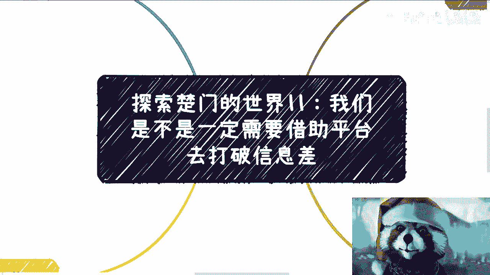
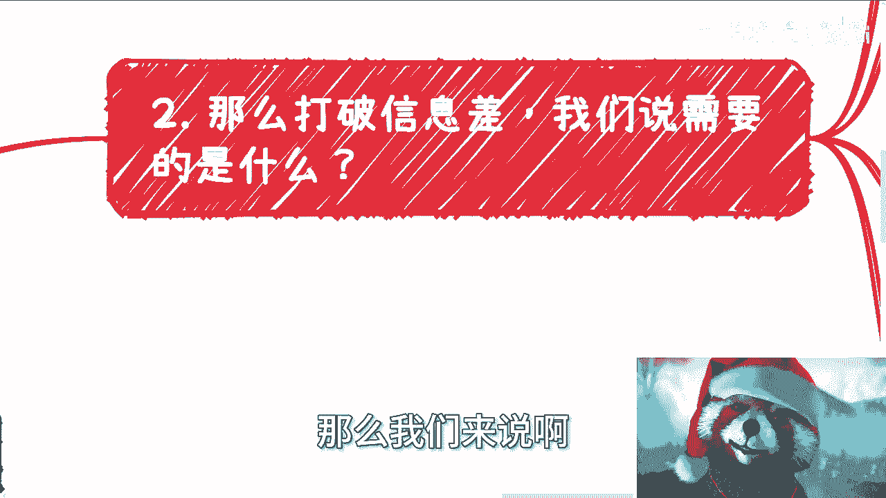
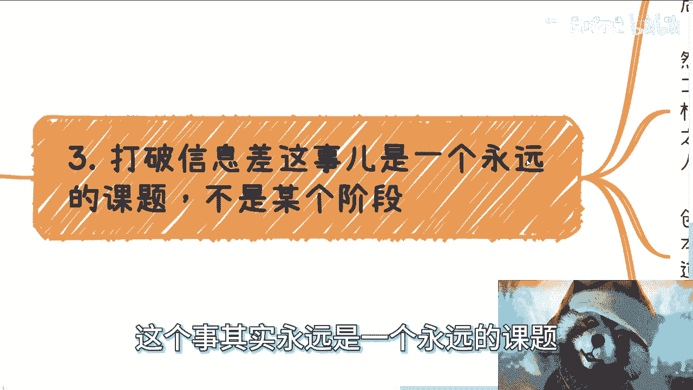

# 楚门的世界11：我们是不是一定需要平台才能去打破信息差 - P1 - 赏味不足 - BV1Mx42117ns

哈喽大家好，这个两个连着录是吧哈哈，今天我们继续来讲探索楚门的世界，11啊，之前有个小伙伴在评论区这么问，我说这个技术平台啊，我们先来看一下前因后果啊，呃首先呢之前因为有个小伙伴问我。

他说打破信息差，是不是需要去一个大平台或者大公司，或者大的研究院啥的啊。

有没有用啊，那么既然如此，那我就借这个机会，我就详细说一下这事儿呢不能一概而论，首先啊我们先说大公司或者大平台，按照今天你们所看到的东西，你们应该到今天应该知道了，就是说公司也好，社会也罢。

都是金字塔型的对吧，都是金字塔正金字塔啊，正金字塔型的，那么我们不能说公司里面就一定都在第一层，向日台里面吧对吧，比如说一个一个公司几万人，你说他妈的这些，这些人都在进那个第一层象牙塔内，我不相信他啊。

肯定有人明白的，只不过他不说啊，只不过他不说，那么嗯而且另外一方面就是说大平台的大公司，大平台大公司的那些老板，多多少少也都是突破下一塔的啊，我说的是那些创始人啊，不要来跟我讲。

你们那些什么什么有的没的leader啊，那些也他妈的都是垃圾，都是垃圾好，然后我们继续来看啊，那么问题是，就算公司里面有这些人，大家能有几个人接触的到呢对吧。

你们想想看，你们有几个人接触的到呢，这个是关键点了对吧，几乎是不可能的，很多人之前还提到了什么好的学校，或者工作之后找到一些好的同事，其实你想想看啊，但凡能有大局观的就都能明白。

无论大公司大平台还是里面优秀的学生，优秀的同事，优秀的导师，优秀的教授，我就告诉你们，他们再优秀，无非都是第一层象牙塔里面所定义的优秀，无非也都是第一层象牙塔里面所定位的工具，人又如何呢，又怎么样呢。

啊你们去找这些人对我们能有什么帮助呢。

屁帮助没有对吧。

古话说得好，三个臭皮匠顶一个诸葛亮，但这有个前提啊，前提就是你碰到的人都要明白自己的处境，他都是跟你一样，希望自己能够突破象牙塔的人，那你找到他们，你们三个人，你们几个人成群才有突破口。

否则哪来的突破口啊，你都是鸡同鸭讲，你怎么突破。

你剩下只会被举报，我就跟你们说的直白一点，哪他妈来突破对吧。

这是第一点，第二点啊，那么我们来说打所谓打破信息差。

我们需要的是什么，你看啊，打破信息差，对于老百姓来讲，唯一的渠道就是不停的做项目，不停的做没了，我跟你讲没了唯一的渠道，而且要用商业合作伙伴的方式去做，而不是一个入职劳务合同的方式去做。

我发现到今天为止，很多人还是搞不清楚这个东西啊，就是说你想呀所谓外来的和尚好念经，你跟别人商业合作才是平等的对吧，也就是说你今天比如说你今天跟陈老师对你说，你跟我商业合作，你想做就做，不想做。

你随时退出，我能把你怎么样，我能把你怎么样啊，除非就是说我跟你的合同里面写了违约对吧，那其他情况下能把你怎么样，在不签合同的情况下能把你怎么样呢，对不对啊，或者说你你可以开心的做，你不会受我的气。

也就是说我们就是我没有任何立足点，来来来去批判你，或者说你也没有立足点来批判我，大家是平等的，但是你一旦劳务合同，你怎么搞啊，劳务合同是什么意思，劳务合同就是你跟你的老板，一开始就是不对等的。

你现在还怎么搞，你跟他谈平等吗，难道你跟你的老板谈平等啊，你跟一个签过劳务合同公司谈平等，我觉得你怕是没活在地球上过好，那么我们打破信息差的本质是什么，就是要获取更多的有效信息对吧。

我们只有获取到更多的有效信息，才能弥补我们对于信息的那些缺失，那么怎么让别人告诉你更多有些信息呢，你说你直接去问他，他会告诉你吗，绝对不可能的对吧，所以说你会发现什么，就是说无论怎么讲。

外部的商业合作的切入点会让人更放心，你只要话术沟通够够好，搜索能力更好，你能够从不同的人身上获取不同的有效信息，这就跟我们玩游戏一样，你可以跟不同的NPC交流，然后从他们身上获取到碎片化的信息啊。

那么你说我们要不要平台，当然要，但这个平台就如我们刚刚说的，并不是说你要去入职，而是你只要有一个合作关系，你只需要让对方确认你出去可以带着他们的title，带着他们的背景，带着他们的案例就可以了。

这他妈不比入职容易多了啊。

而且你们想想看，为什么这笔录制容易多了。

因为入职相当于是你在问他要钱，你跟他合作相当于你给他创造财富，你觉得老板喜欢哪一个，你觉得资本家喜欢哪一个，对不对啊，好，然后第三个打破信息差，这个事其实永远是一个永远的课题。

它不是某个阶段啊，什么意思，就是说很多人他有个误区，认为自己的成长是线性的，也就是说自己先读书，然后去公司打工，然后有了一定经验可以出去创业，然后创业有一定经验就可以拿融资，融了资就可以干嘛干嘛。

然后做大项目赚钱等等等啊，然而啊我跟你们讲，只要有点脑子的，你老人只要不是像那个那个那个那个叫什么，就就就瓜子仁那么大的话啊，你稍微想想看，你就能明白你读书跟打跟公司打工有关吗，请问你有关吗，啊。

你读书读的东西跟你到公司里去打工，有什么关系啊，你普通人不往往还是学习去学习，打工是打工，你到了公司里面还不是从零开始吗，有什么区别啊，对吧，你打工有一定经验之后，跟创业更没有半毛钱区别了。

你打工打10年就会创业了啊，你你懂什么创业吗，你你打10年工，再做了10年的工人，你会创业了啊，are you kidding me是吧，然后创业跟后面什么做项目，赚大钱就更没关系了对吧。

因为创业本身更多的是什么，你要去做一个产品，做个服务，你能赚大钱，并不是因为你创业创的好，更多的是你懂得如何运运用，这个社会的赚钱的规律，和这个社会和政府的规则对吧，你这种你你这种规律规则你都不清楚。

你赚什么钱啊，你之所以这么多人，脑子里面会有我们刚刚说的那种线性的规则，为什么，是，因为这种规则，八成都是父母或者培训机构伪造出来的，然后害了太多的人。

就很多人他虽然没有经历过，但是他认为父母说的是对的，他认为他的人生的成长是线性的，好了完了啊，所以说其实打破信息差，我们需要的是什么，我们需要的是为自己赚钱，去积累更多自己赚钱的手段，去积累商业的经验。

跟我们活着在不停的成长，其实是一样的，它是一个一辈子的事情，而不是说我们到了某个阶段，有很多人就觉得，我现在还小，你小个屁呀啊，你想啥，我跟你讲，你走出中国，你出去看看，你到新加坡，你到美国去看看啊。

我们以前出去开会，比我们会说的，比我们有经验的，人家都他妈只是大一大二啊，啊你小什么东西啊，你只是在中国觉得你小你小什么玩意儿对吧，所以说你真的你要去学习这种东西，你要去锻炼自己。

不是说到了某个阶段才开始，或者说到某个阶段才会结束。

你是一开始就得开始的，只不过中国人的在这个教育下面，大家没有这个意识，这就是你们缺失的东西，好，我不管你们现在年龄多大，你缺失这个东西就已经缺失了，能怎么办，你后悔也来不及对吧。

好第四点，我们再来说说平台或者机构啊，既然说平台跟机构，我就问你们学校跟公司算不算算吧对吧，那好那我们研究这个问题，我们往下问，请问为什么学校跟公司交了这么多，学科类的知识。

所谓内部管理类的知识或者技术类的知识，那就是不教大家怎么赚钱呢，诶我奇了怪了啊，难道是因为赚钱门槛太高吗，难道是因为赚钱门槛太高吗，啊赚钱有什么门槛，我们就拿上帝视角，拿全局视角来看社会。

我就问现在赚钱什么开，我不是说现在整个比如说改革开放到现在，赚钱有什么门槛吗，有人定义过吗，有人说过，你要赚钱一定怎么样怎么样，你没有这些赚不到钱有吗，请问有吗，没有吧对吧，既然赚钱本身没有门槛。

那为什么他们不交呢，是因为他们不会吗，不是为什么，虽然到今天没有明确的答案对吧，但是就跟那个穷爸爸富爸爸那个作者说的一样，他其中所提到的一个结果是什么，就是他们不想交，就这么简单，因为只有他们不想交。

只有他们不交，这样上面的人才是最稳定的，上面的人才能赚到更多钱，也不至于这么卷，也不至于太多人来竞争，这逻辑很通啊。

没有问题对吧，所以说其实就是我说的很多人，整个社会就是个草台班子，很多人智商是差不多的，不存在特别聪明或者特别不聪明，只你你知道吗，你你大部分人的差距在哪里，只是在于这个思维模式。

只是在于在第一层象牙塔里面，到底看到多少的信息，它是用一个洞再去看，还是说已经把这个洞挖得很大，再去看它仅仅是这个区别，你一旦思维模式改变之后，我跟你讲，有些人他就会开窍，他就会很牛逼，会异军突起。

这就不是资本家或者企业家希望看的。

看到的就这么简单，那么我们再回到他问的这个问题，你说我们是不是一定需要借助平台呢，你要明白借助吧，要打，但是在整个故事当中，你是主角，平台也好，呃，研究院也好，或者别的东西也好，都是你的工具。

都是你的工具人或者工具工具来用，而不是说哦，我们借助平台是为了入职去跪舔他们，不是的，你的思路就不一样，你的目标是你去升级，你去打怪，你去打破信息差，而不是说哦你今天要入职跪舔他们。

然后获得某一个东西没有用的，好吧，我希望就是说我希望就是说，不管你们现在年龄多大，任何时间其实都是来得及去看看社会的，因为很简单嘛，就是说我们最终的目的，就是为了让自己能有更多的抗风险性。

我们先不说赚多那么多的钱，或者说你说什么大家移民要怎么样，这不重要，重要的是你至少生活下去，不会被你这家公司，或者被你的所谓的甲方所左右对吧，不会因为明天给你个大礼包，明后天给你一个什么什么什么。

跟你说这个业务不做了，或者跟你说降薪而烦恼，就这么简单，没了呀，我们还图啥呢，你图别的东西以后再说嘛，是吧行好吧，就这么着吧，然后那个明天晚上活动了好吧，然后后面的话有什么职业商业上的问题好吧。

你们在整理好啊，我们可以在做咨询，反正现在的话就是说下周的那个白天晚上，好吧行。