# 正确的三观篇章1-大部分人都在间接的助纣为虐---P1---赏味不足---BV19H4y1M7J2_

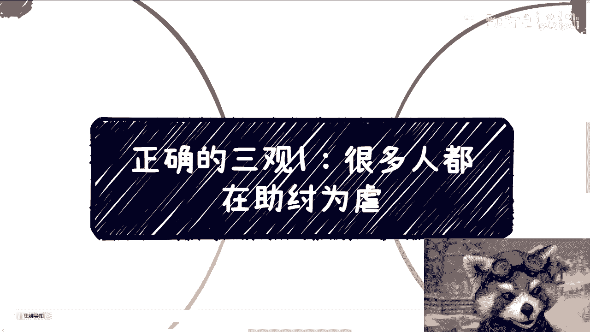

在本节课中，我们将探讨一个关于价值观的重要话题：为何许多人的日常行为，实际上在间接地助长不良风气并最终伤害到自身利益。我们将分析其背后的逻辑，并通过具体例子帮助大家理解。

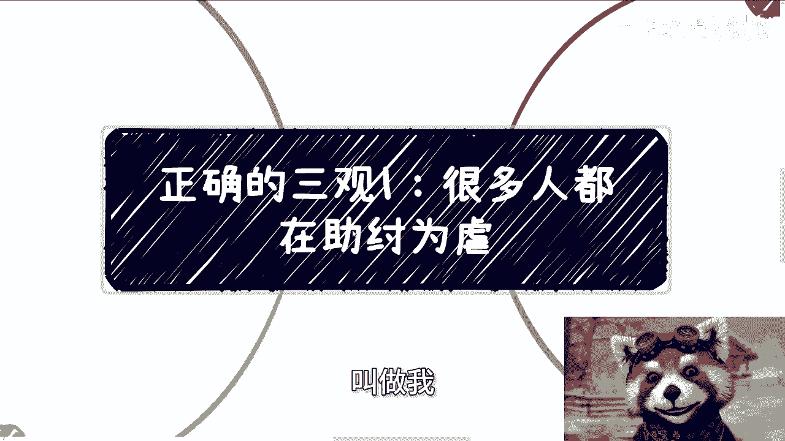

---

今天讨论的主题与以往不同。有朋友与我探讨何为正确的三观。我认为这个话题可以从很多细分角度切入。我本打算将其放入付费内容中，但思考后决定公开分享。今天讲第一部分。

我认为，从根本上判断一个行为正确与否，可以遵循一个核心标准：**一切利益是否从老百姓出发**。你所做的任何事，如果真正有益于老百姓，那就是正确的；反之，则是不正确的。

然而，很多行为并不直接触及我们自身的利益，因此许多人感受不到其影响。这就好比一个行为间接导致了悲剧，虽然你没有直接责任，但从更高格局看，你并非完全没有问题。这常常是自欺欺人，或只是因为格局不够大。

我最近常说，很多人都在“助纣为虐”，而最终被欺压的对象，恰恰是我们自己。

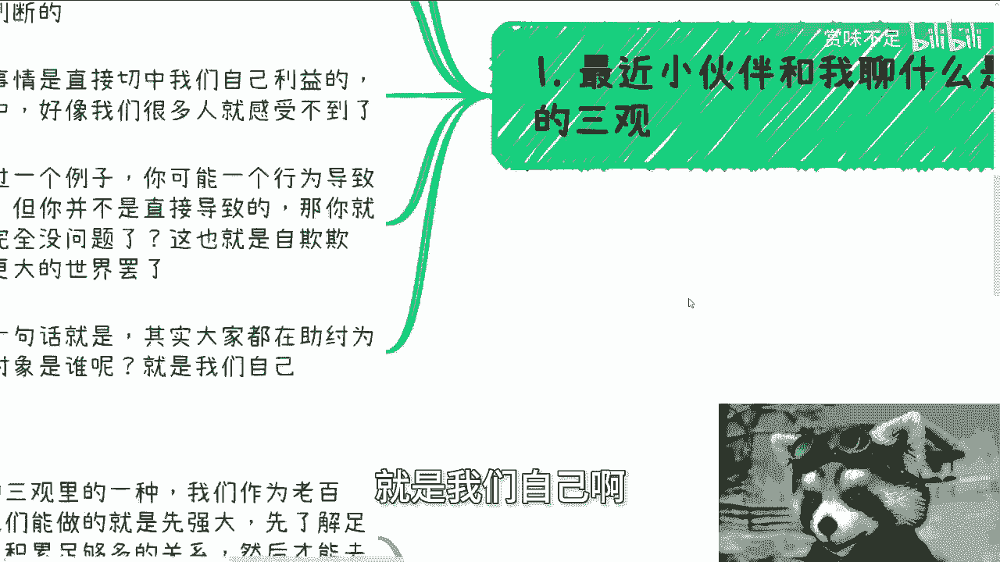

以下是一些常见的、间接“助纣为虐”的例子，请大家举一反三。

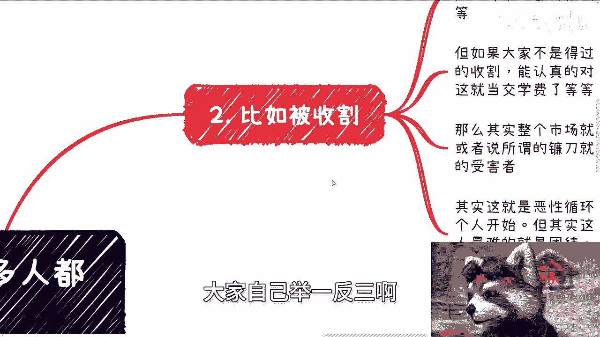

**第一点是关于“收割”。**

每个人一生中都会面临各种形式的“收割”，有的是强制性的，有的则是缴纳“智商税”。你不可能完全避免。但如果大家不是抱着“得过且过”的态度，每次被“收割”后都能认真反思和对待，而不是简单地告诉自己“算了，就当交学费”，那么整个市场和社会环境会比现在好很多。资本家或既得利益者（所谓的“镰刀”）就不会如此猖狂，也不会有这么多受害者。

这其实是一个**恶性循环**或**螺旋式收割**。改变需要从每个人做起，但这非常困难。因为当今社会，人最难做到的就是**团结**。大部分人秉持“事不关己，高高挂起”的态度，除非痛到自己身上，否则不会改变。

**第二点是关于“加班”与“低薪竞争”（内卷）。**

很多人不仅自己“卷”，甚至以此为荣。但我们需要思考“卷”的本质是什么？**卷的本质，是让他人（老板、股东、既得利益者）赚到更多钱，同时伤害自己以及和自己一样的普通劳动者**。这有什么意义呢？

以前大家卷技术、卷思想、卷格局、卷实干，这叫**良性竞争**。但不知从何时起，变成了卷谁更会跪舔、卷谁更能画饼、卷谁加班更多、卷谁年龄更小、卷谁要的薪水更低。这难道有意义吗？这难道不是在让“镰刀”们越来越好过，而让大众越来越难受吗？你需要想清楚，自己究竟站在哪一边。

整个环境因此越来越差，最终导致大众收入减少、失业增多，真正实干的人越来越少。这对大众有什么好处？

说到这里，可能有人会问：“陈老师，你不是也教我们怎么去‘卷’吗？”

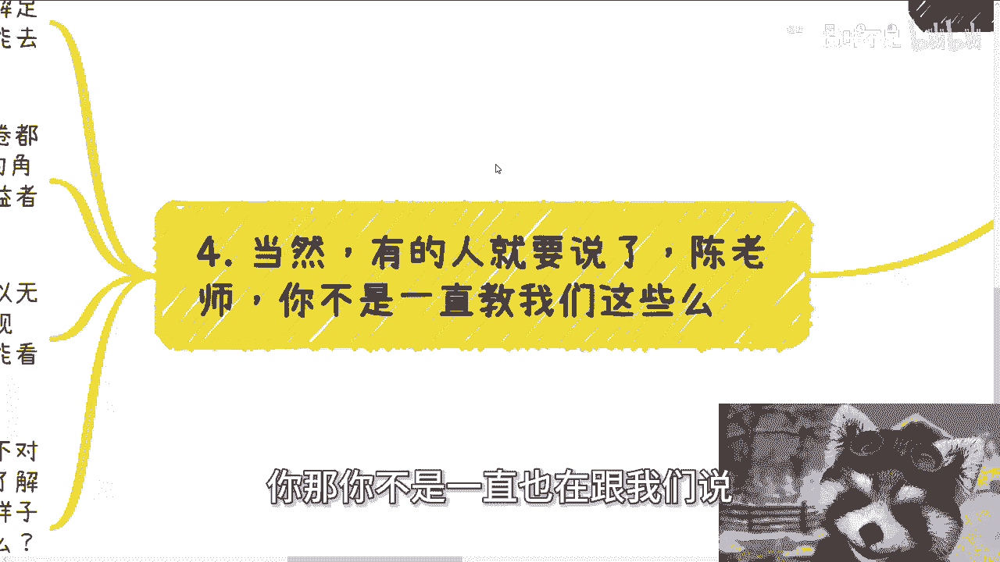

这就是正确三观中的一种辩证思考：作为老百姓，我们有时没得选。我们唯一能做的，是先让自己**强大**起来。我们需要先了解足够多的本质，剥开那层面纱，看到原本看不到的东西，积累足够多的资源和认知，然后才有可能去付出和改变。

但请注意，这种“强大”并非指在职场打工层面去“内卷”。在打工层面的“卷”都是**PUA**，因为你再强大，也永远是一个“工具人”的角色，是资本家的工具。你很难获得更高的格局和视野。既然无法获得，又如何去改变呢？仅仅教打工人如何“卷”，这本身并不是改变。

我们可能无法完全变成资本家，但可以无限接近他们。这意味着我们必须去了解**社会运作规则**和**商业运作规则**，参与足够多的项目实践，才能看到尽可能多的本质。不参与、不实践，仅靠网络信息，你什么也看不明白。

然而，最根本的一点是：你要时刻明白哪些事情是对的，哪些是错的。哪怕你暂时在做“错”的事，也要清楚对错的标准。如何判断？就如我开头所说，要真正去了解老百姓。你需要明白，在不同城市、不同工种、不同层面，老百姓的生活是怎样的。然后判断你做的事是否真正对他们有利、有帮助。如果有，那就是对的。

如果没有，如果你只是单纯赚到了钱，就像投入100分资本却只产出10分社会价值，那就是不对的。

---

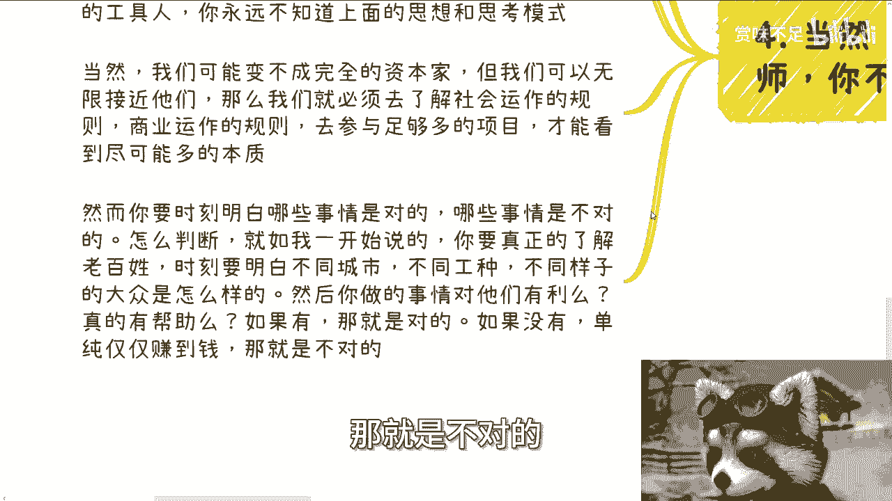

**什么是“助纣为虐”？**

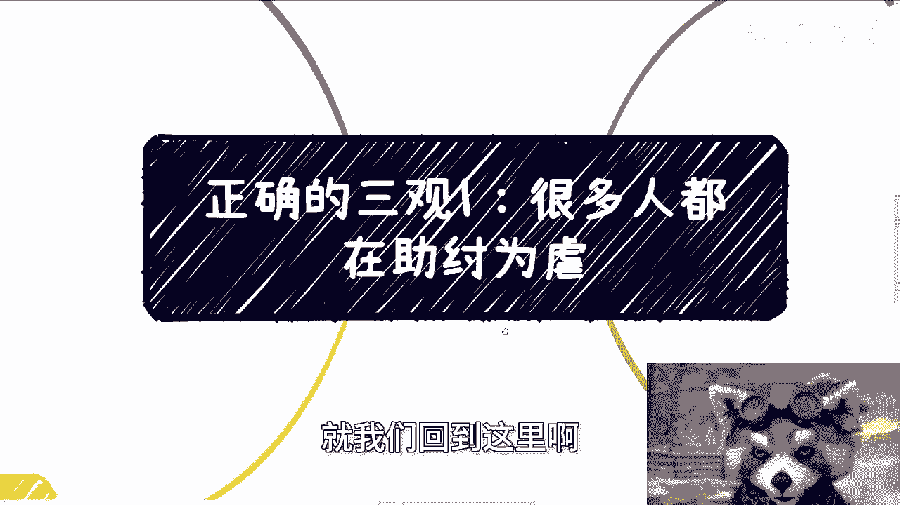

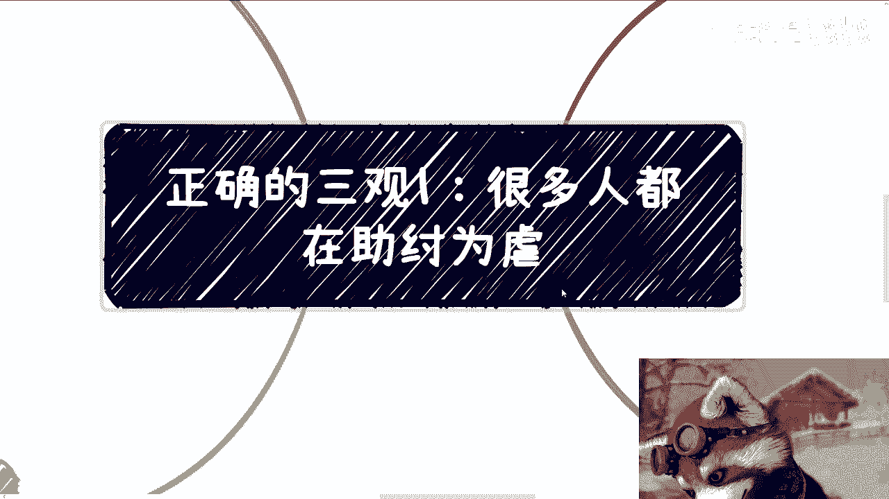

“助纣为虐”的根本在于，你的“卷”和妥协，最终伤害的是我们自己。

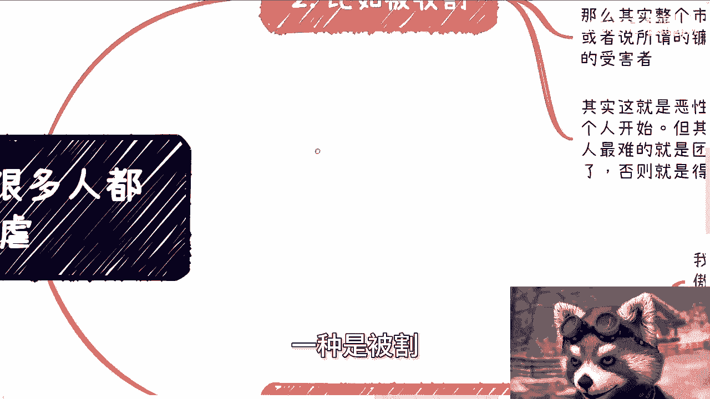

但请大家仔细想想，我们上面只提到了两种常见情况：一种是被“收割”时的沉默，另一种是职场中的“内卷”。难道只有这两点吗？不是的。

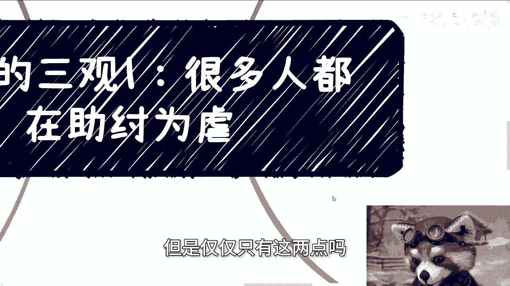

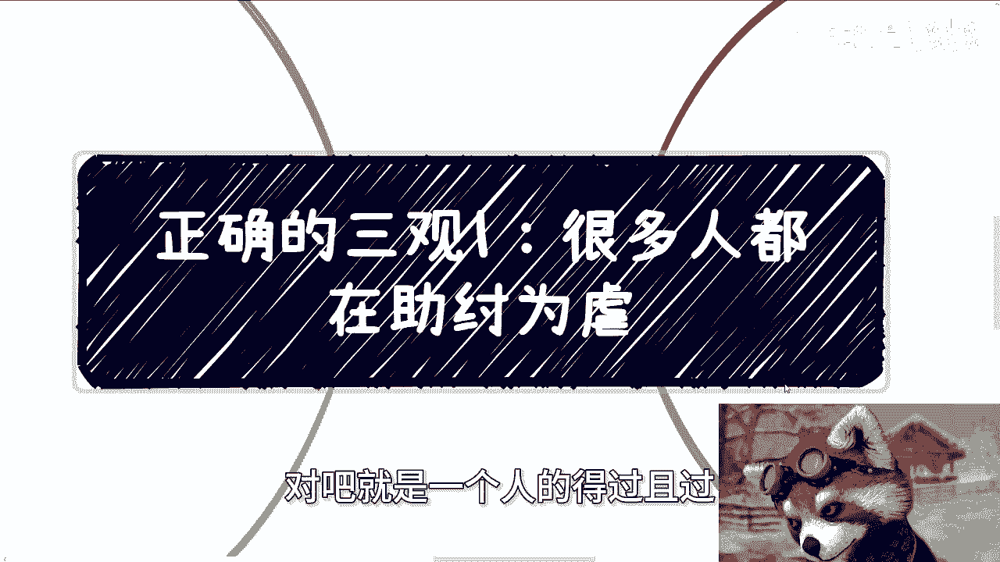

一个人的得过且过，一个人的盲目内卷，一个人的自私，这些行为都会汇聚成巨大的力量，去“助纣为虐”。而这些力量让资本家、既得利益者越来越“爽”之后，他们就会“割”得更狠。这就是一个**恶性循环**。

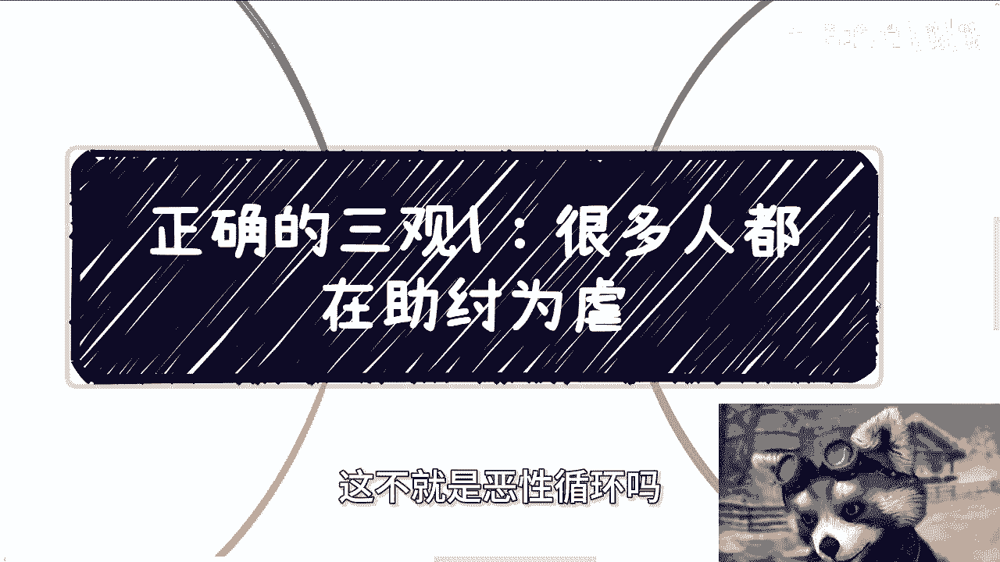

但具体到每个人身上，大家往往并不那么明白。就像我们讨论“卷学历”，不是说“卷”本身不好，但如果你仅仅是被环境、舆论操纵着去“卷”，而不是自己真正想去学习、提升，那你就是在“助纣为虐”。这有区别吗？

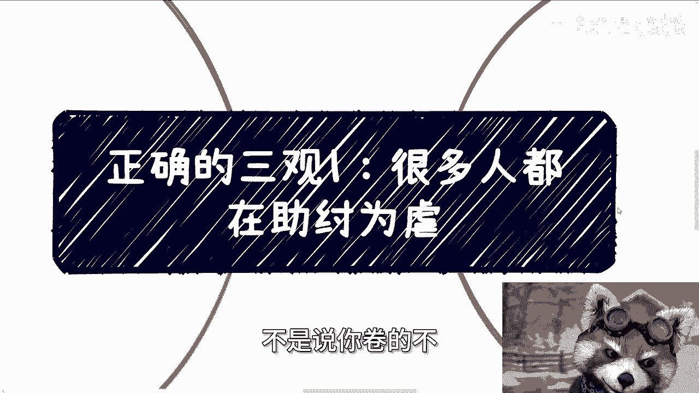

很多人看问题只看一个**节点**。就像讨论学历有用与否，不能只看“毕业能否找到工作”这一个节点。我们需要拉长时间线，看其长期效应，看它最终给社会和个人带来的价值。让子弹飞一会儿。只看一个节点，无法判断事情的好坏。

最后再提一点，就像我今天在群里说的：一个人今天做了坏事，你说他是坏人；明天他做了好事，你说他是好人。这该如何判断呢？所以，看问题需要更全面、更长远。

---

**总结**

本节课我们一起探讨了“间接助纣为虐”的现象。我们学习了判断行为正确与否的核心标准：**是否真正有益于老百姓**。我们分析了“收割”和“内卷”两种常见现象如何构成恶性循环，并伤害到自身。同时，我们也讨论了在现实中，个人应先通过了解本质、参与实践来强大自己，并时刻保持清醒的是非判断。

“正确的三观”这个话题很抽象，后续我会从更多切入点与大家分享。关于职业规划、商业规划、股权、合同等问题，如果大家有疑问，或者希望基于自身现状（如学历、资源等）获得一些规划上的启发，可以整理好具体问题。

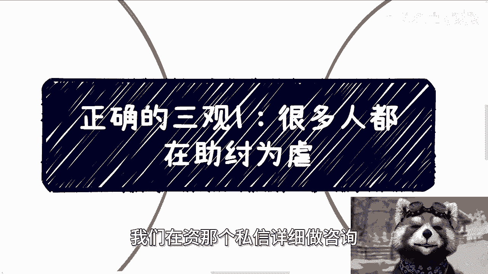

