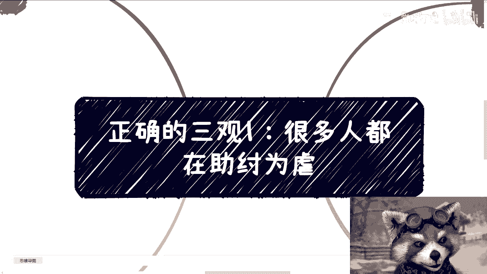
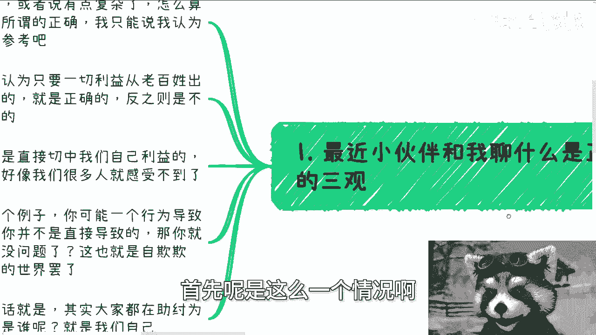
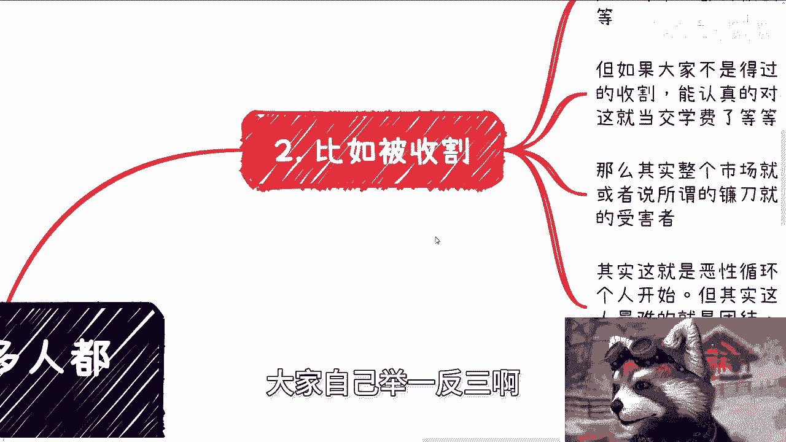
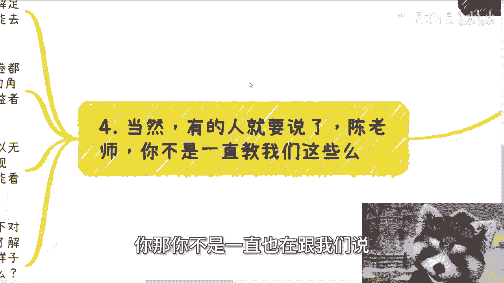
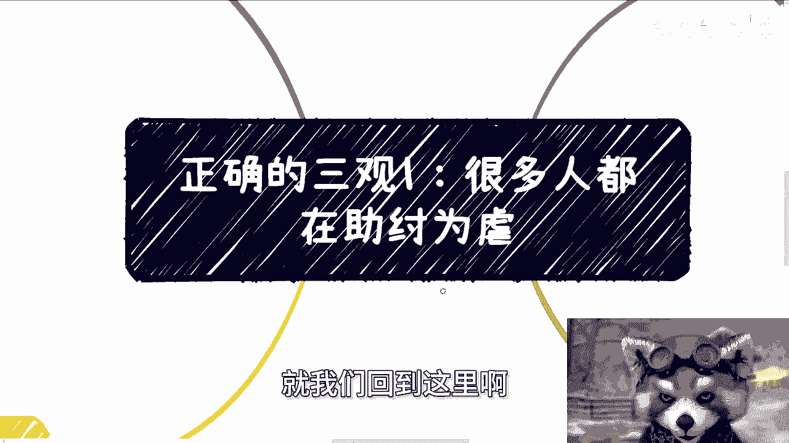
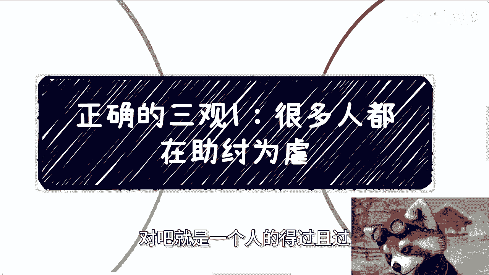

# 正确的三观篇章1：大部分人都在间接的助纣为虐 - P1 - 赏味不足 - BV19H4y1M7J2

哈喽大家好，因为今天这个在律所这边，给他们这个讲了个主题啊，就一直在外面，所以就又只能晚上来录了，现在都快凌晨了啊，然后呃大家可以看到这个主题啊，这个主题跟以前就不太一样是吧。

因为这两天呢有小伙伴跟我在谈，怎么算正确的三观啊，我后来想了一想，这个内容，它其实里面细分可能有很多，很多的这个切入点啊，所以我呢本来一开始想的就是说，把它放到充电视频里面。

但后来想了想也没问题也不大啊，所以我就打算开放出来啊，那么今天讲的是第一个啊，叫做我我我说了。

就很多人呢都在助纣为虐啊，首先呢是这么一个情况啊。

这个问题呢我觉得着实有些深奥，或者有些复杂啊，怎么算正确，每个人都有自己所谓的正确，我只能说啊我认为的正确，那么大家反正自己去参考啊，那么如果从根本上来讲啊，我认为只要一切的利益从老百姓出发。

你做的任何一件事情是为了老百姓好的啊，能够有助于老百姓的啊，记住啊，是真正的有助于老百姓的，不是说我们那些表面上的这些东西啊，那么就是正确的，反之则就是不正确的，我觉得就这么判断，然而呢。

很多时候一些事情是直接切中我们自己利益的，有的呢并没有直接切中，当我们并没有直接切中的时候呢，可能很多人就感受不到啊，那么这个东西反正我们后面再来说啊，就好像我们以前举过一个例子。

就是你可能比如说今天有个行为，间接的导致了悲剧的发生，但你并没有直接导致对吧，那你可以说如果从一个更高的格局来讲啊，你说你没有过错吗，不能吧，你说你完全没问题吗，也不能吧，这届也是自欺欺人啊。

或者说他只是因为格局不大而已，那么我最近说的最多的一句话是什么呢，其实很多人都在，自那个助纣为虐而助纣为虐的时候，他最后虐的是谁，最后欺压的对象是谁呢，就是我们自己啊。

就是我们自己啊，那么我这边随便举几个例子，大家自己举一反三啊。

第一比如说收割啊，我就这么来讲啊，我们因为不在充电视频里面啊，我这个话说的可能只能模糊一点啊，就是说每个人都有无数种可能性被收割，有的被收割呢是因为没办法叫做强制收割对吧，每个人都会被割。

有的人呢收有的收割呢是因为智商税啊，那么但是不管怎么样，你从小活到大，你有很多的可能性，很多的时候会被割，你不可能不被割，不可能绝对不可能啊，但是呢如果大家不是得过且过啊，真的认真的去纠结去啊。

就是思考每次的收割能够认真的对待，而不是说就告诉自己唉算了，他妈的就当交个学费吧，怎么样怎么样啊，那么我觉得到今天为止，整个市场整个社会都会好很多，资本家跟基德利益者或者说所谓的镰刀。

他就不会这么猖狂啊，也就不会有这么多的受害者，或者说也就不会再有这么多人被拘一格，其实你会发现这就是个恶性循环，螺旋收割，就是我们一直在说改变改变改变是需要什么，需要从每个人开始，但其实这个非常难。

因为我以前也说过，就是到今天这个社会人最难的是什么，就是团结啊，就是团结大部分人，其实他会面临一个问题，就是事不关己，事不关己，高高挂起，就是说他除非是自己已经痛到不行了，否则他就是得过且过。

你改变不了他，你明白吗，其实就这么回事，那么第二点啊，比如说加班跟要薪水对吧，咱就这么说啊，我以前只说很多人很卷啊，而且呢他不但很卷，你说他很卷吧，他还觉得你在表扬他啊，卷的还很骄傲。

我跟你讲有啥好骄傲的，为什么，因为卷的本质是什么，你们有没有想过啊，我我我我我我我我给你们几秒钟时间，你们自己想想看卷的本质是什么，卷的本质是为了让别人赚到更多的钱，同时还伤害自己。

以及跟自己一样的老百姓和同仁，这就是卷的本质有什么意义呢，对不对，你比如说以前大家卷技术卷，思想卷格局卷十的东西，这叫什么，叫做良性竞争对吧，然后不知道从某个时间点开始好了，卷谁跪舔的好，卷谁饼画的好。

卷谁加班加的多，卷谁年龄小，卷卷谁要的钱少，这有意义了对吧，那虽然我不是很想搞对立面啊，但这不就是为了老板，为了股东，为了既得利益者好吗，然后让镰刀越来越好受，让大家越来越难受，那我就要问了。

你到底是站在哪一边的，对不对，你得明确一点对吧，那么整个环境越来越差，最终导致的不还是说大众赚的越来越少，失业的越来越多，或者说真的就是拼那些十的人，真正干实事的人越来越少，那我就问嘛。

对大众有什么好处呢，我不明白呀，我是真的不明白呀，啊当然说到这，有的人要说了啊，他说陈老师，你那你不是一直也在跟我们说怎么去卷嘛。

对不对，好啊，我就这么跟你讲啊，这就是我说的正确的三观里的一种，就是我们作为老百姓，我们没得选，我们能做的唯一的一件事情是什么，就是先强大，先了解足够多的本质的东西，先剥开那层面纱或者N层面纱。

你去看到你原本不应该看到的东西，去积累足够多的关系，然后才能去付出，去改变啊，但我们强大并不是说要去职场去卷了，在打工层面的卷都是PUA，因为你强大不了，你永远都是一个你再强大。

你永远是一个工具人的角色跟视视角对吧，你再强大，无非就是资本资本家各自的利益者的工具人，你永远都不可能有更高的格局，和更高的一些视野，你不可能有啊啊，那你既然不可能用，你怎么改变啊，你怎么改变哦。

你到最后跟大跟打工人说，唉我教你们怎么卷，这叫改变吗啊，你仔细想想看对吧，当然啊，我们可能变不成完全的资本家，但我们可以无限接近于他们，那么也就是说我们必须要去了解社会运作规则，商业运作规则。

去参与足够多的项目，你才能看到尽可能多的本质，你所有东西不去参与，不去实践，你单纯靠网上，你能看到个屁呀，对不对啊，然而又回到我们根本顺利一点，你要时刻明白哪些哪些事情是对的，哪些事情是不对的。

哪怕你现在做不对的事情，你也得明白哪些是对的，哪些是不对的，对吧，怎么判断，就如我一开始说的，你要真正的去了解老百姓，时刻要去明白，在不同城市，不同工种，不同层面的老百姓不同不同啊，岗位。

不同领域的大众是怎么样子的，然后你做事你要去判断，你做的事情到底对他们是有利的，还是真的有帮助的，如果有，那就是对的，如果没有，如果你单纯的只是赚到了钱，就像我说的，你投入100分的资本。

产出十分的价值，那就是不对的。

对不对，你是就我们回到这里啊。

什么叫助纣为虐，助纣为虐的根本就在于说你卷答，你伤害的是我们自己。

但是你们仔细想想看，我们在这个地方写了，一种是被割。

一种是比如说职场对吧，包括就是大家所谓的卷，但是仅仅只有这两点。

不是很多很多对吧，就是一个人的得过且过。

一个人的卷，一个人的自私，他都会就是汇聚成无数的力量，然后去助纣为虐，然后就会伤，又因为这些就是我们说的，让这些资本家根基的利者越来越爽了之后，他们就会割的更狠，这不就是恶性循环吗。

但是你放到每个人身上，其实每个人不是那么的明白，就像我就像我们说，你卷学历卷很多东西都是一样的，不是说你卷的不好。

但是你如果仅仅是被环境，被被被舆论对吧，被一些东西去操纵了去卷，而不是你自己真的想去学或者怎么样，那你就是助纣为虐对吧，有什么区别呢，因为怎么说呢，就是说很多人你们看问题啊，你们看的是一个节点。

这就好像每次我说学历大家都在很有争议对吧，觉得学历有的觉得有用，有的觉得没有用，但是你为什么我们判断有没有用，它需要看长长期的一个效应的，你需要看最终给社会带来价值，给自己带来价值，不是说我们就讨论。

就说啊我我我比如说毕业我能不能找到工作，你找不到找不到工作又如何呢对吧，我们看任何问题都是拉长时间线来看的，让子弹飞一会儿不是说说的，你看让你看问题，单纯看一个节点没有用的，一点用都没有。

你看一个节点如何判断出它好和坏呢，对吧，你就像我最后再提一嘴，我最后再提一嘴啊，就是你就像我之前我今天还在群里面说的，我说唉可能这句例子不太恰当，就说我今天啊做了一件事，做做了一个坏事哦。

你说我是个坏人，怎么地了，我明天做了善事啊，我就是好人啊，你是怎么判断的，对不对，好吧，这个内容啊，后面我还会分很多的切入点跟大家来讲，因为所谓正确的三观我觉得太抽象了，对所有人来讲都太抽象了。

我们只能拆开来，一个个来说，行啊，就这么着吧，然后，职业规划啊，商业规划，然后呃这个叫什么，就是分红股股权啊对吧，就是商业计划书啊，合同啊，包括各个方面啊，你们要是有问题的，你们整理好。

包括就是说你们手上有什么牌对吧，就是你们比如说有哪些关系对吧，有什么样的学历，或者你们手上没有牌啊，但是呢又希望通过跟我的沟通，或者我的一些视角，能给你们带来更多的一些启发，或者一些规划的发啊。

那么你们也可以整理好问题啊。

