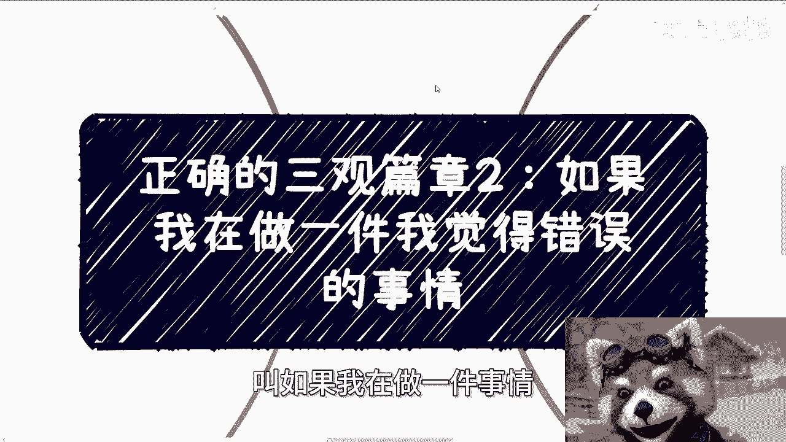
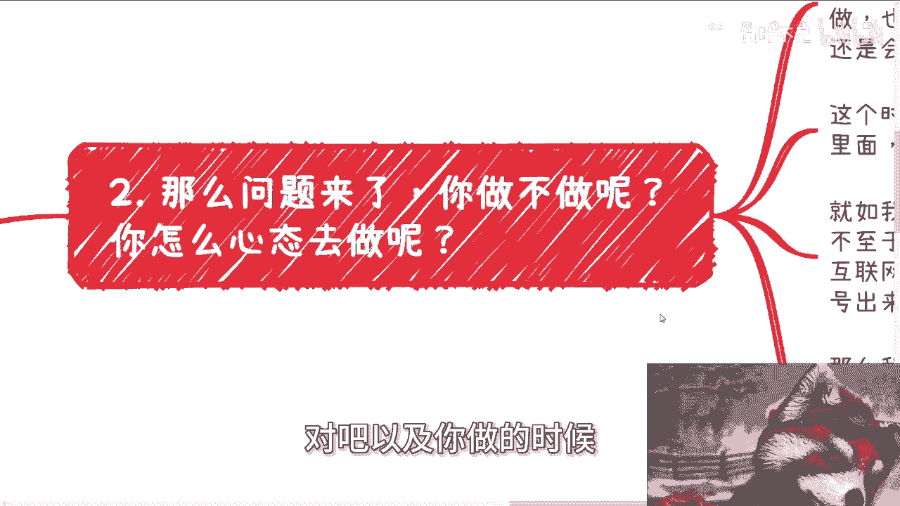
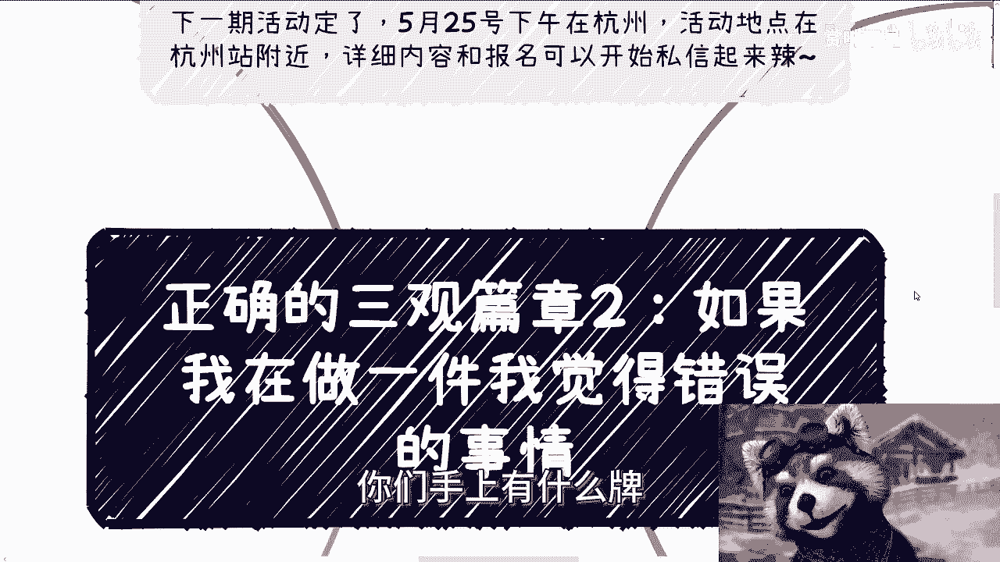

# 正确的三观篇章2：如果我在做一件我觉得错误的事情 🧭

在本节课中，我们将探讨一个复杂但普遍的问题：当你认为自己正在做一件“错误”的事情时，应该如何思考和行动。我们将分析“对错”的相对性，并讨论在现实情境中，个人成长与道德判断之间的张力。

---

## 活动通知 📅

下一期线下活动已确定。活动将于5月25日下午在杭州举行，地点位于杭州站附近。场地与定金均已落实。活动详细信息与报名事宜，现在可以开始私信咨询。

---

## 一、什么是“错误”的事情？🤔

上一节我们介绍了三观的基本概念，本节中我们来看看如何定义“错误”。

“错误”的判断标准因人而异，取决于不同的切入点和价值观。对与错并非绝对。

以下是几种常见的认为某事“错误”的情况：
*   **认知局限**：有的人认为，只要是自己不懂的事情就不能做。如果被迫去做，就会感到不踏实，进而认为这是“割韭菜”或不对的。
*   **自我价值感低**：有的人不好意思收取报酬，总觉得自己能力不足、很“菜”。一旦需要他们收费，就会认为这是不对的。
*   **投入产出失衡**：从普通人的角度看，如果一件事的投入与产出完全不成正比，或者所得甚少，这通常被认为是错的。

虽然无法为“对错”制定统一规范，但我们可以观察到一个普遍现象：**大部分普通人在寻求改变和成长的过程中，往往需要先去做一些他们认为“错误”或不愿意做的事情。** 这样做的目的，是为了在未来获得更多做“对”的事情的资本和选择权。

---

## 二、现实中的困境：做还是不做？⚖️

理解了“错误”的相对性后，我们面临一个更实际的问题：当身处具体困境时，这件事到底做还是不做？以及应以何种心态去做？

我们可以用一个常见的职场困境来类比：许多人日复一日地从事着一份并不开心的工作。这份工作或许能带来微薄的提升和每月薪水，但同时也伴随着焦虑和内耗。继续做下去，自己觉得不对；但大多数人依然会选择继续。

**当问题上升到商业或道德层面时，情况会更加复杂。**

例如，在商业合作中，可能存在一些“灰色”操作：
*   甲方在合同中设置隐蔽条款（如知识产权归属），为未来向乙方索赔埋下伏笔。
*   项目本身可能涉及“割韭菜”、骗补贴或利用信息不对称获利。

如果你作为这类项目的合作方或员工，或多或少会察觉到问题。此时，你就陷入了两难境地：

**做还是不做？**
*   **做**：可能与自己的是非观、道德观背道而驰。
*   **不做**：可能不仅仅是离职那么简单，还会影响到引荐你的朋友，以及你们之间的关系，甚至牵连朋友在公司的处境。

所以说，现实中的选择往往没这么简单。

---

## 三、关键：你以何种心态去做？💡

做与不做是一回事，以何种心态去做是另一回事，这更为关键。

从个人成长的视角来看，最正确的心态可以用一个核心公式来概括：

**`当前行动 = 为未来强大积累资本`**

这意味着：**现阶段的对错并不最重要，重要的是通过参与和了解，拓宽视野、增强能力。** 在此之后，才有足够的资本去谈论改变和是非。

如果一开始就因抗拒“错误”而固守所谓的“原则”，这其实是一种**傲慢**。在自身不够强大、见识不够广博时，所坚持的“原则”往往是狭隘的，它只会将你禁锢在小小的“局域网”里，阻碍你连接更广阔的“互联网”（真实社会）。

最不可取的状态是：**做也做了，但一直在纠结、内耗和反思中自我折磨。** 这种状态比果断不做或坦然去做都更有害。

---

## 四、重新审视“正确”的品质 🔄

认真、靠谱、有正义感，这些无疑是优秀的品质。但是，它们的价值需要放在更高的维度和更长的时间线中来审视。

对于渴望了解全局、谋求发展的人而言，这些品质有时反而会成为 **`DEBUFF`（负面效果）**。

许多人被自己小范围内的“认真”、“原则”所限制，拒绝体验更多未知。这就像在“地球Online”这款游戏中，主动将自己隔离在一个小小的“局域网”内。他的品质让他在小圈子里获得好评，但也同时阻止了他探索外部广阔的世界。

一个成年人踏入社会后，最忌讳的就是**立刻用简单的对错框架去判断一切**。对错的判断，必须基于复杂的上下文、全局的信息面以及你所扮演的角色。

就像“勇者斗恶龙”的故事：
*   从勇者角度看，除恶是对的。
*   从恶龙角度看，被讨伐是“错”的。

**直接、武断地判断对错，会无限限制你的个人发展。** 人需要一个成长的过程。年少时可能认为某些底线绝不可触碰，但回过头看，那或许只是一种源于无知的“自我设限”。

---

## 五、总结与活动邀约 🎯

本节课中我们一起学习了面对“自认为错误之事”时应有的思考框架。

1.  **“错误”具有相对性**，取决于视角和处境。
2.  **现实选择充满复杂性**，做与不做需权衡多方因素。
3.  **心态决定高度**：应以“为未来强大积累资本”的心态去行动和体验，而非纠结于当下的对错。
4.  **警惕“正确”的陷阱**：在小范围内被称道的品质，可能成为你探索大世界的枷锁。对错的判断需置于更广阔的格局和更长期的视角下。

成长就是一个不断打破旧我、拓宽认知边界的过程。在信息与能力不足时，保持开放与学习，比坚守一个狭隘的“对错观”更为重要。

---

杭州线下活动（5月25日下午）持续接受报名。活动将深入探讨：
*   职业规划与商业规划
*   股权、分红与合同实务
*   商业计划书撰写
*   资源盘整与发展策略

如果你希望在更大的格局下梳理自身问题，获得发展建议，请整理好你的具体问题与背景信息，通过私信进行咨询预约。