# 正确的三观篇章2：如果我在做一件我觉得错误的事情 - P1：正确的三观篇章2：如果我在一件我觉得错误的事情 - 赏味不足 - BV1zz42117mH

啊大家好啊，那么呃我们继续来说这个主题啊，下一期活动已经定了好吧，5月25号下午在杭州嗯，嗯定金我都付了，场地也订好了啊，然后活动地点在杭州站附近，详细信息跟报名，现在可以私信起来了啊，那首先第一呃。

今天我们讲的呢，就是之前啊我们说这个三观的篇章啊，三观的篇章今天是讲第二个，第二个这个主题叫什么呢，叫如果我在做一件事情。

是我觉得错误的事情啊，这个什么意思啊，就我们往下看。

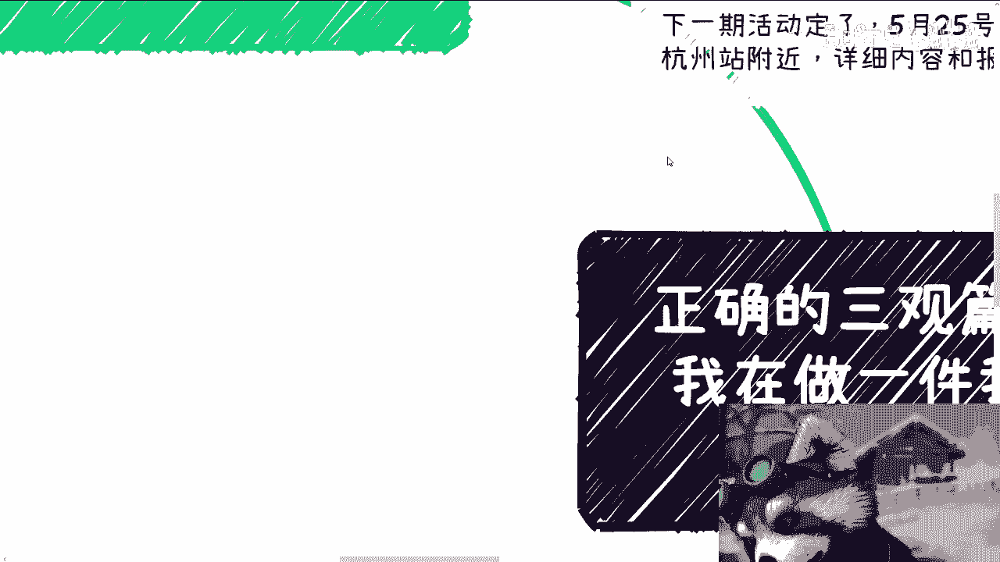

你们就知道了，呃我跟你们讲啊，首先这个事蛮复杂的。

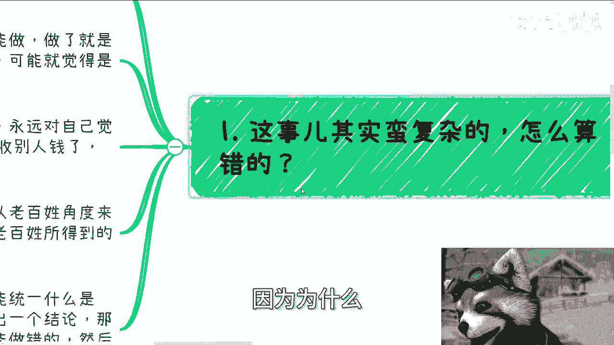

因为为什么怎么算错的，那就算就就像我们第一个篇章说的对跟错，你要看不同的切入点。

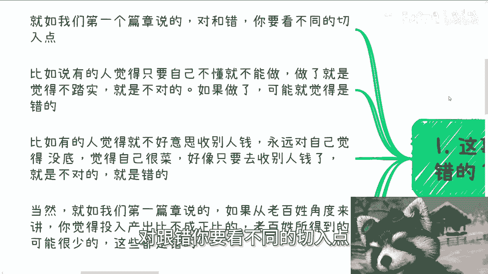

我们开始举例子啊，比如说啊有的人觉得只要自己不懂就不能做啊，只要你让他做了，他觉得自己不懂，他就觉得不踏实，那不踏实，他就觉得就是割韭菜，他觉得割韭菜就不对啊，那么如果做呢，可能他就觉得是错的啊。

那么另外呢，比如说有的人呢觉得不好意思收别人钱啊，永远觉得自己是没底的，觉得自己很菜啊，觉得怎么样子，然后呢你只要让他去收别人钱，他就会觉得这是不对，那当然啊呃我有一说一啊，就是大部分人啊。

他可能嘴上不一定会说，但他心里面会这么想啊，这个就是我们说哼怎么说呢，你要察言观色对吧，你要去明白人是怎样的一种生物对吧啊，那就如我说的，就是你们很多人跟我聊的时候，真的你们说跟不说嗯，区别不大的。

因为我能明白你们心里面是怎么想的啊，当然啊就如我们第一篇章说的，如果从老百姓角度来讲啊，你觉得投入产出比不成正比的啊，老百姓所得跟他其投入可能是完全不成正比的，或者说老百姓所得到的可能就很少啊。

这些都是错的啊，那么嗯当然还有很多种情况，虽然我们不可能统一啊，有一个这个规范标准，说什么是对的或什么是不对的啊，但是我们大体可以得出个结论，那就是说从老百姓来讲呢，他没有选择。

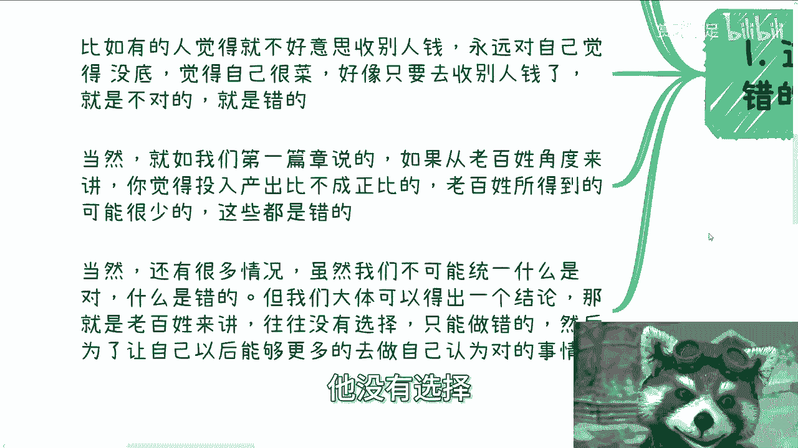

也就是说大部分的老百姓，他整个过程当中，但凡想要有变化，得要有改变，他往往走的一条路是什么路呢，就是他只有不停的去做，他他认为可能错的，或者来说他可能不愿意做的，然后为了让自己他的目的是什么。

是为了能够让以后能够更多的去做，自己认为对的事情啊，那当然啊这个可能有点绕啊，那我们往后来看，你们就明白了啊。

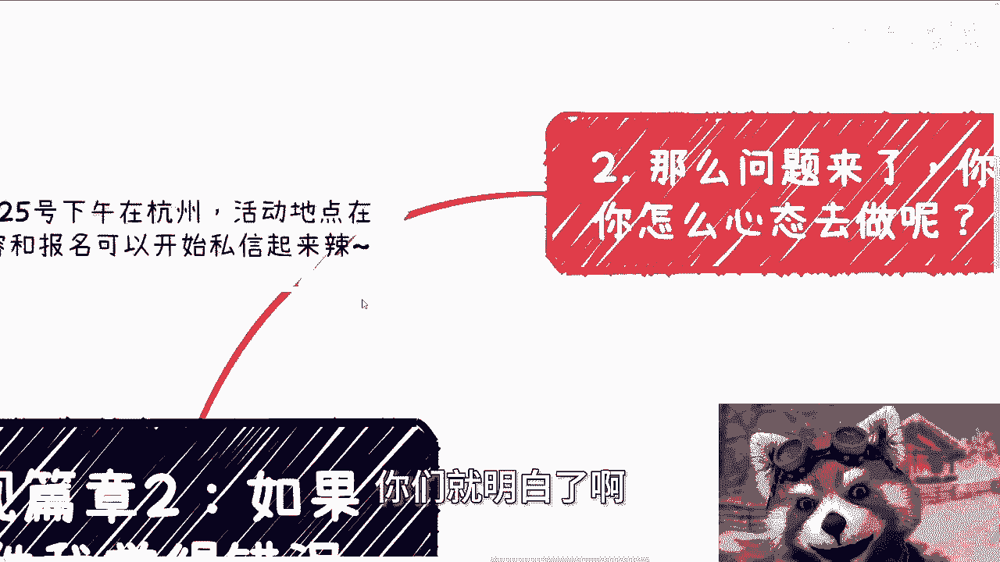

那么问题来了，那么很多事情你说你做还是不做呢对吧，以及你做的时候你是以怎样的心态去做啊。

我们打个比方啊，其实很多时候这样说啊，你工作做得不开心其实也是错的，因为什么，因为我不是说工作做的不开心是错的，我的意思是你工作做不开心，对你来讲这件事情也是错的对吧。

因为就是说你明明知道日复一日做着啊，当然你也觉得啊这个工作我可以做啊，你说有提升吗，也有提升对吧，就跟那句话怎么说来着，说你有点东西但不多对吧，也就是说工作给你提升有吗，有的但不大啊，那么你就会觉得。

就是说你现在的工作，只不过是为了每个月的薪水，那你会做吗，你还是会做，但是你做的时候焦虑吗，焦虑的你做的时候自内耗嘛，内耗的那你会做吗，你还是会做，那我问你，你一直你一直这样去做，你觉得对吗。

你可能觉得不对对吧，其实就是这种感觉哦，那么这个时候呢，其实并没有这么大的是非观跟道德观在这里面，因为对你来讲，你你你你的这个对跟错，无非你还是个员工嘛对吧，那么就如我们刚刚说的啊。

很多东西呢啊就我们之前说的，就很多时候呢，他都有很大这个夸大的这种宣传啊，可能还不至于到宣假虚假宣传，但是呢往往肯定夸大，就比如说啊我们举个例子，比如说以前互联网里面大家都知道，比如说融资1000万啊。

他以前真的我给你们讲个公众号啊，这种媒体宣传啊，他一般真的是呃朴实无华，就后面加个零，比如说融资1000万，他可能公众号出来就一个亿啊，就这样子的啊，你们去看好了，在2013到15年那段时间。

他妈的基本上都这个套路套路啊，那么这个时候我就要问了啊，就比如说我们换个说法啊，就比如说你，你作为资本家或者既得利益者的合作方，亦或者说你作为资本家和既得利益者的，这个员工啊。

好你在很多很多的项目的时候啊，某些项目你可能明显能觉得他是割韭菜的，而且割的是老百姓，或者来说他是骗补贴的，或者来说他可能是阴阳合同对吧，或者来说是什么呢，或者说就是说你可能从这个这个这个合作方。

或者你作为他的员工来讲，你能够知道一丁半点，就是说这个资本家或者既得利益者啊，他可能就是说挖了个坑呃，故意让对方跳啊，然后呢从这里面去坑一些钱，那当然我跟你们讲啊，这种事情很多很多，真的很多很多呃。

我给你们举个例子吧，啊就比如说中国有非常多的一些合作，是那个版权啊，知识产权版权相关的啊，那么这个时候呢就是说呃很多人啊，他其实呃合同不会仔细看的啊，那么在大家合作的时候呢，就是说甲方的合同里面啊。

他会写的会有一些写的很明显的条例，写的是什么呢，就是说乙方在本次项目里面所产出的很多东西，包括版权，包括知识版权啊，知识产权都是归甲方所有的啊，那么他在里面呢，可能还会有些咬文嚼字的东西啊。

那么这个时候呢对于很多乙方来讲呢，他其实并不是特别的呃，可能他没有经验，或者他以前也没有相关经验做过啊，他可能就是说呃你是说他合同看吗，他看的，但他看的不是很仔细啊，那么这个时候呢。

这个以后当乙方再来用这个素材的时候呢，他可能觉得就是说只要啊可能比如说换一下，或者说把这些logo对吧，马马赛克掉或者说P掉，他可能觉得就没有问题了，但其实作为一个经验丰富的镰镰刀甲方，我们可以这么说。

就是说他在整个过程当中，他可以有非常丰富的经验，他也可以拥有非常好的律师来通过，比如说知识产权啊，版权啊啊啊来，就是说能够让甲乙方在未来能够呃，骗比较多的补贴啊，也不是骗子，比较不逗比。

就是让乙方能够吐出来更多的钱啊，给到甲方，那其实其实这种东西呢，就是说甲方已经在啊这个合同里面，其实相当于是挖了个坑对吧，但是乙方可能由于一些经验不足啊，或者其他各个方面他不知道啊。

那么这种事情呢你作为他的合作方，或者你作为他的合同，你啊啊不是合同，你作为他的员工啊，你肯定多多少少都会知道啊，那么我就问啊，这个时候大概率你会觉得有问题，那我就问你，你做还是不做对吧，因为对于你来讲。

你可能觉得做了啊，他跟你的是非观，跟你的道德观有非常大的这个背道而驰对吧，但是问题你不做呢，那你可能就是说你你你比如说这，因为你在这种项目里面，我说实话一方面啊你的这个薪资肯定也不会低，另外一方面呢。

你肯定跟这个老板或者跟相关的人，也是有一定关系的，否则你肯定也不会进去对吧，但是呢就是说你可能关系并不是那么的亲近啊，那么这个时候就是说你但凡不做，不单单是离职的问题。

你可能还会影响到介绍你进去的那个人对吧，以及介绍你进去那个人，你们之间呃这个这个这个感情上的关系，或者说更影响到那个人在公司里面的情况，那么你到时候是做还是不做呢啊。

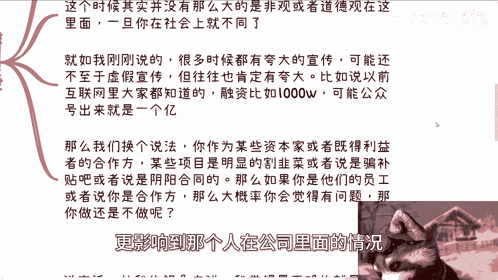

所以说很多时候他没这么简单啊。

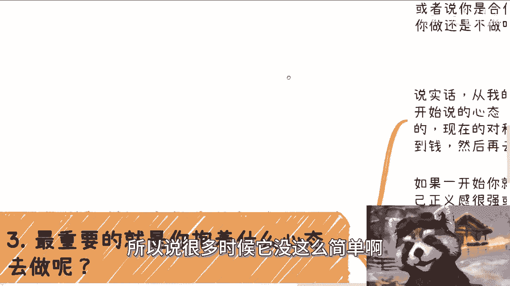

然后第三点就是做跟不做是一回事啊，然后另外一方面就是说。

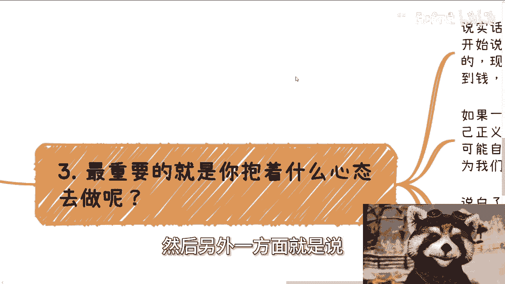

你到底是抱有怎样的心态去做的，那说实话啊，从我的视角来讲，我觉得最正确的一点就是，我一开始说的心态，就是一切都是为了让自己更强大而存在的，现在的这个对跟错不重要，因为重要的是要去了解更多。

要让自己看到更多，要让自己参与到更多，然后再来谈改改变，再来谈这跟错，因为如果一开始你就很抗拒，你觉得不好，你就觉得自己正义感很强，或者说呃你你可能从我角度来讲，你是个很死板的人，没有变通的话。

那么你可能啊，就是因为每个人都会局限在自己的这个，象牙塔里面，你可能会觉得啊，这个陈老师我跟你没什么好讲的，因为我这个你讲的都是一些旁门左道对吧，或者说是一些这个这个叫什么叫叫什么叫呃。

诶那个词怎么说来着呢，嗯哦投机取巧对吧，然后呢，他可能就会觉得他说哎我我就要坚持我的原则，我是个有原则的人啊，我其实是一个就是说我觉得正确的事情，我一定要做，我不正确我绝对不做，对吧好，那我跟你讲啊。

你从更高的格局来看，这种人他其实就是一种傲慢，为什么，因为当我们没有足够的能力，没有更多的看到这个世界的时候，我们怎么会有所谓的资格或者所谓的资本，去坚持所谓的原则呢，对不对。

你明明还没有看到足够多的东西，你明明还不够强大，你跟我谈什么原则，你你这就是一种傲慢对吧，那说白了啊，大部分人觉得错或者觉得不对，无非都是表面上的一层表象，因为一方面啊大部分人觉得社会本身呃。

呃一方面是大部分人对社会本身他就不了解，本身他也不够强大，另外一方面就是说他看到一层，他看到的还是层皮，他就去谈原则，那这原则有什么好谈的呢，当然啊我跟你们讲啊，其实这还不是最蛋疼的，最蛋疼的是什么呢。

就是做呢做呢但还是在纠结啊，他就是说做了已经都都已经做了啊，但是就在那边纠结啊，反思甚至就在那边内耗对吧，觉得自己做的对啊，还是不对啊对吧，还是怎么样子，他然后还自己深陷其中，尼玛我跟你讲。

这种就是最蛋疼的这种，你还不如不做啊，你还不如就是他妈的把把把，把这个锅甩到你那个介绍你给你的朋友身上，或者把这个锅就甩到你老板身上，结束了啊对吧，就该断，该断则断，你要是觉得这他们不对，那你就不要做。

对吧啊，那么最后一点呢就是嗯怎么说呢，就是说认真靠谱以及正义感是对的。

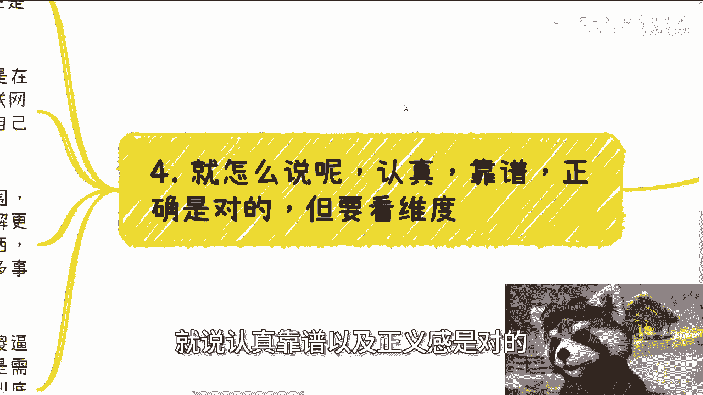

但是我跟你讲，你要看维度，你要看时间，就是很多人会觉得认真靠谱正确以及正义感，他是一个正向的Buff，这句话我认可的没有错，就像有很多人问我读书对不对，我说对的对吧，包括本硕博要不要考学历。

我说要的没有错呀对吧，但是这件事情你要看做事情的角度对吧，就是说如果你要从呃，包括就是说如果你要看问题的角度来讲，呃，了解全局的角度来讲，那我觉得认真靠谱，你的正义感往往就是DEBUFF，为什么。

因为很多人是被自己的认真，所谓的靠谱，所谓的正确的原则就在限制自己的发展，就如果我们说社会是一个地球，online的一个互联网游戏，那么很多人他的确在这个互联网游戏里面，因为你们活在地球上嘛对吧。

但是他自己会把自己局限在一个局域网里面，然后不与外面连接哦，那么也就是说他的认真，他的靠谱，他的所谓的正义感会在，会让他在他的小范围的世界里面得到好评，没有错啊，而且他问别人，比如说认真靠谱，正义感。

对不对，别人也只能回答对，但是问题是，这种东西也同时阻止了他们，更多的去了解外面的世界，因为他不愿意去体验更多的东西，他会把自己框在一个很小的一个框框里面哦，因为他认为的对。

就是那么一个小部分的对一个很小格局的队，然后阻止他去做更多事情，去体验更多的事情，那么就如我一直说的，一个成年人到了社会上啊，最的事情是什么，就是一一马上就去想对跟错啊，对跟错要不要去判断，要。

但是需要在很复杂的上下文，以及很全局的信息面的情况，下，面，以及你到底是在里面扮演什么角色来看的对吧，这就好像我们说勇者斗恶龙对吧，勇者去杀这个恶龙，那我就问嘛，你从勇者来讲对不对，你觉得对。

那你从恶龙角度来讲对不对，你肯定不对啊，你总不可能说啊，我我我做勇者嗯也是对的，我做恶龙嗯也是对的，那他妈的大家还说什么东西啊，对不然这世界太平了啊啊，那么所以说就是说你直接去看对跟错。

其实就在无限的限制你的发展哦。

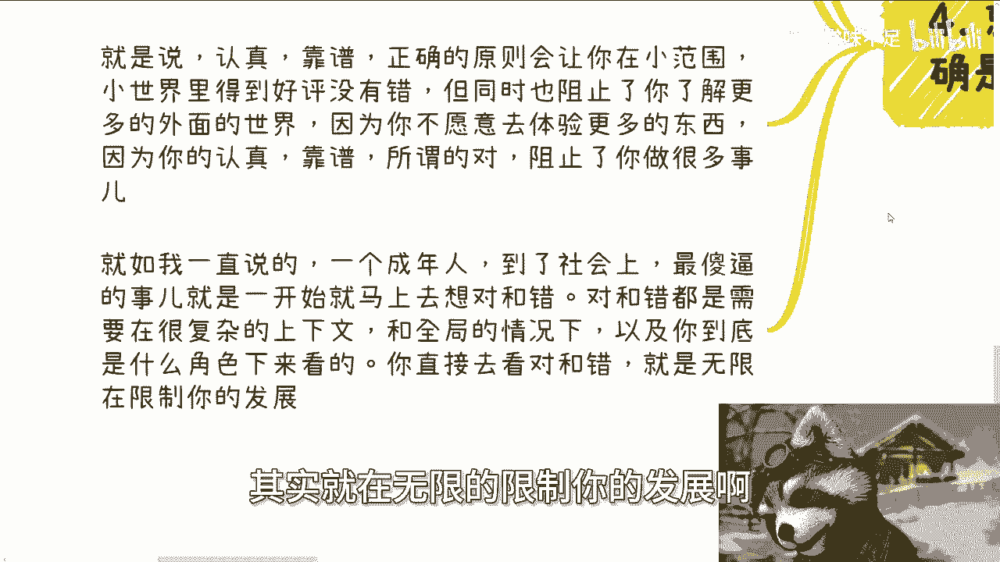

就是就是很多人很多时候，或者说人呢，他是一个他需要一个成长的一个过程，他需要个成长性，你就像我当时刚毕业的时候，如果你跟我讲，那我肯定也他妈会说啊，他妈的不要跟我逼逼这些对吧，我不会改变。

那其实真的你现在回过头来讲，真的就叫做自我限制，因为因为就是你懂个屁，你了解什么东西。

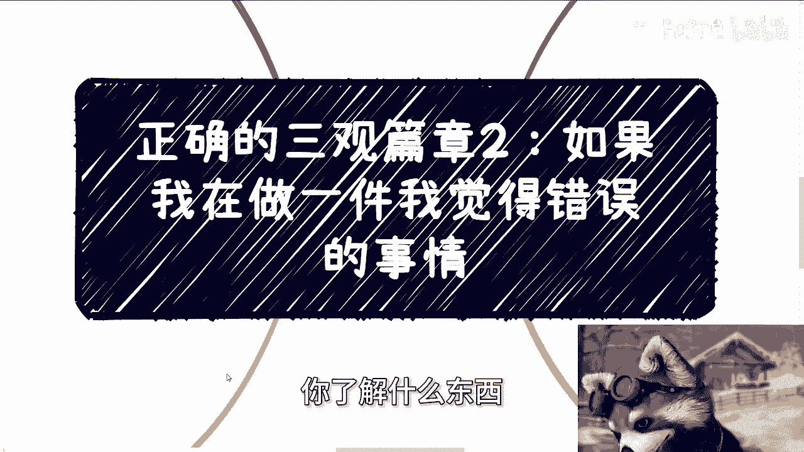

那那年少轻狂嘛是吧，也正常啊，好那么同样的啊，那么这一期就讲到这吧，然后杭州的活动已经定了5月15号下午好吧，然后报名的话，你们继续报，然后剩下的就是职业规划，商业规划啊。

然后股权啊分红啊啊什么什么什么什么合同啊，对吧，这分润啊啊商业计划书啊，啊包括你们比如说已经有些什么样的业务啊，你们手上有什么牌。

你们手上没有什么牌啊，你们也希或者希望通过跟我的沟通，或者跟我所知道的，更大的一个格局上的一个沟通，能了解到更多的一些东西，或者帮助你们做更好的发展啊，那么你们可以整理好自己的问题啊，以及背景啊。

然后我们再来私信我，再做咨询啊。