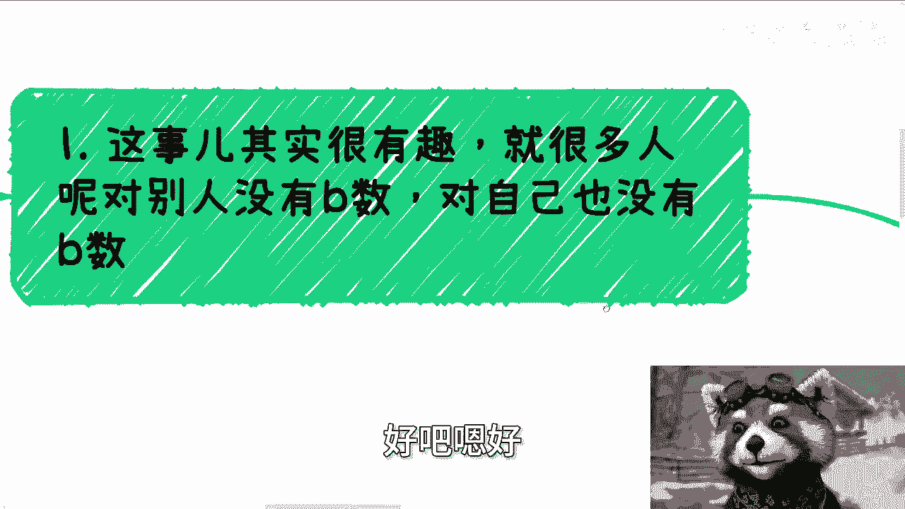
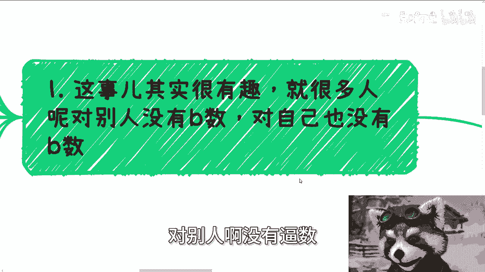
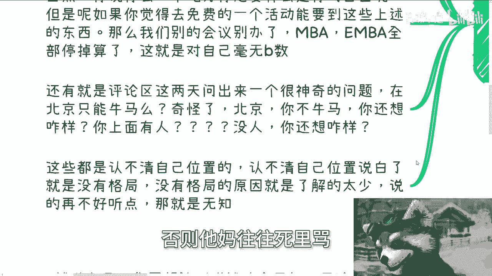
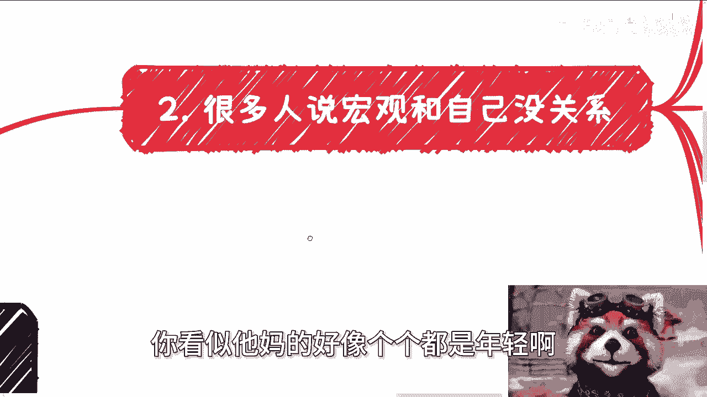
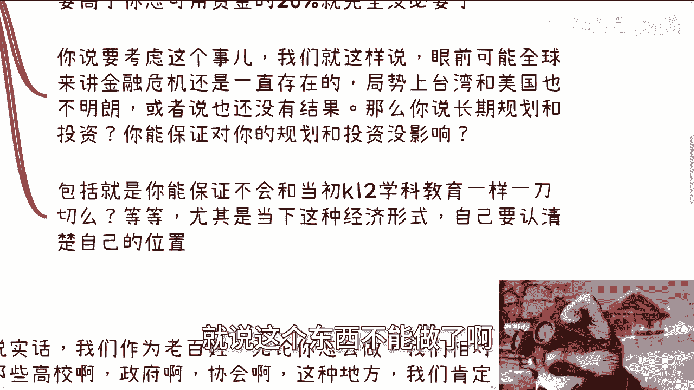
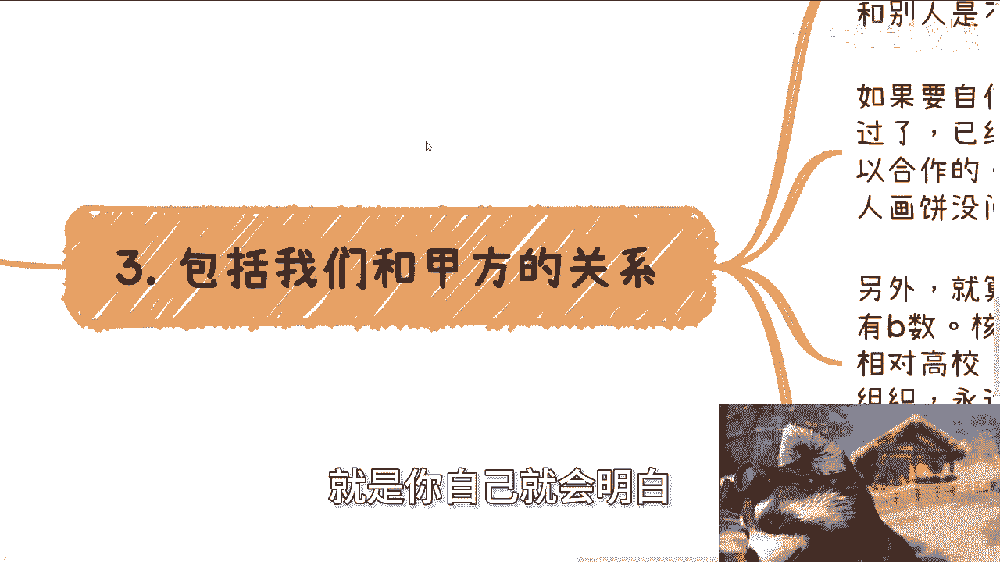
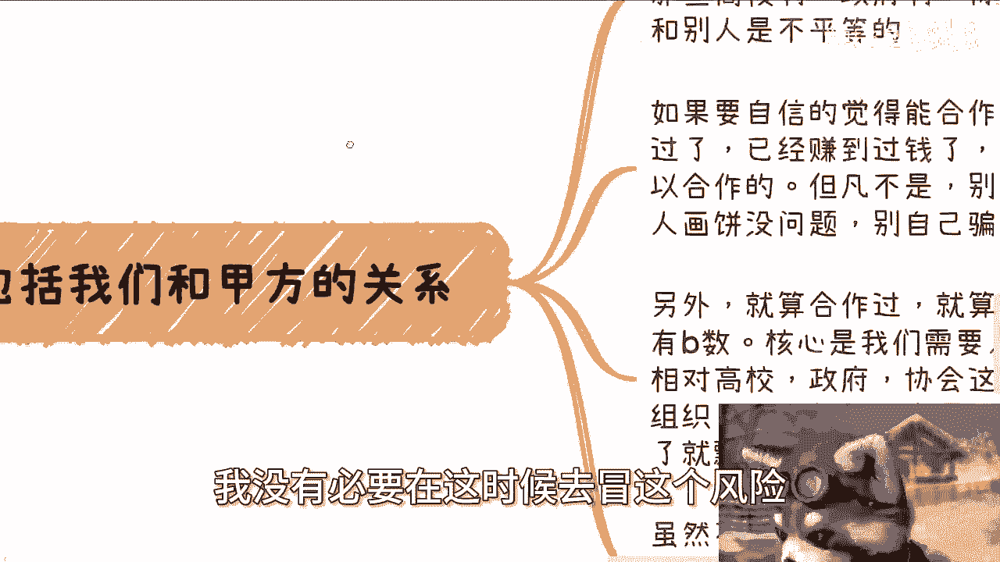
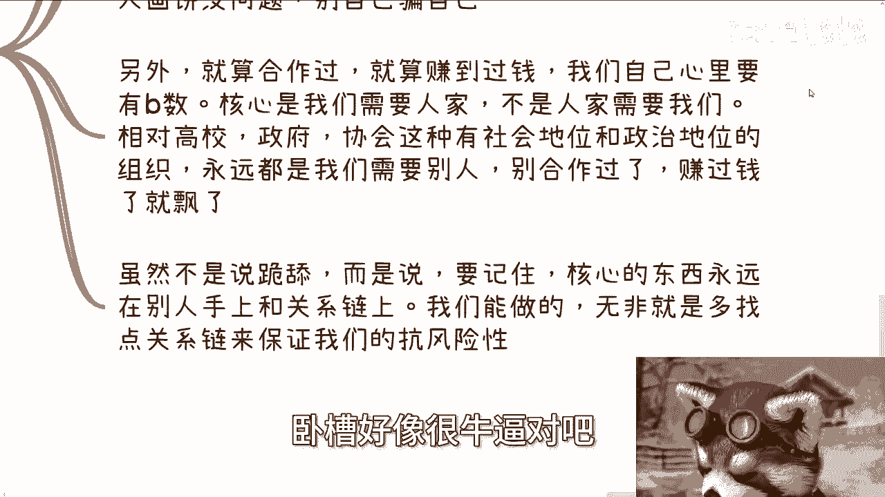
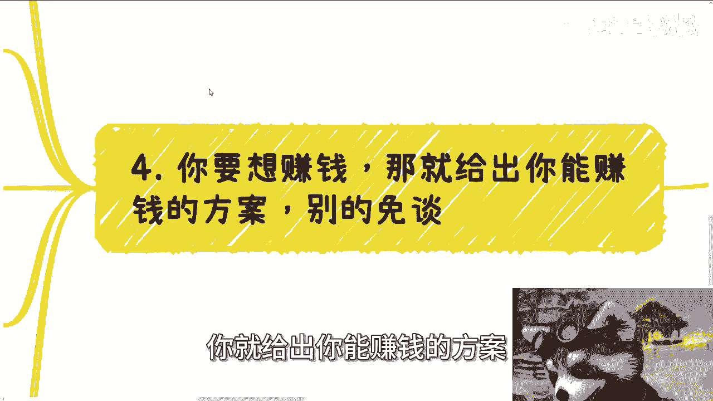

# 正确的三观篇章3-我们需要在不同的场景下认清自己的位置---P1---赏味不足---BV1nx4y1

在本节课中，我们将要学习一个核心观念：**认清自己的位置**。无论是在微观的个人决策，还是在宏观的战略规划中，清晰地认识自己所处的环境、拥有的资源和面临的限制，是做出明智选择的第一步。我们将通过几个具体的场景来探讨这一主题。

---

## 一、 对自己和外界都要有清晰的认知

上一节我们介绍了认清位置的重要性，本节中我们来看看第一个常见误区：很多人不仅对别人缺乏清晰的认知，对自己也同样缺乏。

“对自己有逼数”意味着客观评估自己的能力、资源和所处环境。缺乏这种认知，会导致不切实际的期望和错误的决策。

以下是两个典型的例子：

*   **例一：对免费活动的过高期望。** 有人参加免费活动，却期望获得全套的解决方案、合作方或专家资源。这既是对活动组织方的不切实际要求，也是对自己所处“免费获取信息”这一初级位置的不自知。如果免费就能获得一切核心资源，那么所有付费的商业活动都将失去意义。
*   **例二：对自身处境的错误判断。** 例如，有人问“在北京只能当牛马吗？”。作为普通个体，在首都这样资源高度集中、竞争异常激烈、人际关系复杂的宏观环境下，需要认清一个现实：**在没有特殊背景或资源的情况下，从基层做起、积累实力是普遍且合理的路径**。否认这一点，就是对自己在宏观社会结构中的位置缺乏认知。

认不清自己的位置，本质上是**格局小、见识少**的表现。看似是成年人，但可能对社会的运行规则和自身的真实处境一无所知。

---

## 二、 宏观趋势与个人决策息息相关

很多人认为全球或国家的宏观趋势与自己无关，因为个人无力改变。这个观点本身没错，但忽略了一个关键点：**我们虽然无法改变宏观趋势，但一定会受到它的深刻影响。**

在做个人或商业的长远规划和投资时，不考虑宏观背景，就如同蒙眼走路。

这里涉及一个重要的风险评估原则。以长期投资为例，一个常见的参考公式是：

**单笔高风险长期投资额 ≤ 个人总可用资金的 (10% ~ 20%)**

例如，你计划进行一笔为期3-5年、回报不确定的30万元投资。那么，你的总可用资金至少应在150万至300万元之间，这个投资决策才是相对稳健的。如果你总共只有60万元，却要投入30万，这无疑是在冒极高的风险。

为什么要考虑这个比例？因为我们必须承认宏观环境的不确定性。例如：

*   你能保证未来几年的全球经济或政策变化，不会对你的投资产生毁灭性影响吗？
*   你能保证你所在的行业，不会像过去的K12学科教育一样，因一纸政策而瞬间消失吗？

一旦将宏观风险纳入考量，许多看似诱人的机会，其真实的风险系数就会显现。除非你的资源多到可以无视风险，否则在局势不明朗时盲目进行高风险的长远投入，是不理智的。

---

## 三、 认清与优势方合作时的位置

在商业和社会交往中，我们常常需要与比自己更具社会地位、政治资源或资本优势的个人或组织（如高校、政府、大型协会、资深资本方）合作。这时，认清彼此的位置至关重要。

核心原则是：**在大多数情况下，这种合作本质上是不平等的，通常是我们更需要对方。**

以下是需要牢记的几点：

1.  **不要盲目自信**：除非你们已有成功的合作历史并共同获利，否则不要自信地认为“关系硬”就能促成合作。画饼可以，但别把自己也骗了。
2.  **保持清醒，即使合作过**：即使有过成功合作，也要明白，核心资源和关键人脉往往掌握在对方手中。我们的正确心态不是跪舔，而是清醒地认识到：**我们需要通过持续提供价值、巩固关系来增强自身的抗风险能力。**
3.  **建立冗余关系链**：不要把希望寄托在单一关系上。策略是广结善缘，多线发展。用公式表示就是：
    **有效合作方数量 = 总开拓关系数 - 未来可能流失的关系数**
    你开拓的关系越多，个别关系的变动对你整体事业的影响就越小。把鸡蛋放在多个篮子里，是基本的风险控制意识。

---

## 四、 赚钱的核心：提供可验证的变现方案

无论处于何种场景，如果你想与他人合作赚钱，就必须认清一个最根本的位置：**价值提供者**。

别人愿意与你合作，只有一个核心原因：**你能帮ta赚钱，或能清晰地展示出帮ta赚钱的路径。** 其他一切都是次要的。

要实现这一点，你必须做好以下两件事，缺一不可：

1.  **证明过往赚钱能力**：展示你在相关领域有成功的案例、数据和可信的业绩记录。
2.  **提供当下赚钱方案**：拿出具体的、可讨论的、逻辑清晰的合作方案，阐明如何实现盈利。

如果你这两点都无法提供，那么无论你拥有什么学历、奖项、人脉关系，在成熟的商人或资本方面前，都是无效信息。因为他们只关心一个问题：**这些如何变现？**

请认清现实：
*   学历等光环，主要在标准化求职（成为“牛马”）时作用明显。
*   在真正的利益合作场，**颜值（皮囊）** 可能是一个短期加分项，但长期合作必然建立在**共同获利**的基础上。无法一起赚钱的关系，很难持久。

因此，在任何场合，你心里都要有“逼数”：你凭什么被选择？你的核心价值是否直接指向 **“可预期的利润”** ？不断追问自己这个问题，才能摆正位置，有效沟通。

---

本节课中我们一起学习了“认清自己位置”这一核心观念。我们从四个层面展开：首先，要对自己和外界都有清醒的认知，避免不切实际的幻想；其次，要明白宏观趋势深刻影响个人决策，必须将其纳入风险评估；再者，在于优势方合作时，要认清不平等常态，并致力于构建冗余的关系网络以保障安全；最后，在追求赚钱合作时，必须聚焦于提供可验证的变现能力与方案，这才是你的根本价值所在。时刻审视自己所处的场景和位置，是做出正确判断、稳健前行的重要基础。