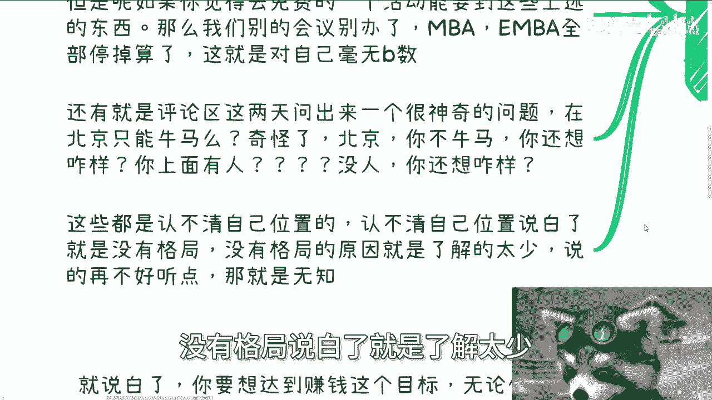
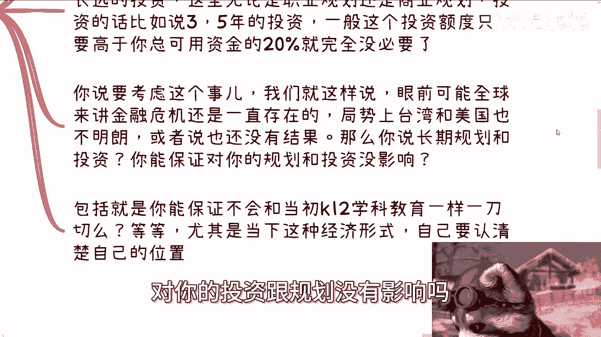
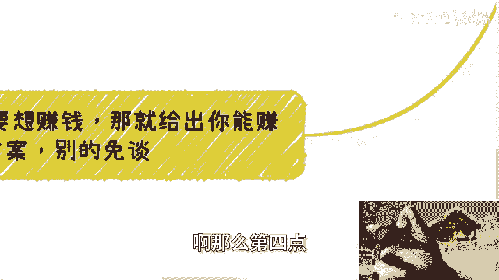

# 正确的三观篇章3：我们需要在不同的场景下认清自己的位置 - P1 - 赏味不足 - BV1nx4y1n7RN

呃好大家好啊，今天我们继续来讲这个正确的三观篇章啊，第三个就是我们需要在不同的宏观的背景下，认清自己的位置啊，呃为什么来讲这个东西是因为你们要记住一点，就是说我们做的所有的选择跟决断啊，决策啊。

包括战略上，战术上啊等等的这些东西呢，额你们一定是要认清楚自己的位置，就是我们说不管是在微观层面，在宏观层面，你我们处于什么样的这个方向，什么样的一个地方，那么这个是要很清楚的。

你否则你怎么可能做出来一个，相对正确的抉择呢，对吧你做不出来啊，然后我顺便这个地方提一点啊，就是说我会在下个月呃，应该是会在深圳在办场活动啊，然后我在上海这边也会继续做。

然后呢就是我会在原有的活动基础之上，会会开一场新的啊这个东西出来啊，反正到时候大家可以期待一下，就更多的也会呃给到大家更大的一些帮助，而不是说呃仅停留在社交这个上面，好吧嗯好。

然后我们继续来说啊，第一个这事呢我跟你讲很有趣，就很多人啊对别人啊没有逼数。

但对自己其实他妈的也没有逼数啊，就我们一直说察言观色啊，是对别人，但其实呢同样对自己也是同样重要的，就是需要对自己有逼数，什么意思啊，我们来举点例子啊，你比如说我这两天我去参加了一些活动。

活动本身呢是免费的啊，但来的人呢一个比一个要求高啊，怎么要什么解决方案啊，要合作方啊对吧，要什么技术专家啊，要什么东西啊，各种巴拉巴拉的啊，当然啊你说你去一个地方，你要什么东西是你的自由，这没有错啊。

但是如果来说你觉得你去一个免费的活动，就能要到上述这些东西的话，那么我们就这么说，你别说这种会议了啊，你比如说别的会会议啊，NBA啊ENBA啊，那他妈全部停掉算了，别做了对吧，那照这么个说法。

我们就所有的东西免费的都能拿得到，那他妈还做个屁啊，别搞对吧，那所以我觉得这种这种人呢，就属于对于说对外界对社会其实也没有逼数，但是和核心对自己的嘛也没有逼数啊，那么还有就是说评论区啊。

这两天这个我我今天今天回复的嘛，就是还问出来个我没有咳嗽，我呛到了啊，哼问出了一个很神奇的问题，就是他说在北京只能牛马嘛，诶那我他妈奇了怪了，大哥啊，你在北京啊，你在首都啊，你自己没点逼数吗。

啊你是老百姓，你不看看北京他妈什么地方啊，啊出去谈个业务，每个人都会告诉老子上面有人，你不做牛马，你想怎么滴啊啊，你要么告诉我，你也上面有人，对不啦，你没有，想怎么样啊，他妈奇了怪了，真是卧槽。

这不真的，我跟你讲这种问题问出来他妈真真的，我我我也就是隔着那个app妈骂不到他，否则妈妈往往死里骂。

那么搞笑嘞对吧，我跟你讲啊，这些就是认不清自己位置的，认不清自己位置，说白了就是没有格局，没有格局，说白了就是了解太少。

再说白了就他妈是无知对吧，就这么简单，你看似他妈的好像个个都是年轻哦。

个个都是成年人，他妈他他他他知道知道个啥啊对吧。

然后第二个很多人说宏观跟自己没关系，我跟你讲啊，之前很多人跟我说，他说什么全球啊，全国啊对吧，然后什么什么宏观趋势啊，跟我有啥关系对吧，他说我也没这个能力，我也改变不了，这话没有错。

哎我跟你讲这话真没有错对吧，但是问题是你我我们是改变不了，但我们虽然改变不了，但是他妈的我们会受到影响，对不对，你比如说你做事情你做判断不，你不考虑宏观，你不考虑整个全局，你做出的判断他妈跟一样。

然后你还想到处再问哎，楚老师这个这个判断做的对不对啊对吧，这个方向对不对啊，或者怎么样子，那你说你说你对全局一点都不，就是当你要去想这个有没有这个对不对的时候，对吧，或者说当你要去判断时候。

你又不关心这些，那让你去关心呢，你又跟我说，他妈的跟我没什么关系，那他妈你想怎么样，对不对啊，那就好像我们最常说的两个点，一个是长远的规划，一个是长远的投资对吧，这里我们无论说的规划。

无论是商业规划还是职业规划都一样的啊，投资的话比如说35年对吧，他说哎能回本或者有回报对吧，那我们就这就就一般来说是这种投资啊，好那么一般来讲这种投资额度啊，如果高于你总投资额，你总可用金额的20%。

我觉得就没有必要了啊，就这个点你们可以参考一下，一般来讲，我觉得10%到20%是比较合理的啊，你比如说你要投30万对吧，那那你可能总资金在600万啊，不是不是有百万呃，呃Z诶是600万吗，哦对对。

600万啊，600万好，那么你你我觉得是OK的，那你跟我说，你投30万，他妈啊，你说陈老师，我只有30哦，我只有60万，那投个屁呀，对吧，哦不是600万，我靠算错了算错了，150万啊，150万对吧。

你30万对吧，你说我有100，我我150万对吧，我占个这个叫什么，就是1/5，那没问题对吧，你说我操他，我我就六六十万，你去投，那你就别投了啊，你要说你说要考虑这个事，我们就这样说。

眼前可能全球都在讲金融危机，而且都是一直存在的局势上面，或者说也不叫不明朗，就是还没有一个结果，在没有结果之前，我们谁说了都不算对吧，那么你说你长期那个规划跟投资，你能保证对你的规就。

你能保证以上这些宏观的东西，对你的投资跟规划没有影响吗。

谁都不能保证对吧，那么我们就说你为什么非要在如此不稳定，或者是如此这种经济比较僵局的情况下面，去去去做这种就冒风险的事情。

那没有必要啊对吧，你包括就是说你说你能不保证，就比如说未来的三到5年里面，你所在的行业不会像当时K呃，K12学科教育一样一刀切吗对吧，一纸文书对吧，就说这个东西不能做了啊等等等等等对吧。

就是说你你会发现一旦考虑到宏观的决策，你有很多东西你根本就不会再去想它，你知道吗，就是你自己就会明白哦。

原来就是说这个风险其实是很高的，我没有必要在这时候去冒这个风险。

你除非就像我说的，你要么家里面钱多了，硌得慌对吧，你但凡不是割得慌，你去你妈瞎折腾干嘛呢。

对不对啊，然后第三包括我们跟甲方的关系啊，就说实话，我给你们这么说，我们作为老百姓，无论你怎么做啊，我就这么跟你讲，我们相对那些高校啊，政府啊，协会啊啊这种地方的合作，或者这种地方人的接触，我跟你讲。

核心就是我们就是不平等的，如果你要自信的觉得能合作，那一定是以前已经合作过了，或者来说你跟对方赚到过钱了，那么有什么新的机会，那可能就是说哎大家一呼百应就能合作了对吧。

但凡你们之前没有合作过或者没有赚到钱，别自信，觉得就能合作，你给别人画饼没有问题，但你别自己骗自己哦，不要就是那种什么心里面就莫名其妙觉得卧槽，他妈的我关系很硬对吧，我这边嘛什么这个老师有关系。

那边嘛学校有关系，什么有关系，没有用的哦，另外我们退1万步来讲，就算合作过，就算赚到过钱，我们心里面也要有逼数，就是核心一定是我们需要别人，不是别人需要我们，你懂吗，就是相对高校协会，政政府这种地方呃。

拥有社会地位跟政治政治地位的组织，永远是我们需要对方啊，别合作过了，赚过钱了就飘了，就觉得卧槽他妈的好像很牛逼对吧，怎么样子，不是的，你心里一定要有一种有个逼数，就是虽然啊我不是说一定要跪舔。

而是说要记住核心的东西永远是在别人手上，和别人的更上层的领导的关系链上面，我们能做的无非就是多找一些关系链，多找些合作方，多跟他们赚点钱，来保证我们的抗风险性，就是说白了就是我们今天找到十个。

那未来就算有三个不合作，那还有七个，那如果你能找到20个，那未来有三个不合作，你还有17个对吧，你别就说哎呀就找到一个，卧槽好像很牛逼对吧。

我就一棵树上吊死，那你早晚是得吊死，嗯懂吗哦那么第四点就是你要想赚钱啊。

你记住一点啊，你要想赚钱，你就给出你能赚钱的方案。

别的就不要谈，因为就说白了你要达到赚钱这个目标，无论你说什么，做什么还是包装什么，都是锦上添花的，核心是什么，就是你得让别人知道你能赚钱，那么你让别人知道你能赚钱，无非就两个点。

第一证明你曾经赚到过钱对吧，在某个领域有案例是有可信度的，第二就是说你现在给出来能够跟别人合作，赚钱的方案和逻辑，然后大家来讨论看看是不是可行，你但凡这两点都不做，你说你想跟别人一起赚钱。

他妈没有可能性的，为什么，因为没有什么事情是除了你不可的，那他妈凭什么别人要给你赚钱，还奇了怪了哦，别人有赚钱，非要找你赚，头上长角的啊，毛利兰，对不对啊，所以我们就说啊，别动不动在那边说学历。

别说你会什么也别说你有什么奖项，说你有什么关系都没有用的，你懂吗，就对于会赚钱，懂得赚钱的资本家跟商人来讲，他只会根据你每句话来判断你到底能不能赚钱，你上面说的什么学历啊，或者你有什么关系啊，能变现吗。

能变现吗，不能啊，重要的是你要说出来怎么变现，你要说出来变相的逻辑啊，你懂吗，就你要说出来变现的这个这个大家的，这个变现的方式，合作方式，你否则说那些都是屁话啊，那么认清楚自己的位置，学历有用。

只不过是对牛马有用，年龄大了什么都没用对吧，这就是我们的定位啊，你有什么好想的呢对吧，你不要来我跟你们讲啊，你们所有的人都不要来跟我讲说，哎这个陈老师有个例对吧，然后人家学历怎么样怎么样。

然后有很多人跟我说做光刻机怎么了呢，我，那你去做呀啊中国老百姓都做光刻机啊，哪个基数大呀，啊真的我跟你们讲这种留言全他妈是哦，另外就是说和别人合作，你我说我真的我跟你讲客气啊，就就客观一点。

你要是漂亮一点，皮囊好，那还是有可能的对吧，真的这个是有优势的啊，但是但凡赚不到钱，你会发现大家就是你好我好，大家好，不会长久的，因为谁都不愿意陪你过家家啊，愿意陪你过家家的，反正都是同样赚不到钱的。

那大家一起玩玩好了，随便的呀，对不对，但是你到底要什么，你得想明白啊对吧，所以说你要明白，就是你不管在什么场合，比如说今天是一个企业谈谈合作场合，还是在一个会议的场合，还是说是在一个跟呃。

你想跟别人去去去去去去去赚钱合作的场合，还是说你是想要这个这个跟你那些，比你政治地位高，比你社会地位高的人的这种合作场合，你不管大家表面上怎么说，你心里得对自己有逼数，你知道吗。

哦你千万千万不要想着说哦，大家有钱赚了会想到你，哎我们还是那句话，凭什么想到你呀，真的你得告诉对方，你到底有什么，而且告诉对方有什么的时候，是要让对方明确知道这个东西的人是能变现的，你懂吗啊。

仔细想想看，真的仔细想想看啊，不要就是真的不要就是说什么啊，我这边有关系，我那边有关系啊，你看我我跟这个企业有合作，那个学校有合作，有什么用呢，有用吗，能变现吗，对不对啊，好吧行，那我们就讲这么多啊。

那个呃好吧，然后职业规划，商业规划啊，呃那个合合同啊，分润啊，分红啊，呃商业计划书啊对吧，包括白皮书啊，BP啊这些东西，包括呢你们就说呃就是手上有什么牌啊，或者说你们什么牌都没有啊。

然后呢你们希望通过跟我沟通啊，或者通过我的视野和日常的一些认知啊，能够给你们在当下这种局势下面，整理出更好的一些啊规划，或者更好的一些选择的话，那么你们可以整理好相对应的问题。

