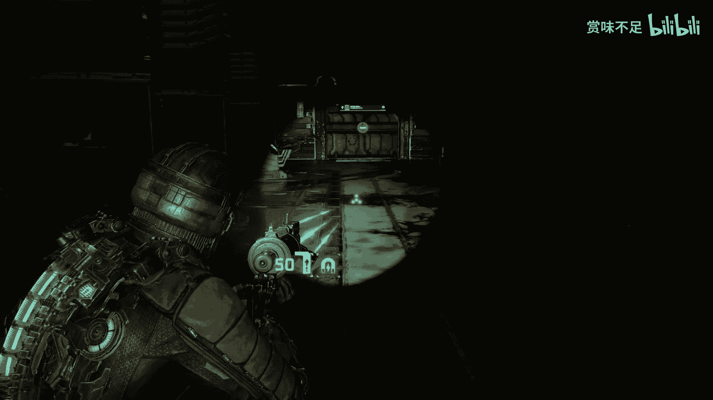
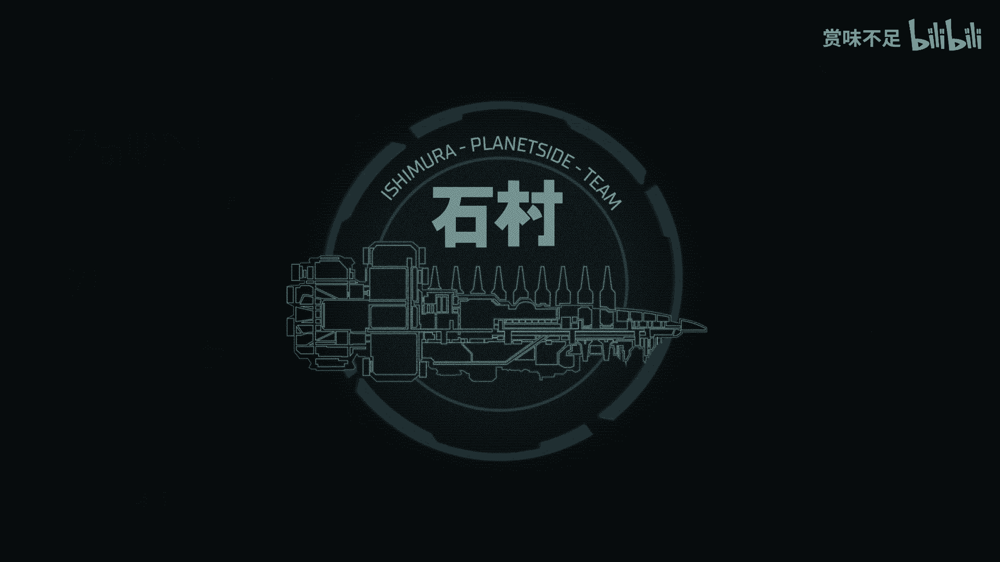

# 死亡空间第二章教程：弹尽粮绝 💀 - P1

在本节课中，我们将跟随艾萨克在石村号上的第二章冒险，学习如何在资源极度匮乏、环境危机四伏的情况下生存与推进任务。本章的核心挑战在于管理有限的弹药与生命值，同时解开飞船上的谜团。

## 章节开始与初始状态 🚀

上一节我们结束了第一章的探索，本节中我们来看看第二章的起始点。艾萨克从存档点醒来，身边有一具尸体。他检查了装备，发现拥有**86发**子弹。他取下了尸体上的物品，场景十分血腥。

## 探索医疗甲板 🏥

以下是探索初期医疗甲板区域的要点：

*   **通讯与目标**：与电脑终端互动，得知与丹尼尔斯失联，且去往停尸房的道路被封锁。
*   **发现关键道具**：在一个障碍物后发现了一个**金冠**（爆炸物），但需要**点火器**才能引爆。
*   **库存管理**：库存已满，需要出售不必要的物品，例如**静态能量**，以腾出空间。
*   **资源收集**：在解剖室等房间内仔细搜索，可以找到**子弹**等补给。

## 首次遭遇与升级 🔧

在探索过程中，艾萨克首次遭遇了尸变体，战斗过程紧张。解决威胁后，他找到了一个工作台。

以下是关于工作台升级的建议：

*   根据通用攻略，优先升级**等离子切割器**。
*   可升级项包括：`容量`、`重新装填速度`。
*   初期**伤害**可能无法升级。

升级完毕后，继续前进。

## 失重环境探索 🌌

上一节我们介绍了常规环境下的探索，本节中我们来看看失重状态下的行动。艾萨克进入了失重区域，可以利用推进器在三维空间自由移动。

在失重治疗室等区域探索时，请注意：

*   **氧气管理**：部分区域没有氧气，行动需迅速。
*   **资源点**：在漂浮的箱子或角落中，可能藏有**静态充能器**、**弹药**或**商店节点**。
*   **获取任务道具**：在失重区域，艾萨克找到了一个**点火器**，这是清除路障的关键。

## 返回与激烈战斗 🔥

拿到点火器后，艾萨克返回原路。飞船突然发生剧烈震动，环境变得更加危险。

以下是返回途中一场高难度战斗的生存要点：

*   **环境预警**：注意“检测到危险异常”、“隔离已激活”等警告，意味着战斗即将开始。
*   **资源危机**：战斗前未充分补给，导致**弹药**和**医疗包**严重不足。
*   **战斗策略**：
    *   利用地形，如将敌人引至楼梯或死角。
    *   **切割肢体**是高效消灭尸变体的方法，而非倾泻弹药。
    *   在战斗间隙快速搜刮环境中的补给。
*   **探索收获**：在激烈的战斗后，可以在附近的医务室找到**钱箱**、**手术日志**（查勒斯·莫瑟医生）等物品。

## 解谜与推进剧情 🧩

离开战斗区域后，艾萨克需要解决一个环境谜题。他遇到了一个需要电力重启的门。

以下是解谜步骤：

1.  找到附近的**断路器**。
2.  互动后提示：`请先确保断路器未使用`。
3.  这意味着需要先去关闭其他正在用电的设备（如浴室电源），才能将电力分配至此门。
4.  解决后，继续前进。

在前进过程中，艾萨克听到了关于“实验体”、“婴儿”的音频日志，揭示了飞船上的恐怖实验。同时，他确认了**点火器**就是之前错过的关键道具。

## BOSS战：变异船长 👾

剧情引导艾萨克前往停尸房。停尸房的门自动打开，里面是马修斯船长的尸体。然而，船长尸体突然被一个飞行生物寄生，变异成了强大的BOSS。

以下是BOSS战的简要流程与要点：

*   **战斗触发**：接近船长尸体触发动画，变异开始。
*   **弱点攻击**：变异体身上有发光的**黄色肿瘤**（寄生体）是弱点。
*   **战斗阶段**：
    1.  远程使用**等离子切割器**射击肿瘤。
    2.  BOSS靠近后，进入紧张的近身肉搏阶段，需要根据提示快速按键。
*   **资源消耗**：这场战斗会消耗大量弹药，甚至可能打光所有储备。
*   **战斗胜利**：击败BOSS后，从其尸体上获得**船长权限密码**。

## 战后残局与艰难补给 🛒

击败BOSS后，艾萨克弹尽粮绝，生命垂危。他急需找到商店进行补给。

以下是战后补给阶段的困境：

*   **目标指引**：新任务是前往电车站台，但道路被阻。
*   **资源枯竭**：**弹药为0**，生命值低。
*   **寻找商店**：在黑暗和紧张的环境中，根据记忆和地图寻找商店位置，过程充满压力。
*   **商店操作**：找到商店后，出售所有非必需物品（如**动力节点**），购买**弹药**和**医疗包**。

## 章节总结 📝

本节课中我们一起学习了《死亡空间》第二章的核心流程。我们经历了从初始的资源管理，到失重探索，再到一场资源匮乏下的生存恶战，最后在弹尽粮绝的境地中击败BOSS并艰难补给。本章的关键在于：
1.  **资源管理**：时刻注意弹药和生命值，合理出售物品。
2.  **环境利用**：在失重区灵活移动，在战斗中利用地形。
3.  **弱点打击**：对敌人**切割肢体**，对BOSS攻击**发光肿瘤**。
4.  **探索与解谜**：仔细搜索每个角落，并注意电力分配等环境谜题。
完成补给后，艾萨克将带着船长的权限，继续向石村号的深处进发。