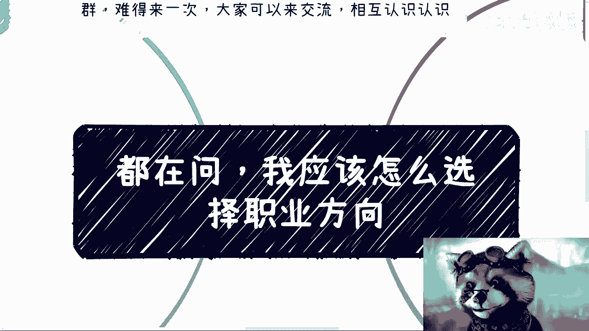
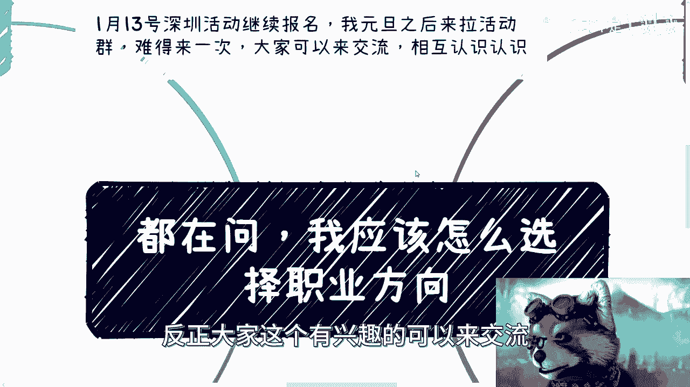
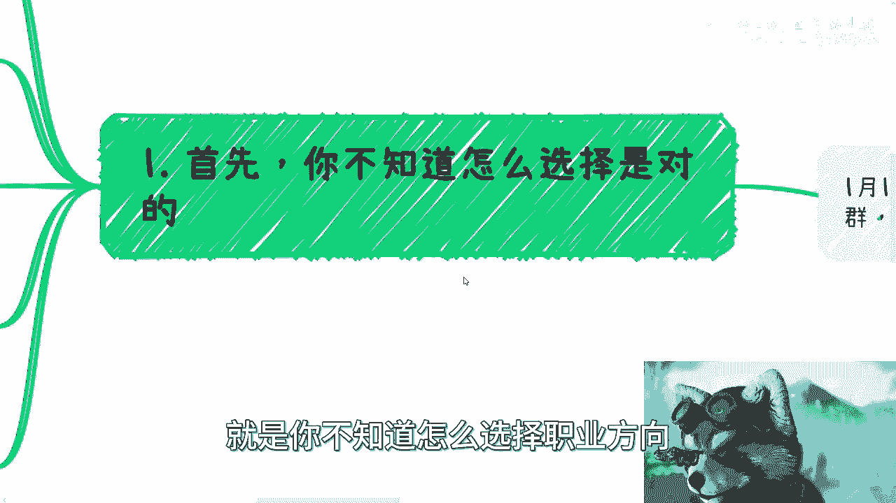
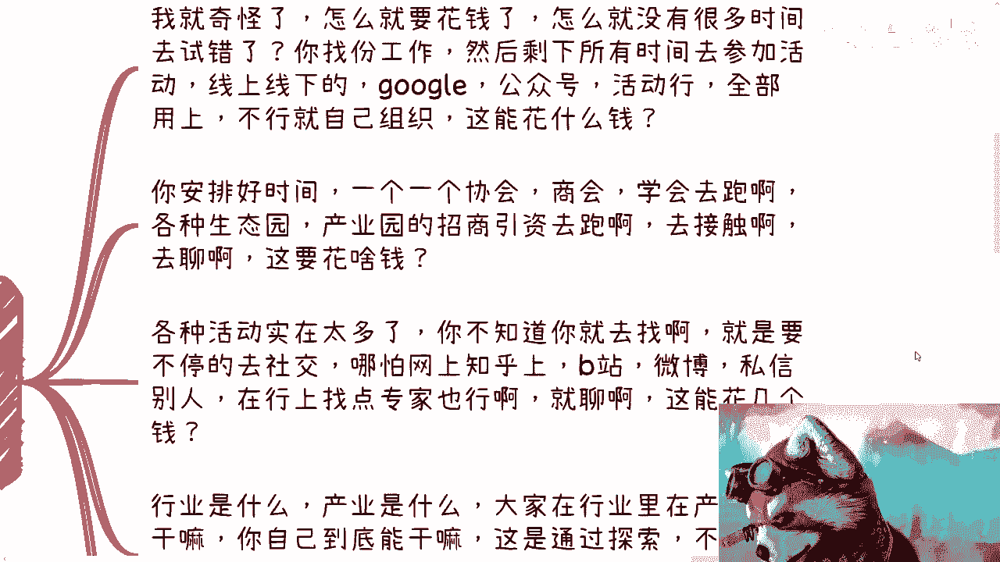
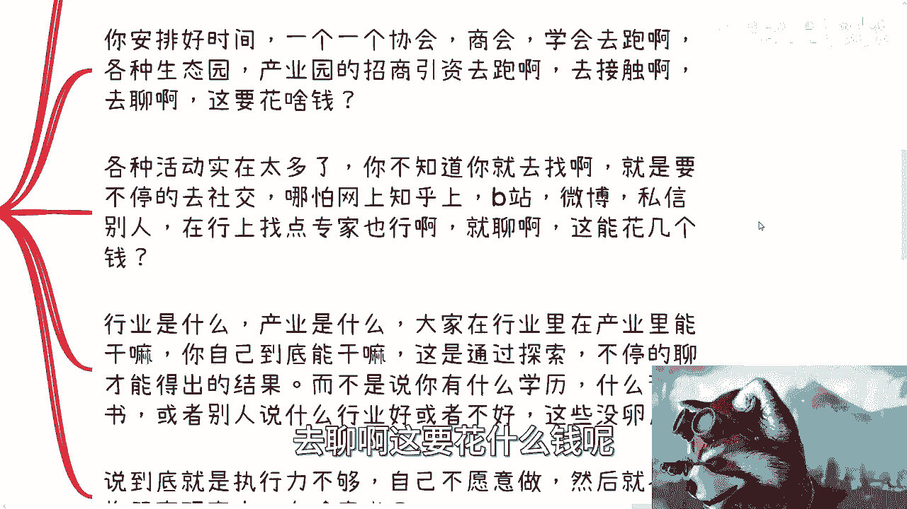
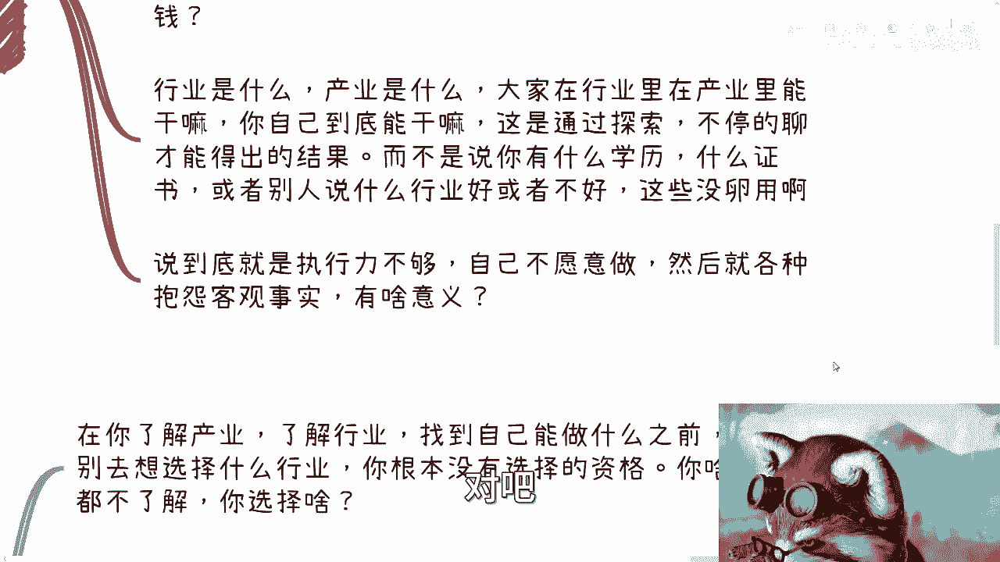
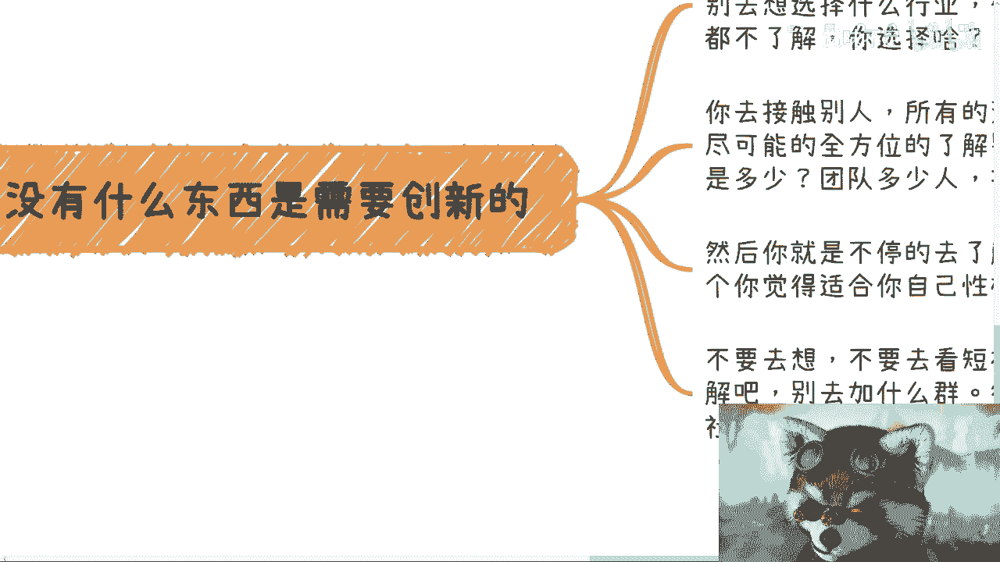
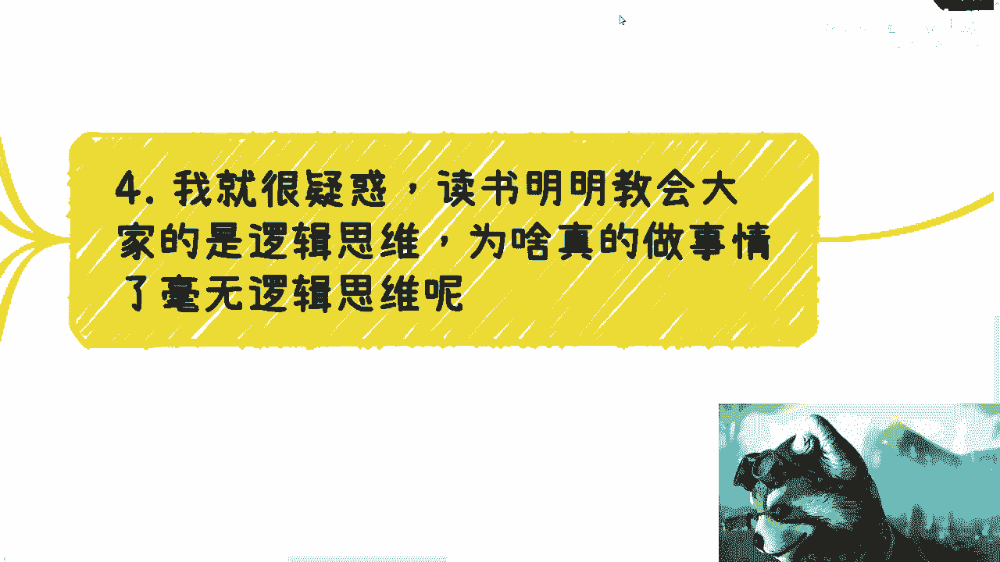
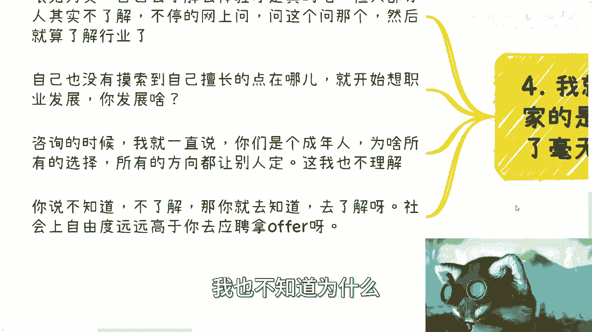
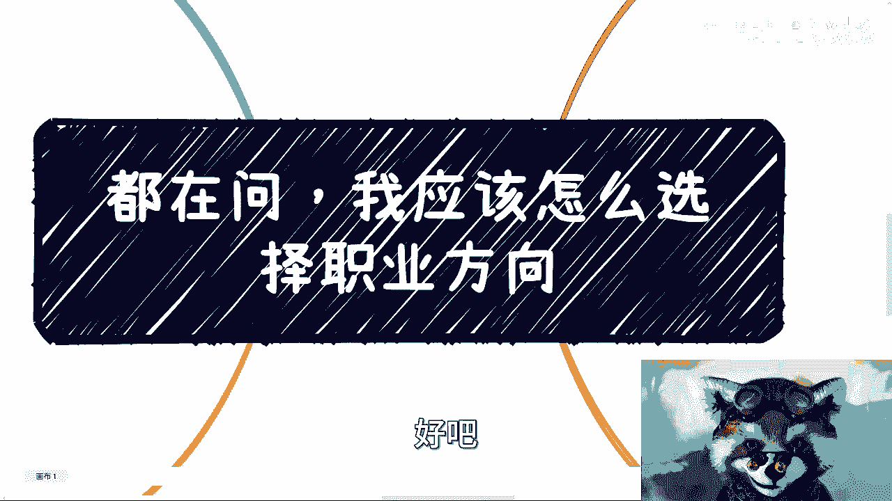

# 职业选择指南 P1：如何找到你的方向？🤔

在本节课中，我们将探讨一个困扰许多人的核心问题：如何选择职业方向。我们将分析为何人们会感到迷茫，并提供一个基于实践和逻辑的行动框架，帮助你摆脱空想，通过主动探索找到适合自己的道路。

## 为何你不知道如何选择？🤷‍♂️

上一节我们提出了核心问题，本节中我们来看看其根源。你不知道如何选择职业方向，这是正常的。

因为九年制义务教育和高等教育中，没有任何内容与职业选择和发展直接相关。你从未接受过这方面的教育，也缺乏相关信息。因此，你无法做出有依据的选择。

许多人会问：“老师，你觉得什么方向好？”但关键在于，你自己都不知道自己适合什么，别人又如何能知道？讨论哪个行业或职业“好”没有意义，因为这与你能否做好、能否赚到钱并不直接划等号。这本质上是在“开盲盒”。

作为一个成年人，读书多年，却在20多岁开始做人生重大选择时全靠“蒙”，这显然不合理。

## 问题的核心：缺乏了解与自我设限🧠

上一节我们指出了教育体系的缺失，本节中我们来看看个人层面的常见误区。大部分人对行业和产业缺乏了解。

他们不知道行业在做什么、如何赚钱，更不清楚自己能做什么。更关键的是，许多人会进行“脑补”——越是不知道，越会想象出各种障碍。例如，有人会问“金融行业门槛是不是很高？”这种问题本身没有意义。门槛高不高与你无关，除非你知道具体需要什么证书或技能。这些信息往往是道听途说，最终导致自我劝退。

年轻人本拥有无限可能，多尝试才能发现更多可能性。但现实是，许多人什么都不尝试，年纪轻轻就不断告诉自己“这个不行，那个不行”。

## 破除借口：探索不需要巨额成本💸

上一节我们讨论了自我设限的心态，本节中我们来破解一个常见借口。有评论认为“探索行业、积累关系需要花很多钱和时间，根本没有时间试错”。

这种结论是如何得出的？大部分人尚未尝试，就预设了高成本。实际上，探索可以低成本进行。

以下是低成本探索的具体方法：

*   **利用现有资源**：找一份有基础收入的工作，利用业余时间参加线上线下的活动。充分利用Google、公众号、小红书等平台搜索信息。
*   **主动创造连接**：如果找不到活动，可以自己组织。在咖啡馆约人聊天几乎不需要成本。按照计划，逐个拜访行业协会、商会、学会，或去各种生态园、产业园接触业内人士。
*   **直接沟通**：在知乎、B站、微博等平台，直接私信你觉得不错的人，请求交流。脸皮厚一点。也可以使用“在行”等平台付费咨询专家，几百元就能进行一次深度对话。

探索的目的是了解行业、产业、他人如何工作以及自己能做什么。这是通过不断交流得出的结论，而非依赖毕业院校、证书或他人的片面之词。认为探索成本高的想法，本质上是执行力不足，用客观借口掩盖主观惰性。

## 行动准则：复制，而非创新📋

上一节我们提供了低成本探索的方法，本节中我们来看看探索后的行动逻辑。在赚钱这件事上，我们大多数人不需要创新。

我们不具备颠覆性创新的能力。能赚钱的事情往往不是全新的。因此，在了解产业、行业，找到自己能做什么之前，不要空想“应该选哪个行业”。你什么都不了解，就没有选择的资格。

这就像问“你不上清华，是因为不想吗？”你之所以不做数理化学术研究，是因为你对自己的认知有基本判断。但选择行业时，你的依据却只是“短视频这么说”、“那个人那么讲”，这毫无逻辑。

所有沟通交流应只有一个目的：**全方位了解别人如何赚钱**。你需要摸清他们的投入产出比、团队规模、盈利模式。然后，选择几个你觉得适合自己性格和认知的商业模式，去进行复制（CTRL C + CTRL V）。

**注意**：这里说的是复制商业模式，例如专门服务高校或承接国资项目的模式，而不是照抄别人的具体产品或个人。关键在于停止空想和依赖短视频，通过亲身了解做出选择。行业和产业的真正方向，不是靠短视频和肤浅的社群建立的，那些对于真正的商业而言如同“过家家”。

## 回归本质：运用逻辑，眼见为实🔍

上一节我们强调了复制商业模式，本节中我们回归到最基本的思维方法。令人疑惑的是，大家读书多年本应学会逻辑思维，但做事时却毫无逻辑。

一个受过教育的人应该明白“眼见为实”，任何判断都应有依据。依据来源于自己的了解和体验。但现状是，许多人不停地看短视频、上网问、加社群、交钱，并认为这就是“了解行业”。这不是正确的学习方法。

在自己没有摸索到擅长点之前，空谈职业发展没有意义。提出的问题也往往是模棱两可的。作为成年人，你的选择和方向不应由他人决定。你不知道、不了解，那就去知道、去了解。这是每个人应走的路。

就像有人说“我没有本科文凭”，那正确的做法是去读，而不是到处问“我怎么弄个文凭”。社会上的自由度远高于通过Boss直聘找一份受限制的工作。但许多人宁愿依赖短视频，也不愿行动。

## 核心总结：实践是唯一的出路🚀

本节课中我们一起学习了如何破解职业选择困境。

*   **迷茫是正常的**，源于相关教育的缺失。
*   **自我设限是主要障碍**，需要通过主动探索打破信息壁垒。
*   **探索可以低成本进行**，关键在于执行力和厚脸皮。
*   **选择基于了解**，在充分了解前不要空想。
*   **行动逻辑是复制已验证的商业模式**，而非追求创新。
*   **必须运用逻辑思维**，“眼见为实”，依据来源于亲身实践。

看再多视频（即使一年1000小时）也无用。只有将思想融入DNA，通过实践才能真正融会贯通。你可以花冤枉钱、可以被“割韭菜”，但做事的方式必须养成。如果花了钱之后，做事方式仍是依赖他人和短视频，那就毫无意义。

请整理好你的具体问题，带着思考和实践的初步结果去进行下一步的咨询或探索。