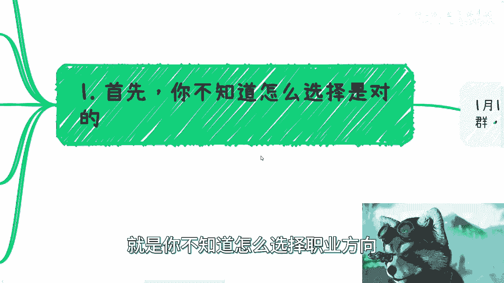

# 每天都被问，我应该怎么选择职业方向 - P1 - 赏味不足 - BV1ZC4y1v7bi

好大家好呃，1月13号这个深圳活动继续报名啊，我元旦之后来拉个活动群啊，然后这个难得来一次，反正大家这个有兴趣的可以来交流。

相互认识认识好吧，那，啊然后今天我们这个主题啊，就是说啊这个都在问啊，他说我应该怎么选择职业方向对吧。

首先啊我先这么说啊，就是你不知道怎么选择职业方向。

这是对的啊，嗯等一下啊，就为什么，因为你9年制义务教育加高等教育，没有人，也没有任何一个内容和教学是跟你职业选择，和你职业发展有关的，没有对吧，那你从小到大没有受到过任何的这方面的呃，教育啊。

或者说你也没有任何的信息，让你得到这方面有关的东西，那你怎么选呢对吧，然后一大群人会问啊，陈老师，你觉得什么方向，就我想说的是，就我怎么知道什么方向对吧，就你们自己都不知道你们适合什么方向。

我还能知道你们适合什么方向对吧，你就像那个很多人问这个哪个行业好，哪个职业好，不是哪个行业好，哪个职业好，跟我们能不能做得好，他也不划等号啊对吧，而且另外一方面，你说它好也好不好也好。

怎么能保证我们进去能赚到钱呢，也不知道啊，就这不都是开盲盒吗对吧，但是问题是你从我的角度来讲啊，我是觉得你说大家作为一个成年人对吧，读书读了这么多年啊，然后接下来从20多岁开始做选择，纯粹靠靠蒙。

不是你们觉得这合理吧，对不对对吧，那大部分人呢他是不了解行业的，也不了解产业的啊，也不了解行业和产业在做什么，也不知道行业产业怎么赚钱，他根本更不知道自己能干嘛对吧，然后关键呢还有很多东西自己脑补啊。

就是就是他越不知道他越脑补，比如说你像昨天有一个咨询的小伙伴就问我，他说金融行业门槛是不是很高，不就你们仔细品品这句话，这句话有意义吗，对啊，金融行业门槛是不是很高，你们行业做什么东西门槛高呢对吧。

你倒是说说看做什么呢对吧，然后门槛高不高跟你有什么关系呢对吧，不是你比如说某某行业必须要什么证书才能做，有意义的啦，你们想想看，就这些东西都是不知道哪道听途说来的，PUA的信息。

然后就不停的自己劝退自己，就是你要知道，在我看来，其实很多人都很年轻，他拥有无限的可能性对吧，你多尝试就有更多的可能性，然而事实是什么，事实是大家最终什么都不尝试，然后年纪轻轻就不停的告诉自己啊。

这个不行那个不行，反正就不行啊，我我我是不知道是怎么会，就说就说一直到现在为止。

就是就是就是很多人都这样子，我不知道为什么啊，然后第二点还有评论跟我说，他说探索行业积累关系啊。

需要花多很多的钱和时间啊，根本没有这么多的时间去试错啊，我跟你讲啊，首先我就奇了怪了，嗯什么微信吗，我看看啊，啊首先呢我就奇了怪了，就是这个要花很多钱跟很多时间，这种结论怎么得出来的对吧。

就是明明你们大部分人还没有去尝试过，去做过去去去去在这个游泳池里趟过，怎么就得出这种结论呢对吧，哎你说你找份工作有一份基础的收入，然后剩下所有的时间咳咳，该参加活动，参加活动，线上线下的对吧。

你google也好，公众号也好，活动也行也好，该用的全部用上，小红书什么该用的全部用上对吧。

你不行，就自己组织啊，这能花你什么钱呢对吧，我就告诉你脸皮厚一点怎么了呢，你随便找个咖啡馆不行啊，要什么钱啊，你安排好时间，一个一个协会商会学会去跑啊，各种生态园产业园招商引资，去跑啊对吧，去接触啊。

去聊啊。

这要花什么钱呢，你抠一点就是了，你能花什么钱呢对吧，你最终能得能得到的关系，你能认识的人价值远远高于这点钱啊，啊各种活动，而且我跟你讲很多很多，你不知道你就去找，你，就是要不停的去搜索。

哪怕你就是没有活动对吧好，你哪怕到知乎上，到B站，到微博，你去私信别人，你觉得哎这个人不错的，我们要不要聊一聊对吧，我想认识认识怎么了呢，你脸皮厚一点怎么了呢对吧，包括在行上面找点专家也行啊。

三四百块钱，四五百块钱就聊哇，这能花几个钱呢对吧，就是行业是什么，产业是什么，大家在行业里面，在产业里面能干嘛，你自己能干什么，这是通过探索不停的聊，你才能得出结论的，而不是说今天你在什么学校毕业啊。

拿了个什么证书，或者别人跟你说什么行业好不好，没有用的，没有任何卵用的对吧，就是我跟你说啊，就这种评论，或者你们有这种想法，在我看来说到底就是执行力不够，自己不愿意做，就通过各种客抱怨客观事实。

然后用这种借口来说，有意义吧了，没有意义的呀对吧，就是一天到晚就是说啊自己在跟自己说，哎呀我是个普通人，我根本就做不了这些，做这些东西都是要积累的，然后旁边有不停的很多声音跟你说，哎呀你不行的。

你你你要去做，你要去赚钱，一定是需要投入很大的成本，怎么样怎么样怎么样好了，那我就问你了解过没有，你做过多少东西没有，你怎么就知道要很大成本呢，要什么成本对吧。

就是就是大部分人都在不停的去听那种，有的没的东西，然后从来不通过实践去去去去验证，好然后第三点啊，我跟你们讲，没有什么东西是需要创新的。

就到今天为止，几乎啊要创新的东西，我也好，你们也好啊，不好意思，我们没这个能力啊，我们能赚钱的东西一定是不是创新的东西，明白吧，就是说在你了解产业，了解行业，找到自己能做什么之前。

你别去想我应该选哪个行业，因为你没有选的资格，你什么都不了解，你选啥呢对吧，这就像我跟我跟很多人，很多人说，你们不上清华，是你们不想上吗对吧，你们不得诺贝尔奖，是因为你们不想得吗对吧。

你们大部分人没有去选择做，比如说数理化的学术研究，或者说数理化的这个进一步的发展，是因为你们不想吗，不是是因为你们的认知对数理化，对诺贝尔奖这些东西有基本的认知，你们觉得你们没不是这块料，我也不是。

那么这个选择你们是有依据性的对吧，但是你们现在选择所谓的行业，你所谓的职业发展或者所谓的行业风险，你们想想看，你们有依据吗，你们的依据就是啊这个短视频这样讲的啊，那个人这么讲的，这叫依据吗，对吧。

那照这么个说法，大家9年制义务教育，高等教育不要做，不要学了，学什么东西了，你上来六七岁就开始看短视频，对不啦，你去接触别人，所有的沟通交流就是只有一个目的，就是尽可能的全方位的去了解别人怎么赚钱。

别人投入产出比是怎么样的，团队有多少人投入多少时间，赚多少钱，这就是你要去摸清楚的事情对吧，他是不是一个nobody，还是说他家里有关系还是怎么样子，你去了解啊对吧，然后你要的就是不停的去了解。

不停的去了解，不停的去了解，最终选择几个啊，就是了解下来，你觉得诶有有有一些商业模式，你觉得适合你自己性格或者适合你认知的，去CTRLCCTRLV啊对吧，咳咳对吧，那这个地方我也得说啊。

就是说嗯我说的很具体很牛逼，不是说让你们去抄别人，你懂吗，你可以去抄他的商业模式，比如说他就是专门赚高校的钱，专门专门去拿这个国家国资的呃，国投的一些钱，那你可以照搬他的商业模式啊。

不是要你去照抄人家对啊，你不要去想，不要就不要自己每天在那空想，不要去看短视频，你选择你总会有自己去了解对吧，然后也别加什么群，为什么，因为行业产业，真正的行业产业真正的方向。

不是靠短视频跟这些什么社群建立起来的啊，这些东西我跟你们说，对于产业，对于行业来讲，都他妈是过家家，没有用的，你懂吗，稍等啊。

对啊，然后最后一点就是我也很疑惑，就是为什么明明大家读书读这么多年，是为了教会大家逻辑思维的，但到最后做事情呢是毫无逻辑思维对吧。

就是我觉得正常的一个一个一个，一个一个读书的一个人，他都应该明白，就是眼见为实对吧，所有的那个判断你要有依据啊，那么这些依据哪里来，就要自己去了解体验，你才是真的，但是你会发现现在不是的。

现在大部分人是什么不停的看短视频，不停的往上问，不停的加社群啊，不停的交钱啊，然后这就叫了解行业了，唉你们读书老师跟学校是这么教你们的吗对吧，你自己没有摸索到，你自己在没有摸索到自己擅长的点之前。

你就在那边想职业发展，你发展什么东西啊对吧，所有问出来的问题全是模棱两可的，然后很多时候咨询的时候，我也一直跟他们跟对方说，我说你们是成年人啊，什么意思，就是你已经20多岁甚至30多岁了。

你为什么所有的选择，所有的方向让别人来定，这我也不理解，就是你说你不知道对吧，没问题，你说你不了解没问题，那你去知道啊，你去了解啊，这不就是你应该走的路吗，这不就是应该每个人走的路吗，对吧。

就像很多人说我我我我我我没有本科文凭，那你去读啊对吧，你没有本科文凭，不是到处来问哎，我应该怎么去弄个本本科文凭，对不对对吧，你直接发展很多东西也是一样的，我我早就跟你们讲了，社会上的自由度远远高于。

你们去什么什么什么呃呃呃boss直聘上面对吧，或者去应聘拿个offer，你们真正去打工其实是受很受限的，你们在社会上的自由度其实很高，但是都不愿意去做，都是只能通过短视频，我也不知道为什么对吧。

就是就是我这么跟你讲，我跟很多人都说过，包括我你们看我的视频没有用，你知道吗，就是我只能告诉你们的是，这个世界上，或者这个国家可能还会有其他的更多的选项，但是真正你们要融会贯通，你们要把思想。

把你们的做事方式融入到你们的DNA里面，你们必须去实践，没有时间没有用的，你就算一年看1000个小时的视频都没有用啊，就是怎么说呢，这叫拖，这叫这叫这叫不接地气，我跟你们说，我后面还会讲一期是什么呢。

就是关于这个过家家的事情，我发现很多人他就不明白，他就不明白什么叫过家家，他觉得很多东西是积累，但是你们要明白，那些东西在真正的商业合作面前简直都是，好吧行吧。

就这么着吧，咳咳咳咳嗯，我希望就是大家做事情都是一样的啊，就是你可以花冤枉钱，你也可以被割啊，你也可以就是说呃这个怎么样怎么样，但我觉得不管怎么说，就是做事情的方式得要养成啊，你不能说我几千块钱。

几万块钱冤枉钱花掉了对吧，我最终做生意方式还是不停的听别人，不停的看短视频，那他妈有卵用啊，好吧行啊，那就这么着吧，嗯有剩下的就是呃有什么要咨询的啊。

你们整理好问题列表好吧。