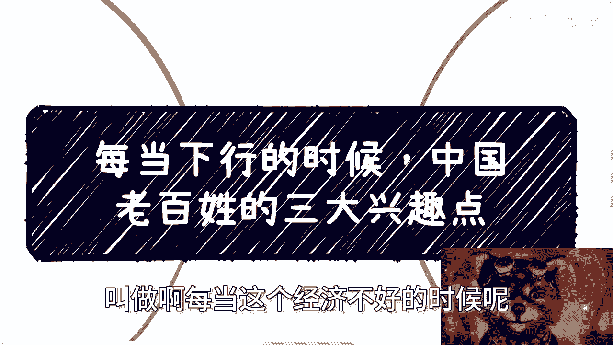
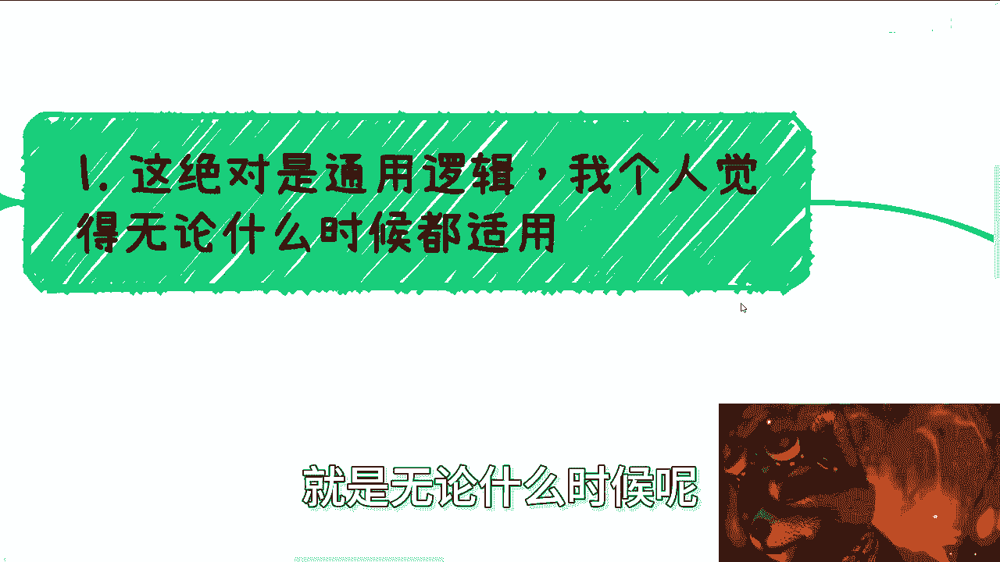
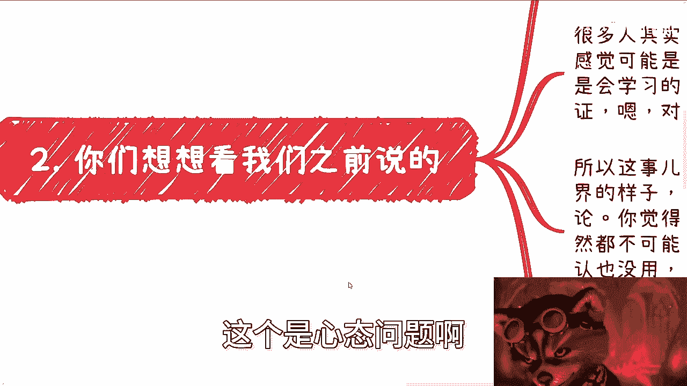
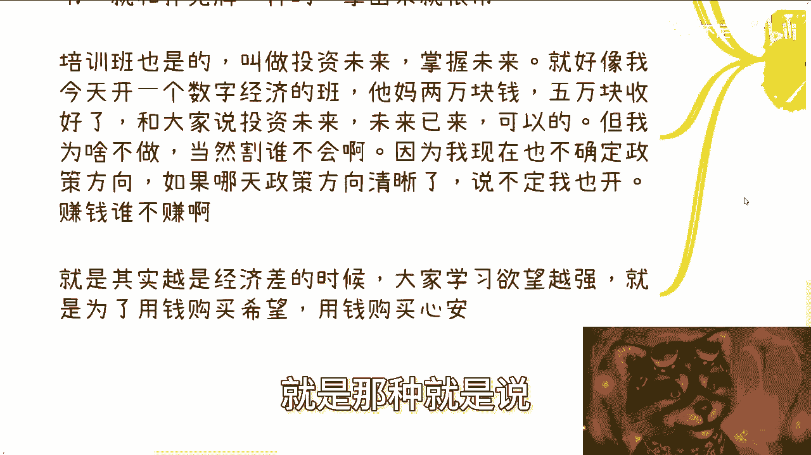
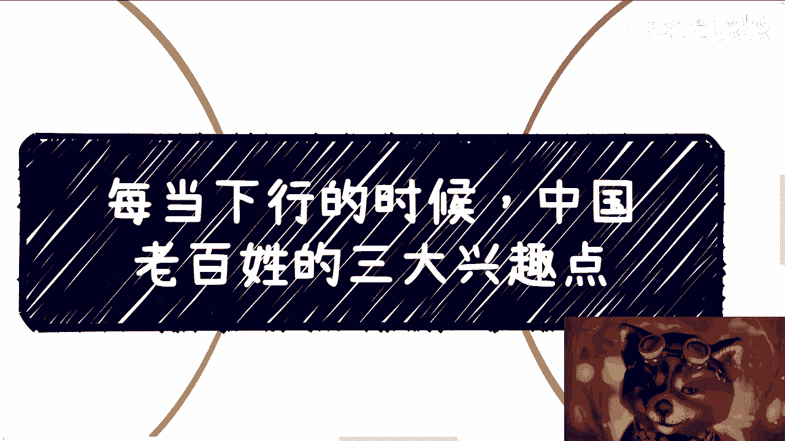

# 课程名称：经济下行期的三大商业机会 📉💰📚
## 课程编号：P1

在本节课中，我们将要学习一个普遍的经济现象：每当经济下行时，中国老百姓的三大核心兴趣点。理解这些兴趣点，对于把握市场趋势和寻找商业机会至关重要。

---

上一节我们介绍了课程的主题，本节中我们来看看这三大兴趣点的具体内容及其背后的逻辑。

无论经济周期如何变化，一个通用的逻辑是，老百姓的关注点会集中在三个方向：**玄学**、**投机**和**学习**。从商业角度看，这三个方向在当下环境中通常拥有稳定的流量和客源。

以下是三大兴趣点的具体阐述：

1.  **玄学**
    玄学包括算命、风水、易经等。在经济不景气时，许多人因物质生活压力增大，转而寻求精神寄托。因此，这类提供心灵慰藉的服务需求会上升。需要注意的是，在中国的网络环境中，应侧重于本土传统文化内容，避免涉及可能被归类为“宗教”的西方玄学内容，以规避合规风险。

2.  **投机**
    投机在这里指所有“以小博大”的行为，其核心是希望付出较小成本获得巨大回报。最典型的例子是彩票。此外，各类抽奖、盲盒等也属于此范畴。甚至花费数万元报名声称能快速致富的课程，在本质上也是一种“投机”心态——希望用金钱购买一条通往成功的捷径。经济越是不好，这种对“幸运一击”的渴望往往越强烈。

3.  **学习**
    这里的“学习”并非纯粹为了获取知识，更多是为了缓解焦虑、投资未来以获得内心平静。具体表现为购买书籍、参加各种考证培训班和技能培训班。许多人希望通过积累证书（就像打牌时积累好牌一样）来增加自己在未来竞争中的筹码，或通过报名高价课程来购买一个“充满希望的未来”。这是一种用金钱购买希望和心安的行为。

---

上一节我们详细拆解了三大兴趣点，本节中我们来分析为什么这些领域存在机会，以及谁才是真正的目标客户。

很多人可能觉得自己不属于这三类受众，因此觉得这些领域与自己无关。这恰恰是一个认知误区。个人所处的圈子并不能代表广大的中国市场。认为自己“不信玄学”、“不买彩票”、“不会为学习花大钱”的“聪明人”，其圈层相似，反而难以在这些领域实现商业转化，因为不了解真正的市场需求。

一个扎心的事实是，当前社会的中流砥柱——那些真正有消费能力的群体，可能来自传统制造业等领域。他们或许学历不高、对互联网不甚了解，但拥有资金和闲暇。而了解互联网、学历较高的年轻人，可能反而缺乏足够的消费资本。因此，做生意的关键在于明确**客户画像**，理解并服务于真正有需求、有支付能力的群体。

---

上一节我们讨论了目标客户的问题，本节中我们来看看如何理性地看待这些商业机会。

这些机会本质上是利用了经济下行期普遍存在的**焦虑感**和**信息差**。它们大多是面向个人消费者（To C）的，因为企业和政府端（To B/To G）在当前环境下预算可能紧缩，而个人端的焦虑型需求却在增长。

从商人角度，存在需求就意味着存在市场。关键在于把握分寸，提供与价格相匹配的价值服务，而不是进行欺诈或“收割”。例如，开设一个定价一两千、能提供切实价值的培训班是合理的商业行为；但将一个虚无缥缈的“未来概念”包装成课程，售价五六万甚至十万，这就是赤裸裸的“收割”。

赚钱并不寒碜，只要在合理的度内，满足市场需求的同时创造真实价值，就是可行的商业路径。在存量竞争的时代，找到这样的需求缺口并合法合规地提供服务，也是一种生存和发展之道。

---

本节课中我们一起学习了经济下行期老百姓的三大兴趣点：**玄学**、**投机**和**学习**。我们分析了其背后的心理动机（寻求寄托、渴望捷径、缓解焦虑），明确了真正的目标客户群体可能与你我的圈层不同，并最终探讨了如何理性、有底线地利用这些市场机会。理解这些底层逻辑，有助于我们更清醒地认识市场，无论在哪个领域，都能更好地把握需求与商业伦理之间的平衡。