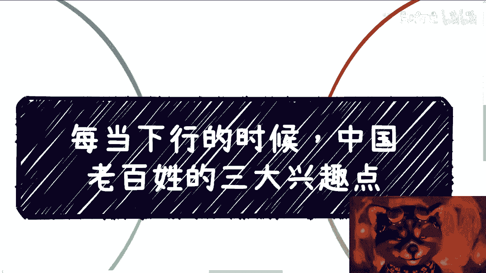
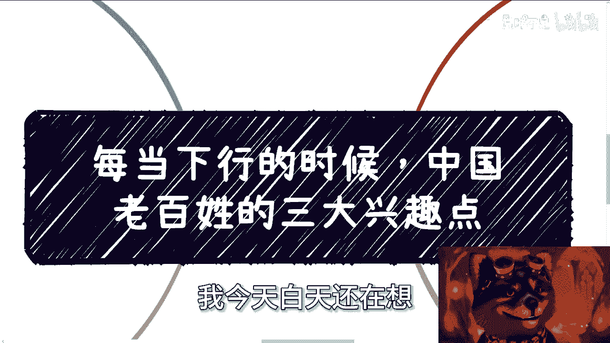

# 每当下行的是时候，老百姓的三大兴趣点 - P1 - 赏味不足 - BV1mC4y1Y7sC

好啊大家好，是不是啊，哎呀最近今天那个什么今天繁花收官了，我靠我跟你们讲真的，我他妈今天忙了一天，忙成狗了，我现在才能给你们录视频，我今天白天还在想妈的。

今天是不是不录了，唉算是吧，嗯好，那我们今天讲的这个主题啊，叫做每当这个经济不好的时候呢。

中国老百姓三大兴趣点啊，你看啊，首先呃至少我个人觉得这是一个通用的逻辑，就是无论什么时候呢。

基本上这个调性呢它都通用啊，什么意思啊，就是三大兴趣点，你们看啊，你们看啊，第一玄学，第二头肌，第三学习啊，我后面会给你们解释，哎我跟你讲，真的就他妈的，你们要是但凡真的做生意要赚钱。

我跟你讲就这三个方向嘛，无脑冲无脑冲啊，肯定能赚，没毛病啊，呃我跟你讲，很多人觉得经济不好的时候呢，市场不好啊，机会不多啊，这个怎么讲啊，大环境来讲它是这个样子的啊，但是也并不是完全这个样子的啊。

为什么，因为老百姓关注三个点，你看啊，我就跟你们讲了，那但凡我做真的，我去做这个业务，我他妈就无脑冲，为什么，因为绝对有流量，绝对有客源，因为这个是大环境，你别管你自己是做什么的，你别管你学历是什么。

你别管你懂不懂，但不重要啊，对不对，你要做的是什么，就是冲干啊，从你要这么想，14亿人里面，总归你能找到一些人让你变现的吧，对不对，因为这靠的我们说做事情啊，天时地利人和，靠的是一个机会。

靠的是一个机遇对吧，那也许啊，我们说这个东西不一定能给你带来多大的钱，但是你们仔细去看看，中国现在这个市场是不是嘛，123嘛，美丽呀，美丽真的美丽啊，对不对，这就好像以前你说吃饭的地方。

貌似比这个比以前少对吧，但是他妈的彩票点是不是里三层外三层啊，你们仔细想想看对吧，彩票点的人数绝对是质变对吧。

那照你这么个说法，那经济下行，卧槽，那他妈的大家哪里这么多钱买彩票，以前他妈的经济好的时候，怎么不见这么多人买啊，对不对，这个是这个是心态问题啊。

好第二点啊，你们想想看我们之前说的啊，其实啊我相信啊，你们大部分人我敢打赌啊，你们大部分人其实都不属于这三类受众里面，所以我才会说啊，你们大部分人呢不接地气啊，不接就是不接轨，为什么。

因为其实你们学历都很高，你知道吗，你们也过得还可以，你们并不能代表中国大复兴大部分老百姓，你懂吗啊，而且你们也不了解中国大部分老百姓，那请问你不了解他，你怎么赚钱呢，对不对啊，很多人你想想啊。

你们很多人其实根本不信玄学，当然我也不信啊，彩票呢啊，感觉这个很多人可能感觉说啊，这是一个什么老年人去买的对吧好，那学习呢啊可能觉得自己是会学习的，但是我跟你讲啊。

大概率大部分人可能觉得我不可能花钱去学习，或者我不可能花钱花钱就疯狂考证，或者说我更不可能花个几万十几万去学习，对不对，好嗯好没问题啊，好所以这个事儿就来了，你想啊，这就是个悖论，人都会觉得自己的人。

大部分都会以自己的圈子，认为是全国甚至全世界的样子，你越是如此，越是赚不到钱，因为因为毕竟这是个悖论啊，你想啊，你觉得你是个聪明人，那么你的圈子里面都是聪明人，自然不可能付费啊，你自然不可能有转化。

你也不可能承认你是个对吧，因为你承认也没有用，你还是赚不到钱，因为你根本就不知道真正的什么样子，你明白吧，所以说这就是个悖论，你不接地气，你就不可能去赚到这个这个土地上的钱啊。

好但是呢还有一件事情扎心了，我跟你讲啊，不得不说，其实很多人觉得自己学历很高啊，哦从而包括学习能力很强，他不去付钱学习，说真的他不是因为自己是聪明人而不付钱学习，我说实话是没有钱啊，你是没有钱。

就是我之前的视频，我就跟你们讲过中国当下的这个中流砥柱啊，中流砥柱真正有钱有闲的是那些做制造业的，比如说以前做金属加工的，做煤做矿的啊，做传统行业的，这是中流砥柱，你懂你知道吗，但是他们有一点啊。

他们的学历不高啊，他们与对互联网的了解也远远不如你们啊，你们对互联网的了解，包括学历各方面都是远超于他们的，但是你们没有钱啊，你懂吗，所以说你要真的去转化，你要明白我们一直说客户画像。

客户画像你得明白你的客户画像是谁啊，好第三点啊，我们说玄学投机啊是什么，你看啊玄学多了对不对，算命啊，风水啊，什么都是对吧，好在这里呢我得给你们提一点啊，呃中国的网络啊，它是更会偏向于中国的。

比如说风水啊，易经啊，没问题啊，你不要太多过分的去弄一些西方的东西，因为你会发现很多的不合规，是因为它西方，而西方这边呢这个中国非常多的媒体，它会把它归类归归类为宗教，你知道吧，你一旦归类为宗教。

那肯定得封啊，是吗啊，所以说风水呀，算命啊这种东西啊，你越是就是说这种时候他越是火，为什么，因为人没有物质寄托，他只能精神寄托，因为他赚不到钱，对不对，大部分人可能活的很艰苦，那他怎么办。

他只能有精神寄托，对不对，好，那么投机是什么，投机本身是一个很抽象的词，对吧啊，具象化的说法，就是说所有的以小博大的事情都算投机，那么我再跟你们说具象化一点的，就是所谓投机，就是就是希望天上掉馅饼啊。

最直接的就是现在的彩票，那别的还有什么呢，比如说所有的抽奖类型的，盲盒类型的都一样的啊，就是所有以小博大都算在投机，当然其实在我看来，几万块钱上课的，十几万报课的也是投机，为什么。

因为本质上都是希希望走捷径，是希望那种几万块钱能够翻出几百万的，那种想法，你知道吗，否则他怎么会花花个几万块钱去买个课呢，不会的呀，试问了，他一定是因为那个营销让他感觉到，我他妈今天花8万块钱进去。

我他妈一年说不定能赚16万，都这种感觉呀对吧，所以说这个都算在投资里面，而且越是这种时候，你会发现这种钱越好赚越好赚，最后一点就是学习啊，我跟你讲，这简直就无敌啊，真的叫无敌啊。

最大的你会发现就是平时不爱看书的，他妈的都爱看书，为什么不是为了寻求知识，是为了寻求内心的平静啊，当然我可能说的还他妈的好听了一点，不好听点叫什么，就是为了寻求自欺欺人，就这么简单啊，我有成长。

卧槽我他妈看书了，你告诉我你有啥成长对吧，然后就是考证和各种培训班会疯狂的去，为什么，因为很多人一直到今天为止，你们到二三线城市去问哦，他们依然会觉得卧槽，我手上他妈的就像打扑克牌一样的，你知道吧。

就是我我真的越多越好啊，越来越牛逼，最好能凑一对啊，拿出来就是吊，那怎么办呢，对吧啊，培训班也是的，叫做投资未来，掌握未来，就好像我今天看了一个数字经济班对吧，他妈的我就告诉你们2万块钱一个人啊。

5万块钱好了啊，5万块钱一个人啊，和你们说投资未来未来已来诶，不是我说什么一定会有人报名的，真的我敢打赌对吧，但是我为什么不做呢，哎搁谁不会啊，我的歌，谁不会啊啊我跟你讲。

因为我现在也不确定政策方向对吧，你要我真的哪天非常清晰清晰的政策方向，我知道产业接下来怎么做，我知道高校怎么做，我知道未来的这个这个这个各地方，中央到各地方的这个走向怎么做诶，说不定我也开赚钱。

谁不赚不赚，不赚，猪头三这个啦，就是这个道理啊啊所以说就是你会发现，其实越是经济差的时候，大家学习越望越是强，为什么，因为他要去投资未来啊，他觉得现在都是存量市场，未来都是增量市场对吧。

那我现在卷不过人家，我可能在未来能够卷得过人家，当然其实他妈的在未来他可能也卷不过人家，对不对，所以说就是说就是说你要去卷，你要去发展，你肯定有别的道路，而不是说你一定要去花个多少。

多少万到多少万去去对吧，没有意义的呀，哦你你会发现这种东西它就是用钱去购买希望，然后用钱去购买一个心安对吧，就都是一个道理，这就是怎么说呢，就是那种就是说我就按照我们前两次的那个。

那个说法，其实都是信息差对吧，但是怎么办呢，你你你你你堵不上你你你你拦不住，中国人多啊对吧，拦不住中国这个认知差的人就这么多啊，那怎么办呢，啊那好了啊，那说到这有有有，我相信肯定又有人要说了。

那他妈的你看陈老师就他妈不学好，一天到晚教大家他妈的搞这有的没的，我跟你讲啊，第一啊我教不教你们搞，有的没的，你们依然会去搞，有的没的啊，第二你们跟按照我说的方向去搞，有的没的，你们可能还能够赚到钱。

也不至于被骗你，但凡不是说这个样子，还不知道被骗多少钱对吧，第三我从来不鼓励大家要去做这种，就像我说的，我自己都不做对吧，但是每个人都要生存，每个人都要活，每个人也都要去赚钱，如果我只能说。

如果啊你们的业务跟玄学跟投机啊，跟我们说的这种这种这种证书诶，手上正好有资金有关的，那你就抓紧时间做，没有有有什么呢，赚钱不寒碜，对不对，就是你只要不要太过分，我觉得都是好的，没有什么问题的。

有什么问题呢，老百姓多个证也蛮好的呀，有什么问题呢，对不对，你不要太过分，这就像什么，这就像呐这就像什么，这就像你你你去吃饭一样的，你一晚你哦，那照你这么个说法，那那照很多人说话，就是那我去吃个饭。

我付钱，我他妈也是被割了，对不对，那么你话不是这么讲的呀，你比如说你一碗面，你卖我20块钱，我觉得OK对吧，就像我那天跟你们说的，我一个电视机卖你们100万，可能还没到哥的level对吧。

那我要是一个电视机卖你们1000万，那就叫哥了对吧，那你一个培训班也是的，你可以办个一两千的培训班，我觉得没问题，你不要动不动就是什么5万6万10万的，那这不是歌，是什么那么赤裸裸的歌吗，红果果的歌嘛。

对不对啊，所以说我觉得也没什么毛病，只不过就是说就说我们一直说你说封口，封口封口，这也算封口啊，有什么不能做的，你只要度掌握得好对吧，不要去割，而正常的就是说你给予的服务价值。

跟对方给你的钱是匹配的就好了呀，那我们不能说任何一件事情都割，那么任何一件事都都往歌上面说，那那好了，大家不要赚钱了，就只要今天有人赚钱，就是他哥，那那那那还谈啥呀，对不对啊。

所以啊所以啊我们回过头来说，就是说你会发现，尤其是这种情况下面有没有方向有的，但是这种方向呢往往都是to c的，你知道吧，就是企业端政府端他可能需求量少，因为企业端政府端当下的确没有钱，你知道吧。

但是C端老百姓他不是有这个需求，但是当然了，你说他心理安慰也叫需求，但是他不是真的有这个需求，他可能更多的是焦虑所带来的需求，那我不管他什么地方带来需求，他妈的都是需求，对不对，你从商人角度来讲。

我只要但我觉得大家只要不昧着良心，你们去赚钱没什么毛病，对吧啊好吧哎呀不行，就这么着吧，今天这么晚了，嗯好吧，有啥你们反正整理好再做咨询，现在哎呀，反正差不多就提前一两周吧，你们尽快找我约吧，好吧。

就说这时间越约越晚。

