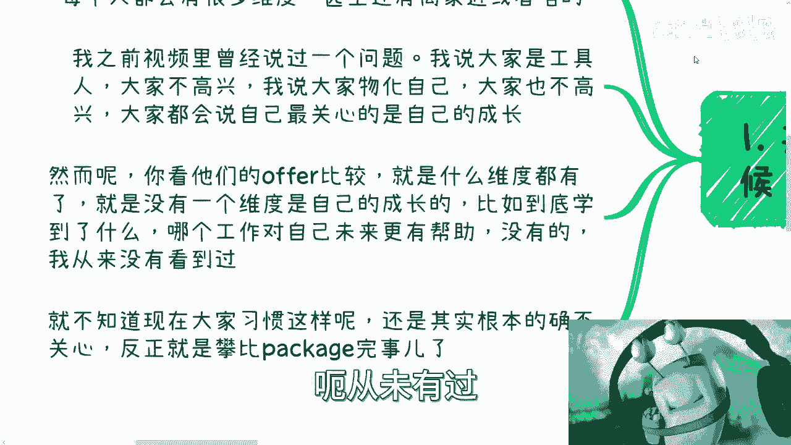
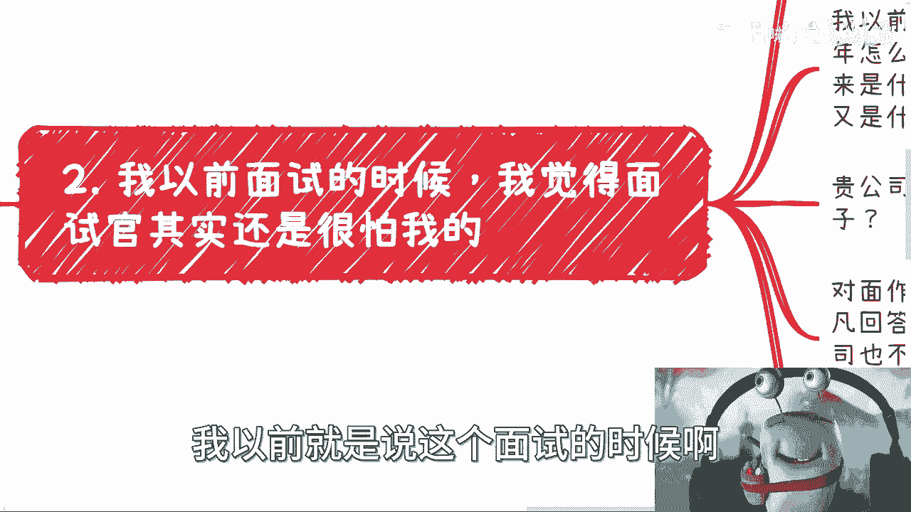
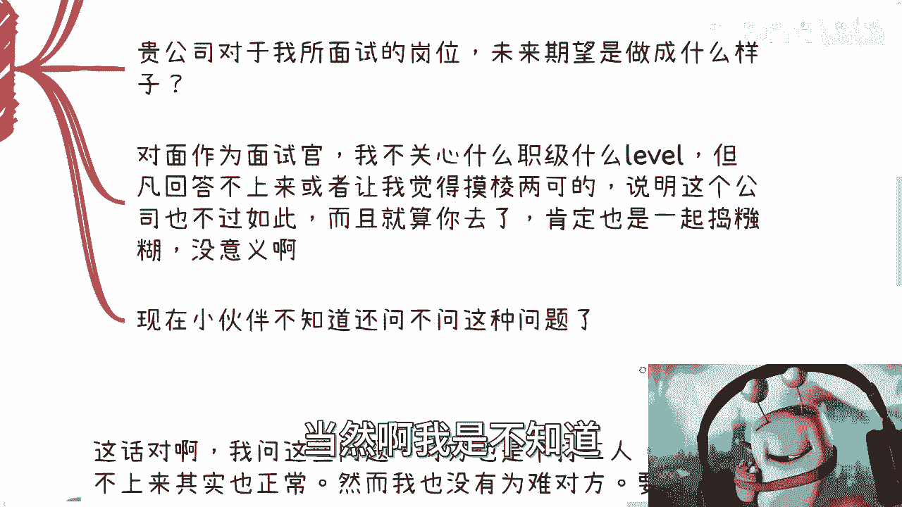
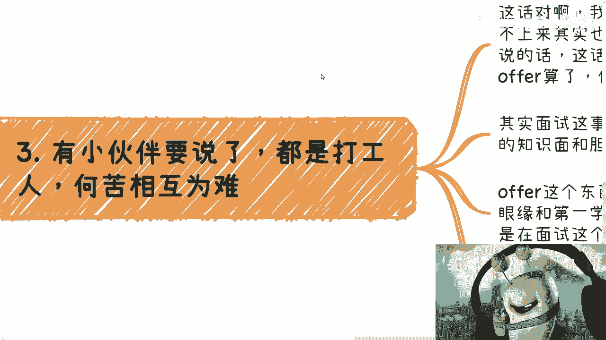
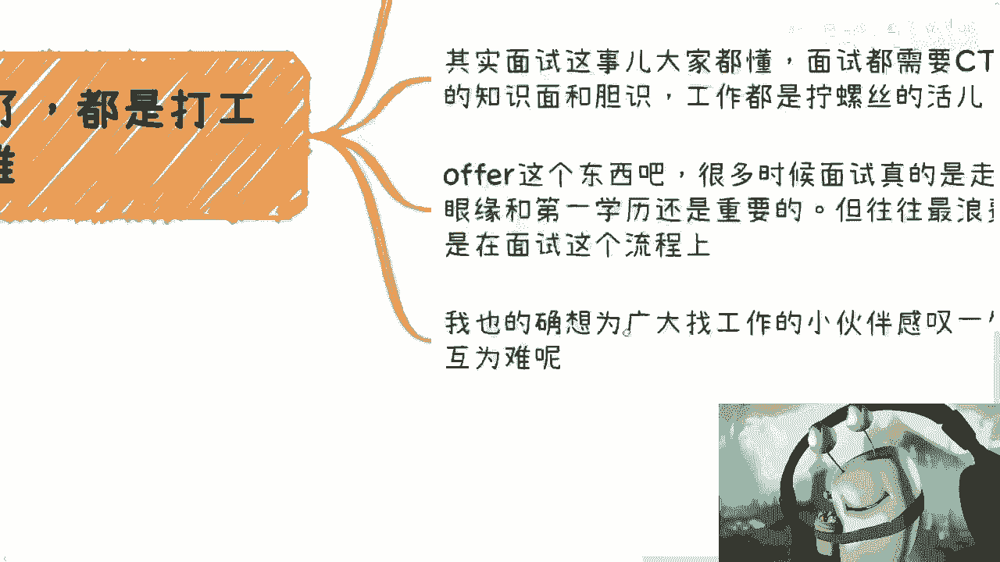

# 每次我看到offer对比和挑选-就真的笑了---P1---赏味不足---BV1ig4y1k747_n

在本节课中，我们将学习如何跳出常见的“Offer对比”误区，建立以个人成长和长期价值为核心的职业选择逻辑。许多人在面对多个工作机会时，常常陷入无关紧要的细节比较，而忽略了最核心的问题。

---

## 一、 常见的Offer对比误区

上一节我们介绍了课程目标，本节中我们来看看求职者在对比Offer时常见的思维偏差。

许多人会制作非常详细的对比表格，包含各种维度。

以下是常见的无效对比维度：
*   公司名气、规模。
*   薪酬包（Package）的具体数字差异。
*   工作地点、通勤时间。
*   甚至家庭意见等外部因素。

然而，这些对比中**唯独缺失了最关键的一项：这份工作对“我”的成长有何帮助？** 看似是在选择一份将投入数年时间的工作，但所有讨论都围绕外部条件，而非内在积累。这导致选择偏离了“提升自身价值以获取更高回报”的初衷。

---

## 二、 在面试中主动获取关键信息

既然个人成长如此重要，那么这些信息从何而来？答案是在面试过程中主动询问。

许多求职者对岗位有疑问，却不去询问公司（HR或面试官），反而四处咨询无关的第三方。这是本末倒置的。面试是双向选择的过程，你有权了解岗位的全貌。

在面试的最后环节，你应该像进行一场“付费咨询”一样，向面试官提出关键问题，以评估该岗位是否有利于你的成长。

以下是你应该向面试官提出的核心问题列表：
*   **公司及部门规划**：贵公司/这个部门未来几年的发展规划是什么？
*   **岗位定位与期望**：公司对这个岗位的具体期望和规划是什么？希望它创造什么价值？
*   **个人成长路径**：在这个岗位上，我可以学习或积累哪些技能和经验？公司如何支持员工的成长？
*   **工作模式的合理性**：如果涉及加班，背后的主要原因是什么？（例如，是处理临时需求，还是长期项目攻坚？）

提出这些问题，不仅是为了获取信息，更是为了**评估对方的诚意与公司的格局**。如果对方无法清晰回答或含糊其辞，这可能意味着该公司或团队本身缺乏规划，你加入后也难以获得有效成长。这就像婚姻，若在开始前就发现对方不尊重你，便没有继续的必要。

---

## 三、 建立以“成长”为核心的选择标准

上一节我们探讨了如何获取信息，本节我们来建立清晰的决策标准。

选择Offer的核心，应回归到你的根本目标。如果目标是赚钱，那么所有决策都应围绕“如何提升自己未来的赚钱能力”展开，而非纠结于短期、微小的薪酬差异。

一个简单的决策逻辑可以用以下公式表示：

**决策原则 = 是否极度缺钱？**

*   **是** → 选择当前现金报酬（Package）更高的Offer。
*   **否** → 选择更有利于**技能积累**和**长期发展**的Offer。

许多选择困难源于混淆了“手段”与“目的”。例如，攻读MBA、参加社交活动等，这些只是“手段”。在采取行动前，必须明确其如何服务于你的“目的”（如赚钱、转型）。你需要通过调研（与读过的人交流、了解真实产出）来验证该手段的有效性，而不是用“人脉”、“光环”等模糊概念自我说服。如果手段与目的不匹配，无论投入多少金钱和时间，最终都可能感到失望。

---

## 总结

本节课中我们一起学习了如何理性评估工作机会。
1.  **识别误区**：避免陷入仅对比外部条件（如薪资、公司名气）的陷阱，这类对比常常缺失了“个人成长”这一核心维度。
2.  **主动出击**：在面试中，应像进行付费咨询一样，主动询问关于岗位价值、团队规划和个人成长路径的关键问题，这是双向评估的重要环节。
3.  **明确标准**：建立清晰的决策框架，一切选择应服务于你的长期目标（如提升赚钱能力）。短期缺钱选高薪，否则永远优先考虑能带来**技能积累**和**成长空间**的机会。

请记住，你的时间和职业生涯是最宝贵的投资。将注意力从无关紧要的对比，转移到对自我成长和长期价值的关注上，是做出明智职业选择的第一步。