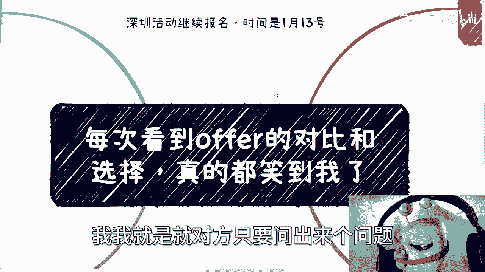
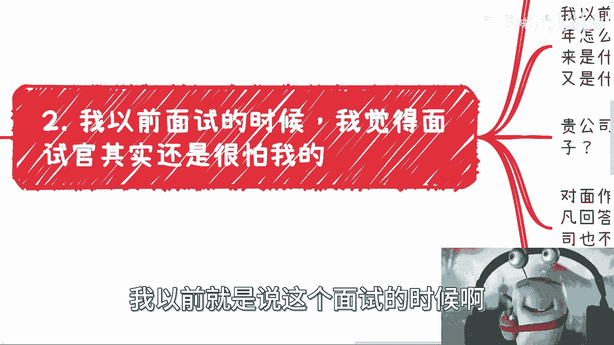
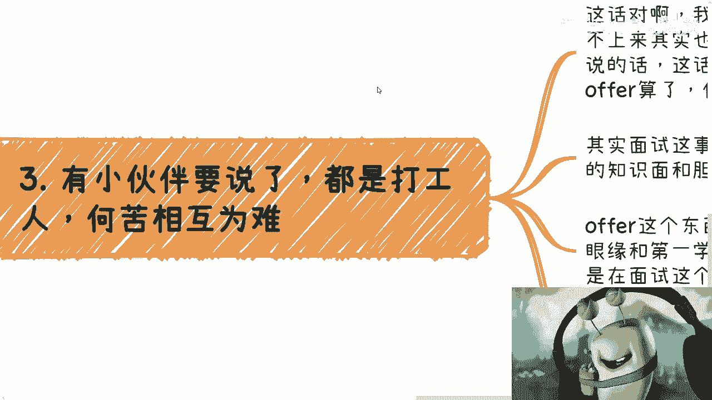
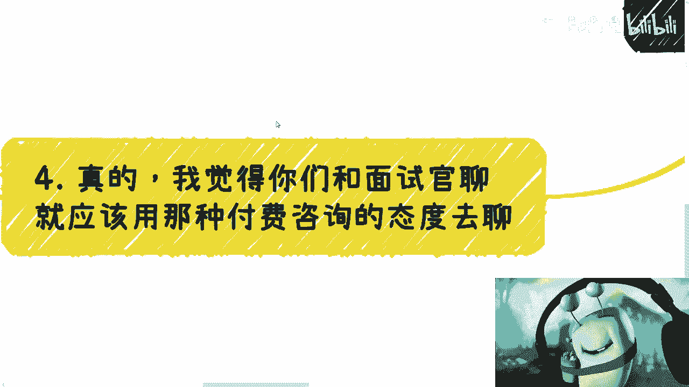
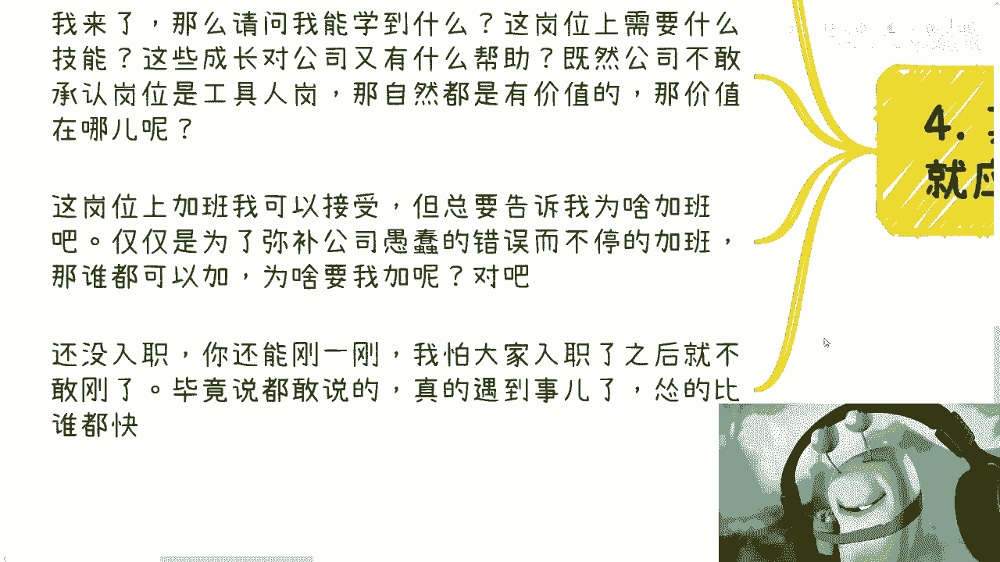

# 每次我看到offer对比和挑选，就真的笑了 - P1 - 赏味不足 - BV1ig4y1k747

大家好啊，我发现就是就是这个赚钱的，我发现大家其实不是很想赚钱啊，就是每次嗯这个咨询跟沟通啊。

我就发现我比他们急啊，我就是对方只要问出个问题。

我就问他，那你赚钱吗啊，这想半天，然后再问我哎这个A跟B怎么选，我说你A跟B怎么选，赚钱吗，要想半天就我就发现就是都说想赚钱，但其实问出来的问题跟所每天内耗的点，纠结的点跟赚钱没半毛钱关系。

我就我也很很很迷茫啊，我也很迷茫啊，好，那首先那个深圳活动继续报名，时间是1月13号。

然后今天我们来讲的这个内容啊，就是说呃我在很多地方看到过这个offer的对比，然后咨询我的人呢也会提到这个offer对比，每次提到这个东西啊。

就很可笑，为什么，首先你看啊。

其实微博上还有咨询我的时候呢，好多都有这个offer的选择啊，就真的啊我跟你们讲，我发现所有那些offer对比拿出来的时候，就是它有很多的维度，而且这些维度呢只有你想不到，没有他做不到啊，老牛逼了。

各种维度啊，然后什么把什么什么家里三代都拿出来是吧啊，然后对比一下啊，就我之前视频里面曾经说过一个问题，我说就很多时候啊我去说大家是工具人，让大家不高兴啊，我说大家物化自己啊，就不把自己当个人啊。

大家也不高兴啊，然后呢这个大家会跟我说，陈老师，你这样不对啊，我们最关心的是我们的成长，那最关心的就是我们这么赚钱对吧，嗯好好没问题啊，没问题啊，好然而你看他们的offer对比哎就很神奇，什么意思啊。

就是什么唯独都有他唯独一个唯独没有，这是什么，就是自己的成长，就是就是你会发现这个offer啊，看似是他的offer，就看似是一个你接下来要花几年时间，进去工作的一个offer。

但是他所有的对比维度里面，唯独没有自己的成长，也就是说这个offer到底给我能带来什么呢，我到底能学什么呢，这offer能给我未来有什么帮助吗，没有的，我从来没有看到有这一项过，从未有过啊。

就是我不知道是现在大家习惯这样子呢，还是说就大家反正根本不关心也不关心，反正就是攀比package就完事了啊，就是他package300000，我35万，我牛逼哎，就结束了。

还是怎么着，我也不是很搞得明白啊。

那么第二点就是我以前就是说这个面试的时候。

我觉得面试官其实还是蛮怕我的，为什么，因为，首先我先提一点，就是我发现很多小伙伴对于这个工作和offer，本身呢，他还会有很多的疑问，但是你知道吗，很奇怪的，就他们有很多疑问呢，他们不去问公司的。

就既不问hr，面试的时候也不问他，咳咳咳咳，他到处问别人，我跟你讲要命，你问别人，别人怎么会知道啊，你别问我，我咋晓得嘞，对哦你问我啊，陈老师这个offer诶。

你觉得这个这个offer这个岗位怎么样怎么样，我他妈怎么知道，对吧啊，我跟你们讲，我也想出去面试，我不管面子怎么样，我一般最后都会问面试官，我说贵公司未来几年怎么发展，你跟我讲讲看啊。

这贵公司对于我所面对这个岗位，所在部门有什么规划，你跟我讲讲看对吧，那贵公司对于我所面对这个岗位，未来又有什么规划，你跟我讲讲看啊，那贵公司对于我所面对这个岗位，未来期望是做成什么样子的。

希望有什么成长，你说对吧，哦你们开一个岗位，你们面一个岗位啊，你们自己没规划的哦，参团我进来规划啊，哎奇了怪了哦，那我进来规划，那到底谁灭谁呢对吧，所以说对面作为面试官。

我根本就不care他的职级是什么level哦，但凡回答不上来的，或者说让我觉得模棱两可的来忽悠我的，那就说明他不过如此，他所在的公司也不过如此对吧，而且就算你去了，肯定也是一起倒江湖。

因为你你连规划都没有，你连期待都没有，你连期望值都没有，你能怎么滴，哦哦哦哦你你你公司里面都没有个规划，我还指望进来，我能成长吗，啊哦我我他妈被你骗了，我还得给你数钱对吧，当然啊。

我是不知道现在的小伙伴还问不问这种问题啊，对吧，就是就是明摆着这是一个自我权益的争取，那我不知道大家现在还不问问不问啊。

然后第三个就有小伙伴要说了，他说那都是打工人，何苦相互为难是吧，我跟你讲这句话没错啊，我去问他这些问题，对方也是打工人，回答不上来也是正常的，但是问题是我也没有为难对方，你要这样说的话。

那我觉得这话更应该是我们对面试官说对吧，就是给我们offer算了啊，何苦为难我们呢对吧，因为其实面试这个东西说不好听点，大家都懂啊，面试他问你的问题呃，呃这个这个大家沟通的内容都是什么。

CTOCU的知识面和胆识，对啊，就大家以前都吐槽的哦，面试面貌好像在面个CCT，再面个CU啊，工作都是拧螺丝钉的活对吧，offer这个东西我跟你讲，很多时候面试就是走个形式。

说白了看的是演员和第一学历没了对吧，那既然如此，为什么要浪费时间，还在面试的流程上呢对吧，hr也浪费工资也浪费，我们也浪费，毫无意义啊，那我也的确想为广大找工作小伙伴感叹一声，那他妈何苦为相互为难呢。

哎奇了怪了。

嗯对啊，所以我觉得核心点，我觉得你们真的去面试和面试官聊啊，你们就应该拿出那种付费咨询的态度去聊。

什么意思呢，你比如说就是那种就是那种就是我来入职了，你应该对我的成长负责啊，否则我来入职干什么呢，对不对，你面试官，你作为面试官，你敢跟我说吗，哦我他妈来当工具人，我就算是工具人。

你也不敢这么跟我讲对吧，你也敢说，那就更不能录制了，还了得啊啊，这就好像是这婚还没结呢，就开始看不起我了，那还做个屁啊，对吧啊，然后我会问他，我来了，那请问我能学到什么呢，这岗位需要什么技能呢，对吧。

这些成长对公司又有什么帮助呢，那既然公司肯定不敢承认岗位是个工具人岗，那自然是有价值的，那请问价值在哪呢，对啊，同样的这岗位加班我可以接受，但你总要告诉我为什么加班吧，啊你不能老是跟我说。

仅仅为了弥补公司上层领导或者老板，愚蠢的错误而不停的加班吧对吧，你总也不能跟我说哦，因为因为这个叫什么竞争对手啊，大家都在加班啊，我们不加，我们就得死了，那谁都可以加，为什么要我加呢对吧，还没入职。

我觉得你还能杠一杠啊，我怕大家入职了之后就不敢杠了对吧，毕竟很多人说是敢这么说的，那真的入职了，怂的一批啊，怂的比谁都快。

对吧。

真的我这么多年看到过很多的这种对比，就是就是就是他你甚至会感觉，他拿出来的整个的一个对比的这张table，这张表好像跟他没有关系，就我们在讨论的是一个跟他没有关系的offer啊。

这就像我今天一开始跟你们讲的，就是就是所有人比如说来咨询来沟通对吧，他他内耗，他关注的点，你问他，你你目的是什么啊，我目的是赚钱哦，然后你所有考虑下来问题跟撰写有关吗，哦好像没这么大关系，那对呀。

能讨论他干嘛呢，你那个号他干嘛，那你纠结他干嘛呢对吧，那offer也是的，你说这两个package，比如说一年就差5万，一年就差10万，那我就问你，你是不是一年很缺智失败，你说对，那就选多的对吧。

你说不是，那你就选个轻松了，结束了哪这么多逼逼对吧，为什么，因为我看出来大部分的人他选这些东西，他根本就不关心自己的积累，也不关心自己的成长啊，然后回过头呢还要我跟你讲，就很搞笑。

就回过头来还要到网上来杠我对吧，你会发现还有很多人要网上杠，我就说工作有成长的，工作有积累的，你积累啥，你告诉我你积累啥，你就像你就像那个，前两天有个小伙伴咨询我的时候，说什么，说呃那个读1NBA对吧。

我我说那干嘛呢，有什么用呢，哦这个比如说什么校友会对吧，然后什么同学之间大家都能赚钱呢对吧，能积累更多的人脉对吧，那我就问他，你去跟几个创业的人聊过，你去跟几个读过NBA的人聊过，你怎么知道他有人脉。

你怎么知道你最终能跟这些人赚钱，你又怎么知道你能赚多少钱，知道吗，你不知道啊对吧，你不知道为什么要拿这些东西去去，去去PUA自己呢对吧，那很多人要说了，他说那我们做之前你不可能知道结果，那你怎么先做。

哎对呀没错对吧，你你你放到一个比如说新兴领域，放到一个风口上面，你这句话是没有错，但是你放到大部分的时候对吧，你说这个offer你是第一，你是全国第一个人的，拿拿拿到这个offer第一个人吗，不是吧。

读这个NBA你是全国第一个吧，也不是吧对吧，你多去问问不就知道了吗，你为什么一定要，就是要要要要用那些有的没的鸡汤来灌自己，对吧，然后回头啊，真的比如说去读了，然后他又要说了，哎呀我这四五十万对吧。

投下去感觉没什么卵用，我真的我说实话，我替NBA喊冤，我也替你喊冤，我替你这四五十万的人民币喊冤，为什么你自己没有，就是就这个期望值跟对方的，整个的办这个NBA的初衷，他就不服，你要强加于对方对吧。

那那那能怎么办啊，这就像这就像那个叫什么，就像我之前那个线下办活动也是的，我就跟他们讲了，我说你们不要指望我线下活动，你们交个两百三百跑过来说，我能够在你活动上学到一些赚钱的技巧，要命了。

你要两三百在我这能学到赚钱技巧，那他妈的大家那些NBA大家9年制义务教育，高等教育不要读了呀，倒闭吗，算了呀，对不啦，哦你不能因为两三百来了我那个活动，然后跟我说，哎陈老师。

我在你活动上面没有学到赚钱的技巧，的骗人，哎我我我只能满脸问号，那我能怎么办呢，照你这么说，两三百应该给你学到，那大家倒闭吗，算了，不要学历，要学什么东西呢，人均人均富豪，对不起，你真的是。

真的所以说我跟你们讲啊，我我会我发现真的我从赚钱角度，我比你们都要急，所有这个一对一聊的对吧，或者线下找我的，真的我比他们几，我说你想不想赚钱，想要么就是我说我每次问问题都是我问的，我先问他。

你想不想赚钱，想啊，从来没有什么自己跑过来哎，就是列的很清楚的，哎我操很少很少哎呀无敌了，我跟你们讲哎行吧，就这么着吧，然后那个活动要报名嘛，要报名的，你们再私信我好吧，然后咨询的话。

反正你们整理好问题啊，最好稍微详细一点，不要太太那个叫什么，就是就给我两句话，这这这这我也讲不出什么东西来对吧。

好吧行。