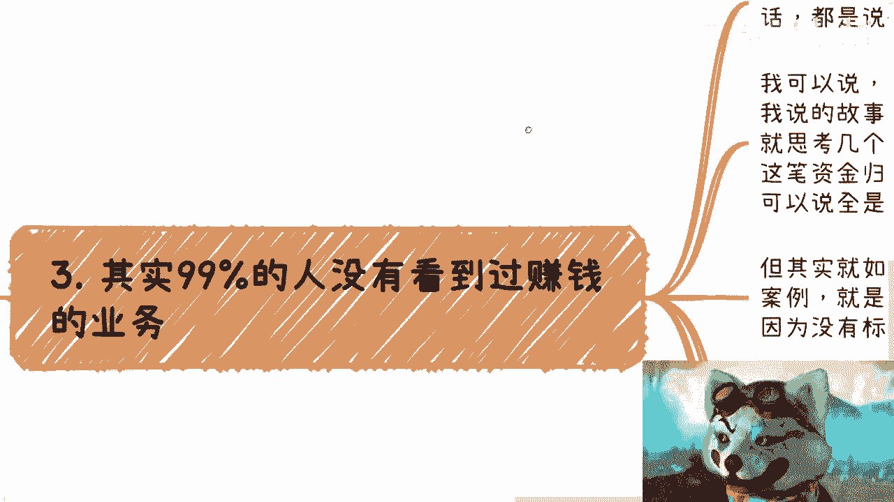

# 赚钱思维课 01：破除“风险与灰色”的思维误区 💰

在本节课中，我们将要学习一个阻碍许多人赚钱的核心思维误区：每当谈及赚钱机会，就条件反射般地询问“有没有风险”或“是不是灰色产业”。我们将深入剖析这种思维模式的根源，并帮助你建立更清晰、更有效的商业认知。

---

## 一、 问题的普遍性与本质

每次谈到赚钱，对方都会询问是否有风险，是否属于灰色产业，需要注意什么。几乎所有人都想赚钱，但只要是真正能赚钱（指非辛苦钱）的切入点，到了普罗大众那里，就变成了所谓的“风险”。

除了辛苦钱，剩下那些投入产出比高的赚钱方式，请告诉我哪一个完全不灰色、完全没有风险？或者反过来说，请告诉我一个踏踏实实、老老实实干活就能赚到钱的逻辑。哪怕在公司里，也存在许多水下的、背后的手段，这不叫灰色吗？道理是一样的。

## 二、 重新理解“风险”与“灰色”

大部分人不懂，但不懂不代表就是有风险。同样，灰色也不代表都是风险。我们没有接触过的业务很多，商业上能赚钱的也很多。但请这样想：只要你不偷不抢，不杀人放火，不涉及黄赌毒，你在怕什么呢？

灰色业务才是支撑世界与社会发展的核心。没有灰色业务，社会难以发展。很多事物从上至下、从里到外去推动，如果没有利润、没有高利润，谁去做呢？如果利润率只有2%，你看谁去做？支撑世界发展的核心，往往不是水面上那些显而易见的东西。

灰色的含义与收入才是大头。但“灰色”的意思不是说它有风险，而是指它存在**信息差**。很多人不知道，并且不会有人去填补这个信息差，因为这容易造成不必要的麻烦。但这并不代表有法律风险，这是两码事。

例如，你发现某个上下游业务的利润率高达1000%，你很开心。但你要明白，这个高利润是你一个人或一家公司能独占的吗？不是。它势必背靠大树，同时涉及复杂的上下游关系。如果你有能力赚这个钱，你心里自然有数：为了自己、上下游的利益以及未来的合作，你都不会对外公开具体利润。你最多分享业务模式，但不会透露具体赚了多少钱。

归根结底，有没有法律风险？没有。你该交税就正常交税。

## 三、 赚钱业务的真实面貌

99.99%的人没有真正见过赚钱的业务。我举个例子：我们以前一年接到过十几个电话，都是要做资金出海或路径业务的。打电话的人互不认识，但讲的故事几乎一模一样。你自己思考一下，这有风险吗？

判断风险其实很简单：
1.  看资金来源是否清晰。要避免卷入洗钱，否则资金链上所有涉及的账户都会被冻结。
2.  看资金的交税类型是什么。如果你做资金出入业务，你知道交税类型吗？不知道，那就意味着风险。

为什么我讲很多互联网案例？因为互联网层面的利润率很高。为什么高？就是因为**没有标准可循**。

例如，你问我要一个元宇宙软件，我报价80万。你觉得多少合适？你不知道，也无处可查。这就是信息差。我报80万合理，报180万也合理，但报800万可能就不合理了。你知道我的成本吗？你不知道。

一个几百万、几千万的项目，没有你想的那么不接地气，也不是你不能参与的。因为参与方很多，这里分一点，那里分一点，真正到每个参与方手上的钱就没那么多了。不要只看项目总金额大，分得很快。你需要从全局看，参与的级别越高，拿得就越多。这种项目很多名正言顺、根正苗红，不但没有风险，还能拿出去吹嘘和背书，只是不能透露具体赚了多少钱而已。

## 四、 警惕虚假机会与把握真实路径

在既得利益者和资本家眼里，越是抱有“怕风险、怕灰色”想法的人，反而更容易被轻视。你们真正接触到的大概率是既没有那么大风险，也赚不到什么钱的东西。

所有人都是这么过来的。线下遇到的很多人，吹嘘背景多牛、项目资金多大，说半天最后无非两种结果：
1.  项目很大（比如几个亿），但需要你先投钱（仿佛几个亿的项目就差你那几万块）。
2.  跟进很长时间，一直不落地。

经济不好时，遍地都是狐假虎威的人，能骗多少算多少。这种项目你可能赚不到钱，甚至被割韭菜，但同样也没什么大风险。因为无风不起浪，狐假虎威也不可能完全胡编乱造。他讲的东西多多少少存在，只不过可能跟他没什么关系，他可能只是个道听途说的边角料。既然跟他关系不大，那么就算有风险，也跟你没什么关系。

例如，我随口提一句“明年浙大这边可能有个五六百万的项目”。有人听了出去就开始吹嘘“我们很牛，我们怎么样”。但从我的角度，这个项目跟他有关吗？没有。有他或没他，项目一样进行。你们往往碰到的就是这种人。

## 五、 核心总结与行动指南

归根结底，核心是不要自我设限。不要觉得某些事跟自己无关，或者做项目像买彩票一样虚无缥缈。

你要明白，做项目赚钱一定是**一个台阶一个台阶**走的。你不可能没做过10万的单子，就直接做1000万的。这种想法才是买彩票。但是，不是说你不能做10万或50万的单子。做事要循序渐进。

这并不意味着作为普通人或没有背景，就不可能做到高额的单子。不一定。做商业讲究天时、地利、人和。如果你运气好，正好碰到了，为什么要拒绝？难道非要认为“这种高利润率一定有风险，你别骗我”吗？

很多时候，真正因为认知而失去机会时，对方是不会来提醒你的。对方怎么可能好心跟你说“你不该这么做，会失去机会”？人家吃饱了撑的吗？地球离了谁都会转。

很多时候，机会的丧失和所谓的失败，不是因为能力或资源不够，也不是因为别人，往往都是因为自己的原因。仔细想想，确实如此。

---

本节课中，我们一起学习了如何破除“谈钱必问风险与灰色”的思维定式。我们重新定义了风险与灰色的概念，剖析了赚钱业务的真实逻辑，并指出了自我设限是阻碍前进的最大障碍。记住，在合法合规的前提下，识别并利用信息差，循序渐进地积累，才是通往商业成功的务实路径。