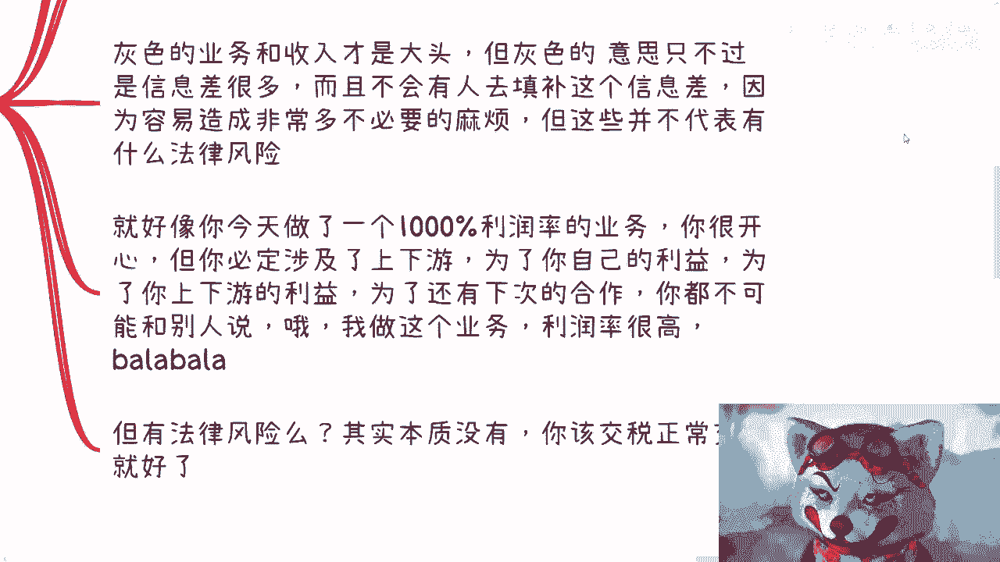

# 每次谈到赚钱，都是问有没有风险，是不是灰色？这是一种病，要治 - P1 - 赏味不足 - BV1vt4y1f7S9

好我们今天来谈这个问题，就是每次只要聊到赚钱，都会问有没有风险，是不是灰色，我跟你们讲，这就是一种病得治啊，这个这个病治不好啊，你就别赚钱了。

别去想了，好吧啊，就真的我他妈每次我觉得我都很温柔的，没有骂真的妈，否则就他妈开骂。

首先第一个就是每次谈到这个赚钱，对方都会问有没有风险，是不是灰色产业，有没有什么要注意的啊，几乎所有人我可以说啊，谁不想赚钱，谁都想赚钱，对不对，但只要真的赚钱的东西啊，我指的就是非辛苦钱的那种啊。

你真的那种赚钱的东西，真的赚钱的切入点。

你到了我觉得到了普罗大众身上，他就变成了所谓的风险啊，我就想问了啊，除了辛苦钱，我就比如说我现在问你们对吧，比如说你们以后又有人在跟你们这么说，你就问他对吧，就除了辛苦钱，你剩下赚钱的东西。

只要投入产出比高的，你告诉我哪个不灰色，哪个完全没有风险，你说出来给我听听，有没有哪个啊，我搞笑了对吧，或者反过来说，你告诉我一个你踏踏实实老老实实干活，能赚到钱的逻辑有吗，来你说给我听听看，对不啦。

哪个没有啊啊我说不好听点，你在你哪怕在公司里面跪舔，你，都有很多叫什么水下的手段，背后的手段啊，这不叫灰色吗。

对吧，一个道理啊。

你这第二点就是大部分人他不懂啊啊，你不懂不代表就是有风险。

同样的灰色它也不代表都是风险，什么意思啊，就是说我们没有接触过的业务是多了啊，没毛病啊，商业上能赚钱的也多了，但是你就这么想，你不偷不抢，不杀人放火，不涉及到黄赌毒，怎么了呢。

你怕啥呢对吧，有什么可怕的啊，然后第二点我早就跟大家说了，灰色业务才是支撑世界跟社会发展的核心啊，没有灰色业务，你怎么发展，那么奇了怪了对吧，我就这么说，你很多东西从上至下，从里到外，你要去推。

你当中没有利润，没有高利润怎么做啊，你利润比如说就他妈100%分之二，你看看谁去做对吧，你要明白支撑世界的发展，它核心不是水面上那些东西，水面上的一些东西是不可能支撑的，你们想啥呢啊。

对吧，灰色的又跟收入，他才是大头，但是灰色的意思不是说它有风险，你懂吗，他意思只不过是说他有信息差，可能很多人不知道，而且不会有人去填补这个信息差，因为容易造成非常多不必要的麻烦啊。

但是这并不代表有什么法律风险，这是两码事啊，这就好像今天比如说你做了一个阿里巴巴，或者做了一个比如说京东对吧，或者别的这种业务，上下游的业务，你发现里面的利润率很高，比如说到达1000%，你很开心。

但你要明白啊，这个1000%是你一个人，或者是一家一家公司能做的吗，不是啊，他势必是背靠大树，同时又涉及到上下游对吧，那我相信你要能有能力赚这个钱，那么你自己心里面会有一定的逼数。

就是说你为了自己的利益，为了你上下游的利益，为了还有下次的合作，你都不可能跟别人去说啊对吧，你最多比如说分享的时候，你可以跟别人聊，你说啊我们这个业务一般怎么做，怎么样怎么样，但是你会跟他说。

我们这业务业务利润率很高啊，我一单赚了多少钱，会吧，不会的呀对吧。

但是你归根结底你说有没有法律风险，他没有啊。

你该交交税，正常交税就好了，没有啊对啊，第三点。

我觉得其实99。99%的人啊，他没有看到过赚钱的业务，我给你们举个例子，就比如说我们以前一年接到过十几个电话，都是说要做资金出海或者路径的，我可以这么说啊，给我打电话的，他们相互之间都不认识。

但是他们跟我讲的故事几乎一模一样，你自己琢磨，就是就是就是思考一下，你说这个有风险吗对吧，我跟你说啊，你去判断有没有风险，其实很简单，第一你就去看这个资金来源，你能不能清楚，你别到最后是别人洗钱的对吧。

那你整个我跟你讲，你所有的资金链上面，只要涉及到账户，你全部会被冻结啊，第二这笔资金归属它交税类型是什么对吧，你比如说你今天给别人做出金入金对吧，那我就问你，你交金类型是什么，交税类型是什么，你知道吗。

你不知道，但凡你不知道，那就说明他妈的都是风险啊，但是其实就如我之前说的，为什么我跟你们讲这么多的互联网案例，就是因为互联网层面的利润率很高，为什么互联网利润率很高，就是因为他妈的他没有标准可循啊对吧。

这就像今天你问我打个比方，你问我要一个元宇宙的软件，我给你报80万，那你觉得呢你觉得多少合适呢，你不知道啊，你到哪去查啊，你到google上去搜啊，METAVERSE一个软件多少钱，搜得出来吗。

搜不出来呀，对不对，这就这就是信息差呀，就是我报80万，我觉得是合理的，我报180万也是合理的，但是我报800万可能就不合理了，但是你知道我成本多少吗，你不知道啊，对不对啊，其实一个我就这么跟你们讲。

其实是一个几百万几千万的项目，没有你们想的这么不接地气，也没有你们想的说啊，你们好像不能参与，为什么，因为参与方很多啊，这里峰峰那边分封，其实真的到你参与到的项目方的手上，也就没几个钱了。

你不要看他一个项目八九百万对吧，1000多万没有用的，纷纷很快的啊，但是你得需要从全局去看，你参与的级别越高，你拿的也就越多，就是这么个规则啊对吧，我可以跟你们讲，这种项目很多他妈的名正言顺，根正苗红。

你不要说风险了，不但没有风险，还能拿出去吹，而且还能拿出去背书。

只不过你就不能跟别人吹多少钱而已，你懂啊，这他妈就赚钱了。

啊我说句不好听的，就是就是你们要明白，在很多的既得利益者跟资本家眼里，就是很多越是这么想的人，他妈啊，就骂，都感觉他妈的侮辱，你知道吗啊其实很多时候你们接触到的啊。

我跟你们讲啊，你们真正接触到的大概率。

他既没带这么大的风险，其实也赚不到钱，为什么，因为我跟你这么讲，所有人都是这么过来的，我也是这么过来的对吧，很多时候我们线下碰到的阿猫阿狗，说背景多牛逼，项目资金多大，巴拉巴拉说半天了。

最后你真的一狠一狠心啊，你说我应joy进去了，我跟你这么说，你发现无非就两种结果，要么就是虽然他项目很大啊，我几个亿的项目啊，但是他需要你先投钱啊，好像一个几个亿的项目，就他妈缺几万块钱一样的啊。

要么就是你跟进了很长时间，一直不落地，其实我跟你讲也很简单，因为遍地大家都难啊，越是经济不好，越是难对吧，那么遍地都是狐假虎威的，能骗多少算多少，但是有一说一啊，这种项目虽然也许你赚不到钱。

你甚至还会这个被割，但是呢我也可以告诉你，同样也没什么风险，为什么，因为所谓无风不起浪，什么意思，就是狐假虎威也不可能完全胡编乱造啊，也就是说他跟你讲东西多多少少总归是存在的。

只不过就是说跟他可能没什么关系，他可能是属于一个边角料啊，就是他是道听途说或者怎么样子啊，你说完全没关系吧，也不尽然啊，但是大概率跟你碰到的这个阿猫阿狗，没什么关系，那么既然没什么关系，那就算有风险。

跟你们也没有什么关系，对不对啊，我给你打个比方，这就像什么，就像我给你们打个比方，比如说今天有个人跟我聊啊，我可能就随口提了一嘴，我说啊那个明年啊浙大啊，这边可能我们要做个项目啊。

比如说这个项目可能五六百万啊对吧，我就提这么一嘴啊，然后呢他可能出去就开始他妈的装了啊，我们很牛逼的啊，我们怎么样怎么样怎么样怎么样，但是你从我角度来讲，这个项目跟他有关吗，没有关系。

就是有他能找到合作方，没他能找到合作方，这个项目一样能往前走，没有区别的，你懂吗，就是他更像他更像很多人，就是也就是那么一听啊，但是到了他们嘴里呢，就他妈的张口就来了，你们往往碰到的都是这种人。

所以啊所以啊我们归根结底回来说回来啊，就是说，谁给我发消息啊，就是说核心来讲，不要自己去设限啊，不要觉得就是说啊这个东西跟我都没关系啊，或者说啊我去做这种项目，好像就是他妈买彩票对吧，怎么样没有。

因为你要明白你做项目赚钱，他一定是一个一个台阶走的，你懂吗，就是说你不可能说，你还没有做过10万块钱的单子，你就一下子做个1000万的，不可能的，你你这种想法就是买彩票了啊。

但是呢不是说你不能做一个10万块钱的单子，也不是说你不能做50万的单子，你做东西都是一步一步往前循序渐进的啊，但是并没有说你作为一个普通人，或者你说哦我没什么背景啊，然后你说我就不可能做到一些。

很什么高额的单子，不一定啊，没什么，因为做项目做做做商业，他都是就是天时地利人和嘛对吧，你可能运气比较好，你正好就是天时地利人和，碰到了，那你干嘛呢，你非要拒绝他，你说卧槽不行了啊。

这种利润率他妈的一定是有风险的，你不要骗我，卧槽他妈人家真的以为你是对吧，就唉就是我之前也说了，就是说很多时候你们一定要明白，就是真正，会指就是你真正不能合作的，或者你真正的。

就是说因为一些认知而失去机会的，对方是不可能来跟你讲的啊，对方还还好心的跟你说，哎那个谁啊，你不应该这么做，你这么做哎呀这个机会就没有了，人家吃饱了撑的啊，是缺了你地球不转呢对吧，所以我跟你们说。

很多时候机会丧失和所谓的失败，不是因为你什么东西不够，你也不是因为别人的原因，往往都是因为自己的原因，你仔细去想想看，真的，好吧就这么着，马上过不了几天0。4嗯。

