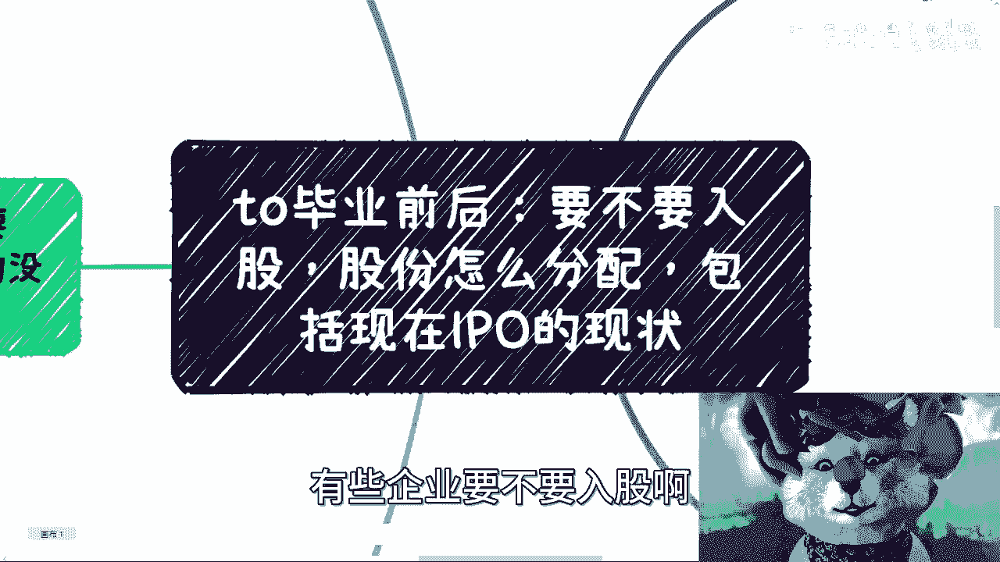
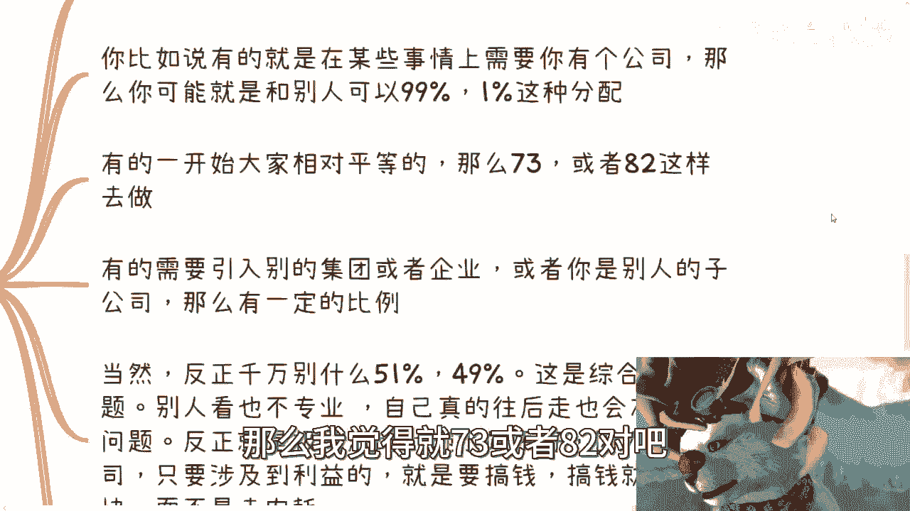
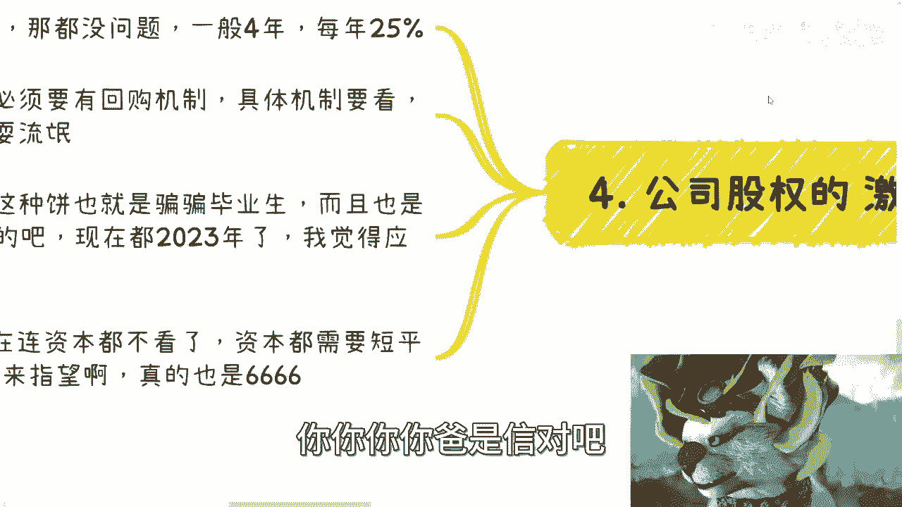
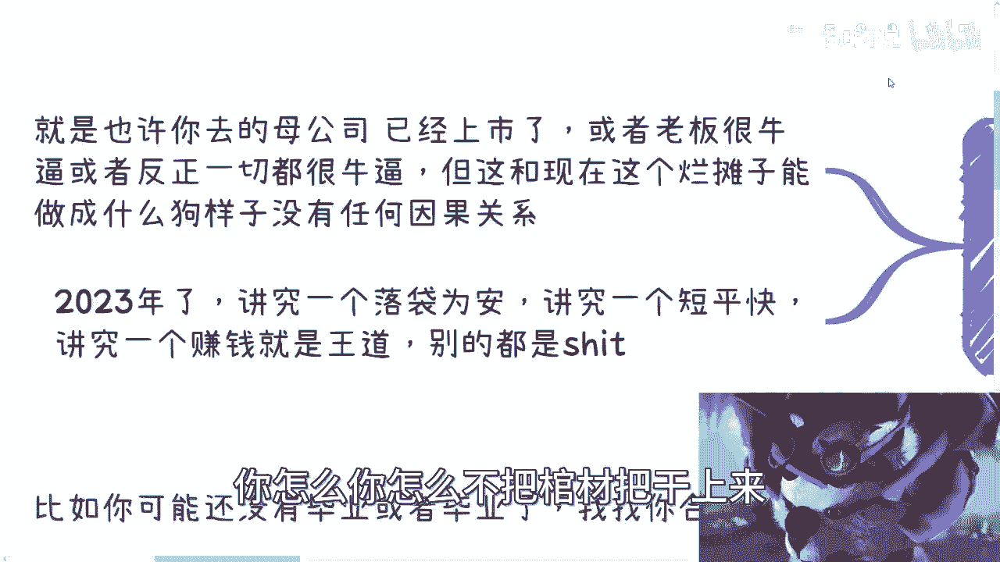
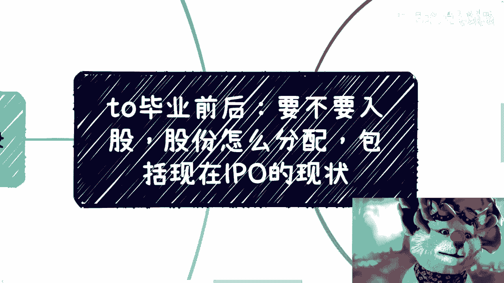

# 职业规划课程 P1：毕业后的股权、分配与IPO 🧠

在本节课中，我们将探讨毕业生进入公司时，关于是否入股、股份如何分配以及如何看待IPO等核心问题。我们将以简单直白的方式，帮助你理解这些商业概念，并做出明智的决策。

## 核心原则：关注“盘子”大小 📊

在讨论任何合作、股份或期权之前，首要原则是评估整个项目的“盘子”有多大。这意味着你需要关注项目的实际规模、潜力和与你个人的关联度，而不是纠结于无关紧要的细节。

许多人会陷入无意义的纠结，例如过分关注自己的学历或专业背景是否“有前景”。在商业世界里，这些因素与一个项目的成功潜力关联度很低。真正重要的是项目本身。

**核心公式：有效关注 = 聚焦(项目实际价值) - 分心(无关细节)**

评估一个项目时，应直接关注其核心。如果有人向你描绘一个巨大的市场蓝图，你需要反问：这个市场与我们具体要做的项目有何直接关系？我们如何从中分得一杯羹？

以下是评估项目时应关注的几个关键点：
*   **目标用户**：具体是哪个年龄段、哪个地区的人群？
*   **核心痛点**：项目旨在解决什么具体问题？
*   **现有资源**：发起方已经拥有哪些资本、人脉或技术资源？

不要被宏大的市场描述所迷惑。一个实用的方法是要求对方用“最小可行单位”来证明。例如，如果对方声称能举办10万人的活动，那就请他先成功举办一个50人的小活动作为验证。

**商业心态**：在商业合作中，保持清醒和一定的强势是必要的。过于软弱或不敢质疑，很容易成为被利用的对象。双方是平等的合作者，应基于事实和逻辑进行沟通。

## 是否入股：基本原则与建议 🤔

上一节我们强调了评估项目基本面的重要性。本节中，我们来看看关于“入股”这个具体行动的建议。

对于大部分刚毕业、缺乏经验的人来说，一个总体的建议是：**尽量不要轻易入股**。商业需要一步步积累经验，大部分初创项目风险很高，你遇到不靠谱合作者的概率也很大。

我们可以将情况细分如下：

**1. 可考虑入股的情况**
只要满足 **“不出钱”** 且 **“不担任法人代表”** 这两个前提，入股可以视为一种尝试或个人履历的包装。例如，仅以技术或劳务入股，成为公司股东（在天眼查等平台可查到），这能为你的背景增添一些商业实践经验。

**关键点**：即便如此，你也不应真的将公司视为己有。很多入股者并不了解公司的组织架构和所签署合同的具体条款。你的核心目的应是明确自己能从这次经历中获得什么实际好处（经验、人脉、履历亮点）。

**2. 需警惕的情况**
如果入股需要你实际出资，就必须极度谨慎。你需要评估这家公司是否有足够的价值，值得你投入资金。如果它只是一个“皮包公司”，那不如自己花几千元注册一个。

此外，要警惕那些不体现在明面上的、模糊的股权承诺（如口头承诺、代持协议等）。这往往意味着你只是在“换个地方打工”，甚至可能面临更大的压榨风险，因为对方可以以“合伙人”的名义提出更多要求。

**核心原则**：始终从自身利益出发，思考“我能得到什么”和“我能赚到什么钱”。避免陷入为虚幻头衔或饼而付出的陷阱。

## 股份分配：目的决定比例 ⚖️

明确了是否入股的基本思路后，我们进入更具体的操作层面：股份应该如何分配？

股份分配没有固定公式，它高度依赖于**公司的具体目的**。

以下是几种常见情况及其对应的分配思路：

*   **为满足特定条件而设立的公司**：例如，为了获得某项资质或证明合作关系。此时股份比例可以非常悬殊（如99:1），因为大家心知肚明这只是个形式。
*   **初创公司且创始人贡献相对平等**：常见的分配比例是 **7:3** 或 **8:2**。这既能保证核心决策者的控制权，又能给予联合创始人足够的激励。
*   **作为子公司或引入战略方**：当个人与企业合作时，比例通常比较悬殊（如7:3, 2:8, 9:1），这是由双方资源体量决定的。

**需要避免的雷区**：
*   **避免50:50或51:49**：这种看似“均衡”或“略有控制权”的结构，在实际运营中极易导致决策僵局和内耗，显得非常不专业。在商业上，有时极端的权力结构（如8:2）比一碗水端平更高效。
*   **明确利益，而非空谈股份**：在合作开始时，就要把利益分配说清楚，并落实到书面合同。关注当下如何赚钱，比憧憬未来的股权增值更实际。

**给新手的建议**：从小处着手，先通过具体的项目合作验证彼此的能力和信任。真正专业的合作者会和你探讨未来的股权结构、稀释计划、退出机制等，而不是仅仅纠结于初始比例。

## 股权激励与IPO：现实考量 🎯

最后，我们来探讨公司常用的激励手段——股权激励，以及那个常被提及的梦想：IPO。

**1. 股权激励**
如果公司已经上市，股权激励方案通常比较标准，例如分4年授予，每年归属25%，行权价参照市价。

对于**未上市公司的股权激励**，你必须关注一个核心条款：**回购机制**。如果合同中未明确约定公司在特定条件下（如你离职时）必须以某种价格回购你的股权，那么这份激励很可能只是一张无法兑现的“空头支票”。

**行动准则**：一切承诺必须白纸黑字写在合同里。对于“以后补签”、“明年再议”等说辞要保持警惕。

**2. 如何看待IPO**
在当前的市场环境下，IPO（首次公开募股）已经不再是资本退出的首要或可靠路径。连专业投资机构都更追求“短平快”的退出方式。

因此，如果有人以“未来会IPO”作为吸引你加入或入股的核心卖点，你需要保持极度清醒。这只是一个概率极低的远期愿景，不应作为当前决策的主要依据。

**终极判断标准**：不要被母公司背景、老板光环（如福布斯榜单等）所迷惑。这些与你们当前要做的具体项目能否成功，没有必然因果关系。你需要关注的是：
*   当前的项目方案是否靠谱？
*   利益分配机制是否清晰、公平？
*   **你能立即或短期内获得什么？**

2023年的商业环境，更讲究 **“落袋为安”** 和 **“赚钱是王道”** 。你的决策应基于现实和可预见的收益，而非虚幻的蓝图。

---

**本节课总结**：
本节课我们一起学习了毕业生面对股权问题时需要掌握的核心思维。
1.  **首要原则是评估项目基本盘**，关注实际价值而非虚幻市场。
2.  **入股需谨慎**，优先选择不出资、不担责的方式，并始终思考自身所得。
3.  **股份分配取决于公司目的**，应避免均分陷阱，强调权责利对等。
4.  **对待股权激励要落实回购条款**，对待IPO承诺要保持理性，聚焦当下可实现的利益。

记住，你的职业发展取决于你如何打好手中的牌，基于现实做出每一个扎实的选择。