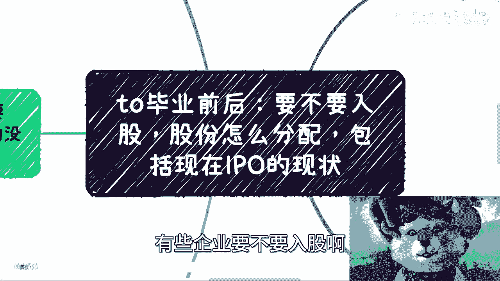
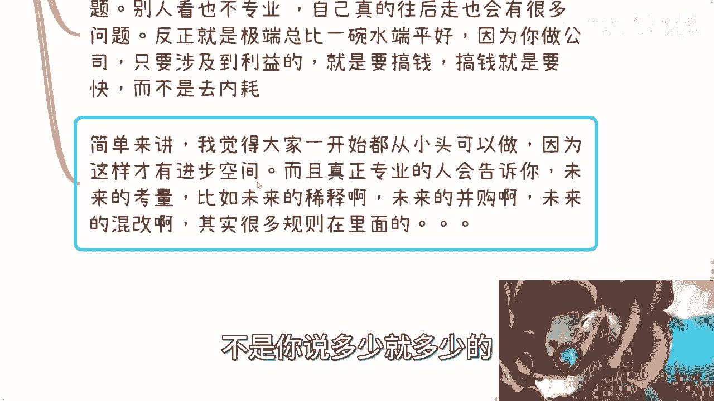
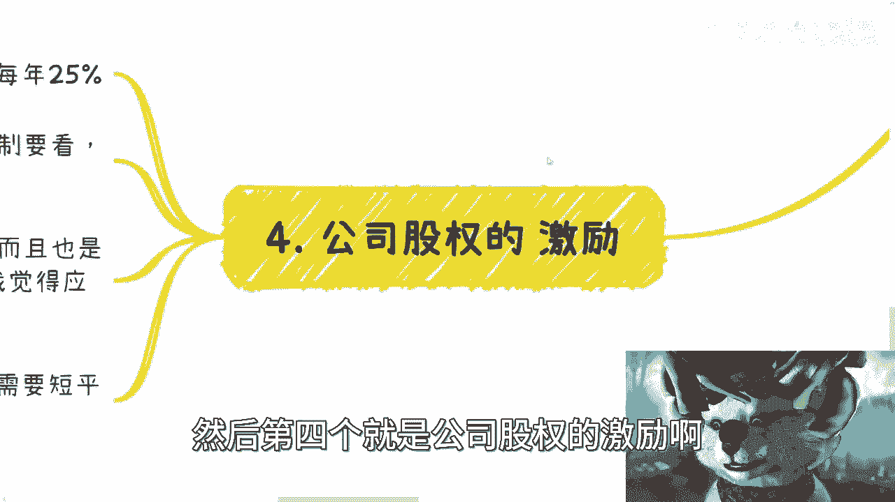
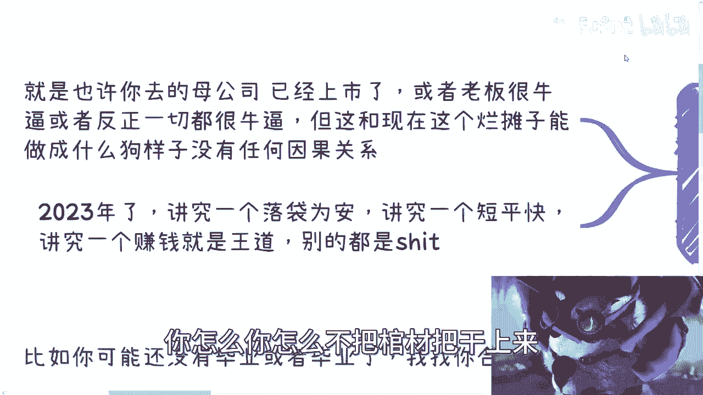

# 毕业之后去公司，要不要入股，股份怎么分配，怎么看待IPO - P1 - 赏味不足 - BV1sh4y157qq

啊大家好啊，那么这一期呢就前两天小伙伴投稿啊，说呃这个学生啊，这个毕业之后啊，有些企业要不要入股啊。

股份怎么分配啊，啊包括现在的IPO些情况啊对吧，这个呃总体说一下啊，因为里面涉及到的细节很多，大家有什么问题可以再告诉我好吧，然后大家有什么想要了解的东西，你也可以私信我，包括就是说啊副业啊。

包括其他的一些这个职业规划啊，有什么很详细的手上的牌，不知道怎么打的啊，你也可以跟我讲呃，首先第一个啊先明确一个事情，就是我们做任何事情，包括这边的股份啊。

期权啊，一定要看整个盘子多大啊。

别去纠结有的没的呃，什么意思呢，就是说嗯很多人纠结问题对吧，就包括现在就是今天还有个小伙伴私信问我，他说啊我二本对吧，调剂到什么专业，问我有没有前景，他妈的这种问题有什么好问的呢，对不对。

你二本什么专业跟有没有前景有关系不了啊，你你上清华就有前景了哈，你妈搞笑了，真的是啊，首先比如你可能没有毕业或者毕业了啊，我找你合作对吧，好我们花了很久啊，去留去聊啊，比如说我们电话线下我们聊了很久啊。

每次喝咖啡，你好我好，大家好啊，吃饭你好我好，大家好，对吧啊，然后聊几几几几分啊，甚至呢后面聊了几几开呢，还搞得大家很不开心啊，啊那么我做一件事情呢，先要看啊盘子多大，盘子如果小呢。

同时你又不是主要的执行方啊，那么少点就少点啊，当然二八开我是不建议的，六四开啊，说白了就是你开几几开不重要啊，一九开也行啊，随便你啊，但是呢你心里要清楚，就对方这种人呢就格局很小啊。

就是你可以不跟他翻脸，你也可以不跟他说穿对吧，就反正就是说以后就别合作了，对就这个人在你心里就拉入黑名单就结束了，对不对，因为不管这个人怎么样，也不管别的怎么样，反正商业上面是不行啊，格局不行对吧。

那不用浪费时间对吧，那这是第一个，第二个呢，其实股份这个事情呢也是一样的，你首先要确定盘子多大啊，你需要确定你们做的事情，盘子做的啊，你别就是搞得今天什么今天说啊，我比如说我跟你说。

吕老师说要做个呃跨境电商啊，我说谁要参与好，你们举手对吧，我说好好来来来来搞起来对吧，然后你问我盘子多大好，我扔给你一个什么什么什么叫什么，这个年度报告啊，什么市场调研啊，你们看看这市场多大。

他妈这市场大跟他妈跟他妈你有屁关系啊，对不对，我跟你们讲嗯，我要是你们对吧，有人拉我做项目很简单的，你要发给我这种东西，我就问他他妈的跟我们有什么蛋关系吗，啊你市场1000个亿怎么了呢。

我们好像分得到这1000亿蛋糕一样的，对不对，我关心这个事儿嘛，我不关心我只关心你告诉我怎么分对吧，给我画饼，是不是啊啊举个例子，就比如说你要做自媒体啊，或者跨境电商或者一个产品啊，一个服务，对吧啊。

然后呢有人跑过来了啊，跟你们说，你们跟跟跟你们做啊，让你们入伙对吧，怎么样好，很简单啊，你就问他初中年龄段几岁到几岁啊，所在地区所在全球哪个国家哪个地区啊，解决什么痛点啊，你要不解决痛点也行啊。

你就问他，那你现在有哪些资源，是已经有了哪些背景啊，还是说有哪些资本对吧，那如果有资本的话呢，哪个资本是你的爸爸对吧，或者哪个资本是你干儿子，你就说清楚，逼逼那些有的没的对吧啊。

你别你你不用来跟我讲这个东西，他妈的那个蛋糕有多大，什么样子，我我我不清楚吗，对不对，然后我跟你们讲，你们但凡去做任何一件事情啊，跟你们画饼一众忽悠没有用的呀，市场再大有什么用呢，跟你们有什么关系啊。

跟他有什么关系啊，你要问清楚他对不对，我跟你讲，你这么问他问题啊，他要是跟你讲啊，这个这个这个市场很大的这个怎么样的了，立马打入黑名单，这种人没什么好聊的啊，要用呃，另外一方面呢。

你你你要用最小单位去看什么意思呢，就比如说我告诉你们，我能办一个10万10万人的活动啊，收益在一个亿，对不对，那没问题啊，你就直接跟我讲，那吕老师OK那可以啊，你先办一个啊，你你就说你先弄一个。

弄个50个人啊，我不用10万个人，50个人对吧，收个几万块钱再逼逼，没毛病啊，对了，就这么简单的事，我跟你们讲啊，你们不管毕不毕业啊，也不管什么学历，这个毕业我跟你们讲，在商业上面一点都不关心的。

我告诉你们一点啊，你是一个人，对方也是一个人，怎么了呢怎么了呢对吧，就很多人就会觉得哎呀我不能这么强势，我不能怎么样的，我跟你们讲啊，商业上不强势，你只能被别人当软柿子捏，你只能被别人割啊。

别想着就是说因为你好像啊这个舔的很很好啊，对吧，或者好像不强势，人家就会找你赚钱，或者找你合作做梦啊，做梦做梦了，做梦都没有这种事情，我跟你讲，第二点啊，入股这个事，如果这个事呢其实很简单啊。

首先啊只要不出钱，不做法人，随便你搞啊，你想怎么搞怎么搞，爱咋地咋地啊，但是呢你从宏观角度来讲呢，要不要露娜，我跟你们讲，尽量呢别录，那为什么呢，因为饭是一口口吃的啊，商业是一天一天做的啊。

一个个项目去做的，你们大部分人是没有经验的，所以没必要一开始录入了，对你们也没什么好处对吧，所以说在这个地方我也写了对吧，毕竟大概率来讲，你们碰到的人是不靠谱的对吧，当然我们细分一下呢，是这样子的啊。

第一只要不出钱，不做法人，你录就录了啊，这没这也没啥不好的啊，当然入股这个事呢，你别当真啊，什么意思呢，就是说你就当唉，你就当给你自己包装啊，一个一个一个身份，你就别去当公司是你的啊。

我敢打赌大部分人就算入股了呢，他对公司组织架构啊，包括签过合同，什么合同他也不知道，对吧，你只要不要什么到最后什么啊，人家赚钱了，你背锅了什么把你送进去了对吧，那就行啊，我已经谢天谢地了。

这完全是两码事儿啊，你还是想好自己到底能得到什么，你知道吗啊，那就比如说我们打个比方，比如说你拿了个35万啊，我的意思是你出了三五班啊，这个你入股对吧，企业名单上面能看到你，比起查查天眼查能查到你对吧。

比如说股东啊，监视啊，那蛮好的啊，我觉得没问题啊，你这就35万呗，对吧嗯，至少出去能装个逼，对不对啊，至少看上去呢你在走正规的商业模式啊，当然啊，这个事情呢，你得要看对方企业里面有哪些东西。

是可以让你出去装逼的对吧，你要说对方也是个皮包公司，那我他妈的为什么要花个三五班去你这个公司，我花个几千块钱自己注册公司不香吗，对不对，没必要啊，我跟你讲啊，就所有人我发现啊。

就大家什么读书读了这么多年考虑问题，从来不从自己考虑来考虑问题，也不知道自己能得到什么，也不知道自己能赚什么钱，真的就是就是我跟你们说，真的这个很多人命啊，他就是当牛马的命啊，就这个样子。

嗯还有呢就是只要不体现在明面上啊，没太大意义，你比如说啊，比如说就说阿姨给出吹得天花乱坠啊，然后说什么代持啊对吧，比如说大家一起做个有限合伙啊，巴拉巴拉巴拉，我跟你讲意义不大的啊，你就是换个地方打工。

就换个地方帮这个被别人压榨啊，没什么区别的，而且呢这个这个作为一个合伙人对吧，或者说一个一个名头上的合伙人，他还能这个无底线的，我这个毫无任何的这种资金的情况，下面来压榨你，哎呀这种事情多了去了好吧。

第二个啊就是分配这个事儿呢其实很复杂啊，你比如说首先股份怎么分配，取决于你要干嘛，你知道吗，直接就公司要干嘛，这个目的性很多，你比如说啊有的就是在某些事情上面，需要一个公司。

就需要有一个需要证明你俩的关系对吧，那么你可能就是蹭一下，那么你可以跟别人是九十九一没问题的，我也跟别人注册过这种公司呢，无所谓的呀，对不对。

因为大家都是皮包公司嘛，大家都是为了达成某个条件嘛，就是啊那这是第一个，第二个呢有的一开始呢大家相对平等的，那么我觉得就七三或者八二对。

73比较多啊，73比较多，然后呢你比如说有的需要引入别的集团或企业，或者你是别人的子公司，那么你就一定按比例来嘛，你比如说73264啊对吧，九一啊对吧，都可以的，因为个人跟企业比呢。

比的比例一般都比较悬殊嘛对吧，那当然啊反正千万别什么五十一四十九啊，我跟你讲这种东西是最的，为什么呢，因为呃当然了，你说五十一四十九他有主动权吗，有的啊，51肯定大于49，这没毛病嘛，对不对。

这都知道嘛对吧，但是呢综合考虑问题啊，就是说你从资本方，从你的合作方来看，你们这公司就不专业啊，自己真的往后走呢，你跟你的COFOUNDER，就你的合伙人也会有非常多的问题啊。

而且呢就是说在商业层面你要明白记住一点，不管做什么事情了，就是你极端总比一碗水端平好，因为一碗水端平其实是所有事情都做不好的，这就像这就像你们什么都想发展到最后，什么都不精，是一个道理啊。

你要么就走极端，你还有一线生机，你知道吗啊，所以说呢就是说你做公司啊，其实做公司为什么不就为了搞钱嘛对吧，跟我说，做公司为了慈善吗，慈善也是为了骗钱啊，对不对啊，你只要涉及到利益，就是要搞钱。

搞钱就是要快啊，叫对搞钱就是要叫什么，就是要高效对吧，而不是说大家哎你你你你吵过来吵过去，大家去内耗对吧，这就不是搞钱了啊，这个就是唉这不是就就没这个命啊，但大家别去搞，简单来讲呢。

我觉得大家一开始呢从小图做就可以了啊，别去纠结，就说哎我到底付出多少，付出少啊对吧，怎么样，但是呢就是你如果真的要去一家公司，做一件事情，很简单，你把利益说清楚啊，别给我来这些有的就虚的。

有的没的什么给我股份啊，什么东西都他妈是虚的啊，你就告诉我怎我怎么赚钱啊，别逼逼啊，逼逼什么东西啊，没什么好BB合同签好，他妈的给我，最好就当下给我他妈的合同打印出来，给我给给我按好手印，又来结束了啊。

对不对，哪这么多逼逼的事情，对不对啊，呃你从小都开，从小都开始做，因为这样我觉得才有进步空间，而且真正专业的人呢会告诉你啊，未来的考量，比如说未来要怎么稀释啊，未来的怎么并购啊，对吧，那很多规则在里面。

因为我跟你们讲，由于不同的角色参与，他其实是有规定的，关键是他的这个股份比例，它有一定比例的，不是你说多少就多少了。

那么我的地球不是围着你们转的啊，然后第四个就是公司股权的激励。

股权激励这事呢就很简单，如果这公司已经上市了，那没问题对吧，你一般就是4年按照每年25%对吧啊，按照股价对吧，第二呢就没有上市的，那很简单，你合同里面必须要有回购机制，你没有回购机制，都他妈是耍流氓啊。

就结束了，就这么简单的事啊，嗯当然啊，回购机制还是那句话啊，你要白纸黑字写清楚啊，的别人忽悠两句就把你们打回去了，就什么哎呀，我们会考虑的，我们明年来补做一个补充合同，我们后年来做个什么东西。

唉都他妈是扯淡啊，都他妈是扯淡，那么那么继续来说啊，就是说这种扯淡呢基本上也就骗骗应届生啊，而且呢我觉得是56年前10年前的事情啊，你放到2023年，如果现在还有人被骗，我只能说你们太傻啊，傻的天真啊。

然后IPO这事呢，我跟你们这么说啊，现在连资本都已经不看IPO了啊，连资本都需要短平快退出了，谁来指望啊啊还他妈有人说IPO，我真的也是觉得你你你你爸是姓对吧。

那个谁啊，你爸还信那个谁啊，你那但凡不信你就别想了啊是吧。

然后嗯说到底呢，我觉得别看背景是什么，是看现在做的靠不靠谱，机制靠不靠谱，很简单啊，就是说啊也就是说你去的母公司，比如说已经上市了啊，或者这个老板很牛逼啊，跟你吹的一套一套的啊，什么啊。

什么福布斯不强对吧，什么东西啊，扶墙进扶墙出无所谓啊，就反正就告诉你一切都很牛逼，但是这些东西跟现在这个烂摊子，能做成什么狗样子，没有任何因果关系，你知道吗，就不要被这些有的没的去吸引，没有用的。

你只要关心你能拿到什么，跟你有什么关系，你知道吗，2023年了，现在的时代讲究一个落袋为安，讲究一个短平快，讲究一个赚钱就是王道，别的都是，明白啊，别来别要不要你们去问别人，不要再来问我啊。

不要再来问我，就说哎呀，吕老师，我我现在是什么专业，我现在是什么高校对吧，你觉得我前景有没有，你前期有没有他妈的看你自己要做什么，看你自己怎么样子，他妈的跟你现在什么学校有什么关系。

你走你怎么不把棺棺材板盖上了。

对吧我跟你们讲啊，我对于年轻人的定位一直是这样子的，就是我觉得我10年前我碰到过很多牛逼的人，对吧，那我觉得2023年了，现在的学生也应该有所进步，不应该再是像以前那个样子，但是我现在看到。

说实话我现在看到都是倒退的啊，不管是就是知识层面还是认知层面都在倒退啊，简直是唉也没啥好说的，好吧行吧，那这个就说这些吧，啊然后呃你们但凡有任何细节问题的，看看手上牌怎么打的。

