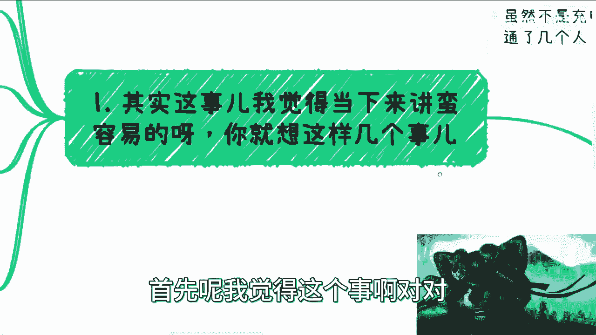
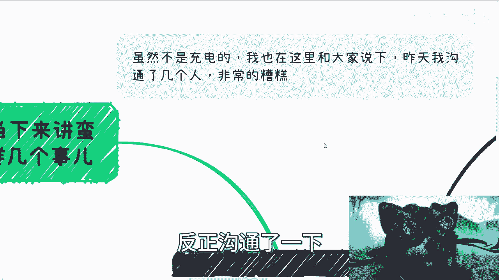
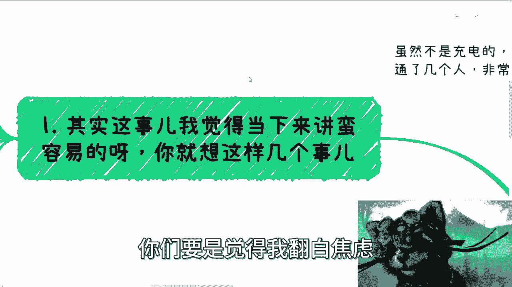
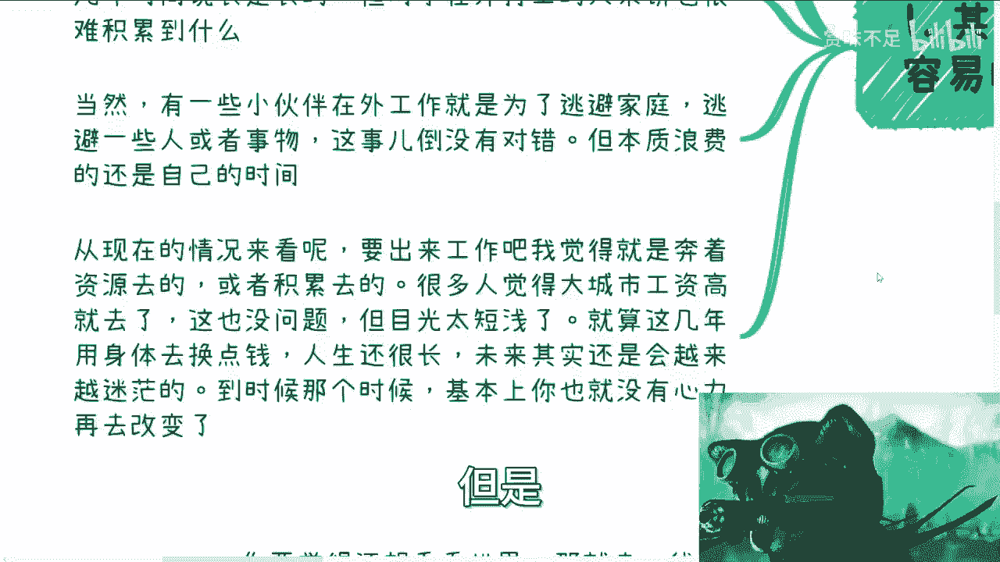
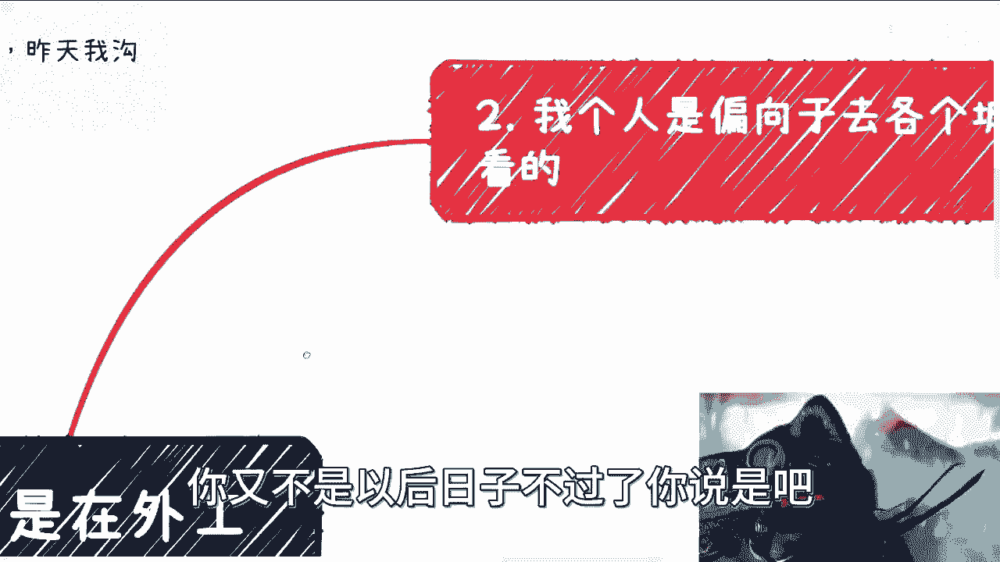
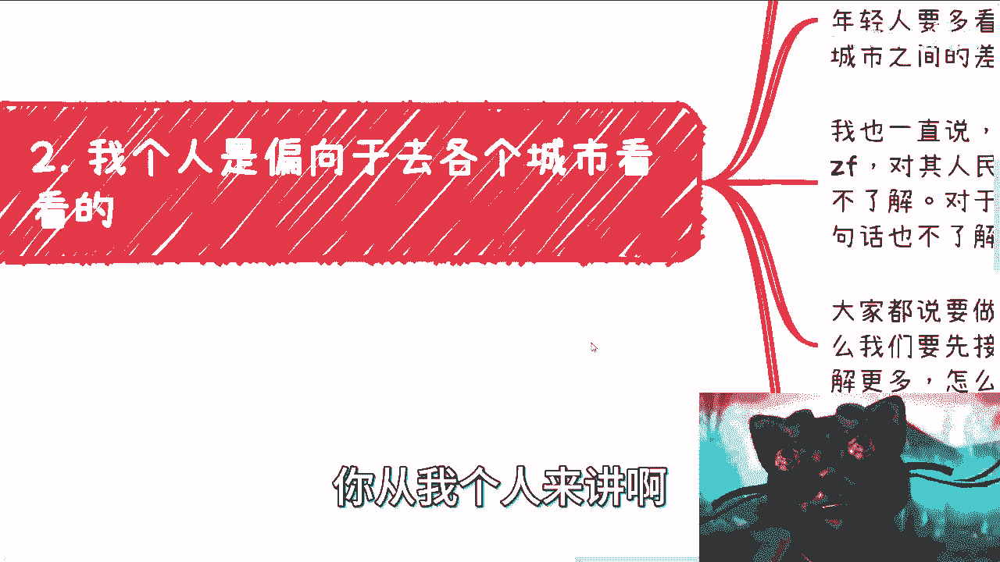
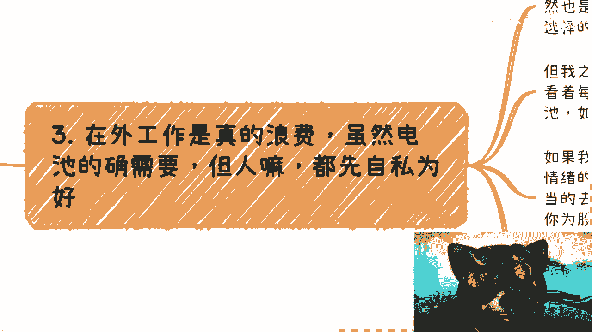
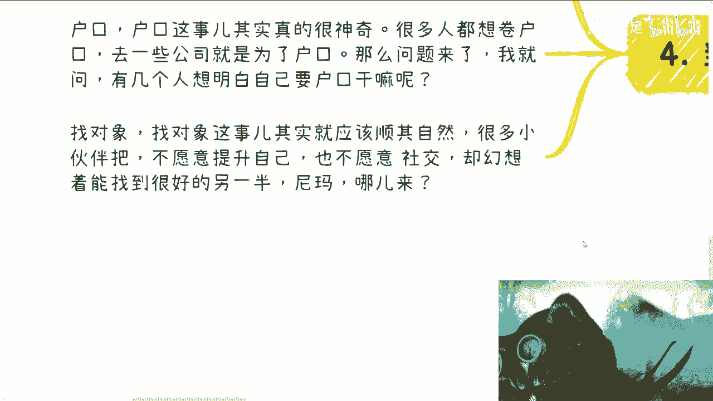

# 课程01：毕业后的选择——回家还是在外工作？ 🧭

在本节课中，我们将探讨一个毕业生普遍面临的关键抉择：毕业后是选择回家乡发展，还是留在外地工作。我们将分析当前的社会环境、个人目标以及不同选择背后的深层逻辑，帮助你做出更明智的决策。

## 概述：当前环境的严峻性

首先需要明确的是，根据与政府相关人员的沟通，当前的整体就业与经济形势非常糟糕。如果你认为这是制造焦虑，可以选择不相信，但这确实是客观事实。

面对这样的环境，我们的选择需要更加审慎和务实。

## 核心决策框架：三个关键问题

上一节我们了解了宏观背景，本节中我们来看看做决定时需要思考的核心问题。以下是三个帮助你理清思路的切入点：

1.  **你是否选择“躺平”？**
    *   公式：**选择 = 躺平 或 内卷**
    *   如果你决定躺平，就回家乡。选择躺平，就需要接受收入可能较低的现实，不要羡慕在外打拼的人赚得多。卷（奋斗）和躺（安逸）是两条不同的路，你必须做出选择。

2.  **家乡是否有资源？**
    *   代码表示：`if 家乡有产业/关系/业务（如考公途径）: 建议 = “考虑回家”`
    *   如果家庭在家乡有产业、业务或人脉关系（例如可以帮助考取公务员），那么建议你考虑回去。因为在当前环境下，在外地通过普通工作实现阶层跃升的概率很低，不如利用好家乡的现有资源。

3.  **在外工作的真正目的是什么？**
    *   必须想明白在外工作的目的。如果目的是**赚钱**，那么需要认清一个现实：单纯靠打工是赚不到大钱的。那点工资只能算是维持温饱、让你能继续作为“社会电池”运转下去的报酬，并非真正意义上的财富积累。
    *   如果目的是**逃避家庭或某些人事**，这可以理解。但需要注意的是，逃避的同时，你也在消耗自己的时间。如果这段时间没有用于任何自我积累，那本质上是一种浪费。

## 重新定义“在外工作”：目标应是获取资源

基于以上分析，我们现在需要重新审视“在外工作”的意义。

如果你决定在外工作，目标应该非常明确：**奔着资源去**。这包括商业资源、人脉资源、认知提升等，目的是为了积累。如果只是奔着一份“工作”而去，那么未来大概率会持续焦虑。

许多人因为大城市工资高而选择留下，这目光可能过于短浅。用身体健康换取几年的较高收入，但人生很长，30多岁后竞争力下降，会面临更多压力（如家庭、健康），届时改变将更加困难。这些问题迟早要面对。

## 行动建议：多看、多试、接地气

从个人角度，我倾向于建议年轻人多出去看看。中国不同层级城市间的差异，可能比中美之间的差异还要大。

以下是具体的行动建议：

*   **开阔眼界**：在年轻时有条件，应多去不同城市、不同环境看看。即使最终计划回家，在外积累几年的见识也极为宝贵。你会发现，许多看似普通的人，其赚钱能力和商业嗅觉可能远超想象。
*   **接地气**：绝大多数人并不真正了解这个国家的多样性和社会运行逻辑。长期待在一个地方，谈不上“接地气”。要赚钱、要发展，第一步是了解真实的世界。
*   **行动优先级**：做事的优先级应是“高举高打”，即先努力向上走，接触更高层次的资源和认知。如果不行，再考虑下沉市场。但了解整体面貌是基础。
*   **勇于尝试**：在合法前提下，尽可能多尝试、多接触。不要被固有观念束缚，认为某些领域与自己无关或风险过高。存在即合理，很多机会藏在常规认知之外。

## 警惕成为“电池”：工作与生活的平衡

如果在外工作仅仅是为了完成工作任务，那可能是浪费时间。社会需要“电池”，但个人不必以此为目标。

例如，观察早晚高峰地铁里拥挤的通勤人群，这种两点一线、用高强度工作换取月薪的生活，会让人思考意义何在。对于个人而言，时间与自由可能比单纯的工资数字更宝贵。

**格局**可以这样理解：假设你每月基本开销需要3000元，那么就找一份能覆盖3000元的工作，**将其视为维持生计的“保底策略”**。其余所有时间应用于为未来投资——拓展人脉、学习技能、研究商业逻辑。而不是为了当下更高的工资，去从事一份耗尽你所有精力、却无助于未来积累的工作。

因此，在外工作，应将**工作对自身情绪和时间的消耗降到最低**，完成分内事即可，不要被过度的“责任心”驱使（那是为股东创造价值）。适当“卷”，但核心要卷在**资源、社交、人脉和认知**上。

## 关于户口、买房与找对象的理性思考

最后，我们澄清几个常见的认知误区：

*   **户口**：很多人为了大城市户口签下长期“卖身契”。但你需要想清楚：要户口的具体目的是什么？如果买不起房，户口的意义大打折扣。生活的目标是幸福，而非必须绑定某些标签。
*   **买房买车**：这些并非人生幸福的必然条件。生不带来，死不带去。
*   **找对象**：这更应顺其自然。你的圈子决定了你遇到的人。如果不愿提升自己、拓展社交，却幻想找到理想伴侣，这并不现实。

## 总结与最终建议

本节课我们一起学习了在严峻形势下如何做出毕业选择。我们来总结一下最终行动建议：

*   **家里有资源有关系**：可以考虑在外学习锻炼一两年后，回家乡发展。
*   **不想回家或家乡一无所有**：决定在外闯荡，那么请明确目标：**不要做“电池”**，不要只为别人做嫁衣。你的核心任务是**积累资源、提升认知**，然后寻找机会（也许是回家乡）进行“降维打击”。
*   **想看看世界**：那么一线或准一线城市仍然值得一去。
*   **感到倦怠**：如果卷不动了，回家“躺着”也是一种选择，但前提是要有“躺”的资本，而非单纯的啃老。

最终，每个人都应为自己的人生负责，理清手上的牌，做出适合自己的选择。