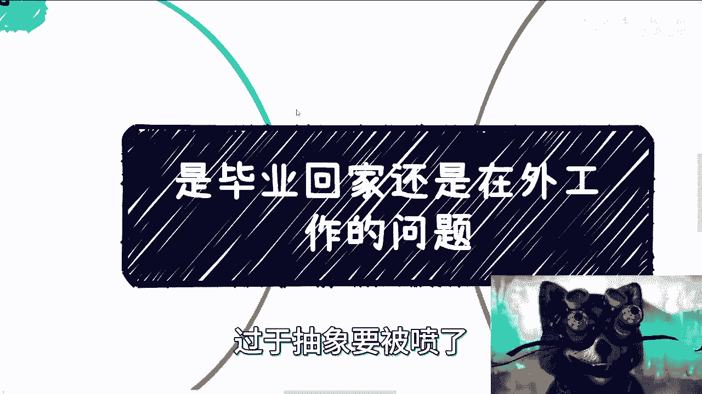
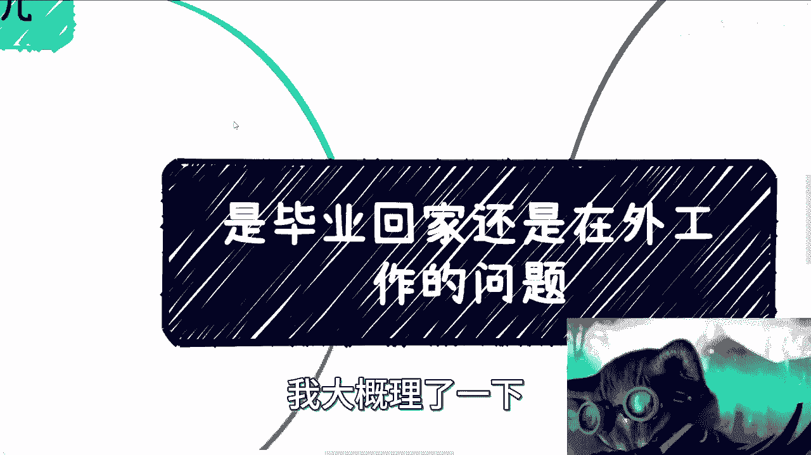
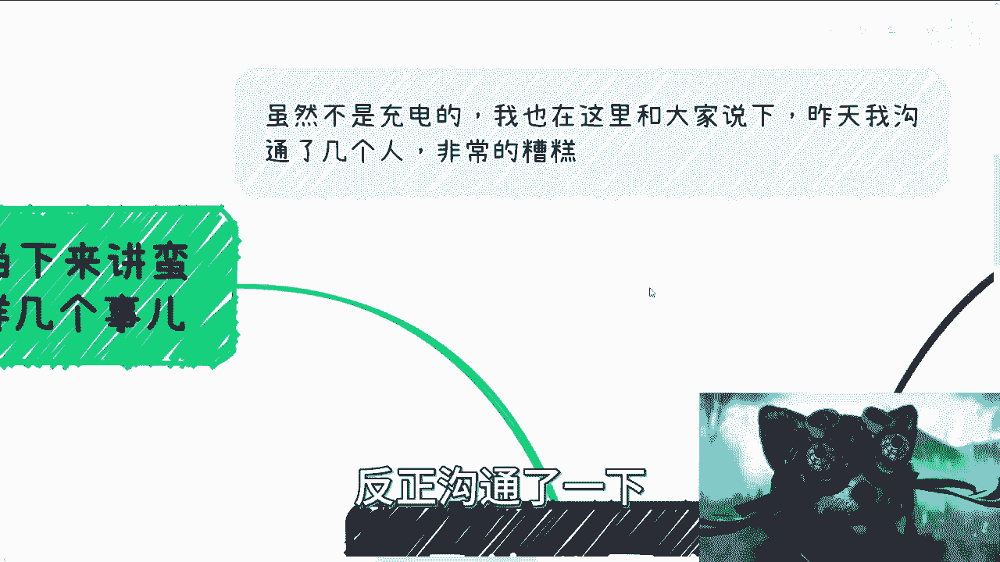
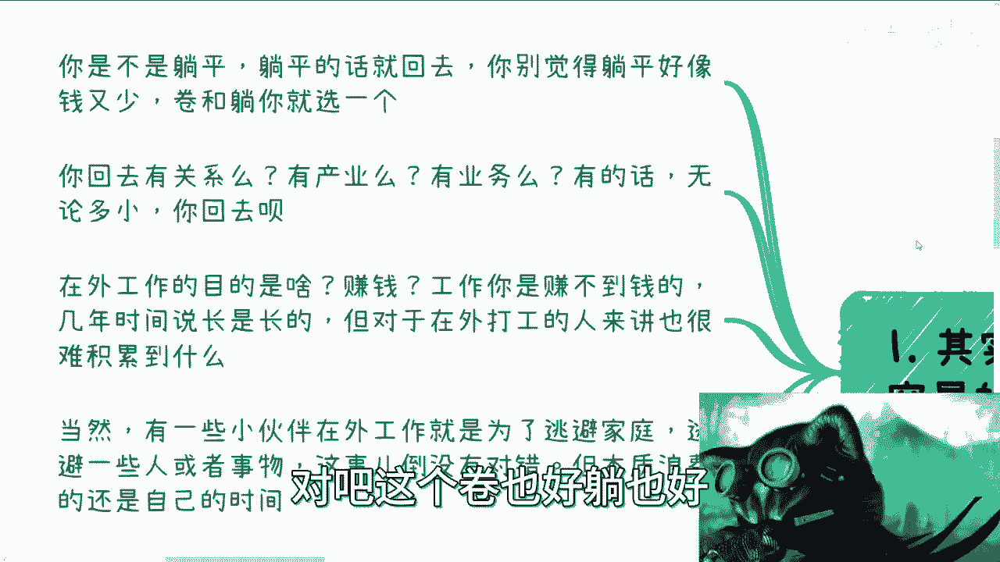
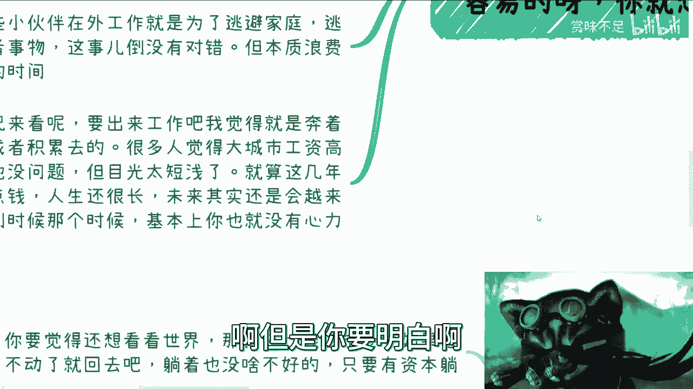
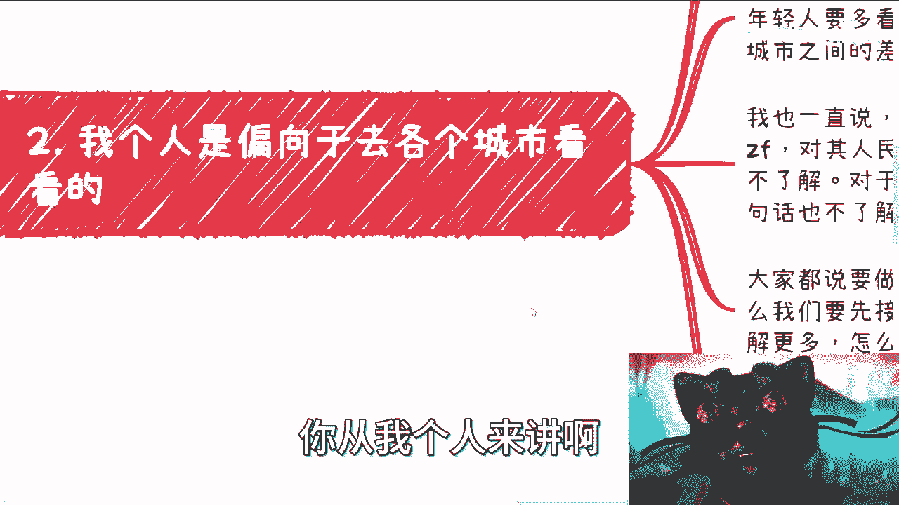
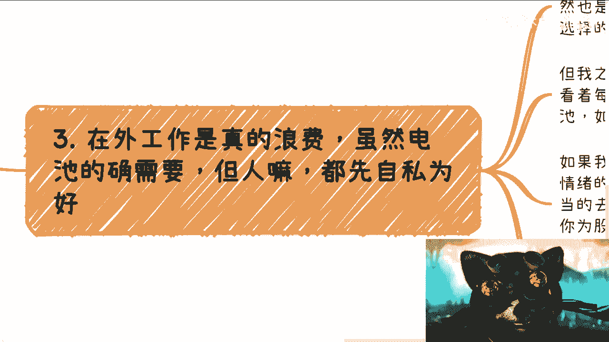
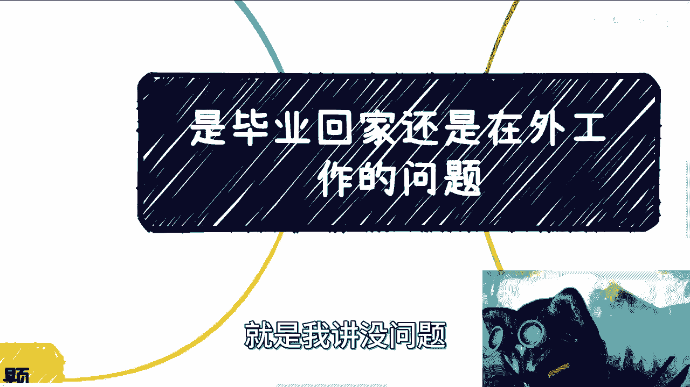

# 毕业之后是回家还是在外工作？ - P1 - 赏味不足 - BV1Yu4y1C7bn

这个大家好，今天礼拜五是吧，我今天这个装扮已经抽象的，我自己都已经忍不住憋不住了对吧。

这我看的我就觉得嗯这这个这过于抽象。

要被喷了，笑死了，真的是前两天有小伙伴在评论区问啊，就说这个毕业回家还是打工的问题啊。

我大概理了一下，我不知道大家怎么想的，首先呢我觉得这个事儿啊对对。

首先先说一下，虽然不是充电的啊，我也在这里跟大家说一下，昨天呢我跟这个一些这个政府相关的同学呢，反正沟通了一下。

我只能跟你们说，结果结果就是非常糟糕非常糟糕啊，就这么回事。

你们要是觉得我翻牌焦虑，那就不用信，我无所谓啊，首先第一点啊，其实这个事呢我觉得当下来讲蛮容易的。

你就这么想啊，第一你是不是躺平，你有没有躺平的资格对吧，你要躺平的话，你就回去对吧，你要你要躺平，你就别觉得人家赚得多，你躺平赚的少对吧，这个卷也好。

躺也好，你这个你总得选一个的，对不对，那这是第一个，第二个呢你回去有关系嘛对吧，就有产业吗，有业务吗，你像有很多跟我咨询人，他家里都是一些就有关系，可以回去考公务员啊，什么东西什么东西的啊。

我觉得无论多少，你可以点你回去呗，就说实话，因为当下这个情况，你在外面卷卷出来的概率很低的，那你还不如回去对吧，这是第二点啊，第三个就在外工作的目的是什么，你要想明白，如果你在外工作是目的是赚钱的话。

那我告诉你了，你工作是赚不到钱的，你明白吧，我就跟你讲了啊，就是你认为你赚不到钱，只是因为你的格局小，你认为那点钱叫钱，但其实本质上你要知道，那点钱根本就不交钱对吧，那根本不叫赚到钱。

那只能叫做你辛苦打工对吧，然后拿到了一些温饱费哦，为了让你未来能够继续作为电池，能够充电下去的这么一个资本而已，这不叫赚到钱对吧，那么你在外面这个漂泊，我说实话你一开始漂泊。

可能只能也就漂泊个几年嘛对吧，那你几年时间说长不长，说短不短对吧，但是对于在外的打工的人来讲，其实其实是你35年这种时间，你是很难积累出来什么东西的，你别想着说我在公司里面做，我在什么小厂大厂去做。

好像能积累出来什么东西，没概率的，你要明白以前你说有没有，我相信有的对吧，因为以前都是上升期，都是发展期对吧，都是就是说有业务的扩展期，你你有积累，但现在呢现在有啥积累啊，你跑过去，你告我告诉你。

你大概率就是炮灰，就这么简单，毛的积累啊，啊有积累的事情也轮不到你做，那当然有些小伙伴在外工作，其实是为了逃避家庭，逃避就是说就是不想回去，我觉得这个倒也没毛病啊，逃避一些人或者事物，这这没毛病。

但是啊就是你得想清楚，就是逃避归逃避，但是本质上你还是浪费的是自己的时间。

你知道吗，也就是说你可以逃避，但是你也得考虑你自己，就是这些时间到底干嘛，你不能说啊，我就是为了逃避，我爽对吧，我就是不想回家对吧，我被家控制这么长时间，怎么样怎么样怎么样，但是一样的呀。

你要是不做积累，你还是在浪费时间对吧，那么从现在的情况来讲呢，你要出来工作吧，我觉得就是奔着资源去的，就说直白一点，你就是奔着资源去的，奔着赚钱去的，奔着商业化去的，奔着积累去的啊，你让凡奔着工作去。

我跟你讲，反正对吧，我就告诉你大概率你未来反正还是很焦虑的啊，那很多人觉得大城市工资高就去了，这也没问题，但是目光太短浅，因为什么呢，因为你就算这几年用身体对吧，去换了点钱，你人生还很长啊。

你又不是说你这点钱，你30岁就财务自由了，你不可能财务自由的啊，那么未来其实还会有，就是你人生还很长，你到30岁，35岁之后，你其实会越来越迷茫，因为你到那个时候竞争力会越来越少，越来越低啊。

啊卷只会越来越卷，我告诉你没有最卷，只有更卷啊，就是到那个时候你年龄大了对吧，你你可能还有很多别的，因为我甩下这个眼睛啊，爽的一批啊对吧，就是就是你基本上到那个时候，你也没有这个心理。

你可能还得烦各种各样别的事情对吧，包括家里的呃，这个这个生老病死啊对吧，包括这个这个孩子啊，包括结婚啊，你你有很多事情了，到那个时候有的反了，你到时候还有心力去改变吗。

还有像现在年轻的时候这么大的冲劲吗，没有了啊，但是你要明白啊。

就这些事情早晚是要面临的，你又不是你又不是以后日子不过的，你说是吧。

然后这是第一第一个啊，第二个呢你从我个人来讲啊。

偏向于各个城市去看，首先我先说我自己啊，我为啥对吧，有机会去各个地方，哎我觉得我很庆幸，因为我在30岁之前，当然我现在也一样啊，就是我在我工作之后啊，我有非常多的机会受邀去各种地方，我可以告诉你们。

就是上到中央，下到各个地方对吧，也不多，也不能说中央吧对吧，就是不尾巴听举报对吧，你下到这种这种这个三四线对吧，我都去过啊，虽然就是说我可能去的也就是一些企业对吧，或者是一些这个政府单位。

但是至少我看到了很多我曾经不知道的，我也就是发现了很多不知道的东西对吧啊，那么这是第一点，第二点呢大家可以选择以后回去或者怎么样，但是我还是偏向于年轻人要多看看，就是你说你出来对吧，你过个两三年再回去。

可不可以，可以啊对吧，我一直说中国的一线，二线到N线城市之间的差别比中国，美国差距都要大，你知道吗，你要去看呐，真的这差距大到什么程度啊，就大到那种就是说我跟你讲啊，你到那种二三线城市，三三线城市。

你别看不起那种，你知道吧，怎么40多岁，50多岁大妈，卧槽，他们比你有钱多了，他们比你会赚钱多了啊，但是他们技术没你好，学历也没你高，他知识面也没你广，但不好意思，人家就是会赚钱，就是这么，怎么办呢。

好吧这是第一点，第二呢就是我也一直说，很多人其实不接地气啊，也就是说啊，你说啊口口声声说对吧啊，支持或不支持啊，喜欢或不喜欢对吧，怎么样子，但我告诉你大部分的人啊，99。9。5乘9。6乘以上的人。

他对国家，对其政府，对其人民一点都不了解，就在一个城市，就在哪怕一个小县城啊，你你可能在20多岁，30多岁一辈子都没出去过，你你你你谈个啥了解你谈个啥，接底气，你告诉我对吧，就是你对你对整个的运作。

不管是社会逻辑还是说啊，企业逻辑还是别的东西，你一律都不了解对吧，你对于人与人的差别比人与猪的差别都要加大，这句话也不了解你，你接什么地气，你跟我讲对吧，好，那么大家都说要好好要都要做好工作。

要找好对象对吧，要去赚钱，那么我们先要接地气啊对吧，你不接地气，你不去看到，不去了解更多，当然我这个地方不是说一定要去往下走啊，啊我们做任何事情，第一步我跟你们讲，优先级最高的一定是高举高打啊。

什么叫高举高达，就是我们人要往上走，水往低处流，对不对，你要尽可能的往上去走啊，然后你在就是不行啊，你退而求其次，你再往下去做商业啊，但是你了解整个这片土地上的样貌对吧，那么你上上下下都要去了解。

但是你要做商业，你要赚钱一定是要往上走的，你不能往下走的啊，你往下走很难的，我跟你讲啊，呸也不叫很难吧，就你往下走赚钱很难啊，往下走容易的很是吧啊，那么所以呢我偏向于就所有的年轻人啊。

就是有机会反正都去看看对吧，去各种地方了解了解，你只要不违法，你啥都去尝试尝试，你不要不要怂啊，你什么都去接触接触，你，就是你不要有任何东西都是那种就是固有概念，固有观念啊，这个东西跟我没关系的啊。

这个东西不行的啊，这个东西嘛好像哎呀里面这个这个我不接触的，万一被被被被抓来的吧，万一被怎么样呢，你不要有这种固有想法，就如果来说你们想想看啊，如果你们想想，就是如果这个世界跟很多人的YY的对吧。

这个脑子里面的世界一样的话，那那些人或者很多领域的东西早就不存在了，对吧，就是存在即合理，你知道吗，就早就不存在了，要么就是哦好像这辈们也不行，应该被抓的哎，那边牧也不行，应该被扫掉的啊，这边牧也不行。

好像怎么样，我跟你们讲，电视剧看多了。

啊这个是第二点，第三点呢我觉得在外工作。

如果你真的在我是为了工作，那我觉得真的就是浪费时间啊，这虽然啊对于这个社会来讲，电池是需要的，但是人嘛对吧，人家做电池是人家的事情，跟我们没有关系啊，我们从自己来讲对吧，都是以自己先为主对吧。

我跟你们讲，这就好像我在北京，南京啊都工作过大概一年左右啊，不是说每天坐办公室的那种啊，啊毕竟这个我去工作状态是我选择的，对我态度很明确的，就是我就是这种状态，你爱合作不合作，不合作，拉倒我不来。

对不对，你给我多少钱，我都不来啊，当然你要是一个月给我100万，我还是来的对吧，但我之前就说过啊，看着每天早上被推进地铁的人流，我跟你们讲对吧，我是在西二旗那边啊，这么早上啊，就是后面有人。

你们想想看七点多八点钟啊，然后后面这个这个穿着制服的这个老大妈，老大爷啊，给你往上推啊，就跟那种什么你们看过那种视频吗，很解压的，就是那种垃圾啊，一堆垃圾，然后上面有个有个有个这种啊，这个压缩机啊。

把这个一大群的这种呃本本来是能占很多面积，这种压机把它压啊，压成一个非常舒适的啊这么一个正方体，对吧啊，我跟你讲，就北京地铁就这个吊样子啊，那然后呢，你看着每天晚上11：12点还在那边排队啊。

就在我住的那个地方，就是啊等公交车回去的电池，我跟你们讲啊，我其实每天看到他们，我就在思考，我不明白我是真不明白，我如果是他们，我找不到我活着的意义是什么，就是你要说我是不是缺这点钱，不好意思。

我不缺啊，什么意思，就是你要你问我每天每天生活钱缺不缺缺，但是我不缺的是什么，我不缺的是，我不希望自己是这种什么，这么早上到晚上就完全2。1线的，我要去赚他们这点钱，或者我为了自己的温饱。

我什么方式不能做对吧，就是对我来讲，我觉得我要的就是时间，我要的就是空余的时间，别的我不用，而不是说我非要去用这种这种这么强的，这种就高强度的这种电池的工作，来换取我一个月的工资没有意义啊。

因为什么叫你就像我们说格局，什么叫格局，格局就是比如说我一个月对吧，我我的吃穿住行，我只要3000块钱，打个比方只要3000块钱好，那么我只会去找一个赚3000块钱的工作，剩下所有的时间我要为未来投资。

我要去认识更多人，我要去接触更多的东西，我要去了解更多东西，我要去了解这个社会是怎么样的，我要去了解别人是怎么赚钱的对吧，为什么，因为我不希望未来我还是这个样子，但是什么叫格局小，格局小。

就是我当下就要去卷那种工资很高的对吧，工资很高的，然后什么工作量很大的对吧，我也不管他工作量大不大，反正你工资够我高，我就去做了，那未来呢你能一直做吗，不能啊，为什么，因为你不是股东啊，你只是个电池啊。

对不了啊，如果我们在外飘飘荡啊，比如说北漂啊对吧，各种地方在外工作，我跟你们讲，我们一定要将工作对自己的情绪影响降到最低，同时能做多少算多少，适当的去卷就可以了啊，别被所谓的责任心所驱使，你有责任心。

你是为股东们赚钱，而不是为自己赚钱，那你这份责任心跟慈善做慈善有什么区别，那你索性做慈善吗，算了别赚钱了呀，做什么做什么，打什么工啊，对不对，拿什么工资了，你这种就不应该拿工资，对不对。

那很多时候很多人就说啊，他说一线城市机会多，那我就问你们什么叫机会多，工作机会多还是赚钱机会多，我跟你讲，今非昔比，现在工作已经很卷了，也没这么多机会了，而且工作本身也赚不到钱。

所以你真的要选择在外工作，我觉得我我觉得大家尽可能的出去卷资源卷，社交卷，人脉卷认知的人，然后你回到老家或者回到下沉市场去降维打击，这就是你们要去做的就这么简单，因为没有别的方法了，对不对。

当然还有些问题啊，你要觉得你还想看看这个世界，那就去一线城市啊，或者准一线城市，你还是要去的啊，我认为你还是要去的啊，然后呢你要卷不动了，你就回家躺着对吧，我觉得躺着也没什么不好对。

当然你有你要有资本躺啊啊，这种啃老的躺法我从来不赞同的啊，别别别跟你们就是你啊，你家里是你家里，你家里也别就我这么跟你讲，你家里也别指望从你身上拿到什么，我觉得就这么就这么干净。

你也别指望从他们身上拿到什么，2000就这么简单，大家活动都为自己的啊，这第一个第二个呃，我跟你讲，很神奇的啊，我户口啊，户口这个事其实很神奇啊，很多人都想卷户口，然后呢去接公司呢。

签个什么3年五年的这种什么卖身契对吧，就是为了户口，那我给你讲个搞笑搞笑的问题来了，我就问嘛，有几个人能想明白自己要户口干什么哦，你就为了拿个户口告诉我哦，我就要个上海户口，要个北京户口。

然后我就签个合同对吧，一卖卖5年，你有病吧啊我说的好听一点是什么，就是你要有个户口，可能更多的是就是为了面子，你知道吗，就是被别人PV出来，你不知道你要他干嘛，我说的不好听点，就是你要这个户口。

你以后也没钱买得起房，不好意思，对不对，有意义了没有意义的呀，就你活着是要幸福指数啊，你活着不是一定要有房，一定要有车啊，没有意义的，有意没没有任何意义的呀，你生不带来，死不带去，对不啦啊。

你找对象也是一样的，找对象这事我给你讲，更应该顺其自然，我跟你讲，很搞笑的，很多小伙伴啊，他这样子的他呢也不愿意提升自己，也不愿去社交啊，也不愿意去，就是说啊出去更好的让自己往上去走，但是呢他却幻想着。

一直能够找到一个很好的另一半，尼玛我就问哪里来啊，对吧，就是你的圈子决定了你接触的人，你接触的人决定了你最终的伴侣，你的伴侣你你想怎么滴啊对吧。

所以啊我觉得这个问题啊，这个问题我们总结一下，就是从当下这个情况来讲呢，已经跟以前不一样了，那简单来讲就是说你要是家里有关系，那你尽快回去，我觉得没必要，你可以在外面看两年学习学习回去啊。

你要觉得在外面的，或者你又不想回去的，或者你家里就是一穷二白对吧，什么都没有的，你要出去干的啊，闯的那你就好好闯啊，你闯归闯，你别当电池，你别给别人做嫁衣，就这么简单一回事儿，我觉得好吧啊，你你你哎。

这个还有小伙伴让我说一下格局这个东西，我想想啊，我回去我回头想想，这玩意有点抽象，就是我讲没问题。

我是怕我讲了，大家听不明白啊好吧，那先这样吧啊然后这个有叫什么，有自己的问题的啊，有这个未来职业规划的啊，有这个手上牌，不知道怎么打的啊，或者怎么样的，反正一样的，你们整理好，然后再甩点声。

我爽了一批对吧，就是你们整理好的啊，怎么样子让我可以私信告诉我啊，和告诉我。

