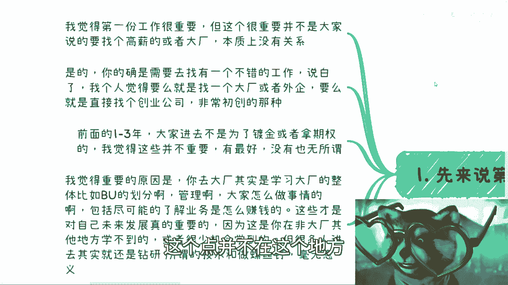
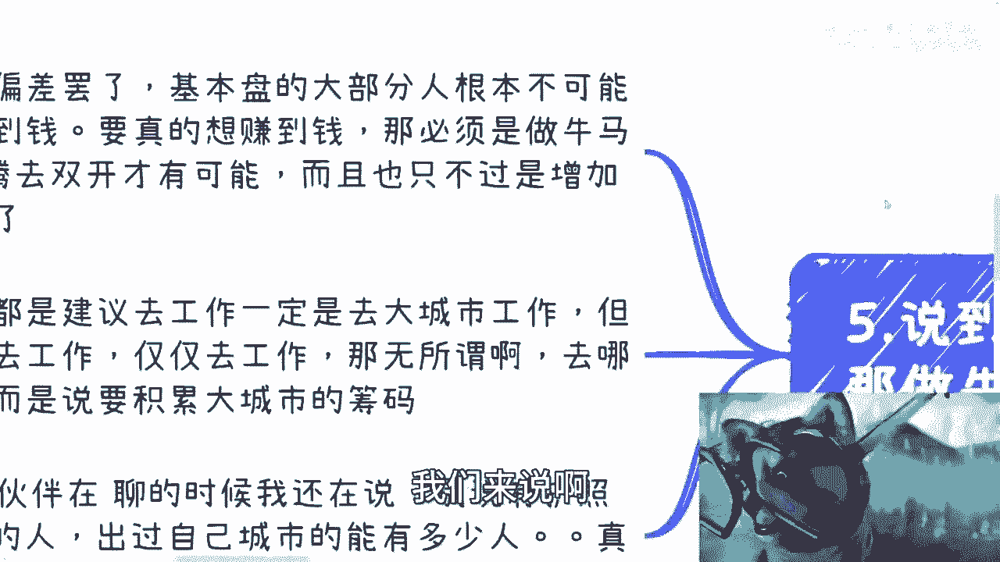

# 毕业后第一份工作和前几年积累什么最重要 - P1 - 赏味不足 - BV1214y1X7Yx

好啊这个大家好，今天是礼拜三对吧，礼拜三啊。

这个小伙伴在问啊，就关于这个第一份毕业之后，第一份工作啊，包括就是大厂啊，小厂啊对吧，去什么城市啊，前几年需要积累什么啊。

我在这个地方罗列了一下呃，首先第一个先说第一份工作重不重要啊，啊本质上来讲肯定是重要的，但是呢我觉得我的观点跟呃大家所谓的重要。

不是一件事，首先啊我觉得第一份工作肯定是重要的。

诶，我现在这个这个百分比一哎呦哈。

嗯这个很重要的，并不是说大家去找个高薪啊，或者说去个大厂啊，这个点并不在这个地方。

嗯是的，就是你的确需要去找一个不错的工作，但是呢说白了呢，我觉得我个人是觉得，就是你要么找个大厂或者外企。

就大的外企啊，你要么呢就直接去找个创业公司啊。

非常初创的那些，为什么，因为前面这个一到3年或者一到两年，大家进去呢，不是为了镀金或者拿期权的，因为首先你们这么想，我们做任何东西，都是以基本盘的大部分人群为主对吧，你就这么想，我不管你是去镀金。

真的能够镀到金或者拿到期权的，本来就是少部分人对吧，我们不能说，因为我们身边有这样的人，就幸存者，幸存者偏差嘛，这没有意义的嘛对吧，所以说这件事对很多人来讲不重要，就是顺其自然，有就有没有也无所谓。

这不是什么很大的问题，你说所有的人啊都被灌输的思想是说啊我要去，我要去这个读研对吧，我要去往上卷，我要去公司，大公司就是为了镀金的，我就要怎么样，那我就问嘛，所有人都能镀金。

所有人未来用这些金都能达到更高的一个高度，所有人都能拿到期权，都能在他IPO或者在他这个没有IPO之前，那公司回购能赚到钱，可能了，不可能的呀，对不了，所以说本质上这些事情它只是一个幸存者偏差。

偏差所导致的这么一个问题，所以我们去考虑问题，大部分人没有这个能力，他也没这个命，你知道吧，所以你不要去怎么去去想，因为你这么去想等于什么呢，等于就是明明对吧，就是有不是说你非要走这条路。

你可能在别的路上你有更好的发展，但是你非要被他PUA了，去做这条路，那就没有必要了，对不对，所以说我觉得啊我个人觉得重要的原因是什么，就是你如果去了大厂，你其实是要去学习大厂的整体的一些管理，包括划分。

比如说他的bu啊，就他的业务线怎么划分呢，怎么管理的啊，大家到底怎么做事情的对吧，包括就是说尽可能的去了解他的业务，怎么赚钱呢，对不对，因为这些东西是对你未来发展啊，对你个人发展。

对你未来个人去做商业啊，去赚钱发展都有用的一个东西，而且这些东西很有可能在你未来出了大厂之后，你在别的地方是学不到的，你只能道听图图说，你知道吗，就是你在这些公司里面，你真真切切在里面滚过一遍。

跟你在外面听说是完全不一样的事情哦，因为你在外面我跟你讲啊，就我们为什么说从一个公司跳到另外一个公司，它是从一个坑跳到另外一个坑，是因为你在外面看视频，你都是戴有色眼镜的，你都是滤镜。

你真的进去你就会发现我靠都是一群啊，我给你们举个例子，你就像什么嗯，早年的时候对吧，我在某家公司啊，我在某家公司，我当年对吧，在朋友圈还是在微博上面，我吐槽过，我说这家公司怎么样，怎么怎么垃圾。

怎么垃圾怎么垃圾啊，然后呢我们有一个在亚马逊人还在哪里呢，反正在外企的那个人，他年纪比我大，然后当时又跟我说，他说不可能，他说他说你在扯淡啊，你现存的有偏差啊，他说你你这个东西我不信了。

我绝对不相信的啊，这个国内大厂怎么可能这样子呢，对吧好过了3年他自己去了啊，他自己去了，然后一年后他就出来了啊，然后他还我，我还是很欣慰的，他还记得我当时说过这些话啊，然后他就给我发了一条微信。

他说我只能说啊，有过之而无不及，那我说是吧对吧，就是很多事情就是哪怕一你的，因为他算是一个呃就是对全局啊，宏观啊，包括各个方面都还是很有认知的人，他都会觉得我在扯淡，那说明什么，说明就是就没有办法。

就是人看问题，他就是这个样子，你知道吗，所以说呢就是说你去了大厂，或者你去了一些这个叫什么，就是说公司规模比较大的这种外企，或者怎么样子，你要去学习的是他宏观的，包括一些管理management的东西。

不是说你跑进去做技术啊，做螺丝钉啊对吧，就很多人你知道吗，就很多人是这样子的，哎我吃了大厂，我老牛逼了对吧，我要我要吸，我要炫耀一下，然后跑进去钻研所谓的技术，钻研所谓的业务没有用的。

你要你要把握机会，你进去不是当螺丝钉的，你知道吗，就大部分人进去当螺丝钉没有意义啊，对你有什么帮助吗，没有啊，你以为镀金了是就像我们刚刚说的，你真正镀完金出来能往上走的，能有几个人啊对吧。

能有几个人脉对吧，然后还有一点呢，就是我也说了，就是要么就是去创业公司，什么叫创业公司呢，就怎么乱怎么来啊，什么管理流程，什么东西不要不需要的，那你去创业公司干嘛呢，去创业公司其实是为了更贴近商业。

因为商业创业公司就因为公司小，对吧，团队小很多东西就信息差很小，这样的话就说，不管你进去做业务还是做技术还是做商务，你对全局的东西都是有了解的，你你就在这种乱的地方，这种管理非常扁平化的地方。

你才能看到本质，你才能学到东西，那除了一个创业，一个大厂以外，所有中间的包括就是说当然啊，就是说啊，所有除了你去就是能够了解他，他宏观的这个全局的一些管理知识以外，包括了解到他的业务本质以外。

所有剩下的你只要去做牛马的，就是为了去做牛马，做牛马的，你无论去哪都没有意义，我今天把你扔到google也没有用啊，你知道吗，你把把你扔到那个阿莫总，或者扔到别的地方也没有用啊，你知道吗。

就是就是有的人很聪明。

他知道他进去要什么，但有的人就是只看到表面，就是那种就是说哎呀我进了个大厂。

我老牛逼了，其实没有用啊，那首先这是第一个啊。

第二个是什么呢，就是好的工作跟创业环境，能够让你更大概率碰到不错的小伙伴。

什么意思呢，就是说你你当然就是从真从这个叫什么呃。

正常的道路来讲，你当然是为了你需要去争取，去一些不错的创业公司或者不错的大厂，为什么呢，因为你你只有在这些地方，很有可能让你碰到更更更优秀的人，也就是说这些人他能够主动的去跟你交流对吧。

让你看到更广阔的世界对吧，能够跟你分享很多你不知道的东西啊。

但是现在来讲呢，这种人可能越来越少对吧。

因为你对我来讲啊，我拥有现在的这些，Thanks，我拥有现在的这些看问题的方式，跟我以前根本是南辕北辙，就我以前毕业的时候，我不是现在这个样子啊，但这个事情跟我第一份工作很有关系。

因为我第一份那个创业工作里面的人都是神仙，首先都是神仙对吧，就是有微软出来的，有有日本这个日企出来的，有微有那个google出来的啊，然后有呃，基本上都是交大毕业的，然后就像我说的。

有那个这个google google code jam，在GCJ上面可能可能全球排名前20，前30的，然后也都是交代SM出来的对吧，因为这些人其实他们让我明白，第一他们让我知道。

其实我以前的眼界很小很小哦，然后第二就是说他们让我知道了太多，我以前不知道的东西，第三就是他们让我明白了，我要出去多认识人对吧，因为只有认识人了，我才能知道更多的东西。

第四就是虽然我没有去过google，我没有去过MICROSOFT，我没有去过其他一些地方，但是他们尽最大可能让我明白了，他们以前这个大学里面做事情是什么样子的，同时也让我在刚毕业的时候就明白了。

我跟这些人的差距是什么对吧，也就是说他们很早的让我知道了，其实世界不是我看到那个样子对吧，嗯中国也不是我看到这个样子，就是商业也不是我看到这个样子对吧，所以说他们让我明白了，就是我除了那第一。

我工作上根本卷不过人家，我就是个nobody对吧，第二就是说我必须在工作以外去找别的路，为什么，因为我卷不动了，我不找别的路，我能干嘛呢对吧，那你说你说局这个抬头望去对吧，也没关系，也没什么东西。

什么都没有，那怎么办呢对吧，这我我为什么能知道这些，就是因为我就是基本盘啊对吧，基本盘就跟我这样子有什么区别呢，要钱没钱，要资源，没资源，要什么没什么，就这样子啊，对不对，那当然就像我之前说的。

指望别人不如指望自己，什么意思呢，就是说我们能够找到一个不错的公司，或者说我们在这公司里面能碰到不错的人，这都是概率性问题，对不对，这都是概率性问题，那当然我们顺其自然努力了。

但是如果最终你没有这个这个命对吧，那么你还是要跟我一开始一样，就是我们需要主动出击，对你就像我，我最早半年就是不停地办活动，我一周办一次就不停的办，对不啦，然后我自己稍微贴点钱进去哦，活的苦一点吗。

有什么关系吗，对不了，就是我们自己认识更多的人，我们要主动出去，认识更多人，才能打开自己的视野，那那这个就指望我们自己啊对吧。

那指望别人的话指望不上了对吧。

这个是第二点，第三点呢在毕业前几年呢，我们需要跟别人聊什么啊。

我觉得本质上是这样子的，就是无论你在公司内的同事还是公司外，你认识的那些小伙伴啊，我觉得所有的切入点就是说除了打工以外，大家到底怎么赚钱对吧，就是你可以碰到一个，他现在已经自己能赚钱的人，那你去问他。

你也可以就是聚集，比如说三四个大家都没有自己赚钱了，但是大家可以聊啊对吧，比如说你有什么资源啊，他有什么资源啊，大家拼一拼嘛对吧，那你四个，那你你你你你三个人同样的三，你还能拼出个俘虏来，你是你四个三。

还能拼出个炸弹来，对不对，你你就是大家拼嘛，其实对吧，你你你四个人同样都没有，就是赚钱的路径，然后四个人去拼，如果走通了，那你四个人都有额外的收入，何乐而不为呢。

对不对，好，那么你比如说大家都做技术，做计算机对吧，那么你就去问这些计算机的同学，在外面他自己怎么赚钱呢，他是做外包呢对吧，还是说做做做一些咨询呢，还是说他完全做就跟技术没有关系的。

比如说他说我做电商做水产对啊，做做做做心理咨询应对吧，对那么你就要去问他了，哎那你为什么你一个做技术的人，你是怎么能够做水产的，你是怎么能够做做做这个心理咨询的，那么你得去了解啊。

就是他到底是有自己的关系链呢，还是说他以前有对应的这种这种积累呢，还是怎么样子，你就得去了解嘛，对不对啊，那么所以说其实这种事情都是一边聊，然后一边去蹭的，因为很简单嘛。

就是说你一开始做商业case的时候。

你总会找一些跟你级别差不多的人对吧，那么你说打个比方，我们只随便举个例子，比如说对方跟你啊是同事或者在外面认识的，他呢可能现在的确有自己的赚钱方式，但赚的不多啊，比如说每个月就那么一两千块钱对吧。

那么你就跟他讲嘛，你说哎那我能不能跟你合作啊对吧，我比如说我给你，我给你打打下手啊，或者怎么样子啊，就是你也了解了解对吧，因为你一两千块钱，他就算不愿意跟你分也无所谓，他愿意跟你分，你也分不到几个钱。

但是你在参与的过程当中，你能知道这个商业逻辑是怎么做的对吧，那么你就赚对吧，而你不能吃不上来，就说哎那个谁对吧，我们来合作啊，这对方跟你说，我每个月流水可能有那么10万，20万一两百万的。

那你怎么参与啊，你没法参与啊，对不对，所以就是饭得一口一口吃，你你你你你这种商业合作你也得一步步做对吧，你找工作不能好高骛远，你其实商业合作也不能好高骛远，对吧啊，那么第三个就是尽量呢要在积累。

就是你尽量去积累什么呢，在商业上面他自己能够自循环的，也就自己能造血，自己能赚钱的那些人，而不是打工的关系，为什么呢，因为你对你来讲，你是个牛马，你去积累更多的牛马有什么用呢，对不对，就是我们说啊。

就是说你做牛马工作，商业它是两个平行的世界，对不对，两个不同的level，那你在同一个level下面，你积累再多的人，它的量变产生不了质变的，你知道吗，就是你会发现啊，就是说如果你今天积累1万个牛马。

你至少得积累一个对商业很有很有见解，或者很牛逼的人，它才有可能让这些牛马的价值发挥到最大，你知道吗，就或者说以杠杆的方式撬动这些牛马的价值，否则这些牛马价值是1+1=1啊，或者或者是1+1=0。5啊。

就没有意义的，你知道吗，就说白了可能遇见很多人，但是你不要去局限在自己的领域，也就是说你是做计算机的，你是做水产的，你是做这做土木的，你是做化学的，你是做医疗的，无所谓好，你什么人都可以认识。

只要他在他自己的领域里面，它能够自循环或者能够赚钱就可以了对吧，然后你给这些人打号标签对吧，他是什么领域呢，你比如说我对吧，吕老师打好标签对吧，资啊政府高校企业咨询培训，数字经济对吧，办会对吧。

展会沙龙小能手对吧，然后这个叫什么创业，连续创业者对吧，然后比如说商业商业能够给大家，比如说这个帮助大家去过滤一些case啊，帮助大家做一些职业规划，你就帮帮我打上这些标签嘛，对不对。

然后未来回头打个比方，哎，你今天比如说喝酒或者跟别人聊的时候，突然人家跟你说了，他说哎我们这边可能有个数字经济的东西对吧，你这边有没有人可以做，那你就找我啊，他们找我找我，我去做，我帮你做牛。

我我当你牛马，我来做，你拿中间插不香吗，一个道理吧，对不对。

那么还有一个呢就是关于大城市的事情啊，很多人是这么说的，他说他们就是大部分人都知道，他说大城市机会多，但是我跟你们讲啊，我觉得很多人理解是有问题的，大城市的机会多。

并不是说做牛马的机会多，你明白吧，就是当然啊做牛马的机会的确也是多的，但是再多你还是牛马对吧，就这件事情不改变我们的本质啊，就你要明白大城市的机会更多指的是指什么，在大城市认识那些做商业的人，概率更多。

你想做点事情的成功概率可能更多，同时能够找到和自己合作的小伙伴概率更多，也就是说你就看吧，我们随便打个比方，你今天想做任何一件事情，什么你想出去认识点人啊，办个小活动啊，啊你想什么找一些电商的供应商啊。

对吧等等等啊，你在上北上广深跟你在宁波，你在啊，比如说合肥，你在长沙做一样吗，不一样嘛，就是你付出同样的努力，你得到的结果不一样，为什么，因为他大城市之间就有差别吗，对吧，你你你城市之间大家的认知啊。

大家各个方面就是不一样啊对吧，那同时大城市你其实可以找到很多的东西，不管是我们说的项目还是我们说的合作伙伴，还是我们说的背书，你能找到很多东西，这些是可以未来在你去做下沉市场的时候，给你做出降维打击的。

你知道吗，就是这些东西，只是你只有可能在大城市做商业的时候，积累的下来的，在别的地方积累不下来，或者说来说在别的地方积累下来，也没有什么卵用的东西啊，所以说我跟你们讲，很多人理解是真的理解错了。

所谓机会多，真的不是牛马的机会多啊。

那当然啊说到这个也有小伙伴要说了啊，这个吕老师你说的不对啊，他说这个这个大城市做牛马，这给的钱多啊对吧。

这个岗位多啊，对不对，好好好好好好好，我们来说啊。

首先这本来就是幸存幸存者偏差，为什么，因为还是那句话，基本盘的大部分人，你说大大那个大城市的岗位多，大城市做牛马给的钱多没问题啊，但是岗位多给的钱多，他还是少部分啊，你从基本盘来讲能有几个人啊。

对吧对吧，你从大家做牛马来讲，它的比例能有多少，极少极少吧对吧，基本盘的大部分人，根本就不可能通过所谓的大城市的机会，他根本就没这个机会，你知道吗对吧，要做牛马赚到钱可能的啦，不可能的呀。

你要真的想赚钱，那必须是那对普通人来讲，目前最可能的是什么，就是你一边做牛马，一边是加自己去折腾，去双开对吧，两条线并行才有可能对吧，而且你这个牛马就不是我们说那些，什么年薪一两百万，50万这种牛马。

你可能也就是10万20万的牛马，你就去做呗，对不了，你你你一样的，你你说你在北上广深，一线一线或准一线城市，找个50万100万的是难啊，那你找个10万20万的难吗，不难呀，对不了。

你生活拮据一点怎么了呢，对不对对吧，所以说你其实就大部分人来讲，他应该在刚毕业的时候就选择大学大城市，但是呢他要做的就是找一份牛马的工作，保住自己的温饱，或者让自己能生存下去。

剩下就是所有的时间尽可能的去折腾，去双开，你知道吗。

这才是唯一有可能赚钱的可能性啊，第二是什么，所以说你看啊，我一般都是建议去工作，你去大城市工作，但是你不仅仅去工作，因为仅仅去工作，那无所谓啊，你去哪都是工作，有什么好说的了对吧，你去了大城市。

你就要去利用它里面的资源，利密利用里面的人对吧，利用里面的那些那些活动，或者利用里面的各种各样的东西去积累，你在大城市的筹码，已被你回头再回到你的家乡，或者回到下层市场去做生意，去碾压，去降维打击。

这是核心，这才是赚钱对吧，你包括我今天我今天中午跟那个小伙伴吃饭，也是啊，我说我说你你别说中国现在有护照的，只有10%的人对吧，你说说看出过自己城市，就出过自己家乡，出过自己的城市。

在外面做过商业活动的能有几个人对吧，这比例少之又少对吧，所以说就是说就是说其实商业就是赚钱的点，或者说它里面是说信息差，我相信大家理论知识都非常的充足啊，都知道信息差，但是信息差是什么。

你得自己去探索对吧，你不是说我今天到一个大公司，到了一个大公司，或者到了一个大城市，我就在里面开始做牛马来，然后做了35年，然后我就觉得嗯我能够找到信息差的，你找到个屁，你知道吧。

啊我觉得这些真的就是是核心中的核心啊。

好那么我们总结一下啊，就是我们要明白小部分人第一份工作很重要啊，因为可他们是真的可以，就是用第一份工作为后续的工作去打基础，可以去走到更高的高度去发展的，但这个是小部分人对吧。

就比如说你从一个junior engineer到senior engineer，到senior manager对吧，道德VP到CPU或者到别的都可以，那么你可以为后续打工打打打基础。

或者我们称之为叫职业规划，但能有几个人，我们香港能有几个人呢，所有人如果都能够往金字塔上面走的话，那他妈就不叫金字塔了，对不对啊，这第一个，第二个就是大部分人第一份工作很重要。

是因为他能够让自己能够有更高的概率，碰到一些更优秀的人，对不对，而大部分的人毕业前，这个对我写的没错，其实大部分的人啊毕业前几年也是很重要的，当然就是你要如果在学校里面。

能够积累自己的商业关系跟商业人脉，就是你比如说大二大三就有意识去积累，那最好对吧，但大部分人其实没有这个医生，那怎么办呢，你就必须在毕业前几就就毕业后几年，就是比如说毕业后的一两年对吧。

我不管你在哪个公司做，我也不管你做什么牛马，你必须主动的出出去认识和积累，这个才是最大的，这个这个叫什么，就是能提升你自己竞争力的东西，你知道吗，而不是说而不是说就是说啊，我今天在什么公司做了牛马对吧。

我很自豪，我去了什么大城市，我很自豪，我挣了多少钱，我很自豪，没有用的，你知道吗，因为人生20多岁，你有一个高峰期很正常，但是你这个高峰期不是一直是平稳的，你后面慢慢慢慢，由于卷也好，由于人太多也好。

人由于各个经济条件也好，总大就是我们说基本盘，大部分的人都会往下走的，我真正能够一条曲线往上走，平稳往上走，人是很少很少的对吧，你就像今天呃，是今天吗，还是昨天哦，对昨天就是有个有个小姑娘来跟我聊。

那个那个叫什么，就是做公务员，还有啊，还有这个叫什么，就是呃轮岗轮岗之后定岗的事情，我说我说你要这么想，轮岗之后企业愿不愿意把你留下来，是企业说了算，不是你说了算的，这是第一点。

第二点是转岗之后那些好的岗位，其实真正好的那些岗位，被你当地的那些有关系的，或者说富二代对吧，或者说有关系，那些二代，那些那些那些那些孩子的父母，早就已经预定掉了，不是我们一般人就能够去拿到的。

就是你一旦明白这个事情，你你就要知道，就是说真正的能往上走的，能平稳往上走的，不是我们这种基本盘的，对吧啊。

所以说呢就是说你说公毕业之后，前面几年重不重要。

很重要，但是绝对不是大家想的那样说，我就是打这个冲破头。

我要去大厂，或者说冲破头，我就要去这个拿高薪，并不是哦，就是关注点不在这个地方好，一旦关注点在这个地方，我跟你讲，基本上啊，我们就说你最最黄金的该积累的那些时间点。

或者说其实这个黄金的该积累人的那些时间，基本上就浪费掉了啊。

当然并不是说你后面，比如说你现在30岁或者35岁，你就没机会了，并不是啊，只不过就是说你要真的在要做转变，就必须得花双倍或者三倍的力气去做好吧，哎呀行，那就这么着吧。

啊嗯这个我相信我应该讲的已经是蛮清楚了啊，然后嗯大家反正有这个商业层面，或者有这个啊对于自己未来职业规划啊，有这个想法的，或者看看手上有什么牌，我需要我帮你们整理打的啊。

