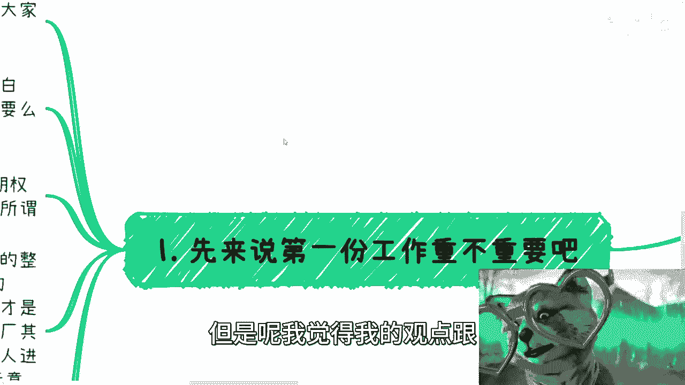

# 职业规划课 01：毕业后第一份工作与前几年，什么最重要？💼

在本节课中，我们将探讨毕业生在选择第一份工作及职业生涯前几年时，真正应该关注和积累的核心要素。课程将分析常见的认知误区，并提供清晰、可执行的行动建议。

---

## 第一份工作的重要性：超越“镀金”思维

上一节我们介绍了课程主题，本节中我们来看看第一份工作的真正意义。第一份工作本质上是重要的，但重要的原因与大众普遍认为的“镀金”或“拿高薪”不同。

首先，第一份工作肯定是重要的。但重要的点不在于找一个高薪工作或进入大厂。的确需要找一个不错的工作，但核心在于选择的方向：要么去大厂或大型外企，要么直接去创业公司。

选择这两种极端类型公司的原因如下：

*   **去大厂/大型外企**：目标不是成为“螺丝钉”钻研技术，而是学习其宏观的管理体系、业务划分（如BU-业务单元）和商业模式。了解公司如何赚钱、如何管理，这些知识对未来个人发展或创业极具价值，且离开后很难再学到。
*   **去创业公司**：目标是在管理扁平、信息透明的环境中，贴近商业本质。因为公司小、团队小，你能更全面地了解业务、技术、商务的全局运作，看到事情的本质。

除了以上两种能让你学到宏观管理或商业本质的工作，其他仅仅是为了执行任务的“牛马”型工作，无论去哪家公司，意义都不大。

---

## 积累核心资产：人脉与视野

上一节我们讨论了工作选择的标准，本节中我们来看看环境能带来的额外价值。好的工作与创业环境，能够让你更大概率碰到优秀的小伙伴。

从正常职业道路来讲，争取进入不错的公司，是为了提高遇到更优秀的人的概率。这些人能主动与你交流，让你看到更广阔的世界，分享很多你不知道的东西。

但现在，这种人可能越来越少。能否遇到优秀伙伴是一个概率问题。如果最终没有这个运气，那么你需要主动出击。就像课程主讲人早期的做法：自己主动组织活动，认识更多人，从而打开自己的视野。这件事最终需要靠自己。

---

## 前几年聊什么：聚焦“赚钱”逻辑

在毕业前几年，无论是与公司内同事还是公司外认识的小伙伴交流，核心切入点应该是：**除了打工，大家到底怎么赚钱**。

以下是具体的行动建议：

*   **向有经验者学习**：如果遇到已经能自己赚钱的人，就去询问他们的方法。
*   **与同路人共创**：聚集三四个目前都没有额外收入但有意愿的人，交流彼此的资源，尝试拼凑出可行的赚钱路径。公式可以理解为：**集合资源 > 单个资源**。
*   **由小到大参与**：商业合作要循序渐进。可以从参与别人每月流水较小的项目开始，目的是了解商业逻辑，而非立即分得大量利润。代码式的思维是：`合作规模 = 自身能力 * 可承担风险`。
*   **积累“自循环”型人脉**：重点积累那些在商业上能自己造血、赚钱的人，而非仅限于打工关系。因为同质化的“牛马”人脉积累，其价值叠加效应有限（可能是 `1+1=1` 或 `1+1=0.5`）。跨领域积累能创造不同价值节点的人脉网络。
*   **为人脉打标签**：为你认识的人打上清晰的标签（如：领域、技能、资源）。例如：`吕老师 - 标签：[政府高校合作, 企业咨询, 培训, 数字经济, 活动策划]`。这有助于在未来需要时快速匹配资源。

---

## 关于城市的选择：机会的本质

很多人说大城市机会多，但理解往往有偏差。大城市的机会多，并非指“做牛马”的机会多。

大城市真正的机会在于：

*   认识从事商业的人概率更高。
*   尝试做点事情的成功概率可能更高。
*   找到合作伙伴的概率更高。
*   能积累到未来用于“降维打击”下沉市场的项目、背书、合作伙伴等资源。

对于大部分普通人而言，选择大城市的策略应该是：

1.  **找一份基础的“牛马”工作**：保障基本生存，薪资要求不必过高。
2.  **利用业余时间全力“折腾”**：利用大城市的资源、人脉、活动去积累和尝试，开辟第二条增长曲线（双开）。这才是可能赚钱的路径。
3.  **积累“降维打击”的筹码**：目标是在大城市积累经验、认知和资源，以便未来回到家乡或下沉市场时，具备竞争优势。

---

## 总结与核心回顾

本节课中我们一起学习了毕业后第一份工作及前几年发展的核心要点。

**核心总结如下：**

1.  **对少数人**：第一份工作是为后续职业阶梯（如从初级工程师到高级管理者）打基础，但这属于金字塔尖的少数路径。
2.  **对大多数人**：第一份工作的重要性在于**提高遇见优秀伙伴的概率**，从而打开视野。如果环境无法提供，则必须**主动出击**，自己去积累人脉。
3.  **前几年的核心任务**：是**主动出去认识和积累**能带来商业价值的人脉与认知，而非仅仅满足于一份工作的头衔、地点或薪资。
4.  **交流的核心主题**：应围绕 **“如何赚钱”** 展开，通过请教、共创、从小参与等方式，积累商业感知和“自循环”型人脉。
5.  **城市选择**：大城市的意义在于其**商业机会与资源密度**，应利用此优势积累“降维打击”的资本，而非仅寻求一份“牛马”工作。

毕业后前几年是积累的黄金时期，关注点一旦错误，很可能浪费最宝贵的积累时间。转变思维，主动规划，才是提升自身长期竞争力的关键。