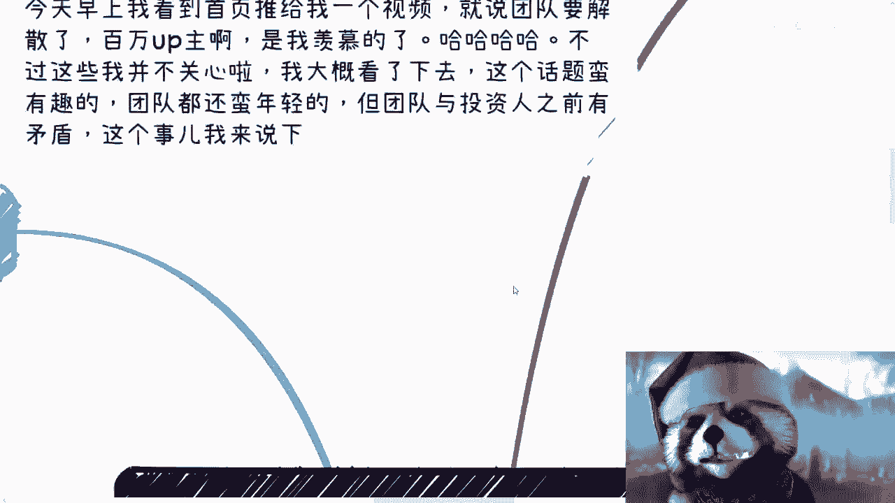

# 毕业生商业专题 P1：从百万UP主团队解散分析核心商业逻辑 💼

在本节课中，我们将通过分析一个百万粉丝UP主团队解散的案例，来探讨创业者与投资人之间常见的核心矛盾与商业逻辑。我们将重点关注责任归属、资本运作的本质以及商业思维的重要性。

---

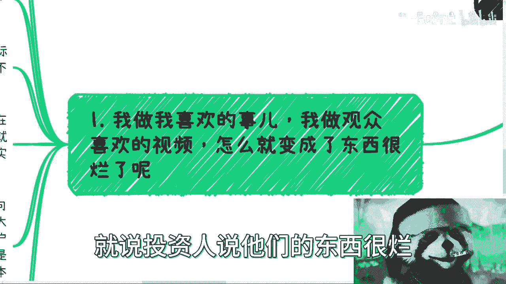

## 1. 案例背景与核心矛盾

今天早上，我在首页看到一个视频，内容是关于一个百万粉丝的UP主团队宣布解散。

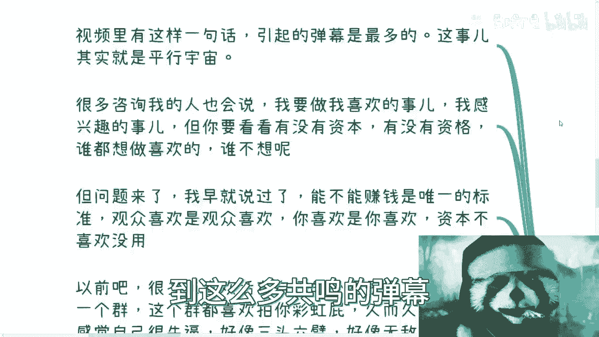

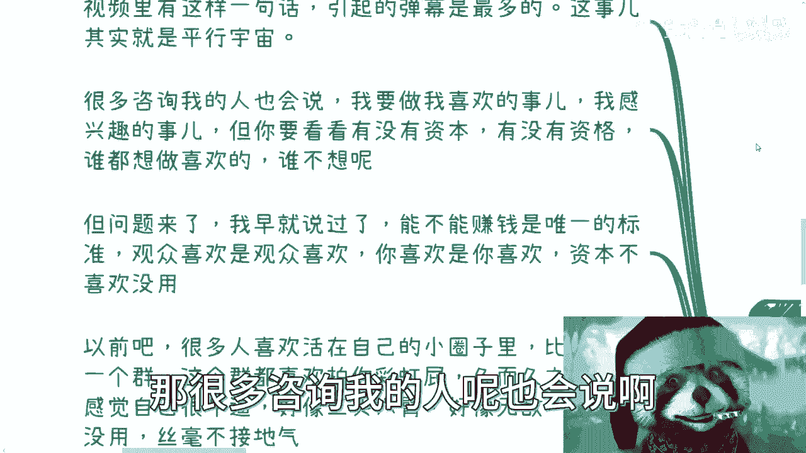

视频中提到，团队与投资人之间存在矛盾。这个案例引出了一个非常核心的商业问题：在创业项目中，**股权比例大的一方（通常是投资人）和实际运营的团队，究竟哪一方应该为“赚钱”负责？**

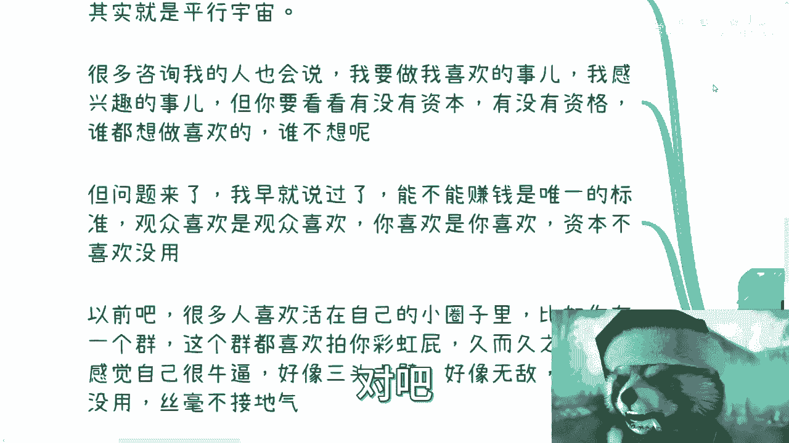

上一节我们介绍了案例背景，本节中我们来看看当事人的第一个困惑点。

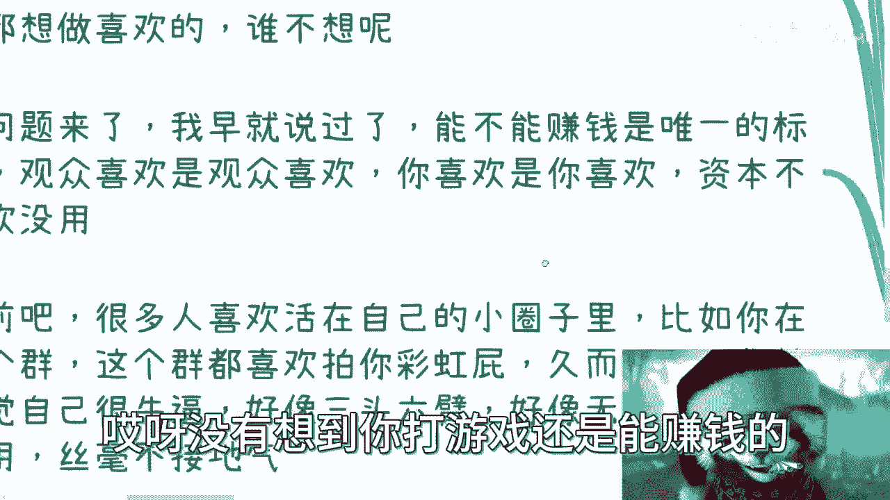

## 2. “做喜欢的事”与商业现实的冲突

当事人在视频中表达了委屈：他专注于制作自己喜欢、观众也喜欢的视频内容，但投资人却评价其内容“很烂”。

他表示对此感到伤心。视频中的一句话引发了大量弹幕共鸣，但我们需要理性看待这个问题。

以下是关于“兴趣”与“商业”关系的核心观点：

*   **兴趣与商业成功无关**：自己喜欢什么、观众喜欢什么，与“能否赚钱”没有必然联系。商业成功的唯一标准是**能否创造利润**。
*   **资本逻辑是核心**：只有愿意为你付费的“金主爸爸”（客户或广告商）认可你，才具有商业价值。没有商业变现能力的兴趣，在商业语境下价值有限。
*   **选择与代价**：如果只想做自己喜欢的事，可以选择不拿投资，自己承担所有后果。一旦接受了外部投资，就意味着要进入商业规则，为投资回报负责。

许多人活在周围人的赞美（“彩虹屁”）中，容易自我感觉良好，但一旦进入真刀真枪的商业竞争，就可能因为不接地气而失败。创业团队内部也常因此产生分歧：一方追求梦想和用户喜好，另一方只关心能否盈利。

**核心公式：商业价值 ≠ 个人喜好 ≠ 观众喜好， 商业价值 = 变现能力**

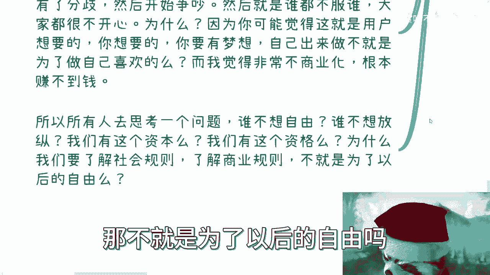

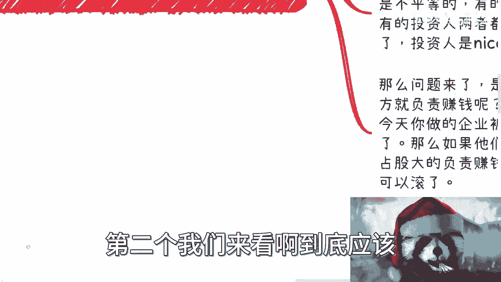

---

理解了兴趣与商业的冲突后，我们进入最关键的议题：赚钱的责任到底在谁？

## 3. 谁应该为“赚钱”负责？

这是本案当事人最感委屈的一点。团队认为自己是“来打工的”，现在没钱了，为何投资人要责怪团队？当事人也对此表示不解。

我们需要明确几个商业基本逻辑：

1.  **投资人与团队的不平等性**：从接受投资的那一刻起，双方就不是平等关系。投资人投入的是资金或资源，追求的是资本回报。
2.  **资本运作的本质**：投资人的核心工作是**资本运作**，即让投入的资本增值。他们的逻辑是：投入1块钱，要设法生出10块钱。他们并不负责具体业务如何赚钱。
3.  **团队的终极责任**：具体业务的运营、盈利模式的探索和执行，是**接受投资的团队无可推卸的责任**。如果团队认为自己只是“打工的”，不承担盈利责任，那对投资人而言就失去了投资价值。

用一个比喻：如果腾讯投资了一家公司并成为大股东，难道这家公司的团队能要求马化腾亲自来为公司赚钱吗？显然不合理。团队的价值在于利用投资，创造出超越投资本身的商业价值。

在数字人直播带货的例子中，有价值的是品牌和流量，而不是具体的主播。团队如果不能成为价值的创造者，就容易被替代。

**核心逻辑：投资人负责提供资本并期待增值（资本运作），团队负责利用资本实现具体业务的盈利（商业运营）。**

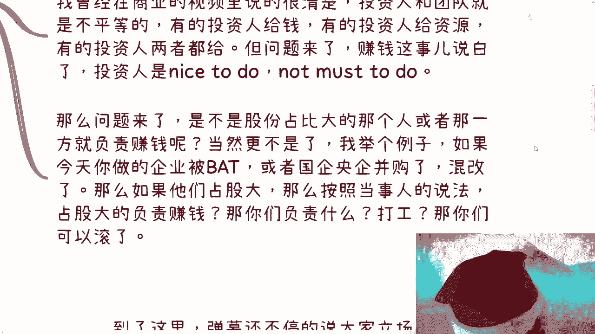

---

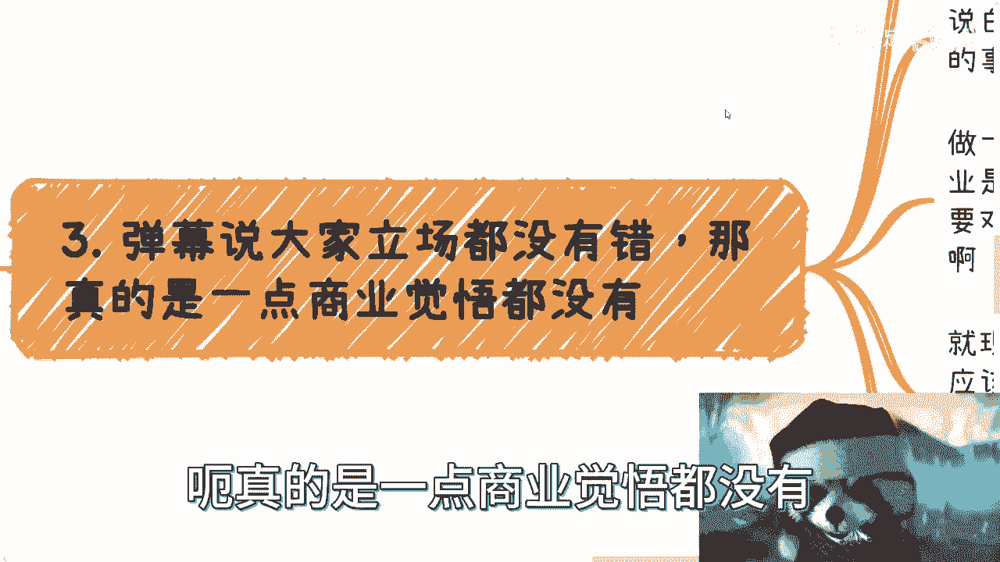

明确了责任归属，我们来看看公众对此事的普遍误解。

## 4. 商业世界没有“立场都对”

在当事人表达委屈时，弹幕很多观点认为“双方立场都没错”、“初心都是好的”。

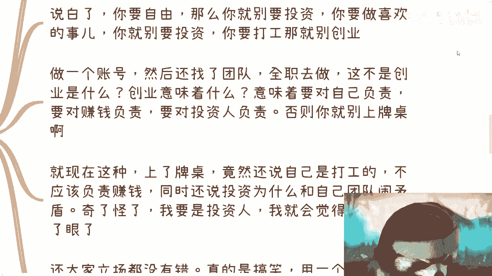

这种“没有对错”的思维在商业世界是危险的。商业活动遵循严格的规则，尤其是当你拿了别人的钱。

*   **接受投资即上牌桌**：组建团队、全职运营一个账号，本质上就是创业。接受投资意味着你坐上了商业的牌桌，必须遵守商业规则，为结果负责。
*   **权利与义务对等**：不能一边享受投资带来的资金（如偿还贷款、维持团队运营），一边又拒绝承担赚钱的商业义务，只想“做自己喜欢的事”。这对投资人不公平。
*   **商业世界的可信度**：商业生态环境的基础不是“可信”，而是“利益”和“契约”。觉得商业环境应该充满温情和信任，是一种天真。

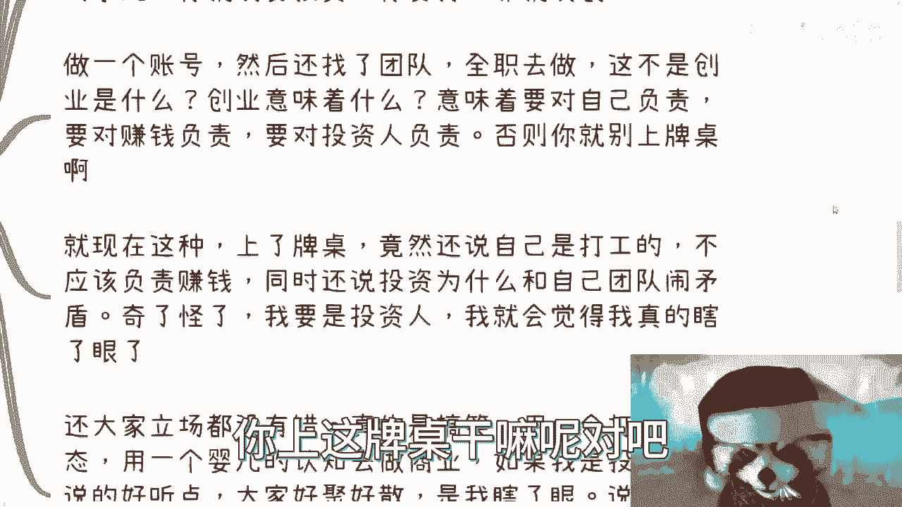

用“打工者心态”和“婴儿般的认知”去从事商业活动，对投资人而言可能构成一种误导甚至欺骗。商业合作破裂时，谈“立场”和“初心”是苍白的，核心是看是否履行了契约责任。

---

那么，正确的商业实践路径应该是怎样的？

## 5. 商业思维需要早期积累与试错

很多商业上的认知和思维无法一蹴而就，需要在实践中，尤其是早期、盘子还小的时候去积累和试错。

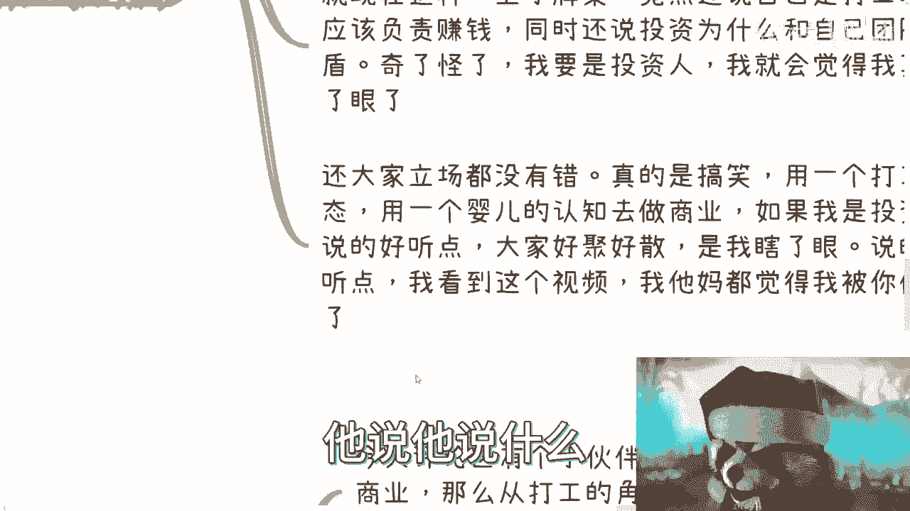

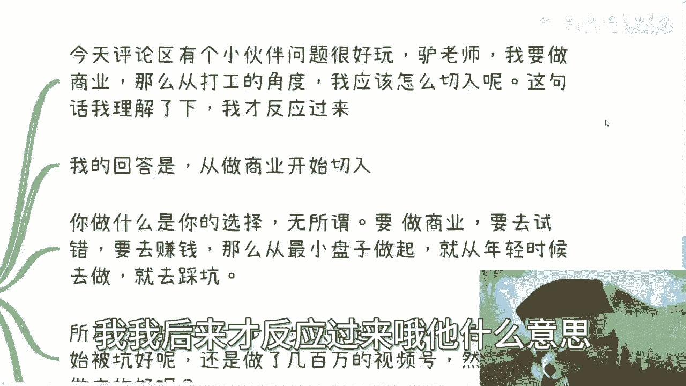

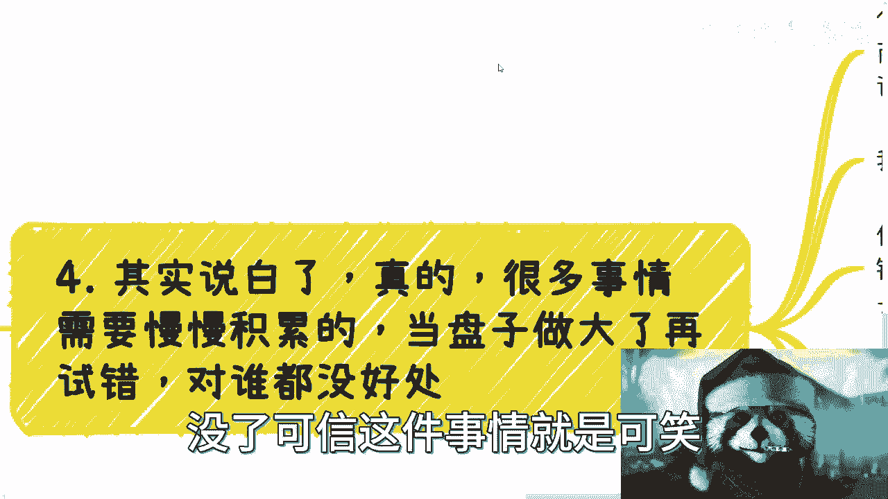

以下是关于积累商业经验的关键点：

*   **实践是唯一途径**：想学商业，就必须从实践开始。无论是打工、创业还是其他形式，目的是获取真实的商业经验。
*   **越早试错，成本越低**：在年轻、项目规模小时经历失败、踩坑，付出的代价远小于功成名就或盘子做大后再遭遇重大挫折。本案UP主虽然积累了百万粉丝，但可能缺乏真正的商业思维积累。
*   **积累什么**：真正的商业积累，是从爱好者转变为具备商业思维的人。这包括学习利用资源、建立护城河、与投资人有效沟通、探讨商业模式，而不仅仅是做好内容。

例如，组织活动失败不重要，重要的是通过实践（如用免费内容吸引用户，构建漏斗模型）获取了经验（EXP）。经验值永远比停留在空想有价值。

**核心认知：商业经验值（EXP） = 持续的实践 + 复盘总结， 早期试错成本 < 后期失败代价**

---

最后，我们探讨一个普遍存在的认知误区：战略短视。

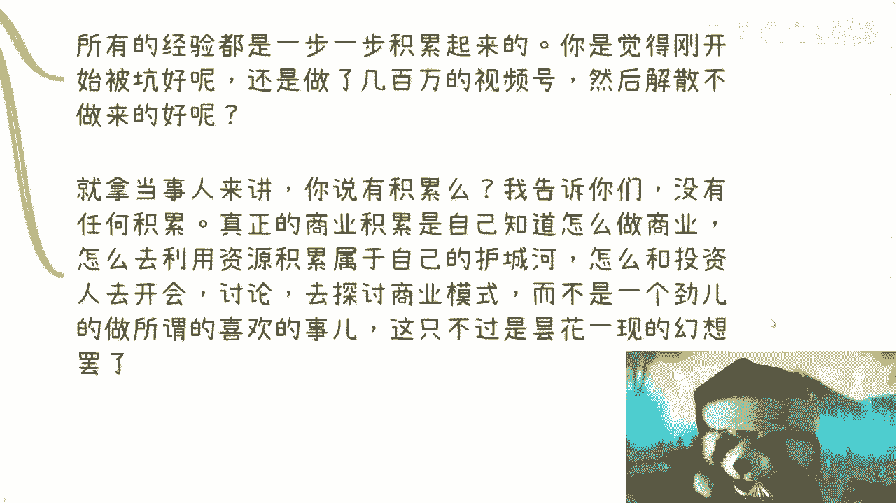

## 6. 避免战略上的短视

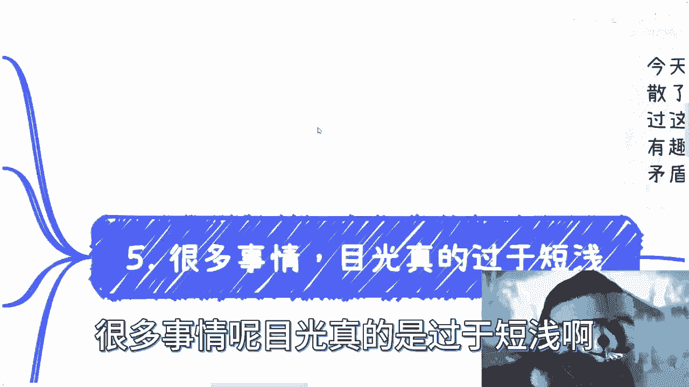

本案也反映出一种目光短浅的战略思维。例如，有人认为在大厂打工十年就能退休去做喜欢的事。

这种想法的问题在于：

*   **低估不确定性**：假设未来十年一帆风顺，是一种不切实际的预期。
*   **混淆收入类型**：打工赚的是“辛苦钱”，即便年薪可观，扣除生活成本后积累的财富，可能远不足以支撑所谓的“退休”和后续的梦想实践。
*   **战略优于战术**：在商业中，**方向（战略）远比努力（战术）重要**。一件事做得再好（如视频内容精致），与它能否长远、能否做大、能否盈利，没有必然因果关系。

我为这个优质账号的解散感到惋惜。最令人惋惜的不是失败本身，而是双方可能都没有从这次合作中获得关键的商业思维成长，最终仍是“鸡同鸭讲”。矛盾常源于一方想“把事情做好”，另一方想“赚到钱”，两者目标并不自动一致。

**核心总结：战略（方向）> 战术（努力）。 商业成功 = 正确战略 × 高效执行， 而不仅是把事情做好。**

---

## 课程总结

本节课中，我们一起学习并分析了百万UP主团队解散案例背后的商业逻辑：

1.  **兴趣与商业分离**：个人喜好不等于商业价值，变现能力是唯一标准。
2.  **责任归属清晰**：投资人负责资本增值，团队负责业务盈利，这是接受投资后的核心契约。
3.  **商业不讲温情**：商业世界遵循规则与契约，“立场都对”的思维不可取。
4.  **实践出真知**：商业思维需在早期实践中积累和试错，越早成本越低。
5.  **战略决定成败**：选择正确的方向比单纯的努力更重要，要避免战略短视。

希望本案例能帮助你理解基本的商业规则，在未来的职业或创业道路上，多一份理性，少一份天真。