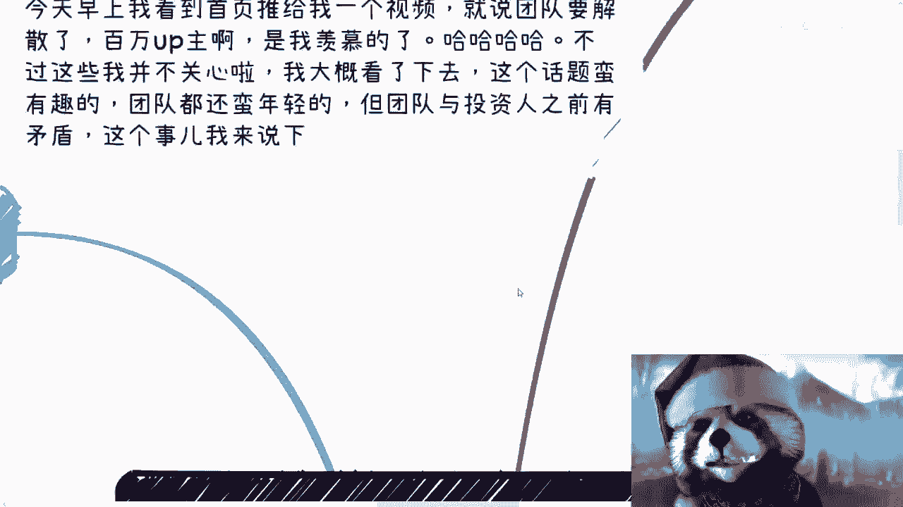
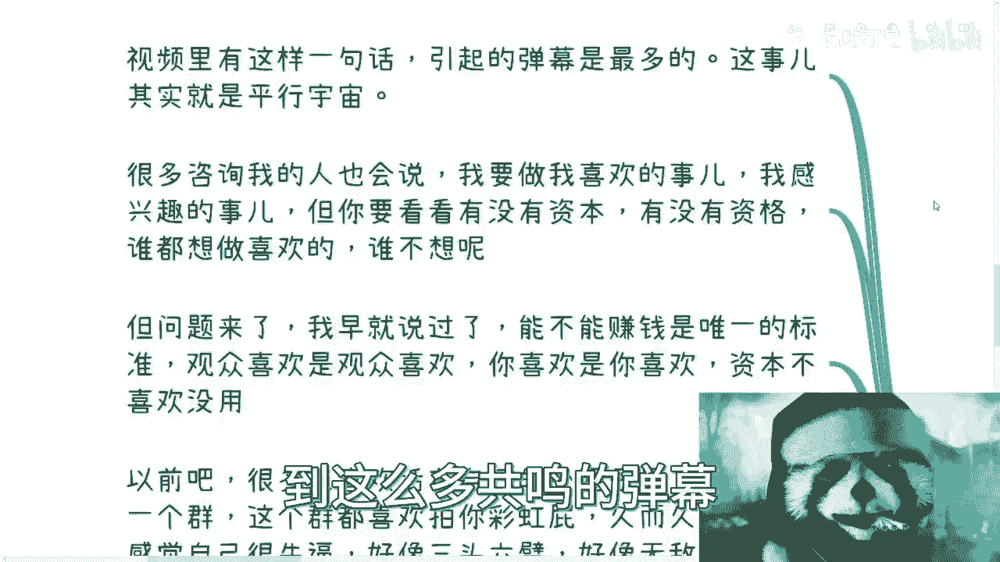
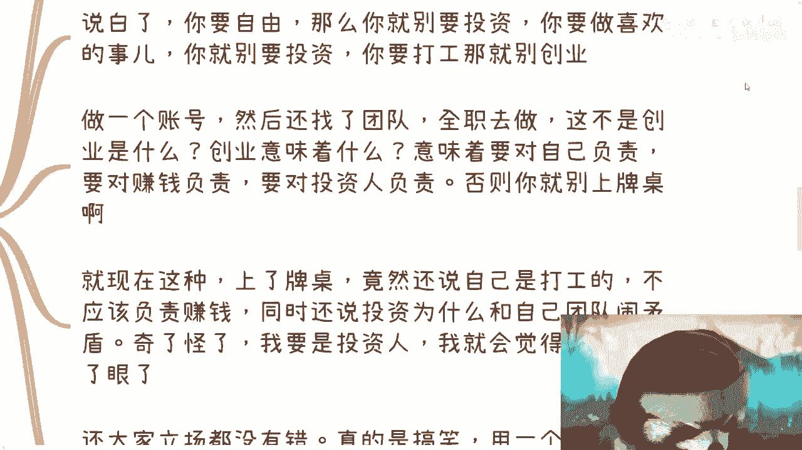
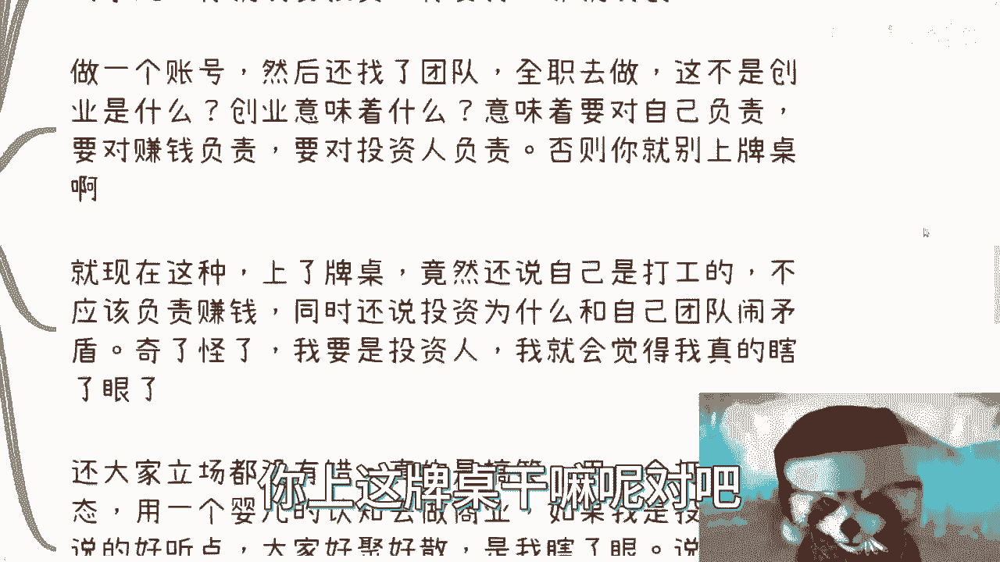
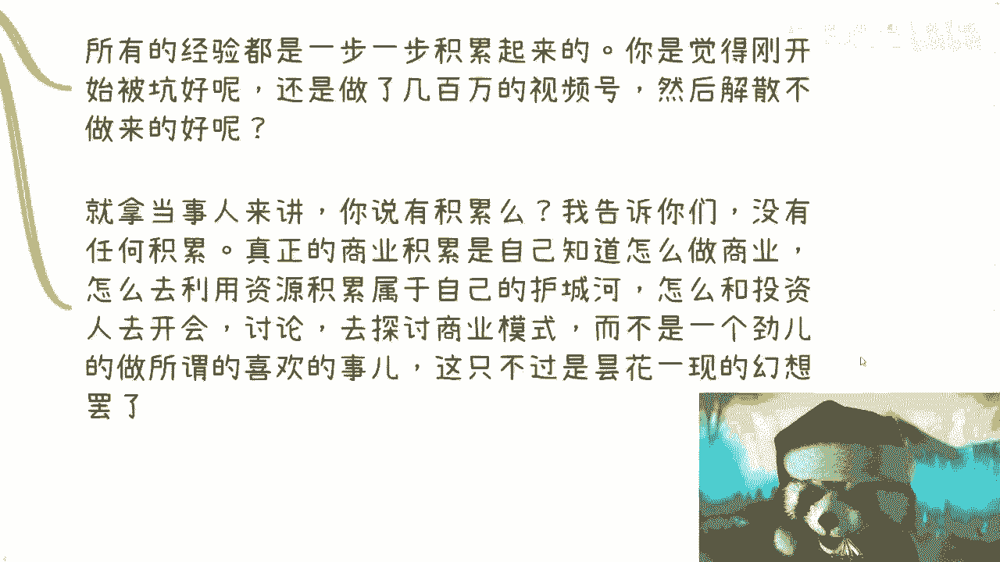
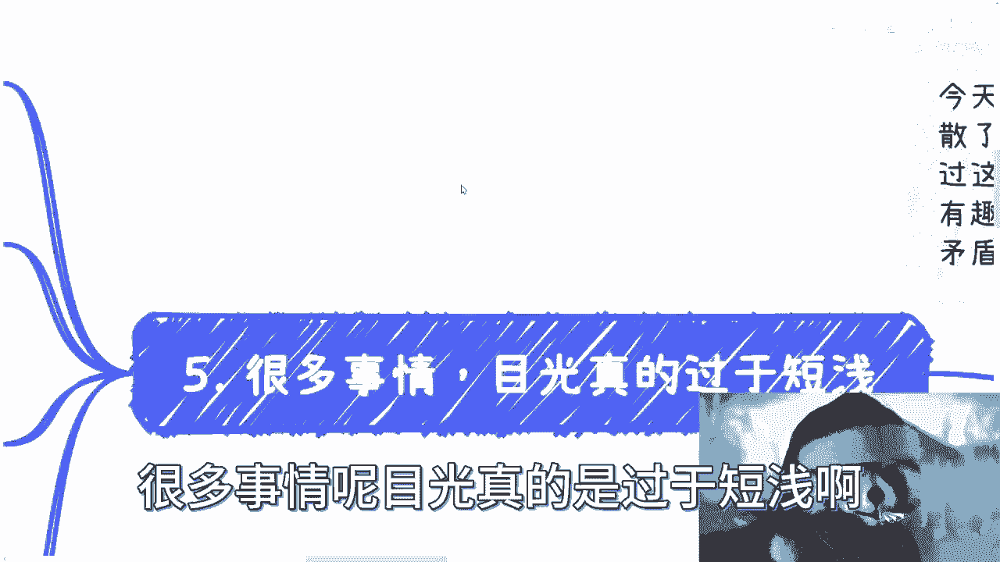

# 毕业生商业专题：从百万up主团队解散来分析下商业逻辑 - P1 - 赏味不足 - BV1cr4y1Z7XV

好大家好啊，那么今天对吧，来讲个比较有趣的话题啊，这个早上看到一个视频嗯。

早上看到首页推给我个视频是这样子的，就说团队要解散了，而且是个百万up主啊，有一说一是我羡慕的对吧，这个不过呢我跟你讲这些我也不关心啊，但是我大概看了一下，看了七八十%吧，这个话题呢蛮有趣的啊。

团队也还很年轻啊，但是从这一次解散的这个视频当中来看呢，就是团队与投资人之间呢有些矛盾啊，我打错了无所谓啊，这个事儿呢我觉得蛮好的，我开来说一下啊，呃简单来讲是什么呢，就是说你们作为创业者啊。

或者说商业做商业的啊，和投资人之间股权比例大的啊，这就是当事人投资人和股权比例大的，他究竟哪一方应该去赚钱，或者究竟哪一方应该去为赚钱负责啊，我们来看看啊，唉这个是一个非常有意思的啊一个话题。

首先啊我们来看第一个啊，他说呃，当事人呢在视频里面有提到过这么一个东西，他说我呢做我喜欢做的事啊，我呢做观众喜欢的视频啊，呃怎么就变成了这个东西很烂对吧，他当时也表达过，就说投资人说他们的东西很烂。

他表示很伤心啊，很伤心，而且看得出很伤心啊，没毛病啊，那我们来看一下啊，视频里面有这样一句话啊，那么引起来了弹幕的共鸣是最多的啊，我跟你们这么讲吧，这个事呢就是平行宇宙呃。

你说我是不是很体谅这个up主呢，我也体谅的，但是我看到这么多共鸣的弹幕。

我只能说他妈的事太多，没办法啊，那很多咨询我的人呢也会说啊。

我说我他说我想做喜欢的事啊，我感兴趣的事，然后呢他说怎么样怎么样啊，说半天啊啊也有很多人呢，就是因为我不是也跟大家说嘛对吧，你们可以整理出来有什么牌对吧，有什么这个背景，有什么技能对吧。

以及未来想怎么做啊，我们我可以帮你们做做职业规划啊，做做这个商业上到底怎么做法，那很多人呢就开始整理，整理完了呢，发给我之后呢，我看了一眼，反正简单来讲就是说呃他意思就是吕老师，我什么都没有啊。

你看看怎么搞法，卧槽那么无中生有，还是你们牛逼啊，这个但是呢我跟你们这么讲啊，就是所有的事情这些事都没问题，但是你要看还是那句话，你活在这个世界上面对吧，你要去看你有没有资本，你有没有资格对吧。

你说你做喜欢做的事情谁不想呢，我也想要谁不想呢对吧，你说虽然我现在就坐在这边啊，每天打打游戏，可能很多人觉得也蛮开心的对吧，但是问题是你们要这么想，他打游戏不是重点，重点是你打游戏的要有钱赚的，对不对。

你就像微博上有很多微博上，我以前认识的一个百度大佬对吧，另外有一次转发我微博，很搞笑的，他说哎呀，没有想到你打游戏还是能赚钱的。

我说你怎么老开我玩笑是吧，但问题来了，我跟你讲，我早就说过了啊，能不能赚钱是唯一的标准，你知道吗，你喜欢什么东西，观众喜欢什么东西，没有任何卵用，就跟我昨天说的一样的，你牛不牛逼。

观众觉得你牛不牛逼没有用，只有你的金主爸爸觉得你牛逼才是有用的，只有你的商单对吧，你的那些就让你接商单也好，怎么样也好，才是有用的对吧，你说你做了半天没有商单接，你去做他干嘛呢对吧，那还是那句话。

我后面也会，我我我后面也会说，就你要去做没问题，那你就别拿钱呗，对不对，你拿什么钱呢，你有本事你就自己做，对不对，你说我有梦想，我要去完成什么什么东西，那你去完成呗，对不对，那你就别拿人家钱对吧。

那么以前吧我跟你讲啊，嗯很有我我的一些合伙人，他们俩就喜欢活在自己的世界里面啊，比如说啊你有几个群，这些群里面的人呢都喜欢拍你马屁啊，拍彩虹屁啊，那么久而久之呢，我跟你讲啊，你就会感觉自己很牛逼啊。

自己好像三头三头六臂啊，好像很无敌哦，好像做什么都能成功，你知道吗，然后为什么呢，因为你每天活在彩虹屁里面，你每天活在别人的阿谀奉承里面对吧，但是有用吗，没有用，为什么，因为一旦你接触到了。

真正我们说真刀真枪去做事情的时候，你就露馅了，丝毫不接地气，对不对，那这一低一点，然后就好像什么呢，就好像我跟你们创业，比如说我今天对吧，跟你们一起去创业啊，大家做一些东西，那这个时候呢大家开会啊。

就在说什么这个id啊，那么对一个方向啊，有了分歧啊，然后开始争吵，什么情况呢，就是说呃搞得大家很不开心，为什么呢，因为你们可能会觉得哎这个是用户想要的，哎这个产品就应该这么做对吧。

而且这个东西是你们想要的，你们会觉得啊这个我很喜欢对吧，你说我为什么不打工，我要跟吕老师，你出来创业，我不就是为了想要做完成自己的梦想嘛对吧，但是我会觉得这些事情我不关心，为什么。

因为我会觉得你的这种想法非常天真，非常的不商业化，根本赚不到钱，这就是两者的分歧，这也是这个视频里面，这个up主跟他的投资人的分歧就这么简单，你要谁谁谁对，谁对谁错，我就告诉你们。

这件事情一定是有对错的对吧，为什么，因为如果今天你不拿钱，随便没有什么对错的，你只要去做所有后果你自己承担，但是你但凡拿了别人的钱，你做商业化，我告诉你这个人就是，就这么简单啊。

我后面会再给你们展开说的啊，所以啊所有人去思考一个问题，什么问题呢，就是谁不想自由啊，谁不想放纵啊，你们有这个资本吗，我们有这个资本吗，我们有这个资格吗，对吧，我为什么从头到尾告诉你们要了解社会规则。

不要去打工，不要纯打工，不是说不要去打工对吧，不要纯打工，你要了解社会规则，了解商业规则，为什么，那不就是为了以后的自由吗。

对不对啊，你上来就自己，你以为你王思聪啊，是不是啊，这是第一个啊，第二个我们来看啊。

到底应该谁负责去赚钱，这也是我觉得这个up主最大的一个核心点啊，我希望就是他如果能看到我这个视频呢，他自己我说实话应该反思一下，为什么嗯，首先这一点也是视频里面，这个up主跟发弹幕的粉丝最为委屈的地方。

当事人清楚地在视频里面表达了，他说投资人占了比较大的股份啊，他们融了两轮资啊，虽然不知道我虽然我也不知道多少，但肯定是有一定决定权的股份，因为从他的描述上是看得出来，而且一定是拥有一票否决权的那种股份。

那么我估计应该肯定是在50%以上，那么我大概率估计啊，可能他自己可能占个30，投资人可能会占到40或者50，甚至啊肯定是这么一个情况，也就是说它整体比例肯定是大于50的，甚至甚至按照三十五十的话。

他可能对整体比例可能会大于，再大一点都有可能啊，那么当事人在视频里面也说了，就是小伙伴也很委屈，就团队也很委屈，大家都是来打工的，他的原话怎么说的，他说大家觉得是来打工的啊，现在没有钱了。

为什么投资人要怪自己对吧，当然这个当up主当事人也表示很委屈啊，那么我就跟你们讲，我曾经在我的商业视频里面说的很清楚，投资人跟团队永远是不平等的哦，你们不要天真的以为我，我的，我今天对吧。

比如说啊我就这么跟你们讲，你们今天出去做一件事情，有人投资了，你们很开心啊，然后这个人呢投了钱，他可能占了1%，我跟你讲就是不平等，你知道吗，因为有的投资人给的钱，有的投资人给资源。

有的投资人两者都给我跟你讲，那么问题来了，赚钱这件事情到底谁做，我这里写的很清楚，投资人要去做，这是一个nice to have的事情对吧，他不是一个投资人，must to have的事情，为什么。

因为我跟你这么说，投资人投资人，资本家，资本家的逻辑是什么，就是我投入了我就要产出对吧，我投入就产出，但是我投入产出，我都做投资人了，我都做资本家了，我的投入产出叫什么叫资本运作。

你们知道什么叫资本运作吗，资本运作就是我今天要扔一块钱请去，他必须给我升十块钱出来，我不关心这十块钱怎么生出来，对吧哦，你现在作为一个团队，你现在作为一个创业者，你既然要求我去想办法给你们赚钱。

你这不是在搞笑吗，是不是对吧好，那么问题来了，是不是股份占比大的那个人，或者占比大的那一方，或者那个机构就应该负责赚钱，那当然更不是我给你们举个例子，比如说你今天跟我一起做了个业务，对不对。

我们这个企业被bat字节或者国企央企并购了，或者来说入资了吧，对吧等等等，那我就问你们，如果他们占股大，我就说啊，比如说我们两个人就占20%，比如说腾讯占30%，怎么滴啊，那按照当事人的说法。

占股大的负责赚钱，那我们干嘛，我们就每天跟跟腾讯说，你妈马化腾，你这个狗给我滚出来啊，我们亏钱了，你必须给我们赚钱，你妈你不是大股东吗，不赚钱不赚钱，你们觉得合适吗，你们觉得合理吗，啊我跟你们讲。

我给你们讲个故事啊，AIPC火的这段时间里面，24小时的直播带货也很火啊，你们知道为什么这么多企业要去做数字人吗，就是因为品牌流量是有是是跟资本是值钱的，是有价值的，你这个人就这个主播本身不值钱。

你今天用一个数字代替我管你背后是谁，我背后哪怕找两个应届生，找两找两个研究生的实习生，怎么滴了呢，我一样能直播带货，你明白吗啊也就是说有价值的不是你们，你们只是打工的。

对吧哦，那如果来说你们自己都觉得你们是打工，你们还不赚钱，那要你们干什么，你们可以滚了，对吧，这个就是我觉得非常不合理的地方啊，好那么我们再来说第三个，好我们再来说第三个嗯。

哎呀这个设置真的蛮好玩的啊，弹幕说弹幕在up主表示很委屈，那一刻开始呢，弹幕都说大家立场都没错啊，那我跟你这么讲了，我说了就只能说太多啊，啊真的是一点商业觉悟都没有。

而且是对世界毫无认知啊，那么到了这里呢，弹幕还不停的说大家立场出发点都很不错啊，出发点都不错啊，初心都都对啊，没有对错之分啊，我跟你们讲，真的很符合中国的基本盘，我说到这，我再补充一句。

就这个基本盘真的我跟你们讲，你们就会发现不去割这种基本盘，都对不起他们啊，就对不起他们活这么大啊，说白了还是那句话，你要自由可以，你要去做喜欢做事情可以，那你就别投资啊，你别要投资啊。

你要别人钱干什么了，对不对哦，你要做喜欢的事情，你就别投资，那你就去打工，你别去创业对吧，那有的人要说了，哎那我没有创业啊，我不就做了个账号吗，是那你做账号你还找了个团队，你还全职去做了。

这不是创业是什么，创业不创业不是两个字，说说的是看你这件行为做得怎么样子的啊，你不要咬文嚼字啊，不要来做文字游戏对吧啊，这就好像这就好像你跟你你你你是这样子的啊，这就好像你今天跟一个人啊，这个同居了啊。

生孩子了对吧，然后这个也正常往上走了，但是不结婚对吧，然后你对外说我们跟结婚没区别，我这不就是结婚了吗，对不对，我只不过没人没领证对吧好，那这是一类，还有一类是什么呢，是这样子，他也不领证。

他就说我没结婚呀，我们这个不算结婚啊，你怎么能说我们结婚呢，对不对啊，那那那算什么呢，我不明白了对吧，就是所有的事情你咬文嚼字上面没有意义的啊，那么你说创业意味着什么，意味着要对自己负责对吧。

那你一样的，比如说你跟一个人在一起对吧，你你领不领证只是一回事啊，对你领证其实是法律对你们双方的保护，我只能这么说对吧，那你不领证也无所谓对吧，那你说你后面比如说生孩子也好啊。

读书也好，怎么样也好，有很多地方是需要这个证的，一个一个一个流程的对吧，那你怎么走，那那这是你的你自己的事情啊，但是意味着什么，意味着你要对自己负责，意味着你要对另外一方负责，意味着你要对你的孩子负责。

对不对，那也就是说你做一件事情，你总归要遵守当下世界的很多的规则，你不能说我的，因为我不叫创业，所以我就可以无法无天了，那你觉得行吗，对不对啊，那么我们就回到这边来了，就说你既然做了这件事情意味着什么。

意味着就是要对自己负责，要对赚钱负责啊，要对投资人负责，要对团队负责，那否则你就别上牌桌啊，你上车牌桌干嘛呢。

对吧哦，就一边享受着，卧槽他妈的啊，我们这个视频号老牛逼，来100万粉丝对吧，然后一边享受着，就是他还说了嘛，就是说投资人给他第二笔钱的时候，拿那个拿那钱去还了贷款，同时同时就是说还剩下一点钱来运营的。

这个团队，那怎么地了呢，哦你一边享受着这种红利对吧，一直做这种带来了利益，另外一方面就是哦我又想做自己想做的事情。

卧槽他妈投资人做慈善的，那么上辈子欠你几百万了，意思就是这莫名其妙嘛，对不对，我跟你讲，就现在这种情况上了牌桌，竟然还在视频里面公然和大家表示，团队就那么几个人，五六个人对吧，然后还说自己是打工的。

不应该负责赚钱，同时还要抱怨说，投资人为什么要和自己团队的矛盾，我他妈奇了怪了，我跟你讲，我要是投资人，我他妈会觉得我瞎了眼，你知道吗，就而且还他妈的大家立场都没有错，真的搞笑来了，我跟你讲啊。

用一个打工的形态，用一个婴儿的认知去做商业，如果我是投资人，说的好听点，大家好聚好散，是我瞎了眼，说的不好听点，我要看到这个视频，我要是你的投资人，我他妈就会觉得我被你们骗了对吧。

我我我甚至我说不好听点，我可以用一些商业的手段，我直接他妈告你们诈骗怎么了呢，真的我跟你们讲啊，要有手段，多了去了啊，就看值不值得啊，而且啊而且而且就像今天还有个私信跟我讲的，他说他说什么。

他说吕老师，我这两天把你的视频都看了一遍啊，他说呃这个我感触也蛮深的啊，但是他就说他说，如果商业上面这个大家都这样子，那不是一个没有可信的一个一个生态环境吗，我我我是这么回复的，我说你以为生态这个商业。

生态环境有可信的地方吗，啊我跟你们说，二三十年可能都这么过来的，又不是一天两天了，只是你们不知道啊，商业上面有可信吗，没有的，只有钱没了，可信这件事情就是可笑。

你知道吗啊，所以说就像我们刚刚说的啊，就是第四个，其实说白了很多事情需要慢慢积累，当盘子做大了再去试错，对谁都没好处，什么意思呢，你比如说啊，今天评论区有些小伙伴问题很好玩，他说吕老师我要做商业。

那么从打工的角度，我应该怎么切入，我说实话我一开始想拉黑的，我在想不对啊，这个话我再品品，我后来才反应过来哦。

他什么意思，我的回答是我说从商业开始切入，为什么，因你做什么是你的选择，无所谓，你要去做商业，那就要去试错，你要去做商业，就是要去赚钱的，你要去做商业，就是要从实践开始的，我管你打工不打工啊。

你捡垃圾都跟我没关系，对不对，你要你初中没毕业都跟我没关系，无所谓的，你知道吗，因为做商业就是另外一条路，就是另外一个平行世界，你是怎么人跟我一点关系都没有，而最重要的是你要去实践哦。

那么你要你就要从年轻的时候去做，就要去踩坑对吧，所有商业上的经验都是一步一步积累起来的，你明白吧，就是我这些视频我只能这么说，在你们没有做过时候，给你们一定的提醒，当你们踩完坑。

如果到时候这个之前我做这些视频，还在你们反过来看，你们只有就会再再会才会有感悟，现在不会的哦，你要觉得刚开始被坑好呢，还是说做了几百万粉丝视频号，还是说你已经功成名就了，再去喷被坑来的好，你自己想想看。

那一定是你年轻的时候，盘子还小的时候被坑的好啊对吧，你做的越大被坑，我跟你讲，你后面所付出的代价越沉重对吧，你就拿这个up主的当事人来讲啊，我就问我就问你们，你们觉得有积累吗，没有任何积累，为什么。

因为你整个自己做的这件事情，虽然做了几百，做了100多万的粉丝，这么一个账号也拥有非常多喜欢他的粉丝，对不对，但是真正的商业积累是什么，是我要通过这个商业行为去知道我到底怎么做，商业。

就是我从一个非商非这个商业思维的一个人，慢慢转变退化成一个商业思维呃，这个商业思维的这么一个人，那么你就要懂得怎么去利用资源，去积累属于自己的护城河，懂得怎么跟投资人去开会。

懂得怎么从投资人这边去吸吸收他的思想，他的所见所闻对吧，懂得怎么跟投资人去探讨，去去讨论商业模式，而不是一个劲的去所谓做所做，所谓的喜欢做的事情，做所谓的粉丝喜欢看的视频，没有用的，这就非常的无知。

这就非常过家家，你知道吗。

啊那么第五点，很多事情呢目光真的是过于短浅啊。

这就好像今天还有个评论区，小伙伴说这么说的啊，我觉得蛮好笑的，我就分享出来给大家看看啊，他说我已经在大厂做了啊，我觉得我做10年就可以退休了啊，然后我再去想做我做的事情啊。

然后呢他跟我表达这句话的意思是什么呢，是因为他读了错啊，他想跟我表达他读读书的一个必要性啊，好我真的是要死，为什么，首先先不说读书的这个事情，10年怎么滴了，我不明白这是地球围着你转呢。

还是大厂围着你转，还是大厂是你家开的，还是说大厂在你手上有把柄，你哪来的自信，说你可以做10年，我就不明白了，我是真的奇了怪了对吧，另外我还是那句话，打工赚钱无非还是辛苦钱，我不管你年薪多少多么多对吧。

你是我还是那句话，你就算一两百万的年薪，你最终你最终到你手上一年，留下来能几个钱对吧，能几个钱，你你跟我说做10年哎，不好意思，你连我家旁边一套房子你都买不起，有用不了退休啊，那当然啊。

你要真的去那种地方种田，我觉得是可以的对吧，你说去个地方种个田，我觉得你可以可以退出的对吧，但你要说真的是退休，想要做自己做的事儿啊，那我怕是半年就可以亏完，想多了啊，想多了赚辛苦钱啊。

没有退休这个说法的，想多了啊，真的想多了，回到这个up主啊，我说实话啊，我呢也为一个账号的团队解散啊，尤其是100多万粉的这种大账号感到惋惜啊，以前的他以前视频呢，我今天早上我也看了若干个啊。

我觉得做的是真的不错，而且呢也是很用心的，也看得出来，就是说啊大家是真的认认真真做这件事情，但是我不得不不说的一件事情是什么，就是我做我从跟大众说商业说到现在，我一直以来表达的是事情是什么。

就是战略一定是比战术重要的，你知道吗，就是说方向一定比努力重要的，那么非常惋惜的是什么，就是一件事情做得再好，和你能不能走得长远，能不能做大，能不能赚到钱，完全没有任何的因果关系啊。

完全没有任何的因果关系，所以说啊就是我觉得我更惋惜的是，虽然这个结果不好，但是呢如果大家双方其实都有成长，比如说投资人跟他之间都有成长，那是最好的，但是至少从今天这个解散的视频上面来看。

最后可能还是鸡同鸭讲的啊，也就是说双方呢可能还没办法相互理解，同时呢就是说我相信这双方肯定都有问题的，因为我也不可能相信up主的一面之词嘛对吧，但是不管怎么样，双方一定是有问题的。

但是我单纯先从他的表达上，我就能看得出来，没有任何的商业思维，那么这个事情其实到今天为止，我觉得就很惋惜，哎呀所以说呢就是我是觉得啊，就是做很多事情呢，我们也不用太去在意所谓的成功失败。

你就像这两天呃这个私信还有人跟我说。

他正在搞活动啊，然后搞活动呢就说这个活动组织不起来，没人来，你知道吧，我给大家说的很清楚，我说你做任何一件事情，你都是先用免费的东西吸引大家对吧，你先要做漏斗模型对吧，做所谓的流量积累对吧。

那么你只有做了六种模型，做流量积累，你未来才有这个流量的变现，或者来说你做一个活动成功与否根本不重要，重要的是你把这件事情做了，而不是一直卡在，就说哎呀吕老师怎么没人报名，哎呀我这个活动怎么怎么怎么。

好像这个一直搬不起来，那你这个就是我们说一经验值是EXP嘛对吧，那你这个经验值是跟条，你永远都是零啊，有什么用啊，对吧好吧，然后哎呀，然后我觉得就是就是这么个情况吧。

啊嗯我觉得这种事情呢其实发生了蛮多的，就是不单单是呃比如说做自媒体啊，或者别的方面，其实各个方面都一样啊，因为所有冲突的矛盾点啊，其实很多都来自于一方，是所谓的想把事情做好，一方呢是想要赚到钱。

很多人呢觉得这两者呢这个目标是一致的，但其实这两者南辕北辙啊，所以就是唉就就我只能说看悟性啊，看悟性行吧，那就这么着吧好吧，然后就各位啊，你们要是未来想做商业的，或者说这个我不管你们还没有没有毕业啊。

这个想要觉得自己手上牌怎么打的，或者想要就像我说的啊，想来了解很多，我在公开场合没有办法去讲的一些东西的啊，那么你们可以整理好你们自己的背景和，question list啊。

