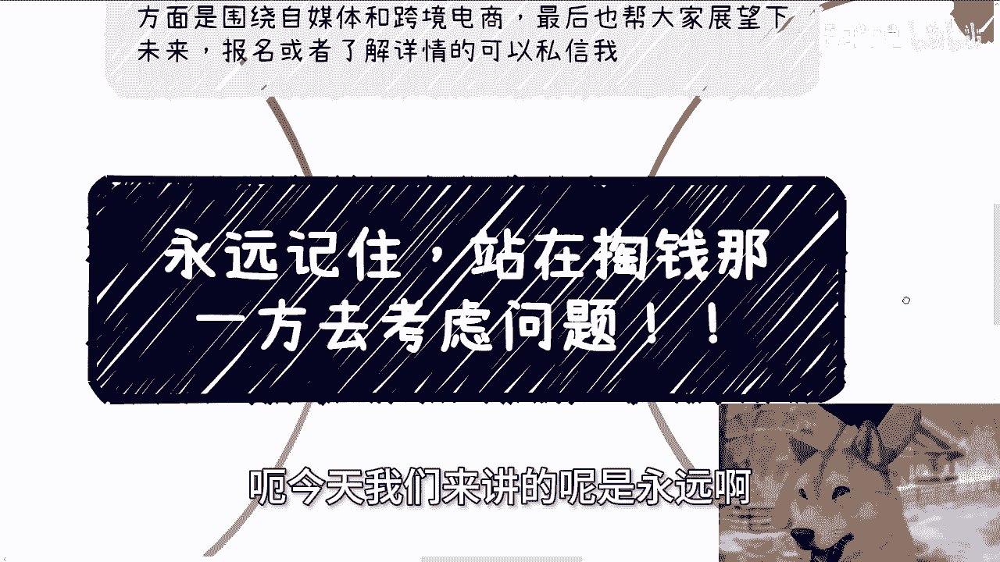
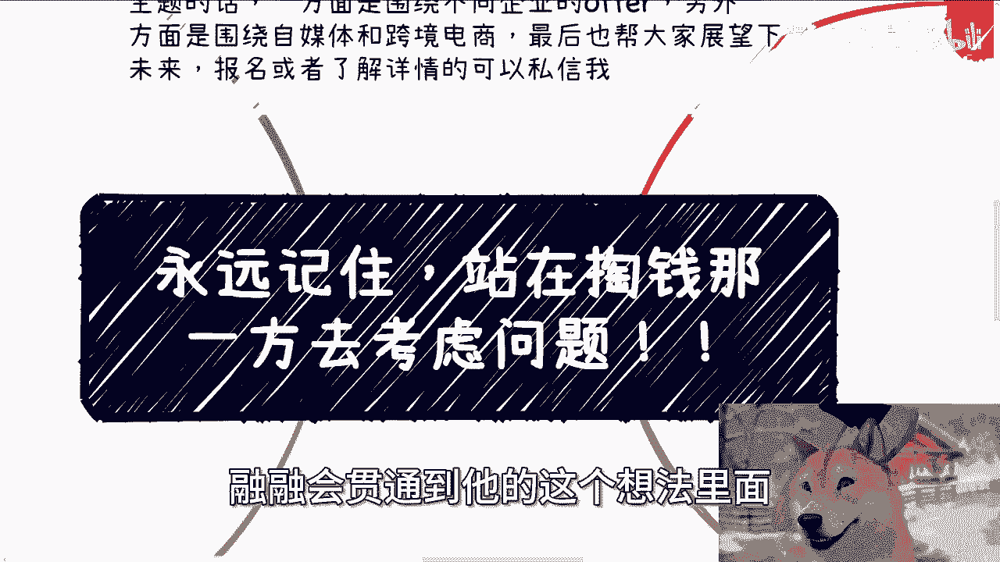
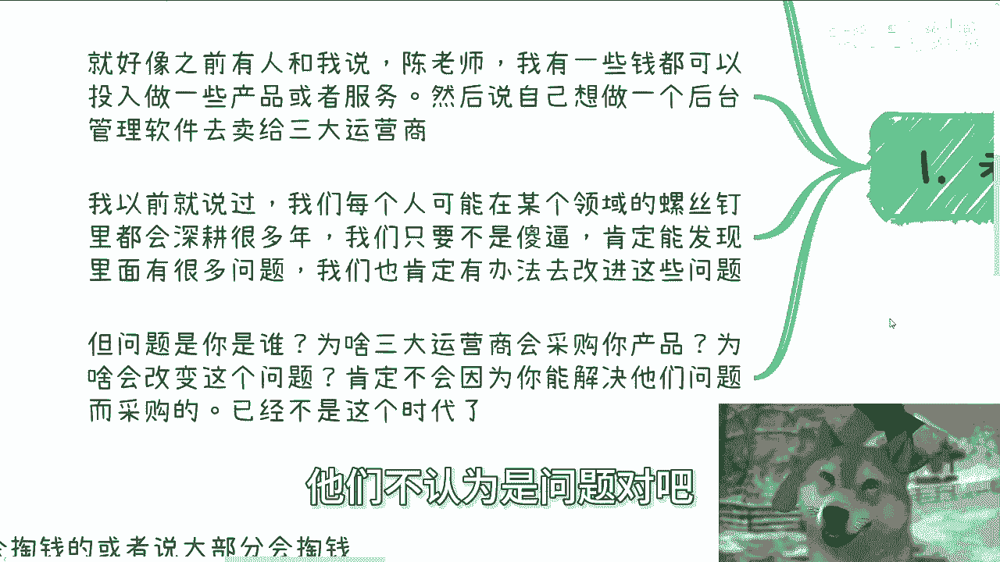
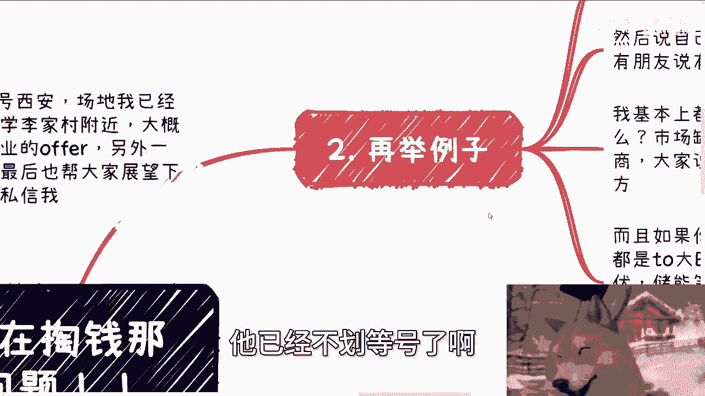
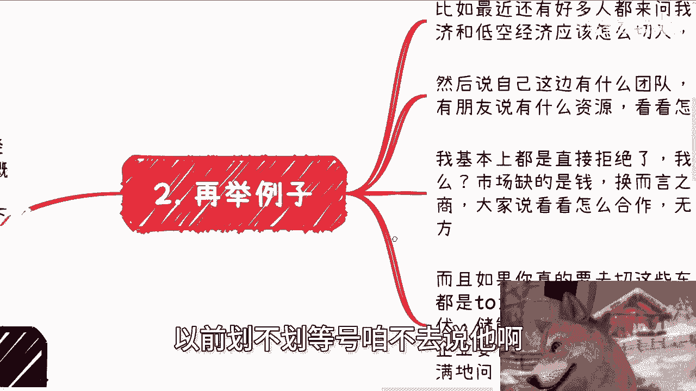
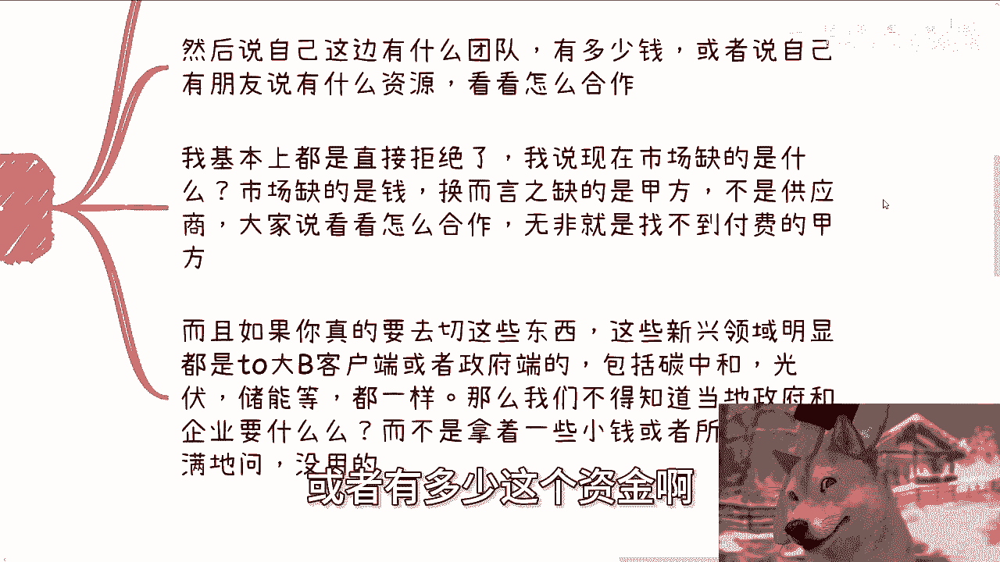
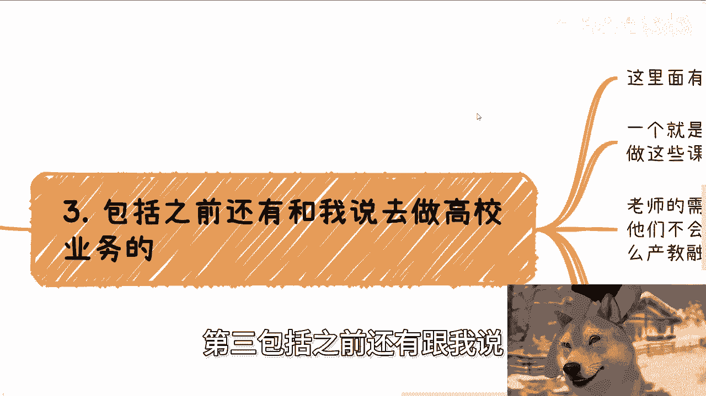
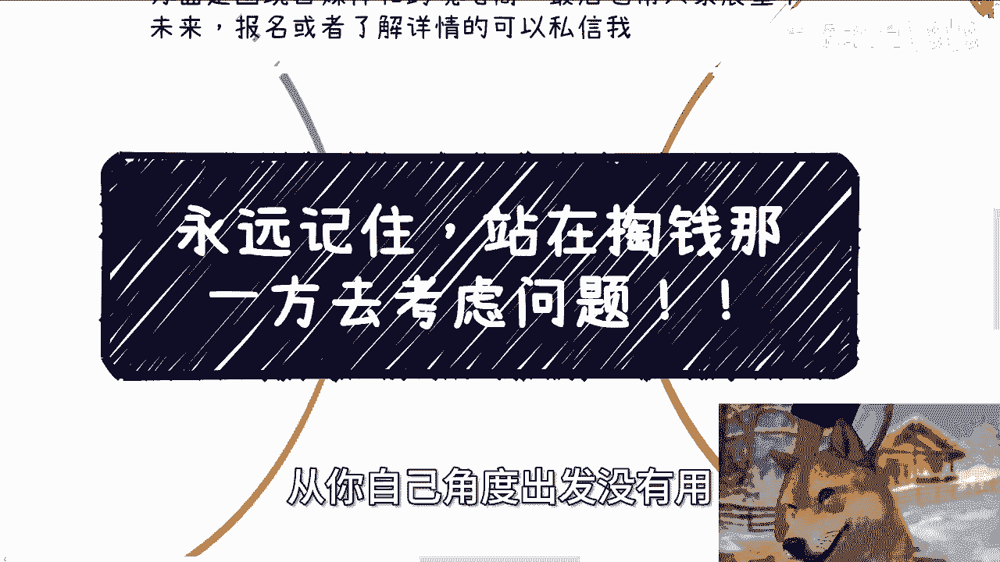

# 课程 P1：永远站在付费方思考 🧠

在本节课中，我们将学习一个核心的商业思维原则：**永远站在掏钱的那一方去考虑产品和服务**。我们将通过多个具体案例，深入理解为何这一原则至关重要，以及如何在实践中应用它。

---

## 概述

无论你是在日常工作、创业还是提供任何服务，所有的思考和决策都应从**付费方**的视角出发。很多人虽然认同这个道理，但在实际操作中却难以贯彻。本节课将通过分析几个常见误区，帮助你掌握这一思维。

---

## 1. 为何你的“解决方案”卖不出去？

上一节我们概述了核心原则，本节中我们来看看第一个常见误区：你认为能解决问题，但客户为何不买单？

很多人基于自身经验，发现某个领域存在“问题”，并构思了改进方案。例如，曾有人提出为三大运营商开发后台管理系统，理由是他在该领域工作多年，发现了许多可优化的“问题”。

然而，关键问题在于：**你认为的问题，付费方（如三大运营商）可能并不认为是问题**。即使他们承认有问题，市场上能提供解决方案的供应商也很多。

**核心公式**：
`能解决问题 ≠ 能获得合作/赚到钱`

付费方选择与你合作，很少仅仅因为你能解决某个技术或流程问题。你需要理解他们更深层次的动机和决策逻辑。

---

## 2. 市场缺的是甲方，而非乙方

理解了付费方视角的重要性后，我们来看看当前市场的普遍状况。

很多人寻求合作时，姿态是“我有什么资源，看看怎么合作”。这本质上是**乙方（供应商）** 的思维。但当前市场最稀缺的不是供应商，而是**愿意付费的甲方**。

以下是几个新兴领域的例子：

*   **数字经济/低空经济**：许多人询问如何切入。但如果你只是带着“团队、资金、朋友资源”去问“怎么合作”，这通常意味着你找不到付费的甲方。真正的切入点是先去了解当地政府和企业**具体要什么**，而不是推销你手头有什么。
*   **碳中和/光伏储能**：这些领域的信息差已经很小，政府和企业对此非常精通。早年可能报出高价的项目，现在溢价空间极低。例如，一个碳中和数据溯源软件，现在可能连20万都很难报出。

**核心要点**：在寻找机会时，首先要问“谁愿意为这个付钱？”以及“他们为什么付钱？”，而不是“我有什么可以卖？”

---

## 3. 高校业务：谁才是真正的“爷爷”？

让我们将视角切换到另一个常见领域——高校业务，这里付费方的逻辑同样关键。

有人想涉足高校业务，例如开发课程或组织竞赛。这里存在两个思维盲区：

1.  **为何老师不自己做？** 高校教师的核心需求是教学、评职称、发论文。参与商业项目并非他们的主要诉求或考核指标。因此，他们“不做”不是因为没能力，而是因为**没动力**。
2.  **学校为何要为你买单？** 无论你的愿景多美好（如提升学生技能、帮助就业），学校才是出钱的“爷爷”。你必须回答：**学校为什么要举办这个竞赛？为什么要把钱给你赚？** 政府的政策支持只是背景，学校有无数政策可以选择性执行。

**核心要点**：必须明确，在高校场景里，**付费的甲方（学校）关心的是其自身的KPI、声誉、行政任务和预算合规性**，而非你产品本身的技术先进性。

---

## 4. 如何识别真正的“痛点”与“刚需”？

知道了要站在付费方思考，那么具体应该思考什么？答案是：寻找**真正的痛点**，而非模棱两可的需求。

很多人描述的“痛点”非常虚泛。真正的痛点意味着付费方**有极大可能会掏钱**。你需要在自己的一亩三分地里，寻找这样的蛋糕。

以下是识别痛点的两个方向：

*   **历史验证型**：付费方过去曾为此类服务或产品持续付过钱。这证明该流程是通的。例如，某些政府项目、企业固定的外包服务。
*   **情感/政治驱动型**：付费方出于强烈的情感或政治原因**不得不做**。
    *   **政治驱动**：如企业的政府关系维护、高校的学科评估指标。
    *   **情感驱动**：如家长（尤其是隔代长辈）为治疗孩子“网瘾”而支付的高额费用。这虽然存在道德争议，但在商业上确是强烈的刚需。

**核心辨析**：
*   `学科教育`是刚需，但`学科培训`不是。
*   `摆脱网瘾`对部分家庭是情感刚需，但`购买二次元服饰`对爱好者只是“想要”，而非“刚需”。

**关键点**：讨论痛点与刚需时，我们首先站在商业逻辑上，判断付费意愿的强度和必然性。至于具体执行手段是否合法合规，那是另一个层面的问题。

---

## 总结

本节课我们一起学习了商业思维中的第一性原则：**永远站在付费方思考**。

我们通过四个步骤深化了这一理解：
1.  认识到“解决问题”与“获得付费”并不等同。
2.  明确当前市场稀缺的是付费甲方，并学会以甲方视角寻找机会。
3.  在具体场景（如高校）中，精准定位真正的决策者和他们的核心关切。
4.  学会区分“伪需求”与“真痛点”，从历史付费行为和情感/政治驱动中寻找刚需。

记住，一切商业活动的起点，是理解并满足**那个掏钱的人**的真实需求与动机。从今天起，请将这一思维融入你所有的决策过程中。

---
*（注：下期活动将于8月25日在西安举行，主题涉及职业规划与商业合作。详情可私信咨询。如需针对个人职业、副业、商业合作合同、股权等问题的具体咨询，请整理好个人背景与问题。）*