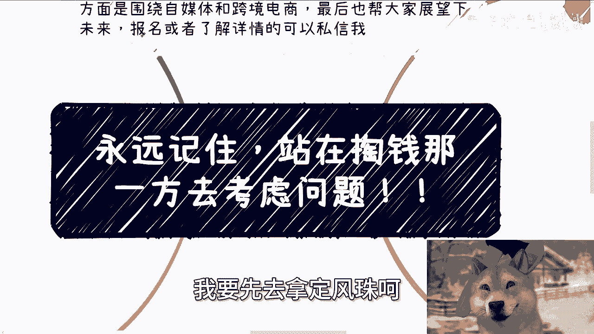
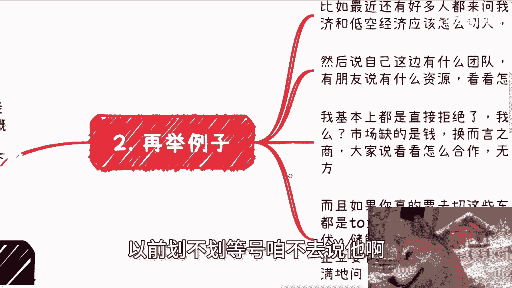
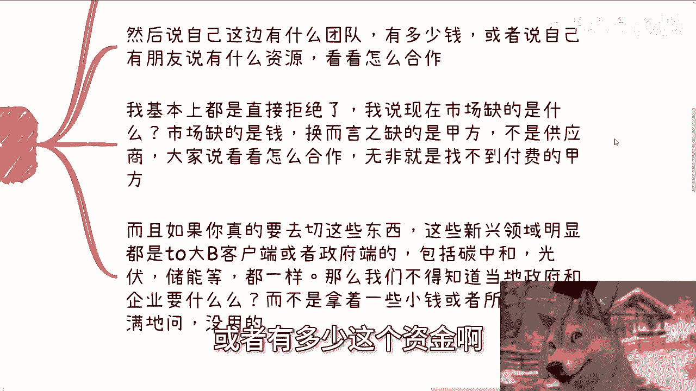
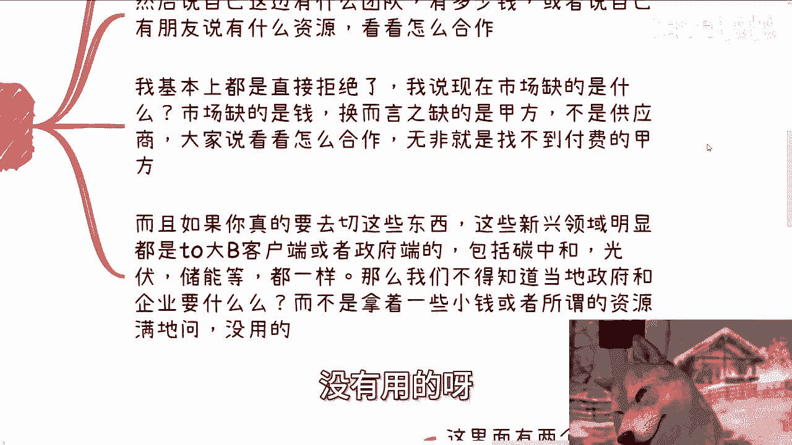
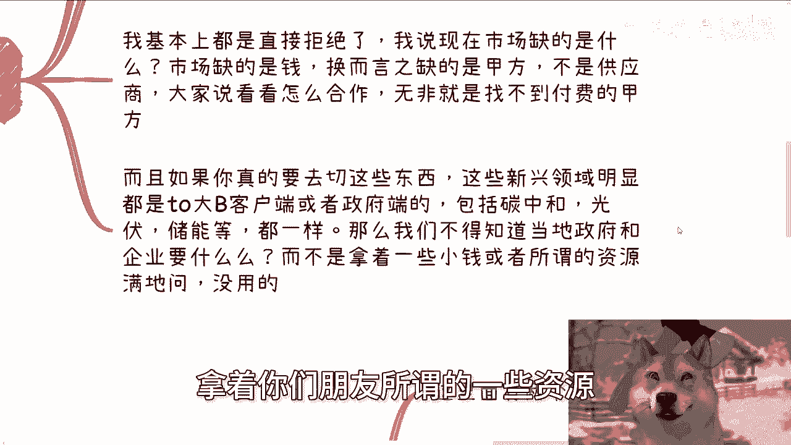
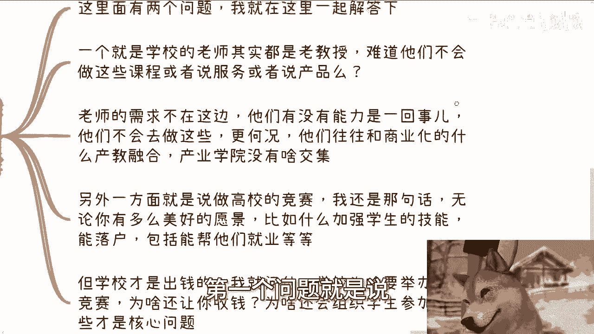
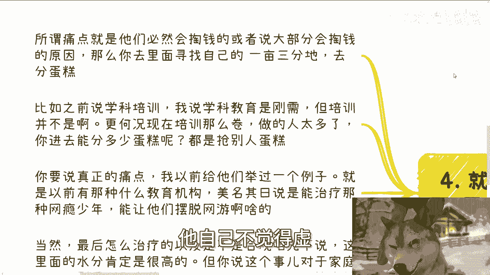

# 永远记住，站在掏钱那一方去考虑产品和服务 - P1 - 赏味不足 - BV1jz421B7QQ

哦大家好，我哎我卡，我现在卡在了黄黄蜂大圣那边，我要先去拿定风珠。

哼啊这个抽空来给大家录个视频啊，呃今天我们来讲的呢是永远啊。

永远永远永远记住啊，就是你你日常啊就不管碰到任何事情，你要做事情过程当中所有的思考问题，都得站在掏钱那一方去思考问题啊，就是啊当然了，这个东西我后面会说啊，就是说很多人其实在听的时候呢。

他都会觉得哎有道理有道理啊，但是呢等他自己思考的时候呢，他就哎他就没法把这个思维呢，融融会贯通到他的这个想法里面。

那这个亏吃其实吃的很多啊，就是啊我先说一下那个活动啊，就下期活动已经定了，在本周日啊，8月25号在西安，那么场地我也定好了，位置在西安建筑科技大学李家村附近啊，大概主题的话呢一个是围绕呃民企央企啊。

国央企啊，外企啊对吧，这种大厂啊，这种offer啊，另外一个呢围绕自媒体跟跨境电商啊，最后也帮大家展望一下这个未来啊，那报名和了解详情可以继续私信我，然后第一个啊先说啊老生常谈啊对吧，就这个事啊。

我觉得我觉得真的是属于大家听的时候呢，就对对对啊，是是是啊，觉得有道理，然后到了自己做的时候呢，那完全就不是一回事啊，这就好像之前有人跟我说，他说陈老师我有些钱啊，可以投入做一些产品或服务。

然后呢我就问他做什么，他说我可以做一个，就类似于像这种后台管理啊对吧，什么数据共享啊对吧，这种东西我说卖给谁呢，他说卖给三大运营商，我说为什么卖给三大运营商呢，他说哎那我之前在那边工作过对吧好。

我以前就说过啊，我们每个人可能在某个领域呃，螺丝钉的这个里面呢都可能深耕很多年啊，我相信啊对吧，我们只要不是个啊，但凡他妈的有点脑子的，肯定都能发现里面有很多问题对吧，你包括你们现在在公司里面去工作。

包括你们在学校里面只读书，我相信这里面多多少少都有问题，包括什么什么什么洗澡啊对吧，吃饭啊对吧，用餐就就就包括各种东西嘛，反正肯定都有问题的，对吧啊，然后呢你们肯定也会发现有一种想法。

就是说卧槽他妈这么的玩意对吧，这么落后的东西，怎么这么他妈的还会用对吧，怎么样啊，那我也相信大家一定会找到办法，去改进这些问题，但问题是什么，问题是你是谁啊，啊为啥他妈三大运营商会采贵的东西啊。

那为什么他妈的学校跟企业，政府会来改变这些问题的，对不对，你认为是问题，他们不认为是问题对吧。

那他们如果愿意跟你合作，一定不是因为你能解决他们的问题而采购啊，他妈的能解决问题的人多了，对不对啊，你记住一点，解决问题的这个事情跟最终能不能赚到钱，跟最终是不是能合作，他已经不划等号了啊。

至少这个时代已经不划等号了啊，以前划不划等号，咱不去说它啊。

第二再举例子啊，比如说最近还有很多人来问我，他说二创老师，我所在这个城市的数字经济啊，和低空经济应该怎么切入啊，应该怎么找资源，然后呢也跟我说啊，他说哎我就他自己这边啊有些什么团队啊。

或者有多少这个资金啊对吧。

或者来说这个这个说朋友有什么资源啊，看看怎么合作啊，我基本上都是直接拒绝的。

我说为什么，我说你这种看看怎么合作的，说白了是什么，你是乙方，你是产品供应商对吧，你是服务供应商，我说现在市场缺的是什么，市场缺的是钱，换而言之，缺的是有钱的甲方愿意出钱的，甲方不是供应商对吧。

你说你看看怎么合作，无非就是找不到付费的甲方，或者我无非找不到付费的冤大头，那你怎么合作呢，你到处去问有有用了没有用的呀。

因为大家都想找冤大头对吧，而且如果你真的要去切这些东西，这些新兴领域明显他不可能去C对吧，他一定都是去大客户端或者大政府端的，你包括碳中和对吧，光伏储能哎我跟你们讲很搞笑的，前两天评论区还有人。

还有小伙伴跟我提到那个那个双碳啊，碳中和能不能做，我说我说大哥你你可能不知道啊，我我他妈疫情前就已经给政府做过碳中和了，对不对，我说这个叫什么，这个就是信息差对吧，你说现在再去搞这些，哎呦我的，人家哼。

我说不好听点，就是人家就是属于那种搞得都已经比你精了，对吧，连连政府这种企业的人都搞得比你精了啊，你你你再去报一些这种呃，这个这个服务的溢价你都报不上去，你明白吗，你比如说我们以前可以报50万80万。

报报报，甚至200万300万，你现在呢你爆不出来的，你你说啊，我我给碳中和做，我举个例子啊，比如说给碳中和做个数据上链啊，给碳中和做个数据溯源，你去报啊，你去报一个软件，报个20万顶天了。

哎甚至他妈的也不会找你找你，谁他妈做一个数学那种溯源的软件，给现在给你刷20万，对不对啊，那话又说回来啊，就说到这，我说都一样啊，那么我们不得知道当地政府跟企业要什么吗，对吧啊。

你不知道当地企业要什么啊，啊你你你怎么去跟对方合作，而不是说拿着你们现在手上有点小钱，或者说呃拿着你们朋友所谓的一些资源。

满地问没有用的，你满地问啊，第三包括之前还有跟我说要去做高效业务啊。

这里面就存在两个问题，第一个问题就是说他说哎。

学校老师其实都是一些老教授啊，也都是一些就是说啊学校最不缺的就是老师。

那为什么老师自己不去做这种课程或者服务，或者产品啊，很简单啊，我就问啊，老师的需求在这边吗，啊哦老师不去教学生不去做，不去评职称对吧，不去不去不去发表他们该发表的东西，本来他妈跟你搞这种商业的东西。

会不啦，你们自己去问问，会的啦，不会的呀，他他妈项目不做啦，啊，教书不教啦，对不对，虽然我以前说他们没有这个能力，但是他们有没有能力是一回事，主要是他们不会去做这些对吧。

更何况他们往往跟我们所谓的商业化，产教融合啊，产业学院啊对吧，各种各样的东西没什么交集，这不是我们要去考虑的问题啊，然后另外一方面就是说高校的竞赛啊，我还是那句话，无论你有多么美好的愿景。

比如说什么加强学生技能啊，包括竞赛出来能落户对吧，包括政府支持，包括能帮他们就业等等，但问题是什么，问题是学校才是出钱的房，学校才是爷爷，你就问他，哦不对，我就问他，我说学校为什么要去举办这些竞赛。

为啥还要让你来收钱，为啥还要让你来赚钱，为什么还要组织学生参加，对不对哦，你说这是政府的需求，你说政府有政策没问题啊，那他妈政府需求多了，政府政策也多了，学校都去支持啊，我都去支持啊，没道理的呀。

对不啦啊，所以这些才是核心的问题，我们都要去明明白付钱的甲方到底关心什么啊。

第四然后就多问问痛点，而不是那些模棱两可的原因，哎我就跟你们讲啊，我跟这个很多人聊的时候啊，就是你问他们哎这个东西痛点有没有有的啊，什么痛点呢，他讲出一个词儿，这个词儿就是虚得很啊，他自己不觉得虚。

我的虚得很哦，那么所谓痛点是什么，所谓痛点就是他们必然会掏钱，或者说大部分这个基数里面的百分比会掏钱，那么你要去寻找自己里面的一亩三分地，去分蛋糕对吧，那就比如说之前你比如说有人跟我说，他做学科培训啊。

比如说语数外对吧，什么数理化这种啊，那我说学科教育是刚需，但学科培训不是刚需，对不对，你跟我说读书，他那个他考个学历出来是刚需，但是问题是你告诉我，读书过程当中的培训是刚需吗，不是啊，从来没人说过。

是对吧，再加上现在培训这么卷做的人太多了对吧，你能进去分多少蛋糕呢，对不对，你能从别人嘴人别人嘴里抢吃到蛋蛋糕呢，啊你要说真正真正痛点，我以前给他们举过一个例子，就是以前有那种什么教育机构啊。

美名其曰说能治疗那种网瘾少年啊，就让他们摆脱什么网游啊，啊就不要一天到晚他妈的在网络上飘，对吧啊，当然最后你说怎么治疗的，以及是不是真的合规，咱先不去说它啊，这里面水分肯定是很高的，咱什么都不用说的啊。

但是你说这个事对于家庭来讲，是不是刚需吧对吧，尤其是对于他们上隔两代以上的，就是那种爷爷爷爷奶奶对吧，外公外婆，这他妈简直就是超必杀，对不对，一一击KO对吧，你你你你你会发现这种机构他去找付钱的时候。

他甚至不是找他们父母，找他们爷爷奶奶，外公外婆，我操直直接一顿操作猛如虎，这就是刚需啊对吧，这就是痛点了对吧，我觉得所以说啊痛点这东西，说白了一个呢是曾经无数次验证过的事情对吧。

就是比如说你想要某个人掏钱，你想要你想要某个政府，某个企业掏钱，他以前他前两年，他甚至十几年前就因为某些这个怎么说呢，明目对吧，或者某些切入点一直付钱的，那OK啊，那你也可以从他这上面付钱。

至少这个流程是走得通的对吧，而不是说你造一个需求出来对吧，这是第一个，第二个就是对方出于情感，或者正直或者某些原因必然会去做的，比如说我们我们说的这个企业，高校的这种绩效对吧，这种是出于政治原因。

出于他们的这个这个怎么说呢，这个这个社会地位的原因对吧，那你说爷爷奶奶为孩子去买各种保健品，或者说去什么啊，什么什么什么去去除网瘾啊，去干嘛啊，这种就是出于情感上，对不对。

那当然啊你可以说这种有一定怎么说呢，一定范围的吃人血馒头，或者你也可以说有一定范围的薅羊毛。

对没有错，我还是那句话，你觉得吃人血馒头也好，薅羊毛也好，这个都是什么，这个都是道德制高点上面来讲的。

对不对，你明白吗，这是道德制高点，你要说今天他采用电击疗法，好不好意思，那那这个是违法对吧，但是你单纯刚刚那两点。

你在商业上面你是站不住脚的啊，所以说我们来讨论痛点。

讨论刚需，这就是痛点，这就是刚需啊，至于怎么做，这是后话，明白吗，啊不要去觉得就是说啊就就像很多人还跟我说，他说爱创收，我像我想卖卖一些衣服对吧，卖些什么，比如说二次元的这种装装扮或者怎么样子。

那我就问他痛点有没有，他说哎有的呀，那说二次元圈子的人都要啊，我说要是不是痛点，是不是刚需，人吃饭是刚需，你不能说人每天非要花1万块钱吃饭是刚需，那没道理的懂吗啊，所以说就是说这个受众里面的这个划分。

一定要分清楚啊，不要去老是从你自己角度出发，从你自己角度出发没有用啊。

行好吧，就这么照啊，然后那个继续黑马路啊，然后下一期活动啊，8月25号在西安好吧，然后呃报名或者了解详情，可以直接私信我，然后那个呃自己的工作上就职业规划，包括你们副业啊，包括你们跟别人合作一些商业啊。

商业规划啊，包括这里面包括呃涉及到一些合同啊，股权啊，股份啊，分红啊，丰润啊啊商业计划书啊，你们希望通过我的一些呃视角，给你们更多的一些呃接地气的规划，或者说让你们少走点弯路的话。

你们可以整理好对应的问题啊和个人背景好吧，我们再来走咨询，啧。