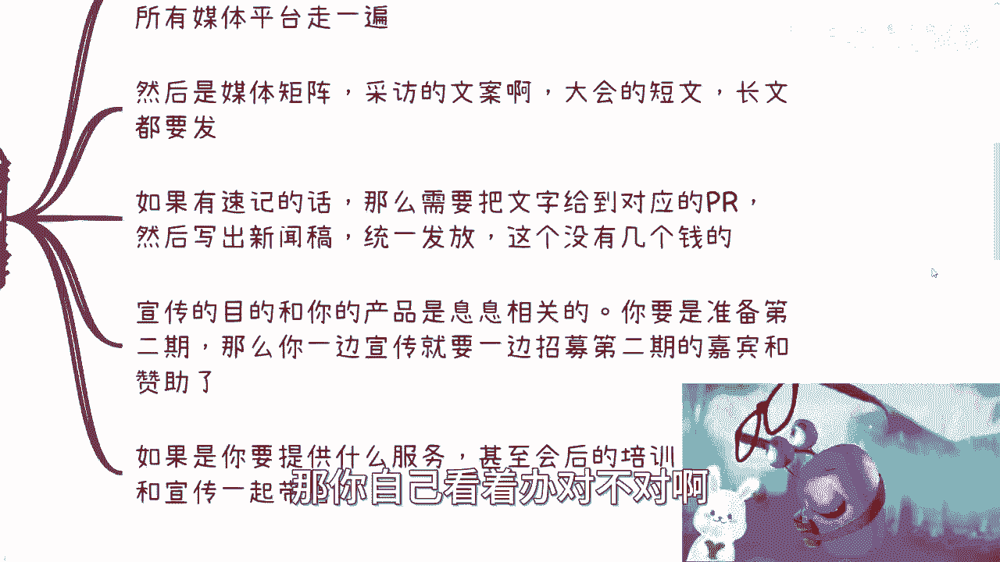
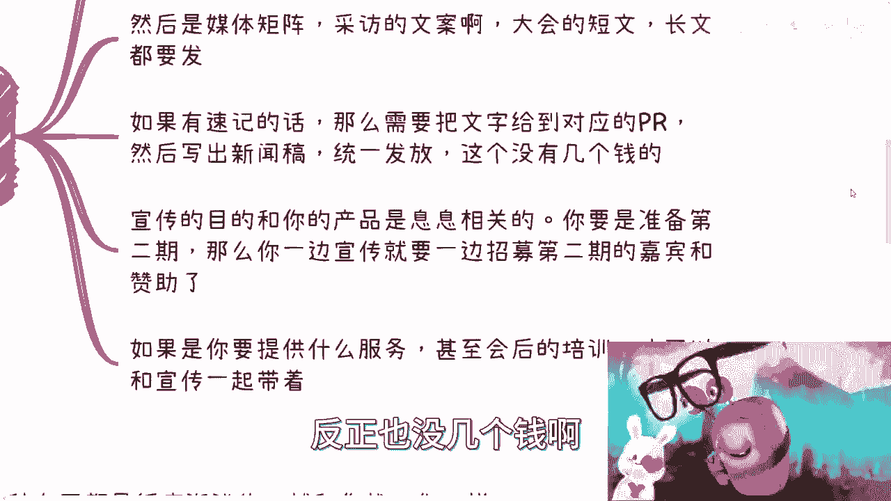
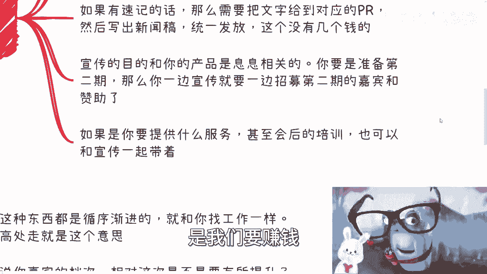
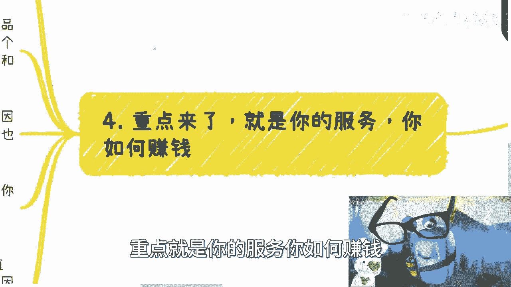
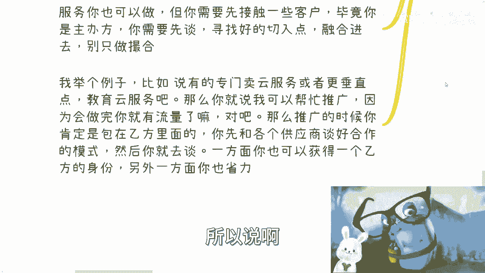

# 沙龙到大会盈利教程 补充篇1：大会结束后的行动指南 📋

在本节课中，我们将学习大会成功举办之后，主办方需要立即着手处理的关键事项。我们将探讨如何根据你的长期目标（是持续举办还是单次活动）来规划后续行动，并详细拆解总结宣传、筹备下一届以及实现盈利的具体步骤。

上一节我们介绍了如何策划和执行一场大会。本节中，我们来看看活动结束后，如何让这次投入产生持续的价值。

## 第一步：明确你的核心目的 🎯

大会结束后，你首先要明确后续行动的方向。这完全取决于你的核心目的：

*   **目的A：打造长期品牌，持续举办。**
    *   核心行动：进行品牌的长期宣传，并开始筹备第二季活动。
*   **目的B：仅作为一次性活动。**
    *   核心行动：整理并开始交付你在大会上承诺或展示的产品与服务。

无论选择哪条路，第一次办会都是最难的。既然已经克服了最大的困难，后续将其转化为持续收益是更明智的选择。

## 第二步：进行大会总结与宣传 📢

活动结束后，宣传的“长尾效应”才刚刚开始。你需要通过系统性的总结与宣传，最大化本次大会的影响力。

以下是需要立即执行的宣传任务清单：

*   **素材整理与分发**：整理好大会的精彩图片、视频，制作成资料包发送给所有参会者、嘉宾和合作伙伴。
*   **媒体矩阵全覆盖**：准备好统一的话术和图片素材，在你所能接触到的所有媒体平台（包括合作媒体和自有渠道）进行发布。
*   **新闻稿发布**：
    *   **短讯**：大会当天的快讯，合作媒体通常会协助发布。你需要审核内容，避免夸大宣传。
    *   **长文**：深度的总结报道或嘉宾观点整理。可以请媒体撰写，但务必审核，对内容真实性负责。
*   **数据与背书**：如果大会有数据报告或重要结论，应将其提供给宣传方，写成权威的媒体稿进行统一发布。

**宣传的核心公式是：`宣传内容 = 大会总结 + 未来行动号召`**

你的宣传不能只回顾过去。必须清晰地告诉外界你接下来要做什么，例如：宣布第二期计划、招募下届嘉宾与赞助商、推介会后的培训或咨询服务等。记住，我们办会的核心目的是**盈利**，活动是达成目的的手段。

## 第三步：规划下一届活动（如适用） 📅

如果你决定将大会品牌化、系列化，那么每一届都应该是递进式的升级，就像职业发展一样“人往高处走”。

在规划下一届时，你需要从以下几个维度思考与第一期的区别：

*   **嘉宾档次**：是否邀请更具影响力的嘉宾？
*   **主题与规模**：主题是更深入还是拓展到新领域？规模是否从300人扩大到500人或1000人？（对外宣传的规模是吸引赞助的关键）
*   **活动模式**：是否增设VIP票、分论坛？会期是否从一天延长至两天？是否引入更多样的合作形式？
*   **长期规划**：你需要一个清晰的长期发展蓝图，包括：
    *   **时间**：固定举办月份（如3-4月、9-10月），并避开行业顶尖大会的时间。
    *   **模式**：确定大会是综合峰会下设分论坛，还是垂直领域独立会议。
    *   **商业化**：明确赞助权益（如话题赞助、专场承包）、门票体系（早鸟票、团体票、VIP票等）的差异化设计，以覆盖成本并提升利润。

## 第四步：启动盈利与服务变现 💰

大会的核心价值在于资源整合。结束后，如何将这些资源转化为实际收益？主要有两个方向：

**方向一：打造个人/品牌影响力**
*   **操作**：以“XX大会创始人/主办方”的身份，在抖音、小红书等平台建立个人品牌，分享大会内容、行业见解。
*   **关键**：在分享嘉宾内容前，最好事先沟通，以示尊重，这也有利于未来再次合作。
*   **公式**：`个人影响力 = 大会品牌背书 + 持续内容输出 + 多平台曝光`

**方向二：提供专业服务变现**
*   **操作**：主动挖掘嘉宾、参会企业（甲方）和合作伙伴（乙方）的需求，提供撮合服务。
*   **高效做法**：不要做复杂的三方撮合。最好以乙方“战略合作方”或“销售代表”的身份去接触甲方，让甲乙方直接签约，你从乙方处分润。这样流程更简洁，甲方也更安心。
*   **其他模式**：还可以提供培训、咨询、组建专家智库、举办小型闭门路演等。大会品牌是你的“抓手”，一切能创造价值的服务都可以尝试。

你的后续工作节奏会很紧凑。一年若举办两次大会，间隔期大约5-6个月，扣除节假日和下一届的宣传、售票期，真正用于业务拓展和服务交付的时间约3个月。这期间需要高效地打造品牌和撮合业务。

---

**本节课总结**：我们一起学习了大会结束后的完整行动路径。首先，你需要根据**长期品牌**或**一次性变现**的目的决定方向。紧接着，必须进行系统的**总结与宣传**，并植入未来行动计划。若计划举办系列会议，则需为**下一届做好升级规划**。最后，也是最重要的，是通过**打造个人影响力**和**提供深度服务**将大会积累的资源转化为持续收益。记住，办会是手段，**盈利与发展**才是核心目标。