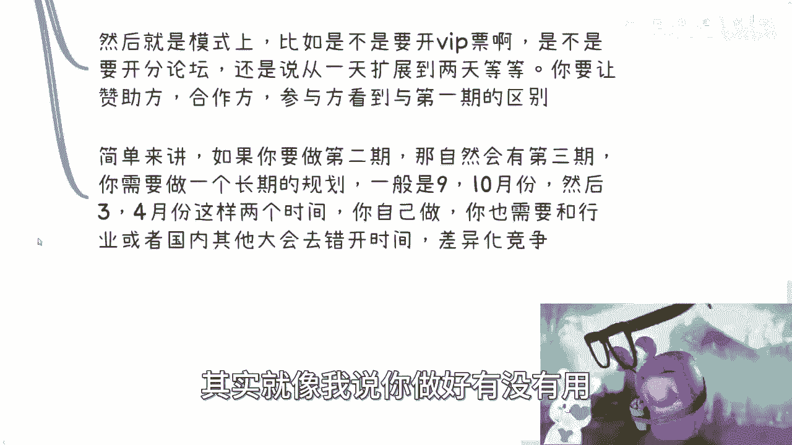

# 沙龙到大会盈利6补充篇：大会办完之后我们要做点什么 - P1 - 赏味不足 - BV1Ha4y1S7PU

好大家好啊，今天礼拜礼拜五啊，呃昨天呢有小伙伴提了一个问题，我觉得还是蛮有道理的啊，我把它来补一下啊，就是关于这个沙龙这个专题对吧，我们之前也都说了嘛，关于这个专题呢，他是这么说的，他说大会结束之后。

我们要做点什么，对这个我觉得是蛮有必要的，所以我补一期啊，嗯首先啊办完之后我们要做什么。

你看啊，首先你要看你的目的是什么，你是希望这个会议的品牌一直坚持下去呢，还是说就一次性的对吧，当然坚持下去跟一次性，我觉得问题不大啊，问题不大，但是呢我就先跟你们说啊，就按照正常道理来讲呃。

我很少看到过一次性的，因为为什么呢，因为你从就是赚钱也好，做生意角度也好，就是其实最难的是第一次，卧槽我的眼睛上他妈的长长耳朵了对吧，就是你是最难的，那你说最难的都做了，你为什么后面不做呢对吧。

这不是浪费吗，而且说白了你如果不想做，你其实是可以不做，但是你可以外包啊，对不对，那有钱不赚猪头三呢，是不是啊，那如果你需要持续加起来，那么你需要做一个品牌的长期宣传，跟第二季的准备。

那么如果你想就想做一次呢，那么你需要去整理你的产品和服务。

那么要开始做对应的服务了，好那么我们来细分一下。

首先我会的总结和宣传，总结来讲呢，就是说呃你有一个长尾效应。

因为会议结束之后啊，首当其冲的就是宣传啊，而且呢就是你得整理好会议的图片寄给大家啊，然后整理好话术跟图片，所有的媒体要走一遍对吧，那当然所有的你能接触到的媒体。

都能走走一遍啊，然后这是第一个，第二个呢就是说媒体矩阵，那媒体矩阵这边呢主要是采访我们文案，当然这种采访文案呢是这样子的，就是嗯我不知道大家有没有接触过，就是一般来讲大会当天都会有短信啊。

所谓的所谓的这种会议短讯呃，这种的话呢其实你的只要有合作媒体呢，他一般都会帮你发啊，当然了，就是说你你可以去决定这个短信怎么怎么写啊，你要是就是不做审核呢，那基本上就是媒体自己做，那当然在这里面。

如果有一些什么宣传上的这种夸大或者怎么样，反正你就自己看着办了嘛对吧，然后长文呢也得发，那么不管怎么样，短文长文呢你可以让媒体写，但是还是我那句话，就如果写出来跟事实有些出路，别人来找你麻烦。

那你自己看着办。

对不对啊，那么一般会议呢我们都会请书记，那当然了，你也可以不请啊，那如果有数据的话，你需要把文字给到对应的这个宣传方啊，然后写出媒体稿啊，统一方法，那么这个呢我跟你讲，反正也没几个钱啊。

没几个钱，那么宣传目的呢跟你的产品是息息相关的，因为你比如说你说我要发媒体了对吧，那你媒体发都发了，那么你在你的短信或者长文上面呢，你得跟别人说清楚，你到底是要接下来要干嘛对吧，你不能说啊。

我就总结一个这个活动啊，这活动怎么怎么怎么牛逼，怎么怎么样，那这都过去式了对吧，那你在宣传里面总总要告诉别人吧，你说哎我是不是接下来还有第二期啊对吧，那第二期跟第一期有什么区别啊，第二期要做什么对吧。

然后就是说你这个一边宣传，你也得你也得顺便的招，比如说第二期的嘉宾跟赞助吧对吧。

那如果你要提供什么服务，甚至比如说会后的一些培训咨询，那么你也得包装好那个整理好，你一起给到你的媒体或者媒体举证了对吧。

那这些都是要的，因为本质上我们不是来做一个活动啊，啊那个那个同学们对吧，就是不是我们的核心就是赚钱啊对吧，只不过就是说我们要明白，就是不是说我们做一个活动顺便赚钱，是我们要赚钱。

然后顺便做个活动啊，其实是这么个逻辑啊，你重点要放清楚对吧。

那么第二点就是说如果你准备第二期，你看啊大会这种东西呢一般都是循序渐进的，就跟你找工作是一样的对吧，你人往高处高处高处走嘛对吧，哎哎把它稍微拉下来一点，嗯对吧，那么比如说嘉宾的档次相对。

这次是不是有所提升呢对吧，还是说你的主题相对这次是不是更广阔了呢，还是说切不同的细分领域了，你你比如说这次你先大数据，下次你先云计算对吧，还是怎么样子，你得想好，因为啊这个我们后面再来说啊。

就是说呃那包括比如这次规模是300人，下一次是不是500人，再下次是不是1000人，就是说你规模呢你可以定你的计划，你可以说你的饼来可以画，但是并不是说你一定要买这些人嘛对吧，这无所谓的啦。

你就像很多人我跟他说，你第一期比如说办完300对吧，他觉得哎呀好像这个难度已经很高了啊，第二期你让我办500，那你你你对外规模已经这样子的呀对吧，你对外规模不这样子，你怎么拉赞助，你怎么去拉合作方。

没有办法的呀，啊然后就是模式上，比如是不是要开VIP票啊，是不是要开分论坛啊，啊那你这次可能就是一个论坛从头到尾对吧，那后面你是不是要开分论坛啊，还是说从一天扩展到两天啊，还是说让赞助方合作方呃。

这个这个等等等对吧，都要看到与第一期的区别，你不能说我第二期要做了对吧，完全都是CTRLCCTRLV的，那说实话没有什么吸引力啊，没有什么吸引眼球的地方，因为中国这片土地上面会这个东西其实不缺。

那满地都是会是吧，呃简单来讲呢，就是说如果你要做第二期，那自然也就会有第三期啊，你一定要明白这个道理啊，你需要做的是一个长期的规划，呃我们说长期规划也很简单，就是说第一是时间上的，第二就是模式上的。

第三就是内容上的对吧，你说我做这个东西，我是不是为了要把这个会索性拆分开啊，你说我可能是某个领域，比如说我要做IGC，做一个会对区块链做一个会，元宇宙做个会，还是说我就做一个数字经济峰会啊。

然后元宇宙一个论坛去看那个风论坛啊，然后那个大数据一个分论坛是吧，还是说什么样子，你得把模式定好，你不能每次都变来变去，这是第一个，第二个就是说你赞助也好。

他的这个里面的这个topic的规模到底怎么样啊，你赞助你赞助是有这种商业topic赞助呢，还是说是是是是是可以直接承包的啊，你比如说你说大，你比如说那个区块链对吧，有一共三个topic。

那你你是不是说爱是一家企业，承包这三个对三个不同方向还是分开来承包，这个东西是取决于你的模式是怎么样的啊，那么你说那个包括那个会议时间啊，一般来讲九九十月份，然后34月份这两个时间点你可以自己做啊。

你自己你可以自己定，你也需要跟呃，而且你要记住，你需要跟行业或者国内的其他大会错开时间，你需要差异化竞争啊，你不要说什么啊，物证吧，开在这个时候啊，然后什么什么什么各种什么很有名的。

人家做了十几年的那种大会也开在那个时候，你非要挤这个时间，那那那也没办法啊，那么包括呢就是说呃，你的那个门票怎么去做区分，因为现在大家的消费能力都不强嘛，啊你说啊我这次三四百，下次三四百，下次三四百。

再下次还三四百，那这个不是说你不能三四百，而是说你这样的话，你cover不住你的成本啊，那么你怎么cover你的成本，你要想啊，你要在这种门票上做做做文章啊对吧，你要么比如说我现在有了单张票啊。

也有比如说两天的多张票，也有几个人成型的团购票啊，也有早鸟票，也有VIP票，你得把票分开来呀，那这样的话你才能可能收到更多的钱啊，就像我们刚刚说的，就是说你的你的核心点一定是在赚钱上，不在会上。

就是会它是一个低于你赚钱优先级的东西啊，没有办法的，你不是说像以前说啊，我们这100件事情做好，你做好，其实就像我说你做好有没有用。

取决于是以你最终能赚到多少钱来定的，而不是说大家在那边鼓掌啊。

你赚办的好牛逼啊对吧，怎么样有啥用啊对吧，你说我办的好，我活都活不下去了，好那么最后一点就是重点就是你的服务。

你如何赚钱对吧，就是会这个东西呢，最大的点是在于资源的这个整合好，那么你说你资源整合完了，你往下你不用你怎么赚钱呢对吧，那说白了无非就两个，我给你讲，一个是你要打个人影响力啊。

第二个就是你要开始做服务赚钱啊，当然你也可以两个一起做嗯，因为首先啊如果是个人影响力，那么你就是打着某某某大会，就是把你这个大会的品牌往极致嘛对吧，抖音啊，小红书啊，快手啊全部做起来啊。

然后呢各种分享活动，更讲这种分享会或者别的东西，你都去参与，所有的介绍，都把你这个会的这个叉叉叉，创始人的这个品牌带在那边，那这样的话不是默认的大品牌吗，然后你可以分享什么东西，对不对，这个内容多了。

你办完一个大会，所有的内容都是你的，你就一个个分析嘛，你你想拆东西，拆东西，你想怎么分析，怎么分析，你想怎么玩怎么玩，那你跟那些嘉宾只要提前打好招呼，你说这些东西我能不能讲啊，这些东西我能不能公开对吧。

这些东西我能不能去剖析，对你会不会有什么影响，那这样的话你也对他们是一种尊重嘛，啊虽然我就告诉你们，其实这个话你可以不问，但是就是说你问了。

一定是别人愿意再次跟你合作的啊，那么你也可以跟我一样去出席一些活动，你也可以跟这些人呃再去合作，就跟这些嘉宾再去合作对吧，因为每一个人虽然他是一个人嘛，但是他背后代表着他的圈子。

跟他的合作方嘛啊那么你要去深挖这些人啊，你说打个比方，你今天办了个会，你有八个嘉宾对吧，那么这八家兵一定是对你很信任，或者很愿意去帮助别人的，那么你就顺便顺杆往上爬，去挖他们的需求嘛，对不对。

挖他们的资源嘛，你说一个人愿意做你的嘉宾，你挖到一个资源说合作，我多多少少觉得他还是愿意跟你合作的对吧，那么嗯当然这个地方就是我们说的，就是你得整理出来，你不要等着别人来找你，你要整理好你的品牌。

因为别人不知道你是要打什么牌，你知道吗，你到底打个人品牌呢，还是说是要打你的服务呢，别人不知道的，别人怎么知道你能做什么呀，啊包括包括你可能两条白都不打，你说我我提供融资服务行不行也行啊对吧。

但是没人知道啊，你得告诉别人，告诉大家，你的重点到底是什么对吧，那当然服务你也可以做啊，但是呢你得先接触一些客户，就毕竟你是主办方，你有这个资格可以去谈啊，你比如说甲方也谈谈对吧，然后供应商也谈谈。

你寻找好好的切入点，你要融进去，你不要只做撮合啊，我给你们举个例子，比如说比如说有专门卖云服务的，或者更加垂直的点，他说我卖教育云服务对吧，或者什么工业云服务对吧，可以吗，可以的呃。

你就说我可以帮忙推广，为什么呢，因为你做完大会你就有流量嘛，而且你主动推广你，你你说了算盘，因为你是主办方嘛对吧，那么推广的时候呢，你肯定是包在乙方里面的，你不可能跑过去说哎这个这个你跟供应商谈好。

你首先啊你跟供应商谈好模式，然后你就去跟打方谈了啊，你你不可能跑过去说哎那个谁对吧，这个我是这个会主办主办方啊，我来帮你们这个撮合一下啊，这边有个专门做什么什么叫云服务的啊，那么它产品怎么样怎么样。

那其实人家会觉得很神奇，为什么，因为那很简单，因为你一旦涉及到三方，对方第一感觉就是说，OK我应该怎么跟你分钱对吧，那你不要给对方这么大的就是说压力，或者你也不要给对方这么莫名其妙的一些感受。

你就直接跟他说对吧，你跟乙方也说，你说哎我可能有一个身份对吧，我是你们的销售，或者我是你们的一个战略合作方啊，或者怎么样子，那么你去谈的时候，你其实就是代表着乙方去谈的，那这样的话。

其实甲方这边呢也比较的就干净对吧，他就觉得就说哦我最终就跟乙方签，我也不用跟你签对吧，你就给乙方去签好就好了，你你不要把事情复杂化对吧，因为一般来讲呢你签两方肯定比三方来的简单，你签个三方。

大家在这边搞来搞去也很烦呐，是吧哦那么你让甲方知道哦，原来你跟乙方对吧，这边是已经合作好的或者怎么样子的啊，那么这样的话他也安心啊，那这样的话他就安心来看这个产品啊。

所以说其实本质上你会发现就是我们当然啊，我不管你是嵌在甲方里面，嵌在乙方里面，这无所谓啊，这个都可以，反正最终只要甲乙方双方能够合作就可以啊，但是不管怎么样，就是说呃哪怕就像我们以前说的。

哪怕你没有赚到钱，你也至少通过这个会，你可以在甲乙方这边去挂一些title啊，因为大家觉得你是能够做事情的，你做一件事情，无论是一个会还是当天的这个现场，别人是能看得出来你的能力的啊，呃。

所以说啊就是说会这个东西呢。

它的可延展性很强啊，你也可以说你说我索性首先我用这个会，就跟什么协会一样的，你什么组一个什么专家智库，你说好，我这边有一个什么什么全国的云计算，大数据专家智库有30人了。

然后你可以通过大会这个品牌来做公开招募，也可以啊对吧，等你抓不到100个人了，你可以对外宣传，你说好，我们这个大会马上举办第二期了，然后目前专家智库有100位，他们分别是涉及到了什么什么领域。

什么领域啊，好你不觉得老牛逼了吗对吧，就是其实你的会就是你的抓手，就是你的主体，你想怎么做都可以，没有一个固定的一个说法说哦，你会办完了，你要干嘛干嘛，其实无所谓。

我觉得吧这个事情其实你往后你的思路很简单，就是就两件事，一你到底怎么包装，第二你到底怎么赚钱，你就想好对吧，然后你不要问我，你有哪些可以赚钱，就是你从大会这个角度，如果你真的办完了，我跟你说。

每个角落你都能赚钱啊，你小到培训小道咨询对吧，小道提供一些服务，大到就是说b to b的合作，b to g的合作，包括就是比如说下次能不能冠名掉，或者怎么样子，你谈呗，你想怎么谈怎么谈。

就看你能力啊对吧，甚至你说甚至你说有些资方，他说哎我能够在你旁边，比如说专门弄个弄个小的VIP活动室啊，然后你能不能帮我们宣传啊，如果有人来现场就可以来路演，卧槽你这种费用收的不要太贵哦，不要太爽啊。

对不对，就是你一年一般办两次，然后两次的间隔当中就是做好你的宣传，做好你的服务对接，然后其实你仔细想想看啊，你办两次无非当中间隔就是六个月啊，然后去掉那些圣诞节，去掉国庆节，去掉过年。

你当中可能也就五个月，然后这五个月当中去掉宣传的一个月对吧，去去掉招招就是你专门要卖票的一个月，那也就剩下三个月，那么在这三个月里面，你多多去开始打品牌，多多去这个撮合业务，其实就差不多了。

你一年下来你很忙的啊，不要觉得就是说我办了一个东西，然后办完就没事情了，不可能的，你会忙成狗的，但是有一个前提就是你要真的能办的出来，你知道吗，好那我们这个就先说到这吧，好吧嗯行，那就这么着啊。

然后大家反正有什么东西，反正有什么问题，你们也整理好，整理好啊。