# 沙龙到大会盈利篇1-起步做活动积累影响力等若干问题---P1---赏味不足---BV1yu4y1W7

在本节课中，我们将要学习如何从零开始策划并运营线下活动（如沙龙、大会），以积累影响力和实现盈利。我们将探讨活动的核心价值、起步方法、执行策略以及长期规划，帮助你理解为何线下活动是构建有效社交与资源网络的关键途径。

## 前情提要：流量与关系的本质 💡

上一节我们介绍了流量和社交的重要性，本节中我们来看看它们与线下活动的具体联系。

从长远角度讲，流量永远是王者。无论你做什么，有了流量，你就有了后路或备选方案。这个观点在中国市场尤其是不变的真理，与具体从事的行业无关。

互联网只是一个工具，它本身并不能直接提供我们所需的面包、鸡蛋或牛奶。每一代人（如80后、90后、00后）对互联网的认知存在断层。许多年轻人知道线下活动，但缺乏亲身经历和深刻认知。

有效的社交和资源对接是所有人的刚需。线上沟通往往是点到为止，甚至点都点不到，无法替代线下面对面交流带来的深度连接和信任积累。

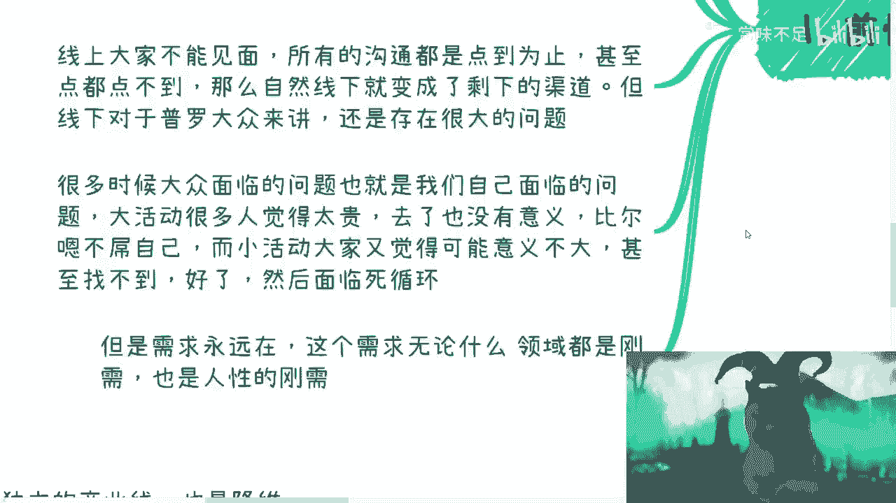

## 核心问题：大众参与活动的困境与机会 🔄

普罗大众在参与活动时面临一个死循环：大型活动觉得太贵且自己无人关注，小型活动又觉得意义不大或懒得参加。需求永远存在，但渠道和动力似乎总是不对。

这个关于社交的刚需，在任何领域都存在。互联网放大了“虚拟社交”的错觉，例如观看千人直播，但这只能带来情绪满足，无法积累实质性的社会资本。你看10年、20年短视频，也无法积累出真正的资源。

既然找不到合适的活动，解决方案就是自己动手创造。自己做活动并非固有思维中那么高成本，关键在于做法要与时俱进。

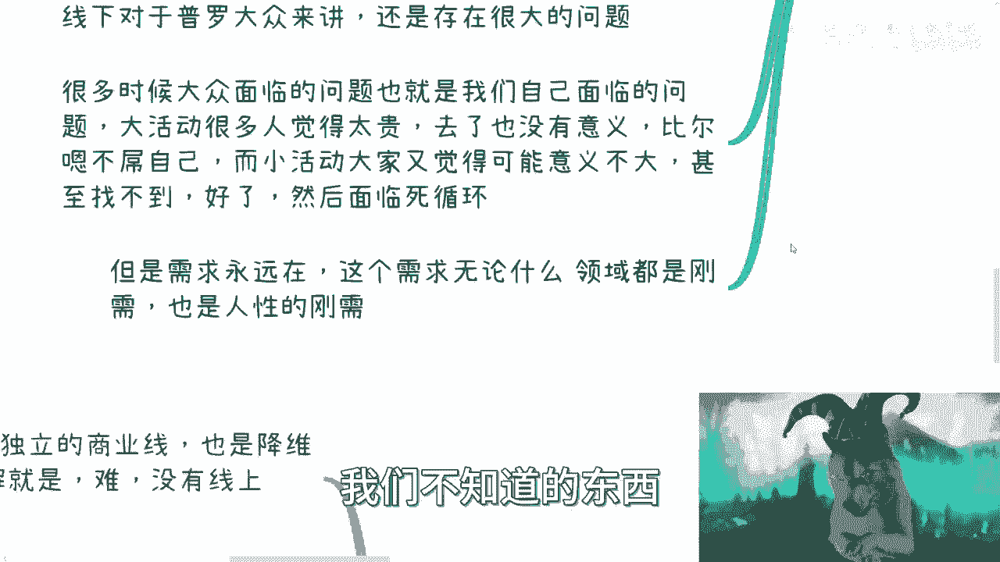

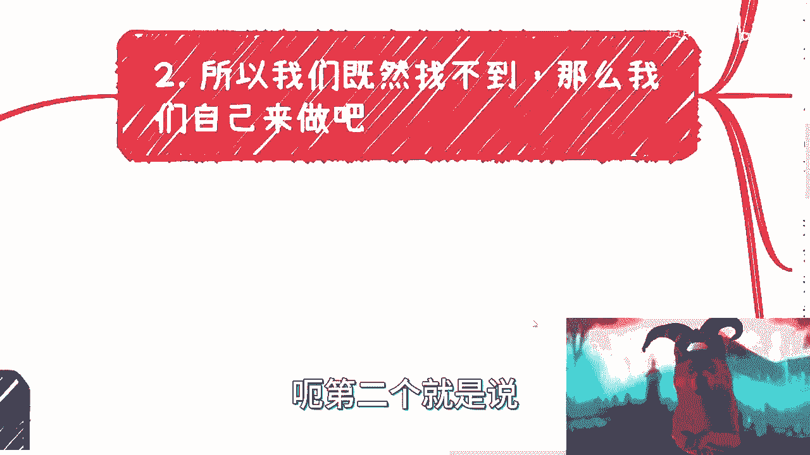

## 第一步：明确最终目的与盈利模式 🎯

在开始任何活动之前，必须想清楚最终目的是什么。你需要一个短平快、且能坚持执行的清晰目标。

活动可以服务于多个盈利方向，但你必须提前规划。以下是几种主要的盈利模式：

*   **活动本身盈利**：例如通过售票、赞助等方式。
*   **利用中间资源和关系盈利**：通过活动积累的人脉进行后续商业合作。
*   **引入第三方资源盈利**：作为平台，对接其他方的需求。

如果一开始没想清楚目的，在当今快餐时代，很难吸引和留住参与者。参与者有权询问活动的长期规划，如果你无法给出清晰的回答，会影响活动的信誉和持续性。

活动的核心是接触到“人”，以及人背后的资源与关系。每一个存在的资源或关系，都是社会某个小循环中的一环，其深度和广度需要你自己去挖掘。别人无需立刻知道你的全部业务，靠谱的言行和思考更能吸引真正有需求的人。

总结来说，盈利方式多样，但关键在于想清楚再迈出第一步。更直接的方法是：研究那些存活了10年、20年的成功活动案例，看看他们是如何运作和盈利的，然后进行借鉴。

## 第二步：现代活动的做法与借力打力 🚀

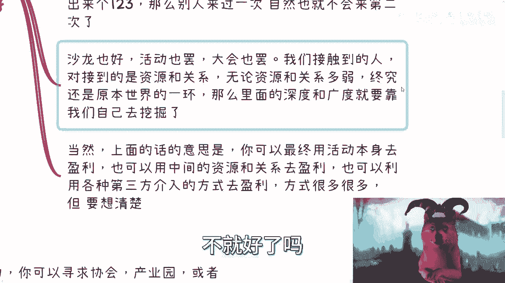

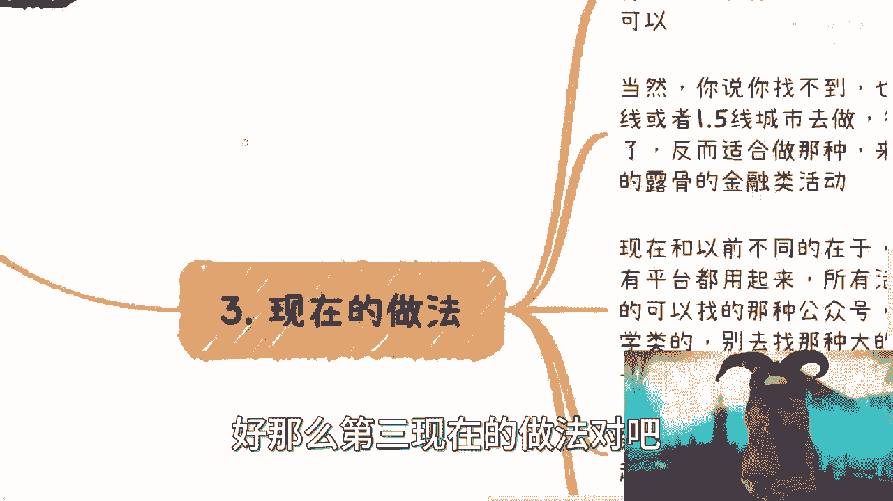

现在的做法强调“借力打力”。起步阶段可以积极寻找外部合作，降低成本和扩大声量。

以下是寻找合作方的几种途径：

*   **协会与产业园**：他们通常有场地和资源支持。
*   **身边创业的小伙伴**：联合主办，共享资源。
*   **中小型企业**：他们可能有品牌曝光或获客需求。

如果找不到合作方，活动地点至少应选在一线或1.5线城市，因为这些地方人群聚集度高。在下沉市场，活动模式可能需要调整，可能更适合直接、露骨的金融类推广活动。

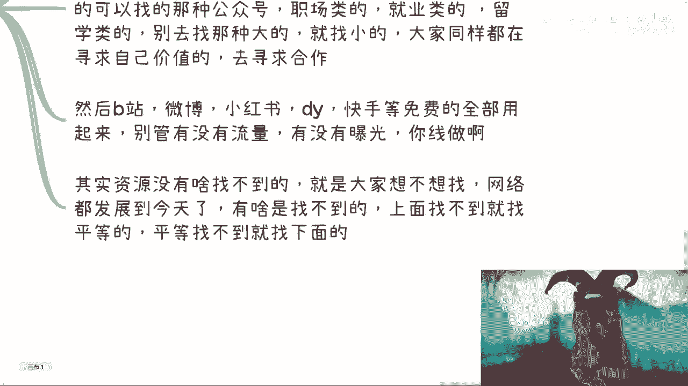

充分利用所有免费的互联网平台进行宣传。以下是一些可用的渠道：

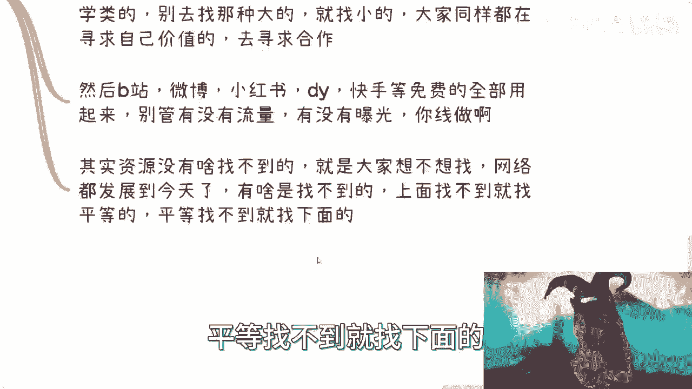

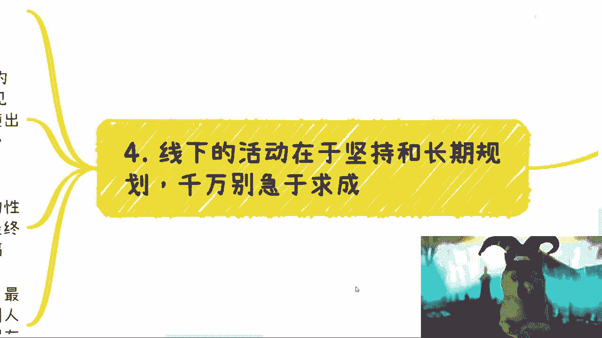

*   **活动发布平台**：如活动行、互动吧等。
*   **社交媒体**：公众号、B站、微博、小红书、抖音、快手。
*   **垂直社区**：职场类、就业类、留学类等领域的社群或KOL。

寻找宣传伙伴时，不必只盯着大V，可以多联系那些几百、几千粉丝的同类创作者，互相帮助。关键在于执行力和意愿，在网络发达的今天，主动寻找总能找到资源。

## 第三步：坚持、规划与执行 💪

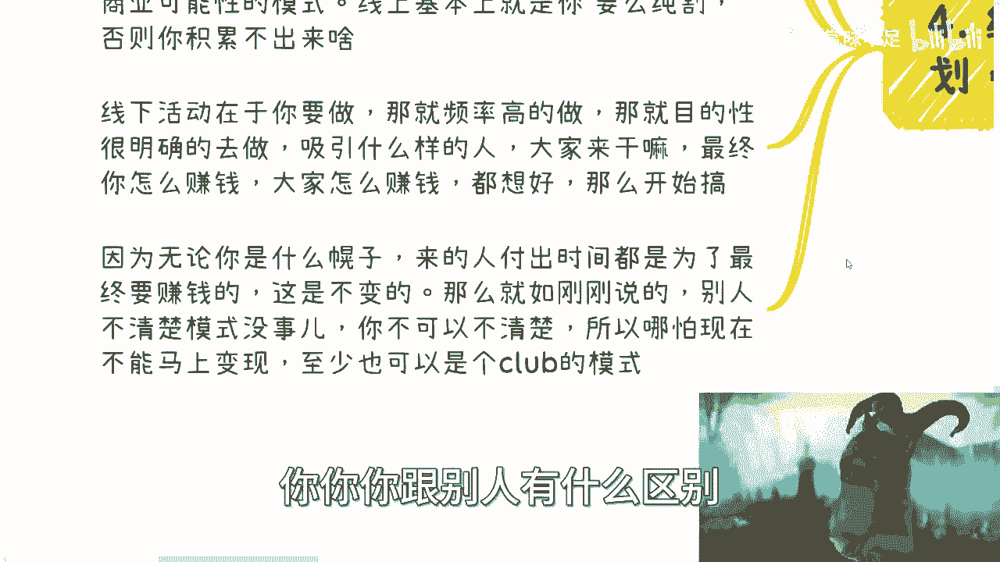

线下活动是一条独立的商业线，也是一种降维打击。它难在启动，但一旦形成正循环，其积累的资源和信任是线上难以比拟的。

线下活动的核心在于坚持和长期规划，切忌急于求成。与线上追求短平快的“收割”模式不同，线下活动是“滚雪球”模式，旨在长期发展和积累。

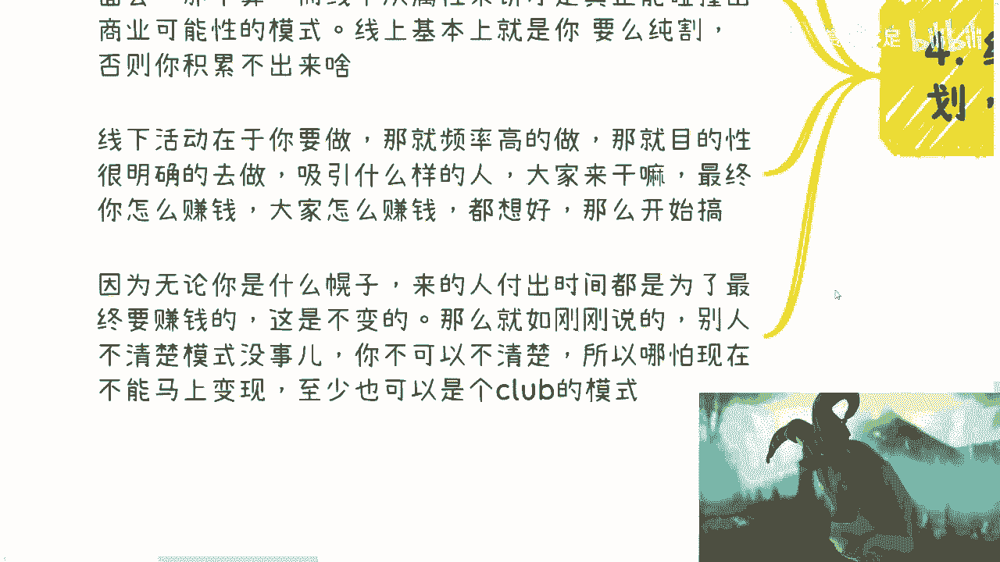

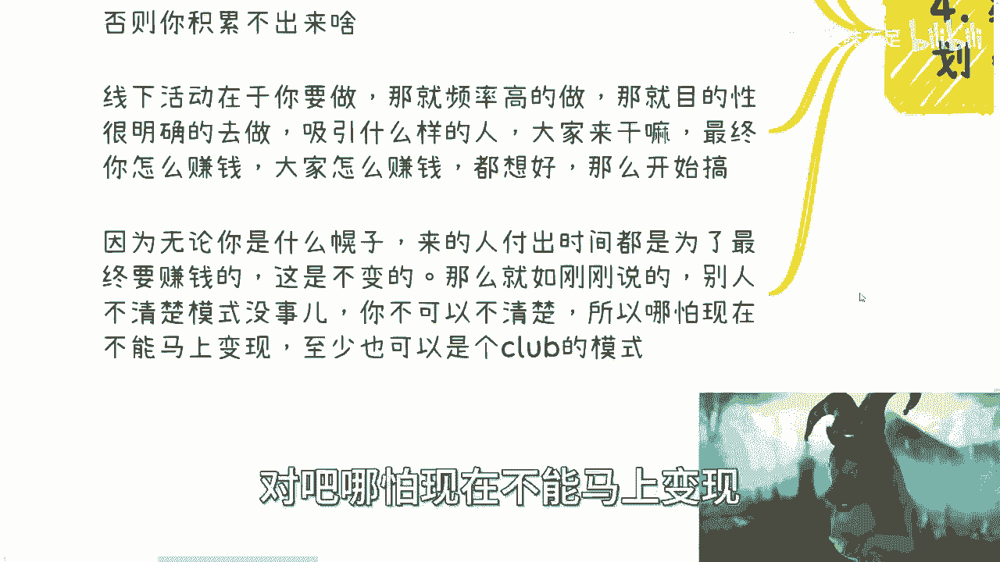

若要成功，活动频率必须提高，不能温水煮青蛙。目标明确后，要清楚吸引什么样的人、大家来做什么、以及如何让参与者（包括你自己）获益。

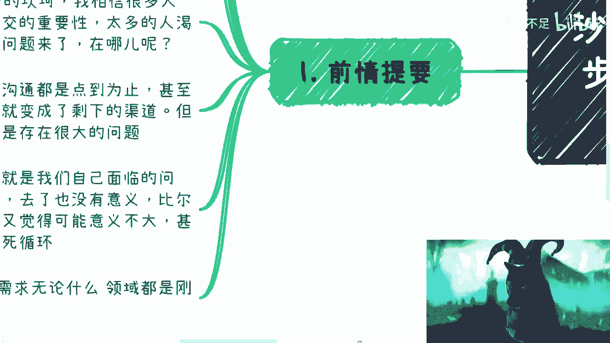

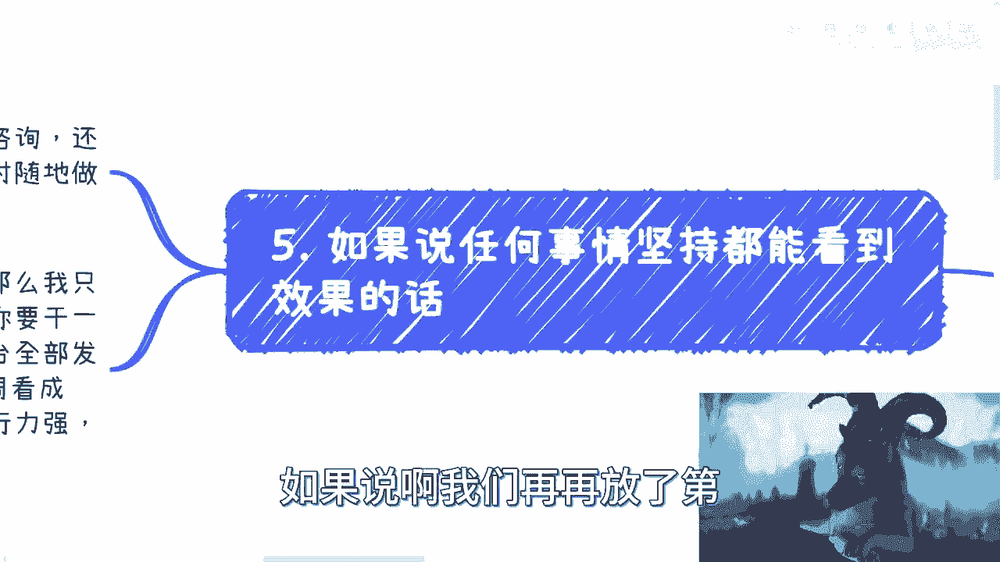

无论参与者以什么名义前来，他们付出了时间，最终目的都包含“获益”（尤其是赚钱）。因此，活动组织者必须清楚自己的商业模式，即使不能立刻变现，也应形成一个共同成长的“俱乐部”模式。

线下活动的优势在于效率高且调整灵活。最大的障碍往往是执行力。以下是启动一个活动的快速执行步骤：

1.  **果断决策**：想明白就干。
2.  **快速筹备**（一周内完成）：找场地、定主题、做海报。
3.  **全面宣传**：在所有平台发布，寻找合作方。
4.  **执行与复盘**：活动结束后立即复盘，并马上筹备下一期。

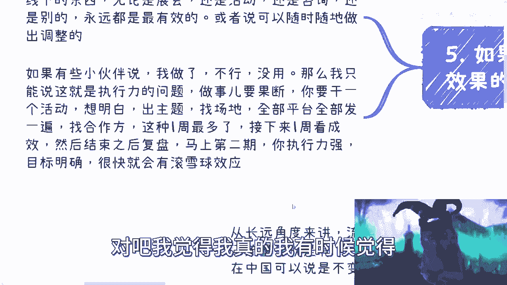

执行力是关键。定下目标，例如每两周举办一次，并严格执行。过程中可能会遭遇不专业、不成熟的评价，但比起从0到1的突破，这些眼光并不重要。分清轻重缓急，持续行动才能产生滚雪球效应。

互联网给许多人灌输了“急于求成”的毒药，认为线上最快，线下慢。但实际上，线下的速度取决于你的执行力。没有章法、缺乏行动，在任何地方都快不起来。

## 总结 📝

本节课中我们一起学习了起步做活动的核心逻辑。我们明确了线下活动对于积累真实影响力和资源的重要性，指出了大众参与的痛点正是个人发起机会。我们深入探讨了起步前必须想清盈利模式、如何利用现代手段借力宣传、以及通过高频率执行和长期坚持来滚大雪球。记住，清晰的目标、高效的执行力和对长期主义的坚持，是线下活动成功并最终实现盈利的基石。从想清楚到干起来，关键在于迈出第一步，并在实践中快速迭代。