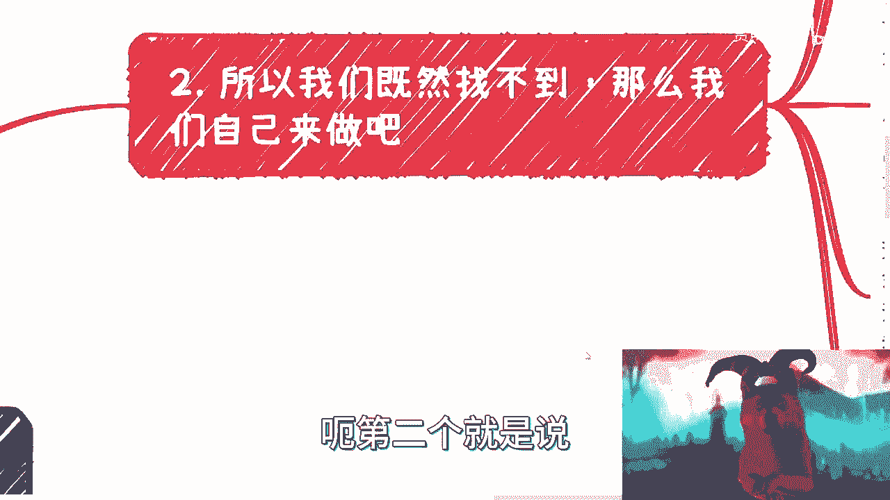
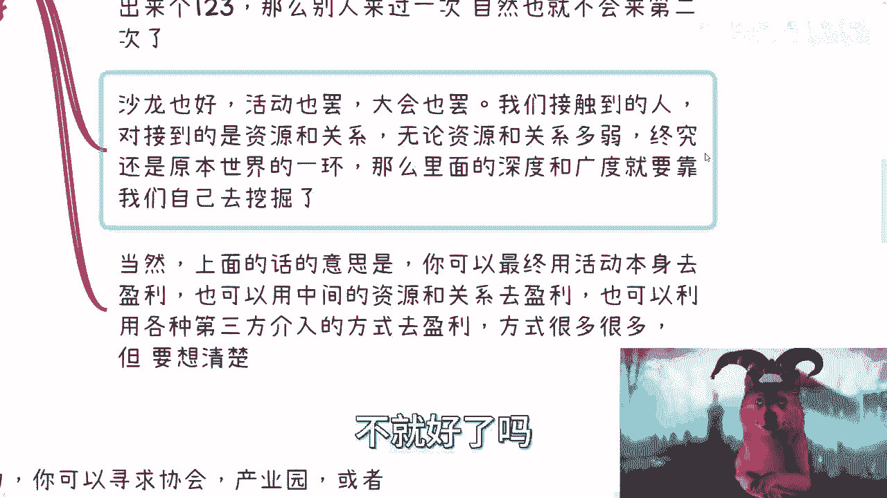
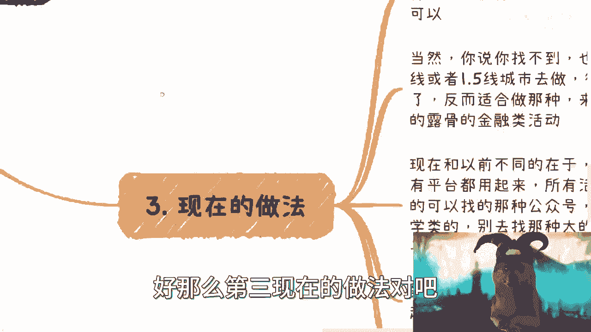
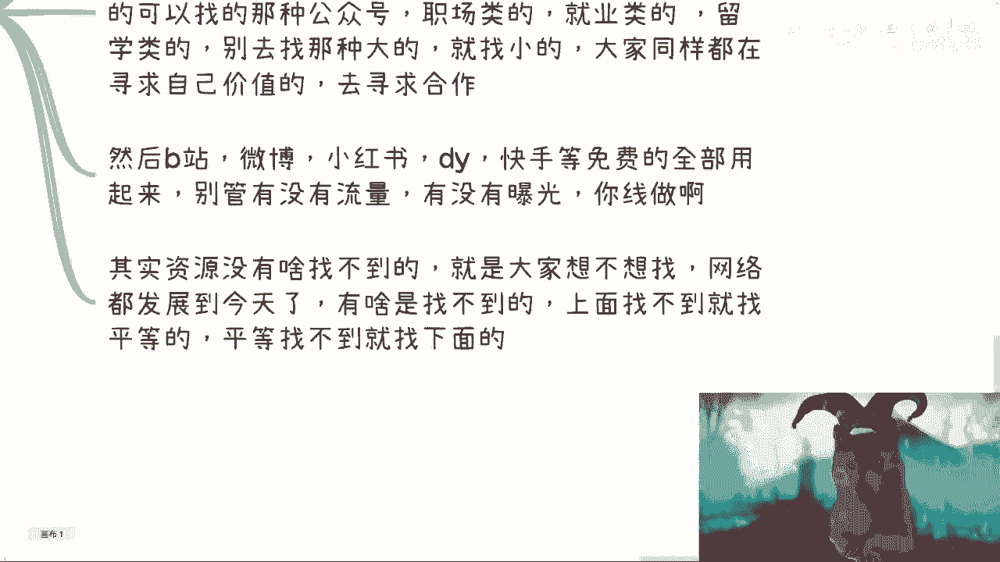
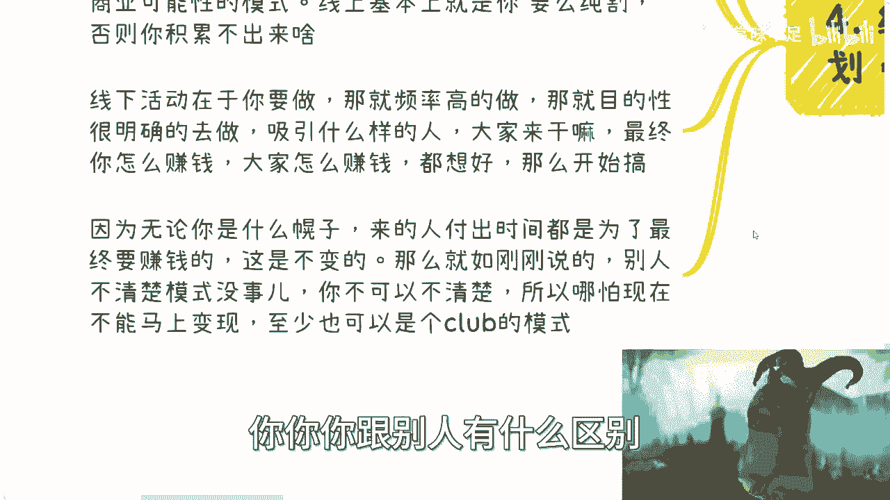
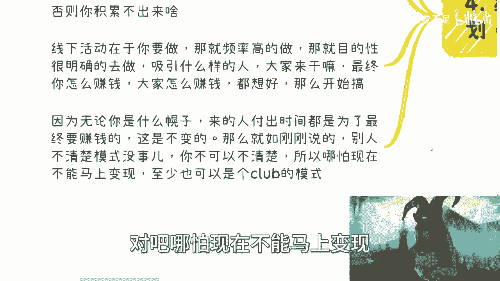
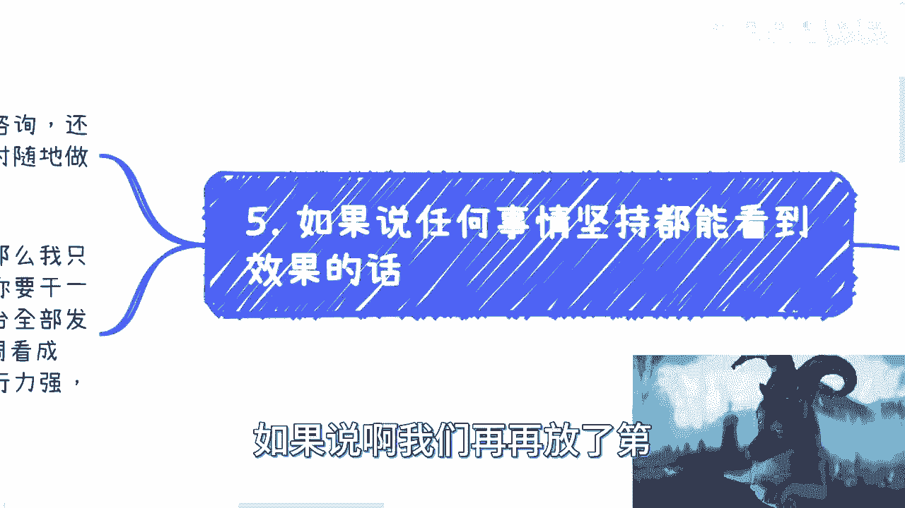

# 沙龙到大会盈利篇1：起步做活动积累影响力等若干问题 - P1 - 赏味不足 - BV1yu4y1W7He

哈喽大家好啊，我今天他妈感冒还没好啊，我今天是只粉色的狗子是吧，嗯然后啊，就是我们上一期这个内容已经结束了是吧，那我先开一期啊，就是沙龙道大会啊，这个盈利篇，然后起步做活动，积攒影响力若干的一些问题。

我先把呃做一下前期提要呃，我本来呢这个地方写的是个人沙龙跟个人起步，但我后来想了一下，其实很多时候啊其实是这样子的，嗯这么说吧，很多时候个人做一件事情跟你今天是一家企业，比如说已经五六百元的企业。

或者是一个资本家做一件事情呃，大家的目的其实都是一样的，只不过你们用的手段会不一样，因为你们有的东西不一样吧，我举个例子，比如说比如说今天你要一个东西对吧，那你说最底层老百姓他怎么办，他说我自己去弄。

我自己去买对吧，我自己跑腿对吧好那往上一层呢，他说我找个同城快送对吧，同城快送好，你再往上，那时候我可以无人机对吧，那你无人机往上可以直升机对吧，就是你很多时候你会发现，大家的目的是一样的啊。

但是你这个手段不一样，但是为这个嗯，所以说我为什么把这个个人去掉，是因为你会发现就是沙龙也好，大会也好，展会也好，很多东西它并不是一个只有对于老百姓来讲，说哎这个东西好啊，这个东西可以做。

并不是你今天就算是比如说医疗对吧，或者说金融，或者其他的各种各样的这个这个这个大厂对吧，或者企业他也有啊对吧，你更别说传统行业了，我靠这展会沙龙大会不要太多，对不对，那按照如果来说，按照我们的逻辑说啊。

这个东西只适合老百姓，只适合个人，那这种企业就不要做了，这种企业做它干嘛又不赚钱，那所以说事实证明它并不是这样子，对吧好呃，那我们来看啊，前情提要，前情提要呢就是说从长远角度来讲啊，流量永远是王者啊。

无论你做什么，你有了流量，你就有一定的后路，或者说有一定的plan b plan c plan b啊，这个呢海外可能不太一样哦，海外不可能不太一样，但在中国呢你可以说是不变的真理啊。

这个跟你做什么毫无关系，好那这个时候又来了啊，他说这个海外YOUTUBEYOUTUBE对吧，有twitter对吧，你现在这个YOUTUBE和twitter上面的收益也非常的不错啊，这没有错。

但是呢我这个地方说的，这个在中国可能会是不变的真理，是因为呃我们主要讲的是，我们怎么去积累这件事情啊，你要去积累这个事情的手段方法啊，可能比较符合中国的国情啊，不太符合海外的一些国情啊。

那么在互联网兴起的时代呢，就是2000年之后对吧，大家呃你会发现大家其实做了很多次过山车呃，而且最后呢明白了一个真理，就互联网并不能让我们得到我们想要的啊，他只不过是个工具啊，只不过是个工具。

我相信很多人对，因为每个时代的人对互联网的认知不一样吧，你比如说八零后，九零后，零零后，他对互联网的认知就是不一样的啊，那么但不管怎么样，我们最终都会明白一个道理，就是互联网啊，我们会觉得他无所不能。

但是如果你想让他给你面包对吧，给你这个鸡蛋，给你牛奶，那这个可能就比较难对吧好，那么但是呢，由于每一代人对于这个互联网的认知不一样，所以说我们其实很多时候这个信息啊，里面是有断层的，什么叫断层呢。

你比如说啊，你说啊经历了疫情，经历了很多的坎坷对吧，我相信很多人明白了流量的重要性，以及社交的重要性，也就是说真正的资本家，或者说你们在往资本家走的这个路当中，你们会明白关系所有东西背后都是关系没了。

就这么简单对吧，但是这个关系他很多人都渴望有效的社交，有效的资源，那么问题来了，这有效资源有效怎么来呢，对吧呃我们总不能每天在那边想着说啊，这个天上掉下个林妹妹，是不是啊，那么线上大家不能见面。

所有的沟通都是点到为止的，就比如说我给你们讲这个内容对吧，但是点到为止甚至点都点不到。

你们会看到非常多的同质化的这种这种视频，没卵用的啊，那么自然线下就变成了剩下的渠道，但是线下这个东西对于很多普陀普罗大众来讲，它其实是存在一个问题，什么问题啊，就是说很多时候大众面临的问题。

就是我们自己面临的问题，就是我们自己面临的问题，就是大众面临的问题对吧，你比如说大活动为什么很多人不去啊，那很多人在去之前，他就觉得哎呀太贵了，几千块钱对吧，有的人甚至六七千七八千。

我靠我他妈吃饱了撑的去吗对吧，而且我一看名单哦，我去干嘛，我他妈是个nobody对吧，好气的，没意义啊，他觉得别人也不吊自己对吧，而小活动呢大家又觉得没有意义对吧，可能意义不大啊。

这个这这这就就就就这么小的对吧，或者怎么样，我去干嘛呢，懒啊，那么甚至找不到好，所以说你会发现，这个就是普罗大众所面临的问题，就是死循环，就是你问他有没有渠道，有的，那你为什么不做呢。

啊我这个原因那个原因对吧，所以说呢我们说啊，你会发现咱不管他最终什么原因，但是他需求永远在对吧，而这个需求无论是什么任何领域都是刚需，也是零人人性的刚需，这个刚需我指的就是说社交啊，他就是刚需。

只不过呢互联网呢把这个东西放大了，让很多人误以为啊我们在网上参加个什么，比如说一两千人的直播或者几10万人的直播，我们就算社交了，这他妈是个什么玩意儿啊对吧，那到最后就是说你心里你的情绪上得到了满足。

但是你没积累啊，你你我我就这么问你吧，你去看短视频，你看了10年，你看个10年，20年，你看那100年你能积累出什么东西来，你就告诉我哦对吧，这一个道理啊，好所以说呢我们刚刚说就八零后，九零后。

零零后他对互联网有个断层，什么断层啊，就是很多的年轻人，他对线下的活动他是没有认知的，也就是说在他的那个人生观里面啊，他知道有这个东西，但是他也仅仅限于知道这个东西，因为他没有经历过，他没有参加过。

他没有在就是说啊鼎盛时期，但大家就是疯狂的做这种东西的时候，他去参加过，那他不知道，那自然而然的就我们就说嘛，我们是不可能想出来一个我们不知道的东西。

对吧好，那我们来看啊。

第二个就是说我们如果既然找不到，那我们自己来做啊，这个这个地方这么说啊，自己做呢你有很大成本，有没有不知道，我告诉你们没有，但很多人固有思维觉得有对吧，但是呢你的做法跟以前不一样。

因为现在跟以前的时代不一样，好我们可以做，我们可以自己做活动，做沙龙，做ted对吧，做各种模式的活动，但我跟你们讲，你们无论做什么，你们一开始就得想好，你们的最终目的是什么对吧。

就比如说你说我做这个东西，我可能分三个阶段，我最终可能是通过什么东西变现，我在这个活动当中，大家来了之后，我们希望积累的是什么，对不对，很简单嘛对吧，你把你最终目标要想清楚啊。

而且这个目标你要非常的就是叫做什么叫做呃，要要要短平快的，要非常的坚持的去朝着上面去走，而不能有任何的偏差，有任何偏差，你就要把它扭回来，就这么简单啊，然后那么如果比如说你今天做一个活动，你没想清楚。

那么我给你讲开始就是告宣宣告失败，为什么，因为现在人跟以前不一样了，现在都是什么快餐时代，什么叫快餐时代，就是很多人他是静不下心来做事情的对吧，静不下心来思考事情的，那这个事情跟我们没有关系啊。

这是他们的问题对吧，但是他们要不要来你这个活动，我们控制不了对吧好那么大家来了，来了之后，他就china，你也不叫CHINEJY，他可能就是问你，就说唉你这个活动后面想干什么对吧。

唉我问我有没有长期规划对吧，那他懂不懂他有没有积累，和他能不能来问你这个没有任何关系，他作为一个参与者，他就是可以来问你对吧，当然你可以说你不知道没问题啊，没有没有那个那个那个答案规范上面说。

你一定要知道，我不一定你可以说你不知道，但是你不知道意味着什么，意味着就是说你自己如果说不出来个123，那那那我就问嘛，别人还会不会来嘛啊，别人就会觉得卧槽他妈的，我来的是个什么玩意儿，对不对啊。

好那么沙龙也罢，活动也罢，大会也罢，展会也罢，我们接触到的终究是人，我们接触到的终究是人背或者资源跟关系，我们无论资源跟关系多弱，他只要活在这个世界上，这个资源跟关系一定有它存在的道理。

也就是说他肯就是我，我们就说嘛，我们看待这个世界是无数个循环体，无数个小圈对吧，那么他这个资源跟关系，就一定是原本某一个小圈里面的一个环节，否则它就不可能存在对吧，那么这里面的深度和广度。

就是需要我们自己去挖掘的，因为你就像我昨天去那个嘉善对吧，我昨天跟小伙伴聊的时候，跟我朋友聊的时候也在说嘛，就说你所有东西它都是有的，但是呢并不代表比如说别人认识我的时候，他就能知道我做什么。

那你就像现在大家听我视频，能有几个人知道我到底做什么，能有几个人知道我的业务的全貌是什么，不知道对吧，但是从我角度来讲，大家知不知道并不重要，为什么，因为有需求的人，他一定会来问我，而同时没有需求的人。

他也可以从我的言行举止，从我的谈吐，从我的各个思考的角度来去看出来，我到底靠不靠谱，他不用知道我做什么对吧，这就好像反过来说，我今天跟你们讲，我做什么好，吹了一大堆，然后我的谈吐，我的思考。

我的各个方向，人们觉得卧槽，真他妈是个，那有有什么用呢，没有用的呀对吧，所以说啊我们这个总结一下，就是说上面的话的意思是什么，就是你可以最终用活动本身去盈利，你也可以用中间的资源和关系去盈利。

你也可以利用任何第三方的资源，介入的方式去盈利对吧，也就是说方式很多很多，但是你要想明白，你得想清楚，你再走出这第一步，当然你按我的话讲，你根本不用想，为什么，因为活动这个东西我存在期嘛，我是上百年。

我不说对吧，这个三四十年肯定有吧对吧，你从最早的时候很多的活动，传统制造业，我靠这种活动多了去了，他只不过可能不像现在这样子对吧，那你想想看活动对吧，有的有的是通过什么什么什么什么club来盈利的。

有的通过麦麦克盈利的，有的通过资源对接盈利的，有的可能通过比如说什么申申报项目，盈利的很多很多方式，你别想了，你就去找啊对吧，你就看中国现在活到现在，还有哪些活动是做的比较好的，什么大会做的比较好的。

怎么分会做的比较好的，你去往前推个10年20年，看看人家怎么做的，看看人家历史怎么做的，你不照抄吗，不就好了吗。

对不对，好，那么第三现在的做法对吧。

那我们一直说借力打力啊，我说你如果能脸皮厚，找协会，主要产业园或者你身边的小伙伴开公司，你别老是感兴趣，我喝什么，我喝一点点，我就明确告诉你，我每次下面都会有人问，我也不知道你在喝啥是啊。

那么或者就是说中小型企业等等对吧，你你都可以啊，这个就看你能不能找得到嘛，那当然了，你说你找不到也不是不行啊，啊那么但是你如果找不到，那我觉得你办呢，不管怎么样，你也得在就至少在一线或1。

55线城市去做，因为这种地方比较好聚人对吧，你往下再往下呢，不太适合做这种活动，反而适合做哪种活动呢，来来来对吧，我来给你们做个table对吧，七天多少收益，14天多少收益，31天多少收益对吧。

你越往下沉，我跟你讲，中国就越适合做这种露骨的金融类活动，好了哎说到这又有人又要有人说了，就说刘老师啊，这个东西不合规啊，诶我就奇了怪了，说不合规啊，那你跟我说说看他不合的哪条规呀。

啊你都跟我说他说的不合的哪条规呢，对吧，如果单纯我只是说七天多少收益，14天多少收益，31天多少收益，怎么了呢怎么了呢，有什么问题呢对吧，你又不知道我是什么产品啊，是不是啊，别老自欺欺人。

你知道吧啊那么现在跟以前不同的地方呢，如果你真的要做啊，那么就是说你所有平台用起来啊，你现在互联网这么发达，比如说活动型啊，我跟大家说的各种平台啊，公众号啊，职场类的，就业类的，留学类的，那当然了。

你别去找那种十几万十几万几10万的这种，你就找找跟你跟我们大家差不多的啊对吧，比如说做个几百几百粉丝的，几千粉丝的，就找找同类的嘛，你大到找不到，找小的呗，对不对，你晓得多找几个帮你一起宣传训练。

怎么了呢，大家都是老百姓，大家都是起步做事情了，怎么了，那就不能互互帮互助了对吧，你找别人，别人拒绝你也没关系，多找几个嘛，是不我就不信了啊，找100个100个都拒绝你，我不信赖啊。

我相信中国老百姓是很淳朴的是吧啊，那么然后呢，B站微博小红书抖音快手对吧，所有的免费嗯平台你能用起来的都用。

对吧好，其实呢资源也没啥，找不到人啊，其实我就跟你讲，真的就看大家想不想找，已经执行力到不到位，网络都发展到今天了，有啥找不到啊，上面找不到就找平等的平等，找不到就找下面的。

太真的是是吧好，那么第四点，第四点就是，第四点就是线下活动在于坚持和长期规划啊。

千万别急于求成啊，其实线下活动呢，在我看来它是一条独立的商业险啊，也是降维打击的，就很多人对线下有误解是什么呢，哎呀难难做对吧，没有线下来的快没有错啊，这个是对的啊，但事实上线上你要做。

你要衍生到线下很难，就我说的衍生是那种可持续性的，就不是那种比如说明明星粉丝见面会啊这种啊，这个线下从属性上来讲，它才是真正能够碰撞出这个商业可能性模式的，你线上就像我刚刚说的，你看个10年直播。

你能你能看得出什么东西来，对不对，当然我不是说你不能做，你要么就是纯去割你短平快，你想好怎么割，没问题，那一定是线上效率高对吧，你但凡说我想积累一些东西的，我想长期发展的，那不好意思啊。

没有没有什么从线上开始做的，没有的，你一定是线上可以开始做，然后呢以线下为主，线上为辅去做的，没有没有什么纯以线上为为为主去做，很少很少的对吧哦，你别来跟我说直播带货，直播电商这种，哎那我就问你嘛。

直播电商直播带货是他妈的以前什么都没有，就他妈的直接线上出来的，有未来，不是的呀，你这些货这些东西它不是都有这么多年货物，线下的积累，品牌的积累，互联网的发展，他才有今天的啊，哦是他突然之间跳出来的吗。

不是呀，对不对，但是你作为一个人，你说我今天想要做个东西，或者你作为一个刚起步的创业公司，你说我要做个东西，你说我现在上去做，你如同如同大浪淘沙，如同大海捞针，你你你跟别人有什么区别。

对不对，没有的呀，那么线下活动在于你要做那么频率就要高，你知道吗，你不要那种温水煮青蛙，说看似做了对吧，哎呀刘老师，我做了我一个月做一次，我他妈做你叉叉，是不是啊，你频率要高，你目的一定明确了之后啊。

我跟你讲吸引什么样的人，大家来干嘛，所以说你怎么赚钱，大家怎么赚钱，来的人怎么赚钱，对不对，你都线下了，那一定是个小组织，你不可能说我做个线下的活动好，我的目标是先做到1万人，卧槽这这你做个屁对吧。

你肯定是第一目标，我先做到100人，卧槽线下你能吸引到100人，这100个人背后的东西很多很多啦，对吧啊。

因为我跟你讲，你无论什么幌子来的人，他都是付出时间的，他付出时间最终都是为了赚钱的，不管他嘴上怎么说，对不对，那么就如我们刚刚说的，别人不清楚模式是什么，你不可以不清楚对吧，哪怕现在不能马上变现。

那至少也是个club，大家一起滚雪球的模式吧，对吧好。

那么如果说啊我们再再放个第五点。

就如果说任何事情坚持都能看到效果的话，线下的东西无论是展会活动咨询，还是说还是说白了你今天摆地摊对吧，怎么样子对吧，当然你摆地摊也得摆出个有社交属性的东西，你不得说啊，我就是卖东西，那那那那没用对吧。

因为你卖东西走的是零售，你零售跟你做会做社交这两个不同的道路对吧，那么你做线下永远是什么，永远是效率最高，以及随时最低能做出能做出调整的，那么如果有些小伙伴说了，他说我做了，那不得用啊不行。

那么我告诉你们，最大的问题就在执行上面，你做事要果断，你要干一个活动，对不对啊，你要干一个活动，想明白，找场地出出题，做海报对吧，全部平台全部发一遍，找合作方，你效率要高啊。

这些事情我觉得这一个礼拜最多了，就你一个人一个礼拜最多了，怎么了呢，这是能画能有难度吗，我就问这事有像你们做数学题，做高数这样有难度吗，没有呀，他靠的就是执行呀，不能懒啊，你不能说我坐个半个小时啊。

我去打2分钟游戏出去散个步，那你是不缺钱对吧，你也不想积累对吧，然后你一周做好，接下来就放放出去啊，放逐之后一周看效果啊对吧，你一说我就一周后的活动，然后活动去了，不管多少人，结束之后开始复盘。

然后马上第二期，对不对，你执行力要强啊，目标明确啊，然后这样你才会出滚雪球效应啊对吧，我觉得我真的，我有时候觉得。

互联网这个东西，是真的是给太多人下了一个毒药，这什么毒药呢，就是就是一急于求成，总觉得互联网上面是最快的，线下是慢的，第二呢线下快不快取决于你怎么做，但是很多人呢他就说嘛是要快的，但是他没有执行力。

你知道吗，就他做的事情其实很慢啊，然后他很着急，就说哎我这个东西怎么样怎么样，但是你真的看他做事情吗，没有章法的啊，一点都不快，快不起来，那你按我的说法是什么，你就定定好目标对吧。

做比如说每隔两天做一个，怎么了呢，每隔两天就做就做呀，有什么不好做了，你说没嘉宾没关系啊，你自己就嘉宾啊，来了之后大家大家讨论啊，对了，你只要掌控好节奏，掌控不好节奏也没关系啊，花个567锻炼掌控节奏。

那总可以吧，怎么了呢，我就请问你损失什么了，对吧哦，你要是告诉我吕老师，我的目标就是要增加我自己的影响力，增加我手上的筹码对吧，要在未来赚钱，那这些事情对你来讲算什么呢，对不对，你损失什么了。

你最多损失点面子对吧，你最多让别人觉得哎呀，这个人好像那个不成熟啊，这个人好像不专业，但是没有关系的人多了呀，一两个人觉得不专业，五六个人觉得不专业，哪怕100个人觉得你不专业怎么了呢，对吧。

你觉得是这些人看你的眼光重要，还是你要从0~1走出去重要呢，对不对，就我觉得这真的就是唉就轻重缓急，你知道吧，然后哪些是重要的，哪些是不重要的，我觉得这就很多人分不清楚，他很奇怪，那我就知道吗。

就很奇怪，我也不知道为什么，好吧行吧，那么这一期呢主要就是说我给大家开个头啊，开个头后面我会跟大家把它拆开来说呃，这个东西啊其实也蛮蛮复杂的，说起来啊，反正我跟你们拆开来说吧，好吧行，那先这么着啊。

那个有什么这个副业相关的好吧，或者说这个创业相关的，或者你们手上有什么商业的单子对吧，有什么case或者说合同不知道怎么弄的对吧，反正就是只要跟任何搞钱和商业有关的，你们不清楚的啊。

或者手上牌不知道怎么打的，那么你们整理好。