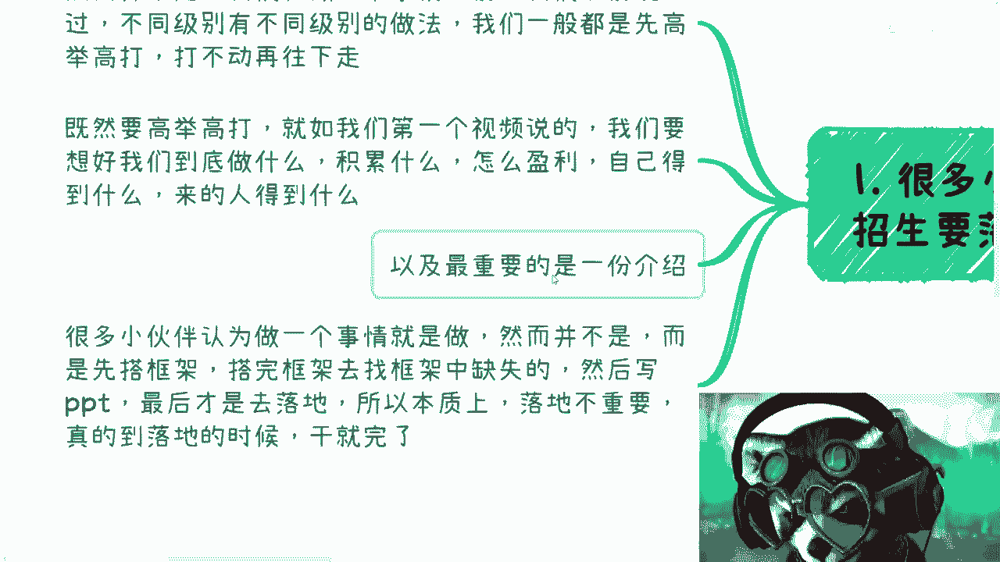
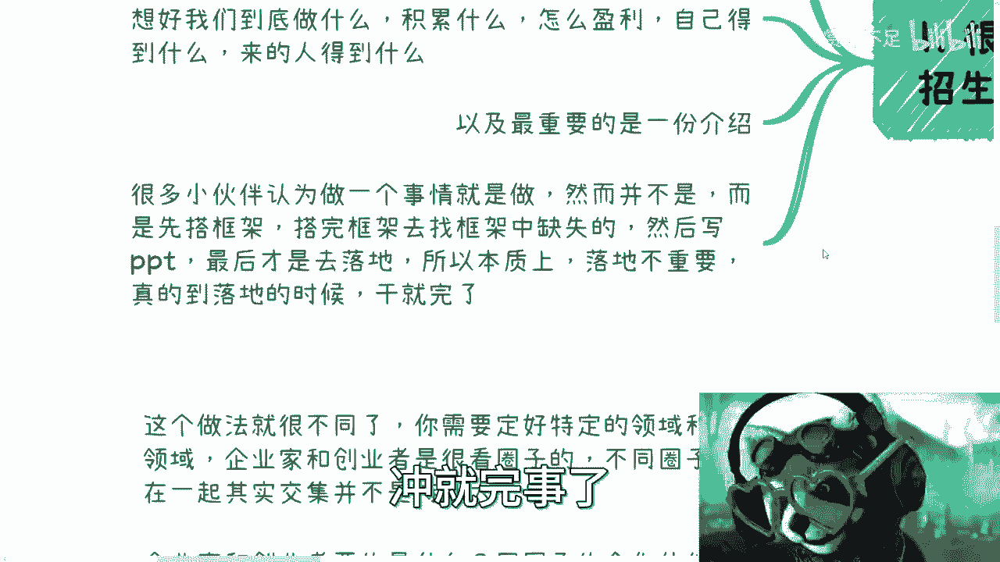
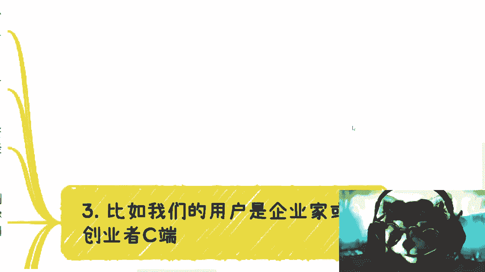
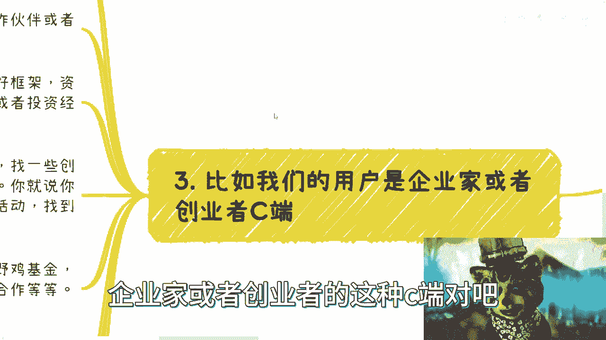
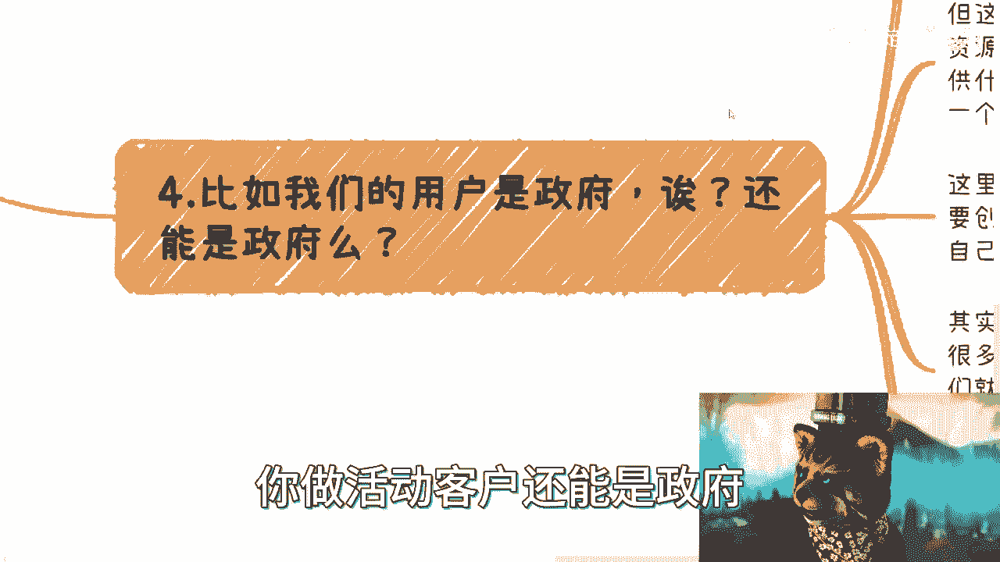
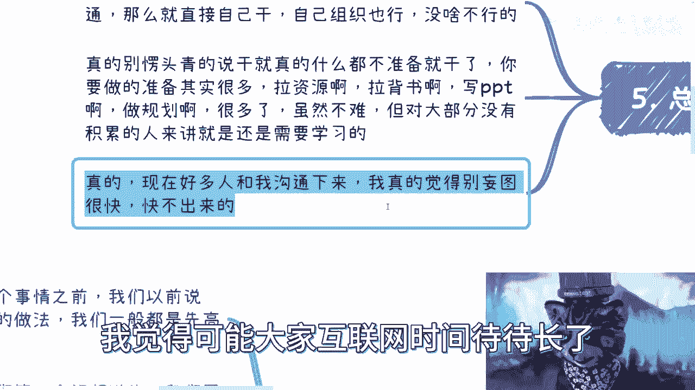

# 沙龙到大会盈利篇2：基于不同目的的沙龙0到1 🎯

在本节课中，我们将学习如何根据不同的目标受众（C端用户、企业/创业者、政府端），从零开始规划并落地一场沙龙活动。核心在于理解“高举高打”的策略，即先进行顶层设计和资源整合，再逐步落地执行，而非盲目开始。

上一节我们介绍了沙龙活动的大框架，本节中我们来看看如何针对不同目的进行具体的0到1规划。

## 核心理念：从“高举高打”开始

很多初学者认为活动的“0到1”就是立刻开始招生、宣传和落地。这种想法并不正确。

做任何事情的第一反应应该是“高举高打”。因为高举高打如果行不通，你还有退路可以调整策略；但如果一开始就采用很基础、很接地气的方式，一旦失败就没有退路了。我们通常采用阶梯式策略：先尝试高层次的玩法，不行再逐步向下调整。

正如第一个视频所说，一开始就必须想清楚：**活动做什么、积累什么、如何盈利、自己得到什么、参与者得到什么**。在准备阶段，你需要一份完整的介绍材料，无论是Word还是PPT，最终都会转化为PDF文档。

很多人认为做事就是直接行动，然而并非如此。你应该先搭建整个事情的框架，找出框架中的缺失部分，补充或落地一部分后，再去撰写详细的PPT或PDF，最后才执行落地。本质上，落地本身并不最重要，因为前期铺垫和准备完成后，后期只需努力执行。事在人为，成事在天。

## 针对C端用户的沙龙规划

面向个人消费者（C端）举办沙龙，不能随意应付。即使参与者是散户，不会索要商业计划书，你仍需制定周密的计划。

做C端沙龙的盈利点主要在于：
1.  **帮助产品或服务分销（带货）**：在积累一定C端流量后，为其他产品或服务进行分销。这不仅是带实体商品，也可以是软件服务等。
2.  **直接向C端收费（知识变现）**：通过漏斗模型，将沙龙参与者转化为付费用户。

这两种本质都是销售，区别在于一个是卖别人的产品，一个是卖自己的服务或知识。

参与者能得到什么？这取决于你的沙龙定位。你可以帮助他们：
*   认识更多人。
*   对接更多资源。
*   提供一个持续的俱乐部或平台。

活动本身是短暂的，关键在于你能否提供**长期价值**。例如，除了线下活动，还能提供线上交流、季度性服务、工作推荐、资源对接等增值服务。这能解决“C端为何要持续参与”的问题。你需要告诉大家，他们加入的不是一次活动，而是一个**圈子**。

这种做法本质上是**社群运营**。你可以为其取一个高级的名字，如“私董会”、“副业俱乐部”等。

以下是操作的核心流程：
1.  列出你能为C端提供的具体服务清单。
2.  一边运营社群，一边打造个人品牌或社群品牌。
3.  适时对接小型企业（小B端）的服务，进行流量变现。

整个逻辑就会变得清晰流畅。

## 针对企业端/创业者的沙龙规划

面向企业家或创业者的沙龙，做法与C端截然不同。这两类人群可归为一类，他们非常看重圈子。

首先，你必须定好**特定且细分的领域**。不能将不同行业的创业者混在一起，因为资源依附于圈子，跨行业圈子交集小。其次，他们核心需求是：**同圈层的合作伙伴、融资机会、投资方、以及政府或权威机构的背书**。

即使你作为大学生起步，看似一无所有，也完全可以操作。以下是具体步骤：

1.  **寻找投资人资源**：参加各类资本会议，主动接触其中的个人投资者或小型基金，建立联系。
2.  **寻找行业伙伴**：锁定特定行业（如互联网），找到相关的创业沙龙、孵化器、程序员社区等。联系其商务人员，以“某创业活动创始人”的身份，带着你的活动介绍（PDF/PPT），寻求冠名或合作机会。

通过以上步骤，你可以初步整合投资人、基金、创业孵化器、产业园等资源。拥有这些背书，你的活动就有了起步的资本。

对于企业家的长期计划，可以提供非常多的服务，例如：资源对接、培训、投融资服务、出海咨询、税务法务等。

关于“被跳单”（客户绕过你私下交易）的问题，关键在于提升专业度和主动性。跳单往往是因为你显得不够专业，无法提供足够的安全感。你需要：
*   通过言行举止建立靠谱的形象。
*   主动跟进客户，加微信后积极邀约深入交流（如吃饭、喝咖啡）。
*   明确你的撮合角色和价值，让对方觉得通过你能更高效地达成目标。

## 针对政府端（To G）的沙龙规划

以政府为客户举办活动是完全可行的，但这套逻辑与前两者不同。

To G沙龙更像是你整合了一批兼职伙伴和专家资源，撰写一份专业的PPT方案，向政府展示你的能力。你不仅承诺能办会，还能提供相关的老师、专家等资源。目标是打造一个专门面向政府的会务、培训活动服务品牌。

这不一定需要全职创业。你可以注册一家公司，将其作为副业运营。地方政府、各部门、协会、产业园每年都有大量的活动需求，他们缺乏的是**垂直领域的专业供应商**。例如，一个科技产业园会更倾向于寻找懂科技金融的会务公司，而非通用的活动公司。

操作关键在于关系链和精准切入。你可以：
1.  撰写专业的方案PPT，整合你能调动的资源。
2.  主动对接**新设立的经济区、示范区、产业园**。这些新机构处于发展期，有需求且合作门槛相对较低，比对接“老油条”部门更容易成功。

## 总结与核心要点

本节课我们一起学习了针对C端、企业/创业者和政府端三种不同目标，如何从零开始规划一场沙龙。

核心策略始终是“高举高打”。这些方法并非唯一，但高举高打的好处在于：如果高端路径走不通，你完全可以退一步，依靠已整合的部分资源，以更直接的方式落地执行。最忌讳的是毫无规划、不做包装、不拉资源背书就愣头青式地蛮干。

所有成功的事情都需要沉淀，欲速则不达。在0到1的阶段很难快起来，但前期整合资源、撰写方案、建立联系的铺垫工作并不难。难点往往在于你什么都没有准备，仅凭口头描述去沟通，自然难以取得信任。

**核心公式可以概括为：成功沙龙 = 明确目的 + 顶层设计（PPT/方案） + 资源整合（背书/伙伴） + 阶梯式执行 + 长期价值提供。**

记住，你是在搭建一个系统，而不仅仅是举办一次活动。