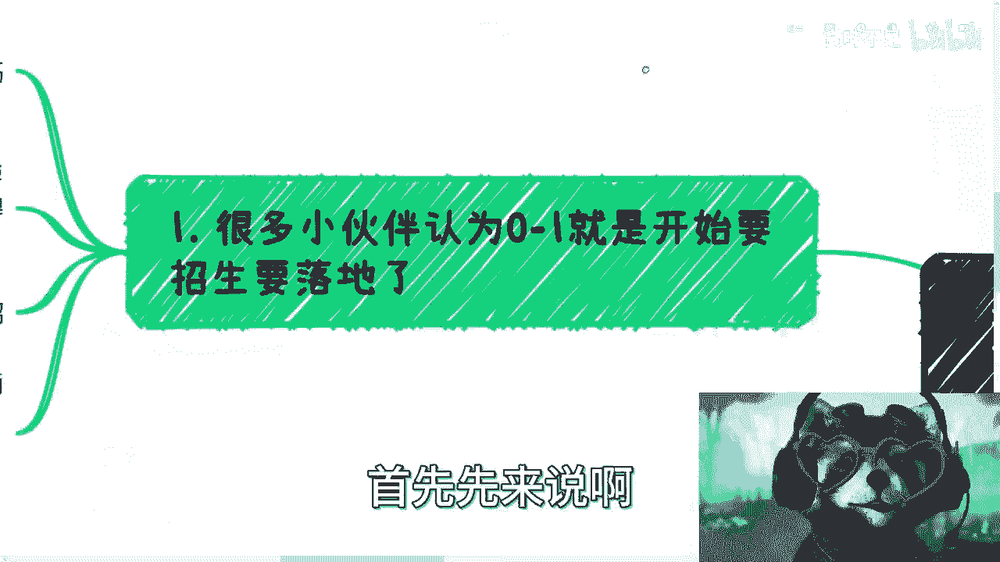

# 沙龙到大会盈利篇2：基于不同目的的沙龙的0到1 - P1 - 赏味不足 - BV1U8411k7P9

好大家好嘶，我怎么觉得今天这个头像嘛这么厉害啊，不行不行不行，等一下让我换一个啊，马超厉害，搞啥玩意儿啊，完了完了完了，这道具是完了诶，可以可以可以可以，等一下让我挂个道具啊，挂挂个道具，添加。

添加对吧，然后我刚刚挂了个什么。

我还挂了个什么，挂了个耳麦好可以了，呃，我们接下来讲第二期啊，就是这个沙龙道大会盈利片二啊，那么之前上一期已经把这个整个大框架，我跟大家讲了一下对吧，那么基于不同的目的的啊。

这个本次呢是基于不同目的的这个沙龙，0~1而不同目的，这个也很简单啊，就是说我待会会在这个地方分开来，比如说我们的用户是C端啊对吧，企业端呢对吧，政府端啊，这样子啊，当然了，我觉得大家主要是要我希望啊。

这个大家主要是要看一下，就是我来做这个事情，我做的这个事情的思路跟你们的这个思路，在这个平时的思考上面有哪些不一样啊，首先首先先来说啊。

很多小伙伴认为的0~1呢就是要开始招生，然后开始宣传，开始落地，呃，其实并不并不是啊，真的并不是，就是你们要记住啊，做任何东西啊，是这样子的，我以前在有一期视频里面，我说的很清楚，就是做任何事情的。

我们第一反应一定是要高举高打，因为你高举高打打不动你有后路，但是你不高举高打，你一旦上来就很接地气，也不叫接地气吧，就是很就是那种实实在在的去做，那么你一旦做不好，你就没有退路了啊。

所以说嗯我们以前说过，就不同级别的有不同级别的这个玩法啊，我们一般都是先高举高打，打不动再往下走，你知道吗，就是就一步一步来嘛，我们称之为阶梯式对吧，那么既然要高举高打对吧，那也就如我们第一个视频说的。

就是说我们想一开始就得想好，我们这个活动到底做什么，积累什么，怎么盈利，自己得到什么，来的人得到什么，对不对好，那么以及你在做准备的时候得要有一份介绍，我不管就是word还是PPT不重要。

反正你最终都会transfer变成这个那个PDF的啊。

那么很多小伙伴认为做一个事情呢就是做，然而也并不是，也就是说你一开始呢，你比如说你拿这个，你随便拿什么工具吧对吧，你哪怕拿张纸都可以，你先要搭建你的这个事情的框架，你搭完这个框架。

你再去找框架当中缺失的哦，然后你找了找了一部分，或者你落地了一部分之后，你再去写PPT，你再去写PDF，最后再去落地，你懂吗，所以说本质上落地本身并不重要，因为真的到落地的时候，你就干就完事了。

冲就完事了。

因为前面你该做的铺垫，该做的准备都做了，至于后面怎么样，事在人为吧。

就是就是事在人为成，事在天对吧，那后面就再说了啊。

那么比如说啊这个我们的用户是C端对吧，好，那么首先并不是说用户是C端，就可以随便应付啊，那么很多人就觉得哎呀我用户是散户对吧，那他们也不可能来问我要什么商业计划书对吧，要什么东西。

他妈我就他妈的瞎叉叉搞对吧，那么该做的计划呢还是要做的，那么你看啊，做C端我们的盈利点在于要么帮助啊，就很简单啊，比如说我们有了一定的C端流量对吧，你说就我们说的这个商单，商单其实是什么。

其实就是带货嘛对吧，那么我们的盈利点，要么就是帮助某产品或者某服务去做分销，也就是所谓的带货，对你甭管带什么东西啊，你带这个微软MICROSOFT的产品也是带对吧，不是说你只能带这种小零食啊对吧。

这个这个这个什么乱七八糟的东西嘛对吧，那么相当于我们要引流啊，那么我们要么呢就是说直接问C端收钱对吧，就是我们说的知识变现相当于漏斗模型，那么这两个东西其实都是卖东西啊，只不过一个就是说是卖别人的。

一个是卖自己的对吧啊，那么来的人呢他能得到什么啊，那么你看啊你面向的人群定位呃，你可以帮助，要么你可以帮助他们认识更多人，要么可以帮助他们对接更多的资源，要么可以提供一个club。

就你就说你就说我提供一个平台，没毛病啊对吧，你看我现在做活动，我就跟大家说，我说的很清楚啊，就是因为大家每个人的认知不一样对吧，你说啊我我做一个活动对吧，我在上面做分享，其实我说实话其实很浪费时间。

因为什么，因为我讲的东西不一定所有人都能明白对吧，那你说哦，你一讲讲半个小时吧，也好像不太好对吧，你讲讲两个小时吧，那人家听不懂的，你让他两个小时干嘛的，对不对，就是说你可以提供给他给大家一个平台。

大家去沟通交流也行对吧，你可以按季度按嗯嗯半年，按一年提供更多的服务对吧，比如说呃你来参加这个活动，但是呢你不仅仅可以参加这个活动，你参加这个活动之后呢，我们会给你介绍工作啊，或者介绍相亲对吧。

或者说其他的就你要给他增值的服务对吧，当然啊呃我们还得面临一个问题，就是C端为什么一直要来，而不是说来一次就不来了对吧，或者说C端为什么要持续关注呢，好那么我跟你讲啊。

这个就取决于你长期提供的服务是什么对吧，因为活动永远是短暂的，你比如说我这周六做的那个杭州活动，那大家来玩就来玩了，对不对，但是问题是大家来晚了，大家能得到什么，大家能得到的是。

相互之间大家有一定的短暂的认识，后面如果有什么，你们可以私下再去碰对吧，你比如说微信语音也好，腾讯会议号，你们自己去碰对吧，而活动是短暂的，但是问题是，他们从你身上。

如果可以得到一些长期的资源或者信息获取，那也行对吧，那么你看我现在做的这个事情，我就是反向的对吧，因为我我比如说我的活动，并不是说因为我现有活动在有网线上的东西，而是说我先有了线上的东西。

而我在给大家做活动，所以说他们来对吧，大家来活动，你说我有没有长期资源给他们，我原本每次的视频和每次的观点，其实已经是一个长期的东西了对吧，那如果说大家来对吧，然后找我说哎我那个吕老师。

我们想要一起合作一些数字经济相关的东西，哎那那那就更好了对吧，那么好，那我们继续来讲，从PPT本身来讲，你做的呢其实就是个社群运营啊，当然你可以取一些高大上的名字，比如说你说哎我做了个副总会吧。

或者我做了一个什么什么什么什么，比如说副业俱乐部对吧，或者什么东西啊，然后呢你列出来给C端的服务对吧，你说好，你们只要参加了我这个活动啊，这个比如每个月的招聘会啊，我会给你们做一些，比如说线上交流。

做一些比如说什么啊，以前有很多啊，就是比如说组织爬山啦对吧，组织易经学习了对吧，就是你可以给他增值服务嘛，因为你最终是一个漏斗模型，你不能保证每一个人对你这个这个提供的服务，都感兴趣。

但是总有人会感兴趣对吧，那么说白了就是你要告诉大家，大家来的呢不是一个活动啊，而是一个圈子啊，那么这种一边做呢，你可以一边打个人品牌，你也可以打你这个私董会的品牌啊，然后呢可以时不时的去对接。

就是说小B的服务做流量变现啊，基本上就比较流畅了，就整个这个逻辑就比较清晰了，你知道吧。

好那么第二种呢就是说我们的这个用户啊，呃我把它放放大，我还想加个东西呀，哎呀这软件真的这软件bug老多了，老不让我换，妈蛋唉，怎么办，换个换个换换换，换个造型，换个造型就可以了。

这bug真的是离谱离谱离谱离谱啊，这样这样比较开心好，我们继续来说啊，说这个这个我们的用户啊，比如说是企业端，企业家或者创业者的这种极端对吧好。

那么这两类我们归为一类啊，这个做法呢就很不同啊，你需要定好特定的领域和细分的领域，企业家和创业者是很看圈子的，就是你别就是说你说啊，我针对创业者对吧好，然后两个互联网的两个医疗的，两个金融的。

两个制造业的对吧，两个什么新能源的唉，我跟你讲不行的，因为创业者看中的是资源，资源看中的是圈子对吧，资源是跟圈子来的，你不同的圈子大家交集其实并不大啊，首先这第一点。

第二点呢就是说企业家和创业者要的是什么呢，你想啊同一个圈子的合作伙伴或者合伙人对吧，当然最重要的还是倍数跟投资对吧，你比如说你说我能够给你带来一些企业叫什么，就是就是政府或者别的东西的一些背书了。

我靠那他妈不要太开心了对吧，那么如果做这种的话，其实我跟你讲啊，你需要提前做好框架对吧，那有很多人就在想啊，哎呀我他妈我作为一个大学生对吧，我是一穷二白，我什么都没有，我跟你讲其实很好做的，怎么做啊。

第一你去参加一些资本的会议，不难吧，对吧好，然后呢，你参加这些资本会议里面，在这些资本会议，在这些资本会议上，你找到一些个人投资者，因为你要这么想的，任何一个会议总归是八二开的，两成是精英。

八成是野鸡对吧，你去找一些八成里面野鸡的这些资本对吧，我不管是个人个人投资者还是基金，你去加他们微信，这总归也能加吧，是不是这种遍地都是，我跟你讲哦，然后你需要找这个行业的一些人。

比如说啊你说你做互联网对吧，好你去找一些互联网的创业沙龙啊对吧，互联网的这种创业的这种孵化孵化器啊对吧，程序员啊这种很多的对吧，然后你到你到那个网站上面去，找他们的商务销售，你就说啊。

你说你直接就说你别哎别别去管，的年纪多大不重要，你就说我是某创业活动的创始人啊，这个活动呢当然你不能单靠说啊，就说这个时候你得你得总归有个PDF或者PPT，的一个介绍啊对吧。

你说我是这个某创业活动的创始人啊，然后呢你说我就想跟你们一起合作啊，然后那个下次活动的时候，能不能比如说这个挂个名对吧，让你们冠个名啊，然后就说怎么样怎么样怎么样嘛对吧，那你在这里面就是筛选嘛。

比如说你找十家，有那么两三家愿意的，那也够了对吧，那么至此啊，你基本上可以有投资人，甚至某些野鸡基金对吧，然后还有什么创业沙龙啊，或者孵化器啊，产业园啊等等合作对吧，你基本上套那么几个。

你不是马上就是崛起了嘛，对不对，雄起了嘛，是不是啊，当然长期计划，那你得定好，就企业家的长期计划很多哦，企业家可以做的东西很多，就是比如说资源对接啦，培训啊，投融资啦，出海啦，税收啦，法务啦。

各种各样的服务都可以提供，对不对啊，那么那说到这啊，那么很多小伙伴以前跟我说过对吧，他说我们要被跳单了，怎么办，我跟你说啊，我曾经一直说的很清楚，就是任何一件事情是看你怎么做的，你懂吗。

就是跳单意味着什么，跳单意味着你不够专业，跳单意味着你给别人的安全感不够，对不对，跳单意味着你你可能言行举止，各个方面让别人觉得你很不专业，那人家只能私下里去谈了，对不对，那你怎么办呢，那没办法怎么办。

没有办法，你只能不停的增加你的专业度，你要让别人觉得你的弹性言行举止是靠谱的，同时还有一点就是你得你得你得主动，你要不停的去主动，就是来的这些人，尤其是你要比如说你的客户，如果是企业的话。

你就不停的要去主动啊，就是加完微信，然后请吃饭，要么要么就喝咖啡深入去聊啊，你不能说哎呀我好像搞了个东西，我又没什么东西，哎呀，我就跟他们聊两句，没什么东西聊了，那人家他妈的，你想想看。

你换你就换位思考啊，如果你今天办一个活动，我来了，我就发现哎呀这人加了个微信啊，也没说自己做什么东西啊，也不主动聊，那我来干嘛的了，我来是为了寻求服务的，我来就是为了赚钱的呀，你不撮合。

OK那我自己去找的，我管你怎么读啊，我是资本家呀，唉想看就知道是不是好，那么第三点啊，就比如说我们的用户是政府诶，我跟你讲啊，这个时候就来了，哎好玩了对吧，就有人会说了啊，你做个活动啊。

你做活动客户还能是政府。

哎我跟你讲，还他妈真可以啊，就是这个看资源，因为其实呢并不是不行，当然这个逻辑跟之前那两个逻辑就不太一样，因为之前两个呢是打一个打个人品牌，一个打沙龙品牌啊，有呃基本上是一个阶段性。

或者有每个阶段性的变现逻辑，但是这个不一样，这个更像什么呢，更像就是说你组了一些兼职的小伙伴和资源，然后呢这个这个叫什么，就是糊了一个PPT对吧，就是画了个饼啊，然后呢告诉大家，比如说你有班会的经验。

你有给政府办会的经验啊，然后呢能提供什么老师啦，专家啦，也就是说你不单单能办会，你还能提供资源，对不对啊，然后呢你可以打造一个专门的to g的会务啊，培训活动的这么一个服务企业。

那么这里呢为了大家不要误解啊，我又打错了啊，这个不重要啊，为了大家不要误解啊，我还是说一句呢，就说这也不是说一定要创业啊，因为你其实只要写好一个PPT，你注册一家公司就好了对吧，你自己你说你有个主业。

打打工也行啊，无所谓啊对吧，这跟这个事情不见得你一定要创业的，那么其实各个地方政府啊，各个地方政府的各个部门，我跟你讲，这种需求其实很多的，包括这种需求其实很多的是在什么协会啊，产业园里面。

反正一年呢必须大大小小的这种活动很多，很多啊，他们其实缺供应商，或者这么说吧，其实供应商本身也的确不缺，但是呢他们缺的是那种垂直领域的供应商，因为你想嘛就是就是就是比如说数字经济对吧。

或者说科技科技金融对吧，对某个产业园，他比如说就是做科技的，那他当然是希望就是说更偏向于这种，科技金融的会务公司对吧，或者说这种服务商来做，但他不可能去找一个通用的这种做会的对吧。

人家说哎呀我专门办会的，我他妈办了五六百百场会，那政府问他，你办的什么会哎，我办的都是那种他妈的直销会销的，那么政府要你办干什么对吧，但是问题是他可能找不到更合适的啊，那么这种东西我们就可以去切。

那当然了，这个就是看大家关系链，你可以写好些PPT，稍微凑凑资源，然后就去找什么产业园，新的经济区对吧，或者什么示范区就可以谈，我跟你讲这种其实很好谈的，你知道吗，就是你找那些老的的确不好谈。

因为他们可能老油条了，但是你去找这种新的，他们很好谈，因为他也是刚起步啊，他也要发展啊，对不对，那对他来讲，你你是个供应商，他为什么不要你呢，对不对，那么总结一下啊，就如我就如我说的啊。

就是说这些呢都是高举高打方式啊，也就是说这些东西并不是说啊，只有我说的这种方式，你们可以用无数种方式，但是高举高打的好处就在于，你实在走不通这条路对吧，那么你也可以直接自己看自己组织对吧，就直接落地。

直接直接冲对啊，那也没问题啊，但是呢你就真的别愣头青的，就是其实我发现很多小伙伴跟我说，哎我刘老师我干了干了这个不成功，那个不成功就是什么意思呢，就是你别真说干就什么就不准备你干了。

你干一件事情你要有规划，对不对，你干一件事情你要有包装对吧，你要准备的东西其实很多，拉资源啊，拉背书啊，写PPT啊，做规划，就像我刚刚在在，在前面给你们分开来分析的时候对吧，你要去拉的呀。

你能拉多少算多少呀对吧，虽然我跟你讲就是不难，但对于很多没有这类人来讲呢，就是你还是要去学习的，还是要去一开始接触做铺垫的对吧，就是我就跟你们讲啊，所有的事情不是真的，你就是就是我觉得。

可能大家互联网时间呆呆长了对吧，或者说短视频看多了对吧，或者说这种快餐式的东西看多了，就是就是真正的你想去做东西，你要有沉淀，你是欲速则不达的，这不可能快的起来的，你知道吗，你快不起来对吧。

当然就是说你以后你说我我办了，比如说两37347快来行不行行，为什么，因为你有铺垫，你有积累，但是你0~1的时候，你快不起来的呀，对不啦，没有办法的呀，但是你想想看，你真的去拉一下自己。

难拉不拉不难拉的呀是吧，你难了是因为什么，是因为你跟他讲的时候，你又没又没PPT，又没介绍，又没有什么东西，你什么都没有，你就跟他靠靠嘴说你怎么拉法，就是一样的道理呀，好吧行。

那这个就说到这吧，哎呀行，就这样吧，大家反正一样的啊，有有这个副业对吧，赚钱的啊，然后手上牌不知道怎么打的啊，然后这个这个商业上规划，可能碰到一些问题的对吧，可能这个吃不准的拿不准的好吧。

