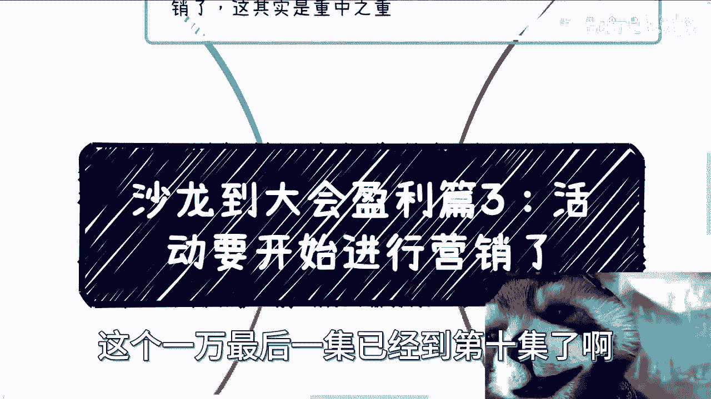
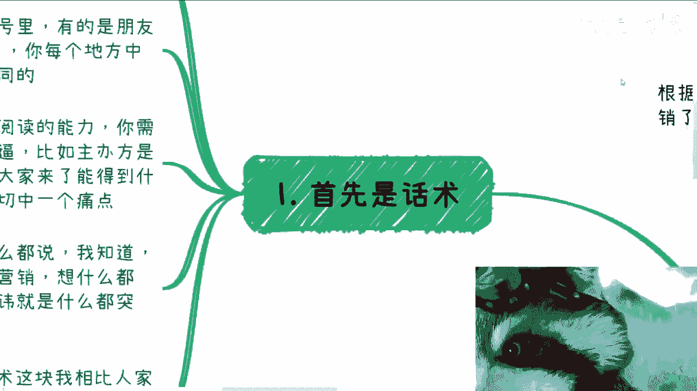
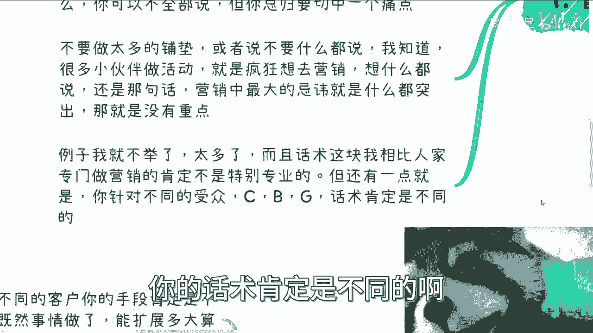
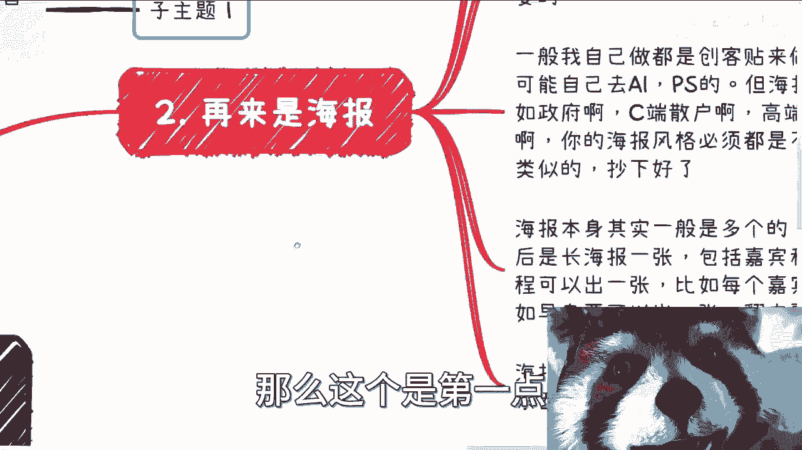
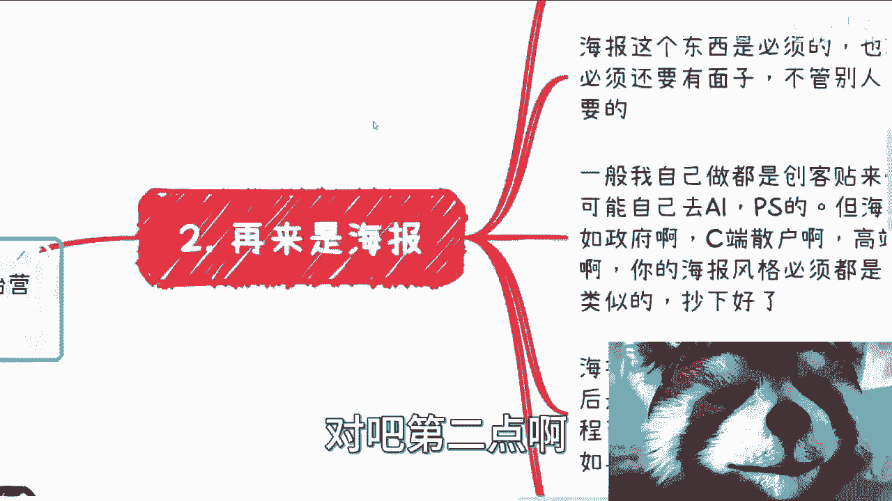
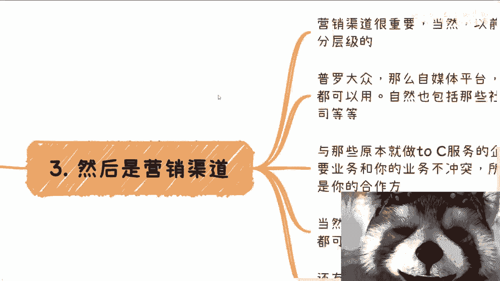
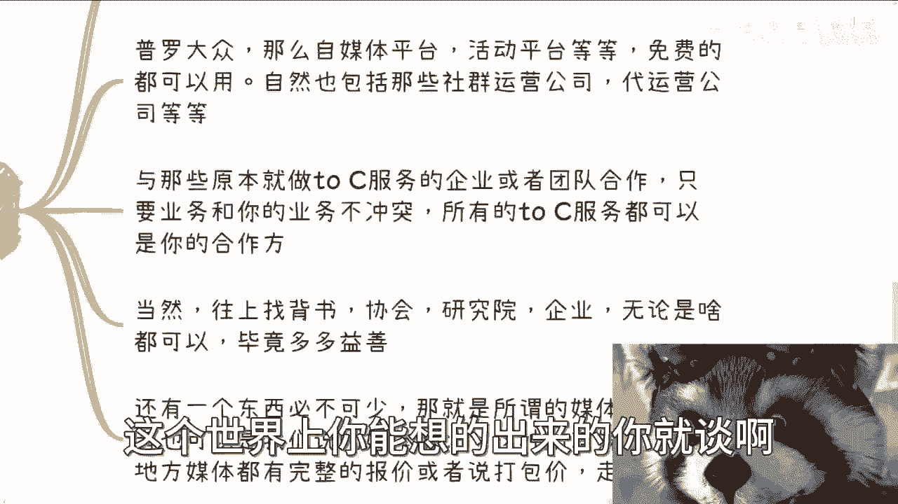
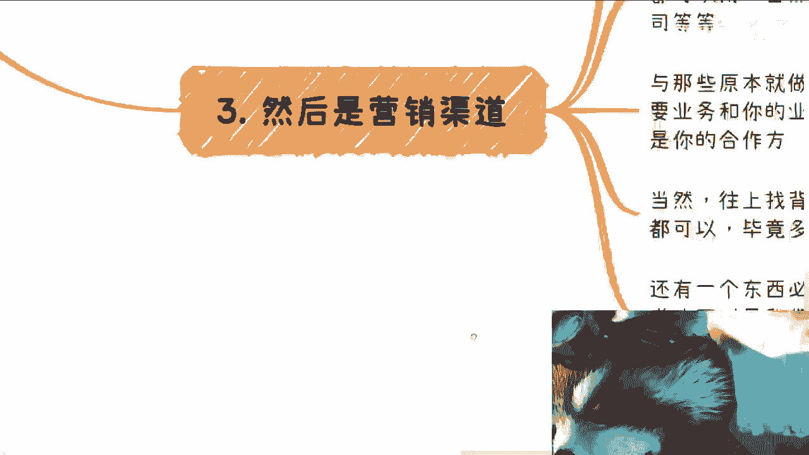
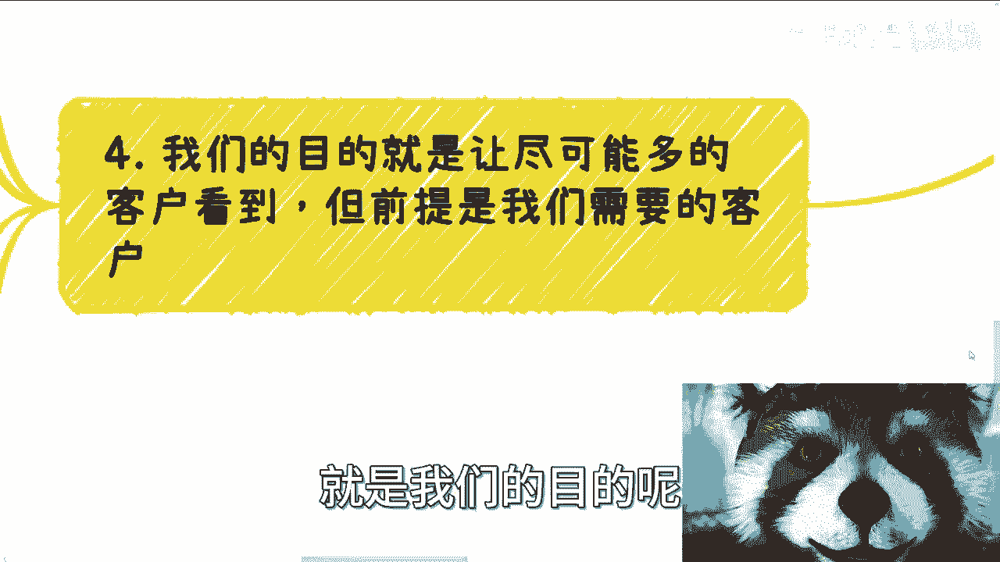
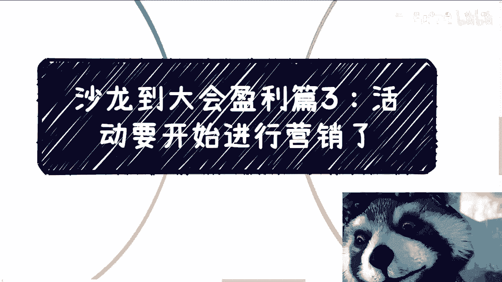

# 沙龙到大会盈利篇3：活动开始前最重要的环节——营销 📢

在本节课中，我们将学习活动开始前至关重要的营销环节。我们将探讨如何通过精准的话术、吸引人的海报、有效的渠道以及明确的目标，来吸引并筛选出我们真正需要的客户。

上一节我们明确了活动的定位，本节中我们来看看如何将定位转化为有效的营销行动，为活动的成功举办铺平道路。

## 1. 话术设计 ✍️

话术是营销的基础，它需要根据不同平台的特点进行定制。以下是设计话术时需要注意的几个要点：

*   **平台差异化**：海报、公众号、朋友圈、小红书、抖音等不同平台，需要使用不同的话术。不能偷懒使用同一套内容。
*   **内容精炼**：现代人阅读能力有限，话术不能太长。需要快速传达核心信息。
*   **突出核心价值**：话术需要清晰地告诉潜在参与者：主办方是谁、有哪些嘉宾、参与者能获得什么。必须切中至少一个痛点，让活动对参与者有意义。
*   **避免信息过载**：营销最大的忌讳是试图突出所有内容。没有重点，用户就抓不住重点。你需要比你的客户想得更清楚。
*   **客户针对性**：针对不同的客户群体，话术必须有所不同。不能简单地复制粘贴。

## 2. 海报制作 🖼️

海报是快餐时代最容易被大众接受的信息载体，是活动的“面子”，必须重视。以下是制作海报的关键点：

*   **风格明确**：针对政府、C端散户、高端私董会、企业家培训等不同受众，海报风格必须不同。不能偷懒套用之前的模板。
*   **工具选择**：可以使用“创可贴”等简单工具制作，无需复杂的设计软件。
*   **海报矩阵**：海报通常不止一张。可以包括：
    *   主KV（主视觉）海报
    *   长图海报
    *   嘉宾及议程海报
    *   单独议程海报
    *   嘉宾个人邀请函
    *   早鸟票海报
    *   倒计时系列海报
*   **分发利用**：每制作一张海报，都应让对应的嘉宾或合作方进行转发，扩大曝光。

## 3. 营销渠道 📡

营销渠道的选择决定了信息能触达多广的受众。做事情要分层次，利用一切可能的渠道。以下是主要的渠道类型：

*   **大众平台**：包括各类自媒体平台、活动发布平台（如活动行）、知识付费平台（如得到、喜马拉雅）等。收费和免费的渠道都应尝试。
*   **合作方渠道**：与业务不冲突的、原本就做C端服务的企业或团队合作。例如，医疗活动可以找金融领域的社群合作。
*   **背书展示**：在网上展示为你背书的协会、研究院、企业（无论大小）等信息。背书越多越好。
*   **媒体矩阵**：不需要自己组建媒体团队。可以寻找专业的媒体矩阵管理运营公司或MCN机构，他们能提供包含地方媒体在内的打包报价，通常比想象中便宜。

## 4. 营销目的与钩子 🎯

营销的宏观目的是让尽可能多的人看到活动，但核心是吸引我们“需要”的客户。你需要明确希望不同类型的客户从活动中获得什么，并在宣传材料中设置“钩子”。

*   **客户分层与期望**：
    *   **普罗大众**：可能觉得活动与自己无关，但可能会介绍给朋友。
    *   **一般客户**：觉得活动与自己有关，愿意与你共同挖掘价值。
    *   **聪明客户**：能看透活动或课程本身可能是“幌子”，真正的价值在于现场与主办方或其他参与者碰撞出的合作机会。
*   **设置钩子**：在海报和话术中，需要放置足够多、不同层次的“钩子”。有些钩子所有人都能看懂，有些则是更高阶的，用于筛选更精准、更聪明的客户。目标明确，才能吸引到对的人。

---

本节课中我们一起学习了活动营销的四个核心部分：**话术设计**、**海报制作**、**渠道选择**和**目的设定**。当所有这些前期工作都完成后，你能做的就是等待和继续执行活动过程中的其他环节。营销做得好，就能为活动吸引来高质量、高匹配度的参与者，这是活动成功盈利的关键一步。