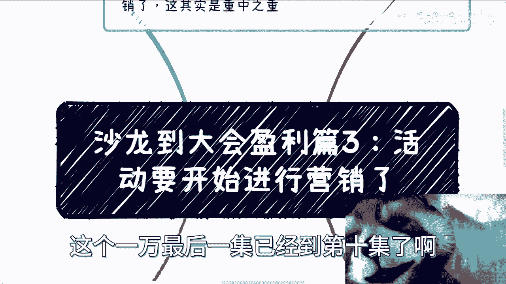
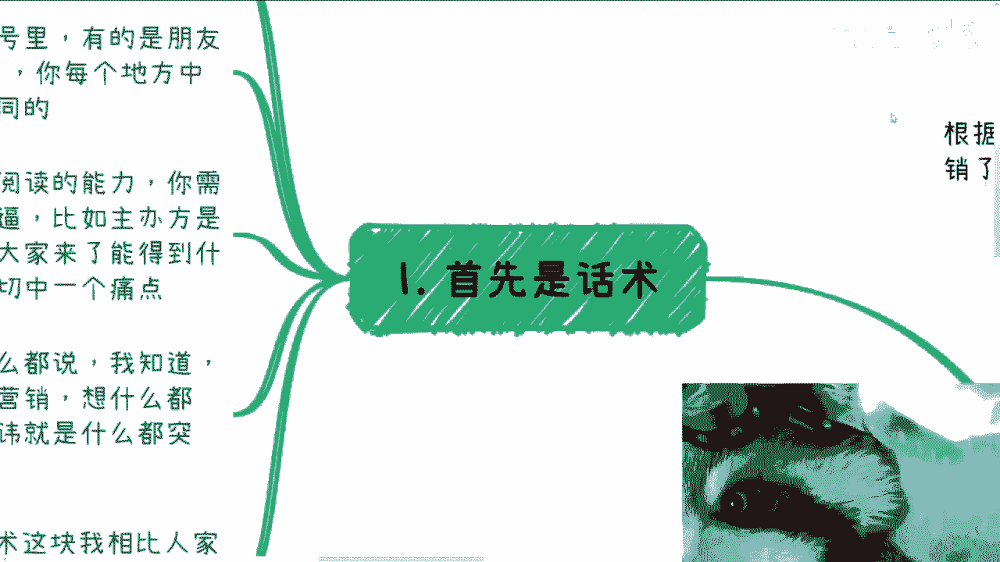
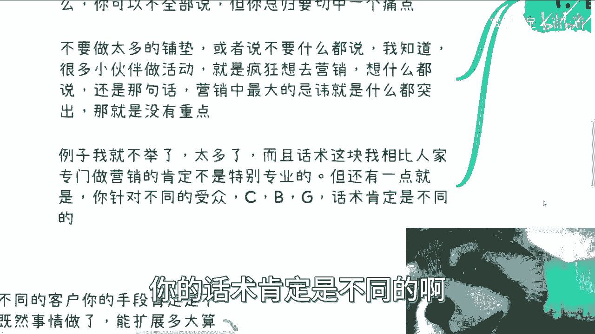
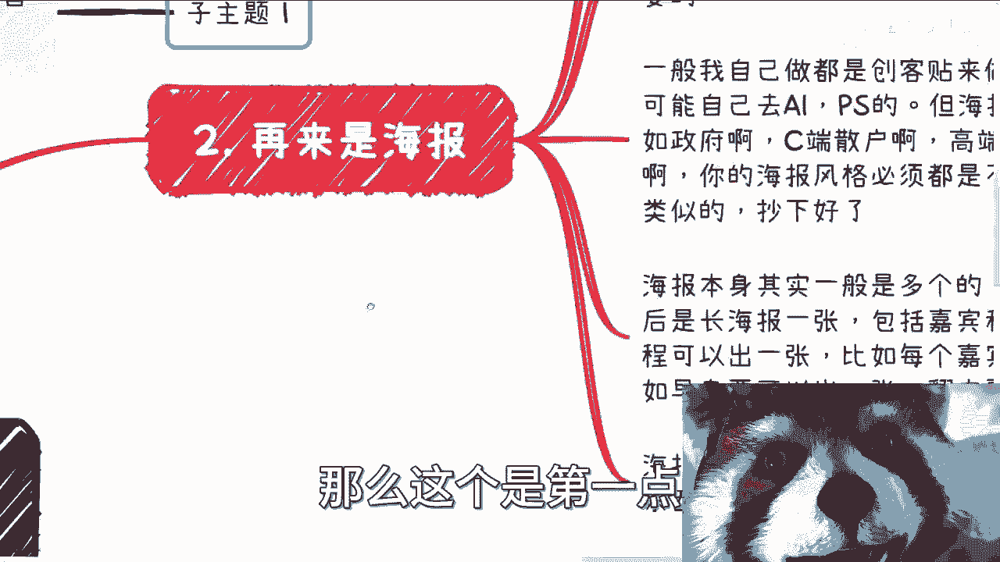
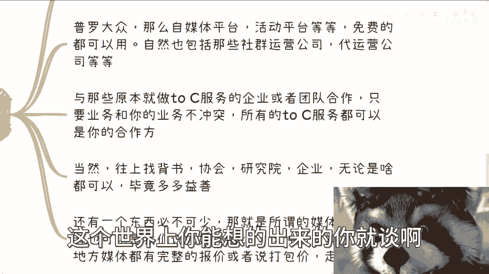
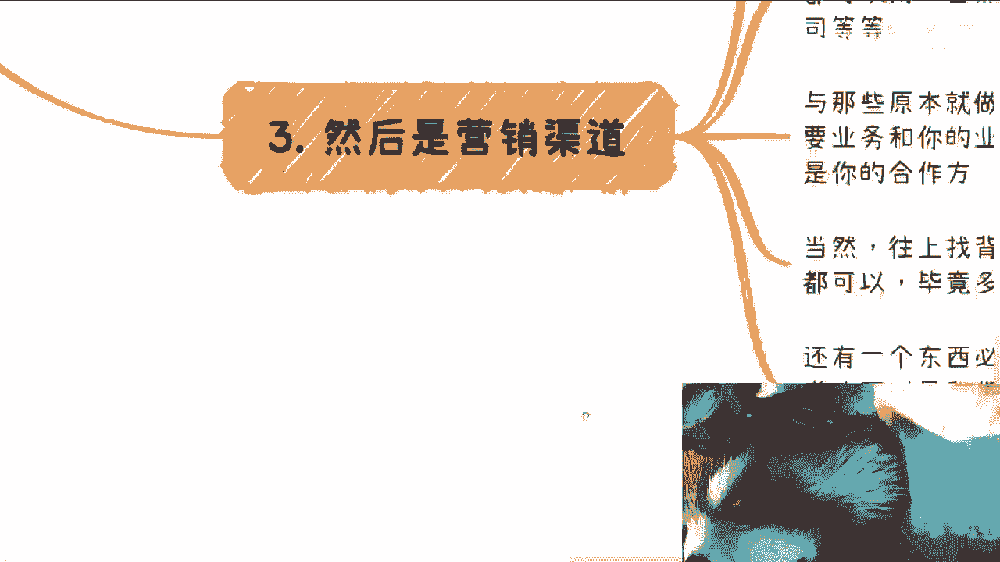

# 沙龙到大会盈利篇3：活动开始前最重要的环境那就是营销 - P1 - 赏味不足 - BV1Yp4y1u7Uz

好大家好，看到我真挚的眼神没有是吧啊，这个亿万最后一集已经到第十集了。

我觉得不管他拍的好不好，都是一个情怀还是帅啊还是帅啊，好那么我们继续来说啊，这个沙龙到大会盈利篇三啊，你们有没有一种裸眼3D的感觉，为什么我有种裸眼3D的感觉，那么活动要开始呢，就要进行营销。

根据前面几期的剧情，搞得我们像电视剧一样啊，我们定位清楚之后就要开始营销啊，这其实是重重中之重。

首先是话术啊，呃话术这个东西很重要很重要啊，首先是话术分成不同的平台呃，有的平台在海报上，有的平台在公众号里，有的是朋友圈，有的是小红书，有的是抖音，你每个地方呢所要用到what啊。

你每个地方呢所要用到的话术都是不一样的，对吧，那么所以说这个东西呢你得去斟酌好啊啊，不要偷懒啊，这个说我每个地方用一样的，那不行啊，你要做事情就好好做，要么就不要做啊，那么话术不能太长啊。

现在人呢没有太长的这个阅读能力啊，你需要告诉大家，就是你的肌肉多么的牛逼啊，你的腹肌有几块啊，比如主办方是谁啊，比如这个活动有谁参加，比如说大家来了能得到什么啊，你虽然可以不全不说。

但是你总归要切中一个痛点，你不能什么都不说啊，啊你不能让大家觉得我来了，这个活动对我来讲一点意义都没有，对不对啊，那么不要做太多的铺垫啊，或者说不要什么都说啊，我知道我们很多小伙伴在做活动的时候呢。

呃疯狂想去营销啊，想什么都要说啊，什么都得写一写嘛，一开始我属于那种哎我也不知道写什么吧，写着写着呢变成了什么500字1000字啊，那么还是那句话，营销当中最大的忌讳啊，最大的忌讳就是什么都突出。

你什么都突出，那就是没有任何的重点啊，而且你没有任何重点，你的用户更抓不住重点啊，你要明白你能够去做这个东西，你一定是比你的客户，比你来的这些受众，至少啊我不说高一个档次吧。

至少就是说你是能够想的比人家多的对吧，你自己都抓不住重点，那别人更抓不住重点啊，那么例子我就不举了，我跟你讲太多了啊，而且话说这块东西呢，我相比人家还专门做营销的，肯定不是特别专业的啊。

我就不班门弄斧了啊，但是还有一点核心一点是什么呢，就是你要明白你针对的客户不一样，你的话术肯定是不同的啊。

不要就是说一天到晚CTRLCCTRLV啊，那么这个是第一点。

第二点这什么玩意，第二点再来是海报。

曾经有个笑话，曾经有个笑话，我不知道你们知不知道说啊，只要这个双手插胸啊，双手交叉放胸前啊，拍照的这个亚洲人都是骗子啊，这个单手插胸的是北斗神拳是吧啊，这我们先来说说这个典故啊。

就是说啊这个之前有非常多的老外啊，在那边就说这个很多的项目呢都是骗子，然后他们后来总结出来呢发现一个规律啊，就很多的这个海报上面都是亚洲人啊，然后都是亚洲人，然后呢是双手交叉放胸前。

然后摆出个pose啊，然后他们就总结出来，就是只要有这种亚洲人的这种POS项目，都他妈是骗子项目啊，那么海报这个东西呢是必须的啊，也就是我们说啊李子呢要有面子，也要有你别你甭管别人关不关心。

反正我们自己要关心的对吧，那么一般我们自己我自己做呢，我就是创可贴来做的是吧，简单方便啊，你不要指望了么，我还用AIPS去做，那是不可能的对吧，但是呢海报本身的风格呢你要明确啊。

就是说比如说针对政府还是针对C端散户，还是针对高端私董会，还是针对企业家培训，你的海报风格必须都是不同的，而且千万千万别就说啊，我这次对吧，针对的是C端啊，下一次针对政府啊，我偷懒一下。

我拿上次模板改一改吧，你拿上次的这个文字的模板改一改没问题啊，你别拿整个背景全部什么都不改，那我跟你讲这个东西完全不能套用，那么海报本身呢其实一般是多个的啊，就比如说主KB是一套对吧，然后长海报对吧。

包括嘉宾和一程啊，包括就是单独的一程，你也可以出一张啊，包括比如说每个嘉宾的邀请函，你还可以出N张对吧，给每个嘉宾都一张对吧，比如早鸟票对吧，比如说倒计时什么54321对吧，怎么样怎么样。

你翻来覆去花头很多了，我跟你讲啊啊，但是你只要主KV一定别的海报都能出，那么每出个海报，你就让你对应的嘉宾，让你对应的合作方往外发对吧，那他都做做嘉宾了，他不帮你发吗对吧，海报是蒙面海报。

是现在快餐时代大众最愿意接受的东西，我跟你讲没了啊没了，那么第三个啊。

那么营销的渠道，那么营销渠道呢很重要啊，我们以前也说过，做事情呢是分层次的，什么意思呢，就是说普罗大众，那么必然是自媒体平台啊，活动平台啊，包括什么那个那个那个得到对吧，或者说什么喜马拉雅对吧。

你你呃收费的，免费的你都去用对吧，收费呢你也去谈谈看啊，你这个弹一下就不少块肉，是不是啊，自然也包括那些社群运营公司，代运营公司，反正你力所能及范围内，这个世界上你能想得出来的，你就谈啊对吧。

那么包括与那些原本就做C端服务的，企业或者团队合作啊，只要是他的业务跟你又不冲突对吧，你你说你你你可能卖的是这个医疗对吧，那他本来做金融没关系啊，只要跟你的业务那个不冲突，那么你就去谈对吧。

所谓所有的这些to c的服务，其实都可以适应的合作方，只不过大家愿不愿意对吧，你比如说你说你找我打广告，那我说我不愿意对吧，那我不愿意没关系，你可以找别人啊，多了去了对吧，那当然啊，网上找背书呢。

协会研究院企业啊，只要是一些呃小呃小微企业大客户对吧，无论是什么，你都可以放多多益善对吧，因为你有B数总比没有倍数好，你有十个倍数总比你有一个倍数好对吧，那么还有一个东西呢必不可少。

那就是所谓的媒体矩阵啊，媒体矩阵这个东西呢我们根本就不需要啊，自己去拉一些什么媒体啊，你可以专门去找这种媒体矩阵的管理，运营公司啊，或者说我们可以去找那些媒体矩阵的MC，他们会给你一个列表啊。

就是说所有的这些媒体或者地方媒体，完整的报价啊，包括打包价，反正我告诉你们比你们想的要便宜的多啊，你们但凡去了解一下就知道了好。

那么第四个啊，这个就是重中重中之重，就是我们的目的呢。

是要尽可能让更多的客户看到，但是前提呢是我们需要的客户，什么意思呢，就是说简单来讲啊，我们触及到的不同客户，你的手段肯定是不一样的，但是从宏观来讲，既然都事情要做了，那我自然而然就能扩大算多大对吧。

那么那么我们如需要更精准的客户，我就需要更多的信息，让大众知道我们要的是怎么样的客户，虽然啊今天比如说我看了一张海报，可能我觉得我不是他的用户，但没关系啊，我可能会觉得我的朋友是他的用户对吧。

那我会介绍啊，那么举个例子，比如说啊，比如说哦在这地方我补充一下，就是说呃我们的客户你也得去想好，你到最终想要得到什么，因为客户本身不知道没关系，你作为这个全局的，作为这个组局的人。

你要知道就是说一般的客户，你希望他能从你这里得到什么，聪明的客户，他又能够从你这边得到什么啊，举个例子，比如说当我要去售卖一套服务，或者售卖一套产品的时候，普罗大众会觉得这就是一个跟自己无关的服务。

对吧，那他就看完就拉倒了啊，能介绍就介绍，那么一般的客户呢会觉得，这个服务或者产品跟自己有关，可以跟你一起挖掘背后的这个这个这个价值啊，那么再聪明一点的客户呢，他能够明白，其实这些服务和产品都是幌子啊。

真的我跟你们讲，很多时候都是幌子，他唯一的价值是什么，就是你去了之后，跟比如说这个主办方或者跟其他区的人，能够在这里面碰出别的合作才是最重要的，这个服务和课程本身一点都不重要，你一定要目标明确。

而且你按照我们的说法，就是说你要在海报里面，你要在各个地方放钩子，放的足够多啊，因为你不放钩子，别人不会咬啊啊，但是你放了，你放了一些钩子，也不是所有人都看得懂。

那这就是个比较high level的钩子，那么这最终一切其实就是看你营销怎么做啊，看你话术怎么写，客户怎么定位，最终吸引到什么样的人啊，呃从其实比如说，今天我们已经已经到了这一步了对吧。

你说我整个活动啊策划好了啊，关系打好了，定位定位好了，海报营销我也做好了，那么接下来其实说实话你能做的，就是等对吧，你说啊我上上下下自媒体也好，分销公司也好，其他地方也好，我该做的都做了。

那你还能怎么办呢，就是等啊，那么当然在整个活动的过程当中，你该做的都要做，那具体怎么做，这个我们会放在后面再来说啊，放后面再说好吧呃行，我想想这两天啊，我想想这两天啊，就是看看大家给我这个私信啊。

也说了蛮多啊，我顺便提一嘴啊，就是最近这两天非常的忙啊，非常的忙，因为我25号到27号，要到北京给他们上课，然后要交一个PPT，明天就跌的烂，呃，然后这两天咨询也约的非常的满，非常的满啊啊。

而且啊最近啊就是找我，其实聊这种商业逻辑的也蛮多的，就是他其实有自己的一些逻辑，但这个逻辑不是很清楚啊，有的是做医疗的，有的是做互联网的，我觉得蛮好的啊，我觉得这种就是很有效率，而且大家聊的比较开心哦。

就但凡就是说你说我要是现在，因为我为什么让大家列问题列表，就是因为我希望大家能够有自己的一些想法，你说我要是一个问题都列不出来，那那这个东西聊聊的很无趣，哈哈你懂吧，就是很多时候我因为我最近也在反思。

很多时候就说如果你问问不出问题啊，你你给我不给我这个钱倒不说啊，你给我这个钱我都不想聊，好吧行，那么差不多了啊，2023已经过了，只剩下一个半月了啊，时间很快就剩一个半月了，其实12月底之前。

大家尽量努力吧，尽量努力吧行，那就先这样吧，大家有什么整理好问题。