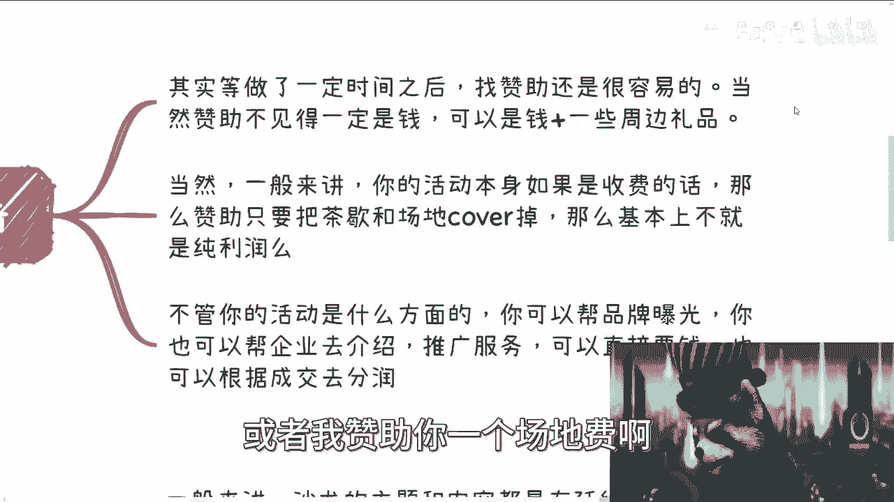
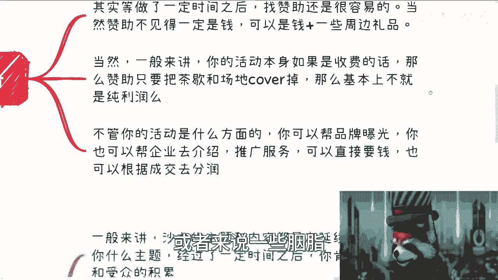
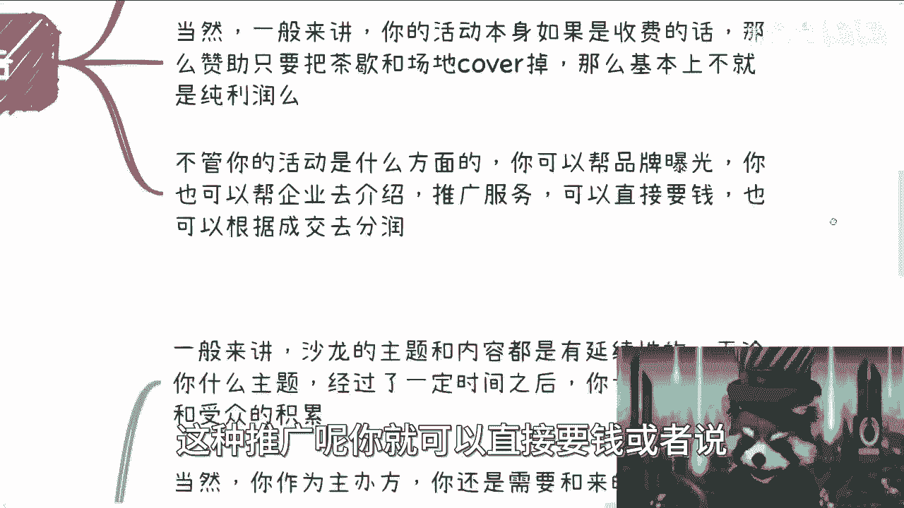
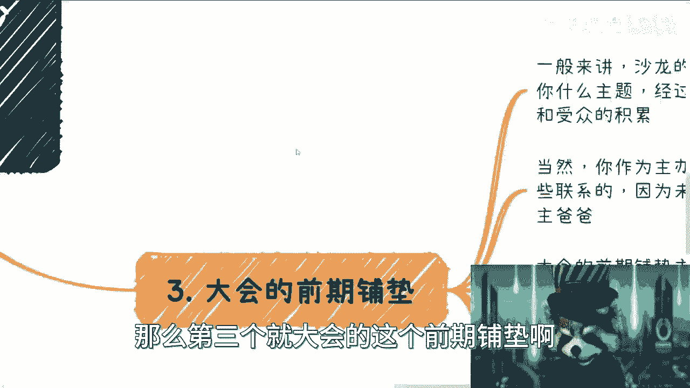
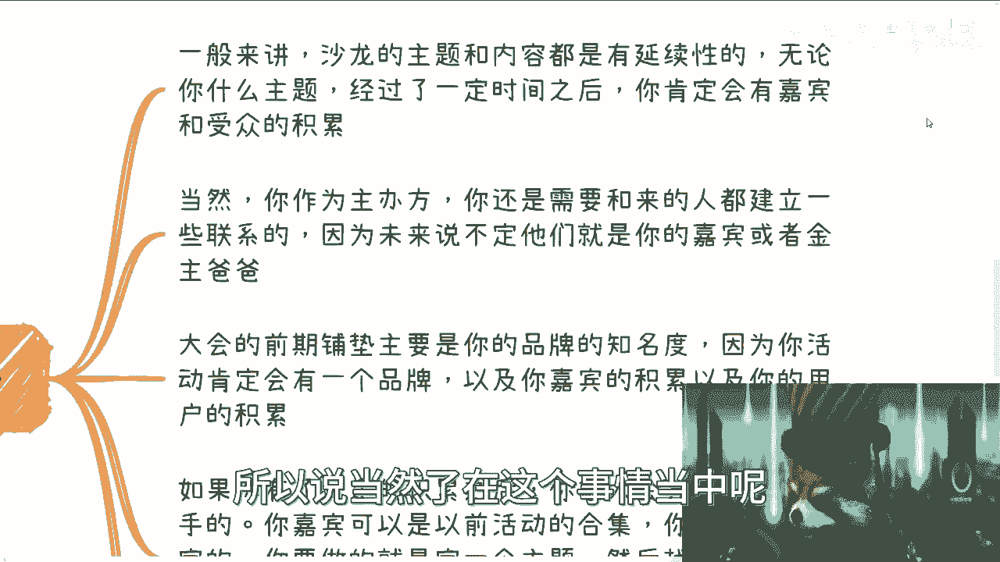
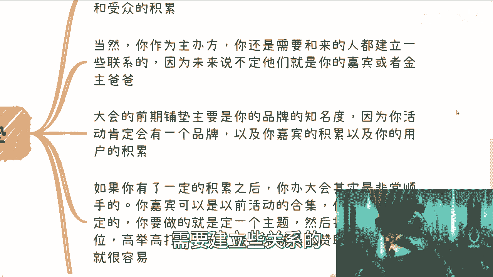

# 沙龙到大会盈利篇4：沙龙盈利点和为大会做铺垫 - P1 - 赏味不足 - BV1NN411t7Kn

好啊大家好啊，那继续我们上一上一个篇章啊，呃本期呢是来讲的是这个盈利点，跟为大会要开始做铺垫了，因为我们本身这个主题呢，就是说是要从沙龙到大会这么一个转变嘛，那差不多了啊，要开始转变了啊。

那么沙龙本身呢它其实有很多变种啊，我在这地方说一下，就是说呃沙龙呃可以有很多衍生，比如说啊免费的沙龙啊，比如说垂直领域的沙龙，比如说啊闭门会议啊，CXO的一些聚会晚宴啊，叉叉叉俱乐部这种啊。

那么免费的沙龙呢它属于一级流量哦，也就是说他适合做流量筛选啊，主要是为了打品牌做案例啊，也是最适合做积累这种方式，因为你免费的话，就是本质上能吸引来更多的人啊，包括场地的这个拍照啊。

包括你以后的这种宣传，看上去会更具有吸引力啊，那么这是第一个，第二个呢就是垂直领域，垂直领域的沙龙呢可以收100到200啊，我觉得大差不差啊，不要太贵呃，小额收入做流量的第一层漏斗呃。

这个漏斗漏漏下来的呢，主要是那种就是说呃那个想要白嫖的人啊，呸是漏掉想要白嫖的人啊，那么漏下来的呢主要就是说有一定付费意愿啊，同时呢它会对你的品牌呢有一定用户粘度啊，那么同样的呢这种活动啊。

比如说你免费的话呢，大家比如说相互认识，相互了解，那没问题啊，如果说你收个一两百呢，我觉得就是说你需要嘉宾分享哦，当然这个嘉宾也可以不分享啊，但是你需要有人给你站台啊，否则你说啊你什么都没有。

你说我就大家来学习，你付个一两百，我觉得不太合适不太合适，那么这是第二个，第三个呢就是闭门会议，闭门会议呢就是更垂直的讨论，更垂直的讨论，就比如说你说打个比方，比如说你上面的垂直领域的沙龙对吧。

你说我们可能讨论的是金融行业啊，大家现在就业或者金融行业的发展趋势啊，金融行业大家这个怎么来做的对吧啊，那么闭门会议呢你就得非常垂直，就是说比如说我们今天讨论，就是金融的一级市场啊。

比如说二级市场投资啊，一级市场的布局对吧啊，那么好，那么呃它的更多的核心绝对不是在于分享，因为闭门会议的本质是在于人人平等，他在意的是大家进来交流，更像头脑风暴啊，那么闭门闭门，而且人不能太多。

当然当然你作为主办方啊，你肯定要去想一件事情，就是呃你请的你总要请点人来，因为很多人我们打个比方，比如说闭门会议，你是500块钱或1000块钱，那总有一些人他妈的心里没有逼数吧，对吧啊。

那他花个500块钱，1000块钱来了对吧，然后你会发现卧槽他妈对吧，但是问题是他花钱了，你也不能说他，对不对哦，好那么这个时候呢就是说你必须要有些拖啊，呃我们其实也不能叫托啊。

就是说你得找一些真正的懂这个，比如说一级市场，二级市场的这个主题的嘉宾，你得来啊，你否则聊什么东西啊，大家过来干瞪眼对吧，哦一共就比如说十个人，15个人对吧，其中一半都是小白。

剩下一半呢可能就是刚刚就业没多久的，卧槽，那你这个闭门会议不要被人家骂死对啊，所以我觉得这是一块那么CXO的晚宴呢，其实目的更明确，就是呃你可以是CXO，你也可以是些别的这个那个角色，定位就无所谓啊。

但是这种晚宴的目的呢就是来认识人的啊，就是晚宴来的人啊，大家聊什么东西，没关系，天马行空啊都可以啊，你拉好人一个圆桌，比如说十个人对吧，你留几个位置，比如说啊打个比方，比如说你拉那么四五个对吧。

你再留一半的位置对吧，当然你本事如果更大，你可以找一些领导，或者找一些社会有地位的人类也可以啊，那么你晚宴就可以说得更高一点对吧，因为本身吧我觉得晚宴更像一个social的场合，更像一个就是说更私密。

大家同样的来了。

可以来谈商务的这么一个场合，那么这些沙龙的变种呢，本身他就是盈利模式的一种啊，就是因为沙龙本身这种逻辑呢他没有这么复杂。

我们不要把这个东西想得这么复杂啊，它本身就是一种商业变现逻辑啊。

那么第二点就是关于赞助跟品牌广告，因为你做了一段时间之后呢，其实找赞助我跟你说啊，找赞助这些蛮容易的，就是你别去想着就说我的，我就一个沙龙对吧，我他妈要是5万10万算算了，就是我觉得呢你应该怎么做。

就是呃积少成多，你知道吗，就是首先你得也是乐透模型嘛，你得先去找那些愿意给你赞助钱的机构，或者来说品牌方对吧，你不要嫌少，比如说一两千一两千不是钱吗，啊，一两千愿意赞助你，那已经是金主爸爸了对啊。

当然赞助呢也不见得一定是钱，它可以是一些钱加一些周边啊，比如说他说我给你就是赞助500对吧，或者我赞助你一个场地费啊。

然后呢我我想让你帮我去发一些我公司的周边，或者来说一些粘纸对吧。

或者别的东西，那也可以啊，啊那当然一般来讲呢，你的活动本身如果是收费的话呢，那么赞助呢他如果能够把茶歇或者场地cover掉，那基本上你不就是纯利润吗对吧，那你想想看吧，咱不说啊，咱客观的说。

真不真不是说你赚钱赚多赚少啊，你你说2023年，这个世界上能有多少东西是纯利润给你做的，有不啦对了，你要这么想的呀，你你不出去被骗，不被割就不错了，还纯利润对吧，我跟你讲，真的很多时候很多人就眼高手低。

他看不上，这，我也真的很奇怪，你知道吗啊，那么不管你活动是什么方面啊，你可以帮品牌做曝光啊，你也可以帮帮企业去做介绍，包括就是说你可以给一个10分钟，20分钟，让这个企业的销售来做推广对吧。

那都可以啊，然而而然后呢这种推广呢你就可以直接要钱。

或者说不要钱也可以，他就是根据比如说如果现场有成交对吧，因为他肯定是一些成熟的服务嘛，比如说比如说某些就是什么SARS服务啊对吧，或者说这个产品啊对吧，或者怎么样子，就是你就根据他的营业额去呃。

那个那个流水去分销呃，去丰润就可以了啊，那么第三个就是大会的这个前期铺垫啊。

那么一般来讲呢，沙龙的主题和内容都有延续性啊，那么无论你什么主题呢，经过一定时间之后，你肯定会有嘉宾跟受众的积累啊，所以说当然了。

在这个事情当中呢，就是你们如果真的要去做活动啊，千万不要只做那种，就是说大家过来过来交流或者怎么样的活动，你一定要做一些，就是说有嘉宾的嘉宾也得积累起来啊啊谁，嗯对。

然后呢就是说你如果作为主办方，你还是需要跟来的人有需要建立关系的。

就是你别说真的只做一个活动，你该做的social就要做的社交，你还是要做的，因为这些东西你不做社交，哪怕人家来了是你的活动，他跟你也没有联系，你也沉淀不下来，那那我那你回头你怎么知道找谁呢，对吧。

你说我比如说我未来要做一个，要做一个服务了对吧，或者要做一个什么什么什么活动了，做一个更大的活动了，你说我要去找人，我，放眼望去，每个人头像就是个头像，你对他做什么的，你也不知道，那你怎么找啊对啊。

所以说你的嘉宾积累以及你的用户积累，你得一直要做的，那么如果你有了一定的积累之后呢，你办大会啊其实是非常的顺手的，因为你会发现你的嘉宾呢，无非就是以前活动的这个合集嘛，你把他们拼起来嘛，那不就是大会嘛。

对不对啊，那么你受众也是固定的对吧，你要做的就是定一个大的主题，然后找一些指导单位啊，高举高打的背书啊，那么接下来就是说你拿这个去拉赞助啊，找场地啊，这就很容易了，因为嗯很多时候我们就说嘛就先有鸡。

先有蛋嘛对吧，那你如果来说你说好，我现在就要办会对吧，哦要嘉宾没嘉宾，要背书没背书，要主题没主题，要什么都没有，那你到底是先找机。

先找蛋蛋对吧，好了又要进入死循环了是吧，哦那么而那些赞助过的呢，就是无论是否是赞助钱的那一方啊，那么这个时候呢我跟你说，肯定就是大概率在会赞助的，因为这很简单嘛，大家合作过了嘛对吧，只要合作愉快啊。

不出现什么叉子都问题不大啊，所以说同时呢，他们也可能会加大这个力度去赞助，所以说你要明白，就是说所有的东西它都是有铺垫的，他都是一个循序渐进的过程，不要就很多人觉得我的，刘老师一天到晚让我们搞活动对吧。

这活动搞得妈的没他妈卵用，唉那有没有用，真的看你怎么做，你知道吗啊你想想看啊，你真的办个大会。

有人愿意加大力度再去赞助赞助，你这种赚钱方式不香吗，我靠他妈香上天了已经对吧。

然后呢就是呃第四点呢。

就是说活动跟大会无论从什么层面啊，其实都是刚需，因为你要明白啊，就是说呃无论今天什么行业，各行各业啊，政府跟企业都会有需要办活动的这个需求，你甭管他是真的要流量还是还是什么KPI，不重要。

重要的是他要对吧，但是另外一个问题呢，活动本身它又是个辛苦活啊，你别去看那个什么委员会啊，什么管委会啊，什么什么乱七八糟的地方，你别看他们卧槽牛逼的很对吧，但其实他们你要真的让他们办，他们很多人不懂。

而且很多人都不愿意干哦，那么那么你要想你有一个品牌的活动，很容易就会被利用和套壳对吧，因为我为什么打引号，是因为你的目标就是要被利用跟套壳啊，你只有利用跟喷跟套壳，你才能拓展出更多的关系啊。

你说对不对啊，那么C端呢就更是刚需了，很多活动，对C端来讲其实上不上下不下，我跟你们讲，你们心里也有数的对吧，就是现在真的接地气的，跟C端有关的活动其实不多啊，真的不多，而且呢你更别说下沉市场了。

你要真的能做出来，真的能积累起来，我跟你讲，我的机会大了去了对吧，那大会本身其实就是一个呃呃对，然后再来说大会啊，大会本身其实就是个完整的商业闭环啊，其扩展面非常大。

而且大会本身并不是说我们单纯开个会啊，而是说我们要在这个世界上插一个flag，那就告诉大家哎你看啊，比如说在成都啊，在武汉，在深圳啊，我办了一个这个会，就是你告诉大家，办证会并不是只有你举办当地指导啊。

全国可能各个地方大家只要关注这个行业的，多多少少都会知道啊对吧，那么一般这个会议你只要办了两期以上啊。

基本上品牌也就牢固了，那么接下来路你一定会越走越宽的，你知道吧。

就是我说实话老百姓能自救的点其实不多，但是同样的就是你办小活动到办大会，这是唯一的一个完全没门槛，你完全可以自由化的一个东西，你知道吗，就是我不说你大富大贵，但是你真的要赚钱，这真的是个方法。

你们我跟你讲，因为为什么很多人做不了，是因为很多人太浮躁哦，很多人他没有这个耐心，做这种东西就要有耐心，就要有毅力，不要怕失败，真的你但凡能做出个大会的品牌，我跟你讲，我不说荣华富贵啊。

就就就你基本上是很爽的，真的是爽的，你你你没有体会过那种爽啊，真的哎，因为我呢在两个领域从0~1做过，我知道是真的爽，你知道吗啊，所以就是就是真的你们有就是如果找我，我认为啊就是如果你们真的走投无路。

你们可以试试看，如果你们真的就是说哎也执行力蛮强的，你们也可以试试看啊，如果你们觉得就说自己进了下新来的，你们也可以试试看，不会吃亏的啊，不会吃亏的好吧行，那就先这么着吧，然后大家反正有什么问题。

有什么别的东西。