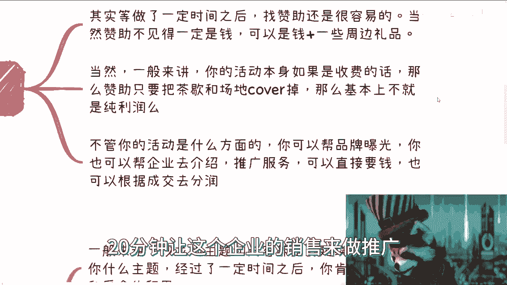

# 沙龙到大会盈利篇4-沙龙盈利点和为大会做铺垫---P1---赏味不足---BV1NN411t7Kn_

在本节课中，我们将学习沙龙活动的具体盈利模式，以及如何通过沙龙为未来举办大型会议（大会）打下坚实基础。我们将探讨沙龙的多种变体、如何获取赞助，并理解从沙龙到大会的渐进式发展路径。

---

## 沙龙活动的盈利变种 💰

上一节我们讨论了沙龙的价值，本节中我们来看看沙龙活动本身如何直接产生收入。沙龙并非单一形式，它可以根据目标衍生出多种变体，每种都对应着不同的盈利或运营逻辑。

以下是几种常见的沙龙变体及其特点：

1.  **免费沙龙**
    *   这属于一级流量入口，核心目的是筛选流量、打造品牌和积累案例。
    *   免费能吸引更多人参与，活动场地的照片和内容也便于后续宣传，增强品牌吸引力。

2.  **垂直领域收费沙龙**
    *   可以收取100-200元的费用，作为流量的第一层筛选漏斗。
    *   这个漏斗会筛掉只想“白嫖”的用户，留下的是有一定付费意愿和对品牌有粘性的受众。
    *   此类活动通常需要安排嘉宾分享或有人站台，以提供与收费相匹配的价值。

3.  **闭门会议**
    *   这是更垂直、更深度的讨论形式，核心在于平等交流与头脑风暴，而非单向分享。
    *   参与人数不宜过多。作为主办方，需要确保邀请到真正懂行的嘉宾参与讨论，以维持会议质量，避免参与者体验不佳。

4.  **CXO晚宴/高端聚会**
    *   目的非常明确：搭建高端人脉社交场合。
    *   形式更私密，适合商务洽谈。可以自行组织核心圈层，并预留部分名额吸引更有社会地位的人士参与，从而提升活动价值。

这些沙龙变体本身就是一种商业变现逻辑，其模式并不复杂。

---

## 获取赞助与品牌合作 🤝

当你持续运营沙龙一段时间并积累一定影响力后，寻求赞助就会变得相对容易。关键在于采用“乐透模型”，积少成多，不要好高骛远。

以下是寻求赞助的实用方法：

*   **从小额开始**：主动寻找愿意提供小额赞助（如一两千元）的机构或品牌方。即使金额不大，他们也是重要的支持者。
*   **赞助形式多样**：赞助不一定是现金，也可以是“现金+实物”的组合，例如对方提供场地费或茶歇费用，同时请你帮忙发放公司周边产品。
*   **盈利逻辑**：如果你的活动本身收费，那么赞助若能覆盖茶歇或场地成本，剩下的门票收入就是纯利润。在商业环境中，能获得纯利润的机会非常难得。
*   **提供曝光与推广机会**：你可以为品牌提供多种曝光方式，例如现场品牌展示、企业介绍，或给予10-20分钟的现场推广时间。
*   **合作模式灵活**：对于这种推广机会，可以直接收取费用，也可以采用分销模式，即根据品牌方在现场达成的交易流水进行分成。

---

## 为举办大会做前期铺垫 🏗️

沙龙是通往大会的必经之路。通过系统化运营沙龙，你可以自然地为未来举办大型会议积累所有必要资源。

以下是沙龙如何为大会做铺垫的关键点：

*   **主题与内容的延续性**：沙龙的主题和内容应具有延续性。经过一段时间运营，你自然会积累起一批优质的分享嘉宾和忠实受众。
*   **积累嘉宾与用户**：活动中一定要注重嘉宾和用户的积累。作为主办方，你需要主动与参与者建立联系，进行社交。否则，这些人只是“头像”，你无法在需要时有效触达他们。
*   **大会是沙龙的“合集”**：当你拥有足够的嘉宾和受众积累后，举办大会就会水到渠成。大会的嘉宾可以是以往沙龙嘉宾的合集，受众也是你沉淀下来的群体。
*   **提升规模与背书**：此时，你需要做的是确定一个更大的主题，并寻找指导单位进行背书，提升活动规格。然后，凭借这些积累去拉取更大规模的赞助和场地。
*   **解决“先有鸡还是先有蛋”**：如果没有前期的沙龙积累，直接想办大会，就会陷入“无嘉宾、无受众、无背书”的死循环。沙龙正是破解这个循环的关键。
*   **赞助商的延续性**：那些在沙龙阶段合作过的赞助商，只要合作愉快，在大会阶段有很大概率会继续赞助，甚至加大赞助力度。

所有成功的大会都是一个循序渐进、长期铺垫的结果。

---

## 活动与大会的长期价值 📈

最后，我们需要从更宏观的视角理解举办活动与大会的长期价值。

*   **B端与G端的刚需**：无论哪个行业，政府和企业都有举办活动的需求，无论是为了获取流量还是完成KPI。然而，办活动是个辛苦活，许多机构并不擅长或不愿亲自操办。
*   **品牌活动的“被利用”价值**：拥有一个品牌活动后，很容易被其他机构“利用”或“套壳”合作。这恰恰是你的目标，因为通过合作能拓展出更多关系和机会。
*   **C端市场的机会**：目前真正接地气、服务好C端用户的活动并不多，下沉市场更是蓝海。如果能做好，机会巨大。
*   **大会是完整的商业闭环**：大会本身是一个扩展性极强的完整商业闭环。它不仅仅是开会，更是在行业中“插下一面旗帜”，宣告你的品牌和影响力。通常一个会议成功举办两届以上，品牌就会趋于牢固。
*   **低门槛的创业路径**：从办小活动到办大会，是一条几乎没有硬性门槛、完全可以自主掌握的路径。它不需要巨额启动资金，但需要耐心、毅力和不怕失败的精神。一旦成功打造出大会品牌，所带来的回报和成就感是非常可观的。

---

**本节课总结**

本节课我们一起学习了沙龙活动的具体盈利模式，包括免费沙龙、垂直沙龙、闭门会议和高端晚宴等变体。我们探讨了如何通过寻求赞助来实现盈利，并深入理解了如何通过系统化运营沙龙，为未来举办大型会议积累嘉宾、受众、合作方和品牌影响力。记住，从沙龙到大会是一个循序渐进的积累过程，其核心价值在于解决资源匮乏的“死循环”，并最终在行业中建立稳固的品牌地位。