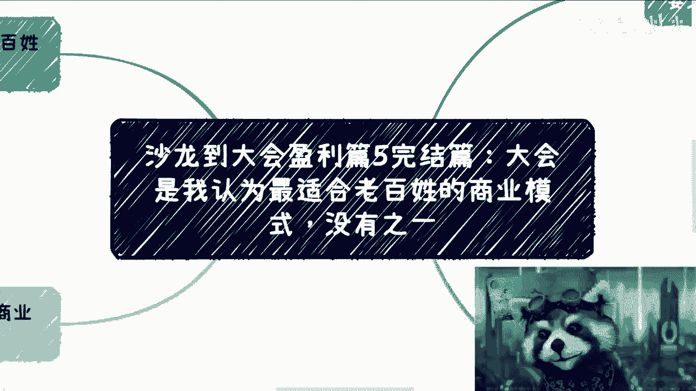
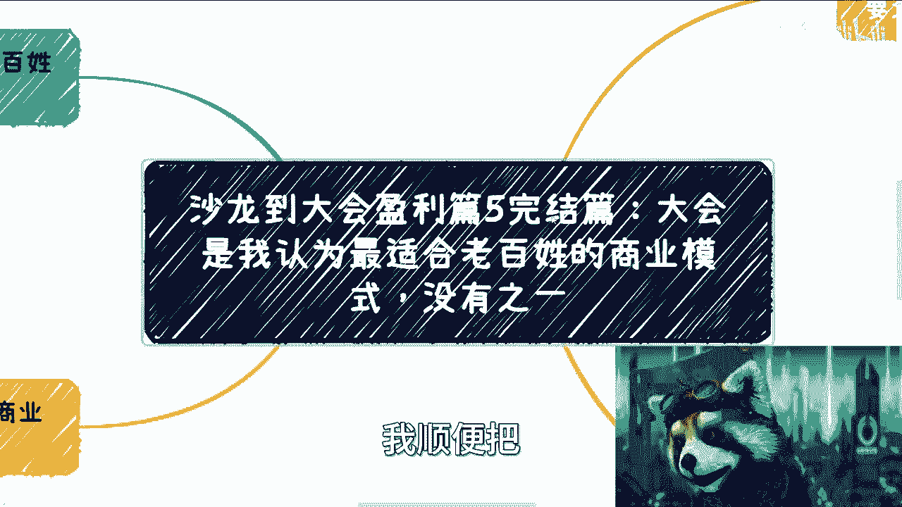
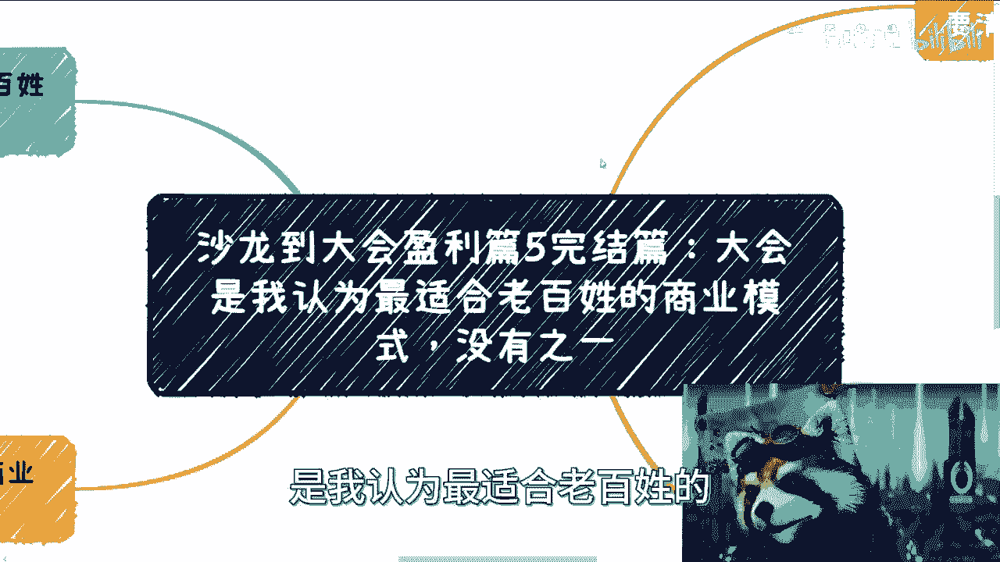
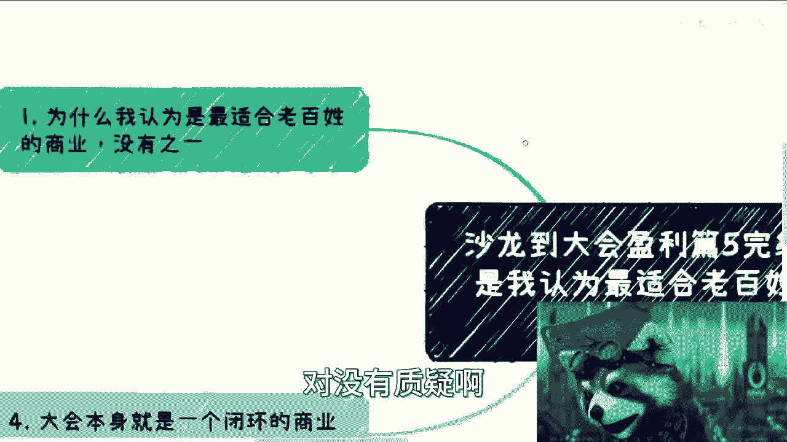
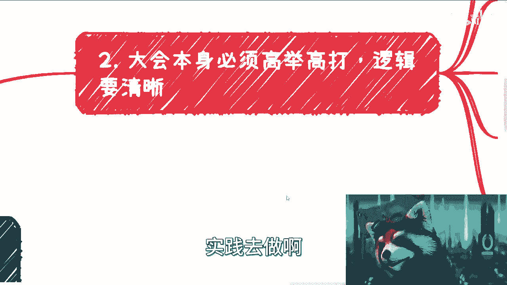
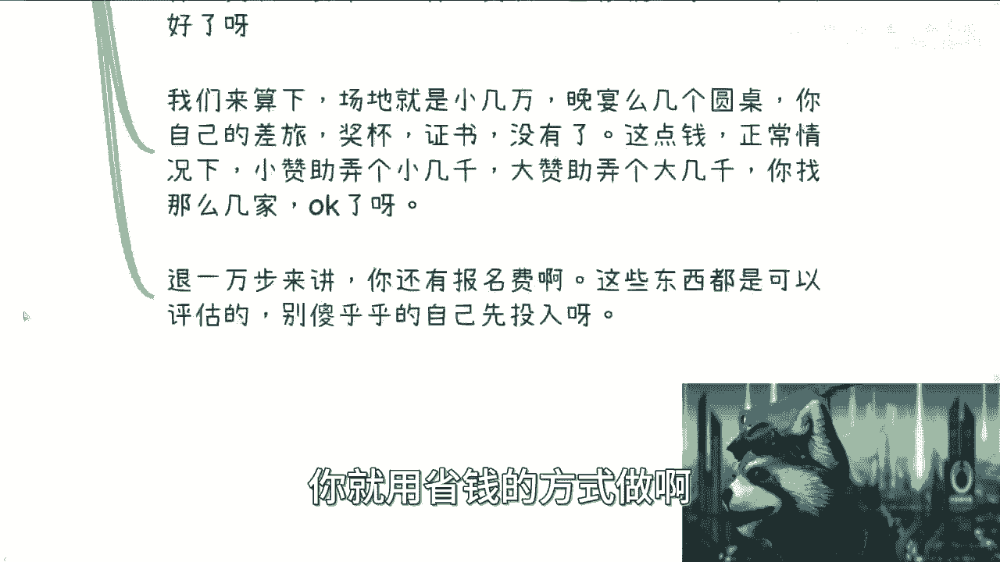
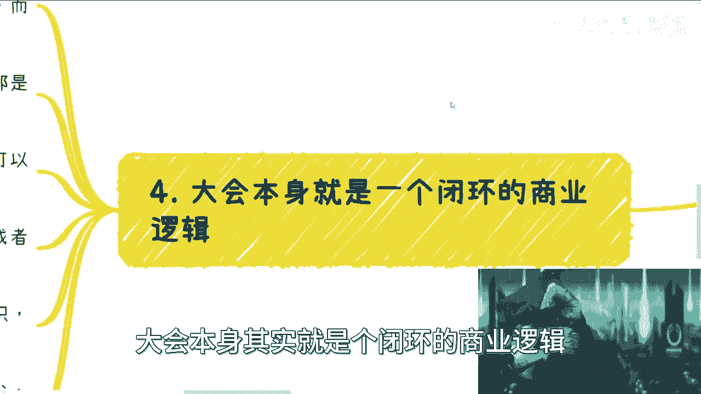
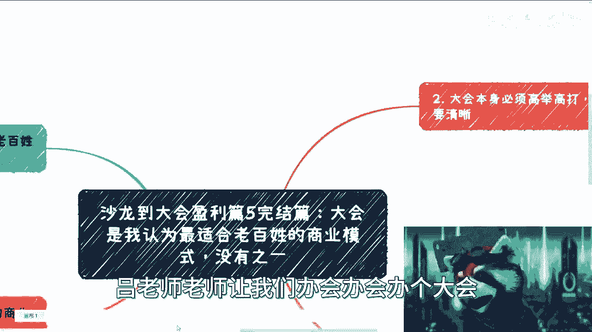

# 沙龙到大会盈利篇5完结篇：大会是我认为最适合老百姓的商业模式，没有之一 🎯

在本节课中，我们将要学习如何从零开始举办一场商业大会，并理解为何这是最适合普通人的商业模式。我们将详细拆解大会的核心理念、低成本运作方法以及其闭环的商业逻辑。

---

## 大会的核心价值与定位 🚩

上一节我们介绍了沙龙到大会的进阶路径，本节中我们来看看大会模式的终极形态。大会是我认为最适合老百姓的商业模式，没有之一。

广大普罗大众没有太多试错机会，也没有巨大的成本去试错。做自媒体或跨境电商等不了解的领域，成本高且容易被骗。在我看来，能同时积累资源与关系、具有长尾效应且成本很小的模式，只有大会。它没有学历或其他任何门槛。在我漫长的观察中，没有看到第二条这样的路。

最大的分水岭在于能否实践。做过的人觉得其妙无穷，没做过的人则觉得难度很高。

---

## 大会的运作逻辑：高举高打与无中生有 🏗️

大会本身必须高举高打，逻辑必须清晰。无论办什么峰会或高峰论坛，目标都是在全国某个垂直领域插上一面旗帜。说白了，就是无中生有，告诉大家有这么一个会。

以下是关于会议品牌和目标的要点：

*   **品牌名的重要性**：不要用自己的名字或公司名，因为它们缺乏辨识度且显得低端。一个好的品牌名具有传播性，能模糊你的底细，让人摸不清你的实力。
*   **核心是主题与流程**：品牌只是露出，本质上大家看重的是你的会议主题和流程设计。
*   **第一期最难**：第一期是分水岭，决定你能否办成。一般两期之后，旗帜就差不多立住了。
*   **高举高打的含义**：大会的目标不是单纯办会，而是宣告你为大众带来资源和福利。例如，帮助参会者对接政府资源、获取投融资、享受行业补贴或连接上下游。

但是，如果你没有这些资源怎么办？没关系，先把饼画了再说。大会的本质就是不纠结“先有鸡还是先有蛋”的问题，索性在一天之内，把“鸡”和“蛋”都放进这个篮子里。

---

## 大会的成本拆解：如何极致控制预算 💰

很多人认为办会成本很高，本节我们来详细拆解。只要方法得当，成本可以控制得非常低。

以下是大会各项成本的控制方法：

*   **嘉宾费用**：嘉宾可以完全通过沟通和话术邀请，无需付费。没有规则规定嘉宾一定要收钱。
*   **场地费用**：场地是硬成本，但可以通过“画饼”争取折扣。例如，承诺未来每年固定举办，酒店通常不会强迫签协议，但此承诺有助于谈判。
*   **午餐安排**：午餐可以不为参会者统一提供，但需要做好周边餐饮攻略，告知大家附近的餐厅、距离和大概价格。
*   **嘉宾礼品**：为嘉宾准备证书和奖杯。这些在淘宝上可以非常便宜地定制。
*   **晚宴**：晚宴是必要的，用于感谢白嫖来的嘉宾和赞助商。按圆桌（每桌10人）计算即可。
*   **工作人员**：第一次办会可以不需要额外的工作人员。流程对接和现场引导可以依靠酒店方的灯光、音响等工作人员，或让参会者自助。

我们来算一笔账：场地费（小几万）+ 晚宴费 + 个人差旅费 + 奖杯证书费。通过寻找小赞助（两三千）和大赞助（五六千），努力一下基本能覆盖大部分成本。此外，还有报名费作为收入来源。

**核心操作流程**：先做出包含潜在嘉宾的会议方案（Word/PDF），用这个方案去谈赞助商。获得几家赞助意向、明确大致收入后，再启动举办。不要自己先垫付所有成本。

---

## 大会的闭环商业逻辑：利润与衍生价值 🔄

大会本身就是一个可以复制粘贴的闭环商业逻辑。每一次只需更换主题和嘉宾，盈利模式是固定的：**利润 = 总收入 - 固定成本**。利润多少取决于你的影响力和执行力。做成功的人会认为其价值极高。

大会可以衍生出多种盈利和增值环节：

*   **会前培训**：举办会前培训，例如小几千元每人，招20人即可有几万元收入。
    *   `收入示例：培训费 3000元/人 * 20人 = 60,000元`
*   **分层赞助**：赞助可细分，如大会总赞助、晚宴独家赞助、会后酒会赞助等。
*   **资源撮合**：在大会中促成资源对接，后期可赚取差价或介绍费。
*   **衍生组织**：以大会名义成立私董会、俱乐部等组织，收取会费或设立理事会单位并分级收费。
*   **颁奖环节**：自己设立奖项（如全国行业Top 10/20）并颁奖。只要不私自伪造公章，此类操作在市场上很常见。向希望获得名誉的企业收费。
    *   `收入示例：Top 10 每家收费10,000元，Top 11-30 每家收费5,000元。`

所以，办大会本身不是最终目的。目的是围绕大会，将上述所有成熟的盈利和运营模块整合进去，形成一个自循环的生态系统。这些环节与你的学历或技术能力无关，只取决于你的社交能力和执行力。本质上是资源整合与互换的游戏，操作一遍就会发现其难度并没有想象中那么高。虽然办会当天会很累，但从接待、控场、嘉宾对接到晚宴，一天的收获将是巨大的。

---

## 总结 📝

本节课中我们一起学习了大会作为商业模式的核心要点。

1.  **定位**：大会是适合普通人、低门槛、能积累资源和关系的优选模式。
2.  **逻辑**：需要高举高打，通过品牌和主题在垂直领域无中生有，树立旗帜。
3.  **成本**：通过白嫖嘉宾、谈判场地、精简服务等方式，可以将成本控制在极低水平。
4.  **盈利**：大会是一个闭环商业逻辑，可通过培训、赞助、资源撮合、衍生组织、颁奖等多种方式创造丰厚利润。

核心永远不在于“会议”或“沙龙”这些形式本身，而在于构建一套以你品牌为中心的高格局运营体系。你不需要强大的背书，关键在于着手去做，并整合资源。希望本教程能为你点明这条路径的核心。