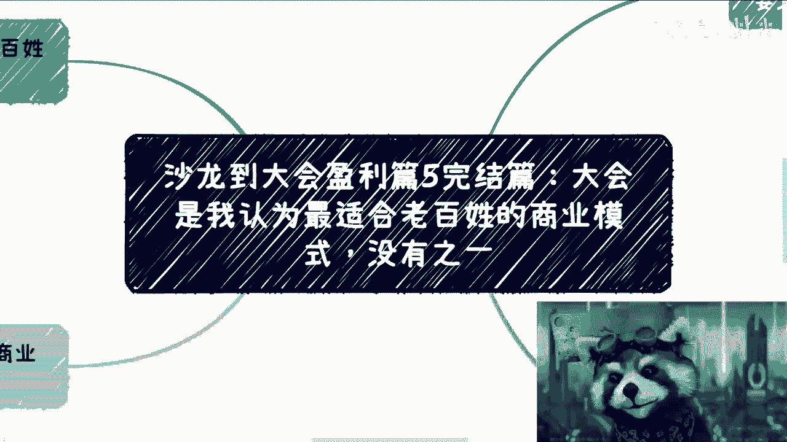
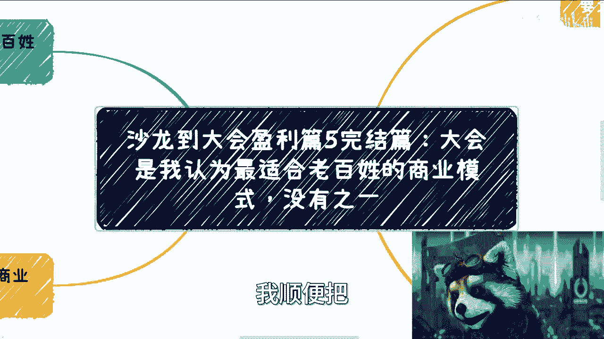
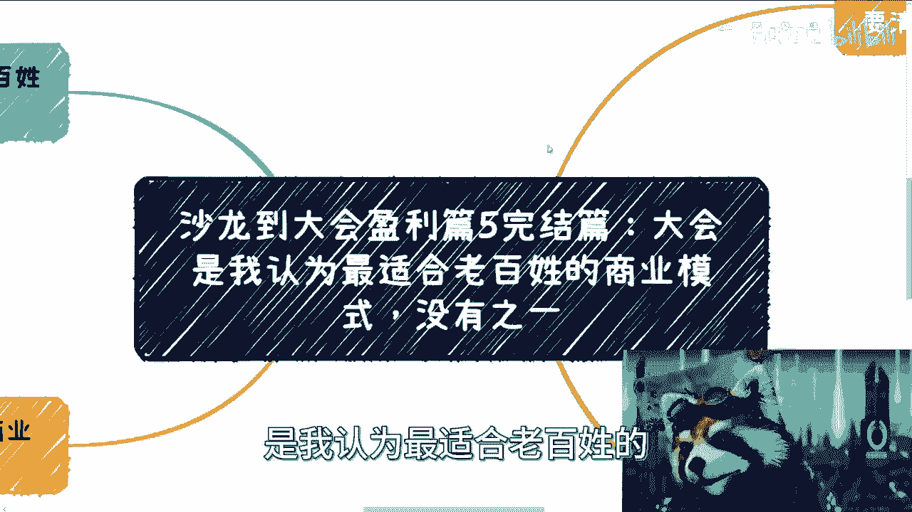
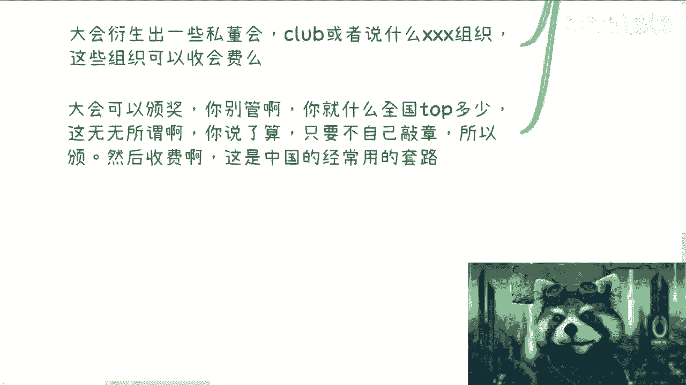

# 沙龙到大会盈利篇5完结篇：大会是我认为最适合老百姓的商业模式，没有之一 - P1 - 赏味不足 - BV1Sw411X7V1

好啊那个我顺便把沙龙到大会啊。

赢一篇最后一章就完结篇跟大家说完啊，就最后一张自然到了大会，那大会呢是我认为最适合老百姓的。

商业模式之一哈，没有质疑啊，没有之一对没有之一啊。

为什么我认为没有质疑啊，是这样子的，你看啊，因为从老百姓角度来讲啊，广大普罗大众他是没有太多试错机会的，也是没有这么大的成本给他们去试错的，嗯但是呢就是说真的啊，比如说你们去做自媒体，做什么跨境电商。

或者做一些有的没的呃，对于大众不了解的东西来讲，它的成本很高啊，而且容易被骗，所以说呢在我看来呢能同时积累到资源跟关系，而与此同时还能够有长尾效应，其成本还很小，只有打回来，没有别的东西。

那而且他没有任何的，比如说学历或者其他的各种门槛，没有他只有这个方式，在我就在我这么漫长的时间当中，我没有看到第二条路啊，就很多人要说，卧槽扯淡对吧，大会成本怎么可能低，我跟你讲啊。

这事啊我待会在第三个地方，我会给你们详细列的啊，呃但是这个地方我先说个结论，这个事呢我跟你讲啊，但凡做过的就是香的不得了啊，但凡没有做过的，都他妈觉得难度很高啊，我觉得最大的分水岭就在于。

它能不能有这个实践去做。

那么大会本身呢必须高举高打，逻辑必须清晰，什么意思啊，就是说你无论办什么大会啊，比如说什么什么峰会，什么什么高高峰论坛对吧，或者什么东西啊，就是说大户的目标全在全国某个领域呃，他一定是某个垂直领域的啊。

那么大会的目标是在全国的某个垂直领域上，插上一个flag呃，其实说白了就是无中生有啊，就是告诉大家有这么一个会啊，那么关于会议本身啊，一般都是你自己去想个品牌名啊。

你不要说你老想着用自己的名字或者公司名，因为你也好，公司也好，都没有任何的辨识度，而且太low啊，品牌名呢一方面是有传播性，别人也不会觉得说，你跟他有什么直接竞争的关系，另外一方面呢。

就是说品牌能够让别人也摸不清楚，你的底线对吧，有很多人觉得哎呀我好像是个nobody对吧，或者说我没有什么积累对吧，别人为什么能看得上我对吧，就是说你用一个品牌，你只要设计的好对吧，包括品牌就这两个嘛。

一个是名字，一个是logo嘛对吧，就是说呃大会这个东西呢，其实品牌只是一个露出本质上大重量来看的，还是你的topic，还有你的大会的这个流程啊，那么大会呢本质上来讲第一期用也是最难的啊。

因为第一期他就是个分水岭，就是你到底能办和不能办啊，但是一般来讲两期之后，你的flag就差不多立柱立柱了啊，那么高举高打的意思呢，就是说大会的目目标啊，并不是说我办一个会，而是说我告诉大家。

我是来给大众带来资源和福利的，比如说所有你们来的人对吧，你们可以通过我对接政府资源，帮助大家拿到投融资啊，帮助大家去拿到政府的一些扶持啊，补贴啊对吧，包括大家呃这个行业，比如说你办的是AI的。

办的是什么呃，这个呃机械知识机器人的对吧，工业互联网的对吧，我能够帮助大家对接更多的上下游对吧好，但是啊但是啊有很多人要说，他说那我对接不了啊，我没有资源啊，我我这也帮助不了大家拿投融资。

那他妈的没关系啊，你管他呢，你先把这个饼画了再说啊，对不对啊，那么你想啊，大家一般先纠结先有蛋还是先有鸡对吧好，那么大会的本质呢其实索性就是不纠结啊，就是鸡和蛋索性就是一起来对啊，比如说你大概就一天。

那在这一天里面，我把鸡和蛋都放在这个篮子里面，你也别跟我比比了啊，你管我先有鸡先有蛋，你不用纠结这个问题对吧好，那么第三点啊，就关于这一大会成本啊，我们来列啊，你看啊，首先啊只要你不要脸。

嘉宾是可以完全白嫖的，为什么，因为嘉宾也是人啊，白不白嫖，这是看你的话术，看你的沟通，看你的水平，看你的忽悠能力对吧，因为没有哪个规则说嘉宾来一定要收钱啊，对不对，那那能被白嫖的人多了。

或者是去白嫖嘉宾的大会也多了，我他妈，我告诉你们，我他妈这个参加过这么多会啊，这白嫖我的也多了，对不对，简直多如牛毛啊啊这个我跟你讲，真的就看你怎么说啊啊然后场地是映衬的，这没有办法，但是也可以画饼。

饼怎么画呢，很简单啊，比如说啊你说一天是3万块钱，对不对，好没问题啊，你就跟他说，你说啊我这个东西啊怎么样怎么样啊，很新的啊，然后未来呢只需要做的，比如说我基本上就是未来啊。

这个每一年可能在你们这边办两场，就上半年一场，下半年一场对吧，好，我跟你讲啊，这种饼画呢从酒店角度来讲，他是不可能我跟你可以打保票啊，他是不可能来跟你这个逼迫你说，来我们签个协议啊。

你把明年的两场给我包了，不可能的，就是你给他画这个饼，他可能也知道你是给他画这个饼，但是这个又要回到就说啊，你这个沟通的话术对吧，你的你的这个让别人感觉你诚不诚意对吧。

那你这个饼画了其实还是有可能打点折的，那么包括就是说午餐也可以没有，但是呢你需要给大家做好吃饭的攻略，比如说几百米几千米对吧，然后是怎么个大概是多少价格，你你该做的还是要做的，你别到最后说啊。

吕老师说他妈的可以没有的对吧，然后就不管了，那你还做个屁啊对吧，那么嘉宾呢你需要给些证书和奖杯啊，那我跟你讲啊，这个东西你去淘宝看看多么便宜啊，我就不说了，你们自己去看，我个位数都可以啊。

然后晚宴呢是要的，毕竟你搬一个会啊不容易啊，不管是两三百人还是五六百人啊，毕竟大家一起吃个饭就是嘉宾啊，我说的嘉宾啊啊也算感谢了，就相当于你晚上请的是嘉宾跟赞助商啊，因为毕竟你都白嫖了嘛。

你请人家吃个饭，这种总归要的嘛，对吧啊，那么剩下还有啥呢，没了呀啊，你说工作人员，那么他们可以不要工作人员，那为什么要工作人员呢，你把流程跟酒店，因为一般来讲酒店这边它都是有对应的。

比如说呃呃呃这个叫什么灯光啊对吧，音响啊，他有工作人员的，他只不过是没有现场的，比如说或者说引导的那些所谓，你大会的工作人员，但是你第一次大会来讲，你要啥工作人员，对不对，你就直接就大家自己来不就好了。

也无所谓的呀，那我们来算一下对吧，你场地比如说小几万吧，晚宴你几个圆桌，一个圆桌，十个人嘛对吧，你几个圆桌，然后呢你自己拆旅对吧，然后奖杯证书没有了对吧，你基本上就是这些成本啊，那么正常情况下面你想啊。

你小赞助对吧，比如说两三千小赞助对吧，那大赞助啊，我觉得第一场你也别去什么几万几万了，你比如说大赞助就五六千对吧，那么你你就这么想，你小赞助找几家，大赞助找几家对吧，那基本上你算算你刚刚这边的成本。

我不说全部覆盖你，你比如说一般努力对吧，你可能覆盖不盖六七十对吧，你要稍微努力努力，我觉得就基本上能覆盖掉，因为没多少钱，对不对啊，那么退1万步来讲啊，你还有报名费呢啊这些东西都是可以评估的。

就是你要明白一点，就说你做任何的东西啊，你包包括比如说大会，你肯定是先出方案的，对不对，好，那么你这个方案说出来，你再去找找赞助商啊对吧，你说我现在有个word，有个PDF。

以整个大会里面可能有哪些嘉宾对吧，因为你嘉宾你去谈，你谈完之后有了一个方案，这个方案是不是不要钱，对啊不要紧啊，你拿这个方案去再找赞助商，赞助商有意向了，有那么几家，你差不多知道自己有多少成本了。

你再去做啊，你别傻乎乎就说啊，你说啊我这个弄好了，我就开始招生了，就报名了啊，然后到时候就说一边报名，一边找赞助商，那他妈到时候没赞助商了，你自己全掏，对不啦，就是明明有省钱的方式。

你就用省钱的方式做啊。

对吧好，那么第四点来讲，大会本身其实就是个闭环的商业逻辑。

就是说，首先啊大会本身你每一次的逻辑都是一样的，你只要复制粘贴，换换主题，换换嘉宾，盈利就是看最终，比如说呃那个差价也不叫差价吧，就是你的利润对吧，刨掉成本利润，因为成本对你来讲基本上是固定的对吧。

然后利润这个东西就看就看你的影响力多大，你的脸脸皮多么厚啊，我跟你讲这个东西呢就是做过的人，就我回到最早说的，做过的人做明白，做成功的人就是很香啊，极其之香，妈的香的不能再香了啊，我们来举个例子。

比如说啊你前面可以增加培训，一般这种培训都是小几千块钱，20个人，小几千块，20个人什么概念，小几万有了吧对吧，5万块钱有了吧好，然后赞助是可以分开来的，就是说赞助可以是大会本身，也可以是大会。

我我以后的晚上的晚宴，也可以是晚宴之后的酒会都可以对吧好，那么赞助我算你弄个我不用多吧，5万吧对吧，那这样10万有了对吧好，然后大会里面出现了资源的撮合，你可以赚差价或者介绍费。

那当然这个东西你一开始可能不去想，对你做了两三期之后，你可以去想，对不对好，那么大会本身也会衍生出一些私董会吧，或者一些club吧或者什么什么组织吧，你自己定，你这点无所谓的，就以你大会为主嘛对吧。

然后这些组织可以收会费吧，那你要是做的再牛逼一点对吧，你说我不仅收会费啊，我可以说理事会单位对吧，收什么什么不分等级手对吧，也可以呀啊然后大会可以颁奖啊，你别管我跟你讲，哎很多人要说了，哎我操我能颁奖。

你怎么不能颁，哎，奇了怪了，哎我自己定一个名头对吧，我说全国top10top20怎么了呢，我靠你们去看看那些微商，看看有这么说吧，你们去看看，只要是就是非互联网行业的那些，或者在中国下沉市场的哪个地方。

不他妈不这么做啊，都他妈这么做了这么多年了，谁管对不对，你说了算，你只要不是自己私自敲章，我跟你讲都可以的对吧，你就搬呗，对不了，然后收费，哎呦我跟你讲，还是那句话，中国土地这么广，世界这么大。

总有企业不懂的，总有企业想要来这个虚名的，对不对，你就收费啊，我靠他他妈的，你就说top top30对吧，好呃后面20名额20就10~30名，你每家收5000对吧，一照一到，比如说十名一家收1万。

你不香吗，哎呦我他妈伤的不要不要的对吧。

而且我告诉你，这就是经常用的套路，所以所以啊就是你们要明白啊，就是说就是说不是说你们办个大会，就是啊吕老师老师让我们办会办会办个大会。

不是你知道吗，就是这会本身不是那么重要，就是你要把这个会本身就当做一个什么，当做一个自循环的一个一个一个一个一，一个一一个会，你知道吧，但是你的目的不是这个会啊，你的目的是围绕这个会帮你把你的。

就是我们刚刚说的，这边的所说的这些成熟的东西都放进去，因为这边的东西你去看嘛，哪个东西跟你的学历有关系，哪个东西跟你的能力有关系，没有的，就一切都看你的社交，一切都看你的这个病。

一点问题一点毛病都没有的对吧，有什么问题呢，无非就是左手套，左手套，右手右手套左手对吧，我用鸡去掏蛋，掏蛋来掏鸡对吧，呃那那那就看我怎么掏嘛，是不是没难度的，真的没有难度的啊，你们但凡只要操作过一遍。

你们就会发现这玩意有什么难度啊，啊你就是最多当天累一点没了，就你从早上啊接待对吧，到当中控制流程啊，到嘉宾的对接啊，到你最终晚宴你就一天，但是你一天能收获多少东西啊，卧槽对吧。

那你们把我刚刚说的第四点啊，你们仔细去算算利润啊，这香的不得了，好吧行，那这个东西我希望我能跟你们讲明白了啊，就说点我已经给你们点透了，就是这个东西的核心永远不是在会，也不是在沙龙，这些东西都不是核心。

核心是你要把整个的一个高格局的一套东西，做出来，而且这套东西是以你这个品牌为主的，根本没有关系的哦，你不用太去想说，哎呀我好像没有这个背书。

