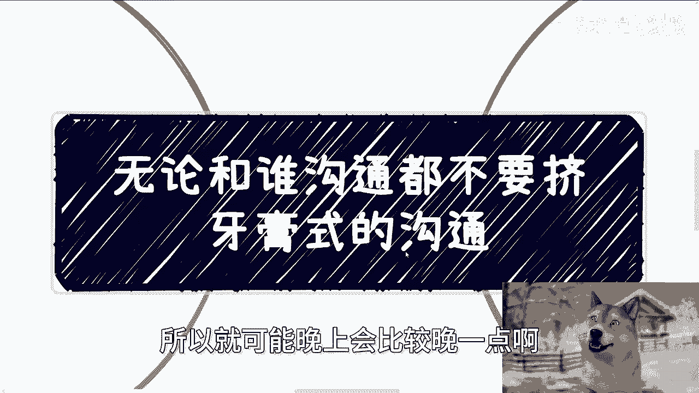
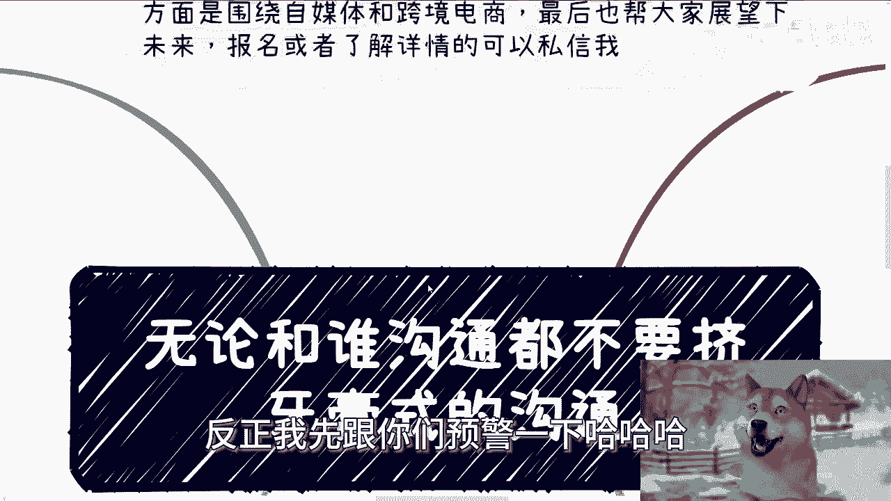
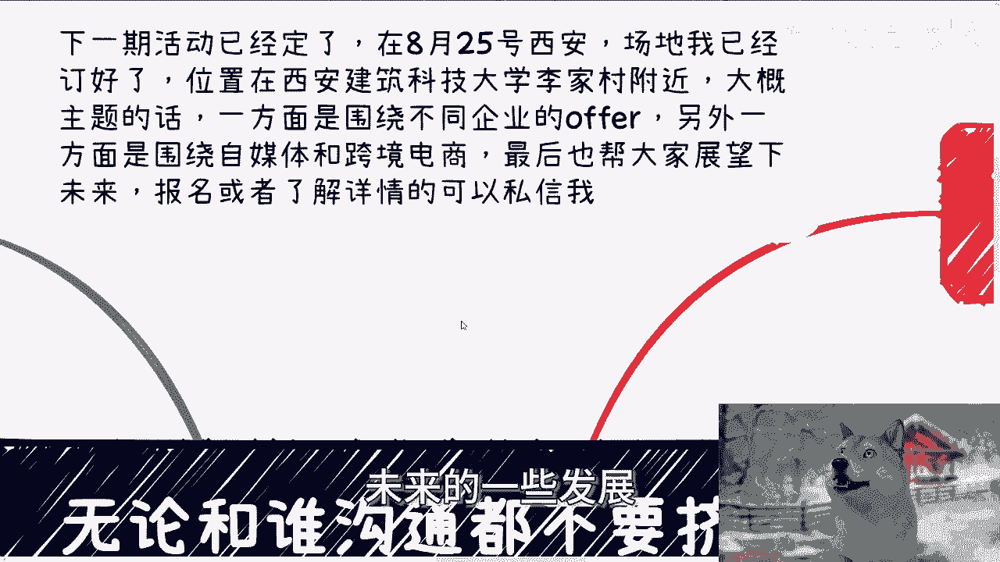
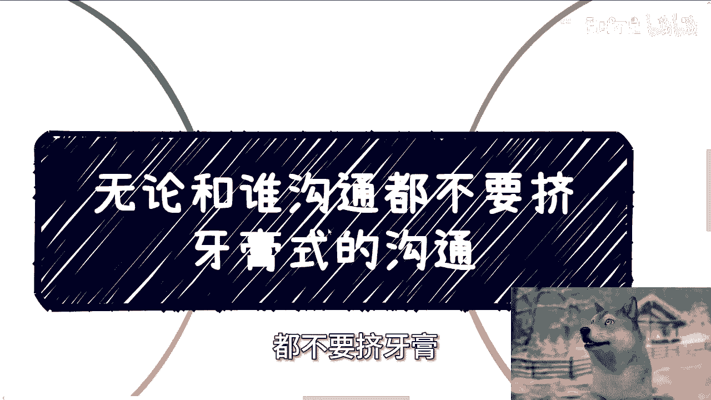
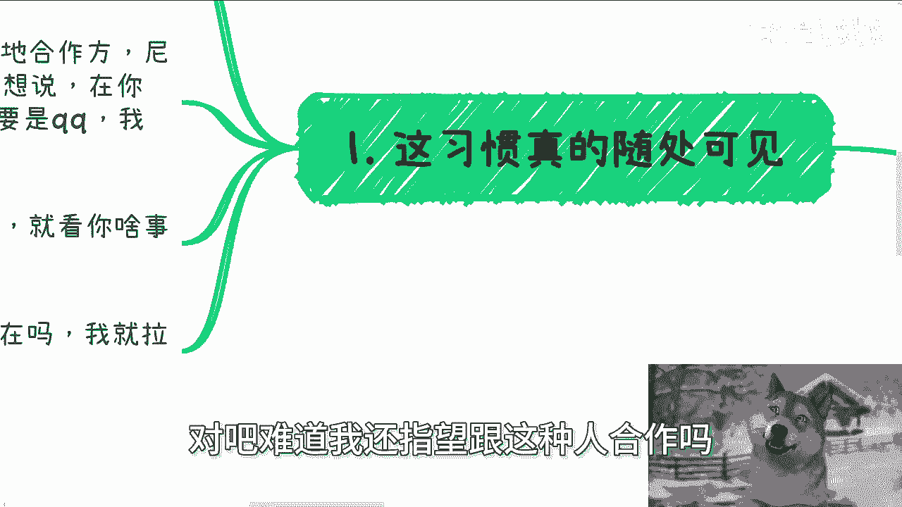
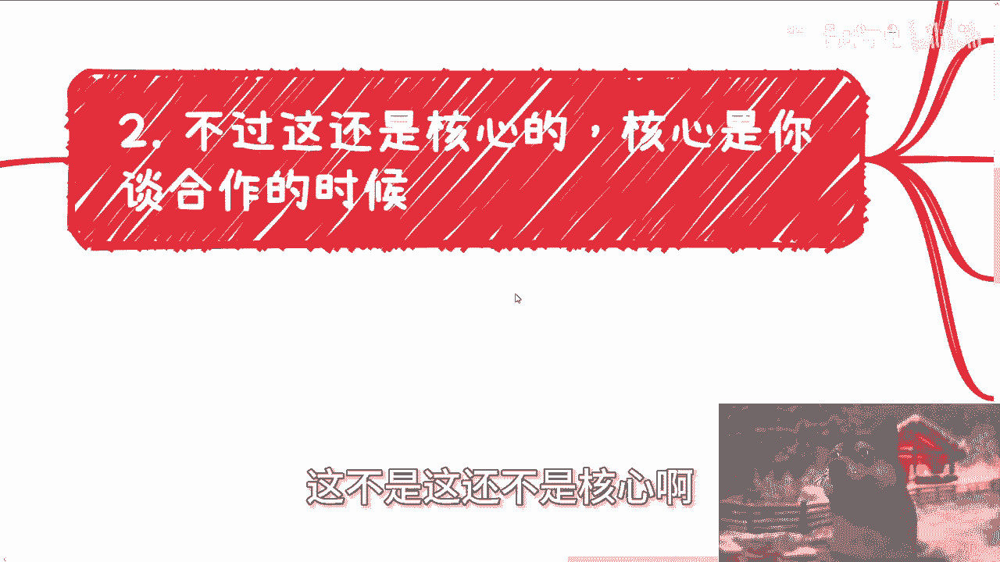
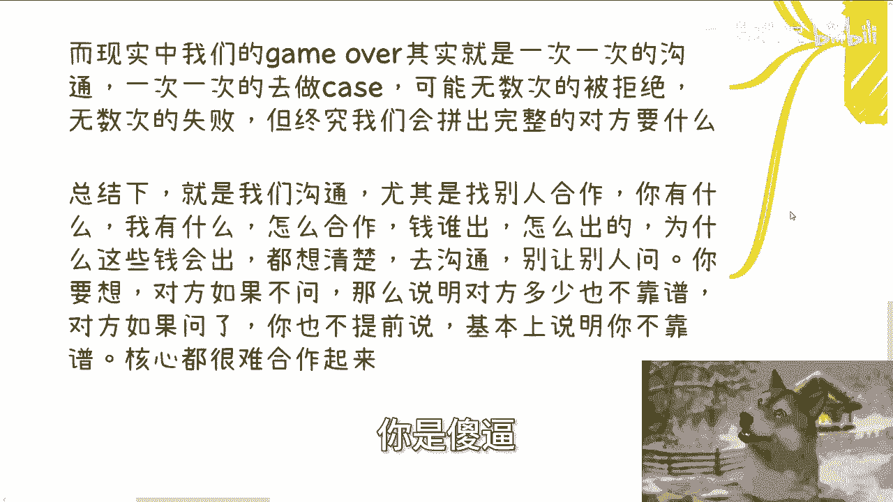
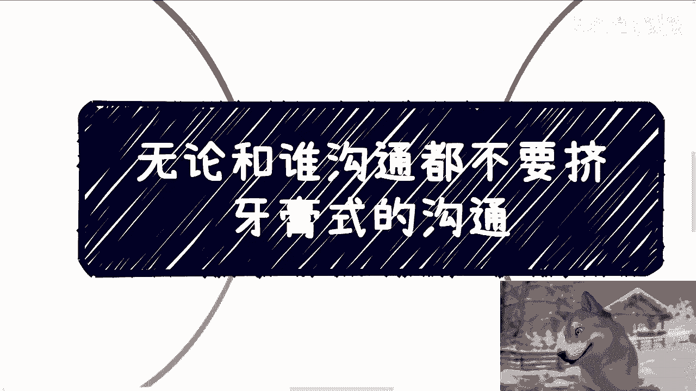

# 沟通都不要挤牙膏式的沟通，要么就别沟通 - P1 - 赏味不足 - BV1JE4m1d78K

好大家好啊，这个因为这两天也不是这两天吧，可能这几天啊，我因为我都在浙江玩嘛，所以就可能晚上会比较晚一点啊。

也有可能出现断更啊，反正我先给你们预警一下。

哈哈呃，首先啊首先我先说一下，下一期活动已经定了好吧，8月25号礼拜天啊，礼拜天场地我已经定好了，呃，在西安啊，在西安呃，他那个附近啊，西安有这么长的那个地铁站名字吗，我都震惊了。

叫呃西安建筑科技大学李家村附近，希望我定的还算那个还算不是很偏啊，我也不太认识啊，然后大概主题的话其实跟之前一样，因为每个地方大家这个交流的人不一样嘛，我也不希望就每次主题都变。

那么一方面就围绕不同企业的offer，另外一方面呢围绕自媒体跟跨境电商，那最后呢我也帮大家在这个展望一下，最近的一些发展啊，未来的一些发展好吧。

然后报名或者了解详情的可以私信我好吧，8月25号啊，25号，OK那么今天我们主题呢叫做无论跟谁沟通呢，都不要挤牙膏。

挤牙膏式的这个沟通啊，首先第一啊这个习惯呢首先随处可见啊，我跟你们这么说啊，我现在已经理的很清楚了，比如说啊B站私信问我的，他说老板你在吗啊，然后要么就是问我在吗啊，然后就是要我要我回他们的那种啊。

都是让我来付他妈的钱，就在B站上打广告的啊，我他妈现在看到只要再骂我就拉黑啊，然后就是我家的一些销售啊或者场地合作方啊，哎尼玛就是他妈有事没事，就是哎那个陈总在吗对吧，巴拉巴拉巴拉巴拉。

我很想说妈在你对吧，在你妈的是什么对吧啊，我他妈你倒是说啊，你有屁事话快放，对不对，当QQ呢，我跟你讲，我要是QQ，我他妈365天隐身对吧，就是你有事说你有屁放对吧，我回不回，那是我的事。

那得看说什么事，你问我在吗，我怎么回呢对吧，我我以前就说过，我回在吗，我就觉得我回在，我觉得我是，我回不在，我觉得你是，那你想怎么办，对不对啊，那么我现在就是看都不看啊，我就懂了，就B站只要问我了。

我就拉黑微信，只要问我了，我就删除，有什么好问的呢对吧，难道我还指望跟这种人合作吗。

没啥好合作的啊，第二不过呢这不是这还不是核心啊。

核心呢是你谈合作的时候啊，那么很多人问我，他说陈老师谈业务要注意什么，我跟你们这么说，如果要简单粗暴一点来讲的话，那就是不要让对方在问问题，当你做过介绍或者做过一定的这种叫什么，就是业务介绍之后。

在你的回合过了之后，当进入对方的回合的时候，你不要让他再问出来问题，如果问出来他他妈就是你的问题，你明白吗啊，只要问不出来，你就是完胜啊，那么往往大部分人出去谈业务的时候。

最大的问题就是自己一顿操作猛如虎，但基本上都是不是对方想要的，就是你好像听上去觉得嗯，我他妈给自己打个满分啊，起码打个90分，但是对方就感觉卧槽，在那边说了，逼逼逼逼逼半天逼半天没有我想要的东西对吧。

我们举个例子，这就好像你去跟院长跟校长谈一些消息合作，你的核心啊是上来就说哎，我说一下政策方针对吧，有没有问题没问题啊，介绍团队，介绍产品，然后介绍给学生带来的好处啊，给学校带来的好处对吧。

这个产品服务能做什么等等等对吧，你说的有没有没有问题都没问题啊，以上这些都是你需要事先准备的，也许学校不关心，但是你要准备，你不准备，你就是对吧好，那么第三个啊，那么我们接下来就要开始说。

最最核心的就是学校关心学校需要了解的，以上说的就这些东西是要了解的，没有错，但肯定不是他们关心的，你明白吗啊绝对不是他们关心的，那么学校关心是什么呢，学校关心就是说啊，是你这个平台有没有试用账号啊。

平台长什么样子，你这个平台功能和合作能切什么方向啊，比如说这个平台能切的是数字经济方向，人工智能方向还是新知识生产力方向对吧，也就是说你要帮学校包装好这个饼到底是什么，你不要指望学校去包装。

也就好像我们想要去找甲方谈业务的时候哦，难道你指望甲方帮你包装吗，那不可能啊，对不对啊，包括产品的架构啊，未来的发展啊，功能的迭代啊，你都要提供好啊，你别让学校去问啊对吧，然后最重要的是什么。

最重要的就是合作模式哦，嗯那比如说我们是通过产学研的合作模式呢，还是产业学院的合作模式呢，还是单纯的采购呢，还是实验室呢，还是说披着采购的皮的实验室呢，对吧等等等等等，那么付费模式是什么，是分批付。

还是说是是是怎么个付法，交付一定东西付啊对吧，包括明年每一年的维护费是怎么样子对吧，就是说你这些本质上你都不要让学校去问，就像我们刚刚说的，你你但凡让学校问，学校就会觉得你是，你懂吗，因为你让学校问了。

学校就会觉得你没有经验，你明明该说的最核心的东西你都不说，那我指望跟你合作什么呢对吧，那对方就会觉得你是没有经验，或者说对你好感是下降的，会认为其实你都该想到的事，你都没有想到。

你明白吗啊那么第四当然很多人就要说了，那他妈我们也不可能他妈预测对方，能有什么问题，对不对对，所以这就回到我每次日日夜夜，核心说的那个问题，你日常就要沟通，要积累，你要找到靠谱的人，你可以请吃饭了解。

你可以咨询了解，你可以找一些专门做学校业务的这种销售啊，商务啊，了解你不要到真正你今天要做一件什么事情，比如说你说我要去找学校谈合作，我要去找什么什么什么领导谈合作对吧，找教授谈合作。

你不要到那个时间再临时抱佛脚，抱不起来的呀，你明白吗啊其实本质上我们要这么想，这就跟我们打游戏是一样的，为什么我们打一个游戏，比如说超级玛丽或者别的东西，甚至是老头环对吧，你能通关，为什么能通关。

就是因为一次一次在game over，对不对啊，而现实当中我们的game over是什么，就是一次一次的沟通，一次一次的做kiss，可能一次一次的被拒绝，一次一次的失败。

但终究我们会拼出完整的对方要什么，这不就是你要去摸索，你要去沟通，你要去了解的东西嘛，对不对，你我就我跟你们讲，我我我了解我沟通下来这么多人，我已经明白了很多人就是属于那种就就做事情，他一定要成功。

比如说一次失败不行啊，我我就在那边抑郁了啊，就就抑郁了对吧，就就就就不就不再尝试了，要么就是说我非要从一个人或者两个人，就是从那种极少数的啊，就是比如说努力的一两次，两三次我就要得到完整的拼图。

你得不到啊，你怎么得到呢，对不对，你就像我当年去给写写国标，去做人社部那个那个整个的这个培训，或者来说叫做呃叫做写完国标给给培训啊，给考试这件事情，卧槽我他妈打了多少电话，我拜访了多少的这种机构啊。

啊前前后后我不夸张的说啊，我以前说过，我不夸张的说啊，呃涉及到的城市将近有十五六个对吧，拜访打电话的起码上百次，卧槽拒绝我的事比比皆是啊，我他妈打电话过去，人家搞得我他妈像电话传销一样的，对不对。

谁不是这么过来的啊，所以说我核心啊，我觉得就是我们沟通，尤其找别人合作，你有什么我有什么怎么合作，钱谁出钱怎么出的，为什么这些钱能出钱，为什么能保证能出，都想清楚再沟通对吧，你不要让别人问对吧。

你要想啊，就像我们刚刚说的，你问在妈，我怎么回呢，对不对，你所有问题都归结到这个上面，就是我但凡回在我是，我但凡会不在，你是。

对不对，你不要让对方去去做这种选择，何必呢，就像我这边说的，你要想对方如果不问，那说明对方多少不靠谱，如果对方问了，你也不提前说，那既然说明你不靠谱，那呵那我就不不知道。

就就你说大家付出时间或付出努力对吧，去私信了或者去了解了，去沟通了，那那谁都谁都是为了能够促进case，能够成，谁都是为了能赚钱对吧，你为什么要让对方问这种问题呢，对不对啊，行吧啊。

就这么着吧，然后那个活动好吧，活动咱们就反正私信我报名，8月25号啊，还早25号好吧，下午啊在西安嗯，在那个西安建筑科技大学李家村附近。

我表示我真不知道这什么地方啊，嗯然后剩下的话就是说你们在职业规划上面，商业规划上面啊，包括股权啊，分红啊，丰润啊，商业计划书啊，白皮书啊，对吧，呃这个啊期权啊，股份啊对吧等等等啊。

包括你们希望我能够给你们一些呃，接第七节呢建议或者说让你们少走点弯路的话，你们可以整理好对应的问题和个人背景好吗，我们再来走咨询。

