# 沟通课 01：告别“挤牙膏式”沟通 🚫

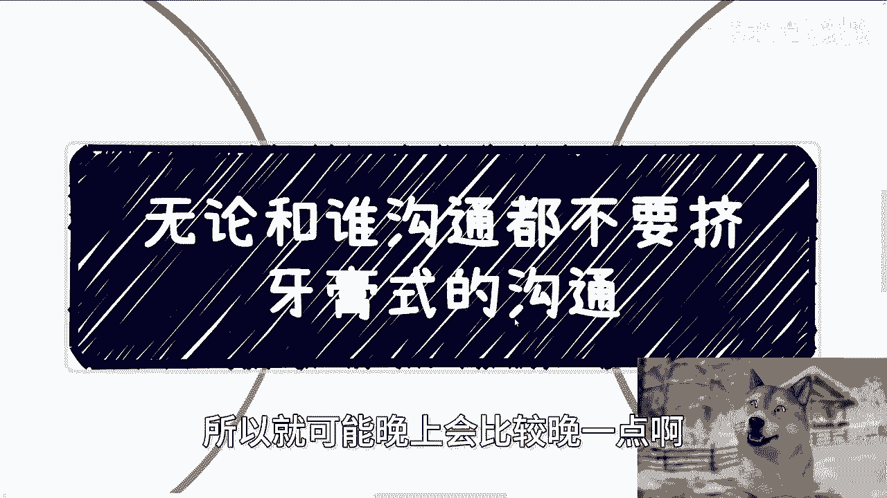

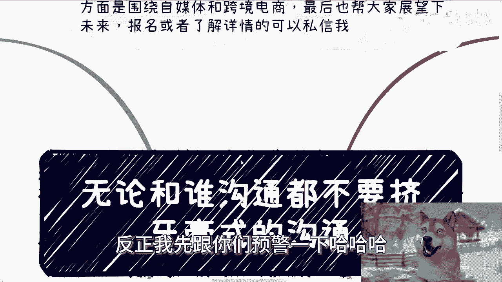

在本节课中，我们将学习一种高效的沟通方式，核心是避免“挤牙膏式”的沟通。我们将探讨这种沟通方式的弊端，并通过具体场景分析如何一次性、完整地传递信息，从而提升沟通效率和成功率。

---

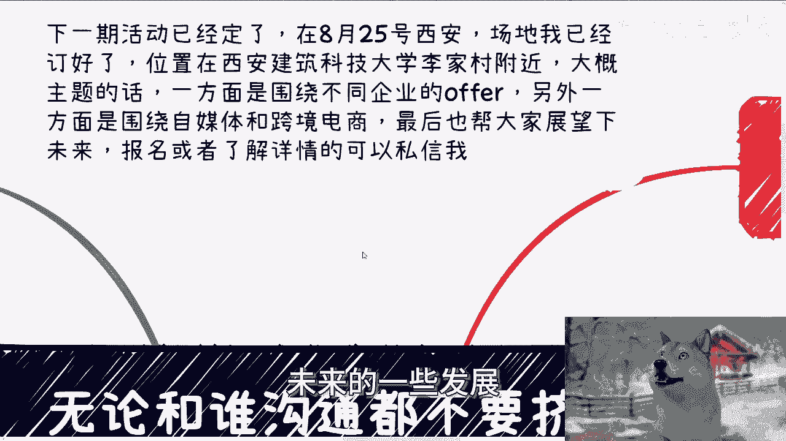

## 课程预告与说明

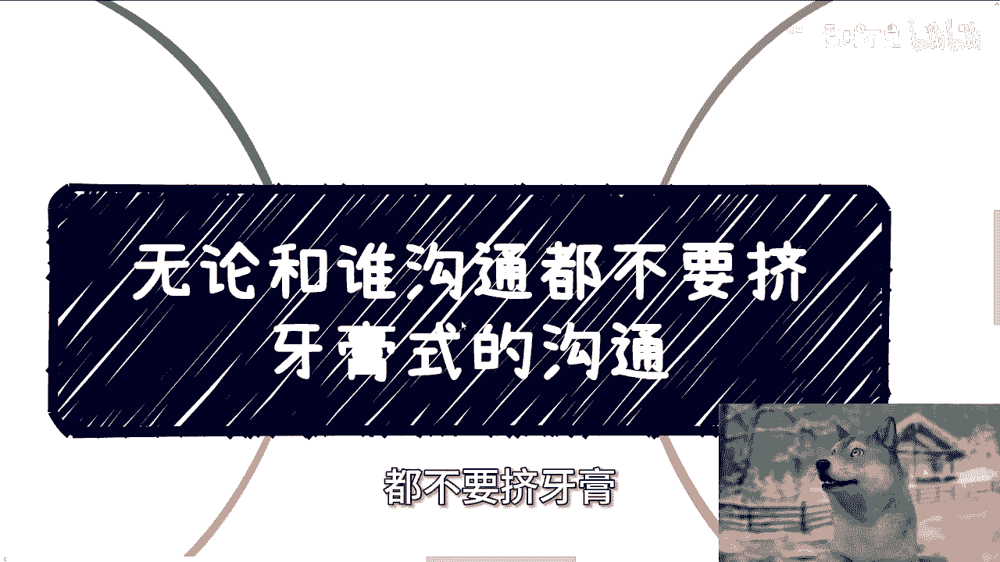

近期因个人行程安排，视频更新可能不太规律，特此说明。

下一期线下活动已确定于8月25日（周日）在西安举办，具体地点在西安建筑科技大学李家村附近。活动主题将延续以往，主要围绕不同企业的offer选择、自媒体与跨境电商运营，以及对近期行业发展的展望进行交流。

报名或了解详情请私信。

---

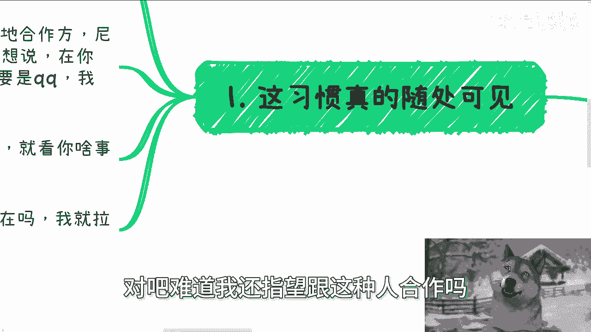

## 什么是“挤牙膏式”沟通？

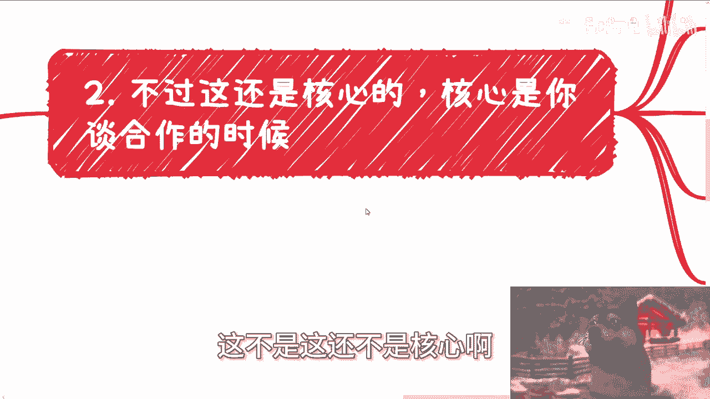

“挤牙膏式”沟通是指沟通者不一次性把话说清楚，需要对方不断追问才能获得完整信息的低效沟通方式。这种习惯在日常生活中随处可见。

以下是几个典型的例子：
*   **无效开场**：在社交平台上仅发送“在吗？”或“老板你在吗？”，等待对方回复后才说明来意。
*   **合作沟通**：在与销售或合作方沟通时，对方不直接说明具体事项，而是先进行无意义的寒暄或确认。

这种沟通方式浪费双方时间，并可能给接收方带来糟糕的体验。对于发送方而言，也可能直接导致合作机会的丧失。

---

## 高效沟通的核心：让对方“问不出问题”

在商务合作或重要沟通中，一个简单粗暴但有效的原则是：**不要让对方在你的回合结束后还能提出问题**。

许多人介绍业务时，感觉自己准备充分、表现完美，但对方却觉得没有听到关键信息。问题就在于，你说的可能只是“需要了解的”背景，而非对方“真正关心的”核心。

上一节我们认识了低效的沟通模式，本节中我们来看看如何构建高效的沟通内容。关键在于预测并覆盖对方的所有关切点。

以与学校洽谈业务合作为例：

你需要准备的内容包括：
1.  **政策与团队背景**：介绍相关政策和己方团队。
2.  **产品与服务**：说明产品功能及能为学生和学校带来的好处。

然而，学校真正关心的是以下核心问题，你应当主动阐述：
*   **产品体验**：平台是否有试用账号？界面和功能如何？
*   **合作方向**：合作能切入哪个具体方向（如数字经济、人工智能）？你需要为学校“包装”好这个合作项目。
*   **合作细节**：具体的合作模式（产学研、产业学院、采购、实验室等）、付费模式（如何分期、与交付成果如何挂钩）以及每年的维护费用。

如果你让对方问出这些问题，对方会认为你缺乏经验或准备不足，从而降低对你的信任感和合作意愿。

---

## 如何做到“不让对方提问”？

你可能会想，不可能完全预测对方的所有问题。这确实需要积累。

这就像打游戏通关，每一次“Game Over”（沟通失败、被拒绝）都是一次学习机会，帮助你拼凑出对方需求的完整拼图。现实中的沟通也是如此，需要通过多次实践来积累经验。

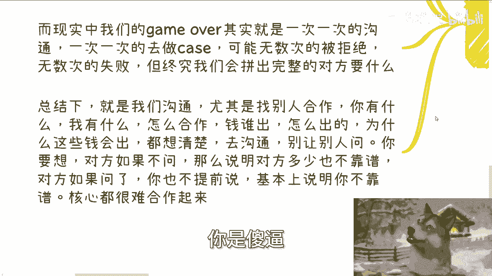

以下是达成有效沟通的路径：
*   **日常积累**：不要临时抱佛脚。在日常就应多与相关人士（如行业销售、商务）沟通、请教，积累对目标对象需求的认知。
*   **勇于试错**：接受沟通可能不会一次成功。不要因为一两次失败就放弃。完整的认知图景需要通过多次沟通尝试来拼凑。
*   **事前穷尽**：在重要沟通前，反复思考并厘清：**我有什么、对方有什么、我们如何合作、钱由谁出、怎么出、为什么对方愿意出钱**。把所有能想到的问题和答案都准备好。

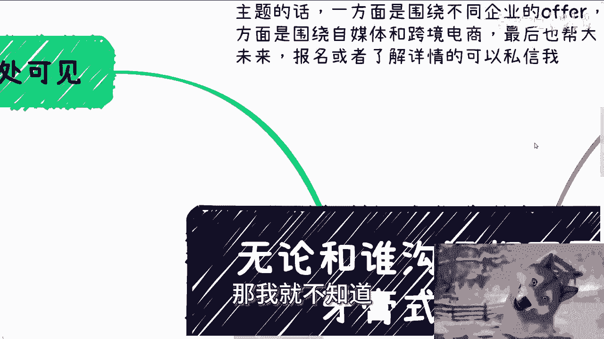

沟通的本质是双向的。如果你让对方陷入“问‘在吗？’-我该怎么回？”的尴尬境地，那么沟通在一开始就陷入了低效循环。你的目标是让对方无需追问，就能获得做出决定所需的全部信息。

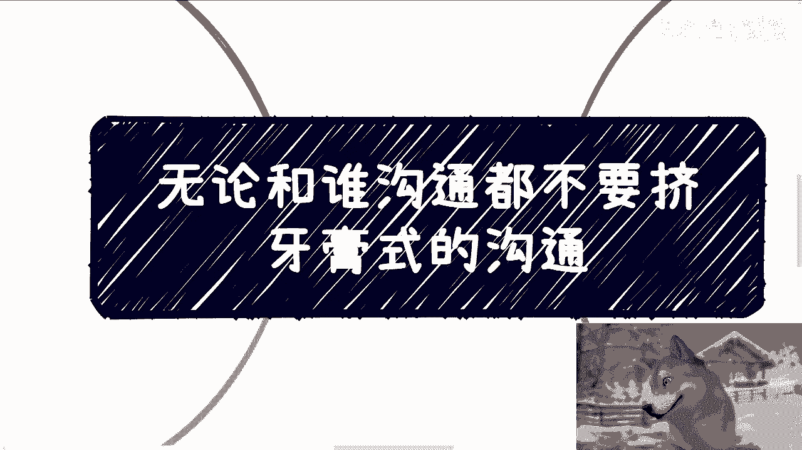

---

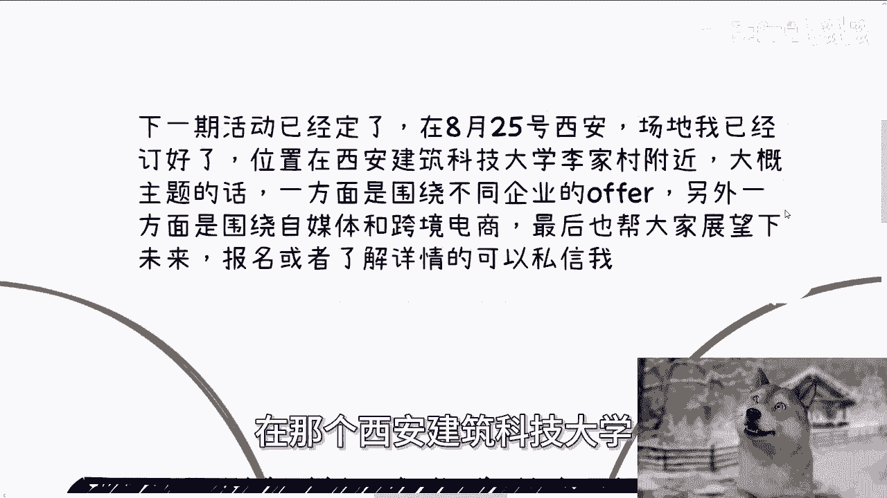

## 总结与后续

本节课中我们一起学习了“挤牙膏式”沟通的弊端，并掌握了高效沟通的核心方法：**通过充分的准备和清晰的表达，一次性覆盖对方所有关切点，力求让对方“问不出问题”**。这不仅能提升沟通效率，更能展现你的专业度和可靠性，为成功合作奠定基础。

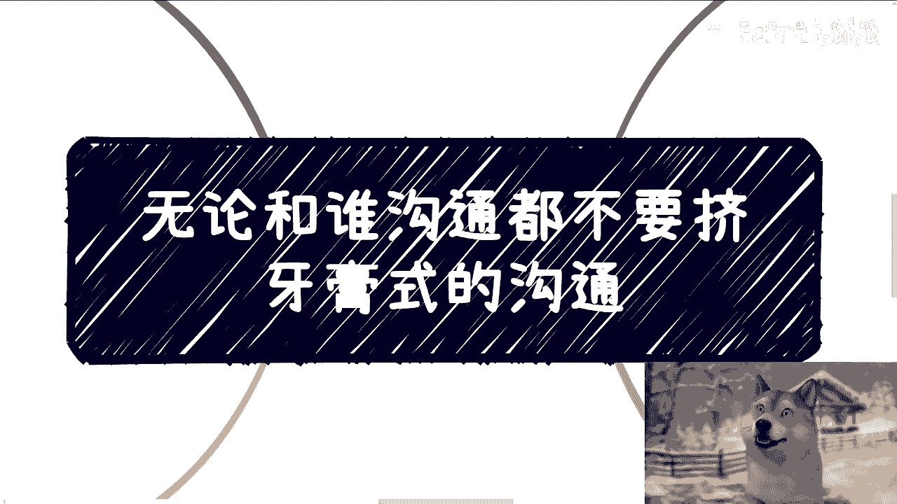

最后再次提醒，8月25日西安线下活动欢迎报名。此外，如果你在职业规划、商业规划（股权、分红、商业计划书等）或需要个人发展建议方面有问题，可以整理好具体问题和你的个人背景，通过咨询进行深入交流。