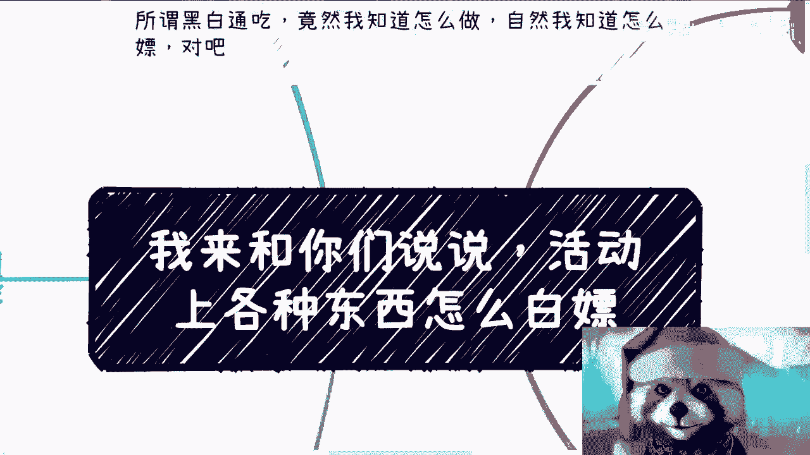
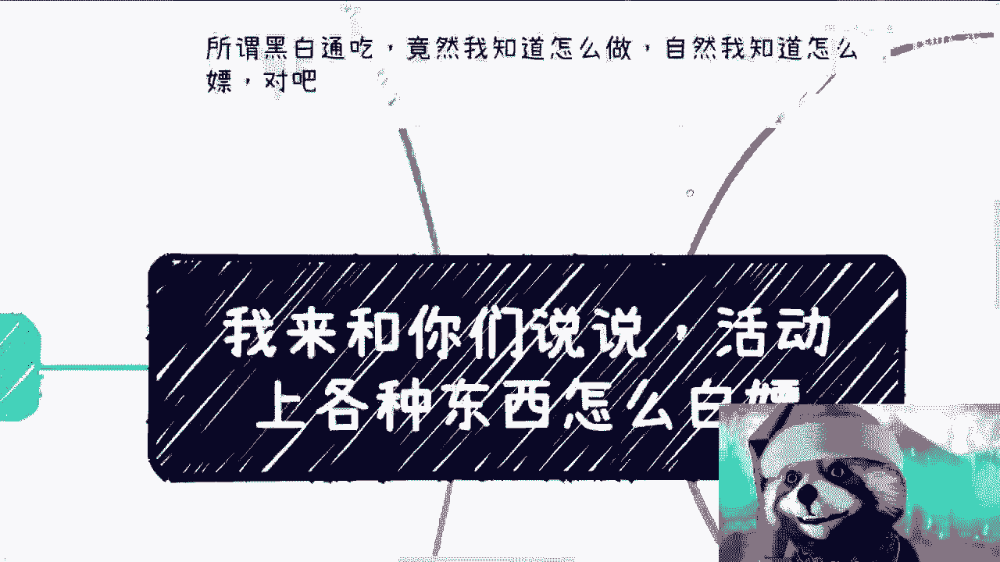
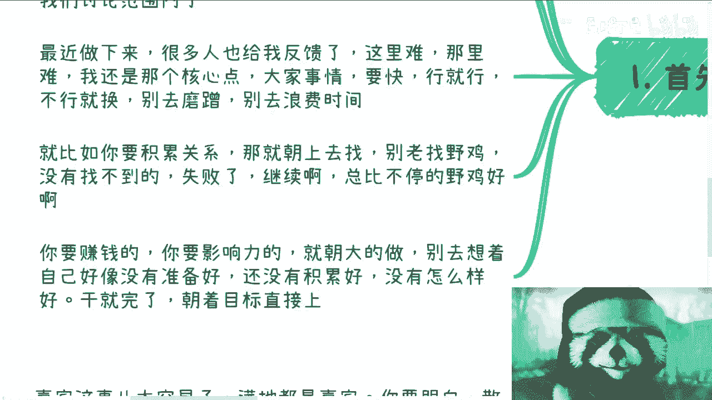
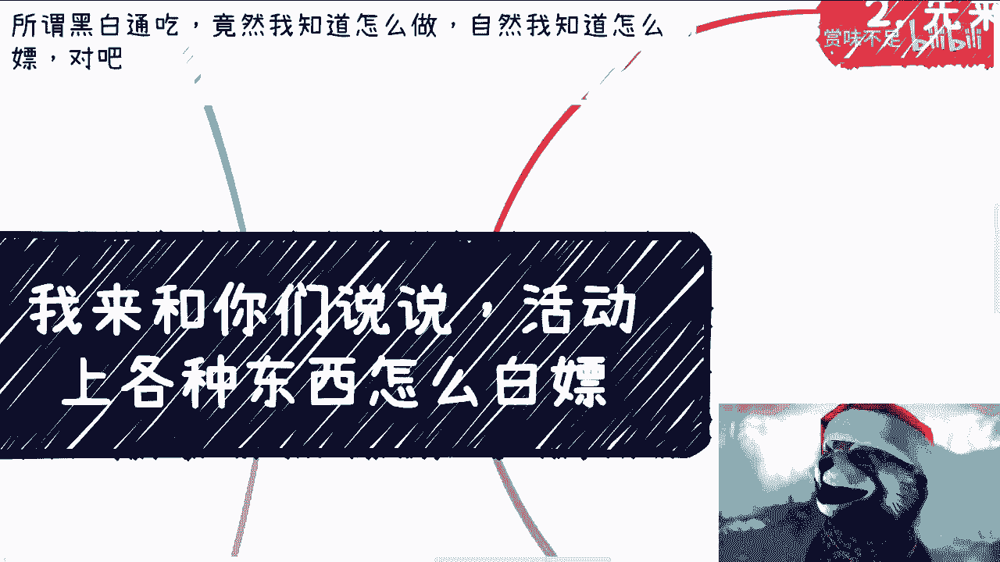
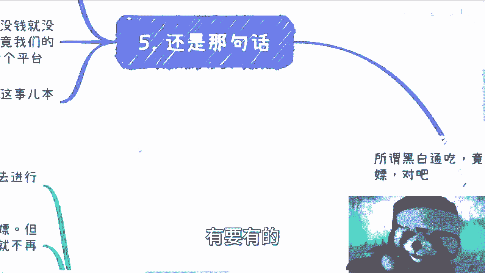
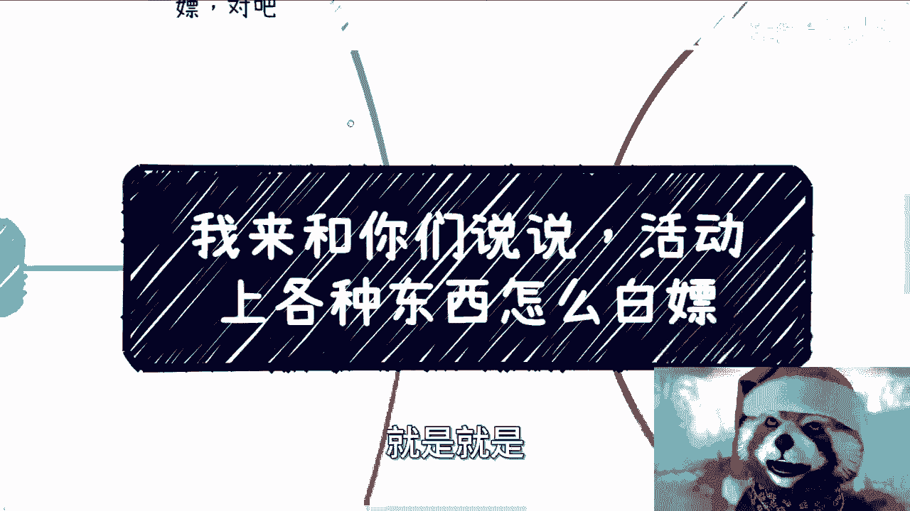

# 课程01：如何高效获取活动资源 🎯

在本节课中，我们将学习如何以“双赢”的方式，低成本甚至零成本地获取举办活动所需的核心资源。我们将探讨赞助、场地、嘉宾等关键要素的获取方法，并建立正确的行动心态。

---

## 概述：理解“白嫖”的双赢本质

首先需要明确，这里讨论的“白嫖”指的是一种**双赢的方法论**。它建立在双方自愿、互惠互利的基础上，而非恶意竞争或损害他人利益。其核心是资源互换与价值创造。

许多人在筹备活动时感到困难，核心问题在于行动不够果断，目标不够明确。做事要快，要懂得断舍离。目标明确，行就行，不行就换，不要浪费时间。

例如，要积累关系就去网上寻找，不要找不靠谱的对象。要赚钱或扩大影响力，就朝大规模去做，不要小打小闹。不要总以“没准备好”为借口拖延，否则永远无法开始。

---

## 核心资源获取方法论

上一节我们明确了行动心态，本节中我们来看看具体如何获取各类资源。

### 1. 获取赞助 🎁

赞助并非只有金钱。最容易获取的赞助形式有以下三种：

以下是三种易于获取的赞助形式：
*   **演讲机会（Topic）**：这是最容易的。为赞助方提供20-30分钟的演讲时间，允许他们进行宣传。这本身是空余资源，被“白嫖”也无妨。之后，你可以利用该赞助方的品牌背景，去获取其他资源。
*   **展位**：可以寻找公司、商业机构、协会，尤其是出版社。出版社通常非常需要展位来展示书籍，成功率很高。获得一个展位赞助后，可以此为基础撬动其他资源。
*   **礼品**：中大型企业的仓库里常积压着各种宣传礼品。索要这些礼品实际上是帮对方清理库存，双方都受益。

表面看是对方在利用你的活动，实则是你在利用对方的闲置资源。关键在于认清自身初期“无可被利用”的状态，从而放平心态。

### 2. 获取场地 🏢

场地是极易获取的资源。任何拥有空间的地方都是潜在目标。

以下是常见的场地来源：
*   咖啡馆、共享办公空间、酒吧。
*   学校、大型公司的会议室。
*   协会、商会、产业园、生态园的展厅或活动室。

这些场地闲置便是浪费，使用才能产生价值。洽谈的关键是“跪舔”对方的KPI——了解对方需要什么，并尽力满足。

以下是满足场地方需求的常见方式：
*   对方需要演讲机会，就提供。
*   对方需要品牌曝光，就配合。
*   对方需要发放传单，就允许。
*   对方需要收集名片，就协助。

你的核心目标是获得免费或低成本的场地使用权，其他条件都可以灵活满足。初期你本身没有太多可损失的资源，无需顾虑过多。

### 3. 邀请嘉宾 🎤

嘉宾资源非常丰富，关键在于沟通方式。

以下是两类嘉宾的邀请策略：
*   **个人嘉宾（散户）**：这类嘉宾通常不擅长拒绝，相对好沟通。
*   **公司或官方背景嘉宾**：这类嘉宾可能因身份限制，无法收取费用或不便出席商业活动。

邀请话术可以坦诚说明是首次举办活动，预算有限，无法承担差旅费用。同时可以“画饼”，承诺未来活动会提供报酬，并当场赠送证书、奖杯、额外门票或丰厚礼品作为感谢。

嘉宾的差旅费往往是活动中最难覆盖的成本之一。如果能解决这部分，活动整体成本将大幅下降。

---

## 总结与行动指南

本节课中我们一起学习了如何以双赢思维获取活动资源。我们已经涵盖了赞助、场地、嘉宾这三个核心成本项的获取方法。

做事情要追求结果，不要温水煮青蛙。要搞关系就专注搞关系，要赚钱就直奔赚钱。活动没有固定模式，有钱和没钱的做法不同，但参与各方通常能相互理解。活动的本质是流量和价值交换的平台。只要双方各取所需，没有金钱往来也可以成功。

方法有很多，但不要把格局做小。要做事就放开手脚，寻找资源时要向上看。不要总想着“我现在什么都没有”，因为如果不去行动，你可能永远都不会有。

请记住，一切操作都应保持在正规范围内。如果你有商业计划不知如何推进，或合同不知如何审阅，可以整理好问题寻求进一步咨询。

---