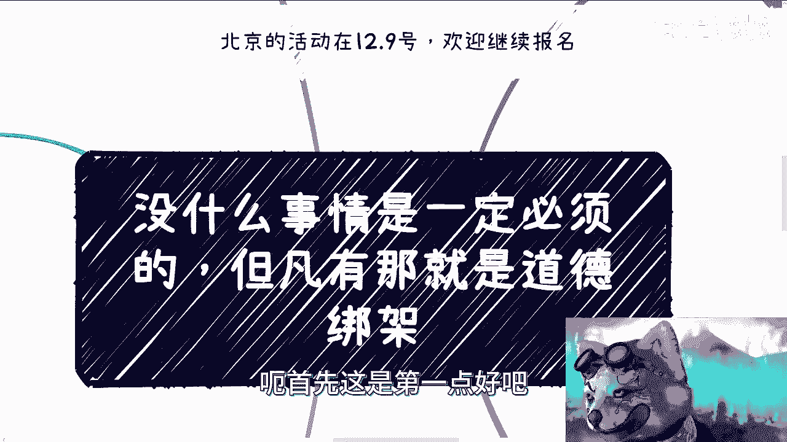
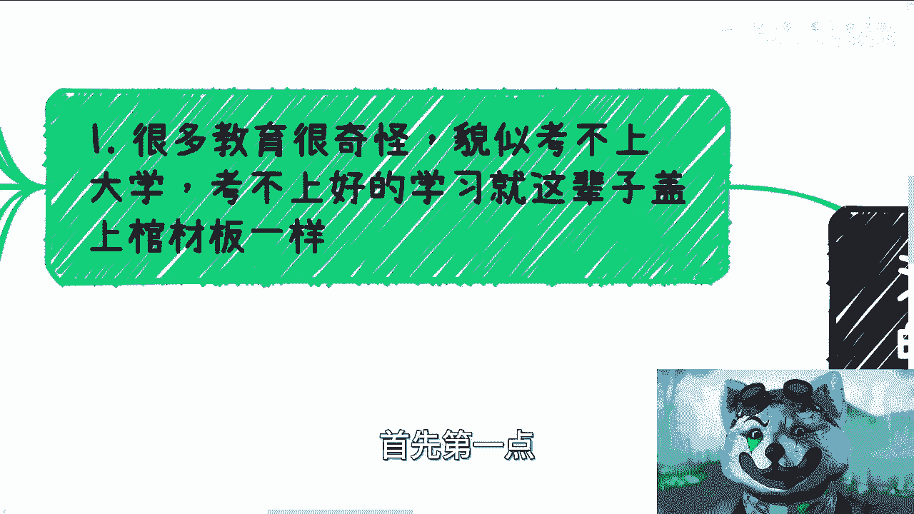
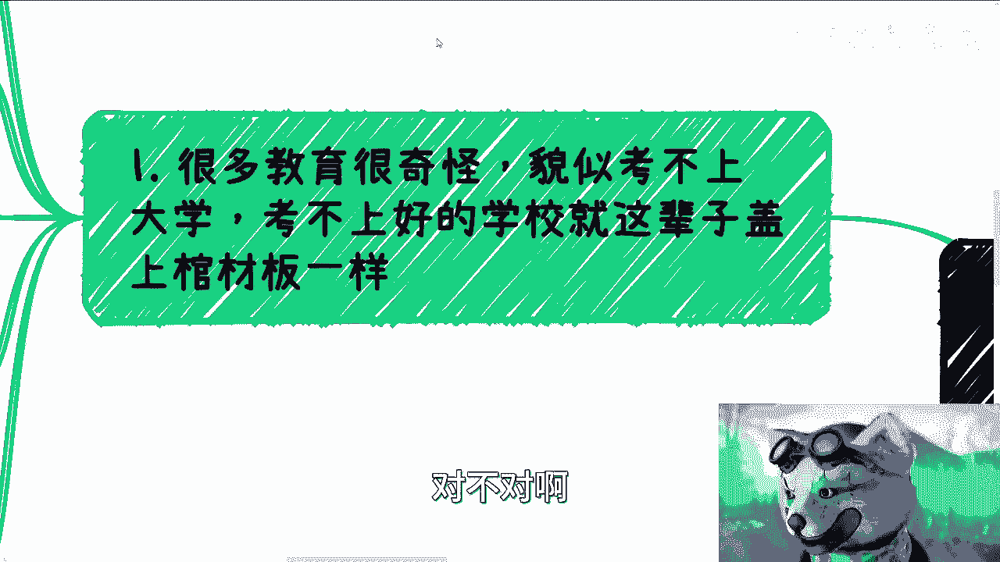
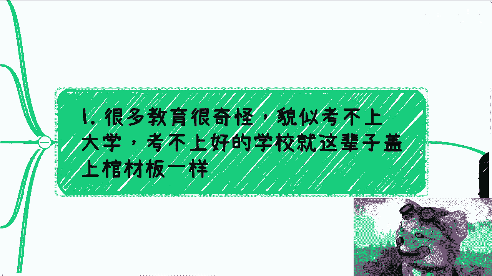
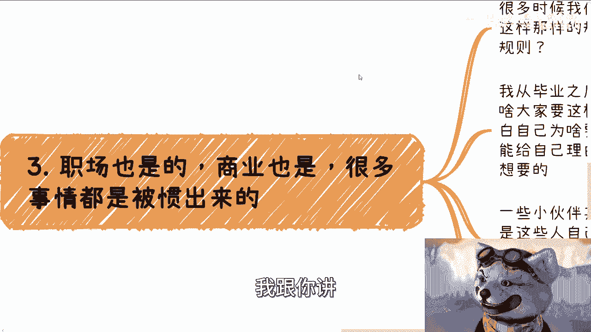
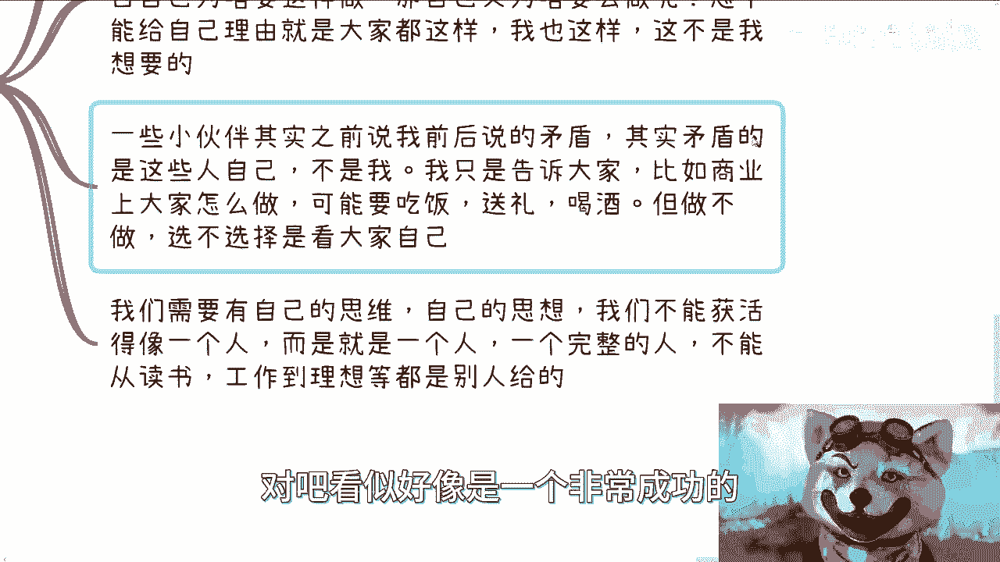
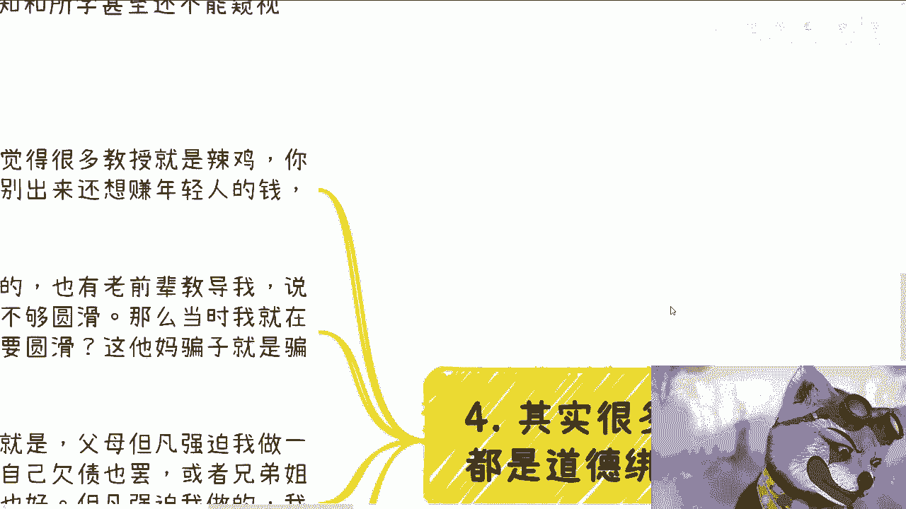
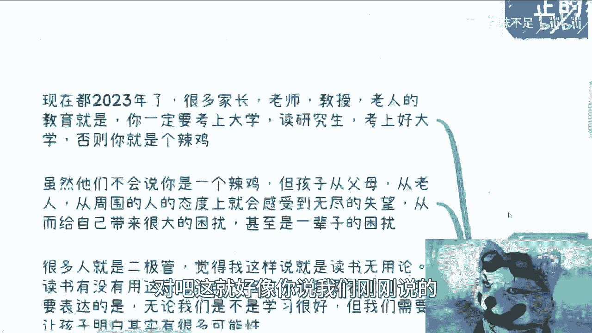
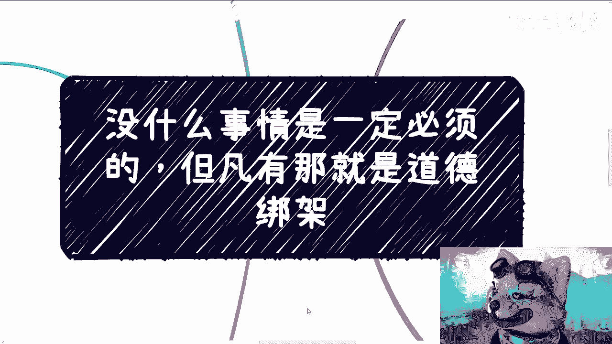

# 课程01：识别与拒绝道德绑架 🛡️

在本节课中，我们将学习如何识别生活中常见的“必须”与“应该”，并理解其背后往往是道德绑架。我们将探讨在学业、家庭、职场等多个场景下，如何保持独立思考，维护个人边界，成为一个真正独立自主的人。

## 课程概述与活动通知

首先，通知两件事。广州活动举办成功。现场有人喊“爹”的行为令人震惊。

北京活动已定于12月9日。欢迎报名。报名可私信我，或查看B站动态详情。很多人不看动态，建议查看。

## 核心理念：没有什么是“必须”的

现在回到课程主题：**没有什么事情是一定必须的，但凡有大概率就是道德绑架**。

这个主题酝酿已久。探讨此主题有一个最大前提：**你是一个人，一个具有独立人格的人**。关键点在于：我们不是要“活得像”一个人，而是“活得就是”一个人。

## 第一节：教育中的“必须”陷阱 🎓

上一节我们确立了“独立人格”的前提，本节中我们来看看教育领域常见的绑架。

教育中存在一个奇怪现象：似乎考不上好大学，人生就被“盖棺定论”。尽管只活了十几年，但在那个节点仿佛就被钉死了。

对此，常见的反驳是：“社会制度如此”、“穷人只有高考这一条路”。我们可以用两个问题来对峙：
1.  **考上大学能怎样？** 谁能担保具体得到什么？
2.  **“只有这条路”是谁说的？** 凭什么认为这是对的？

现在是2023年。许多家长、老师的教育逻辑是：必须考上好大学、读研，否则就是失败者。即使他们不说“你是垃圾”，孩子也能从态度中感受到无尽的失望与绝望，从而自我否定。

这造成一个恶性循环。很多人未来可能会从“被PUA者”变成“PUA的主导者”。需要意识到，**读书有用与否取决于人，不取决于读书本身**。

核心问题在于：无论孩子学习好坏，很少有人告诉他们人生有多种可能性。有时是他们不知道，有时是他们不敢说。这些“非主流”的可能性，常被视作歪门邪道。

但恰恰是这些“歪门邪道”，往往是真正推动社会发展的力量。支撑国家发展的，是中央到地方的政策、国企央企、中小微企业，而不仅仅是“打工人”。

我们的教育在无形中为每个孩子建造了“象牙塔”，让他们相信人生只有一条路。更奇怪的是，虽然都强调“必须考上”，却没人能说清“考上具体能得到什么”，所有好处都模棱两可（如“好人脉”、“好工作”）。

我们需要思考：身边赚钱多的人学历一定高吗？经验多的人一定厉害吗？活得长的人一定优秀吗？很多家长和老师自己也不清楚“考上是为了什么”，却在PUA孩子。

**公式：人生可能性 ≠ 单一标准化路径**

我们必须明白，自己已被套上多层“象牙塔”。无论学业好坏，进入社会才是真正的开始。对大部分普通人而言，学校所学甚至不能窥见社会冰山的一角。

因此，要记住一个中心点：**不以物喜，不以己悲**。不要因考得好而沾沾自喜，觉得前途一片大好；也不要因考得不好而绝望，认为人生无望。两者没有必然关系。

## 第二节：家庭与婚恋中的“必须” 👨‍👩‍👧‍👦

上一节我们讨论了学业压力，本节来看看家庭和婚恋中强加的“必须”。

我们常听到：年龄到了就必须谈恋爱、结婚。

为什么？一个人生活不可以吗？很多人会说：“不结婚就是不尊重我们”、“不结婚就是对不起祖先”。这毫无道理。如果这是“违背祖先的决定”，那就让祖先来找我。你可以用道德绑架我，我也可以用同样的逻辑反驳你。

人类社会有许多莫名其妙的理念和执念，但这些不能成为评判个人的标准。我接触过很多被家庭PUA的女孩，被告知“读书不重要，嫁个好人家就行”。这是2023年，这种观念毫无因果关系。

**前提是：我们是一个人**。作为成年人，我们对父母有赡养义务，对子女有抚养责任（如果选择生育）。除此之外，**关我屁事，关你屁事**。

关于恋爱、结婚、亲戚间的复杂关系（如借钱），我的观点是：每个人都有自己的生活。我们没有义务去管那么多。别用人类社会的道德观来绑架彼此。

即使是亲兄弟，如果他自己不负责、不尊重自己，那也与我无关。我凭什么要被绑架？借钱与否，**愿借是情分，不借是本分**。不借钱不代表是坏人。

以下是处理家庭道德绑架的思考步骤：
1.  明确核心责任：仅对直系亲属（父母、子女）有法律和基本道德责任。
2.  区分请求与绑架：对方是提出请求，还是利用亲情进行要挟？
3.  评估自身意愿与能力：我是否愿意？我是否有能力？
4.  做出选择并承担后果：选择拒绝或接受，并坦然面对相应的结果。

## 第三节：职场与商业中的“规则” 💼

上一节我们剖析了家庭关系，本节将目光转向职场与商业。

职场和商业中的许多“规则”都是被惯出来的。我们常听到前辈或网络视频教导各种“规则”或“潜规则”。

我的问题是：规则从何而来？凭什么我必须遵守？从毕业起，我就在问自己：为什么别人要这么做？为什么我要这么做？如果理由仅仅是“大家都这样做”，那这不是我想要的。

简单说：**我不知道我想要什么，但我知道我不想要什么**。

有些朋友觉得我自我矛盾。其实矛盾的是传播规则的人，而不是我。我想告诉大家的是：商业上存在哪些规则或潜规则（如吃饭、送礼），但**做与不做，取决于你自己的选择**。如果每个人都按旧规则行事，世界就不会进步。

我们需要有自己的思维和思想。我们不能“活得像”一个人，而要“活得就是”一个人。一个完整的人，其读书、工作、理想不应全是别人赋予的。否则，即便看似成功优秀，也并非自己真正想活的样子。

## 第四节：识别道德绑架的本质 🕵️♂️

前面我们看了几个具体领域，本节我们来总结道德绑架的共同特征。

我发现，许多“必须”做到的事，最后都是道德绑架。例如：
*   教授用年龄或头衔压人，但可能已脱离一线十几年。
*   前辈教导年轻人要“圆滑”，但面对错误，为什么要圆滑？
*   父母或兄弟姐妹用亲情强迫你做不愿做的事。

我的态度是：在法律框架内，尽可能断绝这种带来强迫的关系。有人会说这“极端”或“异想天开”。但这只是行使一个成年人的合法权利。所谓的“极端”，仅仅因为大多数人没那么做。**谁来定义“异类”？**

每个人都必须先对自己负责。如果父母自己赌博、不负责任，凭什么要孩子来承担后果？凭道德绑架吗？这没有道理。

社会上的许多“必须”并非天然真理。唯一的真理是：**你得做一个真正的、独立的人**。

在法律范围内，为自己负责，为该负责的人负责（如父母子女），就够了。剩下的，秉持“关我屁事，关你屁事”的原则。如果想不通，那是自己在绑架自己，或允许别人绑架你。

就像我批评某些教授。有人会说“要尊老爱幼”。首先，“不尊老不爱幼”并不犯法。其次，尊老爱幼的前提是对方也尊重我和他人。如果对方是个“骗子”，我为什么要尊重他？你不能用这些莫名其妙的道理绑架我。

男女吵架时也一样。“要让着女性”的前提，是她是否尊重我。所有事情都应基于**相互尊重**的前提。

甚至在网络上，有人不关注我却向我要资料（“白嫖”）。我凭什么给？关注我是基本的尊重。连这都没有，就是道德绑架。

**代码逻辑：if (!对方.尊重我()) { 我.无义务答应其要求(); }**

仔细想想，很多“必须”都没有道理，只是“大家都这样做”形成的惯性。多问问自己“为什么”。

## 课程总结与行动建议 ✅

本节课我们一起学习了如何识别和拒绝道德绑架。我们探讨了在教育、家庭婚恋、职场商业中常见的“必须”陷阱，并指出其本质往往是缺乏逻辑支撑的道德绑架。

核心在于：**成为一个具有独立人格的人**，在法律和基本责任框架内，坚持“关我屁事，关你屁事”的原则，维护自己的边界。对于任何“必须”，都要多问几个“为什么”，审视其是否合理，是否源于相互尊重。

最后，北京活动欢迎自愿报名，拒绝任何道德绑架。如有关于职业规划、人生决策或宏观政策的问题，可整理好后再咨询我。