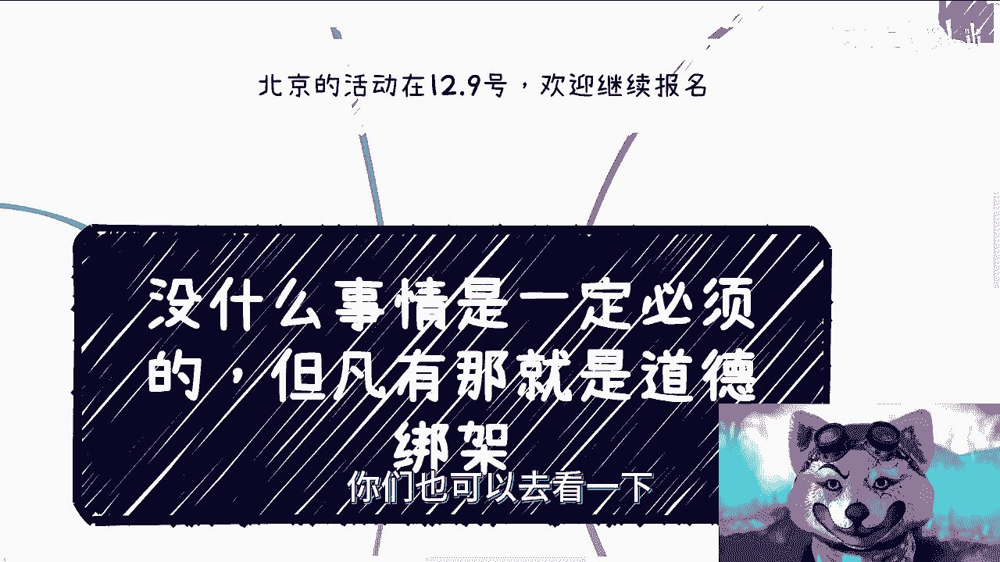
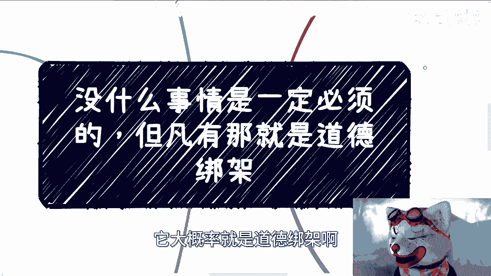
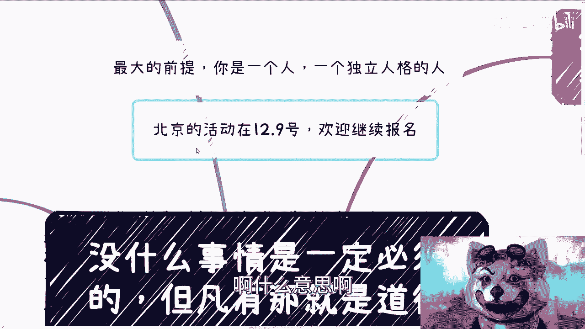
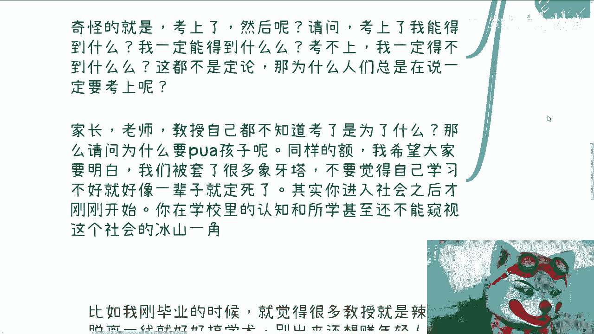
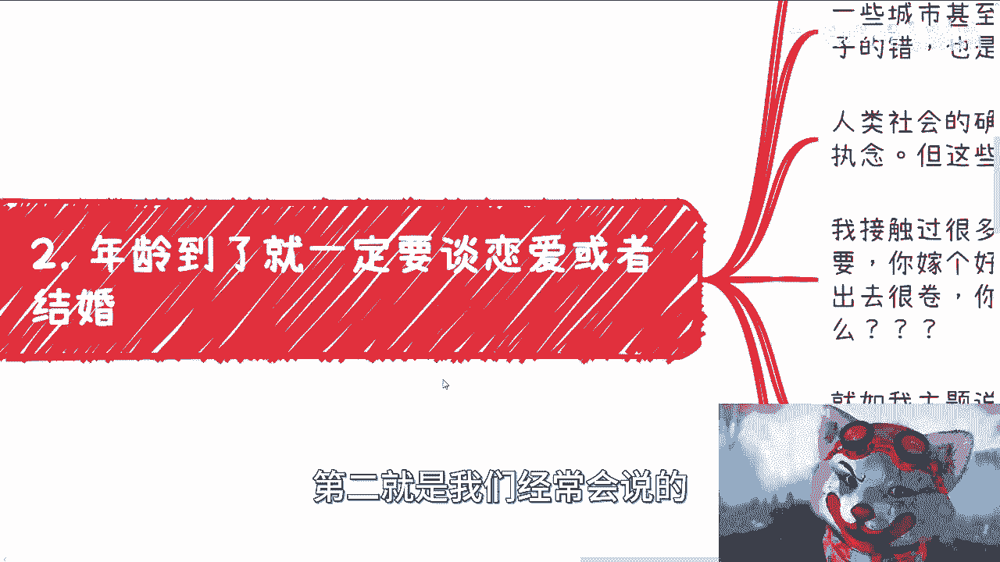
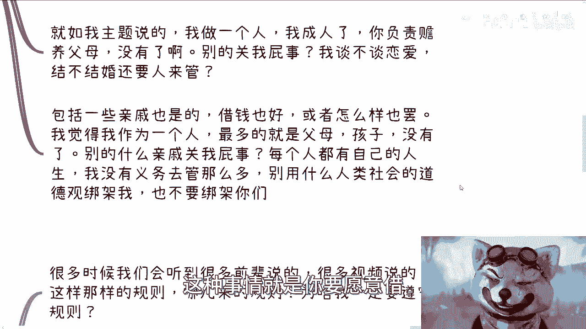
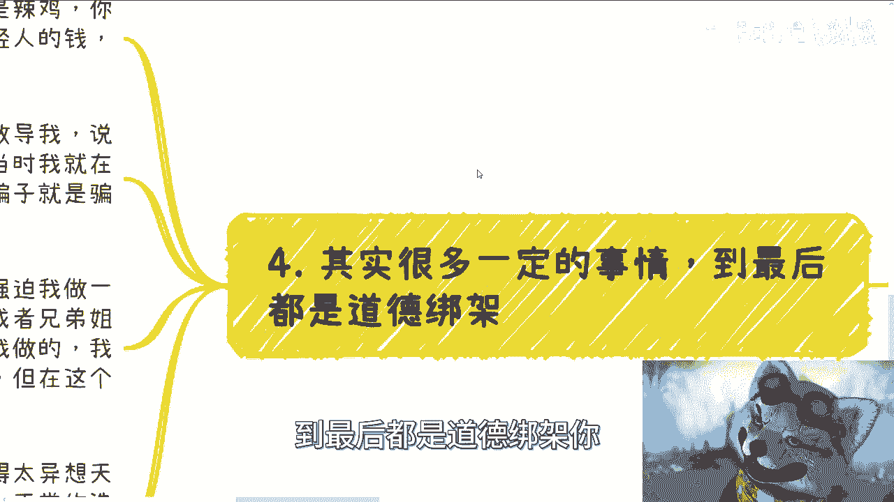
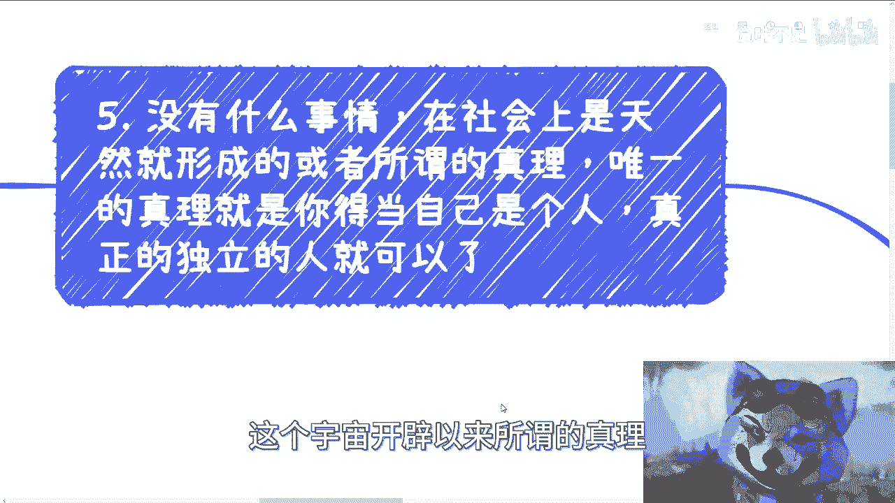

# 没有什么事情是一定必须的，但凡有大概率就是道德绑架 - P1 - 赏味不足 - BV1TC4y1N7of

大家好呃，首先广州这两天的这个活动呢非常的成功啊，这个唯一令我比较震惊的就是，这个现场还有人喊爹是吧，太他妈了是吧，我给大家跪了啊，我就是差点没跪下来啊，就很想跪啊，首先这是第一点。

第二点呢是这样子的，就是北京的活动已经定了12月9号啊，啊欢迎大家继续报名好吧，报名的话你们就私信我啊，那么关于报名的详情，你们也可以在我B站的这个叫什么状态，上面能看到啊。

因为我看到很多人都不看状态啊，你们也可以去看一下好。

那么回到我们主题啊，我们主题叫做什么，叫做没有什么事情一定是必须的啊，啊但凡有那他大概率就是道德绑架啊。

首先这个主题呢嗯其实我讲了想讲了很久了啊，之前也都围绕于这个主题，但是呢没有真正把这个主题讲出来啊，那么首先呢在这当中有个最大的前提，就是你是一个人好，一个独立人格的人，那么在这个地方我得说一点。

就是我们不是要活的像一个人，我们是活的就得是一个人啊，什么意思啊。

我们往后来看，首先啊我在这个地方举了很多例子，首先第一点。

很多时候教育非常奇怪啊，貌似考不上啊，考不上大学或者考不上，我写错了就考不上好的学校啊，好像这辈子就盖棺定论，就是虽然我们只活了十多年或者20多年啊，但是呢好像在那个节点呢。

就把我们已经棺材板盖棺材板盖上了啊，这种感觉啊好那么有很多人，那首先先说这个主题，我先不说，先不展开啊，有人看到这，我相信就是小伙伴要说，那你活在这个中国没办法，你活在人类社会没办法对吧。

那高考就是这样子的一个制度呀，就是怎么样子呀对吧，然后然后这个这个穷人的孩子，也只有高考一条路对吧，怎么样怎么样，好说半天好，可以啊，我先跟你们对峙一下啊，如果你们要这么讲，那我就先问几个问题。

第一我考上大学能怎么样，你能不能担保我有什么东西对吧，首先这是第一点，第二点，穷人的孩子只有这条路，对吧好，这是谁说的，凭什么这样说诶，为什么你觉得这样就是对的呢，哎我不明白了呀，对不对啊。

好我们来展开啊，首先我觉得现在都2023年了啊，很多家长老师教授老老人啊，就是教育都是的，就是说你一定要考上一个大学，读研究生，考上好的大学，否则呢你就是个垃圾啊，虽然啊我们有医术药。

虽然你觉得他们可能不会说啊，你是个垃圾，但是孩子从父母，从老人，从周围的人的态度上面，他会感受到无尽的绝望对吧，或者无尽的失望，就这样子的呀，就是很多人他虽然不会说，但是他感受得出来。

他觉得哎呀附魔好像很失望，哎呀觉得老师很失望，然后一旦失望呢，就会觉得我的自己是个垃圾对吧，好像好像自己就是这辈子废了对吧，或者怎么样子的，就是就是很多时候我觉得大家没有明白哦，没有明白。

包括我今天中午出去吃饭，也是的，就是我对面的那位朋友，他其实也是这么教育孩子的，但是问题是我跟他聊完之后，他也在想，我跟孩子这么说，但问题是带来了什么呢，带来了就是但凡他如果考不上，但凡他如果做的不好。

他就会觉得他这辈子是废的，那这是你们想要的吗，就你们现在我觉得大部分人肯定还比较年轻，对不对，但是我相信你们其实是有感受的，因为你们现在还没有变成一个，还没有变成一个加害于别人的。

还没有变成一个PUA的主导主导者，但是你们其实是一个被PUA的人，但是我相信大部分人，其实未来会变成PV的主导者，这就是我以前视频当中所提到过的，就是其实这就是个无尽的循环，除非你们能意识到。

否则其实就没有意义哦，那么很多人都是二极管，因为觉得我可能这样说，就是在说读书无用论，首先啊读书有没有用啊，读书有没有用，取决于人，这不取决于读书本身对吧，你说读书有没有用，你说有用，我说没有用。

那又怎么样呢，对啊我要表达的是什么呢，就是无论我们是不是学习很好，是不是能考得上好的学校，我们都得让孩子们明白，其实有很多种可能性，但是奇怪的是，奇怪的是，你会发现学校老师教授老人啊。

你身边的人没有一人会跟你讲，还有别的可能性，那当然有的时候是他们不知道，有的时候是他们不敢说啊，这就好像这就好像在这个社会上面，在这个世界上面去讲，那些东西是一个歪门邪道一样的东西。

但是就如我之前跟你们讲的，我非常神奇怪的是，这些外门邪道的东西才是真正赚钱的东西，才是支撑整个这个国家，从地方，从中央到地方政府的一种一种想向前，这个支撑这个发展中国家的这么一些东西对吧。

我在这次广州的活动，当时我就跟大家说过，就是你们觉得支撑这个社会，支撑这个国家，支撑一直发展以来这么长时间是这些打工人吗，不是啊啊，怎么可能是呢，而是整个的中央到地方政府才是才是对吧，国企央企才是啊。

那些中小微企业才是打工人是什么，不是啊，对吧，这就让我有种什么感觉，就是有种让我就说我们的老师，我们的家长，我们的父母对我们的老人，在每个孩子身上都造了无数个象牙塔。

从而让他们感觉到好像人生只有这一条路，但凡你没有走好这条路，你就废了，就很神奇，啊那么这就包括这一点，就像我刚刚问的，说奇怪的是什么，奇怪的是，虽然大家都说要考上，但是没有一个人告诉大家，我们能考上。

能得到什么，让我考不上，我一定得不到什么，不知道，然后所有得到的那个那个结果都是模棱两可的，就比如说考上了，你能得到好的人脉，得到好的工作，考不上你好像就赚不到钱，诶，为什么呢，那我凭什么呢对吧。

我觉得我们得思考这个问题，为什么呢，哦就因为大家这么讲啊，就因为这个社会规则这么定的，没有吧，不是吧，谁跟你讲的，那你身边赚钱人学历一定很高吗，啊对吧，还有人倚老卖老。

那我就问问你身边经验多的人就一定牛逼吗，活得长的人一定吊吗，哎为什么呢，我不明白呀对吧，那当然这可能跟我性格有关吧，天生反骨啊，那么最后一点就是家长老师教授，我觉得自己都不知道考了是为了什么啊。

那么请问为什么PUA孩子呢对吧，同样的我也希望大家能明白，我们已经被套了很多层象牙塔，不要觉得自己学习好不好，就好像这辈子就定死了啊，其实我告诉你们，我无论你们好不好，你们进入社会之后。

其实才是刚刚开始，当然我指的是大部分普通人，就就是做官的或者做做做这种国家背景的，或者说很有钱的，富二代，其实大部分人都一样，那你在学校里面的认知跟你所学的，甚至都还不能窥视这个社会的冰山一角。

你知道吗，没有用的。

对吧，所以说在这个地方就点到，我们上一次视频的那个中心点，就是不以物喜，不以己悲，什么意思呢，就是说不要觉得自己考得很好，就沾沾自喜，就觉得好像未来就是一片大好，也不要觉得自己考得不好。

就好像哎呀这辈子没戏了对吧，就就非常的昏暗或者怎么样，没有任何的关系，我可以告诉你们啊。

好第二就是我们经常会说的。

年龄到了就一定要谈恋爱或者结婚，对不对，好，那为什么啊，我们说为什么啊，就像就是我就是这么一个人，为什么啊，一个人过不香吗，啊为什么年龄到了就一定要谈恋爱呢，一定要结婚呢，我就问为什么呢。

有很多人要说了啊，你你不结婚，你不谈恋爱，你不尊重我们，怎么了呢，哦一些城市觉得甚至找不到好的对象，甚至不不结婚对吧，嫁不到一个好的人家，就是孩子的错，就他妈是你不尊重啊。

就是你这种什么做了一个违背祖先的决定，那怎么了呢，你让祖先来找我呀，哎我的奇怪了，这有半毛钱关系啊，哦你这样就不尊重了，那我他妈还说你这样说不尊重我呢，凭什么你可以绑架我，我不能绑架你吗，对吧啊。

我跟你们这么说，人类社会呢的确有非常多莫名其妙的，所谓的理念，甚至是执念，但这些理念和执念不能成为判断一个人的标准，对吧，有什么有什么关系啊，半毛钱没关系，我接触过很多小姑娘啊，家里面会不停的PUA。

就说什么哎呀你作为一个小姑娘，读书不重要，你嫁好人家就很好的对吧，你出去也做不好事情，出去很简单，你竞争不过人家的，那我他妈就问了，你凭什么这样说啊，哦人家一个十几岁的人，高中可能大学没毕业哦。

那就这样PUA，人家哎，我奇了怪了，就因为她是个女的哦，哦他这个好人家这辈子就幸福了，这有因果关系吗，这他妈2023年了，还这个吊样子，啊就是我主题说的我作为一个人对吧，我主我在主题上写了。

我说前提我们得是一个人，对不对，好，那我什么叫是一个人啊，就是我作为一个人，我成人了，我如果作为父母，我养你这个孩子到18岁，我但凡作为一个孩子，我负责你赡养这个老父母的。

这个这个以后的老年生活没有了呀，除此之外别的关我屁事，关你屁事啊啊哦我谈不谈恋爱，结不结婚，还要你来管对吧，就是如果如果啊我就说我跟我父母说，对不对，跟你有什么关系啊，要你来管，你是我谁啊。

我现在已经承认了，你可以给我建议，但是你不能强迫我，对不对啊，包括一些亲戚似的对吧，我听过各种各样的错综复杂的关系，什么借钱也好啊对吧，然后怎么样也好啊，我跟你说啊，一样的，我觉得大家作为一个成年人。

最多就是父母，孩子就是你的父母，你的上一代，你的下一代没有了别的什么狗屁亲戚啊，啊你管你什么亲姐，亲兄弟还是怎么样关我屁事啊，为什么，因为你每个人都有自己的人生，我们没有义务去管这么多。

你别用什么人类社会的这种道德观去绑架我们，也不要绑架你们，没有意思呀，有什么意思呢，哦我早就说过了对吧，哪怕是你亲兄弟怎么样子，你自己不尊重自己，自己不负责，那他妈关我屁事啊，为什么来绑架我。

我凭什么借钱给你，那莫名其妙的，对啊，我跟你们讲这种事情就是你要愿意接。

那你就是一个善人，你要不愿意见，你就是一个正常的人，而不是说你不愿意接，你好像就是个坏人，从来没有这么说过啊，那么第三点就说这个职场商业也是我跟你讲。

很多事情都是被惯出来的，什么意思啊，很多时候啊我们听到很多前辈啊，包括你们现在在B站，在抖音上面会看到很多的视频，他会告诉你啊，我们在这个商业当中要有这些规则，我们在职场当中要有那样规则。

我就问他哪来的规则啊，凭什么我一定要遵守规则，对吧啊，我跟你们这么说，我从毕业之后，我就一直在问自己，为什么别人要这么做，为什么大家要这么做，为什么我要这么做啊，我但凡没有想明白自己为啥要这么做。

那自己又为啥要这么做呢，对吧，那总不能给自己的理由，就是说啊，因为大家都这样做，我也这样做，这不是我想要的，简单来讲就是说我不知道我想要什么，但是我知道我不想要什么，对吧好。

那么一些小伙伴其实之前也跟我说过啊，这个好像我自我矛盾对吧，怎么样啊，其实你们要明白矛盾的是这些人不是我，为什么，因为我只想告诉大家，比如说商业上有哪些规则，有哪些所谓的潜规则，对包括吃饭送礼。

包括大家怎么赚钱的，但是做不做取决于你们选不选择，也是取决于你们没有说大家一定要这么做对吧，你但凡就像我以前说的，我们如果但凡每个人都这样做，那这个世界就不会有进步哦，也不会有改变啊。

我们需要有自己的思维，我们需要有自己的思想，我们不能活得像一个人，而是说你得活的就是一个人，一个完整的人啊，你不能从读书，从工作到理想都是别人给的，看似好像是一个非常成功的。

或者非常优秀的一个人，但是你想想他自己，他活的真的是他想活的样子，然后第四点啊，我发现其实很多一定的啊必须的啊，怎么怎么地的事情，到最后都是道德绑架你。

比如说啊，比如说我刚毕业的时候，我就觉得很多教授就是垃圾，我根本就不关心你，别用你的什么什么年龄，或者说你的什么什么头衔来压我，他妈关我屁事对吧，哎按我的思路是什么，就是你脱离一线。

你做教授就好好搞学术，你别出来跟我说什么代码怎么写，跟我说什么什么落地怎么落，你懂吗，你不懂啊，脱离前线都他妈十几年了，跟个骗子有什么区别，对不对啊，然后呢很多，然后啊我跟你讲，很多人有的年轻的。

有的老前辈啊，他们还要私下教导我说哎呀你太年轻了，太尖锐了对吧，不够圆滑是吧，哦你以后早晚是要被这个磨平的对吧，那么当时啊我就在想妈的，什么叫原话，哎，喂他妈的，我为什么要圆滑对吧，这他妈就是个骗子。

有啥好圆滑的，你是骗子就是骗子，我为什么圆滑哎，莫名其妙的对吧，那我觉得我现在已经十多年过去了，我也没见过袁华呀啊另外一方面，包括我前两天视频里提到的，我说父母但凡强迫我做一些事情也好。

或者说父母自己欠债也好，或者兄弟姐妹欠债也好，需要我做啥也好，但凡强迫我做，我不愿意做的，我就断绝关系，怎么了呢，哎这有什么问题呢，啊虽然法律上可能断不干净啊，就是因为你毕竟有血缘关系嘛对吧。

毕竟在人类社会很多很多东西，就是就是就是我们说这个呃，清官难断家务事嘛对吧，你肯定是断不干净的，但是在这个社会的法律框架下，尽可能的全部断干净了对吧，就是我个人的态度就是这个样子对吧，然后就有人跟我说。

哎呀你做法太极端，或者觉得太异想天开对吧，太怎么样子，首先我跟你们说，没有什么异想天开的，你是一个成年人，你在这个世界上就要履行你的权利，这些东西都是你的权利，都是你的选择，没有什么东西只是异想天开的。

或者说极端，你所谓的极端或异想天开，只是因为大家没有这么做，你觉得你这么做好像是个异类，但问题是谁来定义什么叫异类，什么叫不是异类呢对吧，那每个人都得先对自己负责，自己都不负责对吧，你自己去。

比如说你父母自己都在那边赌博，在那边干什么，那凭什么让你负责，就算是你是他孩子也不行啊，那我还是那句话，没凭什么凭道德绑架吗啊，那莫名其妙的凭什么。

我最后再说一点，就是没有什么事情呢，在社会上是天然形成，或者所谓啊这个宇宙开辟以来。

所谓的真理没有的，唯一的真理是什么，就是你得当你得自己做一个人，真正的独立的人，这就是你的真理对吧，就是什么叫人在人类社会，我觉得在法律规定的范围内，你为自己负责，为别人负责，该负责就好了。

剩下的旅行就是贯穿关我屁事，关你屁事就结束了，但凡你要是还有什么想不通的，那我跟你讲，你自己绑架自己或者别人绑架你，你自己走不出来而已对吧，这就好像你说我们刚刚说的。

我以前骂这些教授是垃圾，是一样的，人家就会说呀，哎呀你不尊重人家啊对吧，我们履行的是尊老爱幼，尊老爱幼，那首先你按我的角度来讲，第一我不尊老，我不爱幼，也没有犯法对吧。

第二我尊老爱幼的前提是他得先尊敬我，或者说他得先尊重我，他得先尊重所有人，他妈都是个骗子，我为什么要尊重他，诶，莫名其妙呢，你不能拿所有这些莫名其妙的东西来来绑架我，对吧，包括还有很多人，你知道吗。

就是男女吵架时候也是的对吧，哎呀你不能你要让让女同志让让怎么样子，我凭什么让他他尊重我了吗，没有啊，所有东西基于他尊重我之前尊重我，在这个前提之下对吧，这就包括包括什么。

就包括我以前我之前也跟你们提到的，B站上面，还有很多小伙伴评论或私信问我要XM对吧，或者说问我要什么东西，我都是回复的，但是我不给啊，为什么，因为我给你可以啊，我觉得你关注我，这是尊重哦。

你连关注都不关注我，你就想白嫖我的东西，凭什么呢，诶我就奇怪，凭什么呢，你说给就给啊对吧，啊有很多人要要道德绑架，就是我跟你们说，很多时候很多东西都是道德绑架，你仔细去想想看有没有道理。

没有任何道理对吧，一点道理都没有，都是大家这么做，这样子做得出来的结论，但是为什么我们要这么做呢，你多问问自己为什么好吧，OK先这么着吧啊，然后那个北京活动啊，想报名的，你们来啊，我不强求啊。

别到最后来，那么还要道德绑架我，那我不吃的这一套啊，然后另外一方面就是说，你们但凡这个线上有什么呃这个问题对吧，你们的职业规划，或者你们觉得手上牌不知道怎么打的，或者说啊。

这个想了解一下更全局的宏观的东西的，包括一些政策，你们也可以整理好问题再咨询我。

